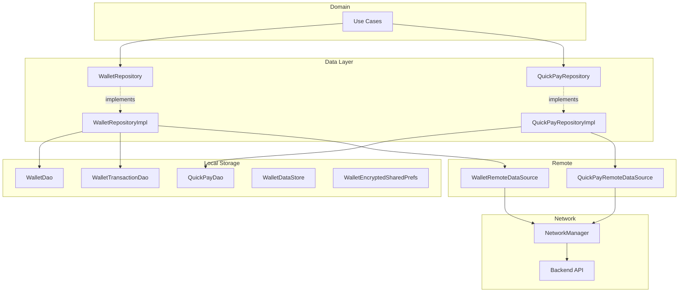
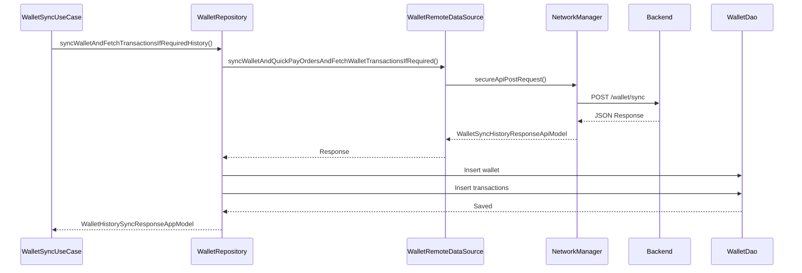
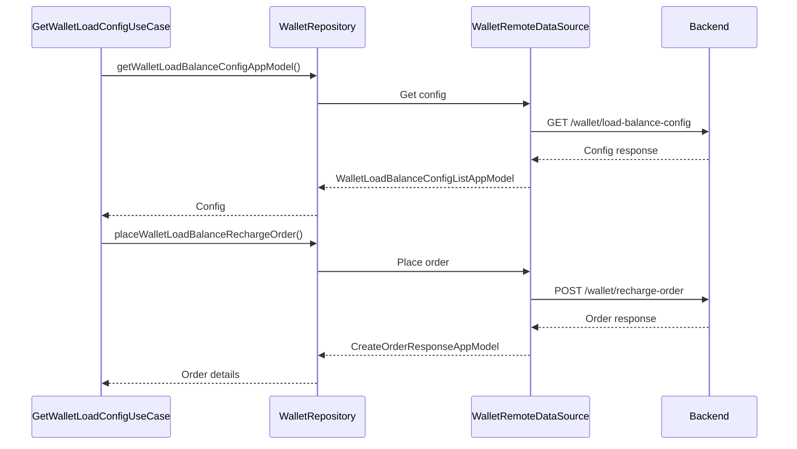
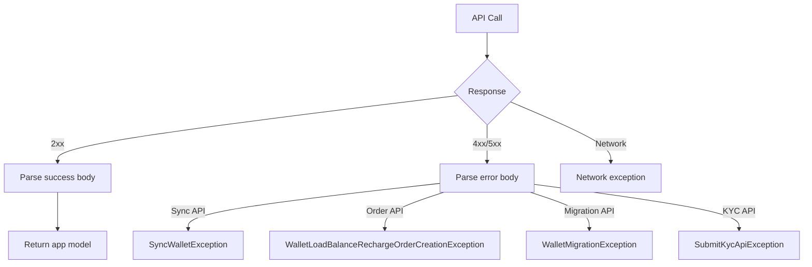

# Chalo Wallet & Quick Pay — Repository Documentation

## Data Layer Overview

The Wallet data layer handles API communication for wallet operations, transaction synchronization, and local persistence. The layer uses WalletRepository for core wallet operations and QuickPayRepository for Quick Pay specific functionality.

---

## Wallet Repository Interface

The `WalletRepository` interface defines all wallet data operations.

### Wallet Access Operations

| Method | Purpose | Returns |
|--------|---------|---------|
| **getWalletAppModel** | Get wallet by userId | WalletAppModel? |
| **getWalletAppModelFlow** | Observe wallet changes | Flow<WalletAppModel> |
| **getWalletStatus** | Get cached status | CachedWalletStatus? |
| **getWalletIdUseCase** | Get wallet ID | String? |

### Wallet Lifecycle Operations

| Method | Purpose | Returns |
|--------|---------|---------|
| **createOrUpdateWallet** | Save wallet | Unit |
| **deleteWalletFromRoomAndUpdateWalletPrefsStorage** | Remove wallet | Unit |
| **updateCachedWalletStatus** | Update local status | Unit |

### Transaction Operations

| Method | Purpose | Returns |
|--------|---------|---------|
| **getWalletTransactionAppModelList** | Get all transactions | List<WalletTransactionAppModel> |
| **getWalletTransactionAppModelListAsFlow** | Observe transactions | Flow<List> |
| **insertWalletTransactionAndUpdateBalance** | Add transaction | Unit |
| **getUnsyncedWalletTransactions** | Get unsynced | List<WalletTransactionAppModel> |

### Balance Operations

| Method | Purpose | Returns |
|--------|---------|---------|
| **updateWalletBalance** | Set new balance | Unit |
| **getWalletLatestSyncedAtTimeStampForUser** | Get last sync time | Long |
| **updateLatestWalletSyncTimeForUser** | Set sync time | Unit |

### Sync Operations

| Method | Purpose | Returns |
|--------|---------|---------|
| **syncWalletAndFetchTransactionsIfRequiredHistory** | Full sync | WalletHistorySyncResponseAppModel |
| **updateWalletAndTransactionsAndMarkUnsyncedTransactionsAsSynced** | Batch update | Unit |

### Load Money Operations

| Method | Purpose | Returns |
|--------|---------|---------|
| **getWalletLoadBalanceConfigAppModel** | Get load config | WalletLoadBalanceConfigListAppModel |
| **placeWalletLoadBalanceRechargeOrder** | Create order | CreateOrderResponseAppModel |
| **insertWalletTransactionAndLoadMoney** | Save load money | Unit |

### Migration Operations

| Method | Purpose | Returns |
|--------|---------|---------|
| **postDeviceIdForWalletMigration** | Migrate device | Boolean |
| **walletAutoReclaim** | Auto reclaim | Boolean |

---

## Quick Pay Repository Interface

The `QuickPayRepository` interface defines Quick Pay specific operations.

### Quick Pay CRUD

| Method | Purpose | Returns |
|--------|---------|---------|
| **saveQuickPay** | Save single Quick Pay | Unit |
| **saveQuickPaysList** | Save multiple | Unit |
| **getAllQuickPaysAsFlow** | Observe all | Flow<List<QuickPayAppModel>> |
| **getActiveQuickPaysAsFlow** | Observe active only | Flow<List<QuickPayAppModel>> |
| **getAllQuickPays** | Get all | List<QuickPayAppModel> |

### Receipt Operations

| Method | Purpose | Returns |
|--------|---------|---------|
| **getQuickPayReceiptsList** | Get receipts | List<QuickPayReceiptAppModel> |
| **fetchQuickPayReceipt** | Fetch single | QuickPayReceiptAppModel |
| **saveQuickPayReceipts** | Save receipts | Unit |

### Expiry Operations

| Method | Purpose | Returns |
|--------|---------|---------|
| **markQuickPayAsExpiredByUpdatingExpiryTime** | Mark expired | Unit |

---

## API Endpoints

### Wallet Sync

Synchronizes wallet state and fetches transaction history.

| Property | Value |
|----------|-------|
| **Endpoint** | POST /wallet/sync |
| **Auth** | Required |

**Request Body: WalletSyncHistoryRequestApiModel**

| Field | Type | Description |
|-------|------|-------------|
| **appVersionCode** | Int | App version |
| **userId** | String | User identifier |
| **walletId** | String? | Wallet ID (if cached) |
| **unSyncedQuickPayOrders** | List<QuickPayAppModel> | Unsynced orders |
| **fetchTransactions** | Boolean | Include transaction history |

**Response: WalletSyncHistoryResponseApiModel**

| Field | Type | Description |
|-------|------|-------------|
| **walletDetails** | WalletResponseApiModel | Wallet data |
| **allWalletTransactions** | AllWalletTransactionsResponseApiModel | Transaction lists |

---

### Get Wallet Load Balance Config

Fetches configuration for wallet recharge.

| Property | Value |
|----------|-------|
| **Endpoint** | GET /wallet/load-balance-config |
| **Auth** | Required |

**Response: WalletLoadBalanceConfigBaseApiResponseModel**

| Field | Type | Description |
|-------|------|-------------|
| **walletConfig** | List<WalletLoadBalanceConfigurationApiResponseModel> | Config entries |

---

### Place Wallet Recharge Order

Creates a recharge order for payment.

| Property | Value |
|----------|-------|
| **Endpoint** | POST /wallet/recharge-order |
| **Auth** | Required |

**Request Body: WalletRechargeOrderRequestApiModel**

| Field | Type | Description |
|-------|------|-------------|
| **amount** | Int | Amount (smallest unit) |
| **configId** | String | Configuration ID |
| **walletId** | String | Wallet ID |
| **cityName** | String | City name |

**Response: CreateOrderResponseAppModel**

| Field | Type | Description |
|-------|------|-------------|
| **orderId** | String | Order ID |
| **transactionId** | String | Transaction ID |
| **amount** | Int | Amount |
| **bookingInfo** | BookingInfo? | Booking details |

---

### Device Migration

Registers device ID for wallet migration.

| Property | Value |
|----------|-------|
| **Endpoint** | POST /wallet/device-migration |
| **Auth** | Required |

**Request Body: WalletMigrationRequestApiModel**

| Field | Type | Description |
|-------|------|-------------|
| **deviceId** | String | Device identifier |
| **walletId** | String | Wallet ID |

**Response: WalletMigrationResponseApiModel**

| Field | Type | Description |
|-------|------|-------------|
| **status** | String | Migration status |
| **walletId** | String? | Wallet ID |

---

### Auto Reclaim

Triggers automatic wallet reclaim.

| Property | Value |
|----------|-------|
| **Endpoint** | POST /wallet/auto-reclaim |
| **Auth** | Required |

**Request/Response:** Same as device migration.

---

### Get Quick Pay Receipts

Fetches Quick Pay receipts for user.

| Property | Value |
|----------|-------|
| **Endpoint** | GET /quickpay/receipts |
| **Auth** | Required |

**Response: List<QuickPayReceiptAppModel>**

| Field | Type | Description |
|-------|------|-------------|
| **transactionId** | String | Transaction ID |
| **orderId** | String | Order ID |
| **receipt_url** | String? | Receipt URL |

---

### KYC Register

Registers user for KYC.

| Property | Value |
|----------|-------|
| **Endpoint** | POST /kyc/register |
| **Auth** | Required |

**Response:**

| Field | Type | Description |
|-------|------|-------------|
| **referenceNum** | String | OTP reference |
| **userId** | String | User ID |

---

### KYC Submit

Submits KYC data with OTP.

| Property | Value |
|----------|-------|
| **Endpoint** | POST /kyc/submit |
| **Auth** | Required |

**Request Body: MinKycSubmitDataRequestApiModelWithOTP**

| Field | Type | Description |
|-------|------|-------------|
| **userId** | String | User ID |
| **city** | String | City name |
| **referenceNum** | String | Registration reference |
| **otp** | String | OTP code |
| **phoneNo** | String | Phone number |
| **userName** | String | User name |

**Response: MinKycSubmitDataResponseAppModel**

| Field | Type | Description |
|-------|------|-------------|
| **kycStatus** | String | KYC status |
| **walletStatus** | String | Wallet status |
| **errorMessage** | String? | Error if failed |

---

## Data Flow Diagrams

### Wallet Sync Flow

### Load Money Order Flow

---

## Data Transformation

### API to App Model Mapping

**Wallet Response:**

| API Field | App Field | Transform |
|-----------|-----------|-----------|
| walletId | walletId | Direct |
| userId | userId | Direct |
| remainingBalance | remainingBalance | Int |
| remainingLoadLimit | remainingLoadLimit | Long |
| status | cachedWalletStatus | Enum mapping |
| walletReclaimTime | walletReclaimTime | Long? |

**Transaction Response:**

| API Field | App Field | Transform |
|-----------|-----------|-----------|
| orderId | orderId | Direct |
| transactionId | transactionId | Direct |
| amount | amount | Int |
| status | transactionStatus | Enum mapping |
| timestamp | transactionTime | Long |

**Status Mapping:**

| API Value | App Enum |
|-----------|----------|
| "ACTIVE" | ACTIVE |
| "TIMEOUT" | WALLET_TIMED_OUT |
| "RECLAIM" | APP_RECLAIM |

---

## Exception Handling

### Exception Flow

### Exception Types

| Exception | When Thrown |
|-----------|-------------|
| **SyncWalletException** | Sync API failed |
| **WalletLoadBalanceRechargeOrderCreationException** | Order creation failed |
| **WalletMigrationException** | Migration failed |
| **WalletAutoReclaimException** | Reclaim failed |
| **WalletRemoteDataException** | Generic API error |
| **QuickPayReceiptFetchFailedException** | Receipt fetch failed |
| **SubmitKycApiException** | KYC API failed |

---

## Local Storage

### Database Entities

**WalletEntity:**

| Field | Type | Description |
|-------|------|-------------|
| **walletId** | String (PK) | Wallet identifier |
| **userId** | String | User identifier |
| **cachedWalletStatus** | String | Status enum value |
| **remainingBalance** | Int | Balance |
| **remainingLoadLimit** | Long | Load limit |
| **walletReclaimTime** | Long? | Reclaim timestamp |

**WalletTransactionEntity:**

| Field | Type | Description |
|-------|------|-------------|
| **id** | Int (PK) | Auto-increment |
| **transactionId** | String | Transaction ID |
| **walletId** | String | Wallet ID |
| **orderId** | String | Order reference |
| **amount** | Int | Amount |
| **status** | String | Status enum |
| **type** | String | Type enum |
| **transactionTime** | Long | Timestamp |
| **synced** | Boolean | Sync status |

**QuickPayEntity:**

| Field | Type | Description |
|-------|------|-------------|
| **id** | Int (PK) | Auto-increment |
| **orderId** | String | Order ID |
| **transactionId** | String | Transaction ID |
| **walletId** | String | Wallet ID |
| **amount** | Int | Amount |
| **status** | String | Status enum |
| **expiryTime** | Long | Expiry timestamp |

**LoadMoneyEntity:**

| Field | Type | Description |
|-------|------|-------------|
| **id** | Int (PK) | Auto-increment |
| **transactionId** | String | Transaction ID |
| **orderId** | String | Order ID |
| **userId** | String | User ID |
| **amount** | Int | Amount |
| **status** | String | Status enum |

### Preferences Storage

**WalletDataStore:**

| Key | Type | Description |
|-----|------|-------------|
| **reclaimDuration** | Long | App reclaim duration |
| **maxQuickPayAmount** | Long | Max Quick Pay |
| **kycStatus** | String | KYC status |
| **noWalletStatus** | String | Initial status |

**WalletEncryptedSharedPrefs:**

Encrypted storage for sensitive wallet data.

---

## Dependency Injection

### Module Bindings

| Interface | Implementation |
|-----------|----------------|
| WalletRepository | WalletRepositoryImpl |
| WalletRemoteDataSource | WalletRemoteDataSourceImpl |
| WalletLocalDataSource | WalletLocalDataSourceImpl |
| QuickPayRepository | QuickPayRepositoryImpl |
| QuickPayRemoteDataSource | QuickPayRemoteDataSourceImpl |

### Repository Dependencies

**WalletRepositoryImpl:**

| Dependency | Purpose |
|------------|---------|
| WalletDao | Local wallet data |
| WalletTransactionDao | Transaction data |
| WalletRemoteDataSource | API calls |
| WalletLocalDataSource | Preferences |
| Data mappers | Model transformation |

**QuickPayRepositoryImpl:**

| Dependency | Purpose |
|------------|---------|
| QuickPayDao | Local Quick Pay data |
| QuickPayRemoteDataSource | API calls |

---

## Network Configuration

### Headers

All wallet API calls include:

| Header | Value |
|--------|-------|
| Authorization | Bearer {token} |
| Content-Type | application/json |
| X-Platform | android/ios |
| X-App-Version | {version} |
| X-Wallet-Id | {walletId} |

### Timeouts

| Operation | Timeout |
|-----------|---------|
| Wallet sync | 30s |
| Load money order | 30s |
| Config fetch | 15s |
| KYC operations | 30s |

### Retry Policy

| Scenario | Retry |
|----------|-------|
| Network timeout | 1 retry |
| 5xx errors | 1 retry |
| 4xx errors | No retry |

---

## Reclaim Logic

### App Reclaim

App-side reclaim prevents sync for a configured duration after wallet is first cached.

| Field | Description |
|-------|-------------|
| **oldestCachedTimestamp** | When wallet first cached |
| **reclaimDuration** | Config duration (~24h) |
| **isInReclaim** | current time < oldest + duration |

### Wallet Timeout

Backend-enforced timeout with different duration.

| State | Behavior |
|-------|----------|
| **WALLET_TIMED_OUT** | Cannot use wallet |
| **Recovery** | Re-sync after timeout clears |
