# Chalo Wallet & Quick Pay — UseCase Documentation

## Domain Layer Overview

The Wallet domain layer handles balance management, transaction synchronization, load money operations, Quick Pay validation, and KYC verification. Use cases coordinate between UI components and repositories, managing complex wallet state including sync, reclaim, and timeout scenarios.

```mermaid
flowchart TB
    subgraph Presentation
        Balance["WalletBalanceComponent"]
        LoadMoney["WalletLoadBalanceEnterAmountComponent"]
        QuickPay["QuickpayTripAmountComponent"]
        KYC["MinKycComponents"]
    end

    subgraph Domain["Domain Layer"]
        subgraph Status["Status Use Cases"]
            GetStatus["GetWalletStatusUseCase"]
            FetchStatus["FetchWalletStatusOnlineUseCase"]
            CheckTimeout["CheckIsWalletTimedOutUseCase"]
        end

        subgraph Sync["Sync Use Cases"]
            WalletSync["WalletSyncUseCase"]
            GetWalletTxns["GetWalletAndAllTransactionsUseCase"]
            AutoReclaim["WalletAutoReclaimUseCase"]
        end

        subgraph LoadMoneyUC["Load Money Use Cases"]
            GetConfig["GetWalletLoadConfigAndPlaceRechargeOrderUseCase"]
            GetDenoms["GetLoadMoneyDenominationsUseCase"]
            ValidateAmount["LoadMoneyAmountValidationUseCase"]
            AddTxnSync["AddProcessingLoadMoneyTransactionsAndSyncWalletUseCase"]
        end

        subgraph QuickPayUC["Quick Pay Use Cases"]
            ValidateQP["ValidateQuickPayUseCase"]
            ValidateAmount2["ValidateQuickPayAmountUseCase"]
            CheckPrereqs["SatisfiesQuickPayPrerequisitesUseCase"]
            SyncReceipts["SyncQuickPayReceiptsUseCase"]
        end

        subgraph KYCUC["KYC Use Cases"]
            Register["RegisterUserUseCase"]
            SubmitKyc["SubmitKycUseCase"]
        end
    end

    subgraph Data
        WalletRepo["WalletRepository"]
        QuickPayRepo["QuickPayRepository"]
    end

    Balance --> GetWalletTxns
    Balance --> WalletSync
    LoadMoney --> GetConfig
    LoadMoney --> AddTxnSync
    QuickPay --> ValidateQP
    KYC --> SubmitKyc
    WalletSync --> WalletRepo
    GetConfig --> WalletRepo
```

---

## Use Case Inventory

| Use Case | Purpose | Called From |
|----------|---------|-------------|
| **GetWalletStatusUseCase** | Get wallet status from cache/backend | WalletAccessManager |
| **FetchWalletStatusOnlineUseCase** | Fetch status from backend | GetWalletStatusUseCase |
| **GetWalletStatusWithoutSyncUseCase** | Get status without triggering sync | Quick checks |
| **GetWalletAndAllTransactionsUseCase** | Get wallet + transactions | WalletBalanceComponent |
| **FetchWalletBalanceUseCase** | Get current balance | Balance display |
| **GetWalletIdUseCase** | Get wallet ID | Various components |
| **WalletSyncUseCase** | Sync wallet with backend | Balance refresh |
| **WalletAutoReclaimUseCase** | Auto-reclaim on timeout | Background |
| **MergeCachedWalletAndFetchedWalletUseCase** | Merge cache with API | WalletSyncUseCase |
| **CheckIsWalletTimedOutUseCase** | Check timeout status | WalletSyncUseCase |
| **CheckIsWalletInAppReclaimUseCase** | Check app reclaim | WalletSyncUseCase |
| **GetWalletLoadConfigAndPlaceRechargeOrderUseCase** | Create recharge order | LoadMoneyComponent |
| **GetLoadMoneyDenominationsUseCase** | Get suggested amounts | LoadMoneyComponent |
| **LoadMoneyAmountValidationUseCase** | Validate amount | LoadMoneyComponent |
| **AddProcessingLoadMoneyTransactionsAndSyncWalletUseCase** | Add transaction and sync | LoadMoneyComponent |
| **ValidateQuickPayUseCase** | Validate balance for Quick Pay | QuickPayComponent |
| **ValidateQuickPayAmountUseCase** | Validate Quick Pay amount | QuickPayComponent |
| **SatisfiesQuickPayPrerequisitesUseCase** | Check Quick Pay prereqs | QuickPayComponent |
| **RefreshQuickPayPrerequisitesUseCase** | Refresh prereqs | QuickPayComponent |
| **GetAllQuickPaysUseCase** | Get all Quick Pay transactions | History |
| **SyncQuickPayReceiptsUseCase** | Sync Quick Pay receipts | Background |
| **RegisterUserUseCase** | Register for KYC | MinKycOtpComponent |
| **SubmitKycUseCase** | Submit KYC data | MinKycOtpComponent |

---

## Get Wallet Status

**Responsibility:** Determines wallet status from cache or backend.

### Flow

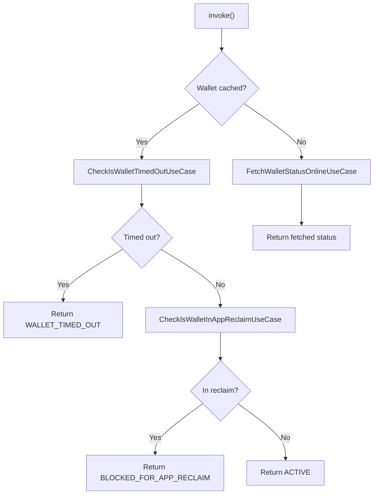

### Output: WalletStatus

| Status | Meaning |
|--------|---------|
| **USER_NOT_LOGGED_IN** | User not authenticated |
| **WALLET_FETCH_PENDING** | Fetching from backend |
| **DOES_NOT_EXIST** | No wallet created |
| **FULL_KYC_NEEDED** | KYC not complete |
| **ACTIVE** | Wallet usable |
| **BLOCKED_FOR_BACKEND_RECLAIM** | Backend reclaim active |
| **BLOCKED_USER** | User blocked |
| **BLOCKED_FOR_APP_RECLAIM** | App reclaim active |
| **WALLET_TIMED_OUT** | Wallet timed out |
| **KYC_INITIATED** | KYC in progress |
| **CHALO_TIME_UNAVAILABLE** | Time sync failed |

---

## Wallet Sync

**Responsibility:** Core sync operation that fetches wallet state and transactions from backend.

### Flow

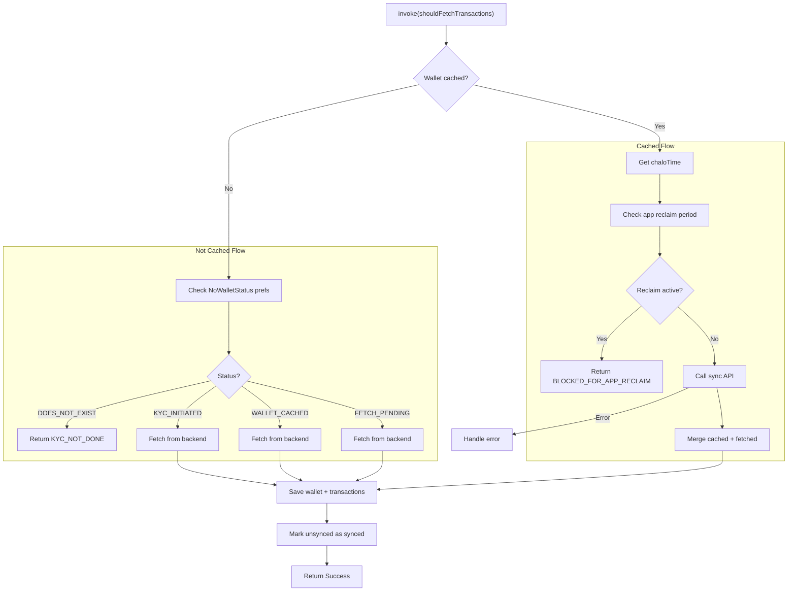

### Input Parameters

| Parameter | Type | Description |
|-----------|------|-------------|
| **shouldFetchTransactions** | Boolean | Include transaction history |

### Output: WalletSyncResult

| Result | Content |
|--------|---------|
| **Success** | WalletAndAllTransactions |
| **Failure** | WalletSyncFailureReason |

### Failure Reasons

| Reason | Description |
|--------|-------------|
| **USER_NOT_LOGGED_IN** | User not authenticated |
| **KYC_NOT_DONE** | KYC incomplete |
| **BLOCKED_FOR_APP_RECLAIM** | App reclaim active |
| **CHALO_TIME_NOT_AVAILABLE** | Time sync failed |
| **API_FETCH_FAILED** | Network error |
| **WALLET_TIMED_OUT** | Timeout exceeded |

### Sync Operations

| Operation | Description |
|-----------|-------------|
| **Merge wallets** | Combine cached and fetched state |
| **Save transactions** | Store LoadMoney, QuickPay, ChaloPay |
| **Mark synced** | Update unsynced transactions |
| **Update timestamps** | Latest sync and oldest cached |

---

## Get Wallet And All Transactions

**Responsibility:** Returns combined wallet model and transaction list as a Flow.

### Flow

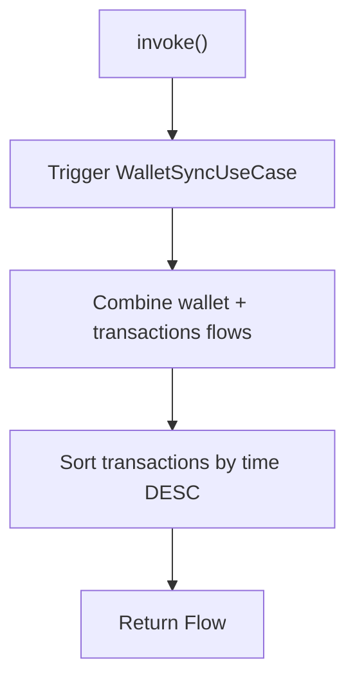

### Output

| Field | Type | Description |
|-------|------|-------------|
| **wallet** | WalletAppModel | Wallet details |
| **allTransactions** | List<WalletTransactionAppModel> | Sorted transactions |

---

## Get Wallet Load Config And Place Recharge Order

**Responsibility:** Fetches wallet load configuration and creates a recharge order.

### Flow

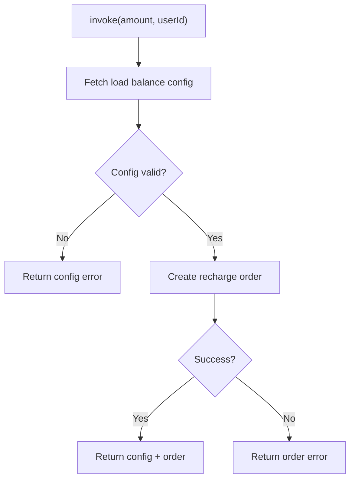

### Input Parameters

| Parameter | Type | Description |
|-----------|------|-------------|
| **amount** | Int | Recharge amount (smallest unit) |
| **userId** | String | User identifier |

### Output: WalletLoadBalanceConfigAndRechargeOrderCombined

| Field | Type | Description |
|-------|------|-------------|
| **walletConfig** | WalletLoadBalanceConfigListAppModel | Load config |
| **rechargeOrderAppModel** | CreateOrderResponseAppModel | Order details |

### Config Validation

| Check | Validation |
|-------|------------|
| **Not empty** | Config list has entries |
| **Valid agency** | Agency info present |
| **Payment modes** | At least one mode |

---

## Load Money Amount Validation

**Responsibility:** Validates user-entered amount against configured limits.

### Flow

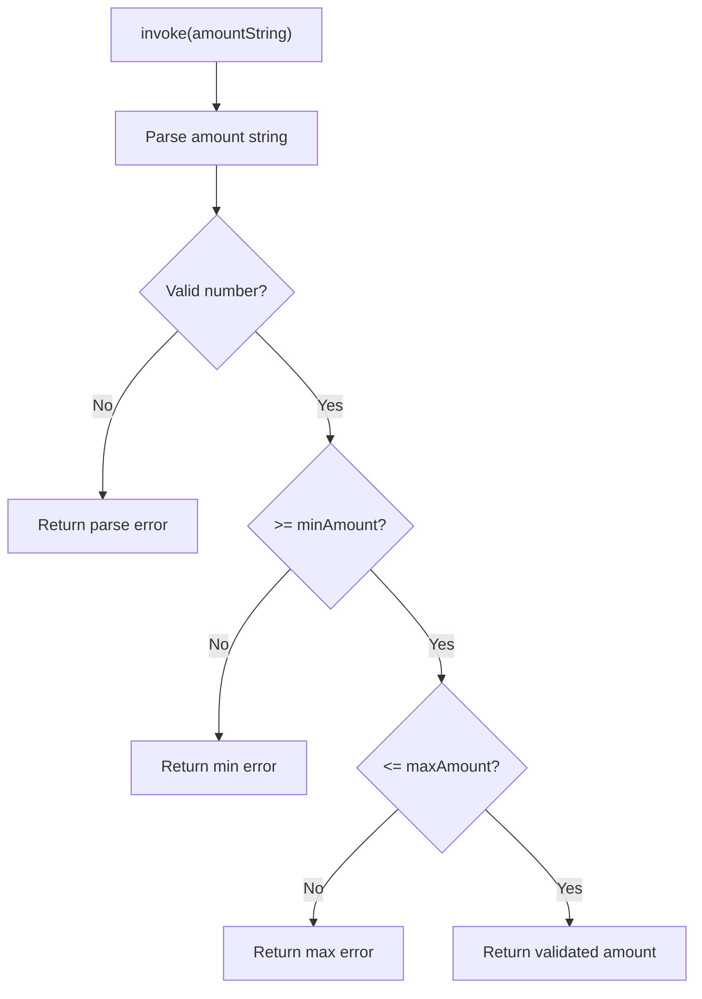

### Output

| Result | Content |
|--------|---------|
| **Success** | Validated amount in smallest unit |
| **Failure** | LoadMoneyValidationError |

### Validation Errors

| Error | Meaning |
|-------|---------|
| **INVALID_FORMAT** | Not a valid number |
| **BELOW_MINIMUM** | Amount too low |
| **ABOVE_MAXIMUM** | Amount too high |

---

## Add Processing Load Money Transactions And Sync Wallet

**Responsibility:** After payment, adds transaction and syncs wallet.

### Flow

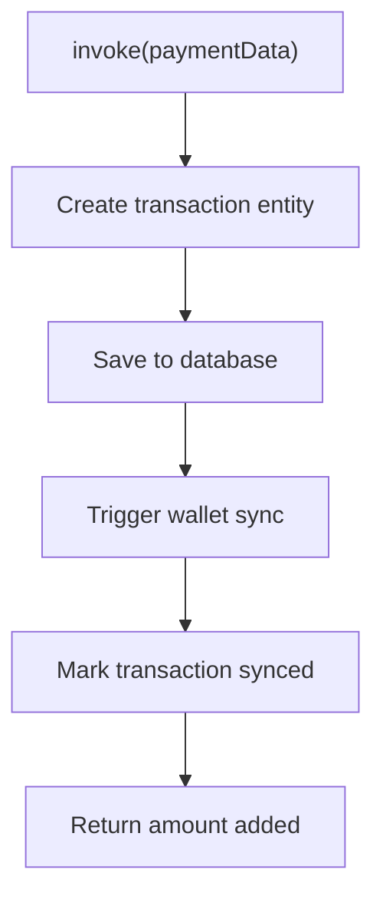

### Input: LoadMoneyPaymentCompleteData

| Field | Type | Description |
|-------|------|-------------|
| **orderId** | String | Order reference |
| **amount** | Int | Recharge amount |
| **transactionTime** | Long | Payment timestamp |
| **transactionId** | String | Transaction ID |
| **paymentMode** | String | Payment method |
| **userId** | String | User ID |
| **walletId** | String | Wallet ID |

---

## Validate Quick Pay

**Responsibility:** Validates that user has sufficient balance for Quick Pay amount.

### Flow

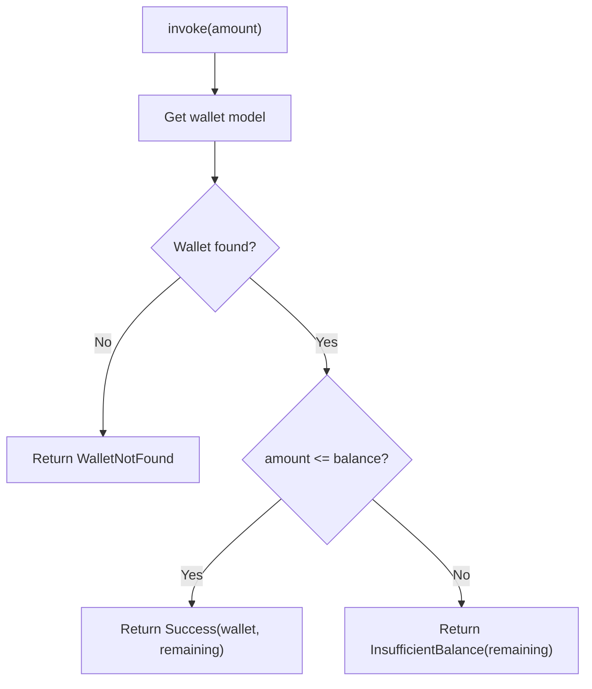

### Output: QuickPayValidationResult

| Result | Content |
|--------|---------|
| **Success** | wallet, remainingBalance |
| **InsufficientBalance** | remainingBalance |
| **WalletNotFound** | — |
| **UserNotFound** | — |
| **GeneralError** | — |

---

## Validate Quick Pay Amount

**Responsibility:** Validates Quick Pay amount format and limits.

### Flow

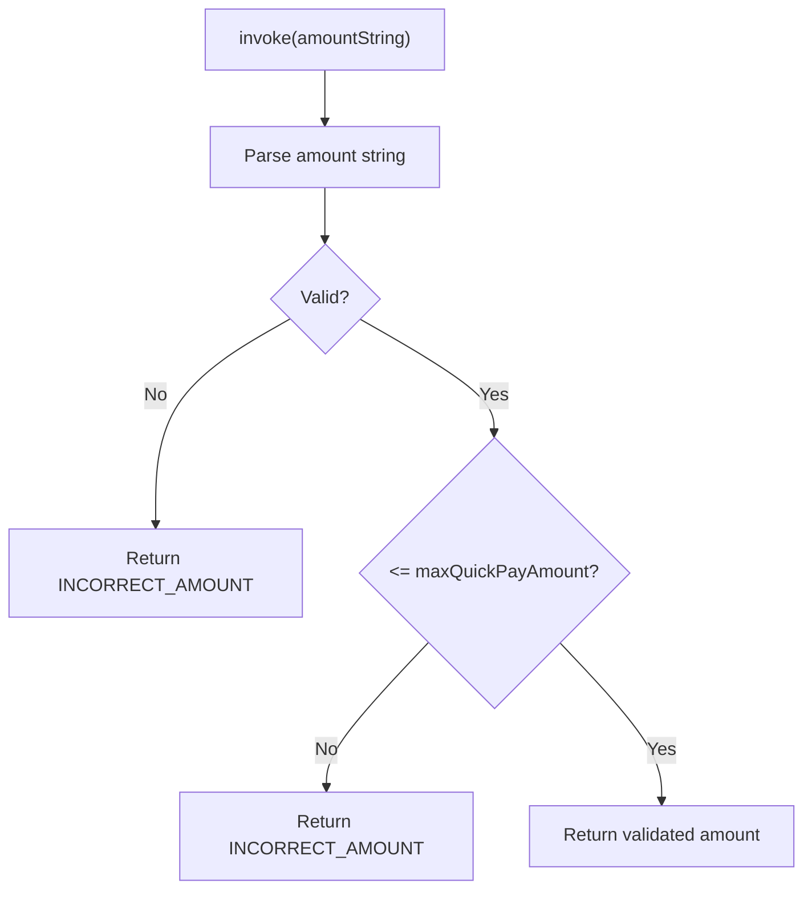

### Output

| Result | TripAmountState |
|--------|-----------------|
| **Success** | CORRECT_AMOUNT |
| **Failure** | INCORRECT_AMOUNT |

---

## Satisfies Quick Pay Prerequisites

**Responsibility:** Checks if user meets all Quick Pay requirements.

### Prerequisites Checked

| Check | Requirement |
|-------|-------------|
| **Wallet active** | Wallet status is ACTIVE |
| **KYC complete** | KYC verified |
| **Device registered** | Device ID linked |

### Output

| Returns | Meaning |
|---------|---------|
| **true** | All prerequisites met |
| **false** | One or more missing |

---

## Register User (KYC)

**Responsibility:** Registers user for wallet KYC.

### Flow

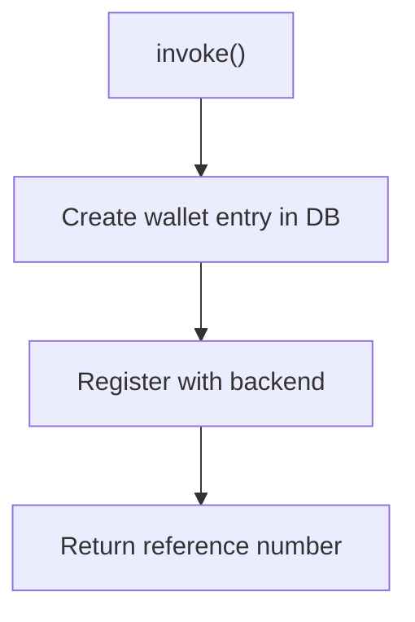

### Output

| Field | Type | Description |
|-------|------|-------------|
| **referenceNum** | String | OTP reference |
| **userId** | String | User identifier |

---

## Submit KYC

**Responsibility:** Submits KYC details with OTP verification.

### Flow

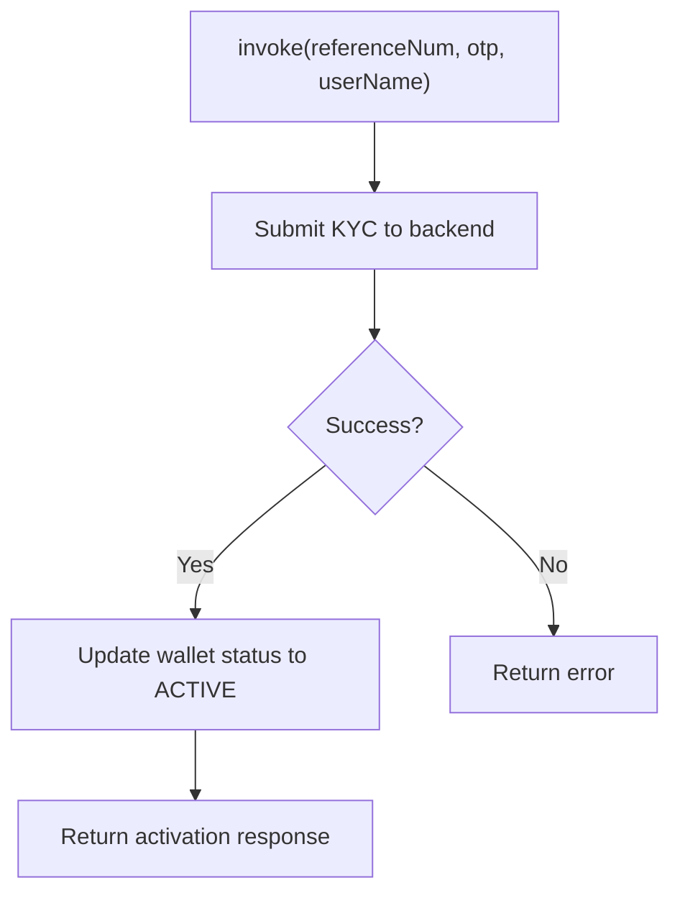

### Input Parameters

| Parameter | Type | Description |
|-----------|------|-------------|
| **referenceNum** | String | From registration |
| **otp** | String | SMS OTP |
| **userName** | String | User's name |

### Output

| Result | Content |
|--------|---------|
| **Success** | MinKycSubmitDataResponseAppModel |
| **Failure** | SubmitKycError |

### KYC Errors

| Error | Description |
|-------|-------------|
| **SubmitKycUiError** | Retryable UI error |
| **GenericError** | Non-retryable error |

---

## Domain Models

### WalletAppModel

| Field | Type | Description |
|-------|------|-------------|
| **walletId** | String | Wallet identifier |
| **userId** | String | User identifier |
| **cachedWalletStatus** | CachedWalletStatus | Local status |
| **remainingBalance** | Int | Balance (smallest unit) |
| **remainingLoadLimit** | Long | Load limit remaining |
| **walletReclaimTime** | Long? | Reclaim timestamp |

### CachedWalletStatus

| Status | Description |
|--------|-------------|
| **ACTIVE** | Wallet usable |
| **APP_RECLAIM** | App-side reclaim |
| **WALLET_TIMED_OUT** | Timeout exceeded |
| **BACKEND_RECLAIM** | Backend reclaim |

### WalletTransactionAppModel

| Field | Type | Description |
|-------|------|-------------|
| **transactionId** | String | Transaction ID |
| **walletId** | String | Wallet ID |
| **userId** | String | User ID |
| **orderId** | String | Order reference |
| **amount** | Int | Amount |
| **transactionStatus** | WalletTransactionStatus | Status |
| **transactionType** | WalletTransactionType | Type |
| **transactionTime** | Long | Timestamp |
| **synced** | Boolean | Sync status |

### WalletTransactionType

| Type | Description |
|------|-------------|
| **QUICK_PAY** | Tap-to-pay |
| **LOAD_MONEY** | Wallet recharge |
| **CHALO_PAY** | Checkout payment |

### WalletTransactionStatus

| Status | Description |
|--------|-------------|
| **PROCESSING** | In progress |
| **COMPLETED** | Success |
| **FAILED** | Failed |
| **RECLAIMED** | Reclaimed |

---

## Business Rules

| Rule | Description | Enforced By |
|------|-------------|-------------|
| **Active wallet required** | Must have active wallet for operations | GetWalletStatusUseCase |
| **KYC required** | KYC must be complete | WalletSyncUseCase |
| **Balance check** | Amount <= balance for Quick Pay | ValidateQuickPayUseCase |
| **Amount limits** | Within min/max for load money | LoadMoneyAmountValidationUseCase |
| **Reclaim period** | No sync during app reclaim | WalletSyncUseCase |

---

## Sequence Diagrams

### Wallet Sync Sequence

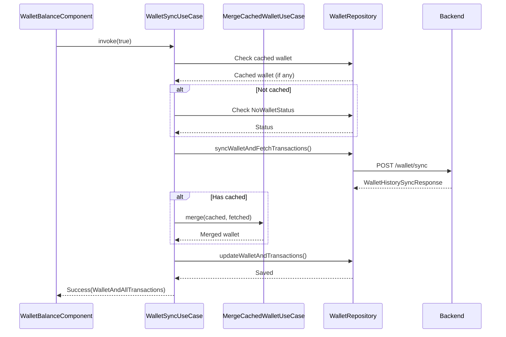

### Load Money Sequence

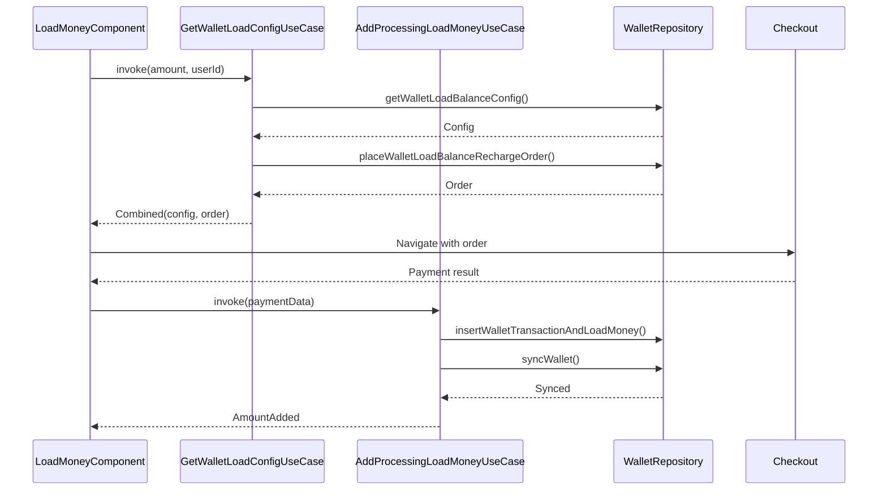

---

## Error Handling

### Exception Types

| Exception | When Thrown |
|-----------|-------------|
| **SyncWalletException** | Sync API failed |
| **WalletLoadBalanceRechargeOrderCreationException** | Order creation failed |
| **SubmitKycApiException** | KYC API failed |

### Recovery Strategies

| Error | Strategy |
|-------|----------|
| **Sync failed** | Use cached data, show retry |
| **Order failed** | Show error, allow retry |
| **KYC failed** | Show specific error, allow retry |
| **Insufficient balance** | Offer load money option |
