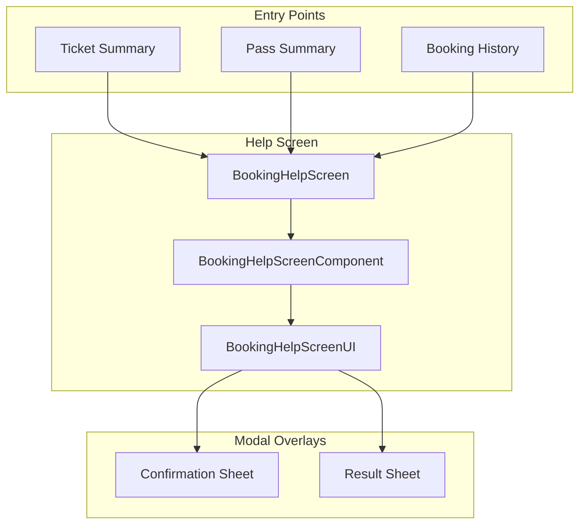
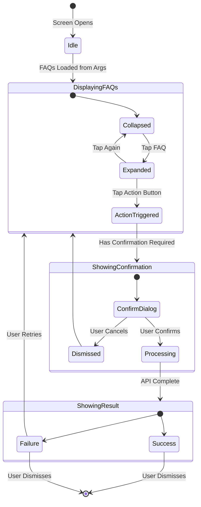
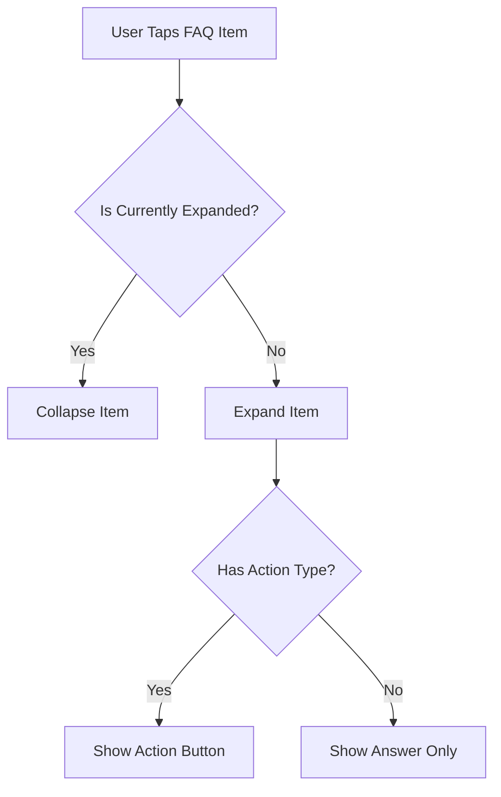
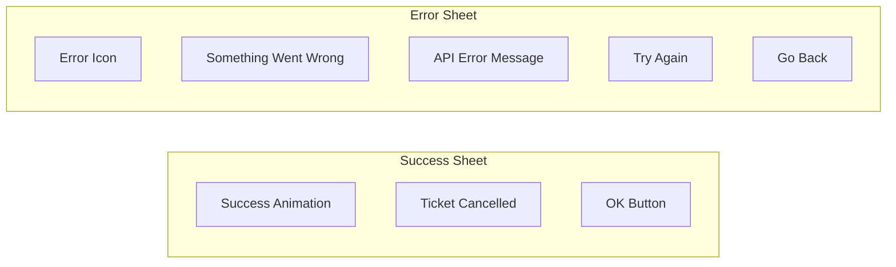
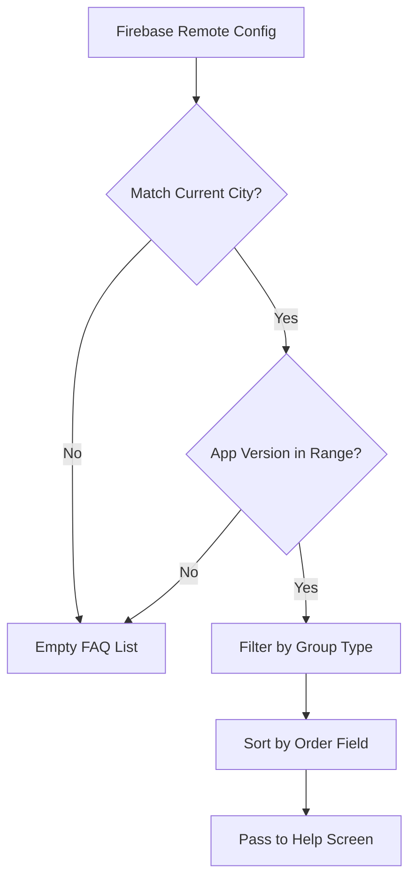

# Help — Component Documentation

## Architecture Overview

The Help feature follows the **Decompose + MVI** pattern. A single screen component manages the entire help experience, including FAQ display, action triggering, and cancellation confirmation flows.

---

## Screen Overview

The Help feature consists of a single main screen with modal overlays for confirmations and results.

| Screen | Purpose | Entry From | Modal Overlays |
|--------|---------|------------|----------------|
| **Help Screen** | Display FAQs and handle booking actions | Ticket/Pass summary, History | Confirmation, Success, Error |

---

## Help Screen

**Purpose:** Displays contextual FAQs for a booking and enables users to take actions like cancellation.

### User Journey

1. User taps "Need Help?" from booking details
2. Screen displays list of FAQs relevant to current city
3. User expands FAQ to read the answer
4. If FAQ has an action (e.g., "Cancel Booking"), action button appears
5. User taps action → Confirmation dialog appears
6. User confirms → API call made → Result dialog shows success/failure

### State Flow

### FAQ Display

Each FAQ item contains:

| Element | Description |
|---------|-------------|
| **Question** | Collapsible header text |
| **Answer** | Detailed explanation (shown when expanded) |
| **Action Button** | Optional CTA for actionable FAQs (e.g., "Cancel Booking") |
| **Order** | Determines display sequence |

### Expansion Behavior

---

## Modal Overlays

The Help screen uses bottom sheet modals for confirmations and results.

### Bottom Sheet Types

| Type | Purpose | Buttons |
|------|---------|---------|
| **Cancellation Success** | Confirms ticket was cancelled | OK |
| **Cancellation Failed** | Shows error with retry option | Try Again, Go Back |

### Result Dialog Flows

### Bottom Sheet Dismissal

| Sheet Type | Positive Button | Negative Button | Swipe Dismiss |
|------------|-----------------|-----------------|---------------|
| Success | Navigate back | — | Not allowed |
| Failed | Retry cancellation | Return to FAQ | Allowed |

---

## Component State Management

The screen component maintains internal state that transforms into view state for the UI.

### State Categories

| Category | Description |
|----------|-------------|
| **FAQ State** | List of FAQs, expansion states per item |
| **Dialog State** | Which bottom sheet is showing, if any |
| **Loading State** | Whether a cancellation is in progress |
| **Booking Context** | Current booking ID for cancellation API |

### Intent Types

| Intent | Trigger | Effect |
|--------|---------|--------|
| **Initialization** | Screen opens | Load FAQs from navigation args |
| **FAQ Action Clicked** | User taps action button | Show confirmation or execute action |
| **Bottom Sheet Positive** | User taps OK/Retry | Navigate back or retry API call |
| **Bottom Sheet Negative** | User taps Go Back | Hide sheet, return to FAQs |
| **Bottom Sheet Dismissed** | User swipes away sheet | Reset dialog state |

### Side Effects

| Effect | Trigger | Behavior |
|--------|---------|----------|
| **Navigate Back** | Successful cancellation confirmed | Pop to previous screen |
| **Update Result State** | Cancellation completes | Notify parent to refresh booking list |

---

## Navigation

### Entry Points

| Source | Data Passed |
|--------|-------------|
| Ticket Summary | Booking ID, pre-fetched FAQ list |
| Pass Summary | Booking ID, pre-fetched FAQ list |
| Booking History | Booking ID, pre-fetched FAQ list |

The FAQ list is fetched before navigation and passed as arguments, so the Help screen displays immediately without loading.

### Exit Behaviors

| Trigger | Destination |
|---------|-------------|
| Back button | Previous screen (booking details) |
| Cancellation success confirmed | Previous screen + booking list refresh |
| External support action | Chat SDK or WebView |

---

## FAQ Configuration

FAQs are loaded from Firebase Remote Config before navigating to the Help screen.

### City-Specific Loading

### FAQ Action Types

| Action Type | Behavior |
|-------------|----------|
| **None** | Informational only — no action button displayed |
| **Cancel Booking** | Shows action button that triggers cancellation flow |

---

## Analytics Events

| Event | Trigger |
|-------|---------|
| `booking_help_screen_opened` | Screen displays |
| `booking_help_faq_action_clicked` | User taps action button on FAQ |
| `booking_help_bottom_sheet_positive_button_clicked` | User confirms in result dialog |
| `booking_help_bottom_sheet_negative_button_clicked` | User declines in error dialog |
| `booking_cancel_api_success` | Cancellation API returns success |
| `booking_cancel_api_failure` | Cancellation API returns error |

---

## Error States

| Scenario | UI Response |
|----------|-------------|
| Empty FAQ list | Empty state with "No FAQs available" message |
| Cancellation failed | Error bottom sheet with API error message |
| Network error | Error bottom sheet with retry option |
| Invalid booking ID | Error message from API displayed in sheet |
