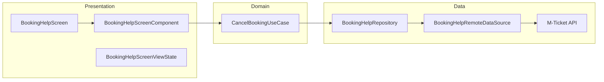

# Help — High-Level Design

## Overview

The Help feature provides booking assistance and FAQ functionality within the Chalo app. Users can access contextual help for their bookings, view frequently asked questions, and initiate booking cancellations directly from the help screen. The feature integrates with remote configuration to provide city-specific FAQs.

## User Journey

1. **Entry Points**:
   - Booking details screen → "Help" button
   - Ticket/pass summary → "Need Help?" option
   - History screen → Help action on booking item

2. **Core Flow**:
   - View FAQ list with expandable questions
   - Read detailed answers for each FAQ
   - Trigger actions (e.g., cancel booking) from FAQ items
   - Confirm cancellation via bottom sheet dialog
   - View success/failure result

3. **Exit Points**:
   - Back navigation to previous screen
   - Successful cancellation → Returns to booking list
   - External links (chat support, call center)

## Architecture Diagram

## Key Components

| Component | Platform | File Path | Responsibility |
|-----------|----------|-----------|----------------|
| `BookingHelpScreen` | Shared | `shared/home/.../appsupport/BookingHelpScreen.kt` | Main composable entry point |
| `BookingHelpScreenUI` | Shared | `shared/home/.../appsupport/BookingHelpScreenUI.kt` | UI implementation with FAQ list |
| `BookingHelpScreenComponent` | Shared | `shared/home/.../appsupport/BookingHelpScreenComponent.kt` | MVI component managing state |
| `CancelBookingUseCase` | Shared | `shared/home/.../appsupport/domain/CancelBookingUseCase.kt` | Business logic for cancellation |
| `BookingHelpRepository` | Shared | `shared/home/.../appsupport/data/repository/BookingHelpRepository.kt` | Data access abstraction |

## Data Flow

### Request Path
1. User opens help screen with `BookingHelpArgs(bookingId, faqList)`
2. `BookingHelpScreenComponent` receives `InitialisationIntent`
3. FAQs are rendered from args (pre-fetched from remote config)
4. User clicks FAQ action (e.g., "Cancel Booking")
5. Confirmation dialog shown via `showConfirmSosDialog` state
6. `CancelBookingUseCase` called with booking ID
7. API request sent to `mticketing/v2/multimodal/booking-cancel`

### Response Path
1. API returns `CancelBookingResponseApiModel` with status
2. Repository maps to `CancelBookingAppModel`
3. UseCase returns `ChaloUseCaseResult<Success|Failure>`
4. Component updates state with bottom sheet type
5. UI shows success or error bottom sheet modal

## Platform Differences

### Android-Specific
- Uses Compose `BottomSheetScaffold` for modal dialogs
- Native date formatting via `SimpleDateFormat`

### iOS-Specific
- Bottom sheets use SwiftUI `sheet` modifier via SKIE interop
- Same shared component logic

## Integration Points

### Analytics Events
- See [Analytics: help](/analytics/flows/help) for event documentation
- Key events:
  - `booking_help_screen_opened`
  - `booking_help_faq_action_clicked`
  - `booking_help_bottom_sheet_positive_button_clicked`
  - `booking_cancel_api_success`
  - `booking_cancel_api_failure`

### Shared Services
- **Remote Config**: FAQ list fetched from `BookingHelpRemoteConfigApiModel`
- **Networking**: Uses `NetworkManager` for API calls
- **Analytics**: `AnalyticsContract` for event tracking

### Navigation
- **Navigates to**: External chat support (Freshchat), WebView
- **Navigated from**: Ticket summary, Pass summary, History screen

## Edge Cases & Error Handling

| Scenario | Handling |
|----------|----------|
| Network failure | Shows error bottom sheet with retry option |
| Cancellation failed | Displays error message from API in bottom sheet |
| Empty FAQ list | Shows empty state (no FAQs configured for city) |
| Invalid booking ID | API returns error, shown in bottom sheet |

## API Endpoints

| Endpoint | Method | Purpose |
|----------|--------|---------|
| `mticketing/v2/multimodal/booking-cancel` | POST | Cancel a booking |

## Dependencies

### Internal
- `shared:chalo-base` — Base MVI component, models
- `shared:network` — HTTP client, network manager

### External
- Ktor — HTTP client
- Kotlinx Serialization — JSON parsing
