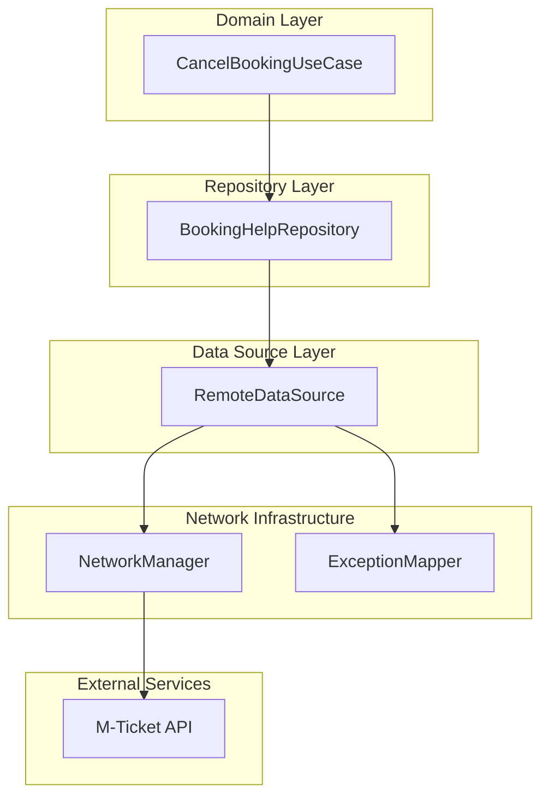
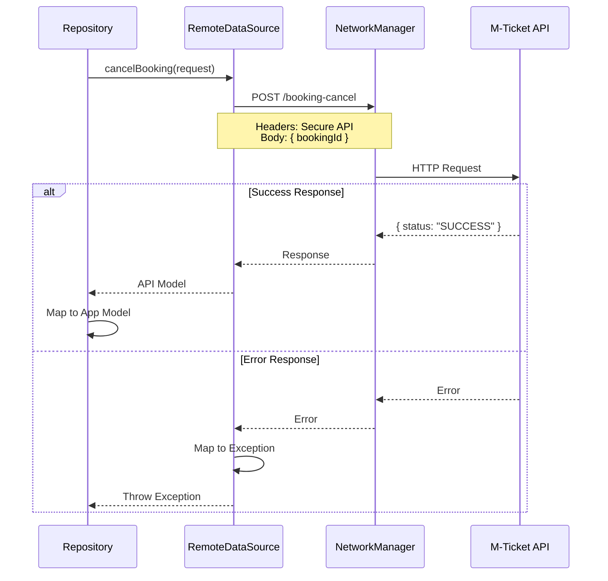
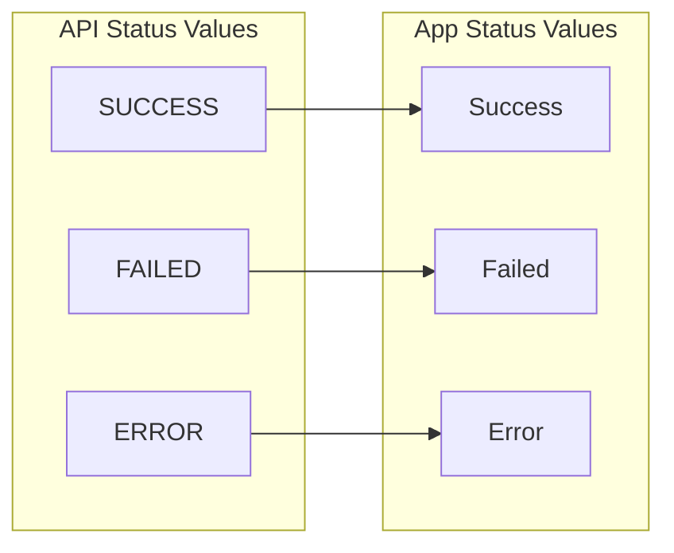
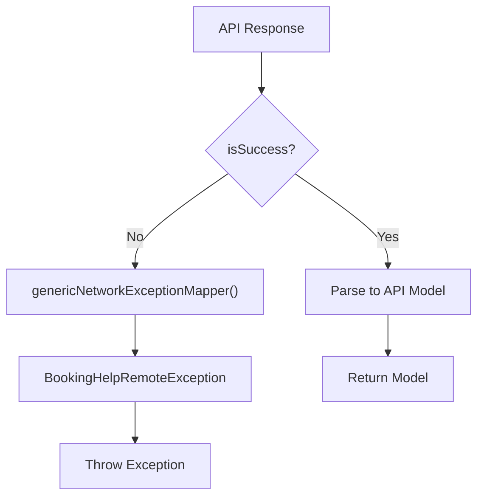
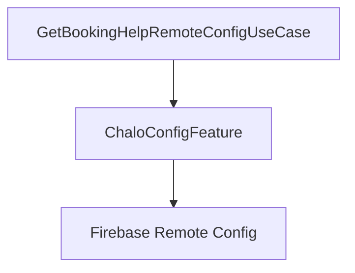
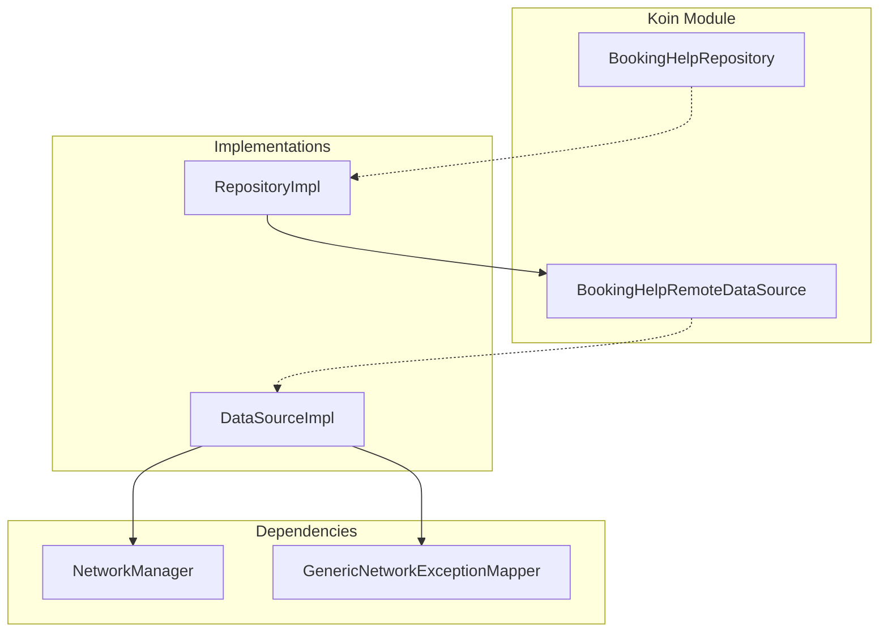

# Help — Repository Documentation

## Data Layer Overview

The data layer handles external data operations for the Help feature. It follows the **Repository Pattern** where:

- **Repository** provides a clean API to the domain layer
- **Remote Data Source** handles HTTP communication
- **Exception Mapper** transforms network errors to typed exceptions

---

## Repository Operations

| Operation | Purpose | Caching |
|-----------|---------|---------|
| **Cancel Booking** | Cancel a booking by ID | None (transactional) |

Booking cancellation is a transactional operation that must always hit the server — no local caching is used.

---

## API Endpoints

### Cancel Booking

Cancels a booking and returns the result status.

| Property | Value |
|----------|-------|
| **Endpoint** | `mticketing/v2/multimodal/booking-cancel` |
| **Method** | POST |
| **Auth** | Required (Secure API Headers) |
| **Content-Type** | application/json |

**Request Body:**

| Field | Type | Description |
|-------|------|-------------|
| **bookingId** | String | The booking ID to cancel |

**Response:**

| Field | Type | Description |
|-------|------|-------------|
| **status** | Enum | SUCCESS, FAILED, or ERROR |
| **message** | String? | Optional message from server |

---

## Data Flow

### Cancel Booking Flow

---

## Data Transformations

### API to App Model Mapping

When the cancellation response is received, it's transformed for the domain layer:

| API Field | App Field | Transformation |
|-----------|-----------|----------------|
| `status` | Status enum | SUCCESS → Success, FAILED → Failed, ERROR → Error |
| `message` | Message | Direct passthrough |

### Status Mapping

---

## Exception Handling

### Error Mapping Flow

### Exception Types

| Scenario | Exception | Contains |
|----------|-----------|----------|
| Network failure | IOException (wrapped) | Connectivity info |
| Server error (4xx/5xx) | BookingHelpRemoteException | Error code + message |
| Invalid JSON | NetworkSuccessResponseParseException | Parse details |
| Booking not found | BookingHelpRemoteException | Server error message |

### Exception Information

The remote exception carries:

| Field | Purpose |
|-------|---------|
| **Error Response** | Full error response from server |
| **Message** | Human-readable error message |
| **Error Code** | Numeric error code (if available) |

---

## Remote Config Data Source

FAQ configuration is fetched separately via Firebase Remote Config (not through the repository pattern).

### Config Loading Path

### Remote Config Structure

The FAQ configuration JSON contains city-specific FAQ lists:

| Level | Field | Description |
|-------|-------|-------------|
| Root | cityWiseConfigList | Array of city configs |
| City | cityName | City identifier |
| City | minVer | Minimum app version |
| City | maxVer | Maximum app version |
| City | faqList | Array of FAQ items |
| FAQ | question | Question text |
| FAQ | answer | Answer text |
| FAQ | actionType | NONE or CANCEL_BOOKING |
| FAQ | order | Display order |
| FAQ | groupType | Generic (currently only option) |
| FAQ | isExpanded | Default expansion state |

### Config Validity

A city config is valid when:
- City name is not empty
- FAQ list is not empty
- Current app version is within minVer..maxVer range

---

## Local Storage

This feature does **not** use local storage for either:

- **Cancellation results** — Transactional, no caching needed
- **FAQ configuration** — Cached in memory by Remote Config SDK

Rationale:
- Cancellation is a one-time action with immediate server feedback
- FAQs are fetched fresh on each app session via Firebase Remote Config
- No sensitive data needs to persist locally

---

## Network Infrastructure

### Request Building

All API calls use the shared network infrastructure:

| Component | Responsibility |
|-----------|----------------|
| **NetworkManager** | HTTP client wrapper |
| **StandardNetworkRequestBuilder** | Request configuration |
| **Secure API Headers** | Authentication headers |
| **processSync()** | Synchronous execution |

### Security

| Aspect | Implementation |
|--------|----------------|
| **Authentication** | Secure API headers added to all requests |
| **Transport** | HTTPS only |
| **Error Masking** | Server error codes mapped to typed exceptions |

---

## Dependency Injection

### Koin Bindings

| Interface | Implementation |
|-----------|----------------|
| BookingHelpRemoteDataSource | BookingHelpRemoteDataSourceImpl |
| BookingHelpRepository | BookingHelpRepositoryImpl |

### Dependency Graph

---

## Error Handling Summary

| Scenario | Exception Type | User-Facing Result |
|----------|----------------|-------------------|
| Network failure | Wrapped IOException | "Check your connection" |
| Server error (4xx/5xx) | BookingHelpRemoteException | Error message from server |
| Invalid response JSON | NetworkSuccessResponseParseException | "Something went wrong" |
| Booking not found | BookingHelpRemoteException | "Booking not found" |
