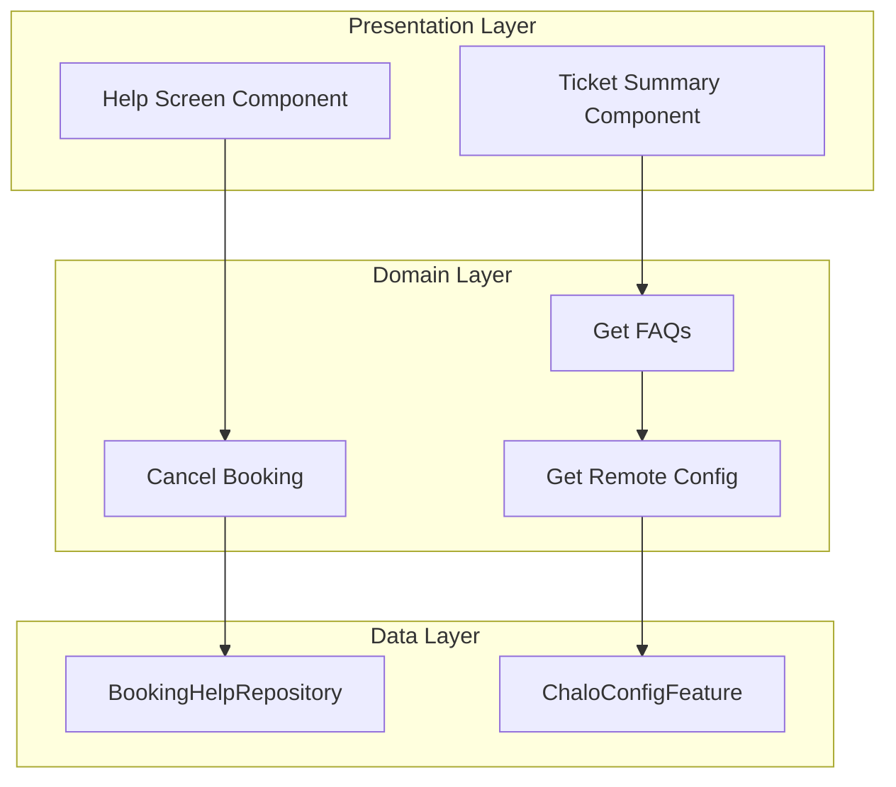
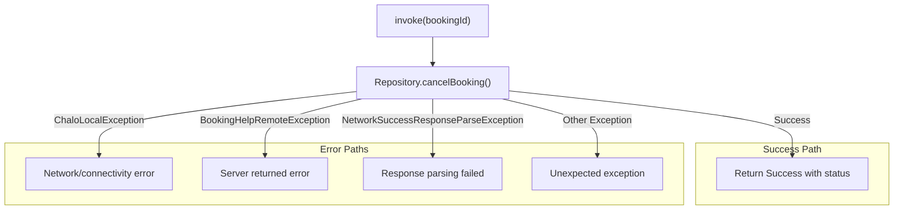
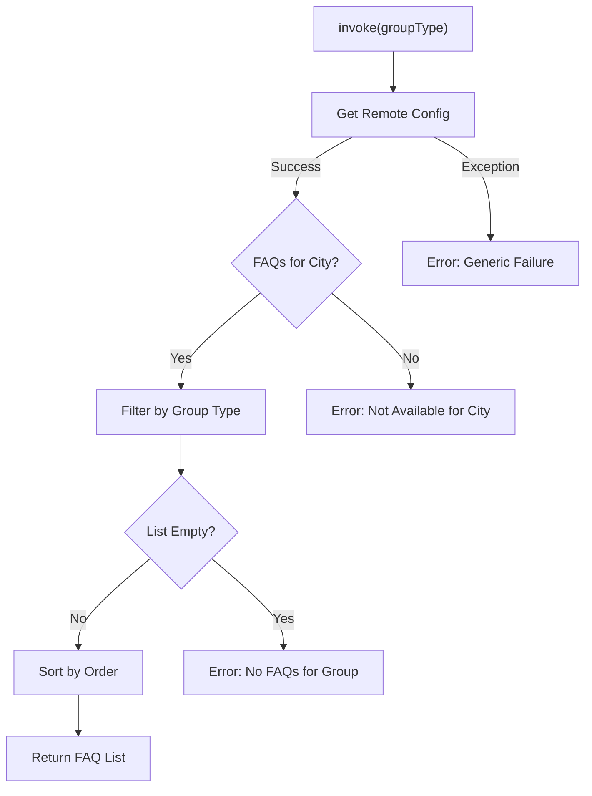
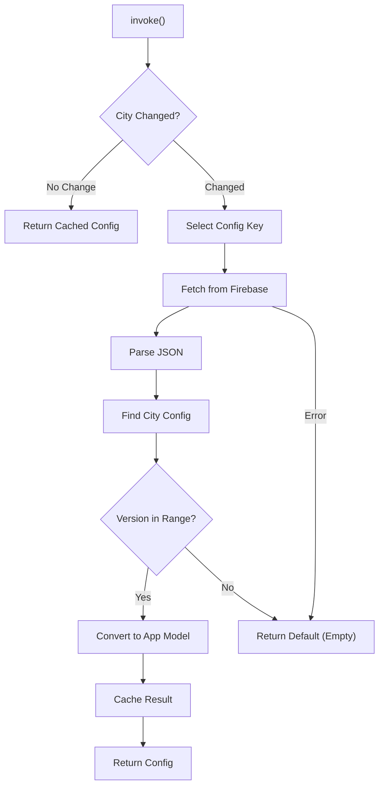
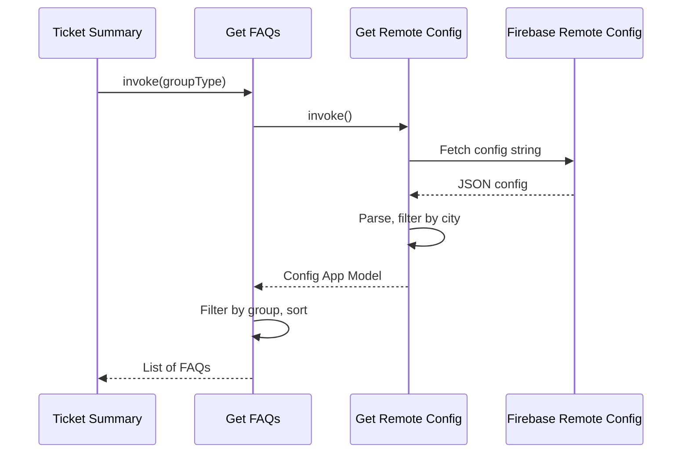
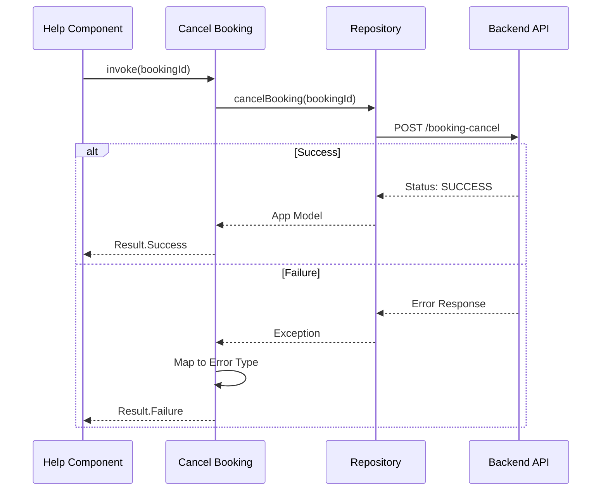

# Help — UseCase Documentation

## Domain Layer Overview

The domain layer encapsulates business logic for the Help feature. Use cases handle booking cancellation and FAQ retrieval with proper error mapping.

---

## Use Case Inventory

| Use Case | Purpose | Called From |
|----------|---------|-------------|
| **Cancel Booking** | Execute booking cancellation with error handling | Help Screen |
| **Get FAQs** | Fetch and filter FAQs for current city/group | Ticket Summary |
| **Get Remote Config** | Load city-specific FAQ configuration | Get FAQs UseCase |

---

## Cancel Booking

**Responsibility:** Executes booking cancellation API call and maps all possible errors to typed results.

### Cancellation Flow

### Error Type Mapping

| Exception Caught | Error Type | Information Extracted |
|------------------|------------|----------------------|
| Local Exception | Local Error | Exception message |
| Remote Exception | API Error | Server message + error code |
| Parse Exception | Response Parsing | Static error indicator |
| Any Other | Unknown Error | Exception message |

### Cancellation Response

The cancellation result contains:

| Field | Description |
|-------|-------------|
| **Status** | Success, Failed, or Error |
| **Message** | Optional message from server |

### Status Values

| Status | Meaning | UI Treatment |
|--------|---------|--------------|
| **Success** | Booking was cancelled | Show success bottom sheet |
| **Failed** | Server rejected cancellation | Show error with message |
| **Error** | Unexpected server error | Show generic error with retry |

---

## Get FAQs

**Responsibility:** Fetches FAQ configuration and filters it for the current city and group type.

### FAQ Loading Flow

### Filtering Logic

1. **City Filter:** Match config's city name against user's current city
2. **Group Filter:** Match FAQ's group type against requested group
3. **Version Filter:** Ensure current app version is within min/max range
4. **Order Sort:** Sort remaining FAQs by their order field (ascending)

### Error Types

| Error | Cause | Handling |
|-------|-------|----------|
| **Not Available for City** | No FAQ config exists for user's city | Show empty state |
| **No FAQs for Group** | City has FAQs, but none for requested group | Show empty state |
| **Generic** | Config fetch or parsing failed | Show error state |

---

## Get Remote Config

**Responsibility:** Loads city-specific FAQ configuration from Firebase Remote Config with in-memory caching.

### Config Loading Flow

### Config Key Selection

| Build Flavor | Config Key |
|--------------|------------|
| Debug | `bookingHelpConfigDev` |
| Beta/Alpha | `bookingHelpConfigBeta` |
| Production | `bookingHelpConfigProd` |

### Version Validation

Each city's config includes version bounds:

| Field | Purpose |
|-------|---------|
| **minVer** | Minimum app version (inclusive) |
| **maxVer** | Maximum app version (inclusive) |

A config is valid only if the current app version falls within this range. This allows gradual rollout of FAQ changes.

### Caching Behavior

- Config is cached in memory per city
- Cache invalidated when user changes city
- Cache cleared on app restart
- Failed fetches return empty default (graceful degradation)

---

## Domain Models

### FAQ Item

| Field | Type | Description |
|-------|------|-------------|
| **Question** | String | The FAQ question text |
| **Answer** | String | The detailed answer |
| **Action Type** | Enum | None or Cancel Booking |
| **Order** | Integer | Display order (ascending) |
| **Group Type** | Enum | Category for filtering |
| **Is Expanded** | Boolean | Default expansion state |

### FAQ Action Types

| Type | Description |
|------|-------------|
| **None** | Informational FAQ — no action available |
| **Cancel Booking** | FAQ that enables booking cancellation |

### FAQ Group Types

| Type | Description |
|------|-------------|
| **Generic** | General help questions |

Currently only one group type exists, but the architecture supports adding more (e.g., Payment, Refund, Schedule).

### Cancel Booking Result

| Field | Type | Description |
|-------|------|-------------|
| **Status** | Enum | Success, Failed, or Error |
| **Message** | String? | Optional message from API |

---

## Business Rules

| Rule | Description | Enforced By |
|------|-------------|-------------|
| **City filtering** | FAQs filtered by user's current city | Get Remote Config |
| **Version range** | Config valid only within minVer–maxVer | Get Remote Config |
| **Group filtering** | FAQs filtered by requested group type | Get FAQs |
| **Order sorting** | FAQs sorted by order field | Get FAQs |
| **Graceful degradation** | Returns empty list on failure | All use cases |

---

## UseCase Interaction

### FAQ Fetch Sequence

### Cancellation Sequence

