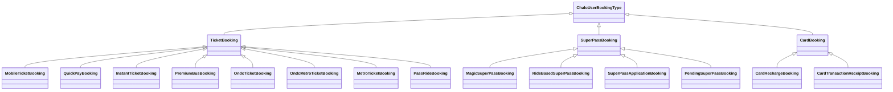

# History - Component Documentation

## Architecture Overview

The History presentation layer follows a Decompose component architecture with MVI (Model-View-Intent) pattern. The primary container is `MyTicketsComponent`, which orchestrates the display of all user bookings across product types. Product-specific summary screens handle detailed views, trip histories, and actions like invoice downloads. The architecture uses `ChaloBaseStateMviComponent` as the base class, providing standardized state management with DataState for business logic and ViewState for UI rendering.

---

## Screen Inventory

| Screen | Component | File Path | Purpose |
|--------|-----------|-----------|---------|
| My Tickets | MyTicketsComponent | `shared/home/.../ui/history/MyTicketsComponent.kt` | Main history list with Active/Expired tabs |
| Ticket Summary | TicketSummaryComponent | `shared/home/.../productsummary/ui/ticket/TicketSummaryComponent.kt` | M-Ticket, Instant, Premium Bus, ONDC, Metro ticket details |
| Pass Summary | PassSummaryComponent | `shared/home/.../productsummary/ui/pass/PassSummaryComponent.kt` | Super Pass summary with trip history link |
| Ride Receipt | RideReceiptComponent | `shared/home/.../tripreceipt/tripreceiptnew/RideReceiptComponent.kt` | Individual trip receipt list for passes |

---

## MyTicketsComponent

The MyTicketsComponent serves as the primary entry point for viewing booking history. It extends `ChaloBaseStateMviComponent` and manages a complex state including active/expired tabs, quick filters, product reclaim, notification permissions, and bottom sheet interactions.

### Component Declaration

The component accepts over 40 dependencies through constructor injection, including use cases for product fetching, activation, configuration, sync operations, and various utility providers. Key dependencies include:

| Dependency | Purpose |
|------------|---------|
| `getAllRequestedBookedProductsUseCase` | Fetch all user bookings across product types |
| `initiateProductHistorySyncCallUseCase` | Sync product history from server |
| `runPreActivationChecksUseCase` | Validate product before activation |
| `activateProductIfRequiredUseCase` | Activate product for use |
| `getBookableProductConfigForRenewUseCase` | Get config for rebooking |
| `fetchHistoryScreenConfigDataUseCase` | Fetch screen configuration |
| `isNotificationPermissionGrantedUseCase` | Check notification permission status |
| `homeTabVisibilityController` | Track tab visibility for lifecycle |

### State Management

The component maintains two state types following MVI architecture:

**MyTicketsDataState** - Business logic state:

| Field | Type | Description |
|-------|------|-------------|
| `tabMetaData` | TabMetaDataAppModel | Tab configuration from server |
| `productsTabList` | List<TicketsPassesTabType> | Available tabs (ACTIVE, EXPIRED) |
| `bookingTypeList` | List<ChaloUserBookingType>? | Active bookings |
| `expiredBookingTypeList` | List<ChaloUserBookingType>? | Expired bookings |
| `currentlySelectedTab` | TicketsPassesTabType | Currently selected tab |
| `bottomSheetType` | TicketsScreenBottomSheetType? | Active bottom sheet |
| `gridItemDataList` | List<TicketsPageGridItemData>? | Grid item data for empty state |
| `premiumBusBookingDataMap` | Map<String, PremiumBusBookingCardData> | Premium bus specific data |
| `shouldShowReclaimCard` | Boolean | Show product reclaim UI |
| `alertDialogType` | TicketsPageAlertDialogType? | Active dialog type |
| `showLoadingDialog` | Boolean | Loading overlay visibility |
| `isLoading` | Boolean | Initial loading state |
| `layoutType` | TicketsPageLayoutType | Screen layout mode |
| `activeTabUiMetaData` | TabUiMetaData | Active tab UI metadata |
| `expiredTabUiMetaData` | TabUiMetaData | Expired tab UI metadata |
| `retainedState` | HomeTabScreensRetainedData.MyTicketsScreen? | Retained navigation state |

**MyTicketsViewState** - UI rendering state:

| Field | Type | Description |
|-------|------|-------------|
| `layoutType` | TicketsPageLayoutType | TICKETS_PASSES_SECTION or NOTIFICATION_TURN_ON_EXPLAINER |
| `isActiveTabSelected` | Boolean | Tab selection state |
| `tabHeaderUiState` | TabHeaderUiState? | Tab header configuration |
| `productTabUiState` | ProductsTabUiState | Tab selector UI state |
| `activeTicketUiStateList` | List<BusTicketsUiState>? | Active ticket cards |
| `activePassUiStateList` | List<BusPassUiState>? | Active pass cards |
| `expiredTicketUiStateList` | List<BusTicketsUiState>? | Expired ticket cards |
| `expiredPassUiStateList` | List<BusPassUiState>? | Expired pass cards |
| `bottomSheetUiStateType` | MyTicketBottomSheetUiState | Bottom sheet configuration |
| `productReclaimUiState` | ProductReclaimUiState? | Reclaim card UI state |
| `confirmationDialogUiState` | ConfirmationDialogUiState? | Dialog configuration |
| `showLoadingShimmer` | Boolean | Shimmer loading effect |
| `myTicketFloatingButtonContainerUiState` | TicketsFloatingButtonContainerUiState? | Floating action button state |
| `ticketsSectionDividerState` | DividerUIState? | Tickets section divider |
| `passesSectionDividerState` | DividerUIState? | Passes section divider |

### Intent Handling

The component processes intents through `processIntent()` method:

| Intent | Description |
|--------|-------------|
| `MyTicketsPageInitializationIntent` | Initialize screen with configuration |
| `QuickFilterTabClickedIntent` | Switch between Active/Expired tabs |
| `TicketsPageItemClickedIntent` | Handle grid item interactions |
| `UseNowClickedIntent` | Initiate product activation flow |
| `BookAgainClickedIntent` | Start rebooking flow |
| `OnDropDownMenuSummaryClickedIntent` | Open product summary |
| `OnProductStatusCtaClickedIntent` | Handle status-specific actions |
| `InfoBottomSheetPositiveCtaClickedIntent` | Handle bottom sheet positive action |
| `InfoBottomSheetNegativeCtaClickedIntent` | Handle bottom sheet negative action |
| `ReclaimButtonClickedIntent` | Initiate product reclaim |
| `ReclaimDialogPositiveCtaClickedIntent` | Confirm reclaim action |
| `NotificationPermissionUpdatedIntent` | Handle permission change |
| `TicketsScreenViewStartedIntent` | Screen became visible |
| `TicketsScreenViewStoppedIntent` | Screen became hidden |
| `SeeMoreTicketsClickedIntent` | Expand tickets section |
| `SeeMorePassesClickedIntent` | Expand passes section |
| `ReportProblemClickedIntent` | Navigate to report problem flow |
| `NavigateToNotificationSettingsIntent` | Open Android notification settings |

### Lifecycle and Visibility Management

The component tracks tab visibility using `HomeTabVisibilityController`:

Key lifecycle behaviors:
- Observes `tabVisibilityFlow` to track when My Tickets tab is visible
- Maintains `visibilityJobTracker` to cancel jobs when tab becomes hidden
- Handles fresh navigation signals for tab re-selection
- Manages deferred notification permission jobs

### Product Types and Booking Categories

The component handles multiple product types through `ChaloUserBookingType` sealed class hierarchy:

### Tab Configuration

| Tab | Enum Value | Display Name | Content |
|-----|------------|--------------|---------|
| Active | `TicketsPassesTabType.ACTIVE` | "Active" | Usable tickets and passes |
| History | `TicketsPassesTabType.EXPIRED` | "History" | Used or expired bookings |

### Bottom Sheet Types

| Type | Purpose | Actions |
|------|---------|---------|
| `PurchaseProductBottomSheet` | Product purchase options | Grid of purchase hooks |
| `TicketsPageInfoBottomSheet` | Contextual information | Positive/Negative CTAs with configurable actions |

### Alert Dialog Types

| Type | Purpose |
|------|---------|
| `RECLAIM_PRODUCT` | Confirm product reclaim action |
| `PRODUCT_DISABLED` | Inform product is disabled |
| `PRODUCT_VALIDITY_EXPIRED` | Inform validity expired |
| `NONE` | No dialog |

---

## UI State Factory Architecture

The component uses a factory pattern to transform DataState to ViewState, centralizing UI logic and string resolution through specialized mapper helpers.

### MyTicketsUiStateFactory

Located at `shared/home/.../ui/history/factory/MyTicketsUiStateFactory.kt`, this factory creates UI states for all screen elements.

| Method | Creates |
|--------|---------|
| `getProductPurchaseBottomsheetUiState` | Product purchase grid bottom sheet |
| `getProductsTabUiState` | Tab selector with Active/Expired |
| `getTicketsHeaderUiState` | Section headers with See More |
| `getTabHeaderUiState` | Top header with profile and city |
| `getGenericBottomsheetUiState` | Info bottom sheets |
| `getTicketsPageEmptyUiState` | Empty state with purchase options |
| `getActiveBusTicketUiState` | Active ticket card list |
| `getActivePassesUiState` | Active pass card list |
| `getExpiredBusTicketUiState` | Expired ticket card list |
| `getExpiredPassesUiState` | Expired pass card list |

### Mapper Helpers

The factory delegates to specialized mapper classes for different product rendering:

| Helper | Location | Purpose |
|--------|----------|---------|
| `HistoryActiveTicketsUiStateMapperHelper` | `factory/mapper/active/` | Map active tickets to BusTicketsUiState |
| `HistoryExpiredTicketsUiStateMapperHelper` | `factory/mapper/expired/` | Map expired tickets to BusTicketsUiState |
| `HistoryPassUiStateMapperHelper` | `factory/mapper/` | Map passes to BusPassUiState |

### Mapper Dependencies

Each mapper helper receives common dependencies for consistent UI generation:

| Dependency | Purpose |
|------------|---------|
| `StringProvider` | Localized string resolution |
| `BasicInfoContract` | True time for validity calculations |
| `TimeUtilsContract` | Date/time formatting |
| `GetProductStatusUIUseCase` | Product status banner determination |
| `CheckIfContinueWithBulkBookingFlowUseCase` | Bulk booking banner eligibility |
| `BookingHelper` | Pass configuration extraction |

---

## UI State Components

### BusTicketsUiState Sealed Class

The sealed class represents different ticket card types:

| Variant | Content Type | Display |
|---------|--------------|---------|
| `RegularBus` | RegularBusTicketUiState | Standard bus tickets (M-Ticket, Instant) |
| `ChaloBus` | ChaloBusTicketUiState | Premium bus tickets with schedule info |

### BusPassUiState Structure

Represents Super Pass cards with:

| Component | Type | Description |
|-----------|------|-------------|
| `passDetailsContainer` | BusPassDetailsContainerUiState | Title, description, trips left |
| `passBannerState` | List<ProductBannerUiState>? | Status/info banners |
| `passFooterContainer` | ProductFooterContainerUiState? | View Details and Use Now CTAs |
| `spec` | BusPassSpec | Layout specifications |

### Product Banner States

Banners communicate product status:

| Banner Type | Background | Icon | Purpose |
|-------------|------------|------|---------|
| Payment Processing | LightOrangeSpf | IC_RELOAD | Payment pending |
| Payment Failed | RedBase | IC_ALERT_TRIANGLE | Payment failure |
| Pass Expiring | RedBase | IC_ALERT_TRIANGLE | Approaching expiry |
| Bulk Booking | LightOrangeSpf | IC_INFO | Bulk booking available |

### CTA Click Types

The `CtaClickedType` enum defines action types:

| Type | Action |
|------|--------|
| `USE_OR_TRACK` | Navigate to validation/tracking |
| `USE_OR_TRACK_PREMIUM_BUS` | Premium bus specific activation |
| `VIEW_SUMMARY` | Open product summary screen |
| `BOOK_AGAIN` | Start rebooking flow |
| `BANNER_CTA` | Handle banner-specific action |

---

## Compose UI Architecture

### MyTicketsScreenUI

The main composable function renders the history screen:

### Section Headers

Each section displays with optional "See More" functionality:

| Element | State Property | Purpose |
|---------|----------------|---------|
| Title | `MyTicketsHeaderUiState.title` | Section label |
| See More | `SeeMoreSectionUiState` | Expand section to full list |

### Empty State Handling

Empty states show when no products exist:

| Component | Purpose |
|-----------|---------|
| `EmptyScreenUiState.image` | Illustration |
| `EmptyStateMsgUiState.msg` | Descriptive message |
| `productBookingTitle` | Purchase suggestion text |
| `EmptyScreenProductBookingOptionsUiState` | Grid or card with purchase options |

---

## Navigation Graph

### Navigation Args

| Destination | Args Class | Key Parameters |
|-------------|------------|----------------|
| Ticket Summary | `TripSummaryArgs.TicketSummaryScreen` | bookingsRequestType, source |
| Pass Summary | `TripSummaryArgs.PassSummaryScreen` | bookingRequestType, source |
| Ride Receipt | `TripSummaryArgs.RideReceiptScreen` | bookingId, source |
| BLE Validation | `BleValidationArgs` | validationProduct, validationProcessFlowDetails, source |
| Premium Activation | `PremiumBusActivationArgs` | bookingId, productType, productSubType, source |
| Product Activation | `ProductActivationArgs` | id, source, productType, productSubType |
| Product Selection | `ProductSelectionArgs` | targetConfigId, source |
| Booking Help | `BookingHelpArgs` | bookingId, faqList |

---

## Analytics Events

| Event | Source | Properties |
|-------|--------|------------|
| `TICKET_SUMMARY_SCREEN_OPENED` | TicketSummary | ticketRequestType, bookingId |
| `PASS_SUMMARY_SCREEN_OPENED` | PassSummary | passRequestType, passId |
| `RIDE_RECEIPT_SCREEN_OPENED` | RideReceipt | passId |
| `PRODUCT_SUMMARY_BANNER_CTA_CLICK` | Summary screens | bannerCtaType, productType, productSubType |
| `SUMMARY_BOOK_AGAIN_CLICKED` | Summary screens | passRequestType, productType, productSubType |
| `INVOICE_DOWNLOAD_SUCCESS` | Summary screens | bookingId or passId |
| `INVOICE_DOWNLOAD_FAILURE` | Summary screens | bookingId/passId, errorMessage |
| `TICKET_SUMMARY_SCREEN_HELP_BUTTON_CLICKED` | TicketSummary | productType, productSubType |
| `START_PRODUCT_VALIDATION` | All | bookingId, productType, productSubType |
| `PRODUCT_ACTIVATION_FAILED` | All | bookingId, productType, productSubType |
| `RIDE_CARD_CTA_CLICK` | RideReceipt | passId, ctaType |
| `PASS_RIDE_HISTORY_DATA_FETCH` | RideReceipt | rideCount, passId |

---

## Error Handling

| Scenario | Component | Response |
|----------|-----------|----------|
| Booking data not found | TicketSummary | Show error state with retry |
| Pass data not found | PassSummary | Show error state with retry |
| Deeplink with invalid ID | Summary screens | Toast + navigate to Home |
| Invoice generation failed | Summary screens | Toast with error message |
| Activation failed | All | Toast "Something went wrong" |
| Hailing not supported | PassSummary | Navigate to ProductActivation screen |
| Network offline | All | Show cached data where available |
| Receipt data fetch failed | TicketSummary | Show booking info without receipt details |
