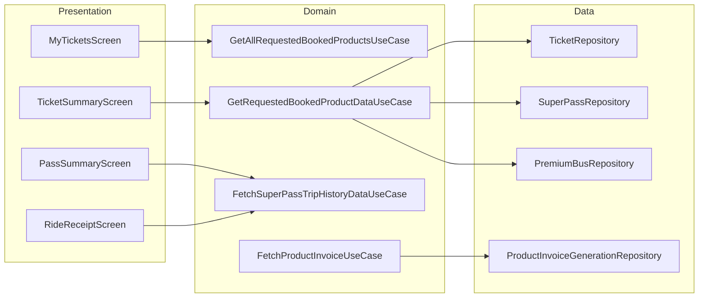

# History — High-Level Design

## Overview

The History feature displays users' booking and transaction history in the Chalo app. It shows active and expired tickets/passes across all product types (M-Ticket, Instant Ticket, Premium Bus, Super Pass, Metro, ONDC). The feature includes detailed receipt views, invoice downloads, ride feedback collection, and product cancellation flows.

## User Journey

1. **Entry Points**:
   - Home screen → "My Tickets" tab
   - Bottom navigation → History tab
   - Notification → Specific booking

2. **Core Flow**:
   - View active tickets and passes
   - Switch to expired/history tab
   - Filter by product type (quick filters)
   - View detailed receipt for any booking
   - Download invoice or view trip receipts
   - Submit ride feedback after trips

3. **Exit Points**:
   - "Use Now" → Product activation screen
   - "Book Again" → Product booking flow
   - "Report Problem" → Help/support screen
   - Back navigation → Previous screen

## Architecture Diagram



## Key Components

| Component | Platform | File Path | Responsibility |
|-----------|----------|-----------|----------------|
| `MyTicketsComponent` | Shared | `shared/home/.../ui/history/MyTicketsComponent.kt` | History list with tabs |
| `TicketSummaryComponent` | Shared | `shared/home/.../productsummary/ui/ticket/TicketSummaryComponent.kt` | Ticket receipt details |
| `PassSummaryComponent` | Shared | `shared/home/.../productsummary/ui/pass/PassSummaryComponent.kt` | Pass summary with trips |
| `RideReceiptComponent` | Shared | `shared/home/.../tripreceipt/tripreceiptnew/RideReceiptComponent.kt` | Trip receipt list |
| `GetAllRequestedBookedProductsUseCase` | Shared | `shared/home/.../domain/GetAllRequestedBookedProductsUseCase.kt` | Fetch all user bookings |
| `FetchProductInvoiceUseCase` | Shared | `shared/home/.../productsummary/domain/FetchProductInvoiceUseCase.kt` | Invoice generation |

## Data Flow

### Display History List
1. `MyTicketsComponent` initializes with active tab
2. `GetAllRequestedBookedProductsUseCase` queries all repositories
3. Results combined from: M-Ticket, Instant, Premium, Super Pass, ONDC, Metro
4. `MyTicketsUiStateFactory` converts to UI state
5. UI renders with Active/Expired tabs and quick filters

### View Ticket Receipt
1. User taps ticket in history list
2. `TicketSummaryComponent` receives booking ID
3. `GetRequestedBookedProductDataUseCase` fetches booking details
4. UI displays fare breakdown, booking details, status
5. Actions available: Use Now, Book Again, Download Invoice, Report Problem

### View Pass Trip History
1. User opens pass summary
2. `FetchSuperPassTripHistoryDataUseCase` fetches trips for pass
3. Combines digital receipts + booked rides
4. `RideReceiptComponent` displays trip list
5. Each trip shows route, stops, time, conductor info

## Platform Differences

### Android-Specific
- PDF invoice generation via Android `PrintManager`
- Share invoice via Android Share Sheet

### iOS-Specific
- PDF generation via iOS `UIGraphicsPDFRenderer`
- Share via iOS Share Sheet

## Integration Points

### Analytics Events
- See [Analytics: history](/analytics/flows/history) for event documentation
- Key events:
  - `my_tickets_screen_opened`
  - `my_tickets_tab_switched`
  - `ticket_summary_opened`
  - `invoice_download_clicked`
  - `book_again_clicked`
  - `ride_feedback_submitted`

### Shared Services
- **Repositories**: Product-type-specific data access
- **Invoice Generation**: `ProductInvoiceGenerationRepository`
- **Feedback**: `RideFeedbackTracker` for post-ride feedback

### Navigation
- **Navigates to**: Product activation, Booking flow, Help screen, WebView (invoice)
- **Navigated from**: Home screen, Notifications

## Product Types Supported

| Product Type | Repository | Features |
|--------------|------------|----------|
| M-Ticket | `TicketRepository` | QR display, activation |
| Instant Ticket | `InstantTicketRepository` | Quick booking receipt |
| Premium Bus | `PremiumBusRepository` | Seat selection, cancellation |
| Super Pass | `SuperPassRepository` | Trip history, ride count |
| ONDC Bus | `OndcRepository` | ONDC booking details |
| Metro | `MetroRepository` | Metro station info |
| Quick Pay | `QuickPayRepository` | Wallet payment receipt |

## Edge Cases & Error Handling

| Scenario | Handling |
|----------|----------|
| No bookings found | Shows empty state with "Book Now" CTA |
| Invoice generation failed | Shows error toast, retry option |
| Booking data sync failed | Shows cached data with refresh option |
| Network offline | Shows cached bookings only |
| Cancellation failed | Shows error dialog with retry |

## Cancellation Flow (Premium Bus)

1. User taps "Cancel Booking" on premium ticket
2. `CancelPremiumReserveTicketUseCase` invoked
3. Confirmation bottom sheet shown
4. User confirms → API call made
5. Ticket synced locally after cancellation
6. `AcknowledgePremiumReserveTicketCancellationUseCase` marks seen

## Ride Feedback Collection

1. Trip completed and validated
2. `GetPremiumReserveTicketsWithPendingTripFeedbackUseCase` checks eligibility
3. Feedback prompt shown
4. User provides rating (1-5) and tags
5. `RideFeedbackTracker` submits feedback
6. Feedback status updated on ticket

## Data Models

### SuperPassTripHistoryAppModel
```kotlin
data class SuperPassTripHistoryAppModel(
    val passId: String,
    val rideType: RideType,
    val activationTimeInMillis: Long,
    val punchTimeInMillis: Long,
    val startStopName: String?,
    val endStopName: String?,
    val routeName: String?,
    val vehicleNo: String?,
    val conductorId: String?,
    val specialFeatures: List<String>?,
    val via: String?,
    val routeNamingScheme: RouteNamingSchemeType
)
```

### MyTicketsDataState
```kotlin
data class MyTicketsDataState(
    val bookingTypeList: List<BookingType>,
    val currentlySelectedTab: HistoryTab,
    val gridItemDataList: List<ProductGridItem>,
    val selectedQuickFilter: QuickFilterType?,
    val bottomSheetType: HistoryBottomSheetType
)
```

### ChaloRideFeedback
```kotlin
data class ChaloRideFeedback(
    val selectedRating: Int,
    val maxRating: Int,
    val selectedFeedbackTags: List<FeedbackTags>,
    val textFeedback: String?,
    val validationProduct: ValidationProduct,
    val punchTsInMillis: Long,
    val feedbackSubmitTsInMillis: Long
)
```

## Dependencies

### Internal
- `shared:home` — History components and use cases
- `shared:productbooking` — Premium bus, instant ticket repos
- `shared:chalo-base` — Feedback tracker, base models

### External
- DataStore — Booking data caching
- PDF generation libraries — Invoice rendering
