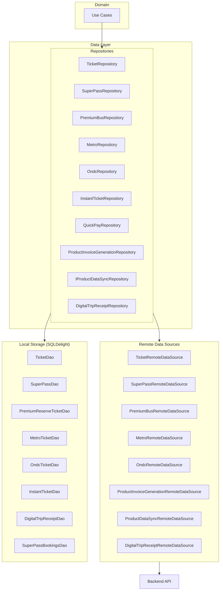
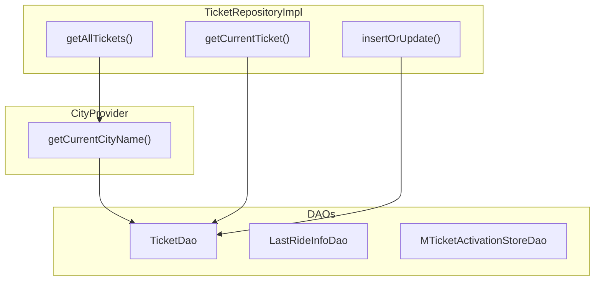
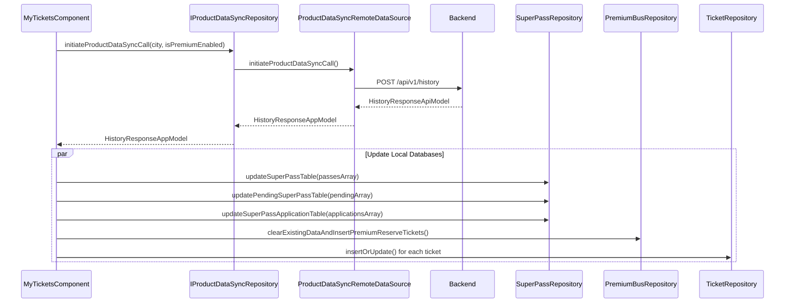
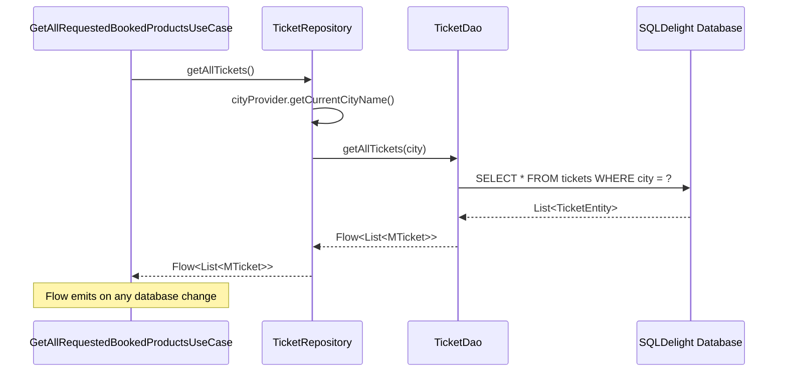
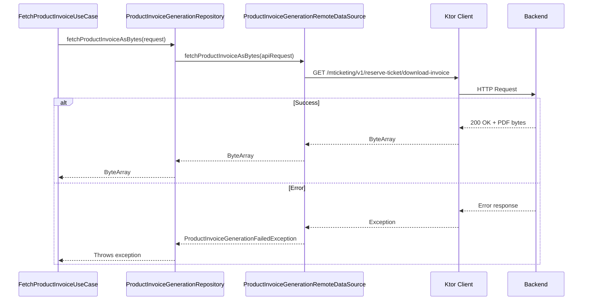
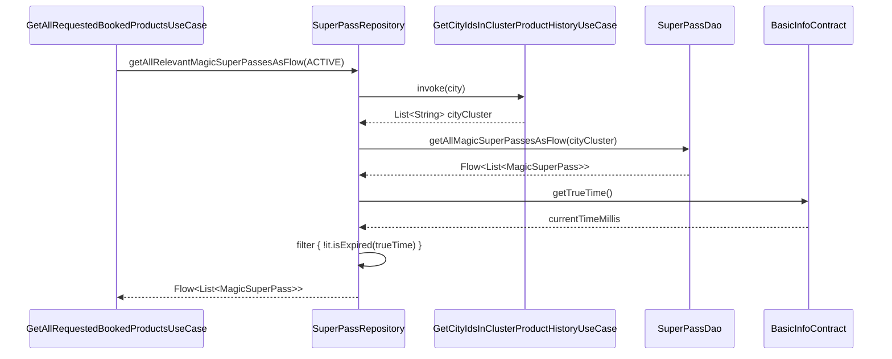
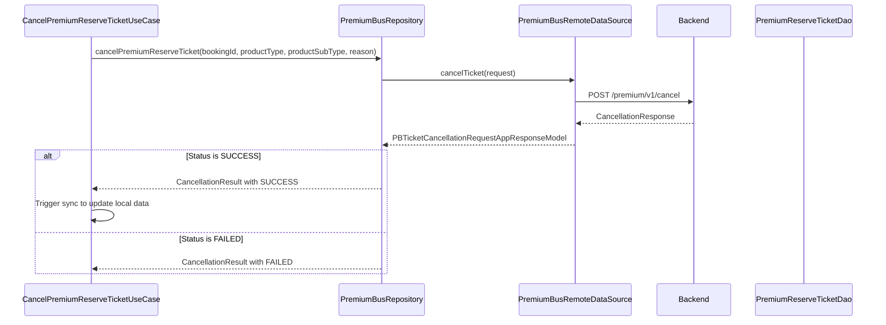
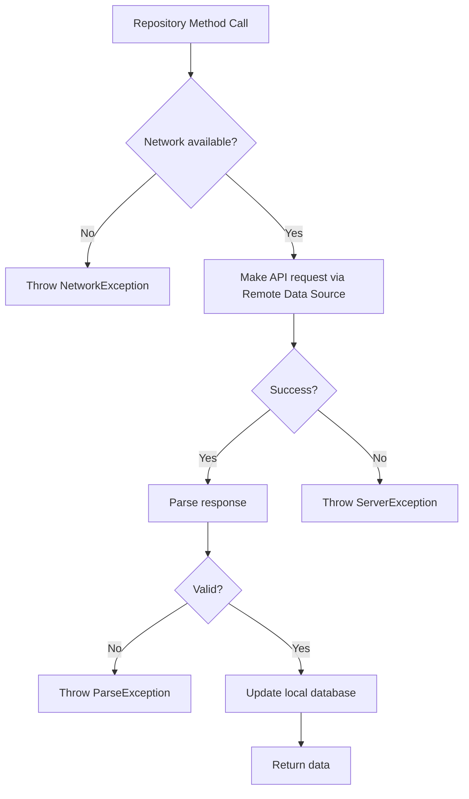

# History - Repository Documentation

## Data Layer Overview

The History data layer manages booking data persistence and retrieval across multiple product-specific repositories. Each product type has its own repository implementation handling API communication, local caching via SQLDelight DAOs, and data transformation. The architecture follows a clean separation between repository interfaces, implementations, remote data sources, and local data access objects. Local storage uses SQLDelight databases with Room-style DAOs for efficient reactive data access via Kotlin Flows.

---

## Repository Interfaces

### TicketRepository

Manages M-Ticket (single journey ticket) data with local caching and trip receipt storage.

**Location:** `shared/home/src/commonMain/kotlin/app/chalo/home/data/repository/TicketRepository.kt`

| Method | Returns | Description |
|--------|---------|-------------|
| **getAllTickets()** | Flow<List<MTicket>> | Stream all tickets for current city |
| **getCurrentTicket(ticketId)** | MTicket? | Get single ticket by ID |
| **insertOrUpdate(newTicket)** | Unit | Insert or update ticket |
| **citySpecificTicketCount()** | Int | Count tickets for current city |
| **deleteAllTicketData()** | Unit | Clear all ticket data |
| **getTicketFromBookingId(bookingId)** | MTicket? | Get ticket by booking ID |
| **updateExpiryState(bookingId)** | Unit | Update expiry state |
| **addTripReceiptToMTicket(ticketId, receipt)** | Unit | Attach trip receipt to ticket |
| **getLastRideInfo(city)** | LastRideInfo? | Get last ride info for city |
| **storeLastRideInfo(city, data)** | Unit | Store last ride info |
| **setMTicketActivationInfo(activationInfo)** | Unit | Store activation info |
| **getMTicketActivationInfo(city, ticketId)** | MTicketActivationInfoAppModel? | Get activation info |

### SuperPassRepository

Manages Super Pass data including magic passes, ride-based passes, pending passes, applications, and booked rides.

**Location:** `shared/home/src/commonMain/kotlin/app/chalo/superpass/data/repository/SuperPassRepository.kt`

| Method | Returns | Description |
|--------|---------|-------------|
| **getAllRelevantMagicSuperPassesAsFlow(statusType)** | Flow<List<MagicSuperPass>> | Stream magic passes with status filter |
| **getAllRelevantRideBasedSuperPassesAsFlow(statusType)** | Flow<List<RideBasedSuperPass>> | Stream ride-based passes with status filter |
| **getAllRelevantPendingSuperPassesAsFlow(statusType)** | Flow<List<PendingSuperPass>> | Stream pending passes with status filter |
| **getAllRelevantSuperPassApplicationsAsFlow(statusType)** | Flow<List<SuperPassApplication>> | Stream pass applications with status filter |
| **getSuperPassBookedRides(statusTypeToInclude)** | Flow<List<SuperPassRideBookingAppModel>> | Stream booked rides |
| **getMagicSuperPass(passId)** | Flow<MagicSuperPass> | Get magic pass by ID |
| **getRideBasedSuperPass(passId)** | Flow<RideBasedSuperPass> | Get ride-based pass by ID |
| **getPendingSuperPass(passId)** | Flow<PendingSuperPass> | Get pending pass by ID |
| **deleteSuperPassProductData()** | Unit | Clear all pass data |
| **updateSuperPassTable(passesArray)** | Unit | Update pass table from JSON |
| **updateSuperPassBookingsTableSynchronously(bookedRidesArray)** | Unit | Update bookings from JSON |
| **insertMagicSuperPass(pass)** | Unit | Insert magic pass |
| **insertRideBasedSuperPass(pass)** | Unit | Insert ride-based pass |
| **getSuperPassCount()** | Int | Count all passes for city |

### PremiumBusRepository

Manages premium bus booking data with extensive CRUD operations, cancellation support, and trip details management.

**Location:** `shared/productbooking/src/commonMain/kotlin/app/chalo/premiumbus/data/repository/PremiumBusRepository.kt`

| Method | Returns | Description |
|--------|---------|-------------|
| **getAllPremiumReserveTicketsForCityAsFlow(city, statusType)** | Flow<List<PremiumReserveTicketAppModel>> | Stream bookings for city with status filter |
| **getPremiumReserveTicketByIdAsFlow(bookingId)** | Flow<PremiumReserveTicketAppModel?> | Get booking by ID as flow |
| **updatePremiumReserveTicketStatus(bookingId, status)** | Unit | Update ticket status |
| **getAllPremiumReserveTicketForCityBetweenGivenTime(city, userId, startTs, endTs)** | Flow<List<PremiumReserveTicketAppModel>> | Get tickets in time range |
| **getAllPremiumReserveTicketsFromStartTimeOnwardsThatRequireAcknowledgement(city, startTs, userId)** | Flow<List<PremiumReserveTicketAppModel>> | Get tickets needing acknowledgment |
| **updateAcknowledgmentStatusForPremiumReserveTicket(bookingId, userId, hasAcknowledged, ackType)** | Unit | Update acknowledgment status |
| **cancelPremiumReserveTicket(bookingId, productType, productSubType, reason)** | PBTicketCancellationRequestAppResponseModel | Cancel booking |
| **fetchPremiumReserveTicketReceipt(bookingId)** | List<PremiumReserveTicketReceiptAppModel> | Get ticket receipt |
| **insertPremiumReserveTicket(ticket)** | Unit | Insert ticket |
| **deleteAllPremiumReserveTickets()** | Unit | Clear all tickets |
| **fetchPremiumBusTicketUpdateOptions(bookingId, productType, productSubType)** | List<PremiumBusProductOptionsAppModel> | Get update options |
| **fetchPremiumBusProductModificationReasons(actionId)** | List<PremiumBusProductModificationReasonAppModel> | Get modification reasons |
| **reschedulePremiumReserveTicket(...)** | PBRescheduleResponseAppModel | Reschedule booking |
| **getAllPremiumReserveTicketsWithPendingTripFeedback(userId, city, startTs, currentTs)** | List<PremiumReserveTicketAppModel> | Get tickets needing feedback |
| **insertPremiumReserveTripDetails(tripDetails)** | Unit | Insert trip details |
| **getPremiumReserveTripDetailsForBookingId(bookingId)** | PremiumReserveTripAppModel? | Get trip details |
| **updatePremiumReserveTripStatus(bookingId, tripStatus)** | Unit | Update trip status |

### InstantTicketRepository

Manages instant ticket data with order creation and receipt handling.

**Location:** `shared/productbooking/src/commonMain/kotlin/app/chalo/instantticket/data/InstantTicketRepository.kt`

| Method | Returns | Description |
|--------|---------|-------------|
| **getAllInstantTicketsAsFlow(statusTypeToInclude)** | Flow<List<InstantTicketEntity>> | Stream all instant tickets |
| **getInstantTicketAsFlow(bookingId)** | Flow<InstantTicketEntity?> | Get ticket as flow |
| **getInstantTicket(bookingId)** | InstantTicketEntity? | Get ticket by ID |
| **getAllInstantTickets()** | List<InstantTicketEntity> | Get all tickets |
| **getActiveOrPaymentProcessingInstantTicketsAsFlow()** | Flow<List<InstantTicketEntity>> | Get active tickets |
| **createInstantTicketOrder(request)** | CreateOrderResponseAppModel | Create order |
| **fetchInstantTicketAndStore(bookingId)** | Unit | Fetch and cache ticket |
| **updateInstantTicketTable(data)** | Unit | Update from JSON |
| **deleteAllLocalInstantTickets()** | Unit | Clear all tickets |
| **fetchInstantTicketReceipt(bookingId)** | InstantTicketReceipt | Get receipt |
| **insertInstantTicketReceipt(receipt)** | Unit | Insert receipt |
| **markInstantTicketAsExpiredByUpdatingExpiryTime(bookingId, updatedExpiryTime)** | Unit | Update expiry |
| **getMobileTicketFare(request)** | FetchMobileTicketFareResponseAppModel | Get fare |
| **validateInstantTicketFare(request)** | ValidateInstantTicketFareResponseAppModel | Validate fare |

### ProductInvoiceGenerationRepository

Cross-product invoice generation from remote server.

**Location:** `shared/home/src/commonMain/kotlin/app/chalo/productsummary/data/repository/ProductInvoiceGenerationRepository.kt`

| Method | Returns | Description |
|--------|---------|-------------|
| **fetchProductInvoiceAsBytes(request)** | ByteArray | Generate and fetch invoice PDF |

### IProductDataSyncRepository

Manages product history sync operations from server.

**Location:** `shared/home/src/commonMain/kotlin/app/chalo/productdatasync/repository/IProductDataSyncRepository.kt`

| Method | Returns | Description |
|--------|---------|-------------|
| **initiateProductDataSyncCall(cityName, isPremiumBusFeatureEnabled)** | HistoryResponseAppModel | Sync all product data |
| **autoLinkDeviceId(request)** | AutoLinkDeviceIdResponseAppModel | Auto-link device ID |

### DigitalTripReceiptRepository

Manages digital trip receipts and activation sync for passes.

**Location:** `shared/home/src/commonMain/kotlin/app/chalo/superpass/data/repository/DigitalTripReceiptRepository.kt`

| Method | Returns | Description |
|--------|---------|-------------|
| **getAllSuperPassTripReceiptsList(passId)** | Flow<List<SuperPassTripReceipt>?> | Get trip receipts for pass |
| **insertProductActivationDetails(details)** | Boolean | Insert activation details |
| **getProductActivationDetailsListMap()** | List<ProductActivationDetails>? | Get all activation details |
| **updateSuperPassTripReceiptFromPunch(receipt)** | Unit | Update receipt from validation |
| **syncActivations(passActivations, ticketActivations)** | Unit | Sync activations to server |
| **syncActivationsAndFetchSuperPassTripReceipts(pass, passActivations, ticketActivations)** | Unit | Sync and fetch trip history |

---

## Repository Implementations

### TicketRepositoryImpl

**Location:** `shared/home/src/commonMain/kotlin/app/chalo/home/data/repository/TicketRepositoryImpl.kt`

**Dependencies:**

| Dependency | Purpose |
|------------|---------|
| **TicketDao** | Local ticket data access |
| **LastRideInfoDao** | Last ride info storage |
| **MTicketActivationStoreDao** | Activation info storage |
| **CityProvider** | Current city context |

**Implementation Notes:**

The implementation filters tickets by lowercase city name from the CityProvider. All database operations are delegated to the respective DAOs. City names are normalized to lowercase before storage and queries to ensure consistent matching.

### SuperPassRepository

**Location:** `shared/home/src/commonMain/kotlin/app/chalo/superpass/data/repository/SuperPassRepository.kt`

**Dependencies:**

| Dependency | Purpose |
|------------|---------|
| **LocalDataStore** | Pass status preferences |
| **SuperPassDao** | Pass data access |
| **SuperPassBookingsDao** | Booked rides data access |
| **CityProvider** | Current city context |
| **SystemHelper** | Current time |
| **CoroutineContextProvider** | Coroutine dispatchers |
| **BasicInfoContract** | True time for expiry |
| **GetCityIdsInClusterProductHistoryUseCase** | City cluster resolution |

**Implementation Notes:**

The repository handles multiple pass types (magic, ride-based, pending, applications) through separate DAO methods. City cluster support allows showing passes from related cities. Status filtering is applied via Flow.map operations based on pass expiry time compared against BasicInfoContract.getTrueTime().

**Status Filtering Logic:**

| StatusType | MagicSuperPass Filter | RideBasedSuperPass Filter | PendingSuperPass Filter |
|------------|----------------------|--------------------------|------------------------|
| **ALL** | Return all | Return all | Return all |
| **ACTIVE** | !isExpired(trueTime) | !isExpired(trueTime) | status == PAYMENT_PROCESSING |
| **EXPIRED** | isExpired(trueTime) | isExpired(trueTime) | status == PAYMENT_FAILED |

### ProductInvoiceGenerationRepositoryImpl

**Location:** `shared/home/src/commonMain/kotlin/app/chalo/productsummary/data/repository/ProductInvoiceGenerationRepositoryImpl.kt`

**Dependencies:**

| Dependency | Purpose |
|------------|---------|
| **ProductInvoiceGenerationRemoteDataSource** | PDF generation API |

**Implementation Notes:**

Simple delegation to remote data source with model mapping from app model to API model.

### ProductDataSyncRepository

**Location:** `shared/home/src/commonMain/kotlin/app/chalo/productdatasync/repository/ProductDataSyncRepository.kt`

**Dependencies:**

| Dependency | Purpose |
|------------|---------|
| **IProductDataSyncRemoteDataSource** | Sync API access |

**Implementation Notes:**

Delegates to remote data source and maps API response to app model using extension functions.

---

## Remote Data Sources

### ProductInvoiceGenerationRemoteDataSource

Fetches invoice PDF bytes from the backend.

**API Endpoint:**

| Endpoint | Method | Auth | Description |
|----------|--------|------|-------------|
| `/mticketing/v1/reserve-ticket/download-invoice` | GET | Required | Download invoice PDF |

**Request Parameters:**

| Parameter | Type | Description |
|-----------|------|-------------|
| **passId** | String? | Pass identifier for pass invoices |
| **bookingId** | String? | Booking identifier for ticket invoices |

**Response:**

| Type | Description |
|------|-------------|
| **ByteArray** | Raw PDF bytes |

### IProductDataSyncRemoteDataSource

Syncs all product history data from server.

**API Endpoint:**

| Endpoint | Method | Auth | Description |
|----------|--------|------|-------------|
| `/api/v1/history` | POST | Required | Sync product history |

**Response Model (HistoryResponseAppModel):**

The response contains arrays for each product type which are then parsed and stored locally.

### DigitalTripReceiptRemoteDataSource

Syncs activation data and fetches trip receipts.

**API Endpoint:**

| Endpoint | Method | Auth | Description |
|----------|--------|------|-------------|
| `/api/v1/sync-activations` | POST | Required | Sync pass and ticket activations |

**Request Model (DigitalTripReceiptRemoteApiRequestModel):**

| Field | Type | Description |
|-------|------|-------------|
| **appVer** | Int | App version code |
| **passActivations** | List<PassActivationsApiRequestModel>? | Pass activation data |
| **ticketActivations** | List<TicketActivationsApiRequestModel>? | Ticket activation data |
| **passInfo** | PassInfoApiRequestModel? | Pass info for trip history fetch |

---

## Data Flow Diagrams

### Product History Sync Flow

### Ticket Retrieval Flow

### Invoice Generation Flow

### Pass Booking Retrieval Flow

### Premium Bus Cancellation Flow

---

## Local Storage

### SQLDelight DAOs

The data layer uses SQLDelight with Room-style DAO interfaces for local persistence. Each product type has its own DAO managing CRUD operations.

#### TicketDao

| Method | SQL Operation | Description |
|--------|---------------|-------------|
| **getAllTickets(city)** | SELECT | Get all tickets for city |
| **getCurrentTicket(ticketId, city)** | SELECT | Get ticket by ID |
| **insertOrUpdate(ticket)** | INSERT OR REPLACE | Upsert ticket |
| **getCitySpecificTicketCount(city)** | SELECT COUNT | Count tickets |
| **deleteAllTicketData()** | DELETE | Clear all tickets |
| **getTicketFromBookingId(bookingId)** | SELECT | Get by booking ID |
| **updateExpiryState(bookingId)** | UPDATE | Update expiry |
| **addTripReceiptToMTicket(ticketId, receipt)** | UPDATE | Attach receipt |

#### SuperPassDao

| Method | SQL Operation | Description |
|--------|---------------|-------------|
| **getAllMagicSuperPassesAsFlow(cityCluster)** | SELECT | Get magic passes for cities |
| **getAllRideBasedSuperPassesAsFlow(cityCluster)** | SELECT | Get ride-based passes |
| **getAllPendingSuperPassAsFlow(cityCluster)** | SELECT | Get pending passes |
| **getAllSuperPassApplicationsAsFlow(cityCluster)** | SELECT | Get applications |
| **getMagicSuperPass(passId)** | SELECT | Get magic pass by ID |
| **getRideBasedSuperPass(passId)** | SELECT | Get ride-based pass by ID |
| **insertMagicSuperPass(pass)** | INSERT | Insert magic pass |
| **insertRideBasedSuperPass(pass)** | INSERT | Insert ride-based pass |
| **deleteAllMagicSuperPassesForCity(city)** | DELETE | Clear magic passes |
| **deleteAllRideBasedSuperPassesForCity(city)** | DELETE | Clear ride-based passes |
| **updateMagicSuperPassLastActivationTimeStamp(passId, timestamp)** | UPDATE | Update activation time |

#### SuperPassBookingsDao

| Method | SQL Operation | Description |
|--------|---------------|-------------|
| **getSuperPassBookingsAsFlow()** | SELECT | Get all booked rides |
| **updateSuperPassBookingsData(list)** | DELETE + INSERT | Replace all bookings |
| **deleteAllSuperPassBookings()** | DELETE | Clear all bookings |

#### DigitalTripReceiptDao

| Method | SQL Operation | Description |
|--------|---------------|-------------|
| **getAllSuperPassTripReceiptsList(passId)** | SELECT | Get receipts for pass |
| **insertSuperPassTripReceipt(receipt)** | INSERT | Insert receipt |
| **insertSuperPassTripReceiptsList(list)** | INSERT | Bulk insert receipts |
| **deleteSuperPassTripReceipt(passId, activationTs, punchTs)** | DELETE | Delete specific receipt |
| **deleteSelectSuperPassTripReceipts(passId)** | DELETE | Delete receipts for pass |
| **insertActivationDetails(details)** | INSERT | Insert activation details |
| **getAllProductActivationDetailsList()** | SELECT | Get all activation details |
| **deleteSelectActivationDetails(timestamps)** | DELETE | Delete by timestamps |

### DataStore Preferences

#### Pass Status Store

| Key | Type | Description |
|-----|------|-------------|
| **{passStartDate}** | Boolean | Whether pass application update shown |

**Store Name:** `pass_status_store.preferences_pb`

---

## Data Mappers

### JSON Parsing

The SuperPassRepository uses `SuperPassJsonParser` for parsing server response JSON arrays into entity models.

| Parser Method | Input | Output |
|--------------|-------|--------|
| **parsePassesArray(JsonArray)** | Passes JSON | Pair<List<MagicSuperPass>, List<RideBasedSuperPass>> |
| **parseRecentTransactionsArray(JsonArray)** | Transactions JSON | List<PendingSuperPass> |
| **parsePassApplicationsArray(JsonArray)** | Applications JSON | List<SuperPassApplication> |
| **parseSuperPassBookedRidesArray(JsonArray)** | Booked rides JSON | List<SuperPassRideBookingAppModel>? |
| **parseSinglePass(JsonObject)** | Single pass JSON | Pair<MagicSuperPass?, RideBasedSuperPass?> |

### Entity to App Model Mapping

| Repository | Entity | App Model | Mapper |
|------------|--------|-----------|--------|
| **SuperPassRepository** | SuperPassBookingEntity | SuperPassRideBookingAppModel | toSuperPassBookingAppModel() |
| **InstantTicketRepository** | InstantTicketEntity | InstantTicketAppModel | toAppModel() |
| **TicketRepository** | MTicketActivationInfoEntity | MTicketActivationInfoAppModel | toAppModel() |

---

## Caching Strategy

### Cache Configuration by Repository

| Repository | Storage | Reactive | Sync Strategy |
|------------|---------|----------|---------------|
| **TicketRepository** | SQLDelight | Flow | Stale-while-revalidate |
| **SuperPassRepository** | SQLDelight + DataStore | Flow | Replace on sync |
| **PremiumBusRepository** | SQLDelight | Flow | Replace on sync |
| **InstantTicketRepository** | SQLDelight | Flow | Update on fetch |
| **DigitalTripReceiptRepository** | SQLDelight | Flow | Incremental sync |

### Sync Triggers

| Trigger | Description |
|---------|-------------|
| **Pull-to-refresh** | User initiates refresh on My Tickets screen |
| **App foreground** | Sync on app resume if data is stale |
| **After purchase** | Sync after successful product purchase |
| **After cancellation** | Sync affected product after cancellation |
| **Push notification** | Sync specific product on notification |

### Data Freshness

The history feature relies on explicit sync calls rather than automatic cache invalidation. The `initiateProductDataSyncCall` method fetches all product data from the server and replaces local data. Individual product fetches (like invoice generation) are not cached locally.

---

## Error Handling

### Error Flow

### Exception Types

| Exception | Cause | Location |
|-----------|-------|----------|
| **ProductInvoiceGenerationFailedException** | Invoice API failure | ProductInvoiceGenerationRemoteDataSource |
| **PBTicketUserCancellationFailedException** | Cancellation API failure | PremiumBusRemoteDataSource |
| **ChaloLocalException** | Local operation failure | Various |
| **NetworkSuccessResponseParseException** | Response parsing failure | Remote data sources |
| **JsonException** | JSON parsing failure | SuperPassJsonParser |

### Error Reporting

The DigitalTripReceiptRepository includes analytics events for sync failures:

| Event | Trigger |
|-------|---------|
| **PRODUCT_ACTIVATION_SYNC_FAILED** | Pass or ticket sync failed |
| **PRODUCT_ACTIVATION_SYNC_EXCEPTION_OCCURRED** | Exception during sync |
| **PRODUCT_ACTIVATION_PASS_PUNCH_SYNC_FAILED** | Pass punch sync failed |
| **SUPER_PASS_TRIP_RECEIPT_HISTORY_FETCHED** | Trip history fetched successfully |
| **SUPER_PASS_TRIP_RECEIPT_HISTORY_FETCH_FAILED** | Trip history fetch failed |

---

## Dependency Injection

### Module Bindings

| Interface | Implementation |
|-----------|----------------|
| **TicketRepository** | TicketRepositoryImpl |
| **ProductInvoiceGenerationRepository** | ProductInvoiceGenerationRepositoryImpl |
| **IProductDataSyncRepository** | ProductDataSyncRepository |

Note: SuperPassRepository, PremiumBusRepository, InstantTicketRepository, and DigitalTripReceiptRepository are concrete classes without separate interfaces.

### Repository Dependencies

| Repository | Dependencies |
|------------|--------------|
| **TicketRepositoryImpl** | TicketDao, LastRideInfoDao, MTicketActivationStoreDao, CityProvider |
| **SuperPassRepository** | LocalDataStore, SuperPassDao, SuperPassBookingsDao, CityProvider, SystemHelper, CoroutineContextProvider, BasicInfoContract, GetCityIdsInClusterProductHistoryUseCase |
| **ProductInvoiceGenerationRepositoryImpl** | ProductInvoiceGenerationRemoteDataSource |
| **ProductDataSyncRepository** | IProductDataSyncRemoteDataSource |
| **DigitalTripReceiptRepository** | DigitalTripReceiptDao, AnalyticsContract, ErrorReporterContract, BasicInfoContract, DigitalTripReceiptRemoteDataSource |

---

## Network Configuration

### Headers

All API requests include standard Chalo headers managed by the network layer:

| Header | Value | Description |
|--------|-------|-------------|
| **Authorization** | Bearer {token} | Auth token |
| **Content-Type** | application/json | Request body type |
| **Accept** | application/json | Expected response |
| **X-Platform** | android / ios | Platform identifier |
| **X-App-Version** | {versionCode} | App version |
| **X-Device-Id** | {deviceId} | Device identifier |
| **X-City** | {cityName} | Current city |

### API Base URLs

API endpoints are configured through the network module and vary by environment (dev, beta, prod).

---

## Platform-Specific Implementation

### Kotlin Multiplatform

All repositories are implemented in `commonMain` and shared across Android and iOS platforms. Platform-specific code is limited to:

| Component | Android | iOS |
|-----------|---------|-----|
| **SQLDelight Driver** | AndroidSqliteDriver | NativeSqliteDriver |
| **DataStore** | AndroidX DataStore | NSUserDefaults-backed |
| **Ktor Engine** | OkHttp | Darwin |

---

## Analytics Integration

### Repository Events

| Event | Trigger | Properties |
|-------|---------|------------|
| **PRODUCT_ACTIVATION_SYNC_FAILED** | Sync failed | product_type |
| **PRODUCT_ACTIVATION_SYNC_EXCEPTION_OCCURRED** | Exception during sync | reason |
| **PRODUCT_ACTIVATION_PASS_PUNCH_SYNC_FAILED** | Pass punch sync failed | error_message |
| **SUPER_PASS_TRIP_RECEIPT_HISTORY_FETCHED** | Trip history success | pass properties |
| **SUPER_PASS_TRIP_RECEIPT_HISTORY_FETCH_FAILED** | Trip history failed | error_message, pass properties |
