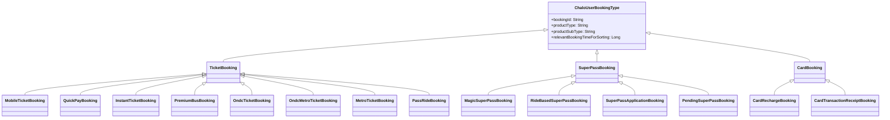

# History - UseCase Documentation

## Domain Layer Overview

The History domain layer orchestrates retrieval and management of user booking data across all Chalo product types. The layer employs a unified data aggregation pattern through `GetAllRequestedBookedProductsUseCase` which combines reactive streams from multiple product-specific repositories. Use cases coordinate between presentation components and repositories to aggregate booking history, fetch product details, generate invoices, manage cancellations, and sync product data. The layer handles complex cross-product queries while maintaining clean separation from data access concerns.


---

## UseCase Inventory

| UseCase | Location | Purpose |
|---------|----------|---------|
| **GetAllRequestedBookedProductsUseCase** | `home/domain/` | Aggregate bookings across all product types into unified Flow |
| **GetRequestedBookedProductDataUseCase** | `productsummary/domain/` | Fetch detailed product data by request type |
| **FetchProductInvoiceUseCase** | `productsummary/domain/` | Generate and fetch invoice PDF as ByteArray |
| **CancelPremiumReserveTicketUseCase** | `premiumbus/prebookedtickets/domain/` | Process premium booking cancellation |
| **AcknowledgePremiumReserveTicketCancellationUseCase** | `premiumbus/prebookedtickets/domain/` | Mark cancellation as acknowledged |
| **FetchHistoryScreenConfigDataUseCase** | `home/domain/` | Fetch city-specific history screen configuration |
| **InitiateProductHistorySyncCallUseCase** | `home/usecase/` | Sync all product data from server |
| **GetProductStatusUIUseCase** | `home/domain/` | Determine product status banner display |

---

## GetAllRequestedBookedProductsUseCase

Aggregates booking data from all product-type repositories into a unified reactive stream for display in the My Tickets screen. This is the central use case for the history feature, combining data from 9 different product tables.

### Location

`shared/home/src/commonMain/kotlin/app/chalo/home/domain/GetAllRequestedBookedProductsUseCase.kt`

### Responsibility

Queries multiple product repositories concurrently using Kotlin Flows and combines results into a single sorted list. The use case validates user login state and city context before initiating queries, applies status filtering for active vs expired segregation, and implements a stabilization mechanism to prevent UI flickering during rapid emissions.

### Dependencies

| Dependency | Purpose |
|------------|---------|
| **SuperPassRepository** | Magic and ride-based passes, pending passes, applications |
| **GetAllQuickPaysUseCase** | QuickPay wallet transactions |
| **InstantTicketRepository** | Instant ticket data |
| **PremiumBusRepository** | Premium bus reserve tickets |
| **OndcRepository** | ONDC bus and metro tickets |
| **MetroRepository** | Metro tickets |
| **TicketRepository** | M-Tickets (single journey) |
| **CityProvider** | Current city context |
| **CheckIsUserLoggedInUseCase** | User authentication state |
| **MTicketUtilsHelper** | M-Ticket expiry calculation |

### Flow Diagram


### Input Parameters

| Parameter | Type | Default | Description |
|-----------|------|---------|-------------|
| **requestsList** | Set<UserBookingsRequestType> | all() | Product types to include |
| **statusTypeToInclude** | UserBookingsStatusType | ALL | ACTIVE, EXPIRED, or ALL filter |
| **stabilizationThreshold** | Long | 3000L | Debounce time in milliseconds |

### Output

| Type | Description |
|------|-------------|
| **ChaloUseCaseResult<Flow<List<ChaloUserBookingType>>, AllRequestedBookedProductsFailureReason>** | Success with reactive list or failure reason |

### UserBookingsRequestType Variants

| Request Type | Product | Options |
|--------------|---------|---------|
| **MobileTicketType** | M-Ticket | - |
| **SuperPassType** | Super Pass | includeRideBasedPass, includeMagicPass, includePendingPasses, includePassApplications |
| **QuickPayType** | QuickPay | onlyIfWalletActive |
| **InstantTicketType** | Instant Ticket | - |
| **PremiumBusTicketType** | Premium Bus | - |
| **OndcTicketType** | ONDC Bus | - |
| **OndcMetroTicketType** | ONDC Metro | - |
| **MetroTicket** | Metro | - |
| **SuperPassRideType** | Pass Rides | - |

### ChaloUserBookingType Sealed Hierarchy

The use case outputs a unified booking type hierarchy that wraps product-specific models.



### Stabilization Logic

The use case implements a stabilization mechanism using `transformLatest` to prevent UI flickering when multiple flows emit in rapid succession.

| Behavior | Description |
|----------|-------------|
| **First emission** | Immediate passthrough |
| **Subsequent emissions** | Delayed by threshold (3 seconds default) |
| **Purpose** | Prevents rapid UI updates during initial data load |

### Error Handling

| Error | Cause | Result |
|-------|-------|--------|
| **USER_NOT_LOGGED_IN** | User not authenticated | Failure returned |
| **INVALID_CITY** | CityProvider returns null | Failure returned |
| **EMPTY_REQUEST_LIST** | No product types requested | Failure returned |

---

## InitiateProductHistorySyncCallUseCase

Triggers a full sync of product history data from the backend server and stores the results locally.

### Location

`shared/home/src/commonMain/kotlin/app/chalo/usecase/InitiateProductHistorySyncCallUseCase.kt`

### Responsibility

Coordinates the sync of all product history data by calling the product data sync repository and processing the response. Updates multiple local tables with the received data.

### Dependencies

| Dependency | Purpose |
|------------|---------|
| **IProductDataSyncRepository** | Server sync API access |
| **CityProvider** | Current city context |
| **SuperPassRepository** | Pass table updates |
| **PremiumBusRepository** | Premium ticket updates |
| **InstantTicketRepository** | Instant ticket updates |
| **TicketRepository** | M-Ticket updates |

### Flow Diagram


### Output

| Type | Description |
|------|-------------|
| **ChaloUseCaseResult<HistoryResponseAppModel, SyncFailureReason>** | Sync response or failure |

---

## GetProductStatusUIUseCase

Determines the appropriate status banner and CTA to display on product cards based on product state.

### Location

`shared/home/src/commonMain/kotlin/app/chalo/home/domain/GetProductStatusUIUseCase.kt`

### Responsibility

Analyzes product booking type and returns UI metadata including status icon, background color, info text, and optional CTA text. Handles various states like payment processing, payment failed, expired validity, and product disabled scenarios.

### Dependencies

| Dependency | Purpose |
|------------|---------|
| **StringProvider** | Localized string resolution |
| **BasicInfoContract** | True time for validity checks |
| **BookingHelper** | Pass configuration extraction |

### Status Decision Flow


### Output

| Type | Description |
|------|-------------|
| **ProductStatusUiData** | Icon, background color, info text, and optional CTA |

### ProductStatusUiData Fields

| Field | Type | Description |
|-------|------|-------------|
| `iconType` | IconType? | Status icon |
| `bgColor` | ChaloColorToken | Background color token |
| `infoText` | String | Status message |
| `ctaText` | String? | Optional action button text |

---

## FetchHistoryScreenConfigDataUseCase

Fetches city-specific configuration for the history screen from Firebase Remote Config.

### Location

`shared/home/src/commonMain/kotlin/app/chalo/home/domain/FetchHistoryScreenConfigDataUseCase.kt`

### Responsibility

Retrieves and parses history screen configuration based on build flavor and city context. Falls back to default configuration on errors.

### Dependencies

| Dependency | Purpose |
|------------|---------|
| **ChaloConfigFeature** | Firebase Remote Config access |
| **CityProvider** | Current city name |
| **ChaloBuildConfig** | Product flavor determination |
| **BasicInfoContract** | Debug mode check |
| **ErrorReporterContract** | Exception reporting |

### Flow Diagram

```mermaid
flowchart TD
    Start["invoke()"]

    CheckDebug{isLiveDebug()?}
    DebugConfig["getStringAsync(PASS_STATUS_CONFIG_DEV)"]

    CheckFlavor{productFlavor?}
    ProdConfig["getStringAsync(PASS_STATUS_CONFIG_PROD)"]
    BetaConfig["getStringAsync(PASS_STATUS_CONFIG_BETA)"]

    CheckCity{cityName valid?}
    CheckString{configStr empty?}

    Parse["deserializeJson(configStr)"]

    CheckParse{Parse success?}

    FindCity["Find cityWiseConfig for current city"]

    CheckCityConfig{City config found?}

    ReturnCityConfig["Return currCityConfig"]
    ReturnDefaultConfig["Return defaultConfig"]
    ReturnFallback["Return HISTORY_SCREEN_CONFIG fallback"]

    Start --> CheckDebug
    CheckDebug -->|Yes| DebugConfig
    CheckDebug -->|No| CheckFlavor

    CheckFlavor -->|PRIMARY| ProdConfig
    CheckFlavor -->|BETA/ALPHA| BetaConfig

    DebugConfig --> CheckCity
    ProdConfig --> CheckCity
    BetaConfig --> CheckCity

    CheckCity -->|Invalid| ReturnFallback
    CheckCity -->|Valid| CheckString
    CheckString -->|Empty| ReturnFallback
    CheckString -->|Non-empty| Parse

    Parse --> CheckParse
    CheckParse -->|Failure| ReturnFallback
    CheckParse -->|Success| FindCity

    FindCity --> CheckCityConfig
    CheckCityConfig -->|Found| ReturnCityConfig
    CheckCityConfig -->|Not found| ReturnDefaultConfig
```

### Output

| Type | Description |
|------|-------------|
| **HistoryScreenConfigForCity** | City-specific history screen configuration |

---

## FetchProductInvoiceUseCase

Generates or retrieves a PDF invoice for any product type. Returns raw PDF bytes for platform-specific rendering.

### Location

`shared/home/src/commonMain/kotlin/app/chalo/productsummary/domain/FetchProductInvoiceUseCase.kt`

### Responsibility

Coordinates invoice generation by validating request parameters and delegating to the `ProductInvoiceGenerationRepository`. Handles various error scenarios with typed failure reasons.

### Dependencies

| Dependency | Purpose |
|------------|---------|
| **ProductInvoiceGenerationRepository** | PDF generation and retrieval |

### Flow Diagram


### Input Parameters

| Parameter | Type | Description |
|-----------|------|-------------|
| **passId** | String? | Pass identifier (for Super Pass invoices) |
| **bookingId** | String? | Booking identifier (for ticket invoices) |

At least one parameter must be non-null and non-empty.

### Output

| Type | Description |
|------|-------------|
| **ChaloUseCaseResult<ByteArray, ProductInvoiceFetchFailedError>** | PDF bytes or typed error |

### Error Types

| Reason | Cause | Message |
|--------|-------|---------|
| **INVALID_REQUEST_PARAMS** | Both passId and bookingId null/empty | - |
| **SERVER_ERROR** | Backend PDF generation failed | Exception message |
| **LOCAL_ERROR** | Local operation failed | - |
| **PARSE_ERROR** | Response parsing failed | - |
| **UNKNOWN_ERROR** | Unexpected exception | Exception message |

---

## CancelPremiumReserveTicketUseCase

Processes cancellation requests for premium bus bookings, submitting to server and syncing the updated ticket state locally.

### Location

`shared/home/src/commonMain/kotlin/app/chalo/premiumbus/prebookedtickets/domain/CancelPremiumReserveTicketUseCase.kt`

### Responsibility

Validates cancellation request, submits to server via repository, and triggers local data sync on success. Returns typed result indicating success or specific failure reason.

### Dependencies

| Dependency | Purpose |
|------------|---------|
| **PremiumBusRepository** | Cancellation API call |
| **FetchPremiumReserveTicketAndStoreLocallyUseCase** | Post-cancellation data sync |

### Flow Diagram


### Input Parameters

| Parameter | Type | Description |
|-----------|------|-------------|
| **bookingId** | String | Premium booking identifier to cancel |
| **reason** | PremiumBusProductModificationReasonAppModel | User-selected cancellation reason |

### Output

| Type | Description |
|------|-------------|
| **CancelPremiumReserveTicketResult** | Sealed class with success or specific error |

### Result Types

| Result | Description | Error Code |
|--------|-------------|------------|
| **Success** | Cancellation completed | PB_SUCCESS_CODE |
| **ServerError** | API returned error | PB_CANCEL_RIDE_SERVER_ERROR |
| **LocalError** | Local operation failed | PB_CANCEL_RIDE_LOCAL_ERROR |
| **TicketSyncFailed** | Cancellation succeeded but sync failed | PB_CANCEL_RIDE_TICKET_SYNC_FAILED |
| **UnknownError** | Unexpected error | PB_CANCEL_RIDE_UNKNOWN_ERROR |

---

## Sequence Diagrams

### View History Flow


### Product Detail Navigation Flow


### Cancellation Flow


### Invoice Download Flow


---

## Domain Models

### ChaloUserBookingType Properties

Each booking type exposes common properties for unified handling.

| Property | Source | Description |
|----------|--------|-------------|
| **bookingId** | Varies by type | Unique booking identifier |
| **productType** | Constants | Product type string |
| **productSubType** | Constants | Product subtype string |
| **relevantBookingTimeForSorting** | Computed | Timestamp for sorting |

### relevantBookingTimeForSorting Mapping

| Booking Type | Time Source |
|--------------|-------------|
| **InstantTicketBooking** | instantTicket.bookingTime |
| **MobileTicketBooking** | ticket.bookingTime |
| **PremiumBusBooking** | premiumReserveTicket.bookingProperties.bookingTime |
| **QuickPayBooking** | quickPay.getActivationTimestampMS() |
| **MagicSuperPassBooking** | pass.superPassUIProperties.bookingTime |
| **PendingSuperPassBooking** | pendingPass.pendingSuperPassUIProperties.bookingTime |
| **RideBasedSuperPassBooking** | pass.superPassUIProperties.bookingTime |
| **SuperPassApplicationBooking** | application.passStartDate |
| **OndcTicketBooking** | ondcTicket.bookingTime |
| **OndcMetroTicketBooking** | ticket.bookingTime |
| **MetroTicketBooking** | ticket.bookingTime |
| **PassRideBooking** | max(punchTimeInMillis, activationTimeInMillis) |
| **CardBooking** | Long.MAX_VALUE (not shown in history) |

### toValidationProduct() Mapping

Converts booking types to validation products for QR code display.

| Booking Type | ValidationProduct |
|--------------|-------------------|
| **InstantTicketBooking** | MobileTicketProduct.InstantTicketValidation |
| **MobileTicketBooking** | MobileTicketProduct.SingleJourneyTicketValidation |
| **PremiumBusBooking** | MobileTicketProduct.PremiumReserveTicketValidation |
| **QuickPayBooking** | QuickpayProduct.QuickpayValidation |
| **MagicSuperPassBooking** | SuperPassProduct.MagicPassValidation |
| **RideBasedSuperPassBooking** | SuperPassProduct.RideBasedPassValidation |
| **OndcTicketBooking** | MobileTicketProduct.OndcTicketValidation |
| **OndcMetroTicketBooking** | MobileTicketProduct.OndcMetroTicketValidation |
| **MetroTicketBooking** | MobileTicketProduct.MetroTicketValidation |
| **PendingSuperPassBooking** | null |
| **SuperPassApplicationBooking** | null |
| **PassRideBooking** | null |
| **CardBooking** | null |

---

## Business Rules

| Rule | Description | Enforcement |
|------|-------------|-------------|
| **User authentication required** | Must be logged in to view history | GetAllRequestedBookedProductsUseCase |
| **City context required** | Must have valid city selected | GetAllRequestedBookedProductsUseCase |
| **Active/Expired segregation** | Products filtered by validity state | Status filtering in each flow |
| **Stabilization delay** | 3 second debounce on emissions | GetAllRequestedBookedProductsUseCase |
| **Invoice parameter validation** | Either passId or bookingId required | FetchProductInvoiceUseCase |
| **Post-cancellation sync** | Local data synced after cancellation | CancelPremiumReserveTicketUseCase |
| **Acknowledgment tracking** | Cancellation notifications tracked | AcknowledgePremiumReserveTicketCancellationUseCase |

---

## Error Handling

| Error | Cause | Handling |
|-------|-------|----------|
| **USER_NOT_LOGGED_IN** | User not authenticated | Return failure, prompt login |
| **INVALID_CITY** | No city context | Return failure, prompt city selection |
| **EMPTY_REQUEST_LIST** | No products requested | Return failure (developer error) |
| **INVALID_REQUEST_PARAMS** | Missing invoice identifiers | Return failure with reason |
| **SERVER_ERROR** | Backend API failure | Return failure with message |
| **LOCAL_ERROR** | Local operation failure | Return failure |
| **PARSE_ERROR** | Response parsing failed | Return failure |
| **UNKNOWN_ERROR** | Unexpected exception | Return failure with message |
| **TicketSyncFailed** | Sync failed after cancellation | Return specific status |
