# Home — Component Documentation

## Architecture Overview

The Home feature serves as the primary navigation hub of the Chalo app, orchestrating a multi-tab interface through the Decompose component architecture. The root HomeComponent manages the bottom navigation tabs and drawer states, delegating content rendering to specialized child components for each section. Each tab component extends `ChaloBaseStateMviComponent` which provides a standardized MVI (Model-View-Intent) pattern with coroutine scope management, state flows, and side effects handling.

The architecture employs a visibility controller pattern where `HomeTabVisibilityController` tracks which tab is currently visible, allowing components to optimize resource usage by pausing background work when not displayed. A central state manager (`HomeTabScreensNavigationAndStateManager`) coordinates cross-tab interactions, state persistence, and fresh navigation signals.

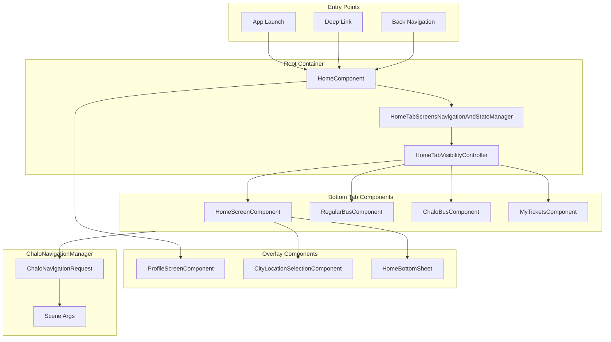

---

## Screen Inventory

| Screen | Component | Base Class | Purpose |
|--------|-----------|------------|---------|
| **Home Dashboard** | HomeScreenComponent | ChaloBaseStateMviComponent | Main dashboard with cards, widgets, and dynamic sections |
| **Regular Bus** | RegularBusComponent | ChaloBaseStateMviComponent | City bus routes, nearby stops, and real-time arrivals |
| **Chalo Bus** | ChaloBusComponent | ChaloBaseStateMviComponent | Premium bus booking with O-D selection and date picker |
| **My Tickets** | MyTicketsComponent | ChaloBaseStateMviComponent | Active and expired bookings history with quick actions |
| **Profile** | ProfileScreenComponent | ChaloBaseStateMviComponent | User profile drawer with account options |

---

## Base Component Pattern

All home tab components extend `ChaloBaseStateMviComponent<Intent, DataState, ViewState, SideEffect>` which provides:

- **ComponentContext**: Decompose lifecycle integration
- **componentScope**: Coroutine scope tied to component lifecycle
- **State Management**: `_state` flow and `updateState` function
- **Side Effects**: `emitSideEffect` for UI events
- **Intent Processing**: `processIntent` method with when-expression dispatch

The pattern ensures consistent state management across all tabs with proper lifecycle handling and coroutine cancellation.

---

## HomeScreenComponent (Dashboard Tab)

The HomeScreenComponent renders the main dashboard experience with dynamic sections fetched from the home screen configuration. It processes section widgets through `GetHomePageItemsUseCase` to transform backend configuration into renderable `HomePageDisplayItemData` items.

**Source**: `shared/home/src/commonMain/kotlin/app/chalo/home/ui/home/HomeScreenComponent.kt`

### State Contract

The component uses `HomeScreenContract.kt` which defines:

| State Field | Type | Description |
|-------------|------|-------------|
| **homePageSections** | List<HomePageDisplayItemData>? | Dynamic section list from config |
| **tabMetaData** | TabMetaDataAppModel | Header configuration |
| **currentCity** | String? | Selected city name |
| **profilePhotoUrl** | String? | User profile image URL |
| **bottomSheetType** | HomeScreenBottomSheetType? | Active bottom sheet |
| **isLoading** | Boolean | Loading indicator state |

### Intent Types

| Intent | Trigger | Handler |
|--------|---------|---------|
| **HomeScreenInitializationIntent** | Tab visible | Initializes section data from config |
| **HomePageItemClickedIntent** | Card/grid tap | Routes to appropriate feature |
| **ProfileIconClickedIntent** | Avatar tap | Opens profile drawer |
| **CityClickedIntent** | City label tap | Opens city selection |
| **BottomSheetDismissIntent** | Sheet dismissed | Clears bottom sheet state |

### Section Display Types

The component renders these section types based on `HomePageSectionDisplayType`:

| Display Type | Widget | Description |
|--------------|--------|-------------|
| **GRID** | HomeTabHooksSection | Grid of action cards with icons and text |
| **CARD** | TicketPassesSection | Single promotional card |
| **PLOTLINE_WIDGET** | PlotlineWidgetSection | Marketing widget from Plotline SDK |
| **GAM_BANNER_AD** | GamBannerAdSection | Google Ad Manager banner |
| **FOOTER** | HomeFooterSection | City agency branding |
| **DIVIDER** | - | Visual separator |

### Section Rendering Flow

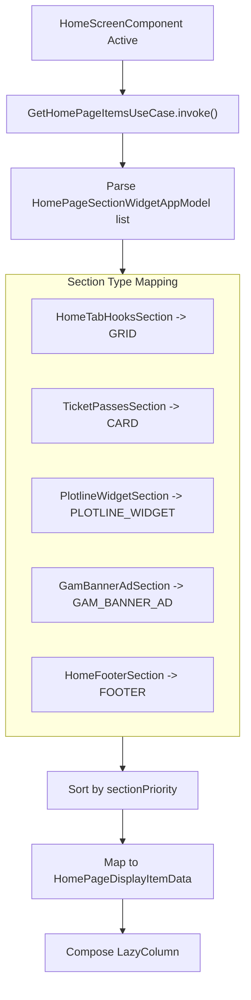

---

## RegularBusComponent (City Bus Tab)

The RegularBusComponent provides the city bus experience with nearby stops, real-time arrivals, recent searches, and configurable sections. It coordinates with `FetchNearbyTripsUseCase` for location-based transit data and manages location permission flows.

**Source**: `shared/home/src/commonMain/kotlin/app/chalo/home/ui/regularbus/RegularBusComponent.kt`

### View State Structure

| Field | Type | Description |
|-------|------|-------------|
| **regularBusPageSections** | List<RegularBusPageDisplayItemData>? | Dynamic content sections |
| **nearbyStopTrips** | NearbyStopAndTripsUiModel? | Nearby stops with arrivals |
| **recentSearchedItemList** | List<RecentSearchedItem> | Recent route searches |
| **nearbyBusesMapData** | NearbyBusesMapData | Map markers and camera state |
| **tabMetaData** | TabMetaDataAppModel | Header configuration |
| **currentCity** | String? | Selected city context |
| **isLocationMandatory** | Boolean | Location requirement flag |
| **locationTooltipData** | LocationTooltipData? | GPS prompt tooltip |
| **bottomSheetType** | RegularBusScreenBottomSheetType? | Active bottom sheet |

### Intent Types

| Intent | Trigger | Description |
|--------|---------|-------------|
| **RegularBusScreenInitializationIntent** | Tab selected | Initializes with config data |
| **RegularBusScreenViewStartedIntent** | Tab visible | Starts polling and location |
| **RegularBusScreenViewStoppedIntent** | Tab hidden | Pauses background work |
| **ChaloSearchBarClickedIntent** | Search tap | Opens universal search |
| **StopClickedIntent** | Stop card tap | Shows stop details |
| **RouteClickedIntent** | Route tap | Opens live tracking |
| **LocationTurnOnButtonClickedIntent** | Enable tap | Requests GPS permission |
| **RecentSearchItemClicked** | Recent item tap | Executes saved search |

### Section Display Types

| Display Type | Widget | Description |
|--------------|--------|-------------|
| **NEARBY_BUS_STOPS** | NearbyStopsSection | Location-based stop cards |
| **NEARBY_BUSES** | NearbyBusesSection | Map with bus markers |
| **PRODUCT_PURCHASE** | QuickPaymentsSection | Pass purchase cards |
| **FAQ** | FAQSection | Expandable FAQ items |
| **PLOTLINE_WIDGET** | PlotlineWidgetSection | Marketing content |
| **FOOTER** | RegularBusFooterSection | Agency branding |

### Location Flow

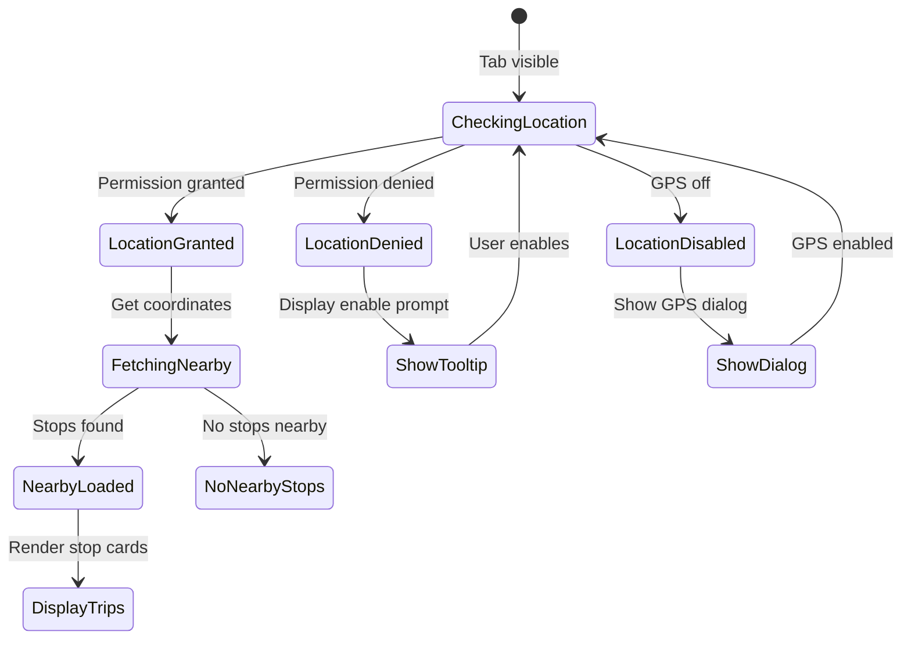

---

## ChaloBusComponent (Premium Bus Tab)

The ChaloBusComponent handles premium inter-city bus booking with origin-destination selection, date/time picking, nearby route discovery, and pass savings display. It integrates with `UniversalSearchResultStateManager` for stop selection and uses a sophisticated bottom sheet system for date picker flows.

**Source**: `shared/home/src/commonMain/kotlin/app/chalo/home/ui/chalobus/ChaloBusComponent.kt`

### Constructor Dependencies

The component receives extensive dependencies including:

| Dependency | Purpose |
|------------|---------|
| **GetChaloPageItemsUseCase** | Transforms config sections |
| **GetPremiumBusCurrentCityConfigUseCase** | City-specific premium config |
| **GetRecentAndFlippedOriginDestinationPairsUseCase** | Past booking shortcuts |
| **FetchCurrentLocationUseCase** | User location for auto-fill |
| **FetchNearbyRoutesToLocationUseCase** | Nearby premium routes |
| **FetchPremiumPassSavingsUseCase** | Pass savings promotion |
| **HomeTabScreensNavigationAndStateManager** | Cross-tab coordination |
| **UniversalSearchResultStateManager** | Stop selection results |
| **ChaloNavigationManager** | External navigation |

### View State Structure

| Field | Type | Description |
|-------|------|-------------|
| **chaloBusPageSections** | List<ChaloBusPageDisplayItemData>? | Dynamic sections |
| **fromStopOrPlaceSelected** | PBStopPlaceSelectedAppModel? | Origin selection |
| **toStopOrPlaceSelected** | PBStopPlaceSelectedAppModel? | Destination selection |
| **originDestinationPairsFromPastPurchases** | List<PBOriginDestinationAppModel> | Recent O-D pairs |
| **nearbyRoutesState** | PBNearbyRoutesState | Nearby routes status |
| **passSavingsInfo** | PremiumPassSavingsInfo? | Savings promotion data |
| **selectedDateAndTime** | SelectedDateAndTime? | Booking date/time |
| **bottomSheetType** | PBStopSelectionScreenBottomSheetType? | Active bottom sheet |
| **shouldEnableSearchBtn** | Boolean | Proceed button state |
| **timeAndDatePickerTabTypes** | TimeAndDatePickerTabTypes | Today/Tomorrow/Select |

### Intent Processing

| Intent | Handler | Description |
|--------|---------|-------------|
| **ChaloBusScreenInitializationIntent** | handleChaloBusScreenInitializationIntent | Loads config, recent pairs, pass savings |
| **StopSelectionFieldClickedIntent** | handleStopSelectionFieldClickedIntent | Opens universal search |
| **StopSelectionFieldResultIntent** | handleStopSelectionFieldResultIntent | Processes stop selection |
| **StopSwapButtonClickedIntent** | handleStopSwapButtonClickedIntent | Swaps origin/destination |
| **ProceedBtnClickIntent** | handleProceedBtnClickIntent | Opens date picker sheet |
| **TimePickerContinueBtnClickedIntent** | handleTimePickerContinueBtnClickedIntent | Navigates to slot selection |
| **PBRouteClicked** | handlePBRouteClickedIntent | Opens route details |
| **PassSavingsBannerInfoBtnClickedIntent** | handlePassSavingsBannerInfoBtnClickedIntent | Shows savings FAQs |

### Nearby Routes State

| State | Description |
|-------|-------------|
| **Loading** | Fetching routes from API |
| **RoutesAvailable** | Routes found with category (Nearby/Popular) |
| **NoRoutes** | No routes in current area |
| **Error** | Fetch failed with message |

### Tab Visibility Management

The component implements a visibility-aware pattern:

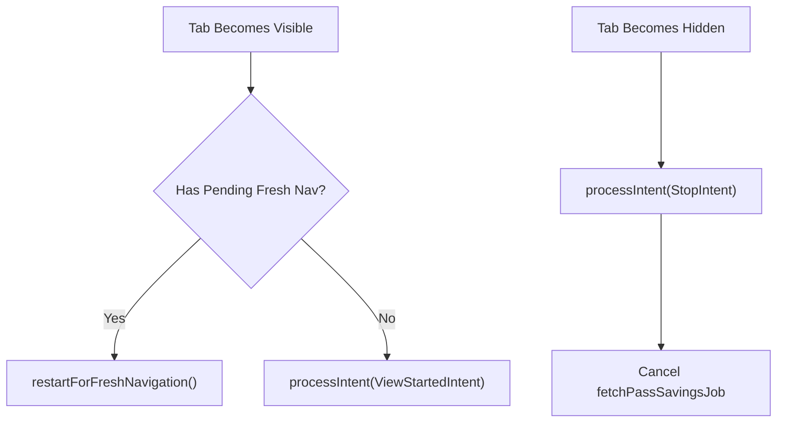

### Bottom Sheet Types

| Type | Content | Trigger |
|------|---------|---------|
| **PremiumBusDateAndTimePickerBottomSheet** | Date/time selection | Proceed button tap |
| **NoOriginDestinationPairsAvailable** | Suggestion prompt | No recent pairs |
| **NewRouteSuggestion** | Route request form | User wants new route |
| **PremiumPassSavingsFaqsBottomSheet** | Savings explanation | Info button tap |

---

## MyTicketsComponent (History Tab)

The MyTicketsComponent displays user booking history including active tickets, passes, pending items, and expired bookings. It provides quick actions for ticket usage, rebooking, and status handling. The component manages complex product type variations across tickets, passes, and premium bus bookings.

**Source**: `shared/home/src/commonMain/kotlin/app/chalo/home/ui/history/MyTicketsComponent.kt`

### Constructor Dependencies

| Dependency | Purpose |
|------------|---------|
| **GetAllRequestedBookedProductsUseCase** | Fetches all product types |
| **ActivateProductIfRequiredUseCase** | Handles ticket activation |
| **RunPreActivationChecksUseCase** | Pre-validation checks |
| **GetValidationProcessFlowDetailsForValidationProductUseCase** | Validation flow routing |
| **GetBookableProductConfigForRenewUseCase** | Renewal eligibility |
| **GetPremiumReserveTicketByIdUseCase** | Premium ticket details |
| **ValidationSceneResolverUseCase** | BLE validation routing |
| **MyTicketsUiStateFactory** | UI state construction |

### Data State Structure

| Field | Type | Description |
|-------|------|-------------|
| **productsTabList** | List<TicketsPassesTabType> | ACTIVE, EXPIRED tabs |
| **bookingTypeList** | List<ChaloUserBookingType>? | Active bookings |
| **expiredBookingTypeList** | List<ChaloUserBookingType>? | Expired bookings |
| **currentlySelectedTab** | TicketsPassesTabType | Active or History |
| **premiumBusBookingDataMap** | Map<String, PremiumBusBookingCardData> | Premium ticket UI data |
| **shouldShowReclaimCard** | Boolean | Multi-device reclaim prompt |
| **layoutType** | TicketsPageLayoutType | Main or notification explainer |
| **alertDialogType** | TicketsPageAlertDialogType? | Active dialog |
| **bottomSheetType** | TicketsScreenBottomSheetType? | Active bottom sheet |

### Intent Types

| Intent | Handler | Description |
|--------|---------|-------------|
| **MyTicketsPageInitializationIntent** | handleMyTicketsPageInitializationIntent | Initial setup |
| **TicketsScreenViewStartedIntent** | handleTicketsScreenViewStartedIntent | Start data collection |
| **TicketsScreenViewStoppedIntent** | handleTicketsScreenViewStoppedIntent | Pause background work |
| **QuickFilterTabClickedIntent** | handleQuickFilterTabClickedIntent | Switch Active/History |
| **UseNowClickedIntent** | handleUseNowClickedIntent | Activate ticket for use |
| **BookAgainClickedIntent** | handleBookAgainClickedIntent | Rebooking flow |
| **ReclaimButtonClickedIntent** | handleReclaimButtonClickedIntent | Multi-device reclaim |
| **OnProductStatusCtaClickedIntent** | handleOnProductStatusCtaClickedIntent | Status action CTA |

### Booking Type Hierarchy

The component handles these booking types through `ChaloUserBookingType`:

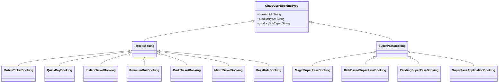

### Tab Layout Types

| Type | Description |
|------|-------------|
| **TICKETS_PASSES_SECTION** | Normal ticket/pass display |
| **NOTIFICATION_TURN_ON_EXPLAINER** | Notification permission prompt |

---

## ProfileScreenComponent (Drawer)

The ProfileScreenComponent renders the user profile drawer with account information, quick actions, and navigation to various app features. It processes profile page items through `GetProfilePageItemsUseCase` to display configured menu options.

**Source**: `shared/home/src/commonMain/kotlin/app/chalo/home/ui/profile/ProfileScreenComponent.kt`

### Constructor Dependencies

| Dependency | Purpose |
|------------|---------|
| **WalletDataStore** | Wallet intro state |
| **GetProfilePageItemsUseCase** | Menu item processing |
| **HomeScreenInfoHelper** | Bottom nav visibility |
| **ChaloTimeRefreshManagerUseCase** | Time sync trigger |
| **InitiateFreshChatCustomerSupportUseCase** | Support chat |
| **UserProfileDetailsProvider** | User info |
| **CityProvider** | Current city |

### View State Structure

| Field | Type | Description |
|-------|------|-------------|
| **profilePageItemList** | List<ProfilePageDisplayItemData>? | Menu items |
| **versionCode** | String? | App version |
| **isDebugBuild** | Boolean | Debug mode flag |
| **bottomSheetType** | ProfileScreenBottomSheetType? | Active bottom sheet |
| **showEnvironmentChangeDialog** | Boolean | Debug env dialog |

### Intent Processing

| Intent | Handler | Description |
|--------|---------|-------------|
| **ProfileScreenStartedIntent** | handleProfileScreenStartedIntent | Loads profile items |
| **ProfilePageItemClickedIntent** | handleProfilePageItemClickedIntent | Routes to feature |
| **ChaloPayIntroBottomSheetCtaClickedIntent** | handleChaloPayIntroBottomSheetCtaClickedIntent | Wallet onboarding |
| **CloseEnvironmentChangeDialog** | - | Hides debug dialog |

### Profile Page Features

| Feature | Icon | Navigation |
|---------|------|------------|
| **PROFILE** | Profile icon | UserProfileDisplayArgs |
| **CHALO_WALLET** | Wallet icon | WalletBalanceArgs |
| **TICKETS_PASSES** | Ticket icon | MyTickets tab switch |
| **BUS_STOPS_NEAR_ME** | Bus icon | NearbyStopsMapArgs |
| **SOS** | SOS icon | SosArgs |
| **CHANGE_LANGUAGE** | Globe icon | LanguageSelectionArgs |
| **CUSTOMER_SUPPORT** | Support icon | FreshChat launch |
| **MANAGE_TRAVEL_CARD** | Card icon | ChaloCardLandingScreenArgs |
| **USER_CONSENT** | Consent icon | UserConsentScreenArgs |

---

## HomeTabScreensNavigationAndStateManager

The state manager coordinates tab navigation, state preservation, and cross-tab communication. It maintains retained state that survives configuration changes and handles lazy tab initialization with fresh navigation signals.

**Source**: `shared/home/src/commonMain/kotlin/app/chalo/home/ui/HomeTabScreensNavigationAndStateManager.kt`

### Responsibilities

- Tracks currently selected tab
- Manages fresh navigation signals per tab
- Preserves tab-specific retained state
- Coordinates tab switches with state restore/save
- Handles back navigation within tabs

### State Structure

| Field | Type | Description |
|-------|------|-------------|
| **currentTab** | BottomNavTabType | Currently selected tab |
| **regularBus** | RegularScreen? | Regular bus retained state |
| **chaloBus** | ChaloBusScreen? | Chalo bus retained state |
| **myTickets** | MyTicketsScreen? | My tickets retained state |
| **freshNavigationSignals** | Map<BottomNavTabType, Int> | Fresh nav counters |

### Fresh Navigation Signal Flow

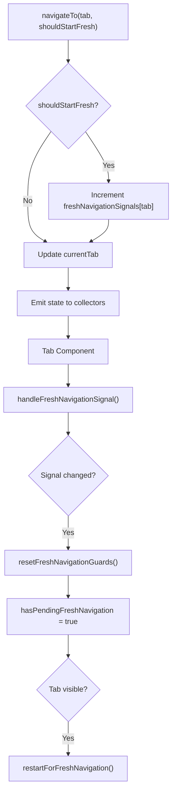

---

## HomeTabVisibilityController

The visibility controller tracks which tab is currently visible and provides per-tab visibility flows for resource optimization.

### Visibility Flow Pattern

Each tab component observes its visibility:

```kotlin
val tabVisibilityFlow: Flow<Boolean> = homeTabVisibilityController.visibleFlowFor(tabType)

init {
    componentScope.launch {
        tabVisibilityFlow.collect { visible ->
            when {
                visible && !isTabCurrentlyVisible -> {
                    isTabCurrentlyVisible = true
                    processIntent(ViewStartedIntent)
                }
                !visible && isTabCurrentlyVisible -> {
                    isTabCurrentlyVisible = false
                    processIntent(ViewStoppedIntent)
                }
            }
        }
    }
}
```

---

## Navigation Integration

All components use `ChaloNavigationManager` for external navigation with typed args:

### Navigation Request Pattern

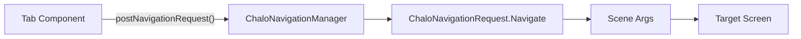

### Common Navigation Args

| Args Class | Destination |
|------------|-------------|
| **ProductSelectionArgs** | Pass/ticket purchase |
| **RouteDetailsArgs** | Route live tracking |
| **PremiumBusArgs.SlotSelectionArgs** | Premium booking flow |
| **UniversalPickerArgs** | Universal search |
| **UserProfileDisplayArgs** | Profile edit |
| **WalletBalanceArgs** | Wallet screen |

---

## Analytics Integration

Components use `HomeScreenAnalyticsHelper` for event tracking:

| Event | Component | Trigger |
|-------|-----------|---------|
| **HOME_PAGE_RENDERED** | HomeScreenComponent | Tab initialized |
| **HOME_PAGE_CARD_ITEM_RENDERED** | HomeScreenComponent | Section displayed |
| **REGULAR_BUS_PAGE_RENDERED** | RegularBusComponent | Tab initialized |
| **CHALO_BUS_PAGE_RENDERED** | ChaloBusComponent | Tab initialized |
| **PB_PASS_SAVINGS_FETCH_SUCCESS** | ChaloBusComponent | Savings loaded |
| **PB_EVENT_TRIP_DETAILS_SUBMITTED** | ChaloBusComponent | Proceed clicked |
| **TICKETS_PAGE_CARD_ITEM_CLICKED** | MyTicketsComponent | Item tapped |
| **PROFILE_SCREEN_RENDERED** | ProfileScreenComponent | Drawer opened |

---

## Error Handling

Each component implements error handling through state updates:

| Error Scenario | Component | UI Response |
|----------------|-----------|-------------|
| **Config fetch failed** | HomeScreenComponent | Show cached content or retry |
| **Nearby stops failed** | RegularBusComponent | Show error section with retry |
| **Location unavailable** | RegularBusComponent | Show location tooltip |
| **Premium routes failed** | ChaloBusComponent | Show NoRoutes state |
| **Ticket history failed** | MyTicketsComponent | Show error with retry |
| **Pass savings failed** | ChaloBusComponent | Hide savings banner |

---

## RegularBusComponent Deep Dive

The RegularBusComponent is one of the most complex tab components, managing live bus tracking, nearby stop discovery, location permissions, and real-time ETA updates. It implements sophisticated job tracking for visibility-aware polling.

### Visibility-Aware Job Management

The component uses a `VisibleJobTracker` pattern to manage coroutine jobs that should only run while the tab is visible:

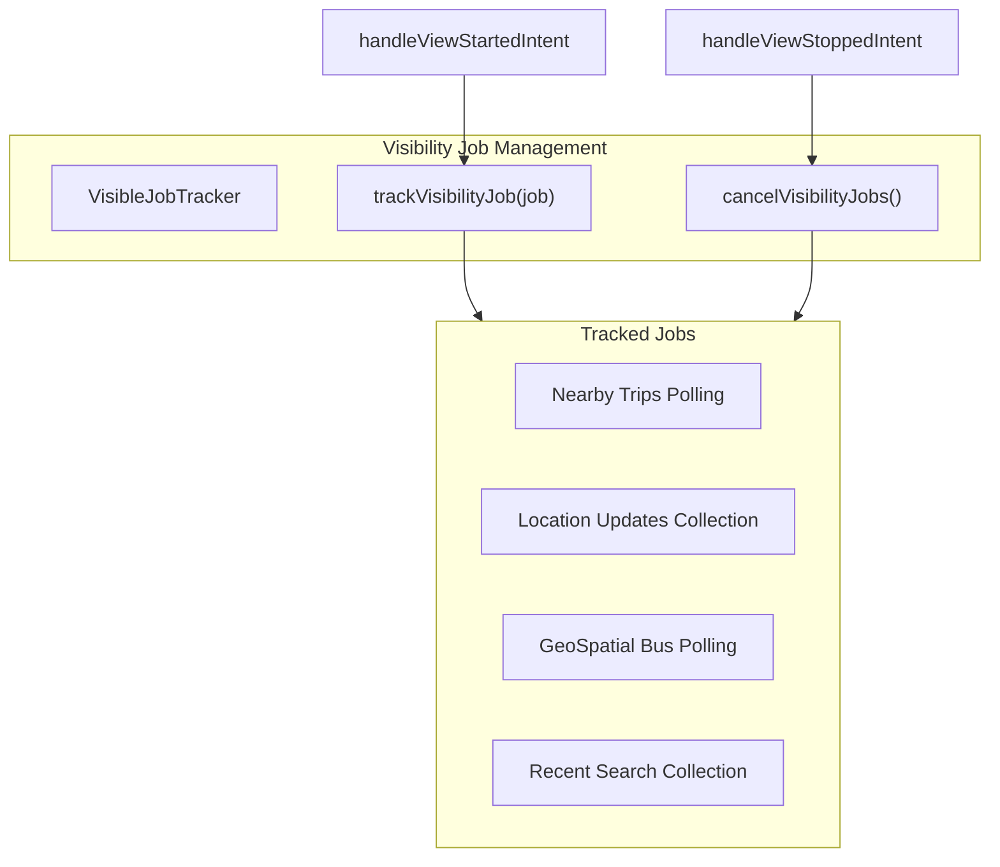

### Fresh Navigation Signal Handling

When a tab receives a fresh navigation signal (e.g., from deeplink or cross-tab navigation), it resets its initialization guards:

| Guard | Initial Value | Reset On | Purpose |
|-------|---------------|----------|---------|
| `shouldHandleInitializationIntent` | true | Fresh navigation | Allows re-initialization |
| `shouldFetchInitialDataWithGeoQuery` | true | Fresh navigation | Forces geo query refresh |
| `validLocationReceived` | false | Fresh navigation | Resets location state |

### NearbyTripsDataManager Integration

The component integrates with `NearbyTripsDataManagerBase` for live ETA collection:

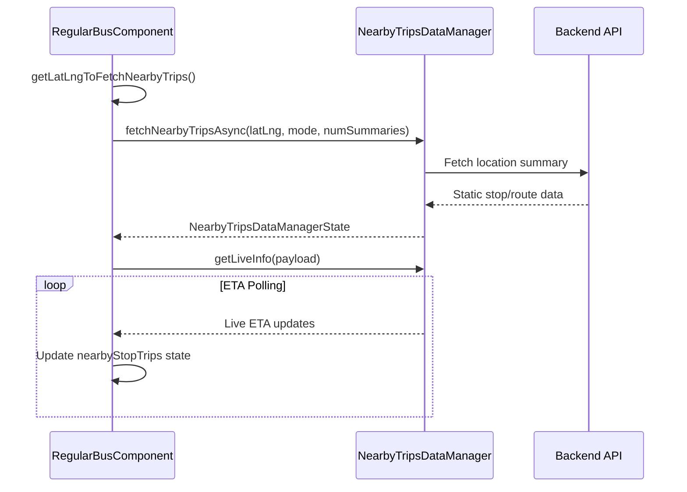

### Seat Occupancy Bottom Sheet

The component can display seat availability information when configured for the city:

| Occupancy Mode | Level 1 | Level 2 | Level 3 |
|----------------|---------|---------|---------|
| **Mode 1** | Seats Available | Standing Available | Over Crowded |
| **Mode 2** | Space Available | Nearing Full Capacity | Full Capacity Reached |

---

## ChaloBusComponent Deep Dive

The ChaloBusComponent manages premium bus booking with a complex stop selection and date/time picking flow.

### Stop Selection Flow

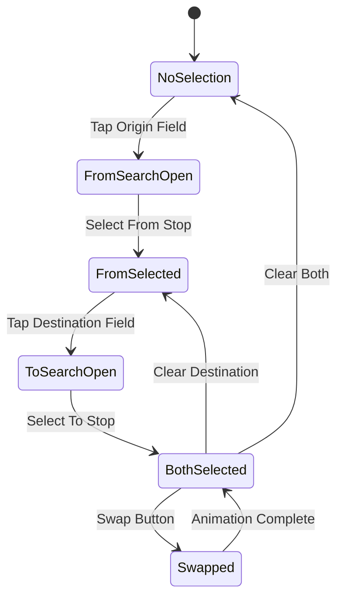

### Date/Time Selection Tabs

| Tab Type | Behavior |
|----------|----------|
| `TODAY` | Uses current date, time picker for departure time |
| `TOMORROW` | Uses next day, time picker for departure time |
| `SELECT_DATE` | Opens date picker dialog, then time picker |

### Pass Savings Fetch Integration

The component fetches and displays pass savings to encourage pass purchases:

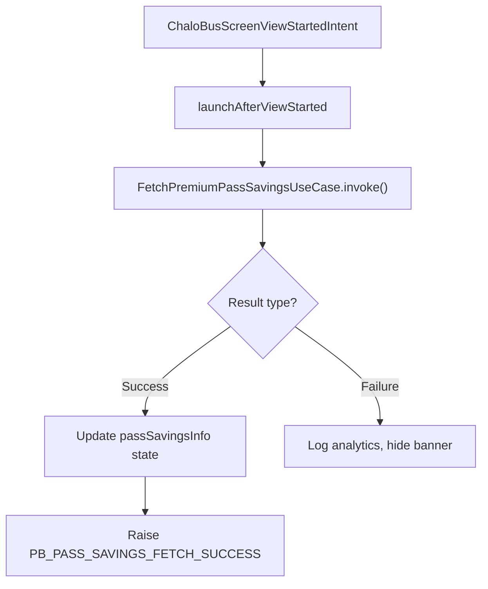

---

## MyTicketsComponent Deep Dive

The MyTicketsComponent displays all user bookings with complex product type handling and activation flows.

### Booking Type Classification

| Category | Product Types | Display Handling |
|----------|---------------|------------------|
| **Mobile Tickets** | MTicket, QuickPay, InstantTicket | Show QR code action |
| **Premium Bus** | PremiumBusBooking | Show booking card with route details |
| **Super Passes** | RideBasedPass, MagicPass | Show usage counter, days remaining |
| **Pending Items** | PendingSuperPassBooking, SuperPassApplication | Show status with CTA |
| **ONDC/Metro** | OndcTicketBooking, MetroTicketBooking | Product-specific display |

### Activation Flow

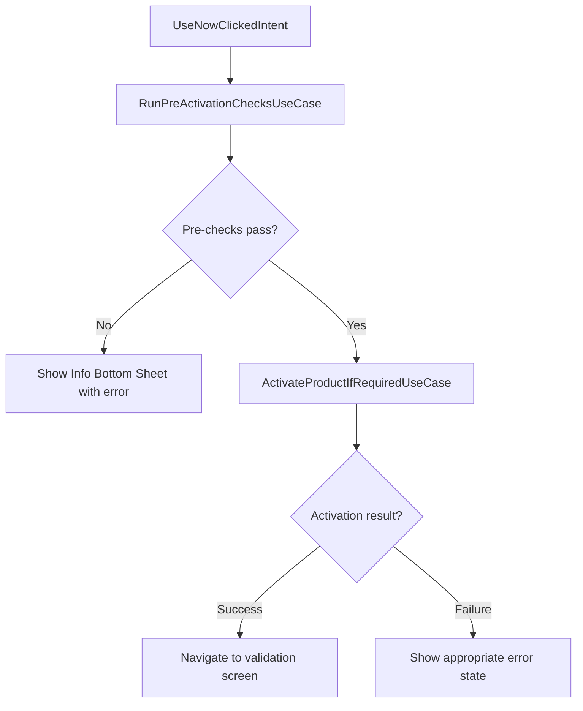

### Tab UI State Management

Each tab (Active/Expired) maintains its own UI metadata:

| Property | Type | Description |
|----------|------|-------------|
| `shouldShowWhiteBg` | Boolean | Background color variant |
| `shouldShowTicketSeeAll` | Boolean | Show "See All" for tickets |
| `shouldShowPassesSeeAll` | Boolean | Show "See All" for passes |
| `shouldShowTabEmptyState` | Boolean | Display empty state |
| `shouldShowTicketsSection` | Boolean | Tickets section visibility |
| `shouldShowPassesSection` | Boolean | Passes section visibility |
| `totalTickets` | Int | Count for badge display |
