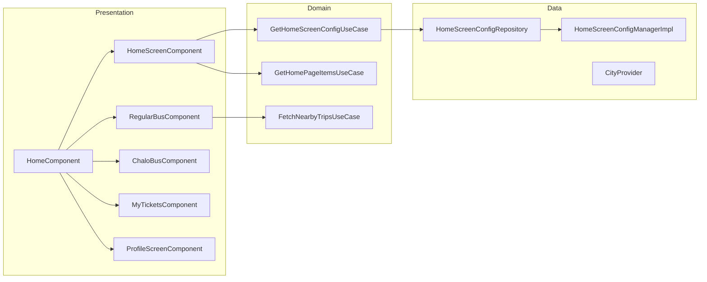

# Home — High-Level Design

## Overview

The Home feature is the main dashboard of the Chalo app, providing access to all major functionalities. It includes a bottom navigation with tabs (Home, Regular Bus, Chalo Bus, My Tickets), a profile drawer, dynamic home page sections, nearby stops/buses, and city-specific content. The feature manages navigation between tabs and coordinates with various sub-features.

## User Journey

1. **Entry Points**:
   - App launch (after onboarding/login)
   - Back navigation from child screens
   - Deep links to specific tabs

2. **Core Flow**:
   - View home dashboard with cards and widgets
   - Switch between bottom tabs
   - Access profile via drawer
   - View nearby stops and buses
   - Quick access to booking flows
   - Change city if needed

3. **Exit Points**:
   - Product booking flows
   - Live tracking screen
   - Profile/settings screens
   - Search/trip planner
   - External links

## Architecture Diagram



## Key Components

| Component | Platform | File Path | Responsibility |
|-----------|----------|-----------|----------------|
| `HomeComponent` | Shared | `shared/home/.../ui/base/HomeComponent.kt` | Root tab container |
| `HomeScreenComponent` | Shared | `shared/home/.../ui/home/HomeScreenComponent.kt` | Home tab dashboard |
| `RegularBusComponent` | Shared | `shared/home/.../ui/regularbus/RegularBusComponent.kt` | Regular bus tab |
| `ChaloBusComponent` | Shared | `shared/home/.../ui/chalobus/ChaloBusComponent.kt` | Premium bus tab |
| `MyTicketsComponent` | Shared | `shared/home/.../ui/history/MyTicketsComponent.kt` | History/tickets tab |
| `ProfileScreenComponent` | Shared | `shared/home/.../ui/profile/ProfileScreenComponent.kt` | Profile drawer |
| `HomeTabScreensNavigationAndStateManager` | Shared | `shared/home/.../ui/HomeTabScreensNavigationAndStateManager.kt` | Tab navigation |
| `GetHomeScreenConfigUseCase` | Shared | `shared/home/.../domain/GetHomeScreenConfigUseCase.kt` | Config fetching |

## Data Flow

### Home Screen Initialization
1. `HomeComponent` initializes with city context
2. `GetHomeScreenConfigUseCase` fetches city-specific config
3. `HomeScreenConfigRepository` checks cache, fetches from API if needed
4. `GetHomePageItemsUseCase` converts config to display items
5. UI renders home sections (cards, widgets, ads)

### Tab Navigation
1. User taps bottom navigation tab
2. `HomeTabVisibilityController` updates current tab
3. `HomeTabScreensNavigationAndStateManager` handles state
4. Tab component initializes or restores state
5. `HomeTabScreensRetainedData` preserves state across switches

### Nearby Trips (Regular Bus)
1. `RegularBusComponent` initializes
2. Location permission checked
3. `FetchNearbyTripsUseCase` queries nearby stops
4. Results rendered in nearby stops cards
5. Real-time updates via polling

## Platform Differences

### Android-Specific
- `NearbyBusMarkerIconHelperAndroid` — Custom map markers
- Material3 bottom navigation
- Compose navigation animations

### iOS-Specific
- SwiftUI tab bar integration
- MapKit marker rendering
- iOS-specific transition animations

## Integration Points

### Analytics Events
- See [Analytics: home](/analytics/flows/home) for event documentation
- Key events:
  - `home_screen_opened`
  - `home_tab_switched`
  - `home_card_clicked`
  - `nearby_stop_clicked`
  - `city_change_clicked`

### Shared Services
- **City Provider**: `CityProviderImpl` for city state
- **Location**: `ChaloLocationManager` for GPS
- **Config**: `HomeScreenConfigManager` for dynamic content
- **Wallet**: Wallet balance sync

### Navigation
- **Navigates to**: Booking flows, Live tracking, Search, Profile, Settings
- **Navigated from**: Onboarding, Login, Deep links

## Bottom Tabs

| Tab | Component | Description |
|-----|-----------|-------------|
| HOME | `HomeScreenComponent` | Dashboard with cards and widgets |
| REGULAR_BUS | `RegularBusComponent` | City bus routes and nearby stops |
| CHALO_BUS | `ChaloBusComponent` | Premium bus booking |
| MY_TICKETS | `MyTicketsComponent` | Active/expired bookings |
| SEARCH | — | Opens search flow (not a tab screen) |

## Home Page Sections

| Section Type | Description |
|--------------|-------------|
| `GRID` | Grid of action cards (tickets, passes, etc.) |
| `CARD` | Single promotional card |
| `PLOTLINE_WIDGET` | Marketing widget |
| `GAM_BANNER_AD` | Google Ad Manager banner |
| `FOOTER` | City agency branding |
| `DIVIDER` | Visual separator |

## Edge Cases & Error Handling

| Scenario | Handling |
|----------|----------|
| Config fetch failed | Uses cached config or defaults |
| Location unavailable | Shows manual location entry |
| City not supported | Redirects to city selection |
| Network offline | Shows cached content |
| Tab state lost | Restores from `HomeTabScreensRetainedData` |

## City Change Flow

1. User taps city name in header
2. `CityLocationSelectionComponent` launched
3. User selects new city (GPS or manual)
4. `ProcessCityChangeUseCase` executes:
   - Updates base URL
   - Clears product data
   - Refreshes analytics
   - Updates crash reporting
5. Home screen refreshes with new city config

## Data Models

### HomeScreenBottomTabConfiguration
```kotlin
enum class HomeScreenBottomTab {
    HOME,
    REGULAR_BUS,
    CHALO_BUS,
    MY_TICKETS
}
```

### HomeScreenViewState
```kotlin
data class HomeScreenViewState(
    val profilePhotoUrl: String?,
    val homePageSections: List<HomePageSection>,
    val currentCity: CityAppModel?,
    val bottomSheetType: HomeBottomSheetType,
    val locationTooltipData: LocationTooltipData?
)
```

### RegularBusViewState
```kotlin
data class RegularBusViewState(
    val nearbyStopTrips: List<NearbyStopTripItem>,
    val recentSearchedItemList: List<RecentSearchItem>,
    val currentCity: CityAppModel?,
    val profilePhotoUrl: String?,
    val isLocationEnabled: Boolean
)
```

### ChaloBusViewState
```kotlin
data class ChaloBusViewState(
    val chaloBusPageSections: List<ChaloBusSection>,
    val nearbyRoutesState: NearbyRoutesState,
    val originDestinationPairsFromPastPurchases: List<OriginDestinationPair>,
    val passSavingsInfo: PremiumPassSavingsInfo?
)
```

## Drawer Configuration

```kotlin
sealed class ProfileDrawerChild {
    data class ProfileScreen(val component: ProfileScreenComponent)
    // Future: Settings, Language, etc.
}
```

## Dependencies

### Internal
- `shared:home` — All home components
- `shared:livetracking` — Nearby stops integration
- `shared:chalo-base` — Base utilities, models
- `shared:onboarding` — City provider

### External
- Google Maps SDK — Map rendering
- Google Ad Manager — Banner ads
- Firebase Remote Config — Dynamic content
- DataStore — Config caching
