# Home — Repository Documentation

## Data Layer Overview

The Home feature data layer manages home screen configuration, ticket persistence, pass savings retrieval, and city-scoped data access. The layer coordinates remote data sources for API calls with local storage mechanisms including DataStore for preferences and Room/SQLDelight DAOs for structured data. A consistent pattern of interface-implementation separation enables testing and platform-specific implementations.

The architecture follows the repository pattern where repositories orchestrate data sources, mappers handle API-to-app model conversion, and local stores provide offline capability and caching.

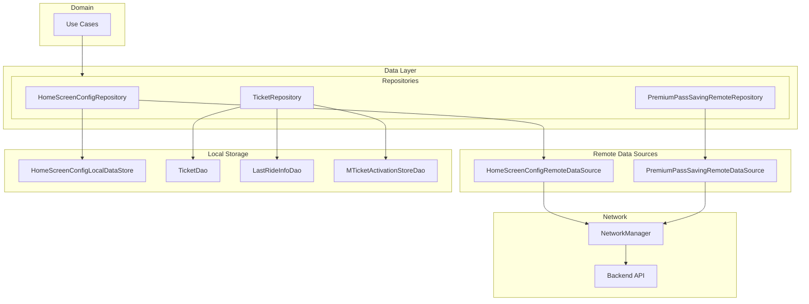

---

## Repository Inventory

| Repository | Type | Purpose |
|------------|------|---------|
| **IHomeScreenConfigRepository** | Interface | Home screen configuration management |
| **HomeScreenConfigRepository** | Implementation | Coordinates remote and local config sources |
| **TicketRepository** | Interface | Mobile ticket CRUD operations |
| **TicketRepositoryImpl** | Implementation | City-scoped ticket persistence |
| **PremiumPassSavingRemoteRepository** | Interface | Pass savings API access |
| **PremiumPassSavingRemoteRepositoryImpl** | Implementation | Savings fetch with validation |

---

## IHomeScreenConfigRepository

Manages home screen configuration retrieval with ETag-based caching support.

**Source**: `shared/home/src/commonMain/kotlin/app/chalo/home/data/repository/IHomeScreenConfigRepository.kt`

### Interface Definition

| Method | Parameters | Returns | Purpose |
|--------|------------|---------|---------|
| **fetchHomeScreenConfigFromServer** | cityId: String, cachedEtag: String? | Pair<HomeScreenConfigFetchApiModel, List<ETAG>?> | Fetch config with conditional request |

---

## HomeScreenConfigRepository

Coordinates configuration fetching between remote API and local DataStore cache. Implements ETag-based conditional requests and manages cache persistence with city-specific keys.

**Source**: `shared/home/src/commonMain/kotlin/app/chalo/home/data/repository/HomeScreenConfigRepository.kt`

### Constructor Dependencies

| Dependency | Purpose |
|------------|---------|
| **IHomeScreenConfigRemoteDataSource** | Remote API calls |
| **HomeScreenConfigLocalDataStore** | Local cache persistence |

### Implementation Details

The repository delegates network operations to the remote data source and cache operations to the local data store. It does not implement caching logic internally but coordinates the two data sources.

### Data Flow

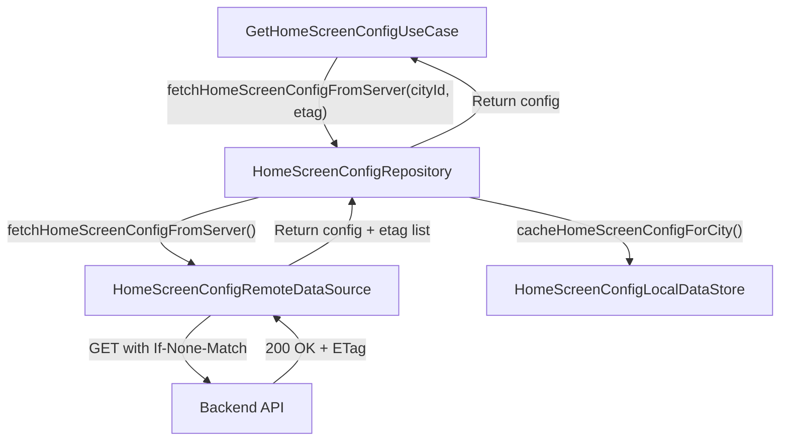

---

## TicketRepository

Interface for mobile ticket data access with city-scoped queries and activation info management.

**Source**: `shared/home/src/commonMain/kotlin/app/chalo/home/data/repository/TicketRepository.kt`

### Interface Definition

| Method | Parameters | Returns | Purpose |
|--------|------------|---------|---------|
| **addTripReceiptToMTicket** | ticketId: String, receipt: MTicketTripReceipt? | Unit | Attach trip receipt to ticket |
| **getAllTickets** | - | Flow<List<MTicket>> | Stream city-scoped tickets |
| **getCurrentTicket** | ticketId: String | MTicket? | Get specific ticket by ID |
| **insertOrUpdate** | newTicket: MTicket | Unit | Upsert ticket record |
| **citySpecificTicketCount** | - | Int | Count tickets for current city |
| **deleteAllTicketData** | - | Unit | Clear all ticket records |
| **getTicketFromBookingId** | bookingId: String | MTicket? | Lookup by booking reference |
| **updateExpiryState** | bookingId: String | Unit | Mark ticket as expired |
| **getLastRideInfo** | city: String | LastRideInfo? | Get last ride for city |
| **storeLastRideInfo** | city: String, data: LastRideInfo | Unit | Persist last ride info |
| **setMTicketActivationInfo** | activationInfo: MTicketActivationInfoAppModel | Unit | Store activation metadata |
| **getMTicketActivationInfo** | city: String, ticketId: String | MTicketActivationInfoAppModel? | Retrieve activation info |

---

## TicketRepositoryImpl

Implementation that coordinates multiple DAOs for ticket-related data access with consistent city-name lowercasing.

**Source**: `shared/home/src/commonMain/kotlin/app/chalo/home/data/repository/TicketRepositoryImpl.kt`

### Constructor Dependencies

| Dependency | Purpose |
|------------|---------|
| **TicketDao** | Ticket table CRUD |
| **LastRideInfoDao** | Last ride persistence |
| **MTicketActivationStoreDao** | Activation metadata |
| **CityProvider** | Current city context |

### Implementation Patterns

#### City Scoping

All ticket queries are scoped to the current city:

```kotlin
override fun getAllTickets(): Flow<List<MTicket>> {
    val city = cityProvider.getCurrentCityName()?.lowercase() ?: ""
    return ticketDao.getAllTickets(city)
}
```

#### City Name Normalization

Ticket records are normalized to lowercase city names before persistence:

```kotlin
override suspend fun insertOrUpdate(newTicket: MTicket) {
    val ticketWithLowercasedCityName = newTicket.copy(
        cityName = newTicket.cityName.lowercase()
    )
    ticketDao.insertOrUpdate(ticketWithLowercasedCityName)
}
```

#### Model Conversion

Activation info is converted between app model and entity model:

```kotlin
override suspend fun setMTicketActivationInfo(activationInfo: MTicketActivationInfoAppModel) {
    mTicketActivationStoreDao.setMTicketActivationInfo(activationInfo.toEntityModel())
}

override suspend fun getMTicketActivationInfo(city: String, ticketId: String): MTicketActivationInfoAppModel? {
    return mTicketActivationStoreDao.getMTicketActivationInfo(
        city = city.lowercase(),
        ticketId = ticketId
    )?.toAppModel()
}
```

---

## PremiumPassSavingRemoteRepository

Interface for fetching premium pass savings from the backend API.

**Source**: `shared/home/src/commonMain/kotlin/app/chalo/home/data/repository/PremiumPassSavingRemoteRepository.kt`

### Interface Definition

| Method | Parameters | Returns | Purpose |
|--------|------------|---------|---------|
| **fetchPremiumPassSaving** | userId: String | PassSavingResponseAppModel | Fetch user's pass savings |

---

## PremiumPassSavingRemoteRepositoryImpl

Implementation that fetches savings via remote data source with validation.

**Source**: `shared/home/src/commonMain/kotlin/app/chalo/home/data/repository/PremiumPassSavingRemoteRepositoryImpl.kt`

### Constructor Dependencies

| Dependency | Purpose |
|------------|---------|
| **PremiumPassSavingRemoteDataSource** | API calls |

### Implementation

```kotlin
override suspend fun fetchPremiumPassSaving(userId: String): PassSavingResponseAppModel {
    return premiumPassSavingRemoteDataSource
        .fetchPremiumPassSaving(userId = userId)
        .toAppModelOrNullIfInvalid()
        ?: throw PremiumPassSavingInvalidDataException()
}
```

The repository validates the API response during conversion. If the response cannot be converted to a valid app model, it throws `PremiumPassSavingInvalidDataException`.

---

## Remote Data Sources

### IHomeScreenConfigRemoteDataSource

Interface for home screen configuration API operations.

**Source**: `shared/home/src/commonMain/kotlin/app/chalo/home/data/remote/IHomeScreenConfigRemoteDataSource.kt`

| Method | Parameters | Returns | Purpose |
|--------|------------|---------|---------|
| **fetchHomeScreenConfigFromServer** | cityId: String, cachedEtag: String? | Pair<HomeScreenConfigFetchApiModel, List<ETAG>?> | Fetch config with conditional request |
| **checkIfUpdateRequired** | queryParamMap: Map<String, String> | CheckAppUpdateResponseApiModel | Check for app updates |

### HomeScreenConfigRemoteDataSource

Implementation using NetworkManager for HTTP requests.

**Source**: `shared/home/src/commonMain/kotlin/app/chalo/home/data/remote/HomeScreenConfigRemoteDataSource.kt`

#### Constructor Dependencies

| Dependency | Purpose |
|------------|---------|
| **NetworkManager** | HTTP client |
| **GenericNetworkExceptionMapper** | Error mapping |
| **StringProvider** | Localized error messages |
| **BasicInfoContract** | App version info |

#### API Endpoint

| Property | Value |
|----------|-------|
| **Path** | `configuration/v1/cities/{CITY}/homescreen-config` |
| **Method** | GET |
| **Query Params** | `src=0`, `appVer={version}` |
| **Headers** | `If-None-Match: {etag}` |

#### Implementation Flow

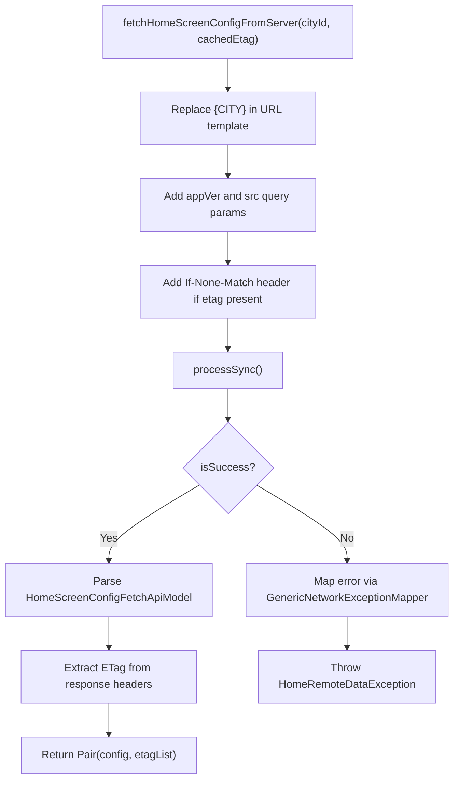

#### URL Constants

| Constant | Value |
|----------|-------|
| **HOME_SCREEN_CONFIG_URL** | `configuration/v1/cities/{CITY}/homescreen-config` |
| **CHECK_UPDATE_URL** | `configuration/v1/appVersionCheck` |
| **QUERY_PARAM_SOURCE** | `src` |
| **QUERY_PARAM_APP_VER** | `appVer` |
| **HEADER_IF_NONE_MATCH** | `If-None-Match` |
| **HEADER_ETAG** | `etag` |

---

### PremiumPassSavingRemoteDataSource

Interface for pass savings API operations.

**Source**: `shared/home/src/commonMain/kotlin/app/chalo/home/data/remote/PremiumPassSavingRemoteDataSource.kt`

| Method | Parameters | Returns | Throws |
|--------|------------|---------|--------|
| **fetchPremiumPassSaving** | userId: String | PassSavingResponseApiModel | PremiumPassSavingException, CancellationException |

### PremiumPassSavingRemoteDataSourceImpl

Implementation for fetching pass savings.

**Source**: `shared/home/src/commonMain/kotlin/app/chalo/home/data/remote/PremiumPassSavingRemoteDataSourceImpl.kt`

#### Constructor Dependencies

| Dependency | Purpose |
|------------|---------|
| **NetworkManager** | HTTP client |
| **GenericNetworkExceptionMapper** | Error mapping |
| **StringProvider** | Localized error messages |

#### API Endpoint

| Property | Value |
|----------|-------|
| **Path** | `mticketing/pass/users/{userId}/savings` |
| **Method** | GET |
| **Headers** | X-Type header |

#### Implementation

```kotlin
override suspend fun fetchPremiumPassSaving(userId: String): PassSavingResponseApiModel {
    val endPoint = PB_PASS_SAVINGS_URL.replace(
        oldValue = PARAM_USER_ID,
        newValue = userId
    )
    val response = networkManager.getStandardNetworkRequestBuilder()
        .subUrl(endPoint)
        .httpMethod(HttpRequestType.GET)
        .addXTypeHeader()
        .build()
        .processSync()

    return if (response.isSuccess) {
        response.getSuccessResponseOrThrowParseException()
    } else {
        throw genericNetworkExceptionMapper(response) {
            PremiumPassSavingException(
                errorResponse = it,
                msg = it?.message ?: errorMsg
            )
        }
    }
}
```

---

## Local Data Sources

### HomeScreenConfigLocalDataStore

Interface and implementation for local config caching using DataStore.

**Source**: `shared/home/src/commonMain/kotlin/app/chalo/home/data/local/HomeScreenConfigLocalDataStore.kt`

#### Interface Definition

| Method | Parameters | Returns | Purpose |
|--------|------------|---------|---------|
| **cacheHomeScreenConfigForCity** | cityId: String, etag: String, config: HomeScreenConfigFetchApiModel | Unit | Store config and etag |
| **getCachedHomeScreenConfig** | cityId: String | HomeScreenConfigAppModel? | Retrieve cached config |
| **getCachedEtag** | cityId: String | String? | Retrieve cached etag |
| **removeCachedEtag** | cityId: String | Unit | Clear cached etag |

#### Implementation: HomeScreenConfigLocalDataStoreImpl

##### Constructor Dependencies

| Dependency | Purpose |
|------------|---------|
| **LocalDataStore** | DataStore wrapper |
| **BasicInfoContract** | App version for config mapping |
| **CrashlyticsLogger** | Error reporting |
| **HtmlTextUIHelper** | HTML text parsing |
| **CommonHtmlParser** | HTML content parsing |

##### DataStore Keys

| Key Pattern | Type | Purpose |
|-------------|------|---------|
| `{cityId}_homeScreenConfig` | String | Serialized config JSON |
| `{cityId}_etag` | String | ETag for conditional requests |

##### Caching Flow

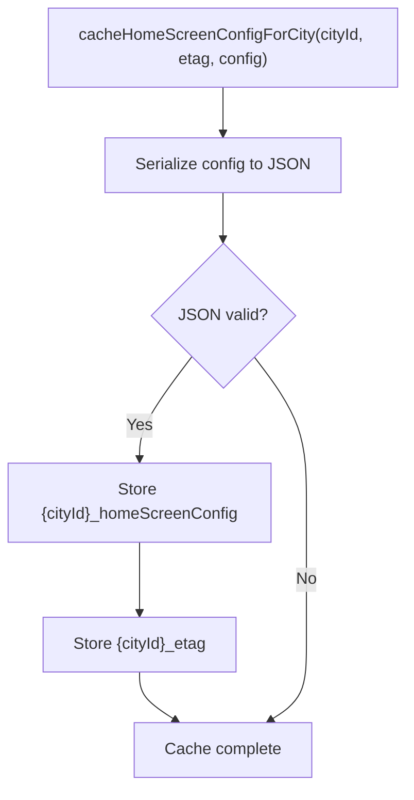

##### Retrieval Flow

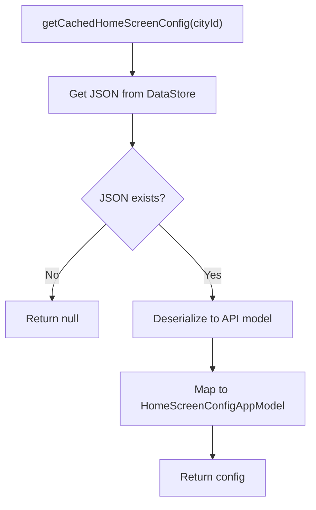

##### Model Mapping

The `toHomeScreenConfigAppModel()` extension function requires:
- Current city ID
- Current app version code
- HTML text UI helper for rich text
- Common HTML parser for content

---

## API Models

### HomeScreenConfigFetchApiModel

Root API response for home screen configuration.

| Field | Type | Description |
|-------|------|-------------|
| **homeTabSectionWidgets** | List<HomePageSectionWidgetApiModel>? | Home tab sections |
| **regularBusTabSectionWidgets** | List<RegularBusPageSectionWidgetApiModel>? | Regular bus sections |
| **chaloBusTabSectionWidgets** | List<ChaloBusWidgetSectionApiModel>? | Chalo Bus sections |
| **historyTabSectionWidgets** | List<HistorySectionWidgetApiModel>? | History tab sections |
| **profilePageWidgets** | List<ProfilePageItemApiModel>? | Profile menu items |
| **bottomNavTabs** | List<BottomNavTabsConfigApiModel>? | Tab configurations |

### PassSavingResponseApiModel

API response for pass savings.

| Field | Type | Description |
|-------|------|-------------|
| **savings** | Long? | Total savings in subcurrency |

### CheckAppUpdateResponseApiModel

API response for app update check.

| Field | Type | Description |
|-------|------|-------------|
| **forceUpdate** | Boolean | Mandatory update flag |
| **recommendedUpdate** | Boolean | Optional update flag |
| **updateUrl** | String? | Store URL |

---

## Data Mappers

### HomeScreenConfigApiToAppModelMapper

Maps API configuration to app models with HTML parsing and version filtering.

**Source**: `shared/home/src/commonMain/kotlin/app/chalo/home/data/mappers/HomeScreenConfigApiToAppModelMapper.kt`

#### Mapping Process

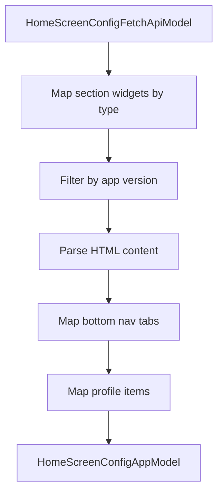

### PassSavingResponseAppModel Conversion

Extension function `toAppModelOrNullIfInvalid()` handles validation:

```kotlin
fun PassSavingResponseApiModel.toAppModelOrNullIfInvalid(): PassSavingResponseAppModel? {
    return savings?.let {
        PassSavingResponseAppModel(passSavings = it)
    }
}
```

Returns null if savings field is null, triggering `PremiumPassSavingInvalidDataException` in repository.

---

## Exceptions

### HomeRemoteDataException

Exception for home config fetch failures.

**Source**: `shared/home/src/commonMain/kotlin/app/chalo/home/data/exceptions/HomeRemoteDataException.kt`

| Property | Type | Description |
|----------|------|-------------|
| **errorResponse** | ErrorResponse? | Parsed error body |
| **msg** | String | Error message |

### PremiumPassSavingException

Exception for pass savings API failures.

**Source**: `shared/home/src/commonMain/kotlin/app/chalo/home/data/exceptions/PremiumPassSavingException.kt`

| Property | Type | Description |
|----------|------|-------------|
| **errorResponse** | ErrorResponse? | Parsed error body |
| **msg** | String | Error message |

### PremiumPassSavingInvalidDataException

Exception when pass savings response is invalid (null savings).

**Source**: `shared/home/src/commonMain/kotlin/app/chalo/home/data/exceptions/PremiumPassSavingException.kt`

---

## Error Handling

### Error Flow

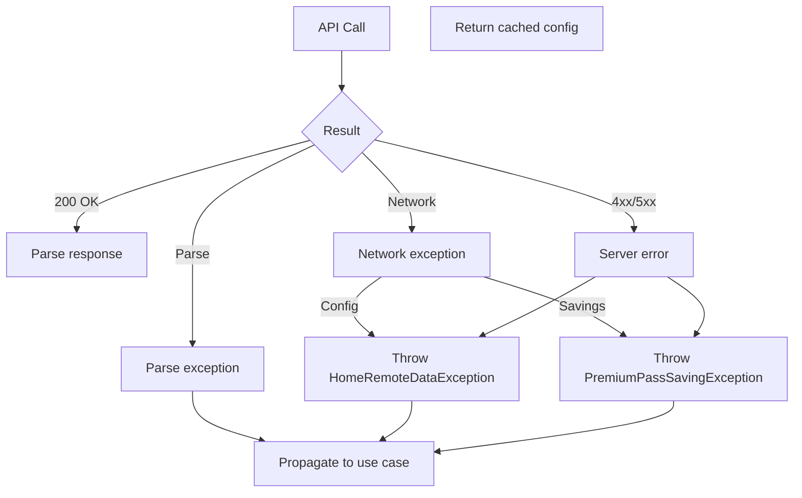

### Repository Error Patterns

| Repository | Error Type | Handling |
|------------|------------|----------|
| **HomeScreenConfigRepository** | HomeRemoteDataException | Propagate to use case for cache fallback |
| **TicketRepositoryImpl** | DAO exceptions | Propagate to use case |
| **PremiumPassSavingRemoteRepositoryImpl** | PremiumPassSavingException | Propagate to use case |
| **PremiumPassSavingRemoteRepositoryImpl** | Invalid data | Throw PremiumPassSavingInvalidDataException |

---

## Caching Strategy

### HomeScreenConfigLocalDataStore Cache

| Aspect | Configuration |
|--------|---------------|
| **Storage** | DataStore Preferences |
| **Key scheme** | `{cityId}_homeScreenConfig`, `{cityId}_etag` |
| **Serialization** | Kotlinx JSON |
| **Invalidation** | ETag mismatch or city change |

### Cache Invalidation Triggers

| Trigger | Action |
|---------|--------|
| **City change** | Clear cached etag for old city |
| **ETag mismatch** | Fetch fresh config |
| **App update** | May invalidate if schema changed |
| **Manual refresh** | Remove cached etag, force fetch |

---

## Network Configuration

### NetworkManager Integration

All remote data sources use `NetworkManager.getStandardNetworkRequestBuilder()` which provides:

| Feature | Description |
|---------|-------------|
| **Base URL** | City-specific API endpoint |
| **Auth headers** | Bearer token injection |
| **Platform headers** | X-Platform, X-App-Version |
| **Response parsing** | Kotlinx serialization |

### Request Builder Pattern

```kotlin
networkManager.getStandardNetworkRequestBuilder()
    .subUrl(endpoint)
    .httpMethod(HttpRequestType.GET)
    .addQueryParam(key, value)
    .addHeader(key, value)
    .build()
    .processSync()
```

### Response Handling

| Method | Description |
|--------|-------------|
| **isSuccess** | Checks HTTP 2xx status |
| **getSuccessResponseOrThrowParseException()** | Parse or throw |
| **getResponseHeaders()** | Extract specific headers |

---

## Dependency Injection

### Module Bindings (expected)

| Interface | Implementation |
|-----------|----------------|
| IHomeScreenConfigRepository | HomeScreenConfigRepository |
| IHomeScreenConfigRemoteDataSource | HomeScreenConfigRemoteDataSource |
| HomeScreenConfigLocalDataStore | HomeScreenConfigLocalDataStoreImpl |
| TicketRepository | TicketRepositoryImpl |
| PremiumPassSavingRemoteRepository | PremiumPassSavingRemoteRepositoryImpl |
| PremiumPassSavingRemoteDataSource | PremiumPassSavingRemoteDataSourceImpl |

---

## Data Layer Architecture Diagram

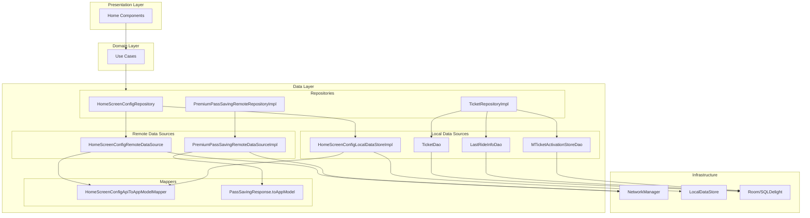

---

## Summary

The Home feature data layer implements a clean separation between:

1. **Repositories** - Coordinate data sources and provide domain-level interfaces
2. **Remote Data Sources** - Handle HTTP requests via NetworkManager
3. **Local Data Sources** - Manage DataStore and DAO persistence
4. **Mappers** - Convert API models to app models with validation

Key patterns include:
- City-scoped data access with consistent lowercasing
- ETag-based conditional requests for configuration caching
- Validation-based exception throwing for invalid API responses
- Interface-implementation separation for testability

---

## Additional Repository Details

### HomeScreenConfigRepository Extended Operations

The repository provides additional operations beyond basic config fetch:

| Method | Parameters | Returns | Purpose |
|--------|------------|---------|---------|
| **getHomeScreenConfigFromCacheIfAvailable** | cityId: String | HomeScreenConfigAppModel? | Direct cache access without network |
| **cacheHomeScreenConfig** | cityId, etag, config | Unit | Persist config to local store |
| **removeCachedEtag** | cityId: String | Unit | Force fresh fetch on next request |
| **checkIfUpdateRequired** | queryParamMap | CheckAppUpdateResponseAppModel | App update check |

### IHomeScreenConfigRepository Interface

The interface abstraction enables testing and different implementation strategies:

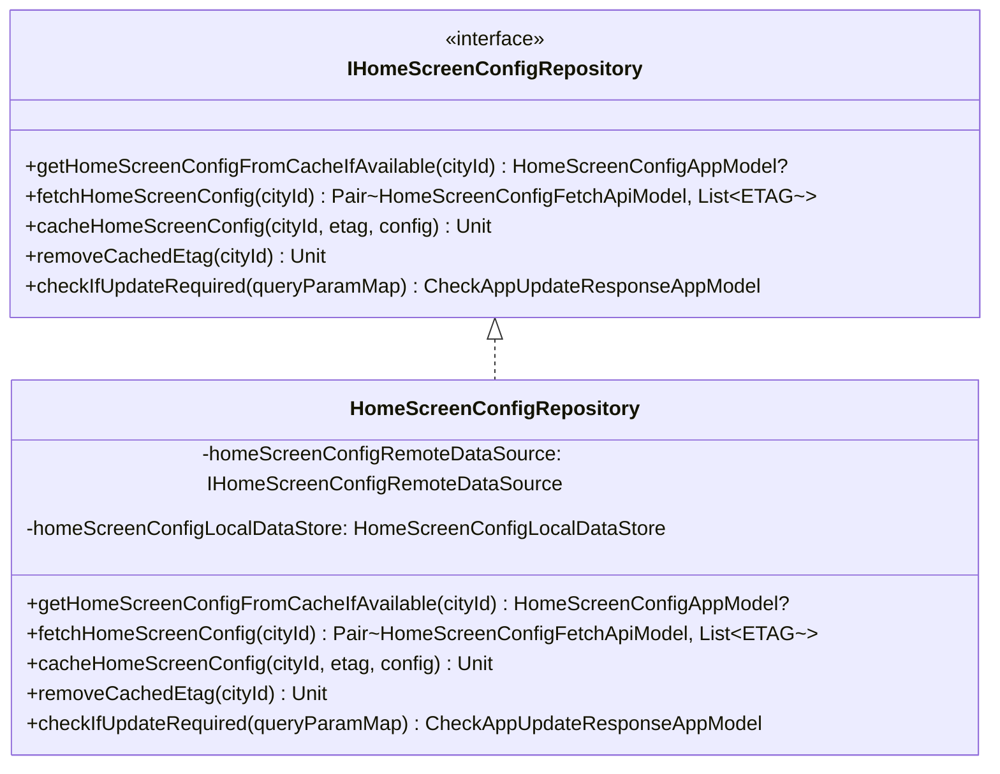

### DataStore Key Management

The `HomeScreenConfigLocalDataStoreImpl` uses city-specific preference keys:

| Key Pattern | Example | Purpose |
|-------------|---------|---------|
| `{cityId}_homeScreenConfig` | `delhi_homeScreenConfig` | Serialized config JSON |
| `{cityId}_etag` | `delhi_etag` | ETag for conditional requests |

The DataStore filename is defined as: `homeScreenConfigDataStoreKey.preferences_pb`

### Serialization/Deserialization

The local data store handles JSON serialization with error reporting:

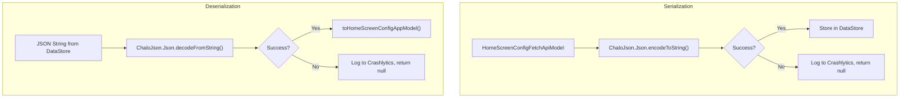

### Remote Data Source URL Construction

The `HomeScreenConfigRemoteDataSource` constructs API URLs with path parameter replacement:

| Template | Parameter | Example Result |
|----------|-----------|----------------|
| `configuration/v1/cities/{CITY}/homescreen-config` | delhi | `configuration/v1/cities/delhi/homescreen-config` |

Query parameters added to all config requests:

| Param | Key | Value Source |
|-------|-----|--------------|
| Source | `src` | `0` (Android app identifier) |
| App Version | `appVer` | `basicInfoContract.getAppVersionCode()` |

### ETag Handling Flow

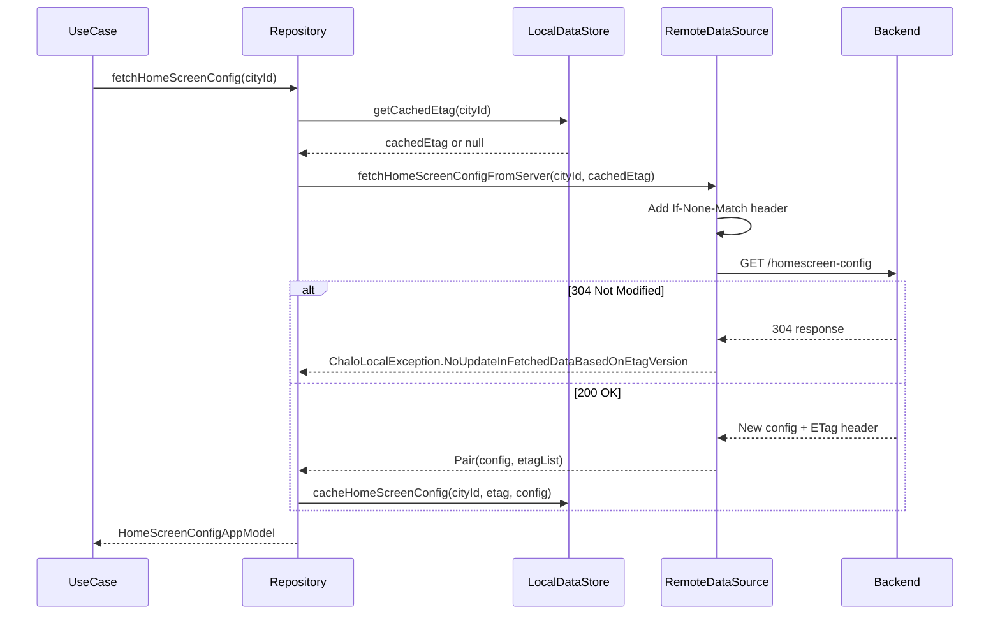
