# Home — UseCase Documentation

## Domain Layer Overview

The Home feature domain layer orchestrates dashboard content delivery, nearby transit discovery, city management, premium bus booking preparation, and cross-tab business logic. Use cases implement the operator `invoke()` pattern and interface between presentation components and data repositories to fetch configurations, process city changes, retrieve nearby trips, and prepare display data.

The use cases follow a consistent result pattern using `ChaloUseCaseResult<Success, Failure>` for operations that can fail, enabling structured error handling in the presentation layer.

```mermaid
flowchart TB
    subgraph Presentation
        HomeScreen["HomeScreenComponent"]
        RegularBus["RegularBusComponent"]
        ChaloBus["ChaloBusComponent"]
        MyTickets["MyTicketsComponent"]
        Profile["ProfileScreenComponent"]
    end

    subgraph Domain["Domain Layer"]
        GetConfig["GetHomeScreenConfigUseCase"]
        GetHomeItems["GetHomePageItemsUseCase"]
        GetRegularItems["GetRegularBusPageItemsUseCase"]
        GetChaloItems["GetChaloPageItemsUseCase"]
        GetProfileItems["GetProfilePageItemsUseCase"]
        NearbyTrips["FetchNearbyTripsUseCase"]
        PassSavings["FetchPremiumPassSavingsUseCase"]
        HistoryConfig["FetchHistoryScreenConfigDataUseCase"]
        GetProducts["GetAllRequestedBookedProductsUseCase"]
        RecentOD["GetRecentAndFlippedOriginDestinationPairsUseCase"]
    end

    subgraph Data["Data Layer"]
        ConfigRepo["HomeScreenConfigRepository"]
        NearbyRepo["StopTripDetailsRepository"]
        PassRepo["PremiumPassSavingRemoteRepository"]
        PremiumRepo["PremiumBusRepository"]
        ProductRepo["ProductsRepository"]
    end

    HomeScreen --> GetConfig
    HomeScreen --> GetHomeItems
    RegularBus --> GetRegularItems
    RegularBus --> NearbyTrips
    ChaloBus --> GetChaloItems
    ChaloBus --> PassSavings
    ChaloBus --> RecentOD
    MyTickets --> HistoryConfig
    MyTickets --> GetProducts
    Profile --> GetProfileItems

    GetConfig --> ConfigRepo
    NearbyTrips --> NearbyRepo
    PassSavings --> PassRepo
    RecentOD --> PremiumRepo
    GetProducts --> ProductRepo
```

---

## UseCase Inventory

| UseCase | Module | Purpose |
|---------|--------|---------|
| **GetHomeScreenConfigUseCase** | home | Fetch and cache home screen configuration |
| **GetHomePageItemsUseCase** | home | Transform config into home dashboard sections |
| **GetRegularBusPageItemsUseCase** | home | Transform config into regular bus sections |
| **GetChaloPageItemsUseCase** | home | Transform config into Chalo Bus sections |
| **GetProfilePageItemsUseCase** | home | Transform config into profile menu items |
| **FetchNearbyTripsUseCase** | home/nearbytrips | Retrieve nearby stops with arrivals |
| **FetchPremiumPassSavingsUseCase** | home | Fetch and compare pass savings |
| **FetchHistoryScreenConfigDataUseCase** | home | Fetch My Tickets configuration data |
| **GetAllRequestedBookedProductsUseCase** | home | Retrieve all user booked products |
| **GetRecentAndFlippedOriginDestinationPairsUseCase** | productbooking | Get recent O-D pairs with flipped version |

---

## GetHomeScreenConfigUseCase

Fetches home screen configuration from the repository with session-level caching and ETag-based conditional updates. The configuration drives all dynamic content including sections, tabs, and feature flags. The use case manages thread-safe access through a mutex and supports cache strategies.

**Source**: `shared/home/src/commonMain/kotlin/app/chalo/home/domain/GetHomeScreenConfigUseCase.kt`

### Responsibility

Retrieves home screen configuration with cache strategy support. Handles mutex-protected cache access, ETag validation via repository, and cache persistence to DataStore.

### Flow Diagram

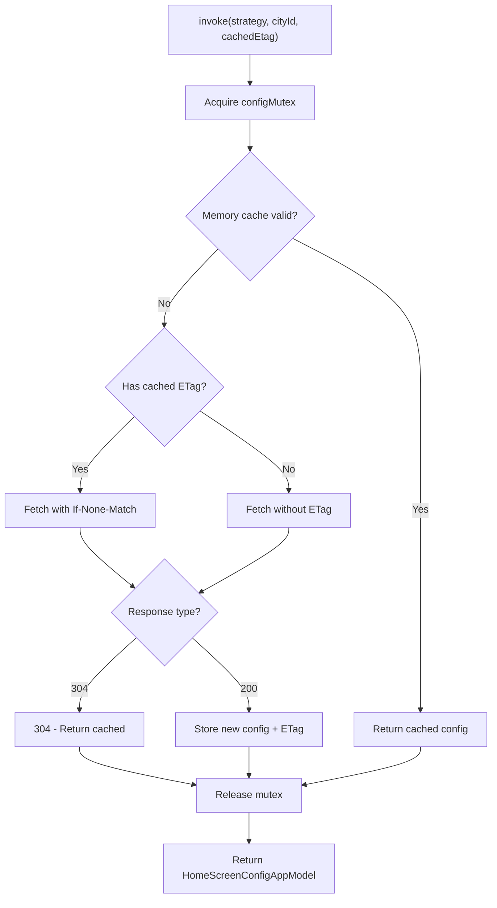

### Constructor Dependencies

| Dependency | Purpose |
|------------|---------|
| **IHomeScreenConfigRepository** | Configuration fetch and persistence |

### Input Parameters

| Parameter | Type | Description |
|-----------|------|-------------|
| **cacheStrategy** | CacheStrategy | BYPASS_REFRESH_IF_CACHED or RETURN_CACHED_REFRESH_BACKGROUND |
| **cityId** | String | Current city identifier |
| **cachedEtag** | String? | Previous ETag for conditional request |

### Output

| Type | Description |
|------|-------------|
| **HomeScreenConfigAppModel** | Parsed configuration with sections, tabs, features |

### Cache Strategies

| Strategy | Behavior |
|----------|----------|
| **BYPASS_REFRESH_IF_CACHED** | Return memory cache immediately if valid |
| **RETURN_CACHED_REFRESH_BACKGROUND** | Return cache, trigger async refresh |

---

## GetHomePageItemsUseCase

Transforms the home tab configuration sections into a sorted list of `HomePageDisplayItemData` items for UI rendering. The use case processes various section widget types including grids, cards, Plotline widgets, GAM banners, and footers.

**Source**: `shared/home/src/commonMain/kotlin/app/chalo/home/domain/GetHomePageItemsUseCase.kt`

### Responsibility

Maps `HomePageSectionWidgetAppModel` sealed class instances to `HomePageDisplayItemData` with proper type discrimination, priority sorting, and icon mapping.

### Flow Diagram

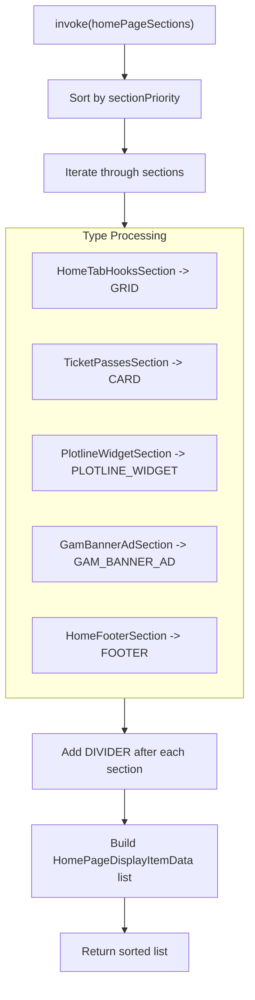

### Section Type Mapping

| Input Type | Output DisplayType | Processing |
|------------|-------------------|------------|
| **HomeTabHooksSection** | GRID | Maps grid items with icons |
| **TicketPassesSection** | CARD | Maps card title and icon |
| **PlotlineWidgetSection** | PLOTLINE_WIDGET | Extracts widget ID |
| **GamBannerAdSection** | GAM_BANNER_AD | Passes ad unit config |
| **HomeFooterSection** | FOOTER | Maps agency branding |

### Input/Output

| Parameter | Type | Description |
|-----------|------|-------------|
| **homePageSections** | List<HomePageSectionWidgetAppModel> | Raw config sections |
| **returns** | List<HomePageDisplayItemData> | UI-ready display items |

---

## GetRegularBusPageItemsUseCase

Transforms regular bus tab configuration sections into `RegularBusPageDisplayItemData` items. Handles nearby stops, product purchase sections, FAQ sections, Plotline widgets, and footers with proper feature type routing.

**Source**: `shared/home/src/commonMain/kotlin/app/chalo/home/domain/GetRegularBusPageItemsUseCase.kt`

### Section Type Mapping

| Input Type | Output DisplayType | Feature |
|------------|-------------------|---------|
| **NearbyStopsSection** | NEARBY_BUS_STOPS | Location-based stops |
| **NearbyBusesMapSection** | NEARBY_BUSES | Map with bus markers |
| **ProductPurchaseSection** | PRODUCT_PURCHASE | Quick pass purchase |
| **FaqSection** | FAQ | Expandable questions |
| **PlotlineSection** | PLOTLINE_WIDGET | Marketing content |
| **FooterSection** | FOOTER | Agency branding |

### Product Card Processing

The use case includes helper method `getRegularBusProductListItems()` that transforms `PassCardDataAppModel` list into `RegularBusProductItemData` with:

- Grid widget card data construction
- Text styling with background colors
- Product config ID mapping for navigation

---

## GetChaloPageItemsUseCase

Transforms Chalo Bus (premium) tab configuration sections into `ChaloBusPageDisplayItemData` items. Handles nearby routes, pass purchase, customer support, and Plotline widgets with consolidated widget processing.

**Source**: `shared/home/src/commonMain/kotlin/app/chalo/home/domain/GetChaloPageItemsUseCase.kt`

### Section Processing Flow

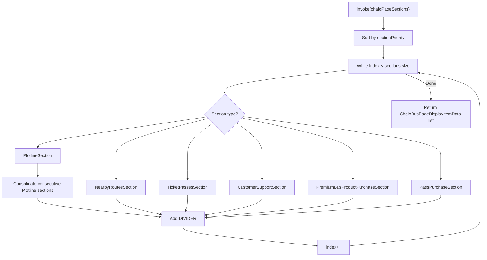

### Plotline Widget Consolidation

The use case implements special handling for consecutive Plotline widgets:

1. When a PlotlineSection is encountered, it enters a sub-loop
2. Continues collecting PlotlineSection instances while consecutive
3. Adds each valid widget (non-empty plotlineWidgetId) to output
4. Only adds one divider after all consecutive Plotline widgets
5. Manually advances index to skip processed sections

---

## GetProfilePageItemsUseCase

Transforms profile page configuration into `ProfilePageDisplayItemData` items with dynamic data enrichment. Handles user profile details, wallet balance fetching, and various feature menu items with icon mapping.

**Source**: `shared/home/src/commonMain/kotlin/app/chalo/home/domain/GetProfilePageItemsUseCase.kt`

### Constructor Dependencies

| Dependency | Purpose |
|------------|---------|
| **FetchWalletBalanceUseCase** | Gets current wallet balance |
| **UserProfileDetailsProvider** | Gets user name and ID |
| **CurrencyFeature** | Formats currency display |
| **StringProvider** | Localized strings |
| **HomeScreenAnalyticsHelper** | Event tracking |

### Feature Processing

| Feature Type | Icon | Special Processing |
|--------------|------|-------------------|
| **PROFILE** | ICON_PROFILE | Gets full name from UserProfileDetailsProvider |
| **CHALO_WALLET** | ICON_CHALO_WALLET | Fetches balance via FetchWalletBalanceUseCase |
| **TICKETS_PASSES** | IC_ICON_TICKET_BLACK | Standard mapping |
| **BUS_STOPS_NEAR_ME** | IC_BUS_STOPS_NEAR_ME | Standard mapping |
| **CHANGE_LANGUAGE** | IC_CHANGE_LANGUAGE | Standard mapping |
| **SOS** | IC_SOS | Standard mapping |
| **ELECTRICITY_BILL** | IC_ELECTRICITY_BILL | Standard mapping |
| **CUSTOMER_SUPPORT** | IC_CUSTOMER_SUPPORT_PROFILE | Standard mapping |
| **USER_CONSENT** | IC_USER_CONSENT | Standard mapping |
| **MANAGE_TRAVEL_CARD** | IC_CHALO_CARD_FALLBACK | Standard mapping |
| **PLOTLINE_WIDGET** | - | Extracted for widget insertion |

### Section Sorting with Dividers

The use case applies a specific layout:

1. Add all CARD display type items first
2. Add DIVIDER
3. Add all LIST display type items
4. Add DIVIDER
5. Insert Plotline widget at configured position

### Analytics Integration

For LIST and CARD display types, the use case raises `PROFILE_SCREEN_ITEM_RENDERED` event with:
- title
- position
- displayType
- featureType

---

## FetchNearbyTripsUseCase

Retrieves nearby transit stops with real-time arrival information based on user location. The use case supports multiple API versions and handles route status updates for cache invalidation.

**Source**: `shared/home/src/commonMain/kotlin/app/chalo/home/nearbytrips/domain/FetchNearbyTripsUseCase.kt`

### Constructor Dependencies

| Dependency | Purpose |
|------------|---------|
| **StopTripDetailsRepository** | API calls for location summary |
| **ChaloLocationManager** | User location access |
| **BasicInfoContract** | App version, device info |
| **TimeUtilsContract** | Time calculations |
| **ChaloConfigFeature** | Remote config for radius |
| **GetDistinctIdUseCase** | User tracking ID |
| **LanguageFeature** | Current language |
| **CityProvider** | Current city |
| **CityDataRepository** | Route cache management |

### Flow Diagram

```mermaid
flowchart TD
    Start["invoke(requestLatLng, transitMode, numSummaries, radius, apiType)"]
    BuildRequest["Build LocationSummaryRequestDataHolder"]
    GetCity["Get city name from CityProvider"]

    CityValid{City valid?}
    InvalidCity["Return Failure(INVALID_CITY)"]

    APITypeSwitch{API Type?}
    OldAPI["fetchLocationSummary()"]
    NewAPI["fetchLocationSummaryAndRouteStatus()"]

    CheckStatus{isStatusOk()?}
    FetchFailed["Return Failure(FETCH_FAILED)"]

    ProcessRouteStatus["Process route status updates"]
    ReturnSuccess["Return Success(payload)"]

    CatchBlock["Exception handling"]

    Start --> BuildRequest
    BuildRequest --> GetCity
    GetCity --> CityValid
    CityValid -->|No| InvalidCity
    CityValid -->|Yes| APITypeSwitch

    APITypeSwitch -->|OLD| OldAPI
    APITypeSwitch -->|NEW| NewAPI
    APITypeSwitch -->|NEW_WITH_ROUTE_STATUS_UPDATE| NewAPI

    OldAPI --> CheckStatus
    NewAPI --> CheckStatus

    CheckStatus -->|No| FetchFailed
    CheckStatus -->|Yes| ProcessRouteStatus
    ProcessRouteStatus --> ReturnSuccess

    Start -.-> CatchBlock
```

### API Types

| Type | Behavior |
|------|----------|
| **OLD** | Basic location summary fetch |
| **NEW** | Location summary with default trip request |
| **NEW_WITH_ROUTE_STATUS_UPDATE** | Includes cached route versions for delta updates |

### Request Building

The use case constructs `LocationSummaryRequestDataHolder` with:

| Field | Source |
|-------|--------|
| **requestLatLng** | Input parameter |
| **transitMode** | Input (default BUS) |
| **numOfCards** | Input (default 1) |
| **radius** | Input or Firebase config NEARBY_STOP_RADIUS |
| **day** | TimeUtilsContract.getCurrentDay() |
| **timeSinceMidnightInSeconds** | TimeUtilsContract.getTimeSinceMidnight() |
| **meta** | TrackingUtils.userPropJsonObjectForNearbyTrips() |
| **userCurrentLatLng** | ChaloLocationManager.getLastKnownLocation() |

### Failure Reasons

| Reason | Cause |
|--------|-------|
| **INVALID_CITY** | CityProvider returns null |
| **FETCH_FAILED** | API returned non-OK status |
| **LOCAL_ERROR** | ChaloLocalException thrown |
| **PARSING_FAILED** | NetworkSuccessResponseParseException |
| **GENERAL_ERROR** | Any other exception |

---

## FetchPremiumPassSavingsUseCase

Fetches and compares premium pass savings for the current user. The use case stores updated savings in DataStore and determines whether savings increased for animation triggers.

**Source**: `shared/home/src/commonMain/kotlin/app/chalo/home/domain/FetchPremiumPassSavingsUseCase.kt`

### Constructor Dependencies

| Dependency | Purpose |
|------------|---------|
| **PremiumPassSavingRemoteRepository** | API call for savings |
| **UserProfileDetailsProvider** | Gets user ID |
| **PremiumBusDataStoreWrapper** | Local savings persistence |
| **CurrencyFeature** | Amount formatting |

### Flow Diagram

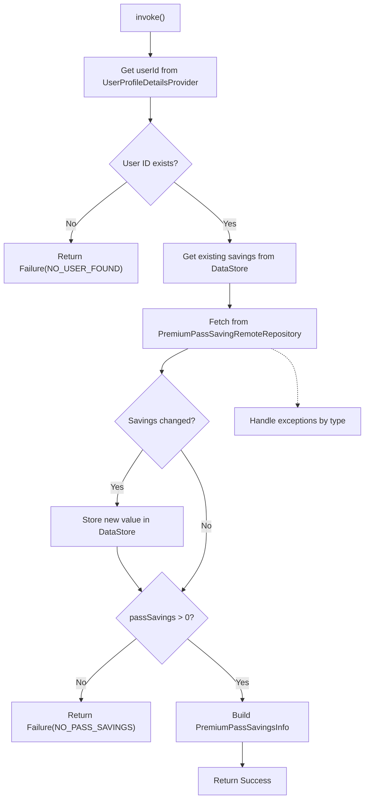

### Output Structure

`PremiumPassSavingsInfo` contains:

| Field | Type | Description |
|-------|------|-------------|
| **oldPassSaving** | Int | Previous savings (formatted) |
| **updatedPassSaving** | Int | Current savings (formatted) |
| **isSavingIncreased** | Boolean | Triggers animation |
| **currencySymbol** | String | Display symbol |

### Amount Formatting

The use case converts subcurrency to currency using:
- `CurrencyFeature.convertAmountInSubcurrencyToCurrency()`
- Applies `ROUND_OFF_LOGIC_ROUND_OFF_TO_FLOOR` rounding

### Failure Reasons

| Reason | Cause |
|--------|-------|
| **NO_USER_FOUND** | UserProfileDetailsProvider returns null |
| **NO_PASS_SAVINGS** | passSavings <= 0 |
| **INVALID_DATA_ERROR** | PremiumPassSavingInvalidDataException |
| **SERVER_ERROR** | PremiumPassSavingException |
| **PARSE_ERROR** | NetworkSuccessResponseParseException |
| **LOCAL_ERROR** | ChaloLocalException |
| **UNKNOWN_ERROR** | Any other exception |

---

## FetchHistoryScreenConfigDataUseCase

Fetches configuration data for the My Tickets (history) screen including tab configuration, product filters, and display settings.

**Source**: `shared/home/src/commonMain/kotlin/app/chalo/home/domain/FetchHistoryScreenConfigDataUseCase.kt`

### Purpose

Retrieves history screen configuration from the home screen config, enabling dynamic tab configuration and product filtering based on backend settings.

---

## GetAllRequestedBookedProductsUseCase

Retrieves all user booked products across different product types (tickets, passes, premium bus bookings). The use case aggregates data from multiple sources and categorizes by active/expired status.

**Source**: `shared/home/src/commonMain/kotlin/app/chalo/home/domain/GetAllRequestedBookedProductsUseCase.kt`

### Product Type Hierarchy

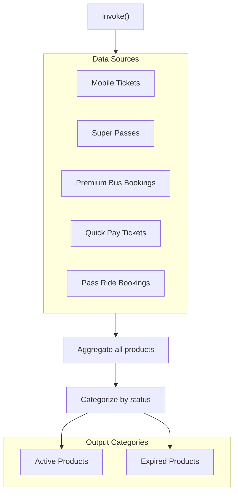

### Output

Returns categorized lists of `ChaloUserBookingType` for display in active and expired tabs.

---

## GetRecentAndFlippedOriginDestinationPairsUseCase

Retrieves the most recent origin-destination pair from past premium bus bookings and creates a flipped version for quick rebooking in both directions.

**Source**: `shared/productbooking/src/commonMain/kotlin/app/chalo/premiumbus/domain/GetRecentAndFlippedOriginDestinationPairsUseCase.kt`

### Constructor Dependencies

| Dependency | Purpose |
|------------|---------|
| **PremiumBusRepository** | Gets unique O-D pairs |
| **CityProvider** | Current city for filtering |

### Flow Diagram

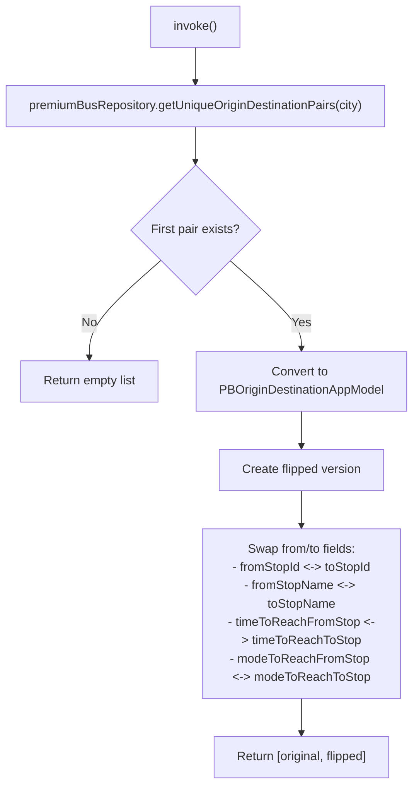

### Output

Returns a list containing:
1. Original O-D pair from most recent booking
2. Flipped O-D pair (origin becomes destination and vice versa)

This enables quick rebooking for return journeys.

---

## Domain Models

### HomeScreenConfigAppModel

| Field | Type | Description |
|-------|------|-------------|
| **homeTabSectionWidget** | List<HomePageSectionWidgetAppModel> | Home tab sections |
| **regularBusTabSectionWidget** | List<RegularBusPageSectionWidgetAppModel> | Regular bus sections |
| **chaloBusTabSectionWidget** | List<ChaloBusWidgetSectionAppModel> | Chalo Bus sections |
| **historyTabSectionWidget** | List<HistorySectionWidgetAppModel> | History tab sections |
| **profilePageWidget** | List<ProfilePageItemAppModel> | Profile menu items |
| **bottomNavTabs** | List<BottomNavTabsConfigAppModel> | Tab configurations |
| **tabMetaData** | Map<BottomNavTabType, TabMetaDataAppModel> | Tab header metadata |

### HomePageDisplayItemData

| Field | Type | Description |
|-------|------|-------------|
| **title** | String? | Section title |
| **displayType** | HomePageSectionDisplayType | Render type enum |
| **featureType** | HomePageFeatureType | Feature routing enum |
| **icon** | String? | Icon resource identifier |
| **shouldHighlight** | Boolean | Visual emphasis flag |

### LocationSummaryPayloadResponseAppModel

| Field | Type | Description |
|-------|------|-------------|
| **stopId** | String | Unique stop identifier |
| **stopName** | String | Display name |
| **distance** | Double | Distance from user |
| **trips** | List<TripInfo> | Upcoming arrivals |
| **direction** | String? | Direction label |

### PremiumPassSavingsInfo

| Field | Type | Description |
|-------|------|-------------|
| **oldPassSaving** | Int | Previous formatted savings |
| **updatedPassSaving** | Int | Current formatted savings |
| **isSavingIncreased** | Boolean | Animation trigger |
| **currencySymbol** | String | Currency symbol |

### PBOriginDestinationAppModel

| Field | Type | Description |
|-------|------|-------------|
| **routeIdsWithODPair** | List<String> | Associated route IDs |
| **stopPairTag** | String | Unique pair identifier |
| **fromStopId** | String | Origin stop ID |
| **fromStopName** | String | Origin display name |
| **toStopId** | String | Destination stop ID |
| **toStopName** | String | Destination display name |
| **timeToReachFromStop** | String? | Travel time to origin |
| **modeToReachFromStop** | String? | Mode to reach origin |
| **timeToReachToStop** | String? | Travel time to destination |
| **modeToReachToStop** | String? | Mode to reach destination |

---

## Sequence Diagrams

### Home Screen Load

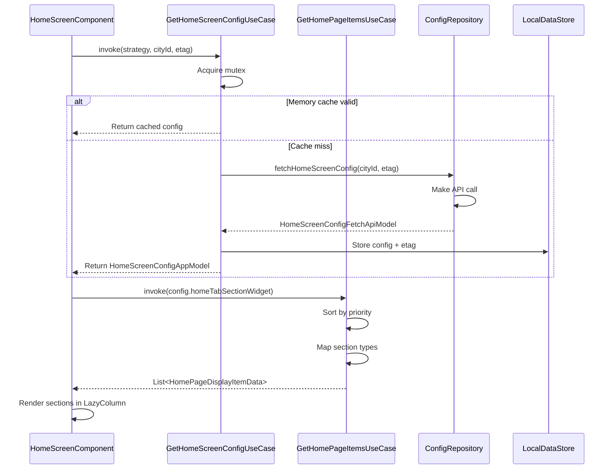

### Nearby Trips Polling

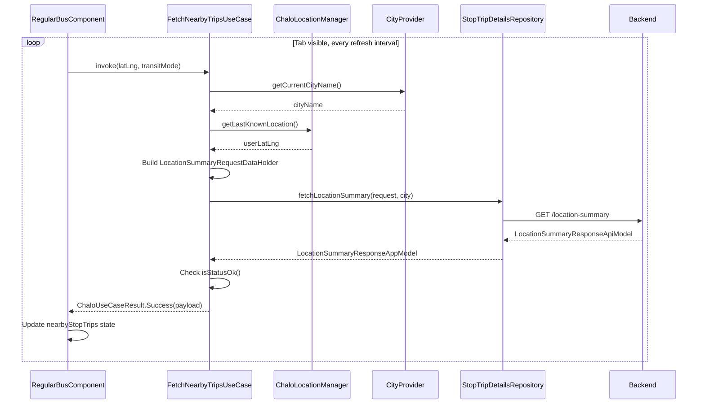

### Premium Pass Savings Fetch

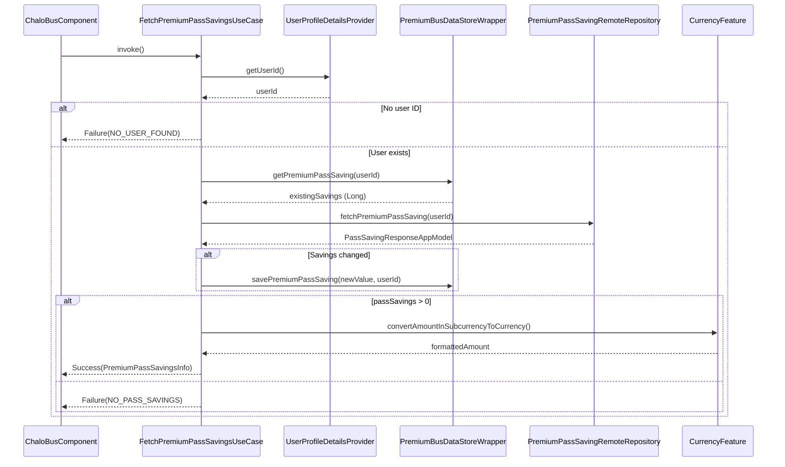

---

## Error Handling

| Error | Use Case | Handling |
|-------|----------|----------|
| **ConfigFetchFailed** | GetHomeScreenConfigUseCase | Return cached config from DataStore |
| **INVALID_CITY** | FetchNearbyTripsUseCase | Return failure, UI shows city selection |
| **FETCH_FAILED** | FetchNearbyTripsUseCase | Return failure, UI shows retry |
| **NO_USER_FOUND** | FetchPremiumPassSavingsUseCase | Return failure, hide savings banner |
| **NO_PASS_SAVINGS** | FetchPremiumPassSavingsUseCase | Return failure, hide savings banner |
| **SERVER_ERROR** | FetchPremiumPassSavingsUseCase | Return failure, silent fail |

---

## Business Rules

| Rule | Use Case | Description |
|------|----------|-------------|
| **ETag caching** | GetHomeScreenConfigUseCase | 304 response returns cached config |
| **Mutex protection** | GetHomeScreenConfigUseCase | Thread-safe cache access |
| **Section priority sort** | All GetXxxPageItemsUseCase | Lower priority numbers first |
| **Divider insertion** | All GetXxxPageItemsUseCase | Add divider after each section |
| **Plotline consolidation** | GetChaloPageItemsUseCase | Group consecutive Plotline widgets |
| **Savings comparison** | FetchPremiumPassSavingsUseCase | Compare with stored value for animation |
| **O-D flipping** | GetRecentAndFlippedODPairsUseCase | Create return journey shortcut |
| **City scoping** | FetchNearbyTripsUseCase, GetRecentODPairsUseCase | Filter by current city |

---

## Additional Use Cases

### GetRecentSearchListUseCase

Merges and formats recent search items from multiple sources (routes and trips) for display in the search card on the Regular Bus tab.

**Source**: `shared/home/src/commonMain/kotlin/app/chalo/home/domain/GetRecentSearchListUseCase.kt`

#### Responsibility

Combines route recents and trip recents, sorts by access time, and formats each item into a display-ready `RecentSearchedItem` with appropriate title and subtitle based on the item type.

#### Constructor Dependencies

| Dependency | Purpose |
|------------|---------|
| **StringProvider** | Localized string formatting for "To X" and "Via X" patterns |

#### Input/Output

| Parameter | Type | Description |
|-----------|------|-------------|
| **recents1** | List<RecentsType> | First recents list (typically routes) |
| **recents2** | List<RecentsType> | Second recents list (typically trips) |
| **returns** | List<RecentSearchedItem> | Formatted display items |

#### Recent Type Formatting

| RecentsType | busNumberOrDestination | destinationOrStarting |
|-------------|------------------------|----------------------|
| **RecentRouteAppModel** (VIA scheme) | "To {endStopName}" | "Via {via}" or "{start} - {end}" |
| **RecentRouteAppModel** (DEFAULT) | Route name | "To {endStopName}" |
| **RecentStopBasedTripAppModel** | Origin stop name (truncated) | Destination stop name (truncated) |
| **RecentTripAppModel** | From location (truncated) | To location (truncated) |
| **RecentLocationPairAppModel** | From endpoint name | To endpoint name |

#### Title Truncation Logic

Location descriptions are truncated at the first comma to show only the primary name:
- "Central Station, City Center, Delhi" becomes "Central Station"
- Handles missing or empty content gracefully

### GetHomeScreenConfigUseCase Deep Dive

The configuration use case implements sophisticated caching with mutex protection and multiple retrieval strategies.

#### Cache Strategy Details

| Strategy | Description | Use Case |
|----------|-------------|----------|
| **ONLY_RETURN_CACHED_DATA_EVEN_IF_NULL_AND_DO_NOT_REFRESH** | Returns memory/disk cache without network call | Quick reads during transitions |
| **BYPASS_REFRESH_IF_CACHED_DATA_AVAILABLE** | Returns cache if available, otherwise fetches | Initial load |
| **RETURN_CACHED_INFO_IF_AVL_AND_REFRESH_IN_BACKGROUND_FOR_NEXT_SESSION** | Returns cache immediately, refreshes async | Foreground resume |
| **REFRESH_IN_BACKGROUND_FOR_NEXT_SESSION** | Triggers background refresh, returns cache | Pre-fetch for next session |

#### Memory Cache Management

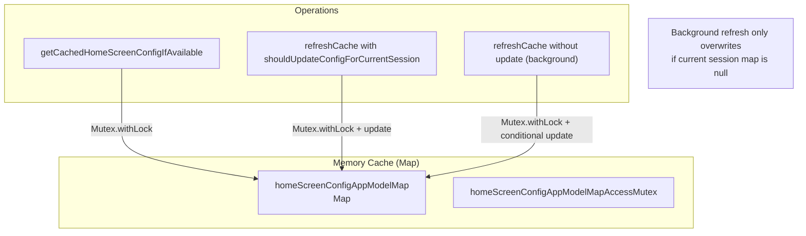

#### Error Recovery Flow

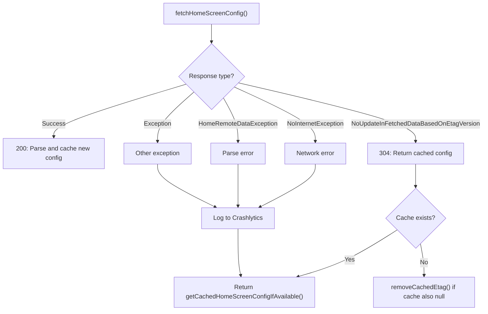

### GetHomePageItemsUseCase Analytics Integration

The use case raises analytics events during section processing:

| Event | Trigger | Properties |
|-------|---------|------------|
| **HOME_PAGE_CARD_ITEM_RENDERED** | TicketPassesSection processed | type, position, title |
| **HOME_PAGE_HOOK_RENDERED** | Each hook card in grid | type, position, title, desc_list, tag_list, image_url |

### GetRegularBusPageItemsUseCase Extended

The use case supports additional section types beyond the basic inventory:

| Section Type | Output | Special Handling |
|--------------|--------|------------------|
| **GAM_BANNER_AD** | GAM_BANNER_AD display type | Includes maxHeightDp and sectionId |
| **PRODUCT_PURCHASE** | PRODUCT_PURCHASE with product list | Maps pass cards to RegularBusProductItemData |

### CheckIfAppUpdateRequiredUseCase

Checks if the app requires a mandatory or recommended update.

**Source**: `shared/home/src/commonMain/kotlin/app/chalo/home/domain/CheckIfAppUpdateRequiredUseCase.kt`

#### Input/Output

| Parameter | Type | Description |
|-----------|------|-------------|
| **returns** | CheckAppUpdateResponseAppModel | Update status with forceUpdate and recommendedUpdate flags |

### GetHomeScreenStartDestinationTabUseCase

Determines which tab should be the start destination based on configuration.

**Source**: `shared/home/src/commonMain/kotlin/app/chalo/home/domain/GetHomeScreenStartDestinationTabUseCase.kt`

#### Logic Flow

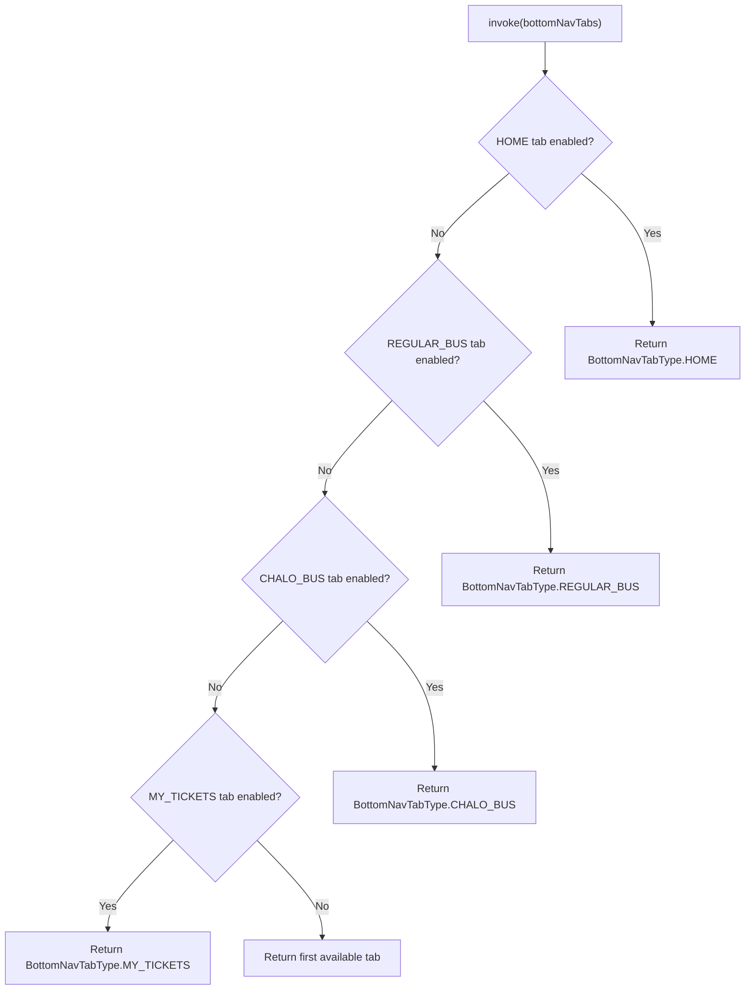

---

## Use Case Dependency Graph

```mermaid
flowchart TB
    subgraph Components
        HSC["HomeScreenComponent"]
        RBC["RegularBusComponent"]
        CBC["ChaloBusComponent"]
        MTC["MyTicketsComponent"]
        PSC["ProfileScreenComponent"]
    end

    subgraph ConfigUseCases["Config Use Cases"]
        GHSCU["GetHomeScreenConfigUseCase"]
        GHSSDU["GetHomeScreenStartDestinationTabUseCase"]
        CIARU["CheckIfAppUpdateRequiredUseCase"]
    end

    subgraph ItemUseCases["Item Transformation Use Cases"]
        GHPIU["GetHomePageItemsUseCase"]
        GRBPIU["GetRegularBusPageItemsUseCase"]
        GCPIU["GetChaloPageItemsUseCase"]
        GPPIU["GetProfilePageItemsUseCase"]
        FHSCDU["FetchHistoryScreenConfigDataUseCase"]
    end

    subgraph DataUseCases["Data Fetch Use Cases"]
        FNTU["FetchNearbyTripsUseCase"]
        FPPSU["FetchPremiumPassSavingsUseCase"]
        GRSLU["GetRecentSearchListUseCase"]
        GRABBPU["GetAllRequestedBookedProductsUseCase"]
        GRAFODPU["GetRecentAndFlippedODPairsUseCase"]
    end

    HSC --> GHSCU
    HSC --> GHPIU

    RBC --> GHSCU
    RBC --> GRBPIU
    RBC --> FNTU
    RBC --> GRSLU

    CBC --> GHSCU
    CBC --> GCPIU
    CBC --> FPPSU
    CBC --> GRAFODPU

    MTC --> GHSCU
    MTC --> FHSCDU
    MTC --> GRABBPU

    PSC --> GHSCU
    PSC --> GPPIU

    GHSCU --> GHSSDU
    GHSCU --> CIARU
```
