# Instant Ticket Components - Low-Level Design

## Overview

The Instant Ticket presentation layer follows a Decompose-based MVI architecture built on `ChaloBaseStateMviComponent`. The component hierarchy enables two primary purchase flows: an **amount-based quick-pay flow** through `InstantTicketWalletAccessComponent`, and a **route-based purchase flow** through `FareDetailsComponent`. A coordinator pattern links fare details with wallet access functionality for screens requiring both.

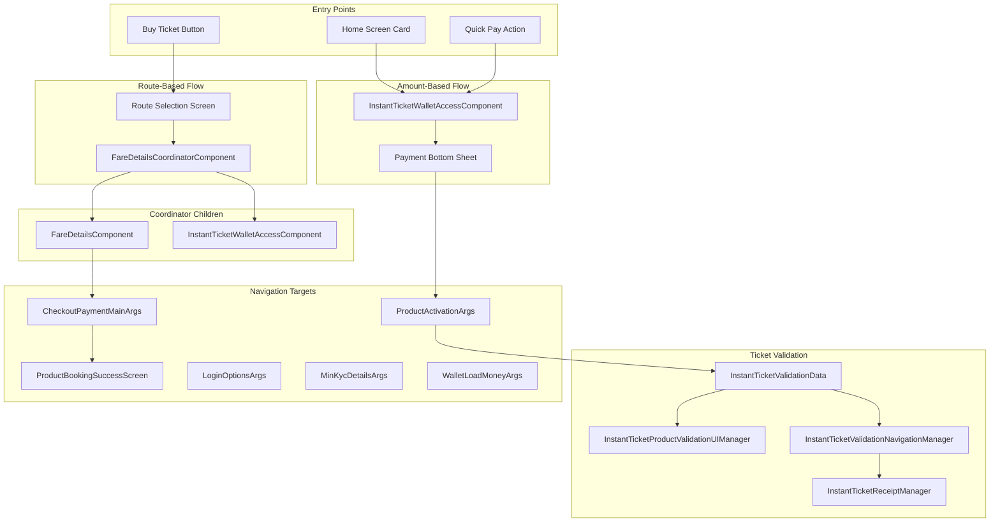

---

## Component Inventory

| Component | File Path | Base Class | Purpose |
|-----------|-----------|------------|---------|
| **InstantTicketWalletAccessComponent** | `instantticket/ui/instantticketscreen/InstantTicketWalletAccessComponent.kt` | ChaloBaseStateMviComponent | Amount entry, wallet status, quick pay |
| **FareDetailsComponent** | `instantticket/ui/faredetails/FareDetailsComponent.kt` | ChaloBaseStateMviComponent | Fare display, passenger count, payment initiation |
| **FareDetailsCoordinatorComponent** | `instantticket/ui/faredetails/FareDetailsCoordinatorComponent.kt` | - | Coordinates FareDetails and WalletAccess |
| **InstantTicketValidationData** | `instantticket/validation/InstantTicketValidationData.kt` | ProductValidationData | Validation screen data provider |
| **InstantTicketProductValidationUIManager** | `instantticket/validation/InstantTicketProductValidationUIManager.kt` | ProductValidationUIManager | UI strings for validation |
| **InstantTicketValidationNavigationManager** | `instantticket/validation/InstantTicketValidationNavigationManager.kt` | ProductValidationNavigationManager | Navigation from validation screen |
| **InstantTicketReceiptManager** | `instantticket/validation/InstantTicketReceiptManager.kt` | ProductReceiptManager | Receipt fetching bridge |

---

## InstantTicketWalletAccessComponent

This component serves as the primary entry point for wallet-based Instant Ticket purchases. It manages Chalo Pay wallet status checking, KYC validation, balance verification, and quick payment initiation through `CreateQuickPayOrderUsecase`.

### Component Signature

```
ChaloBaseStateMviComponent<
    InstantTicketWalletAccessIntent,
    InstantTicketWalletAccessState,
    InstantTicketWalletAccessState,
    InstantTicketWalletAccessSideEffect
>
```

The component exposes `instantTicketWalletAccessState` and `walletAccessSideEffects` properties for UI consumption, allowing it to coexist with `FareDetailsComponent` without state confusion.

### Dependencies

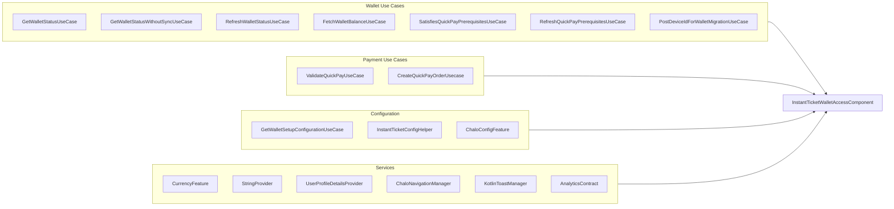

### View State Structure

| Field | Type | Description |
|-------|------|-------------|
| `attemptingLogin` | Boolean | Login flow in progress |
| `attemptingKYC` | Boolean | KYC flow in progress |
| `attemptingLoadMoney` | Boolean | Wallet top-up flow in progress |
| `walletStatus` | WalletStatus | Current wallet status enum |
| `walletSubText` | WalletSubTextProperties | Display text with error flag |
| `walletCTAString` | String | Call-to-action button text |
| `isWalletBlocked` | Boolean | Whether wallet actions are blocked |
| `amountEnteredInRupee` | String | User-entered amount |
| `showShimmerLoading` | Boolean | Loading state indicator |
| `activationDurationText` | String | Ticket validity duration message |
| `showPayUsingWallet` | Boolean | Wallet payment option visibility |
| `showOtherModes` | Boolean | Other payment modes availability |

### Intent Processing

| Intent | Handler | Description |
|--------|---------|-------------|
| `ViewStartedIntent` | `handleViewStartedIntent()` | Re-checks state after navigation return |
| `ProceedBtnClicked(amount)` | `handleProceedBtnClicked()` | Fetches config, checks wallet, shows bottom sheet |
| `PayUsingWalletClicked(amount)` | `handlePayUsingWalletClicked()` | Validates and creates quick pay order |

### Wallet Status Processing Flow

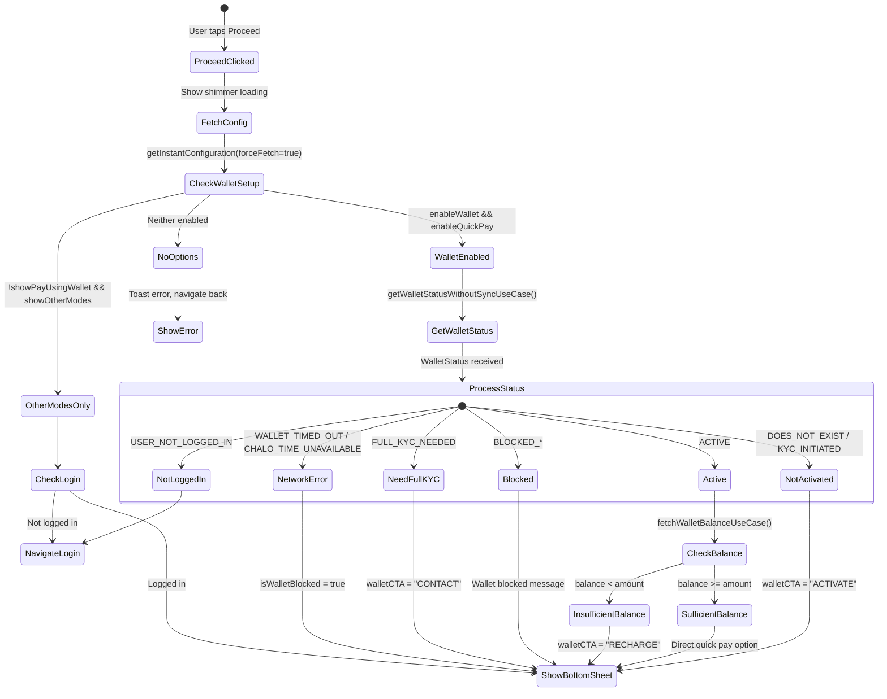

### Wallet Status to UI Mapping

| WalletStatus | walletSubText | walletCTAString | isWalletBlocked |
|--------------|---------------|-----------------|-----------------|
| `USER_NOT_LOGGED_IN` | (empty) | (empty) | false |
| `DOES_NOT_EXIST` | "Wallet not active" | "ACTIVATE" | false |
| `KYC_INITIATED` | "Wallet not active" | "ACTIVATE" | false |
| `FULL_KYC_NEEDED` | "Need full KYC" | "CONTACT" | false |
| `ACTIVE` (sufficient) | "Balance: {amount}" | (empty) | false |
| `ACTIVE` (insufficient) | "Insufficient Balance: {amount}" | "RECHARGE" | false |
| `BLOCKED_FOR_BACKEND_RECLAIM` | "Wallet blocked" | "RECLAIM" | false |
| `BLOCKED_FOR_APP_RECLAIM` | "Wallet blocked" | (empty) | true |
| `BLOCKED_USER` | "Wallet blocked" | (empty) | true |
| `WALLET_TIMED_OUT` | "Please turn on internet" | (empty) | true |
| `CHALO_TIME_UNAVAILABLE` | "Please turn on internet" | (empty) | true |

### Pay Using Wallet Flow

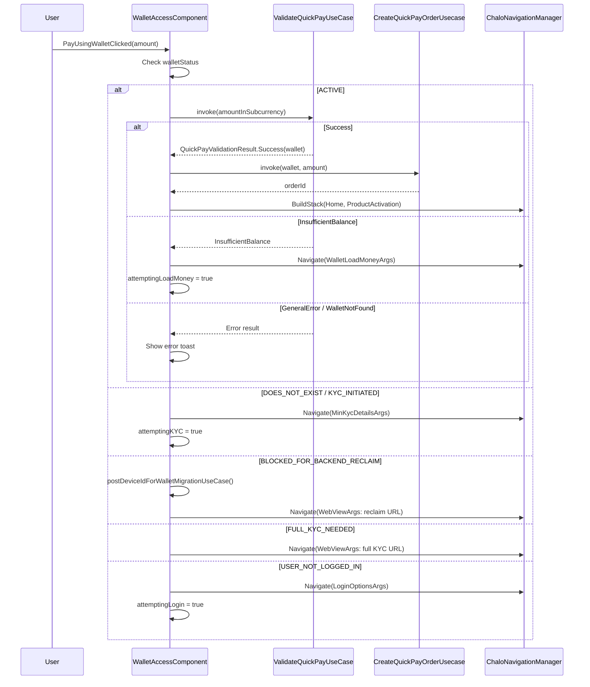

### Side Effects

| Side Effect | Trigger | Description |
|-------------|---------|-------------|
| `HideKeyboard` | Before showing bottom sheet | Dismisses soft keyboard |
| `OpenBottomSheet` | After wallet status processed | Shows payment options sheet |
| `CloseBottomSheet` | After action initiated | Dismisses bottom sheet |

### Analytics Events

| Event | Source | Attributes |
|-------|--------|------------|
| `INSTANT_TICKET_BOTTOM_SHEET_OPENED` | Bottom sheet displayed | isChaloWalletActivated, isRechargeDoneOnce, balanceAmount, isQuickPayBoughtOnce |
| `ACTIVATE_WALLET_CLICKED` | User initiates KYC | - |
| `FULL_KYC_KNOW_MORE_CLICKED` | User taps KYC help | - |
| `WALLET_BLOCKED_KNOW_MORE_CLICKED` | User taps blocked info | - |
| `POST_DEVICE_ID_FOR_WALLET_MIGRATION` | Device ID posted | isSuccessful |
| `INSTANT_TICKET_BOTTOM_SHEET_RECHARGE_BUTTON_CLICKED` | Insufficient balance recharge | - |

---

## FareDetailsComponent

The most complex component in the flow, `FareDetailsComponent` handles fare fetching, passenger count adjustment, fare validation, order creation, and payment initiation. It supports multiple screen types including InstantTicket, PremiumReserveTicket, and ONDCTicket flows.

### Component Signature

```
ChaloBaseStateMviComponent<
    FareDetailsIntent,
    FareDetailsViewState,
    FareDetailsViewState,
    FareDetailsSideEffect
>
```

### Initialization

The component receives `FareDetailsArgs` containing serialized JSON data:

| Argument | Type | Purpose |
|----------|------|---------|
| `fareDetailsData` | JSON String | FareDetailsData with route/stop info |
| `productBookingFlowType` | JSON String | ProductBookingNavigation type |
| `screenType` | JSON String | FareDetailsScreenType |
| `configId` | String? | Product configuration ID |
| `selectedSeats` | JSON String? | Pre-selected seats for premium bus |

On initialization, the component:
1. Parses all JSON arguments
2. Sends `InitialIntent` to trigger fare fetch
3. Recovers checkout result flow from StateKeeper for process death handling

### View State Structure

| Field | Type | Description |
|-------|------|-------------|
| `routeName` | String | Selected route display name |
| `startStopName` | String | Origin stop name |
| `endStopName` | String | Destination stop name |
| `showLoadingShimmerState` | Boolean | Fare loading indicator |
| `showLoadingDialogue` | Boolean | Action processing indicator |
| `showSnackbar` | Boolean | Error state for retry |
| `specialFeatures` | List | Route special features |
| `passengerFareDetailsViewState` | List<PassengerFareDetailsUiModel> | Passenger categories with fares |
| `isSinglePassengerDetailAvailable` | Boolean | Only one passenger type exists |
| `totalPayableAmount` | String | Formatted total fare |
| `isPayButtonEnabled` | Boolean | Payment button enabled state |
| `instantTicketOrderCreationInProgress` | Boolean | Order API in progress |
| `selectedTime` | String? | Selected trip time (for premium bus) |
| `shouldDisablePlusCounterForAllCategories` | Boolean | Max seat limit reached |
| `screenType` | FareDetailsScreenType? | Current product flow type |
| `passengerSelectionPolicy` | PassengerSelectionPolicy | Single or Multiple |
| `selectedPassengerCategory` | PassengerId? | Selected category (Single policy) |
| `bottomSheetType` | FareDetailsBottomSheetType? | Current bottom sheet |
| `appliedRules` | List<ApplicableRuleAppModel>? | Active pricing rules |
| `appliedRuleUxCopy` | ApplicableRuleUxCopyAppModel? | UX copy for rules |
| `brandingType` | ProductBookingBranding | Agency or ONDC branding |
| `selectedSeats` | List<SeatInfoAppModel> | Selected seats for premium |
| `fareNote` | String? | Additional fare information |
| `tncList` | List<String> | Terms and conditions |
| `showTncSection` | Boolean | T&C section visibility |
| `showFareSplit` | Boolean | Show fare breakdown |
| `showTotalAmount` | Boolean | Show total amount |
| `userBillingData` | UserBillingInfoBottomSheetState | ONDC billing info |
| `ondcBookingId` | String? | ONDC booking ID |
| `fareAlertText` | String? | Fare alert message |
| `fareDetailsDialogType` | FareDetailsDialogType? | Active dialog type |

### Screen Type Handling

| Screen Type | Fare Fetch | Validation | Order Creation | Payment Flow |
|-------------|------------|------------|----------------|--------------|
| `InstantTicket` | FetchMobileTicketFareUseCase | ValidateInstantTicketFareUseCase | CreateInstantTicketOrderUseCase | Checkout |
| `PremiumReserveTicketOnlinePayment` | FetchMobileTicketFareUseCase | None | CreatePremiumReserveTicketOrderUseCase | Checkout |
| `PremiumReserveTicketThroughPass` | Skip | None | ReserveSeatThroughPassUseCase | Pass deduction |
| `ONDCTicket` | FetchMobileTicketFareUseCase via ONDC repo | CreateOndcBookingUseCase | CreateOndcOrderUseCase | Checkout |

### Fare Fetch Flow

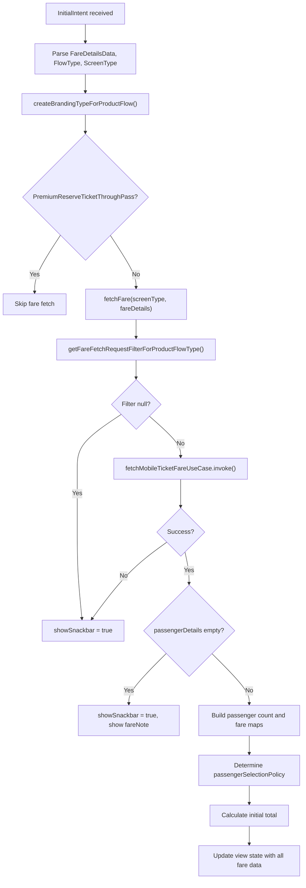

### Passenger Selection Policy

The component supports two selection policies based on backend configuration:

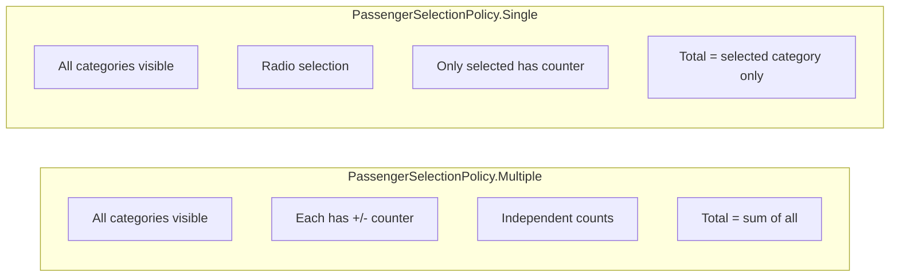

For Single policy, `getEffectivePassengerCounts()` returns only the selected category's count, affecting both total calculation and order creation.

### Intent Summary

| Intent | Purpose |
|--------|---------|
| `InitialIntent` | Initialize with fare data and screen type |
| `IncreasePassengerCountClicked(type)` | Increment passenger count for category |
| `DecreasePassengerCountClicked(type)` | Decrement passenger count for category |
| `OnPassengerCategorySelectedIntent(id)` | Select category (Single policy) |
| `OnPayButtonClicked(isRetry)` | Initiate payment flow |
| `RetryFareFetchClicked` | Retry after fare fetch failure |
| `InitiateOnlinePaymentIntent` | Proceed to online payment |
| `OnPaymentCompletedIntent(bookingId)` | Handle payment success |
| `TermsAndConditionsTextClickedIntent` | Show T&C bottom sheet |
| `OnReadMoreFareNoteIntent` | Show fare note bottom sheet |
| `OrderCreationErrorDialogOkClickedIntent` | Dismiss error dialog |
| `UserBillingInfoBottomSheetProceedClickedIntent` | ONDC billing confirmed |
| `FinalFareBottomSheetPayButtonClickedIntent` | ONDC final payment confirm |
| `FinalFareBottomSheetCancelButtonClickedIntent` | Cancel ONDC payment |
| `OnChangeSeatClickedIntent` | Navigate back to seat selection |
| `FareValidationFailedBottomSheetPayButtonClickedIntent` | Retry after fare mismatch |

### Payment Flow by Screen Type

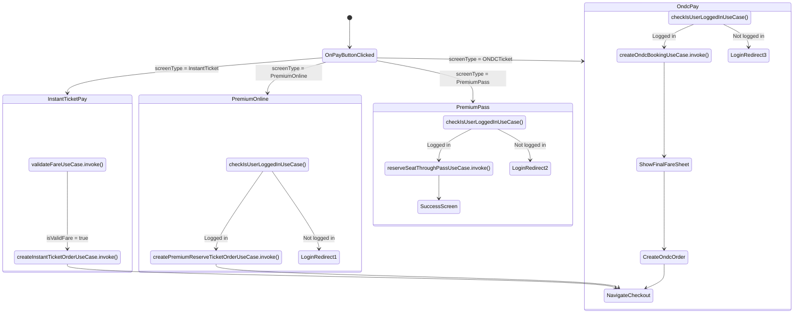

### Checkout Result Handling

The component uses `CheckoutResultStateManager` to receive payment results:

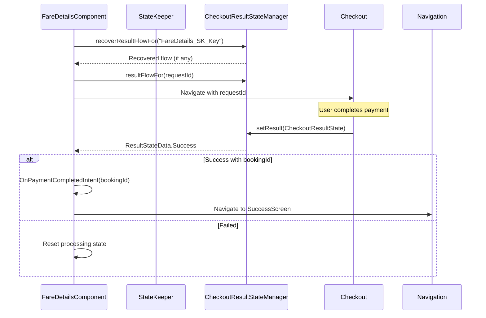

---

## Validation Components

### InstantTicketValidationData

Provides the data contract for the BLE validation SDK during ticket activation and conductor verification.

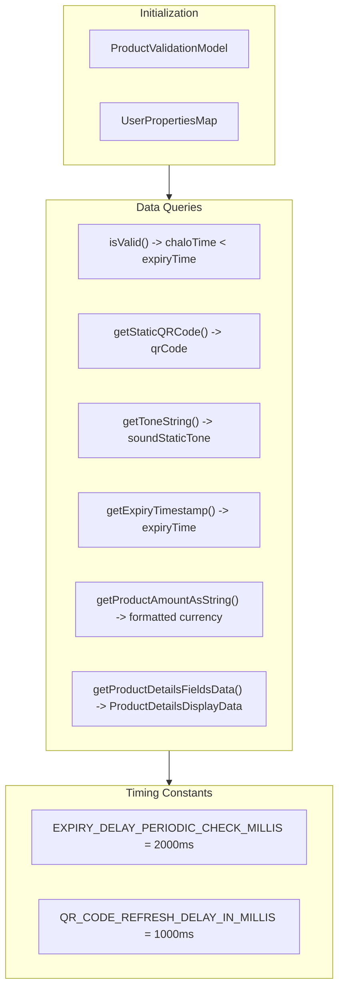

**Key Method Implementations:**

| Method | Implementation |
|--------|----------------|
| `isValid()` | `basicInfoContract.getTrueTime() < expiryTime` |
| `getActivationTimestampMS()` | `expiryTime - activationDuration` |
| `getActivationId()` | `(activationTimestamp / 1000).toString()` |
| `isProductActivationValid()` | `expiryTime > basicInfoContract.getTrueTime()` |
| `getStringForReferenceID()` | `orderId.uppercase()` |

### InstantTicketProductValidationUIManager

Configures UI strings for the validation screen:

| Method | Return Value | Purpose |
|--------|--------------|---------|
| `getProductExpiryMessageResId()` | `ACTIVATION_EXPIRED_MTICKET_COPY` | Expiry message |
| `getProductExpiryTitleResId()` | `ACTIVATION_EXPIRED_MTICKET_TITLE` | Expiry dialog title |
| `getProductVerificationMessageResId()` | `VIEW_RECEIPT_BOTTOMSHEET_COPY_TICKET` | Verification message |
| `getProductBackPressConfirmationMessageResId()` | `EXIT_QUICK_PAY_MESSAGE` | Exit confirmation |
| `shouldShowViewReceiptMenu()` | `false` | Hides receipt menu |

### InstantTicketValidationNavigationManager

Handles navigation from the validation screen:

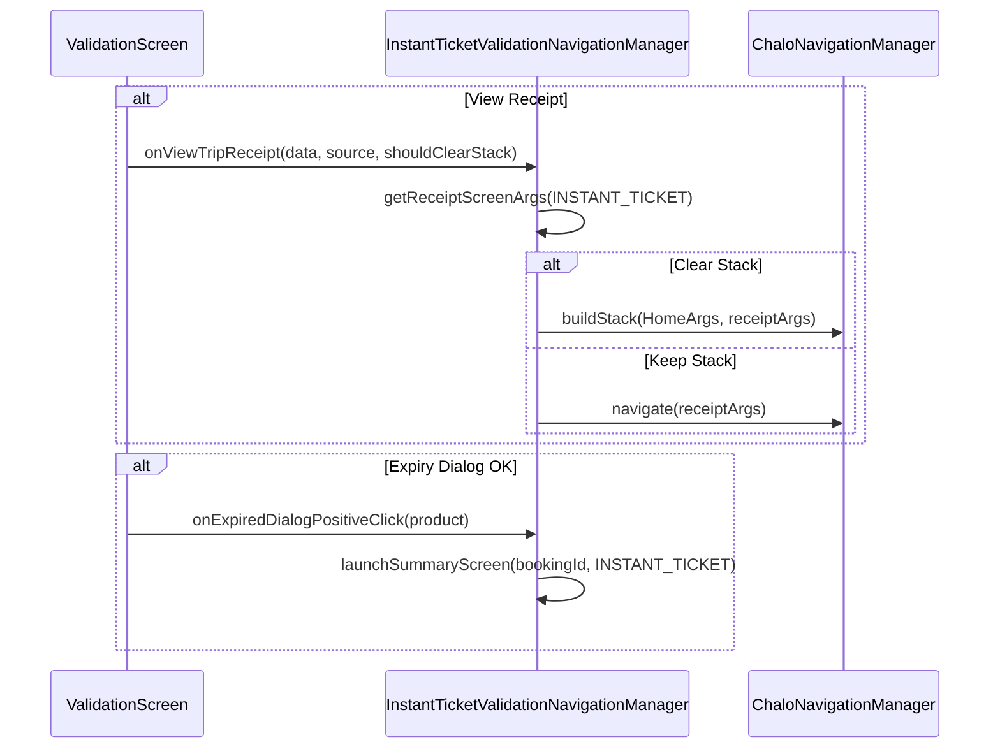

### InstantTicketReceiptManager

Bridges the instant ticket system with the receipt framework:

```mermaid
flowchart LR
    ReceiptScreen["Receipt Screen"]
    Manager["InstantTicketReceiptManager"]
    FetchUC["FetchAndStoreInstantTicketReceiptUseCase"]
    UserDetails["InstantTicketUserDetailsForProducts"]

    ReceiptScreen -->|getReceipt(id)| Manager
    Manager -->|invoke(bookingId)| FetchUC
    FetchUC -->|ProductReceiptData| Manager
    Manager -->|result| ReceiptScreen

    ReceiptScreen -->|getUserDetails()| Manager
    Manager --> UserDetails
    UserDetails -->|UserDetailsForProducts| Manager
```

---

## FareDetailsCoordinatorComponent

The coordinator provides both `FareDetailsComponent` and `InstantTicketWalletAccessComponent` to screens requiring both capabilities (like the combined fare details with wallet payment option).

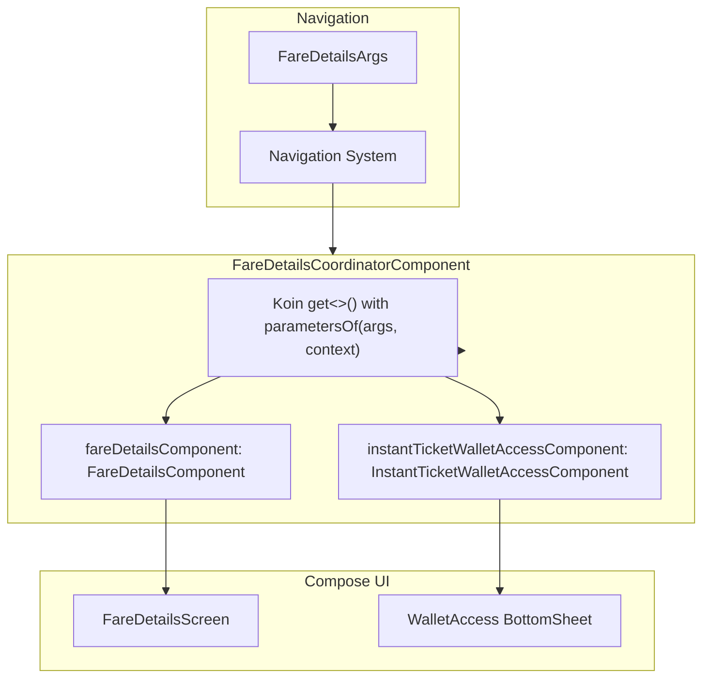

---

## Analytics Integration

### Event Summary by Component

| Component | Event | Trigger |
|-----------|-------|---------|
| WalletAccessComponent | `INSTANT_TICKET_BOTTOM_SHEET_OPENED` | Bottom sheet displayed |
| WalletAccessComponent | `ACTIVATE_WALLET_CLICKED` | KYC initiation |
| WalletAccessComponent | `INSTANT_TICKET_BOTTOM_SHEET_RECHARGE_BUTTON_CLICKED` | Recharge tapped |
| FareDetailsComponent | `FIND_MY_TICKET_FARE_FARE_DETAILS_SCREEN_OPENED` | Fare details loaded |
| FareDetailsComponent | `FIND_MY_TICKET_FARE_FARE_DETAILS_PASSENGER_COUNT_CHANGED` | Count modified |
| FareDetailsComponent | `FIND_MY_TICKET_FARE_FARE_DETAILS_PAY_BUTTON_CLICKED` | Payment initiated |
| FareDetailsComponent | `FARE_DETAILS_FINAL_AMOUNT_BOTTOMSHEET_CONTINUE_CLICK` | ONDC continue tapped |
| FareDetailsComponent | `PREMIUM_BUS_ORDER_CREATION_SUCCESS` | PB order created |
| FareDetailsComponent | `PREMIUM_BUS_ORDER_CREATION_FAILED` | PB order failed |

---

## Error Handling Patterns

### Common Error States

| Error | Component | Handling |
|-------|-----------|----------|
| Config fetch failed | WalletAccessComponent | Toast error, navigate back |
| Wallet status fetch failed | WalletAccessComponent | Process appropriate status |
| Fare fetch failed | FareDetailsComponent | `showSnackbar = true`, retry option |
| Fare validation failed | FareDetailsComponent | Toast with error message |
| Order creation failed | FareDetailsComponent | Dialog or toast based on error type |
| Payment failed | FareDetailsComponent | Toast, allow retry |
| Quick pay validation failed | WalletAccessComponent | Toast with error code |

### Error Recovery Flow

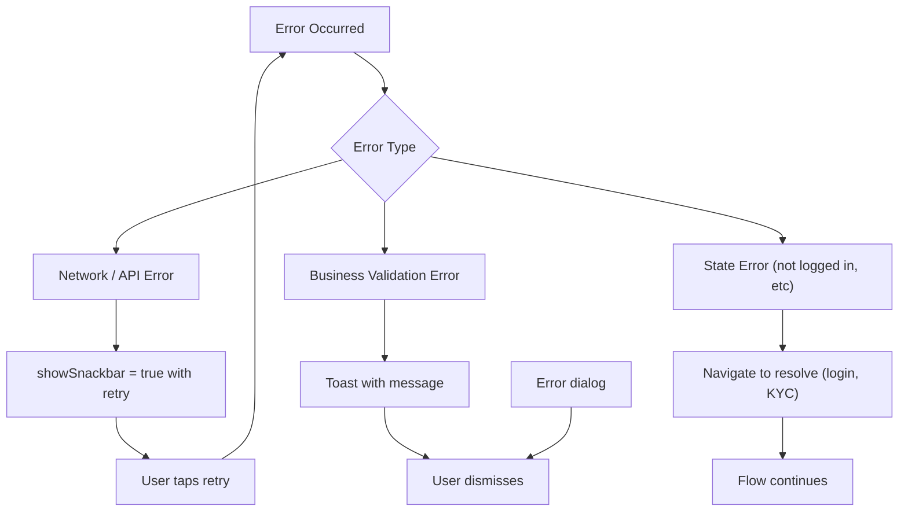
