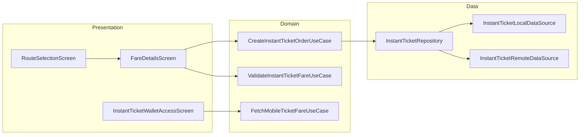

# Instant Ticket — High-Level Design

## Overview

The Instant Ticket feature provides a streamlined, quick ticket purchase flow in the Chalo app. Unlike M-Ticket which requires route selection first, Instant Ticket allows users to enter an amount or select a route and pay immediately. It supports wallet-based quick payments and standard online payments, with instant activation upon successful payment.

## User Journey

1. **Entry Points**:
   - Home screen → Instant Ticket card
   - Home screen → Buy Ticket action
   - Quick Pay flow

2. **Core Flow**:
   - Enter amount or select route
   - Choose from/to stops (if route-based)
   - Select passenger count
   - Pay via wallet or online
   - Receive activated ticket with QR

3. **Exit Points**:
   - Successful booking → Ticket display
   - Payment failure → Retry
   - Ticket expiry → History

## Architecture Diagram



## Key Components

| Component | Platform | File Path | Responsibility |
|-----------|----------|-----------|----------------|
| `InstantTicketWalletAccessComponent` | Shared | `shared/productbooking/.../instantticket/ui/instantticketscreen/InstantTicketWalletAccessComponent.kt` | Amount entry and wallet access |
| `RouteBasedStopSearchForProductPurchaseComponent` | Shared | `shared/productbooking/.../instantticket/ui/routeselection/RouteBasedStopSearchForProductPurchaseComponent.kt` | Route selection |
| `FareDetailsComponent` | Shared | `shared/productbooking/.../instantticket/ui/faredetails/FareDetailsComponent.kt` | Fare breakdown and payment |
| `CreateInstantTicketOrderUseCase` | Shared | `shared/productbooking/.../instantticket/domain/CreateInstantTicketOrderUseCase.kt` | Order creation |
| `ValidateInstantTicketFareUseCase` | Shared | `shared/productbooking/.../instantticket/domain/ValidateInstantTicketFareUseCase.kt` | Fare validation |
| `InstantTicketRepository` | Shared | `shared/productbooking/.../instantticket/data/InstantTicketRepository.kt` | Ticket data management |

## Data Flow

### Amount-Based Purchase
1. `InstantTicketWalletAccessComponent` displays amount entry
2. User enters amount or selects preset
3. Wallet balance checked if Chalo Pay selected
4. Order created with amount
5. Payment processed
6. Ticket activated instantly

### Route-Based Purchase
1. User selects route via `RouteBasedStopSearchForProductPurchaseComponent`
2. From/to stops selected
3. `FetchMobileTicketFareUseCase` fetches fare
4. `FareDetailsComponent` displays breakdown
5. User adjusts passenger count
6. `ValidateInstantTicketFareUseCase` validates final fare
7. `CreateInstantTicketOrderUseCase` creates order
8. Payment and activation

## Platform Differences

### Android-Specific
- Native Compose UI
- QR code generation
- Wallet integration

### iOS-Specific
- SwiftUI integration via SKIE
- iOS-specific validation UI

## Integration Points

### Analytics Events
- See [Analytics: instant-ticket](/analytics/flows/instant-ticket) for event documentation
- Key events:
  - `instant_ticket_screen_opened`
  - `instant_ticket_amount_entered`
  - `instant_ticket_route_selected`
  - `instant_ticket_fare_details_opened`
  - `instant_ticket_payment_initiated`
  - `instant_ticket_booking_success`

### Shared Services
- **Wallet**: Chalo Pay for quick payments
- **Payment**: Checkout for online payments
- **Validation**: BLE/QR validation SDK

### Navigation
- **Navigates to**: Fare details, Checkout, Ticket display
- **Navigated from**: Home, Quick action cards

## Comparison: Instant Ticket vs M-Ticket

| Feature | Instant Ticket | M-Ticket |
|---------|---------------|----------|
| **Entry Flow** | Amount or route | Route first |
| **Purchase Speed** | Faster (3 screens) | Standard (3-4 screens) |
| **Activation** | Instant on payment | Manual activation |
| **Wallet Support** | Primary | Optional |
| **Passenger Selection** | Single or multiple | Multiple types |
| **Configuration** | Product config-based | City config-based |

## Edge Cases & Error Handling

| Scenario | Handling |
|----------|----------|
| Invalid amount entered | Shows validation error |
| Wallet insufficient | Shows top-up prompt or other modes |
| Fare validation failed | Shows error with retry |
| Route not available | Shows empty state |
| Ticket already expired | Shows in expired history |
| Network offline | Shows cached tickets only |

## Data Models

### InstantTicketEntity
```kotlin
data class InstantTicketEntity(
    val bookingId: String,
    val userId: String,
    val productName: String,
    val bookingTime: Long,
    val amount: Long,
    val status: InstantTicketStatus,
    val punchTime: Long?,
    val city: String,
    val qrCode: String?,
    val tone: String?,
    val activationExpiryTime: Long?,
    val refundInfo: RefundInfoEntityModel?
) {
    fun isExpired(chaloTime: Long): Boolean
    fun isActive(chaloTime: Long): Boolean
}
```

### InstantTicketStatus
```kotlin
enum class InstantTicketStatus {
    ACTIVE,
    PAYMENT_PROCESSING,
    PAYMENT_FAILED,
    EXPIRED,
    CANCELLED,
    FAILED
}
```

### FetchMobileTicketFareResponseAppModel
```kotlin
data class FetchMobileTicketFareResponseAppModel(
    val totalAvailableSeats: Int,
    val fareRoundingOffLogic: CurrencyRoundOffLogic,
    val passengerDetails: List<PassengerDetailAppModel>,
    val fareNote: String?,
    val passengerSelectionPolicy: PassengerSelectionPolicy,
    val appliedRules: List<ApplicableRuleAppModel>?
)
```

### InstantTicketValidationModel
```kotlin
class InstantTicketValidationModel(
    val status: InstantTicketStatus,
    override val transactionId: String,
    override val paymentMode: String,
    override val qrCode: String?,
    override val soundStaticTone: String?,
    override val expiryTime: Long,
    override val activationDuration: Long?,
    override val amount: Int,
    override val orderId: String,
    val punchTime: Long?,
    override val productName: String
) : ProductValidationModel
```

## Dependencies

### Internal
- `shared:productbooking` — Instant ticket module
- `shared:checkout` — Payment processing
- `shared:wallet` — Chalo Pay integration
- `shared:chalo-base` — Base models

### External
- SQLDelight — Local ticket storage
- DataStore — Preferences
