# Instant Ticket Repositories - Low-Level Design

## Overview

The Instant Ticket data layer manages ticket persistence, fare calculations, order creation, and receipt storage. The architecture follows a repository pattern with `InstantTicketRepository` as the central interface, backed by `InstantTicketRemoteDataSource` for API communication and `InstantTicketLocalDataSource` for SQLDelight-based local storage. The repository coordinates between these data sources to provide offline-capable ticket access with city-cluster-aware filtering.

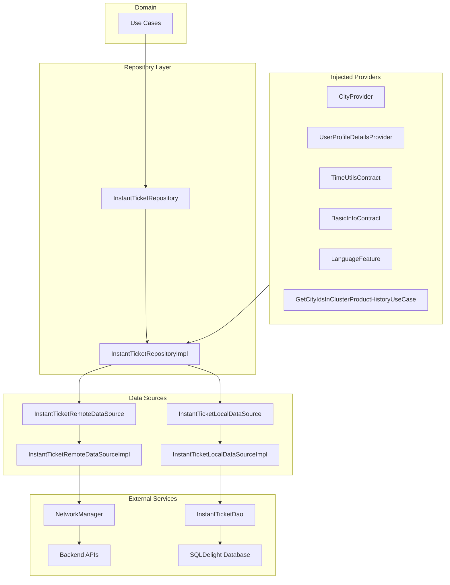
```mermaid
flowchart TB
    subgraph Domain
        UseCases["Use Cases"]
    end

    subgraph Repository["Repository Layer"]
        IRepo["InstantTicketRepository"]
        RepoImpl["InstantTicketRepositoryImpl"]
    end

    subgraph DataSources["Data Sources"]
        IRemote["InstantTicketRemoteDataSource"]
        RemoteImpl["InstantTicketRemoteDataSourceImpl"]
        ILocal["InstantTicketLocalDataSource"]
        LocalImpl["InstantTicketLocalDataSourceImpl"]
    end

    subgraph External["External Services"]
        Network["NetworkManager"]
        API["Backend APIs"]
        DB["SQLDelight Database"]
        DAO["InstantTicketDao"]
    end

    subgraph Providers["Injected Providers"]
        City["CityProvider"]
        Profile["UserProfileDetailsProvider"]
        Time["TimeUtilsContract"]
        BasicInfo["BasicInfoContract"]
        Language["LanguageFeature"]
        Cluster["GetCityIdsInClusterProductHistoryUseCase"]
    end

    UseCases --> IRepo
    IRepo --> RepoImpl
    RepoImpl --> IRemote
    RepoImpl --> ILocal
    IRemote --> RemoteImpl
    RemoteImpl --> Network
    Network --> API
    ILocal --> LocalImpl
    LocalImpl --> DAO
    DAO --> DB
    Providers --> RepoImpl
```

---

## Repository Interface

### InstantTicketRepository

The repository interface defines all data operations for instant tickets.

| Method | Return Type | Purpose |
|--------|-------------|---------|
| `createInstantTicketOrder` | CreateOrderResponseAppModel | Create new ticket order |
| `getInstantTicket` | InstantTicketEntity? | Get single ticket by ID |
| `getInstantTicketAsFlow` | Flow<InstantTicketEntity?> | Observe ticket changes |
| `getAllInstantTickets` | List<InstantTicketEntity> | Get all user tickets |
| `getAllInstantTicketsAsFlow` | Flow<List<InstantTicketEntity>> | Observe ticket list |
| `getActiveOrPaymentProcessingInstantTicketsAsFlow` | Flow<List<InstantTicketEntity>> | Observe active tickets |
| `fetchInstantTicketAndStore` | Unit | Fetch and cache ticket |
| `updateInstantTicketTable` | Unit | Bulk update from JSON |
| `deleteAllLocalInstantTickets` | Unit | Clear local cache |
| `fetchInstantTicketReceipt` | InstantTicketReceipt | Get ticket receipt |
| `getInstantTicketReceiptFlow` | Flow<InstantTicketReceipt?> | Observe receipt |
| `insertInstantTicketReceipt` | Unit | Store receipt locally |
| `getMobileTicketFare` | FetchMobileTicketFareResponseAppModel | Calculate route fare |
| `validateInstantTicketFare` | ValidateInstantTicketFareResponseAppModel | Validate fare |
| `markInstantTicketAsExpiredByUpdatingExpiryTime` | Unit | Mark ticket expired |

---

## Repository Implementation

### InstantTicketRepositoryImpl

The implementation coordinates between remote and local data sources while handling city cluster logic, user scoping, and data transformation.

### Constructor Dependencies

| Dependency | Type | Purpose |
|------------|------|---------|
| `instantTicketRemoteDataSource` | InstantTicketRemoteDataSource | API communication |
| `instantTicketLocalDataSource` | InstantTicketLocalDataSource | Local database operations |
| `coroutineContextProvider` | CoroutineContextProvider | Thread dispatching |
| `cityProvider` | CityProvider | Current city access |
| `profileFeature` | UserProfileDetailsProvider | User ID access |
| `basicInfoContract` | BasicInfoContract | Device/time info |
| `timeUtilsContract` | TimeUtilsContract | Time operations |
| `getDistinctIdUseCase` | GetDistinctIdUseCase | Analytics ID |
| `languageHelperContract` | LanguageFeature | Current language |
| `getCityIdsInClusterProductHistoryUseCase` | GetCityIdsInClusterProductHistoryUseCase | City cluster resolution |

### Context Properties

The repository maintains computed properties for user and city context:

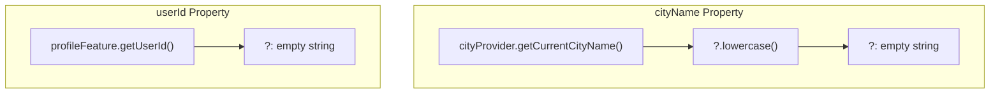
```mermaid
flowchart TD
    subgraph CityName["cityName Property"]
        GetCity["cityProvider.getCurrentCityName()"]
        Lowercase["?.lowercase()"]
        FallbackEmpty["?: empty string"]
    end

    subgraph UserId["userId Property"]
        GetUserId["profileFeature.getUserId()"]
        FallbackEmptyUser["?: empty string"]
    end

    GetCity --> Lowercase --> FallbackEmpty
    GetUserId --> FallbackEmptyUser
```

### City Cluster Logic

Tickets are filtered by city cluster to show tickets from related cities (e.g., Mumbai suburbs):

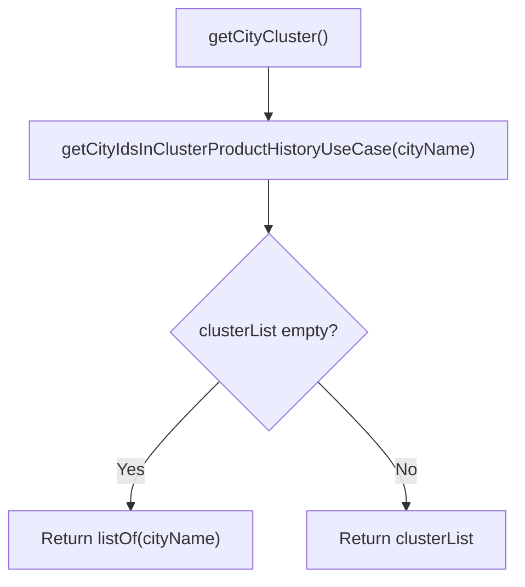
```mermaid
flowchart TD
    GetCluster["getCityCluster()"]
    CallUseCase["getCityIdsInClusterProductHistoryUseCase(cityName)"]
    Check{clusterList empty?}
    UseCluster["Return clusterList"]
    UseSingle["Return listOf(cityName)"]

    GetCluster --> CallUseCase
    CallUseCase --> Check
    Check -->|Yes| UseSingle
    Check -->|No| UseCluster
```

---

## Data Operations

### Order Creation

Creates a new instant ticket order through the backend API.

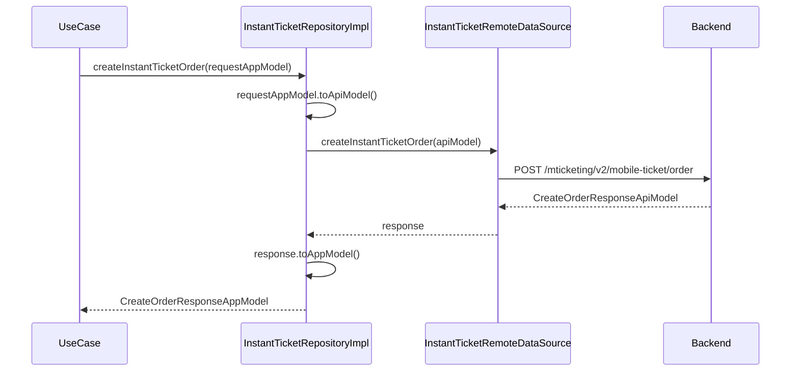
```mermaid
sequenceDiagram
    participant UC as UseCase
    participant Repo as InstantTicketRepositoryImpl
    participant Remote as InstantTicketRemoteDataSource
    participant API as Backend

    UC->>Repo: createInstantTicketOrder(requestAppModel)
    Repo->>Repo: requestAppModel.toApiModel()
    Repo->>Remote: createInstantTicketOrder(apiModel)
    Remote->>API: POST /mticketing/v2/mobile-ticket/order
    API-->>Remote: CreateOrderResponseApiModel
    Remote-->>Repo: response
    Repo->>Repo: response.toAppModel()
    Repo-->>UC: CreateOrderResponseAppModel
```

### Ticket Retrieval

#### Single Ticket by ID

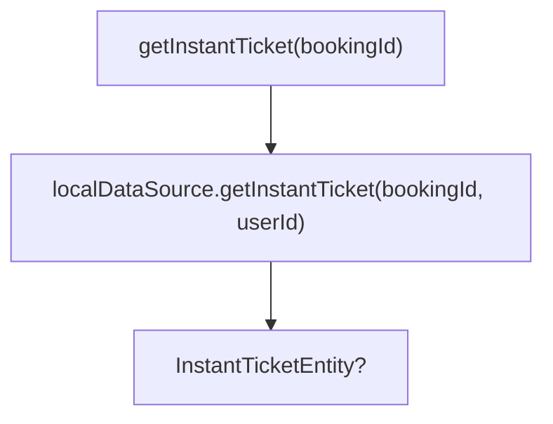
```mermaid
flowchart TD
    Input["getInstantTicket(bookingId)"]
    CallLocal["localDataSource.getInstantTicket(bookingId, userId)"]
    Return["InstantTicketEntity?"]

    Input --> CallLocal
    CallLocal --> Return
```

#### All Tickets with Status Filtering

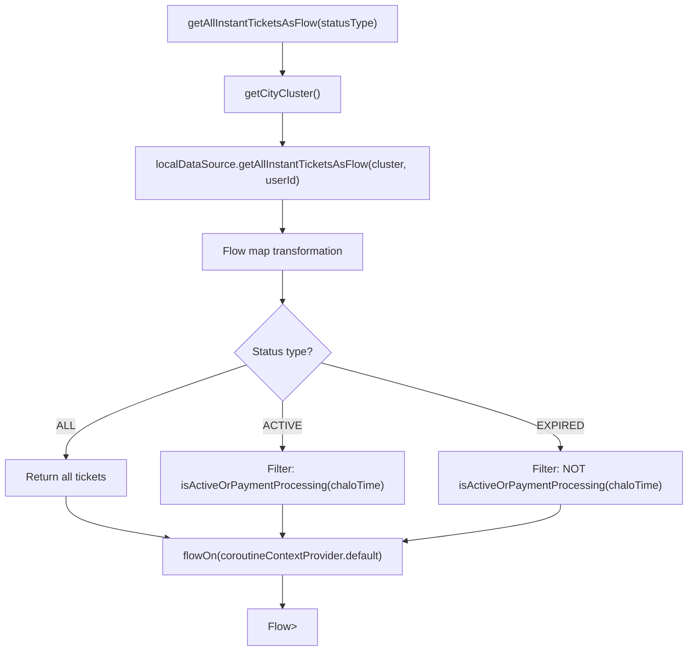
```mermaid
flowchart TD
    Input["getAllInstantTicketsAsFlow(statusType)"]
    GetCluster["getCityCluster()"]
    Query["localDataSource.getAllInstantTicketsAsFlow(cluster, userId)"]
    MapFlow["Flow map transformation"]
    FilterStatus{Status type?}
    All["Return all tickets"]
    Active["Filter: isActiveOrPaymentProcessing(chaloTime)"]
    Expired["Filter: NOT isActiveOrPaymentProcessing(chaloTime)"]
    FlowOn["flowOn(coroutineContextProvider.default)"]
    Return["Flow<List<InstantTicketEntity>>"]

    Input --> GetCluster
    GetCluster --> Query
    Query --> MapFlow
    MapFlow --> FilterStatus
    FilterStatus -->|ALL| All
    FilterStatus -->|ACTIVE| Active
    FilterStatus -->|EXPIRED| Expired
    All --> FlowOn
    Active --> FlowOn
    Expired --> FlowOn
    FlowOn --> Return
```

### Fetch and Store Ticket

Retrieves a ticket from the backend and stores it locally:

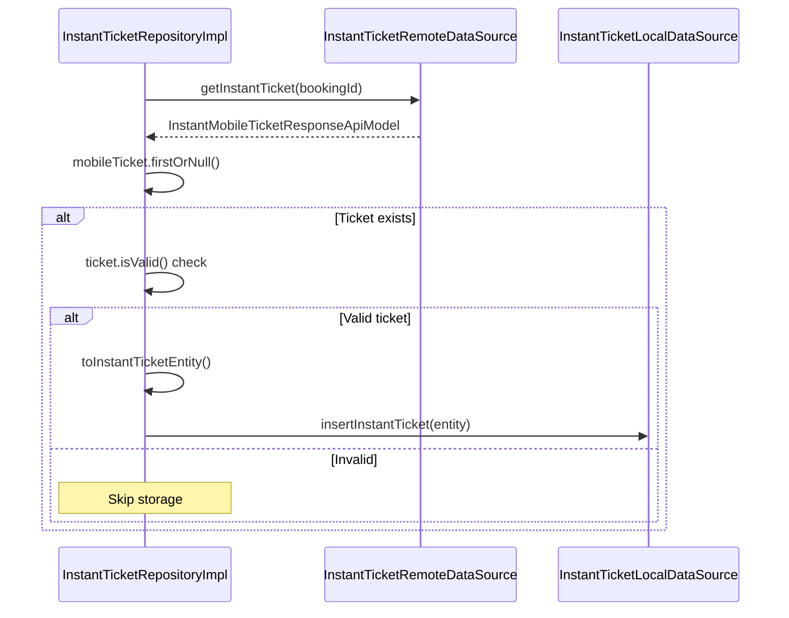
```mermaid
sequenceDiagram
    participant Repo as InstantTicketRepositoryImpl
    participant Remote as InstantTicketRemoteDataSource
    participant Local as InstantTicketLocalDataSource

    Repo->>Remote: getInstantTicket(bookingId)
    Remote-->>Repo: InstantMobileTicketResponseApiModel

    Repo->>Repo: mobileTicket.firstOrNull()

    alt Ticket exists
        Repo->>Repo: ticket.isValid() check

        alt Valid ticket
            Repo->>Repo: toInstantTicketEntity()
            Repo->>Local: insertInstantTicket(entity)
        else Invalid
            Note over Repo: Skip storage
        end
    end
```

### Bulk Update from JSON

Handles incoming ticket data from push notifications or sync:

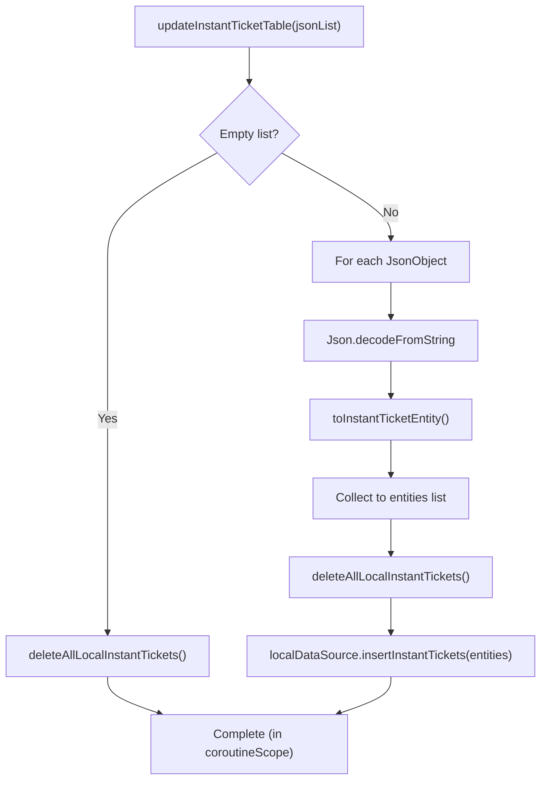
```mermaid
flowchart TD
    Input["updateInstantTicketTable(jsonList)"]
    CheckEmpty{Empty list?}
    DeleteOnly["deleteAllLocalInstantTickets()"]

    ParseLoop["For each JsonObject"]
    Decode["Json.decodeFromString<InstantTicketResponseApiModel>"]
    Transform["toInstantTicketEntity()"]
    Collect["Collect to entities list"]

    ClearOld["deleteAllLocalInstantTickets()"]
    InsertAll["localDataSource.insertInstantTickets(entities)"]
    Complete["Complete (in coroutineScope)"]

    Input --> CheckEmpty
    CheckEmpty -->|Yes| DeleteOnly
    CheckEmpty -->|No| ParseLoop
    DeleteOnly --> Complete
    ParseLoop --> Decode
    Decode --> Transform
    Transform --> Collect
    Collect --> ClearOld
    ClearOld --> InsertAll
    InsertAll --> Complete
```

### Fare Calculation

Fetches fare from the API with response validation:

```mermaid
flowchart TD
    Input["getMobileTicketFare(requestAppModel)"]
    Transform["requestAppModel.toApiModel()"]
    Call["remoteDataSource.getMobileTicketFare(apiModel)"]
    Check{isValidResponse()?}
    MapApp["response.toAppModel()"]
    Return["FetchMobileTicketFareResponseAppModel"]
    Throw["throw InvalidFareResponseDataException"]

    Input --> Transform
    Transform --> Call
    Call --> Check
    Check -->|Yes| MapApp
    Check -->|No| Throw
    MapApp --> Return
```

### Mark Ticket Expired

Updates expiry time to mark ticket as used:

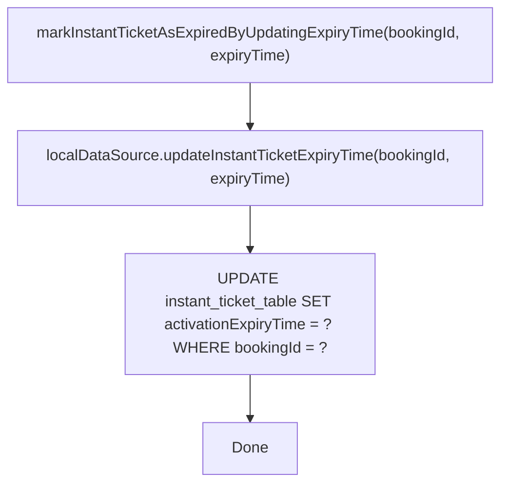
```mermaid
flowchart TD
    Input["markInstantTicketAsExpiredByUpdatingExpiryTime(bookingId, expiryTime)"]
    CallLocal["localDataSource.updateInstantTicketExpiryTime(bookingId, expiryTime)"]
    SQLUpdate["UPDATE instant_ticket_table SET activationExpiryTime = ? WHERE bookingId = ?"]
    Complete["Done"]

    Input --> CallLocal
    CallLocal --> SQLUpdate
    SQLUpdate --> Complete
```

---

## Remote Data Source

### InstantTicketRemoteDataSource Interface

| Method | Purpose |
|--------|---------|
| `createInstantTicketOrder` | POST order creation |
| `getInstantTicket` | GET ticket by booking ID |
| `fetchInstantTicketReceipt` | GET receipt details |
| `getMobileTicketFare` | POST fare calculation |
| `validateInstantTicketFare` | POST fare validation |

### InstantTicketRemoteDataSourceImpl

Implements the remote data source using `NetworkManager` with standard request building patterns.

### API Endpoints

| Operation | Method | URL | Auth |
|-----------|--------|-----|------|
| Create Order | POST | `/mticketing/v2/mobile-ticket/order` | Secure |
| Get Ticket | GET | `/mticketing/v2/mobile-ticket/bookings` | Secure |
| Get Receipt | GET | `/mticketing/v2/mobile-ticket/receipt` | Secure |
| Calculate Fare | POST | `/mticketing/v2/mobile-ticket/fare` | Secure |
| Validate Fare | POST | `/mticketing/v2/mobile-ticket/validate-fare` | None |

### Request Flow

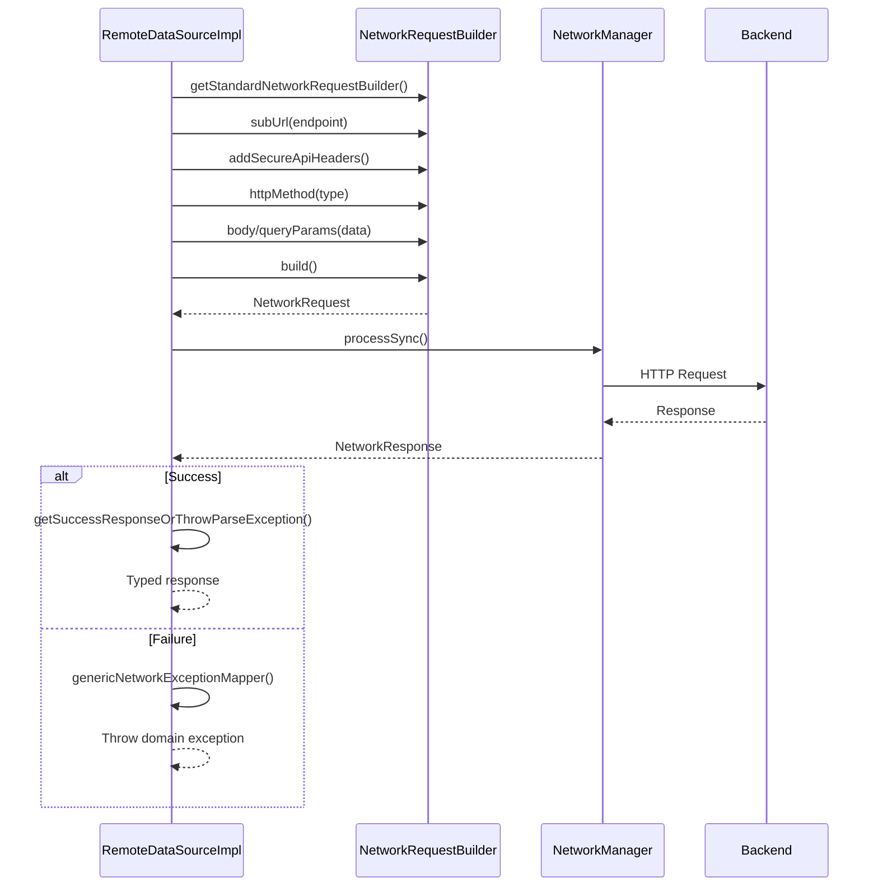
```mermaid
sequenceDiagram
    participant Source as RemoteDataSourceImpl
    participant Builder as NetworkRequestBuilder
    participant Manager as NetworkManager
    participant API as Backend

    Source->>Builder: getStandardNetworkRequestBuilder()
    Source->>Builder: subUrl(endpoint)
    Source->>Builder: addSecureApiHeaders()
    Source->>Builder: httpMethod(type)
    Source->>Builder: body/queryParams(data)
    Source->>Builder: build()
    Builder-->>Source: NetworkRequest
    Source->>Manager: processSync()
    Manager->>API: HTTP Request
    API-->>Manager: Response
    Manager-->>Source: NetworkResponse

    alt Success
        Source->>Source: getSuccessResponseOrThrowParseException()
        Source-->>Source: Typed response
    else Failure
        Source->>Source: genericNetworkExceptionMapper()
        Source-->>Source: Throw domain exception
    end
```

### Error Mapping

Each endpoint maps network errors to domain-specific exceptions:

| Endpoint | Exception Type |
|----------|----------------|
| `createInstantTicketOrder` | ProductBookingRemoteDataException |
| `getInstantTicket` | InstantTicketOrderCreationFailedException |
| `fetchInstantTicketReceipt` | InstantTicketReceiptFetchFailedException |
| `getMobileTicketFare` | ProductBookingRemoteDataException |
| `validateInstantTicketFare` | ProductBookingRemoteDataException |

### Create Order Request

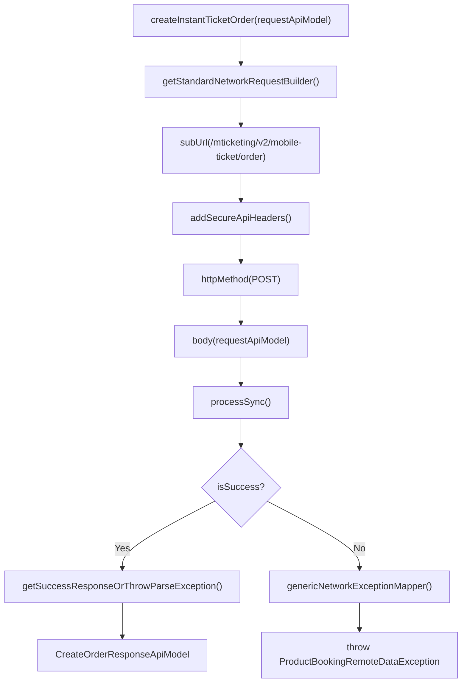
```mermaid
flowchart TD
    Input["createInstantTicketOrder(requestApiModel)"]
    Build["getStandardNetworkRequestBuilder()"]
    SetUrl["subUrl(/mticketing/v2/mobile-ticket/order)"]
    SetHeaders["addSecureApiHeaders()"]
    SetMethod["httpMethod(POST)"]
    SetBody["body(requestApiModel)"]
    Execute["processSync()"]
    Check{isSuccess?}
    ParseResponse["getSuccessResponseOrThrowParseException()"]
    Return["CreateOrderResponseApiModel"]
    MapError["genericNetworkExceptionMapper()"]
    ThrowException["throw ProductBookingRemoteDataException"]

    Input --> Build
    Build --> SetUrl
    SetUrl --> SetHeaders
    SetHeaders --> SetMethod
    SetMethod --> SetBody
    SetBody --> Execute
    Execute --> Check
    Check -->|Yes| ParseResponse
    ParseResponse --> Return
    Check -->|No| MapError
    MapError --> ThrowException
```

### Get Ticket Query Parameters

| Query Param | Value | Source |
|-------------|-------|--------|
| `bookingId` | {bookingId} | Input parameter |
| `productType` | "INSTANT_TICKET" | InstantTicketConstants.PRODUCT_TYPE |
| `productSubType` | "INSTANT_TICKET" | InstantTicketConstants.PRODUCT_SUB_TYPE |

---

## Local Data Source

### InstantTicketLocalDataSource Interface

| Method | Purpose |
|--------|---------|
| `getInstantTicket` | Query single ticket |
| `getInstantTicketAsFlow` | Observe single ticket |
| `getAllInstantTickets` | Query all tickets for user/cities |
| `getAllInstantTicketsAsFlow` | Observe all tickets |
| `getActiveOrPaymentProcessingInstantTicketsAsFlow` | Observe active tickets |
| `insertInstantTicket` | Insert single ticket |
| `insertInstantTickets` | Bulk insert tickets |
| `deleteInstantTickets` | Clear all tickets |
| `updateInstantTicketExpiryTime` | Update expiry for tap-out |

### InstantTicketLocalDataSourceImpl

Wraps the SQLDelight-generated `InstantTicketDao` to provide local data operations.

### SQLDelight Table Definition

```sql
CREATE TABLE IF NOT EXISTS instant_ticket_table (
    bookingId TEXT NOT NULL,
    userId TEXT NOT NULL,
    productName TEXT NOT NULL,
    bookingTime INTEGER NOT NULL,
    amount INTEGER NOT NULL,
    status TEXT AS InstantTicketStatus NOT NULL,
    punchTime INTEGER,
    city TEXT NOT NULL,
    qrCode TEXT,
    tone TEXT,
    activationExpiryTime INTEGER,
    refundInfo TEXT AS RefundInfoEntityModel,
    PRIMARY KEY(bookingId)
);
```

### Generated DAO Queries

| Query Name | SQL | Purpose |
|------------|-----|---------|
| `getInstantTicket` | `SELECT * FROM instant_ticket_table WHERE bookingId = ? AND userId = ?` | Single ticket |
| `getInstantTicketAsFlow` | Same as above | Observable single ticket |
| `getAllInstantTickets` | `SELECT * FROM instant_ticket_table WHERE city IN ? AND userId = ?` | All tickets |
| `getAllInstantTicketsAsFlow` | Same as above | Observable all tickets |
| `getActiveOrPaymentProcessingInstantTicketsAsFlow` | `SELECT * FROM instant_ticket_table WHERE (status = 'ACTIVE' OR status = 'PAYMENT_PROCESSING') AND city IN ? AND userId = ?` | Active tickets |
| `insertInstantTicket` | `INSERT OR REPLACE INTO instant_ticket_table VALUES ?` | Insert/update single |
| `insertInstantTickets` | Same as above (batch) | Bulk insert |
| `deleteInstantTickets` | `DELETE FROM instant_ticket_table` | Clear all |
| `updateInstantTicketExpiryTime` | `UPDATE instant_ticket_table SET activationExpiryTime = ? WHERE bookingId = ?` | Update expiry |

### Query Scoping

All ticket queries are scoped by userId and city cluster:

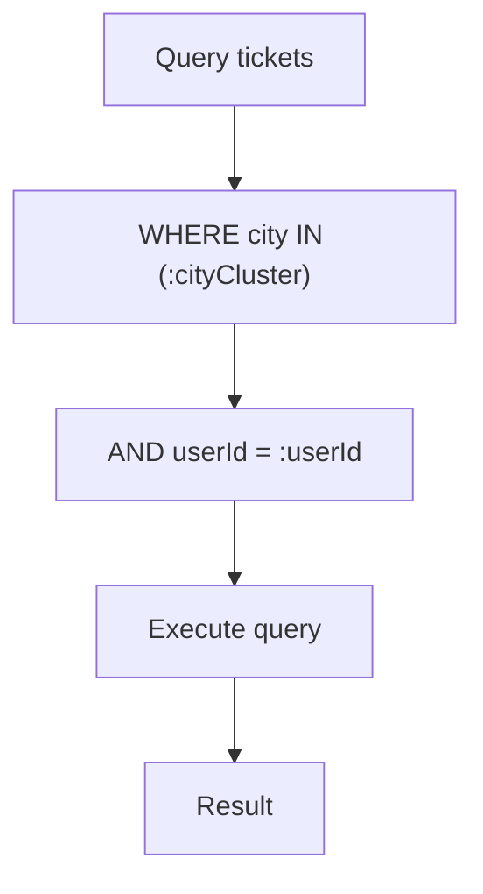
```mermaid
flowchart TD
    Query["Query tickets"]
    FilterCity["WHERE city IN (:cityCluster)"]
    FilterUser["AND userId = :userId"]
    Execute["Execute query"]
    Return["Result"]

    Query --> FilterCity
    FilterCity --> FilterUser
    FilterUser --> Execute
    Execute --> Return
```

### Flow-based Queries

SQLDelight generates Flow-returning queries for reactive updates:

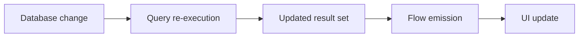
```mermaid
flowchart LR
    Change["Database change"]
    Trigger["Query re-execution"]
    NewData["Updated result set"]
    Emit["Flow emission"]
    UI["UI update"]

    Change --> Trigger
    Trigger --> NewData
    NewData --> Emit
    Emit --> UI
```

---

## Data Models

### API Request Models

#### InstantTicketOrderRequestApiModel

| Field | Type | Description |
|-------|------|-------------|
| `routeId` | String | Selected route |
| `startStopId` | String | Origin stop |
| `endStopId` | String | Destination stop |
| `cityId` | String | City identifier |
| `configId` | String | Product config |
| `passengerDetails` | List | Passenger selections |
| `totalAmount` | Long | Total fare |
| `paymentMode` | String | Payment method |

#### FetchMobileTicketFareRequestApiModel

| Field | Type | Description |
|-------|------|-------------|
| `routeId` | String | Route identifier |
| `startStopId` | String | Origin stop ID |
| `endStopId` | String | Destination stop ID |
| `cityId` | String | City code |
| `configId` | String | Config identifier |
| `seats` | List? | Pre-selected seats (for premium) |
| `userCampaign` | String? | Marketing attribution |
| `userAcquisitionChannel` | String? | Acquisition channel |

#### ValidateInstantTicketFareRequestApiModel

| Field | Type | Description |
|-------|------|-------------|
| `routeId` | String | Route identifier |
| `startStopId` | String | Origin stop |
| `endStopId` | String | Destination stop |
| `cityId` | String | City code |
| `configId` | String | Config ID |
| `passengerDetails` | List | Selected passengers |
| `expectedFare` | Long | Amount to validate |

### API Response Models

#### FetchMobileTicketFareResponseApiModel

| Field | Type | Description |
|-------|------|-------------|
| `totalAvailableSeats` | Int? | Max passengers |
| `fareRoundingOffLogic` | String? | Rounding method |
| `passengerDetails` | List<PassengerDetailApiModel>? | Fare breakdown |
| `fareNote` | String? | Display note |
| `passengerSelectionPolicy` | String? | Selection policy |
| `appliedRules` | List<ApplicableRuleApiModel>? | Pricing rules |

**Validation:** `isValidResponse()` checks for non-null required fields.

#### InstantMobileTicketResponseApiModel

| Field | Type | Description |
|-------|------|-------------|
| `mobileTicket` | List<InstantTicketResponseApiModel> | Ticket list |

#### CreateOrderResponseApiModel

| Field | Type | Description |
|-------|------|-------------|
| `orderId` | String | Created order ID |
| `amount` | Long | Order amount |
| `checkoutPayload` | String? | Additional checkout data |

### Entity Models

#### InstantTicketEntity

Primary local storage model with computed status methods:

| Field | Type | Nullable | Description |
|-------|------|----------|-------------|
| `bookingId` | String | No | Primary key |
| `userId` | String | No | Owner user ID |
| `productName` | String | No | Display name |
| `bookingTime` | Long | No | Creation timestamp |
| `amount` | Long | No | Amount in paisa |
| `status` | InstantTicketStatus | No | Current status |
| `punchTime` | Long | Yes | Activation time |
| `city` | String | No | City code |
| `qrCode` | String | Yes | QR validation data |
| `tone` | String | Yes | Sound URL |
| `activationExpiryTime` | Long | Yes | Expiry timestamp |
| `refundInfo` | RefundInfoEntityModel | Yes | Refund details |

**Status Methods:**

| Method | Logic |
|--------|-------|
| `isExpired(chaloTime)` | status == EXPIRED OR (expiryTime != null AND chaloTime > expiryTime) |
| `isActive(chaloTime)` | status == ACTIVE AND expiryTime != null AND chaloTime <= expiryTime |
| `isActiveOrPaymentProcessing(chaloTime)` | isActive(chaloTime) OR status == PAYMENT_PROCESSING |

#### InstantTicketStatus Enum

| Value | Description |
|-------|-------------|
| `ACTIVE` | Valid for travel |
| `PAYMENT_PROCESSING` | Payment in progress |
| `PAYMENT_FAILED` | Payment failed |
| `EXPIRED` | Validity ended |
| `CANCELLED` | User cancelled |
| `FAILED` | System error |

**Parsing:** `fromString(status)` with fallback to `EXPIRED`.

#### InstantTicketReceipt

Receipt model implementing `ProductReceiptData`:

| Field | Type | Description |
|-------|------|-------------|
| `bookingId` | String | Ticket ID |
| `punchTime` | Long | Activation time |
| `amount` | Long | Amount in paisa |
| `vehicleNo` | String | Vehicle number |
| `conductorId` | String | Conductor ID |
| `startStopName` | String | Origin stop |
| `endStopName` | String | Destination stop |
| `routeName` | String | Route name |
| `productReceiptPassengerDetails` | Map<String, Int>? | Passenger counts |
| `via` | String? | Via route |
| `routeNamingScheme` | RouteNamingSchemeType | Naming scheme |

### App Models

#### FetchMobileTicketFareResponseAppModel

| Field | Type | Description |
|-------|------|-------------|
| `totalAvailableSeats` | Int | Max passengers |
| `fareRoundingOffLogic` | CurrencyRoundOffLogic | Rounding enum |
| `passengerDetails` | List<PassengerDetailAppModel> | Passenger fares |
| `fareNote` | String? | Display text |
| `passengerSelectionPolicy` | PassengerSelectionPolicy | Selection mode |
| `appliedRules` | List<ApplicableRuleAppModel>? | Active rules |

#### PassengerSelectionPolicy Enum

| Value | Behavior |
|-------|----------|
| `Multiple` | Select multiple passenger types |
| `Single` | Select only one type |

**Parsing:** `fromString(policyString)` matching enum names.

#### SeatLimitAppModel

| Field | Type | Default | Description |
|-------|------|---------|-------------|
| `minCount` | Int | 0 | Minimum passengers |
| `maxCount` | Int | Int.MAX_VALUE | Maximum passengers |

#### FareBreakupAppModel

| Field | Type | Description |
|-------|------|-------------|
| `fareBreakupCopy` | String | Display text |
| `fareOperationType` | FareBreakupOperationType | Calculation type |
| `fare` | Long | Amount in paisa |

#### FareBreakupOperationType Enum

| Value | Code | Effect |
|-------|------|--------|
| `ADDITION` | 0 | Add to total |
| `SUBTRACTION` | 1 | Subtract from total |
| `NO_OP` | -1 | Display only |

---

## Configuration

### InstantTicketConfiguration

Configuration model from `InstantTicketConfigHelper`:

| Field | Type | Description |
|-------|------|-------------|
| `minFareAllowedInSubcurrency` | Long | Minimum fare limit |
| `maxFareAllowedInSubcurrency` | Long | Maximum fare limit |
| `activationDurationInMinutes` | Int | Ticket validity duration |
| `enableWallet` | Boolean | Wallet payment enabled |
| `enableQuickPay` | Boolean | Quick pay option enabled |

### InstantTicketConfigHelper Interface

```kotlin
interface InstantTicketConfigHelper {
    suspend fun getInstantConfiguration(shouldForceFetch: Boolean = false): InstantTicketConfiguration?
    suspend fun fetchAndCacheInstantTicketConfig(): ChaloUseCaseResult<Unit, String?>
}
```

---

## Caching and Synchronization

### Local-First Pattern

Tickets are primarily read from local storage with background sync:

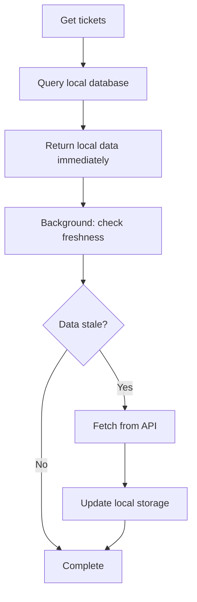
```mermaid
flowchart TD
    Request["Get tickets"]
    LocalQuery["Query local database"]
    ReturnLocal["Return local data immediately"]
    BackgroundCheck["Background: check freshness"]
    NeedsSync{Data stale?}
    FetchRemote["Fetch from API"]
    UpdateLocal["Update local storage"]
    Done["Complete"]

    Request --> LocalQuery
    LocalQuery --> ReturnLocal
    ReturnLocal --> BackgroundCheck
    BackgroundCheck --> NeedsSync
    NeedsSync -->|Yes| FetchRemote
    NeedsSync -->|No| Done
    FetchRemote --> UpdateLocal
    UpdateLocal --> Done
```

### Bulk Sync via updateInstantTicketTable

Handles incoming ticket data from push notifications:

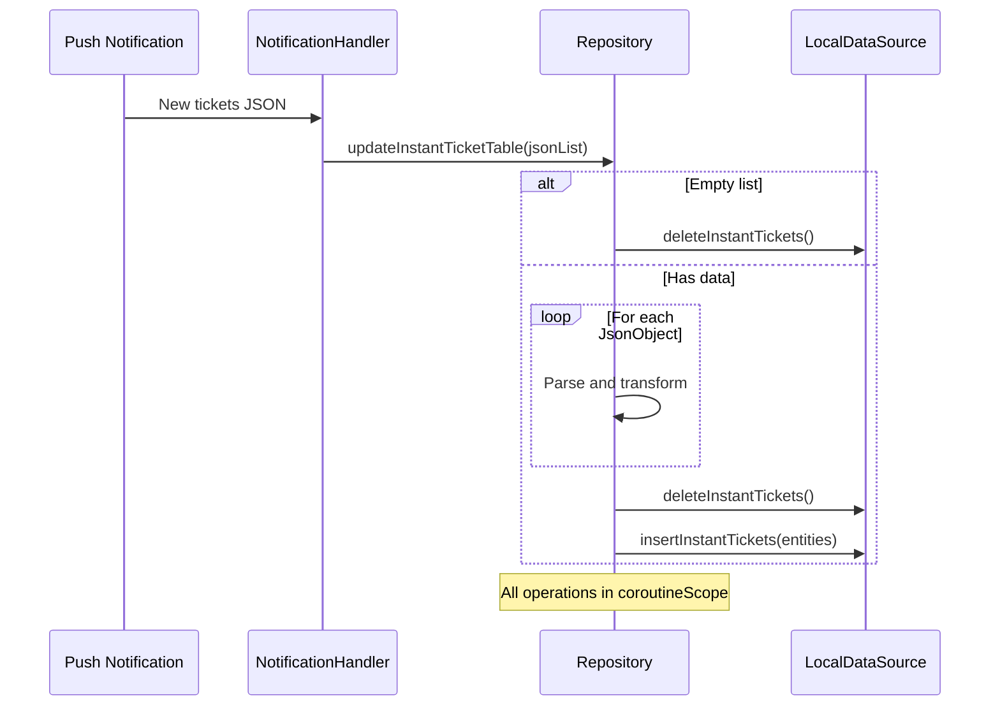
```mermaid
sequenceDiagram
    participant Push as Push Notification
    participant Handler as NotificationHandler
    participant Repo as Repository
    participant Local as LocalDataSource

    Push->>Handler: New tickets JSON
    Handler->>Repo: updateInstantTicketTable(jsonList)

    alt Empty list
        Repo->>Local: deleteInstantTickets()
    else Has data
        loop For each JsonObject
            Repo->>Repo: Parse and transform
        end
        Repo->>Local: deleteInstantTickets()
        Repo->>Local: insertInstantTickets(entities)
    end

    Note over Repo: All operations in coroutineScope
```

---

## Error Handling

### Exception Types

| Exception | Source | Cause |
|-----------|--------|-------|
| `ProductBookingRemoteDataException` | Order, fare APIs | Network/server error |
| `InstantTicketOrderCreationFailedException` | getInstantTicket | Ticket fetch failed |
| `InstantTicketReceiptFetchFailedException` | fetchInstantTicketReceipt | Receipt fetch failed |
| `InvalidFareResponseDataException` | getMobileTicketFare | Missing required fields |

### Exception Mapping Pattern

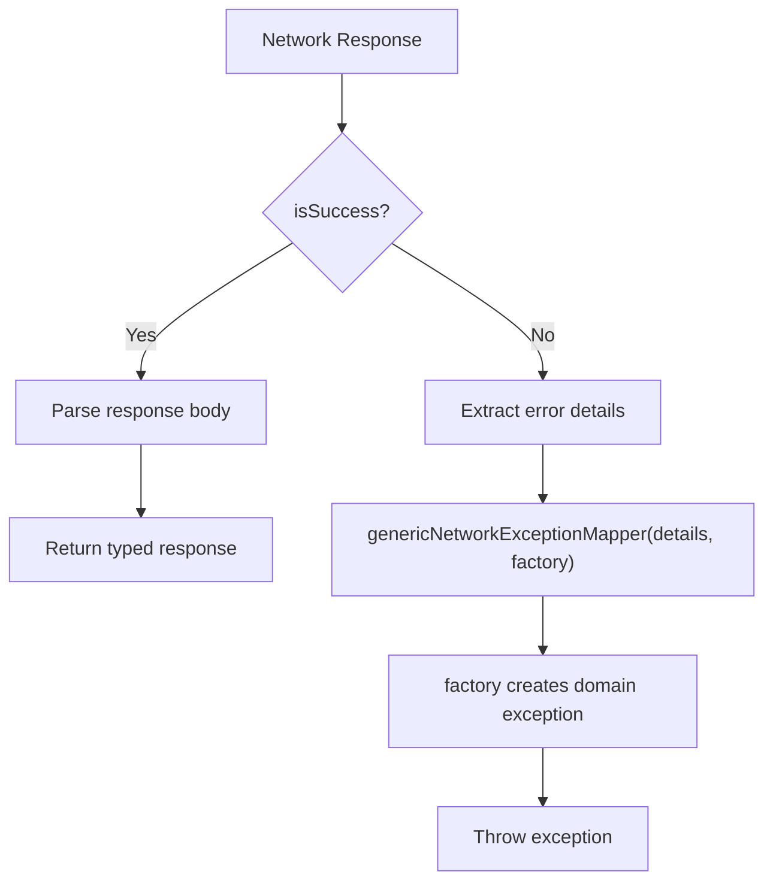
```mermaid
flowchart TD
    Response["Network Response"]
    Check{isSuccess?}
    Parse["Parse response body"]
    Return["Return typed response"]
    Extract["Extract error details"]
    Map["genericNetworkExceptionMapper(details, factory)"]
    Create["factory creates domain exception"]
    Throw["Throw exception"]

    Response --> Check
    Check -->|Yes| Parse
    Parse --> Return
    Check -->|No| Extract
    Extract --> Map
    Map --> Create
    Create --> Throw
```

The `genericNetworkExceptionMapper` extracts:
- Error code from response
- Error message from response
- Full error response object

These are passed to a factory lambda that creates the appropriate domain exception.

---

## Dependency Injection

### Koin Module Bindings

| Interface | Implementation | Scope |
|-----------|----------------|-------|
| `InstantTicketRepository` | InstantTicketRepositoryImpl | Singleton |
| `InstantTicketRemoteDataSource` | InstantTicketRemoteDataSourceImpl | Singleton |
| `InstantTicketLocalDataSource` | InstantTicketLocalDataSourceImpl | Singleton |

### Repository Construction

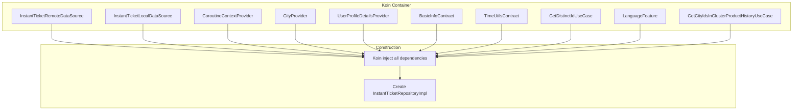
```mermaid
flowchart TB
    subgraph Koin["Koin Container"]
        Remote["InstantTicketRemoteDataSource"]
        Local["InstantTicketLocalDataSource"]
        Context["CoroutineContextProvider"]
        City["CityProvider"]
        Profile["UserProfileDetailsProvider"]
        Basic["BasicInfoContract"]
        Time["TimeUtilsContract"]
        Distinct["GetDistinctIdUseCase"]
        Lang["LanguageFeature"]
        Cluster["GetCityIdsInClusterProductHistoryUseCase"]
    end

    subgraph Construction
        Inject["Koin inject all dependencies"]
        Create["Create InstantTicketRepositoryImpl"]
    end

    Remote --> Inject
    Local --> Inject
    Context --> Inject
    City --> Inject
    Profile --> Inject
    Basic --> Inject
    Time --> Inject
    Distinct --> Inject
    Lang --> Inject
    Cluster --> Inject
    Inject --> Create
```

---

## Platform Considerations

### Coroutine Contexts

The repository uses `CoroutineContextProvider` for thread management:

| Context | Usage |
|---------|-------|
| `io` | Network operations, coroutineScope for bulk operations |
| `default` | Flow transformations (flowOn) |

### Flow Operations

All Flow-returning methods use appropriate dispatchers:

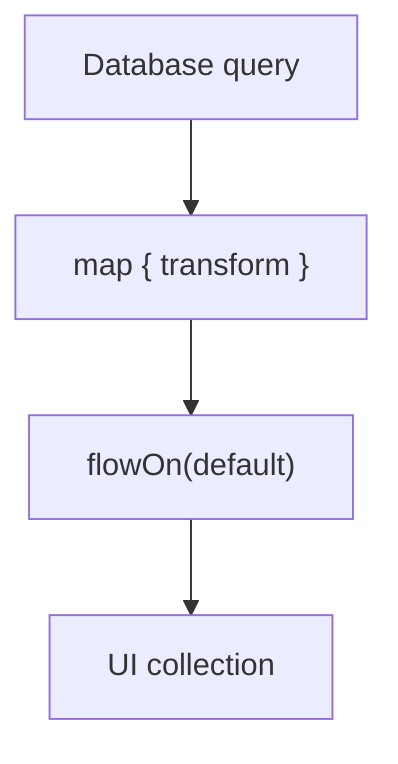
```mermaid
flowchart TD
    LocalQuery["Database query"]
    MapOp["map { transform }"]
    FlowOn["flowOn(default)"]
    Collect["UI collection"]

    LocalQuery --> MapOp
    MapOp --> FlowOn
    FlowOn --> Collect
```

---

## API Contract Summary

### Instant Ticket Endpoints

| Endpoint | Method | Request | Response |
|----------|--------|---------|----------|
| `/mticketing/v2/mobile-ticket/order` | POST | InstantTicketOrderRequestApiModel | CreateOrderResponseApiModel |
| `/mticketing/v2/mobile-ticket/bookings` | GET | Query params | InstantMobileTicketResponseApiModel |
| `/mticketing/v2/mobile-ticket/receipt` | GET | Query params | List<InstantTicketReceipt> |
| `/mticketing/v2/mobile-ticket/fare` | POST | FetchMobileTicketFareRequestApiModel | FetchMobileTicketFareResponseApiModel |
| `/mticketing/v2/mobile-ticket/validate-fare` | POST | ValidateInstantTicketFareRequestApiModel | ValidateInstantTicketFareResponseApiModel |

### Common Query Parameters

| Param | Used By | Description |
|-------|---------|-------------|
| `bookingId` | bookings, receipt | Ticket identifier |
| `productType` | bookings, receipt | "INSTANT_TICKET" |
| `productSubType` | bookings, receipt | "INSTANT_TICKET" |
