# Instant Ticket UseCases - Low-Level Design

## Overview

The Instant Ticket domain layer orchestrates ticket purchasing, fare calculation, order creation, and ticket lifecycle management. Use cases follow the standard Kotlin operator `invoke` pattern, returning `ChaloUseCaseResult<Success, Failure>` for operations that can fail. The layer coordinates between presentation components and the `InstantTicketRepository` to enable both amount-based quick-pay and route-based purchase flows.

```mermaid
flowchart TB
    subgraph Presentation
        WalletAccess["InstantTicketWalletAccessComponent"]
        FareDetails["FareDetailsComponent"]
        ProductActivation["ProductActivationScreen"]
        History["HistoryScreen"]
    end

    subgraph Domain["Domain Layer"]
        FetchFare["FetchMobileTicketFareUseCase"]
        ValidateFare["ValidateInstantTicketFareUseCase"]
        ValidateAmount["ValidateInstantTicketAmountUseCase"]
        CreateOrder["CreateInstantTicketOrderUseCase"]
        FetchReceipt["FetchAndStoreInstantTicketReceiptUseCase"]
        InitiateFetch["InitiateInstantTicketFetchAndStoreUseCase"]
        UpdateTapOut["UpdateInstantTicketEntryInTableOnTapOutUseCase"]
        ClearLogout["ClearInstantTicketsDuringLogoutUseCase"]
    end

    subgraph Data["Data Layer"]
        TicketRepo["InstantTicketRepository"]
        OndcRepo["OndcRepository"]
        CityProvider["CityProvider"]
        BasicInfo["BasicInfoContract"]
    end

    FareDetails --> FetchFare
    FareDetails --> ValidateFare
    FareDetails --> CreateOrder
    WalletAccess --> ValidateAmount
    ProductActivation --> FetchReceipt
    ProductActivation --> InitiateFetch
    ProductActivation --> UpdateTapOut
    History --> ClearLogout

    FetchFare --> TicketRepo
    FetchFare --> OndcRepo
    ValidateFare --> TicketRepo
    ValidateAmount --> CityProvider
    CreateOrder --> TicketRepo
    FetchReceipt --> TicketRepo
    InitiateFetch --> TicketRepo
    UpdateTapOut --> TicketRepo
    UpdateTapOut --> BasicInfo
    ClearLogout --> TicketRepo
```

---

## UseCase Inventory

| UseCase | File | Purpose |
|---------|------|---------|
| `FetchMobileTicketFareUseCase` | `domain/FetchMobileTicketFareUseCase.kt` | Calculate fare for route/stop selection |
| `ValidateInstantTicketFareUseCase` | `domain/ValidateInstantTicketFareUseCase.kt` | Validate fare before payment |
| `ValidateInstantTicketAmountUseCase` | `domain/ValidateInstantTicketAmountUseCase.kt` | Validate amount against config limits |
| `CreateInstantTicketOrderUseCase` | `domain/CreateInstantTicketOrderUseCase.kt` | Create ticket order for payment |
| `FetchAndStoreInstantTicketReceiptUseCase` | `domain/FetchAndStoreInstantTicketReceiptUseCase.kt` | Fetch and persist ticket receipt |
| `InitiateInstantTicketFetchAndStoreUseCase` | `domain/InitiateInstantTicketFetchAndStoreUseCase.kt` | Fetch and store ticket after creation |
| `UpdateInstantTicketEntryInTableOnTapOutUseCase` | `domain/UpdateInstantTicketEntryInTableOnTapOutUseCase.kt` | Mark ticket expired on tap-out |
| `ClearInstantTicketsDuringLogoutUseCase` | `domain/ClearInstantTicketsDuringLogoutUseCase.kt` | Clear local tickets on logout |

---

## FetchMobileTicketFareUseCase

Calculates the fare for route-based ticket purchases, supporting InstantTicket, PremiumReserveTicket, and ONDC ticket flows.

### Responsibility

This use case fetches fare details from the backend API based on route ID, origin stop, destination stop, and optional filters. It routes requests to either `InstantTicketRepository` or `OndcRepository` based on the filter type and transforms responses into a unified app model.

### Dependencies

| Dependency | Type | Purpose |
|------------|------|---------|
| `cityProvider` | CityProvider | Current city name |
| `repository` | InstantTicketRepository | InstantTicket/Premium fare API |
| `ondcRepository` | OndcRepository | ONDC fare API |
| `analyticsContract` | AnalyticsContract | Failure event tracking |
| `userPreferencesDataStore` | IUserPreferencesDataStore | User campaign/channel for attribution |

### Flow Diagram

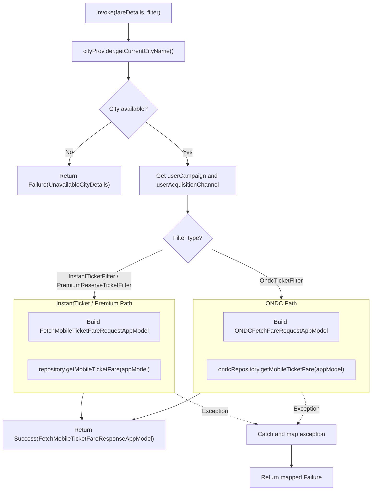

### Input Parameters

| Parameter | Type | Description |
|-----------|------|-------------|
| `fareDetails` | FareDetailsData | Route and stop selection data |
| `filter` | FareRequestFilters | InstantTicket, Premium, or ONDC filter |

### Request Model Construction

The use case constructs different request models based on filter type:

**For InstantTicket/Premium:**

| Field | Source |
|-------|--------|
| `cityName` | cityProvider.getCurrentCityName().lowercase() |
| `routeId` | fareDetails.routeData.routeId |
| `startStopId` | fareDetails.startStop.stopId |
| `endStopId` | fareDetails.endStop.stopId |
| `requestFilters` | filter (InstantTicketFilter or PremiumReserveTicketFilter) |
| `seats` | fareDetails.seats |
| `userCampaign` | userPreferencesDataStore.getAdjustCampaignName() |
| `userAcquisitionChannel` | userPreferencesDataStore.getAdjustAcquisitionChannelName() |

**For ONDC:**

| Field | Source |
|-------|--------|
| `city` | cityProvider.getCurrentCityName().lowercase() |
| `routeId` | fareDetails.routeData.routeId |
| `startStopId` | fareDetails.startStop.stopId |
| `endStopId` | fareDetails.endStop.stopId |
| `providerId` | filter.providerId |
| `tripFulfillmentId` | filter.fulfillmentId |
| `transactionId` | filter.transactionId |

### Output

| Type | Description |
|------|-------------|
| `ChaloUseCaseResult<FetchMobileTicketFareResponseAppModel, ProductBookingDataSourceError>` | Fare calculation result or error |

### Response Model

| Field | Type | Description |
|-------|------|-------------|
| `totalAvailableSeats` | Int | Maximum passengers |
| `fareRoundingOffLogic` | CurrencyRoundOffLogic | Currency rounding rules |
| `passengerDetails` | List<PassengerDetailAppModel> | Per-category fare breakdown |
| `fareNote` | String? | Display note |
| `passengerSelectionPolicy` | PassengerSelectionPolicy | Single or Multiple selection |
| `appliedRules` | List<ApplicableRuleAppModel>? | Active pricing rules |

### Error Handling

| Exception | Mapped Error | Analytics Event |
|-----------|--------------|-----------------|
| `ChaloLocalException` | `ProductBookingDataSourceError.Local` | instant ticket fare fetch failure |
| `ProductBookingRemoteDataException` | `ProductBookingDataSourceError.API` | instant ticket fare fetch failure |
| `NetworkSuccessResponseParseException` | `ProductBookingDataSourceError.ResponseParsing` | instant ticket fare fetch failure |
| `InvalidFareResponseDataException` | `ProductBookingDataSourceError.InvalidData` | instant ticket fare fetch failure |
| Other | `ProductBookingDataSourceError.Unknown` | instant ticket fare fetch failure |

---

## ValidateInstantTicketFareUseCase

Validates the fare before payment to ensure pricing consistency between displayed and charged amounts.

### Responsibility

Performs server-side fare validation by sending the expected fare amount along with route details. The backend responds with validation status indicating whether the fare matches current pricing.

### Flow Diagram

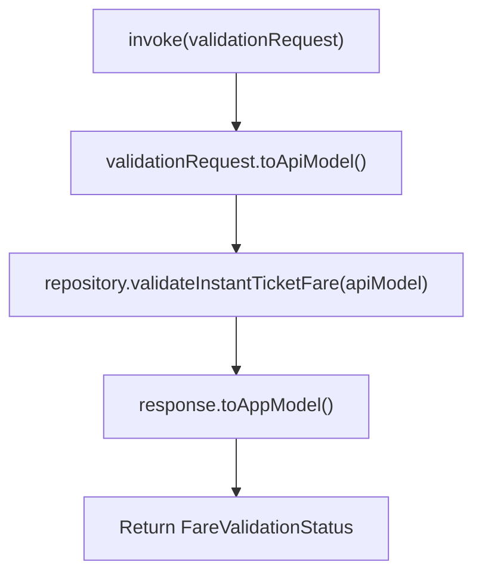

### Input Parameters

| Parameter | Type | Description |
|-----------|------|-------------|
| `validationRequest` | ValidateInstantTicketFareRequestAppModel | Fare validation request |

### Validation Request Model

| Field | Type | Description |
|-------|------|-------------|
| `routeId` | String | Route identifier |
| `startStopId` | String | Origin stop |
| `endStopId` | String | Destination stop |
| `cityId` | String | City identifier |
| `configId` | String | Product config ID |
| `passengerDetails` | List | Selected passengers with counts |
| `expectedFare` | Long | Total amount user expects to pay |

### Validation Outcomes

The response maps to `FareValidationStatus`:

| Status | Description | UI Action |
|--------|-------------|-----------|
| `Valid` | Fare matches | Continue to order creation |
| `FareChanged` | New fare calculated | Show updated fare, require re-confirmation |
| `Invalid` | Cannot validate | Show error, retry |

---

## ValidateInstantTicketAmountUseCase

Validates a user-entered amount against the instant ticket configuration limits before proceeding to payment.

### Responsibility

This use case is used in the amount-based flow where users enter a fare amount directly. It checks whether the entered amount falls within the minimum and maximum fare limits defined in the instant ticket configuration.

### Dependencies

| Dependency | Type | Purpose |
|------------|------|---------|
| `cityProvider` | CityProvider | Current city for config lookup |
| `instantTicketConfigHelper` | InstantTicketConfigHelper | Fare limits configuration |

### Flow Diagram

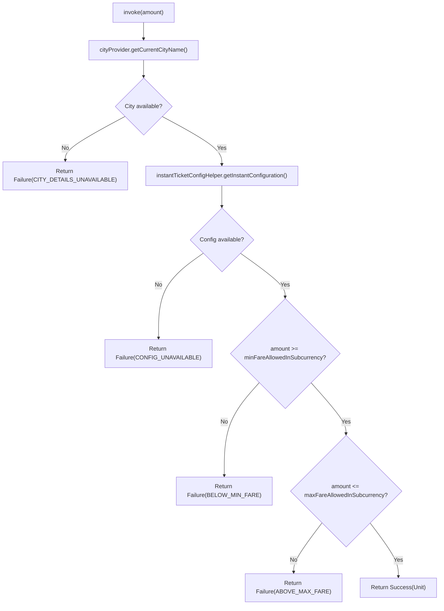

### Validation Errors

| Error | Condition | User Message |
|-------|-----------|--------------|
| `CITY_DETAILS_UNAVAILABLE` | No city selected | "Please select a city" |
| `CONFIG_UNAVAILABLE` | Config fetch failed | "Unable to load configuration" |
| `BELOW_MIN_FARE` | amount < minFareAllowedInSubcurrency | "Amount below minimum fare" |
| `ABOVE_MAX_FARE` | amount > maxFareAllowedInSubcurrency | "Amount exceeds maximum fare" |

---

## CreateInstantTicketOrderUseCase

Creates a new Instant Ticket order that proceeds to checkout.

### Responsibility

Orchestrates order creation by building the order request from selected route, stops, and passenger configuration. The use case delegates to the repository which calls the backend API and returns order details.

### Flow Diagram

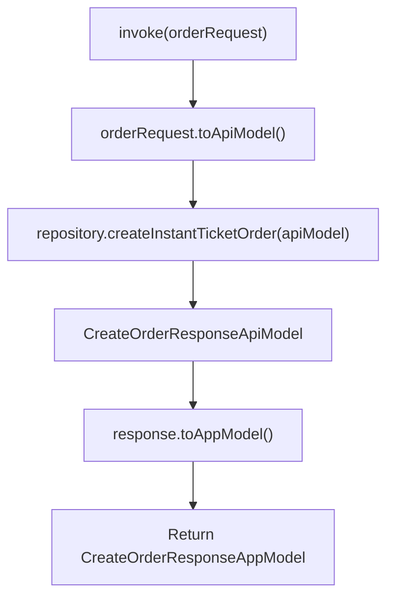

### Input Parameters

| Field | Type | Description |
|-------|------|-------------|
| `routeId` | String | Selected route |
| `startStopId` | String | Origin stop |
| `endStopId` | String | Destination stop |
| `cityId` | String | City identifier |
| `configId` | String | Product config ID |
| `passengerDetails` | List | Selected passengers with counts |
| `totalAmount` | Long | Total payable amount |
| `paymentMode` | String | WALLET or ONLINE |

### Output

| Field | Type | Description |
|-------|------|-------------|
| `orderId` | String | Created order ID for checkout |
| `amount` | Long | Order amount |
| `checkoutPayload` | String? | Additional checkout data |

### Order Creation Sequence

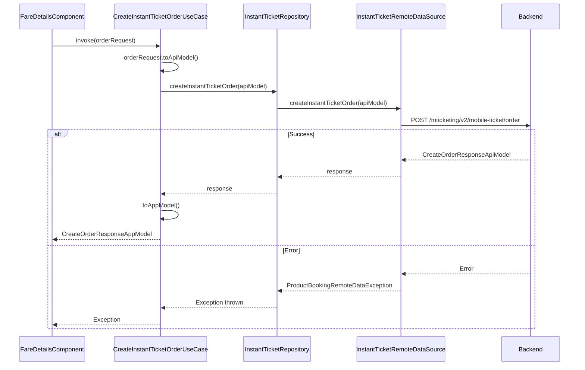

---

## FetchAndStoreInstantTicketReceiptUseCase

Fetches the ticket receipt from the backend and stores it locally for offline access.

### Responsibility

After a ticket is purchased, this use case retrieves the complete receipt details from the backend API and persists them to local storage. The receipt contains all information needed for display and validation.

### Flow Diagram

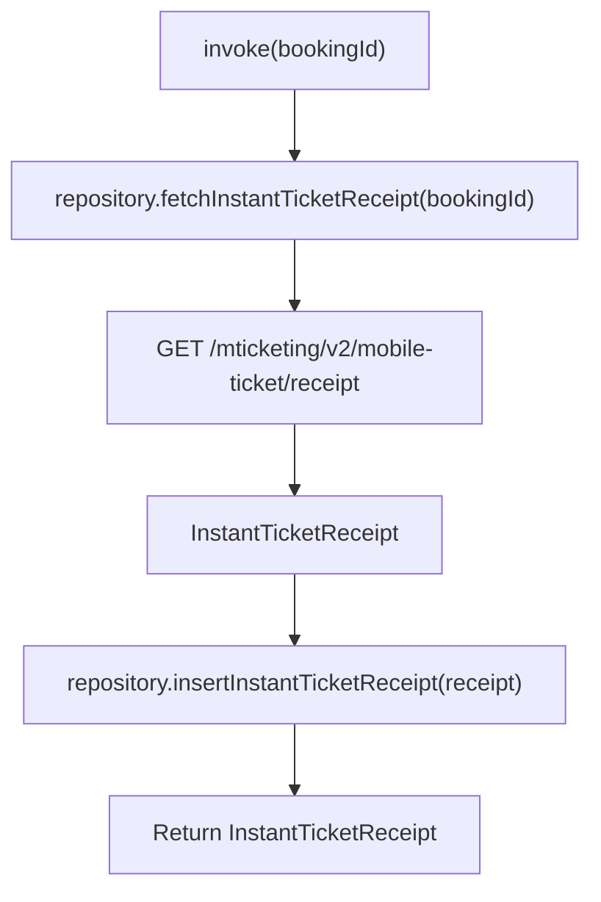

### Receipt Data Structure

The `InstantTicketReceipt` implements `ProductReceiptData`:

| Method | Returns |
|--------|---------|
| `getProductId()` | bookingId |
| `getProductSubType()` | "INSTANT_TICKET" |
| `getPunchTime()` | Activation timestamp |
| `getAmount()` | Ticket amount |
| `getVehicleNo()` | Vehicle number |
| `getConductorId()` | Conductor ID |
| `getStartStop()` | Origin stop name |
| `getEndStop()` | Destination stop name |
| `getRouteName()` | Route name |
| `getPassengerDetails()` | Map of passenger type to count |
| `getVia()` | Via stops (if applicable) |
| `getRouteNamingScheme()` | Route naming scheme type |

---

## InitiateInstantTicketFetchAndStoreUseCase

Fetches a ticket by its booking ID from the backend and stores it in local storage.

### Responsibility

This use case retrieves a specific ticket after order creation. It validates the response and stores the ticket entity locally, ensuring the ticket is available for display immediately after purchase.

### Flow Diagram

```mermaid
flowchart TD
    Start["invoke(bookingId)"]
    CallRepo["repository.fetchInstantTicketAndStore(bookingId)"]
    FetchRemote["GET /mticketing/v2/mobile-ticket/bookings"]
    GetFirst["response.mobileTicket.firstOrNull()"]
    CheckValid{ticket.isValid()?}
    Transform["toInstantTicketEntity()"]
    Store["localDataSource.insertInstantTicket(entity)"]
    Skip["Skip storage (invalid ticket)"]
    Done["Complete"]

    Start --> CallRepo
    CallRepo --> FetchRemote
    FetchRemote --> GetFirst
    GetFirst --> CheckValid
    CheckValid -->|Yes| Transform
    CheckValid -->|No| Skip
    Transform --> Store
    Store --> Done
    Skip --> Done
```

### Validation Logic

The `isValid()` check on the API response ensures:
- Required fields are present (bookingId, productName, status)
- Status is a valid `InstantTicketStatus` value
- Timestamps are reasonable

---

## UpdateInstantTicketEntryInTableOnTapOutUseCase

Updates a ticket's expiry time when the user taps out, effectively marking it as used.

### Responsibility

When a ticket is validated (tap-out event from BLE validation), this use case updates the ticket's activation expiry time to the current Chalo time, immediately expiring it. This prevents double validation.

### Dependencies

| Dependency | Type | Purpose |
|------------|------|---------|
| `instantTicketRepository` | InstantTicketRepository | Database update |
| `basicInfoContract` | BasicInfoContract | Chalo time source |

### Flow Diagram

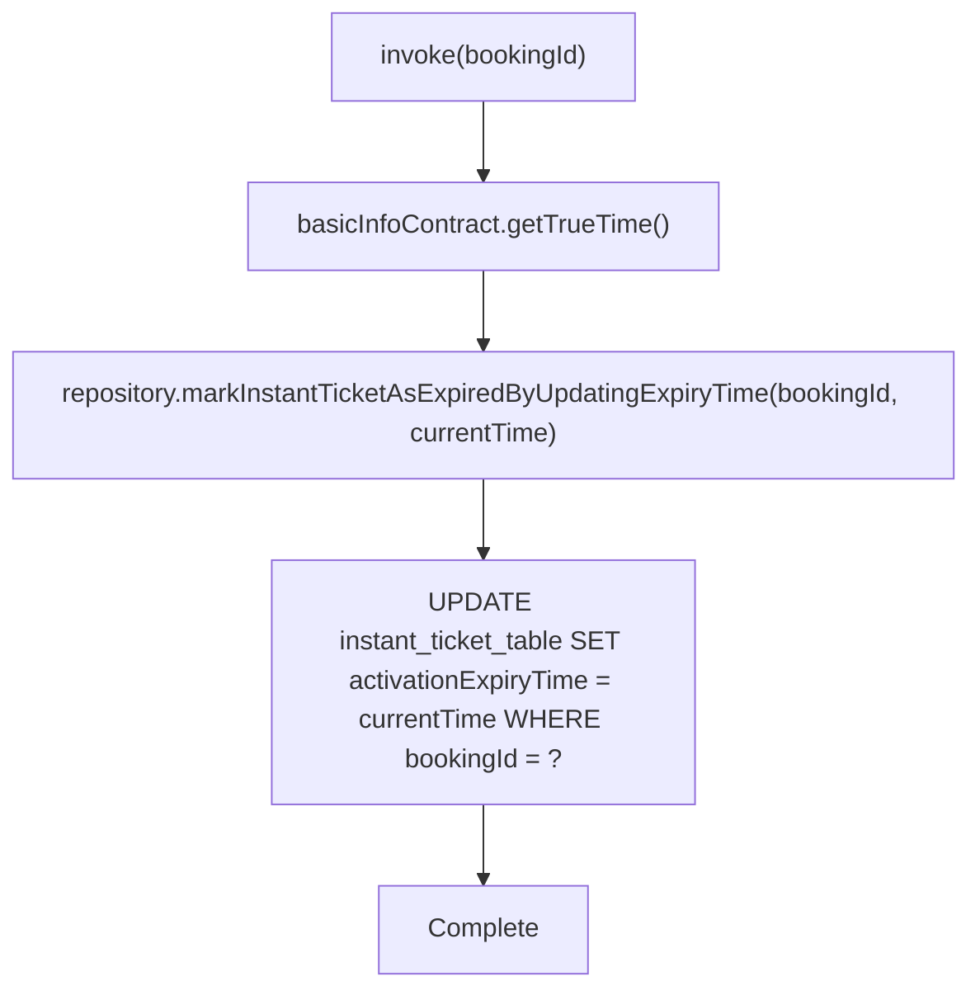

### Effect on Ticket State

After invocation:

| Check | Result |
|-------|--------|
| `isExpired(chaloTime)` | `true` (activationExpiryTime <= chaloTime) |
| `isActive(chaloTime)` | `false` |
| `isActiveOrPaymentProcessing(chaloTime)` | `false` |

This ensures the ticket shows as expired in the UI and cannot be validated again.

---

## ClearInstantTicketsDuringLogoutUseCase

Clears all locally stored instant tickets when the user logs out.

### Responsibility

Ensures user privacy by removing all cached ticket data from local storage during logout. Called as part of the logout flow to clean up user-specific data.

### Flow Diagram

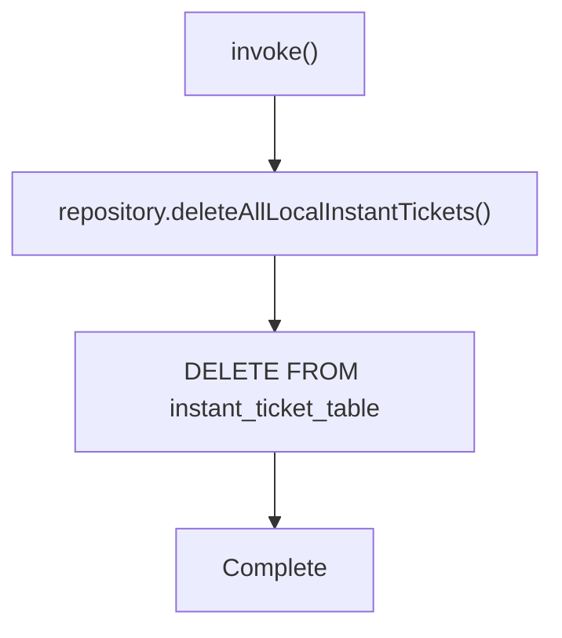

### Integration Point

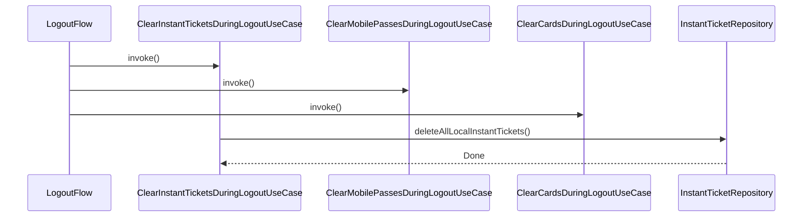

---

## Domain Models

### InstantTicketEntity

The primary domain model representing a stored instant ticket.

| Field | Type | Nullable | Description |
|-------|------|----------|-------------|
| `bookingId` | String | No | Primary key |
| `userId` | String | No | Owner user ID |
| `productName` | String | No | Display name |
| `bookingTime` | Long | No | Order creation timestamp |
| `amount` | Long | No | Ticket amount in paisa |
| `status` | InstantTicketStatus | No | Current status |
| `punchTime` | Long | Yes | Activation timestamp |
| `city` | String | No | City code (lowercase) |
| `qrCode` | String | Yes | QR data for validation |
| `tone` | String | Yes | Validation sound data |
| `activationExpiryTime` | Long | Yes | When ticket expires |
| `refundInfo` | RefundInfoEntityModel | Yes | Refund details if cancelled |

### Status Helper Methods

The entity provides computed status methods:

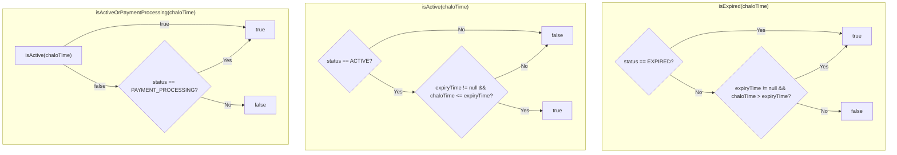

### InstantTicketStatus

| Status | Description | Terminal |
|--------|-------------|----------|
| `ACTIVE` | Valid for travel | No |
| `PAYMENT_PROCESSING` | Payment in progress | No |
| `PAYMENT_FAILED` | Payment unsuccessful | No |
| `EXPIRED` | Validity ended | Yes |
| `CANCELLED` | User/system cancelled | Yes |
| `FAILED` | System error | Yes |

### InstantTicketValidationModel

Model used for BLE validation integration, implementing `ProductValidationModel`:

| Field | Type | Description |
|-------|------|-------------|
| `status` | InstantTicketStatus | Ticket status |
| `transactionId` | String | Transaction reference |
| `paymentMode` | String | Payment method |
| `qrCode` | String? | QR validation data |
| `soundStaticTone` | String? | Validation sound |
| `expiryTime` | Long | Expiry timestamp |
| `activationDuration` | Long? | Validity duration |
| `amount` | Int | Ticket amount |
| `orderId` | String | Order/booking ID |
| `punchTime` | Long? | Activation time |
| `productName` | String | Product display name |
| `productType` | String | "INSTANT_TICKET" |
| `productSubType` | String | "INSTANT_TICKET" |

The model provides `getActivationTimestampMS()` calculated as:
```
expiryTime - (activationDuration ?: 0)
```

### Fare Response Models

#### PassengerDetailAppModel

| Field | Type | Description |
|-------|------|-------------|
| `passengerId` | PassengerId | Unique passenger type identifier |
| `name` | String | Display name for category |
| `actualFare` | Long | Original fare in paisa |
| `payableFare` | Long | Discounted fare in paisa |
| `isDiscountApplicable` | Boolean | Discount available |
| `discountPercentage` | Int? | Percentage discount |
| `discountCopy` | String? | Discount description |
| `fareBreakup` | List<FareBreakupAppModel> | Detailed fare components |
| `seatLimit` | SeatLimitAppModel | Min/max seats |

#### PassengerSelectionPolicy

| Policy | Behavior |
|--------|----------|
| `Multiple` | Select multiple passenger types with independent counts |
| `Single` | Select only one passenger type at a time |

#### FareBreakupAppModel

| Field | Type | Description |
|-------|------|-------------|
| `fareBreakupCopy` | String | Display text |
| `fareOperationType` | FareBreakupOperationType | How to apply |
| `fare` | Long | Amount in paisa |

#### FareBreakupOperationType

| Type | Code | Effect |
|------|------|--------|
| `ADDITION` | 0 | Add to total |
| `SUBTRACTION` | 1 | Subtract from total |
| `NO_OP` | -1 | Display only, no calculation |

---

## Business Rules

| Rule | Description | Enforcement |
|------|-------------|-------------|
| Fare validation required | Must validate before payment | ValidateInstantTicketFareUseCase |
| Amount limits | Min/max fare from config | ValidateInstantTicketAmountUseCase |
| Passenger limits | Min/max per type in seatLimit | FetchMobileTicketFareUseCase response |
| Single expiry on tap-out | Immediate expiry on validation | UpdateInstantTicketEntryInTableOnTapOutUseCase |
| City cluster filtering | Show tickets from city cluster | Repository getAllInstantTickets |
| User-specific tickets | Filter by userId | Repository queries |
| Logout data clearance | Remove all tickets on logout | ClearInstantTicketsDuringLogoutUseCase |

---

## Error Handling

### Error Type Mapping

| Exception | ProductBookingDataSourceError | User Message Pattern |
|-----------|-------------------------------|---------------------|
| `ChaloLocalException` | `.Local(message)` | Local error occurred |
| `ProductBookingRemoteDataException` | `.API(message, errorCode)` | Server error with code |
| `NetworkSuccessResponseParseException` | `.ResponseParsing` | Invalid server response |
| `InvalidFareResponseDataException` | `.InvalidData` | Invalid fare data |
| General Exception | `.Unknown(message)` | Unknown error |

### Analytics on Failure

All fare fetch failures raise analytics events with:

| Attribute | Value |
|-----------|-------|
| `ATTRIBUTE_TYPE` | Exception class name |
| `ATTRIBUTE_REASON` | Exception message |
| `INVALID_RESPONSE` | true if InvalidFareResponseDataException |

Event names by filter type:
- InstantTicketFilter: "instant ticket fare fetch failure"
- PremiumReserveTicketFilter: "premium reserve ticket fare fetch failure"
- OndcTicketFilter: "ondc ticket fare fetch failure"

---

## Sequence Diagrams

### Route-Based Purchase Flow

```mermaid
sequenceDiagram
    participant Route as RouteSelection
    participant Fare as FareDetailsComponent
    participant FetchFare as FetchMobileTicketFareUseCase
    participant Validate as ValidateInstantTicketFareUseCase
    participant Create as CreateInstantTicketOrderUseCase
    participant Checkout as CheckoutFlow

    Route->>Fare: Navigate with fareDetailsData
    Fare->>FetchFare: invoke(fareDetails, filter)
    FetchFare-->>Fare: FetchMobileTicketFareResponseAppModel

    Note over Fare: User selects passengers

    Fare->>Validate: invoke(validationRequest)
    Validate-->>Fare: FareValidationStatus

    alt Valid
        Fare->>Create: invoke(orderRequest)
        Create-->>Fare: CreateOrderResponseAppModel
        Fare->>Checkout: Navigate with orderId
    else FareChanged
        Fare->>Fare: Update UI with new fare
        Note over Fare: User must re-confirm
    end
```

### Ticket Lifecycle

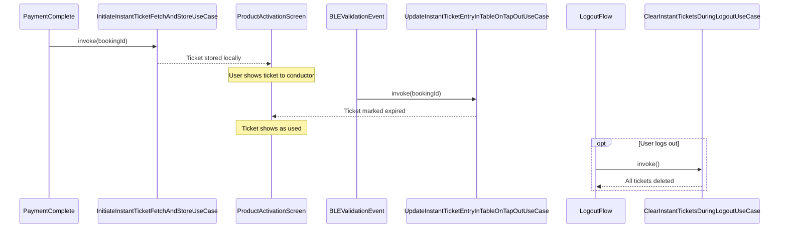
