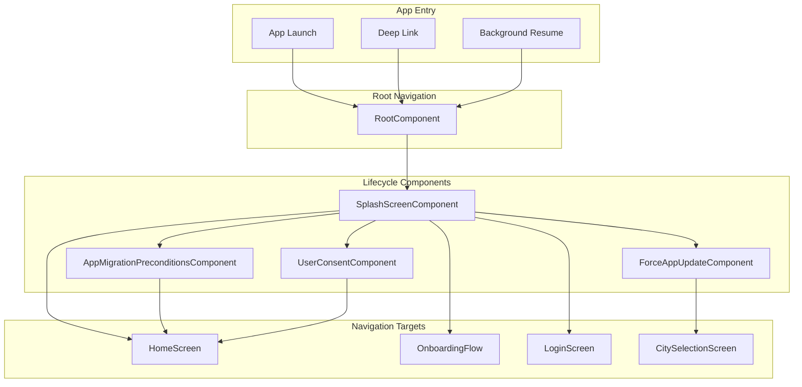
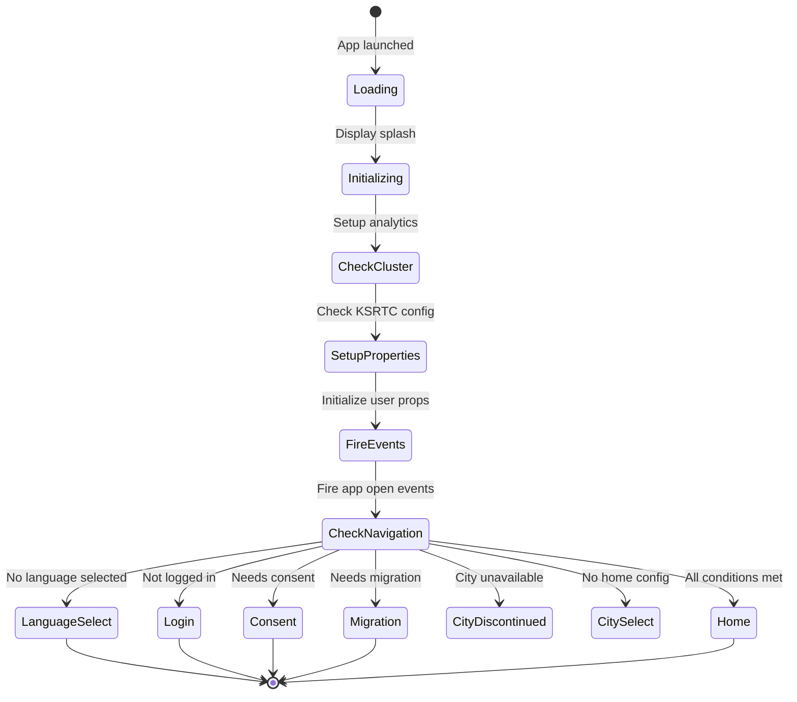
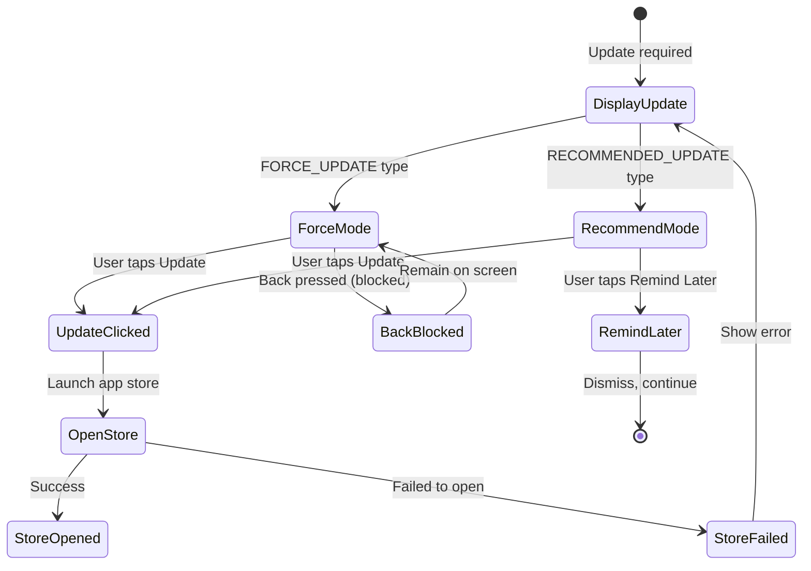
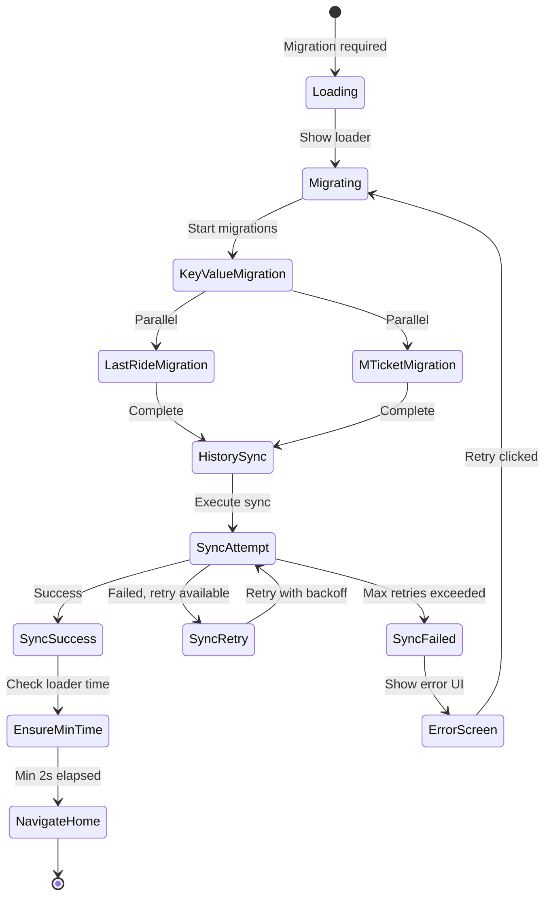

# App Lifecycle — Component Documentation

## Architecture Overview

The App Lifecycle presentation layer manages the application initialization sequence through a series of Decompose components. The splash screen orchestrates version checks, service initialization, and navigation decisions. Force update and migration components handle blocking flows that must complete before the main app experience.

---

## Screen Inventory

| Screen | Component | Purpose |
|--------|-----------|---------|
| **Splash** | SplashScreenComponent | App initialization and routing |
| **Force Update** | ForceAppUpdateComponent | Blocking update prompt |
| **Migration** | AppMigrationPreconditionsComponent | Data migration handling |
| **User Consent** | UserConsentComponent | DPDPA consent collection |

---

## Splash Screen

The splash component orchestrates the entire app initialization sequence, making critical routing decisions based on app state.

### User Journey

1. App launches, splash screen displays
2. Component initializes user properties and analytics
3. Checks KSRTC cluster configuration
4. Fires first screen open event
5. Sends unsynced activation timestamps
6. Evaluates navigation conditions
7. Routes to appropriate destination

### State Flow

### Initialization Sequence

| Step | Action | Description |
|------|--------|-------------|
| 1 | Check KSRTC config | Cluster-specific configuration |
| 2 | Initialize user properties | Device ID, notification permission |
| 3 | Set analytics properties | First seen timestamp |
| 4 | Setup analytics | Configure tracking |
| 5 | Fire first screen event | Once per session |
| 6 | Send activation timestamps | Sync pending data |
| 7 | Update app open time | If needed |

### Navigation Decision Logic

| Condition | Destination |
|-----------|-------------|
| **Language not selected** | LanguageSelectionScreen |
| **User not logged in** | LoginOptionsScreen |
| **Needs consent (post-login)** | UserConsentScreen |
| **Requires migration** | AppMigrationPreconditionsScreen |
| **City discontinued** | CityDiscontinuedScreen |
| **No home config** | CitySelectionScreen |
| **Default** | HomeScreen |

### Intents

| Intent | Trigger | Action |
|--------|---------|--------|
| **InitializationIntent** | Component created | Start init sequence |
| **NavigationDecisionIntent** | Init complete | Evaluate routing |

---

## Force App Update Screen

The force update component handles mandatory and recommended app update flows.

### User Journey

1. App version check detects outdated version
2. Update screen displays with message
3. For force updates, navigation is blocked
4. User taps "Update" to open store
5. For recommended, user can "Remind Later"

### State Flow

### View State Structure

| Field | Type | Description |
|-------|------|-------------|
| **updateType** | UpdateType | FORCE_UPDATE or RECOMMENDED_UPDATE |
| **currentVersion** | String | Installed version |
| **requiredVersion** | String | Minimum required |
| **updateMessage** | String | Display message |
| **canSkip** | Boolean | Allow dismiss (recommended only) |

### Update Types

| Type | Behavior |
|------|----------|
| **FORCE_UPDATE** | Blocks app, back button disabled |
| **RECOMMENDED_UPDATE** | Optional, "Remind Later" available |

### Intents

| Intent | Trigger | Action |
|--------|---------|--------|
| **UpdateButtonClickedIntent** | Update button tap | Open app store |
| **RemindLaterClickedIntent** | Remind button tap | Dismiss and continue |
| **BackPressedIntent** | Back button | Block for force, allow for recommended |

### Side Effects

| Effect | When Triggered | Result |
|--------|----------------|--------|
| **OpenAppStore** | Update clicked | Launch Play Store |
| **DismissScreen** | Remind later clicked | Continue to app |
| **TrackAnalytics** | Any interaction | Log event |

---

## App Migration Preconditions Screen

The migration component handles data migration from legacy (NonKMP) app versions to the KMP architecture.

### User Journey

1. App determines migration is required
2. Loading screen displays (minimum 2 seconds)
3. KeyValue store migrations run
4. Product history sync executes with retries
5. On success, navigate to home
6. On failure, show error with retry option

### State Flow

### View State Structure

| Field | Type | Description |
|-------|------|-------------|
| **isLoading** | Boolean | Show loading UI |
| **showError** | Boolean | Show error UI |
| **loadingTitle** | TextUIState | Loading title |
| **loadingDesc** | TextUIState | Loading description |
| **errorTitle** | TextUIState | Error title |
| **errorDesc** | TextUIState | Error description |
| **retryBtn** | ButtonUIState | Retry button state |

### Migration Operations

| Operation | Description |
|-----------|-------------|
| **LastRideInfo migration** | Migrate last ride data |
| **MTicketActivationStore migration** | Migrate ticket activation data |
| **Product history sync** | Sync all product data from server |

### Retry Strategy

| Property | Value |
|----------|-------|
| **Backoff pattern** | Circular exponential (2s → 4s → 8s, repeat) |
| **Max retries** | 15 attempts |
| **Timeout** | 120 seconds |
| **Minimum loader** | 2 seconds |

### Product History Sync Sections

| Section | Description |
|---------|-------------|
| **product_config** | Product configuration (required) |
| **proof_document** | Proof document properties |
| **pass_applications** | Pass application data |
| **pending_super_passes** | Pending super pass data |
| **single_journey_tickets** | Single journey ticket data |
| **mobile_tickets** | Mobile ticket data |
| **booked_rides** | Premium bus bookings |
| **reclaim_properties** | Reclaim-related data |

### Intents

| Intent | Trigger | Action |
|--------|---------|--------|
| **StartMigrationIntent** | Screen opened | Begin migration |
| **RetryClickedIntent** | Retry button tap | Restart migration |

### Side Effects

| Effect | When Triggered | Result |
|--------|----------------|--------|
| **NavigateToHome** | Migration success | Open home screen |
| **ShowErrorScreen** | Migration failed | Display error UI |
| **TrackMigrationEvent** | Status change | Log analytics |

---

## User Consent Screen

The consent component handles DPDPA (Digital Personal Data Protection Act) consent collection.

### User Journey

1. App determines consent is required (fresh login)
2. Consent screen displays
3. User reviews and accepts terms
4. Consent status saved
5. Navigate to next screen

### Consent Decision Flow

| Scenario | Action |
|----------|--------|
| **Fresh login** | Show consent required |
| **Return user** | Skip consent |
| **Post-login flag** | Defer to next session |

---

## Root Component Integration

The root component manages the navigation stack and creates lifecycle components.

### Child Types

| Child | Component | Purpose |
|-------|-----------|---------|
| **Splash** | SplashScreenComponent | Initial screen |
| **ForceAppUpdate** | ForceAppUpdateComponent | Update blocking |
| **AppMigrationPreconditions** | AppMigrationPreconditionsComponent | Migration handling |
| **UserConsent** | UserConsentComponent | Consent collection |

### Initial Stack

Default navigation stack begins with `[SplashArgs]` if empty.

---

## Analytics Events

| Event | Screen | Trigger |
|-------|--------|---------|
| **app_launched** | System | App process start |
| **splash_displayed** | Splash | Screen shown |
| **first_screen_open** | Splash | Once per session |
| **CHALO_TIME_AVAILABLE** | Splash | Time sync success |
| **CHALO_TIME_NOT_AVAILABLE** | Splash | Time sync failed |
| **CHALO_APP_UPDATED** | Splash | Version upgrade detected |
| **CHALO_APP_INSTALLED** | Splash | Fresh install detected |
| **APP_UPDATE_SCREEN_SHOWN** | Force Update | Screen displayed |
| **APP_UPDATE_BUTTON_CLICKED** | Force Update | Update tapped |
| **APP_UPDATE_POSTPONED** | Force Update | Remind later tapped |
| **FORCE_APP_UPDATE_BACK_PRESSED** | Force Update | Back attempted |
| **APP_MIGRATION_SCREEN_OPENED** | Migration | Screen displayed |
| **APP_MIGRATION_SCREEN_RETRY_CLICKED** | Migration | Retry tapped |
| **APP_MIGRATION_SCREEN_HISTORY_CALL_SUCCESS** | Migration | Sync success |
| **APP_MIGRATION_SCREEN_HISTORY_CALL_ERROR** | Migration | Sync failed |

---

## Error Handling

| Error Scenario | Screen | UI Response |
|----------------|--------|-------------|
| **Version check failed** | Splash | Use cached config |
| **Migration failed** | Migration | Show error with retry |
| **Store not available** | Force Update | Show manual instructions |
| **Network offline** | Splash | Proceed with cached data |
| **Session expired** | Splash | Redirect to login |
| **Consent fetch failed** | Consent | Retry or skip |
