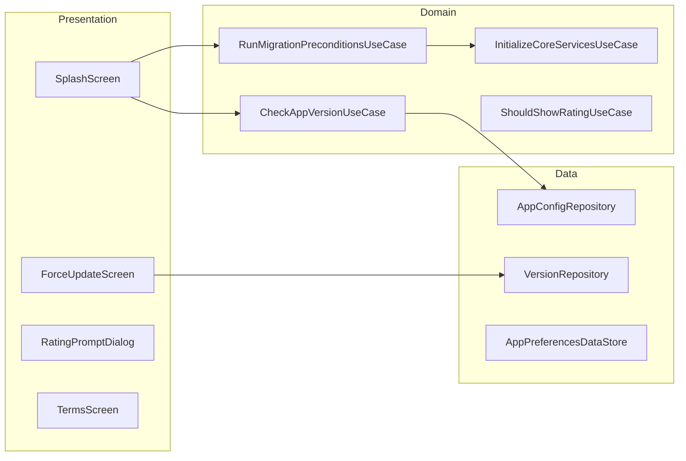

# App Lifecycle — High-Level Design

## Overview

The App Lifecycle feature handles application-level events including app launch, splash screen display, force updates, app ratings, sharing, and terms acceptance. It manages the app's initialization sequence, migration preconditions, and ensures users have the latest version when required.

## User Journey

1. **Entry Points**:
   - App launch → Splash screen
   - Background → Foreground transition
   - Deep link → App activation

2. **Core Flow**:
   - Display splash screen with branding
   - Check for force updates
   - Run migration preconditions
   - Initialize core services
   - Check terms acceptance
   - Navigate to appropriate screen

3. **Exit Points**:
   - Initialization complete → Home screen
   - Force update required → App store
   - Terms not accepted → Terms screen
   - Migration failed → Error screen

## Architecture Diagram



## Key Components

| Component | Platform | File Path | Responsibility |
|-----------|----------|-----------|----------------|
| `SplashComponent` | Shared | `shared/core/.../splash/SplashComponent.kt` | Splash orchestration |
| `AppUpdateComponent` | Shared | `shared/home/.../appUpdate/ui/AppUpdateComponent.kt` | Force update handling |
| `AppMigrationPreconditionsHelper` | Shared | `shared/home/.../appmigrationpreconditions/AppMigrationPreconditionsHelper.kt` | Migration logic |
| `CheckAppVersionUseCase` | Shared | `shared/core/.../domain/CheckAppVersionUseCase.kt` | Version validation |
| `AppConfigRepository` | Shared | `shared/core/.../data/AppConfigRepository.kt` | Remote config |

## Data Flow

### App Launch Sequence
1. App process starts
2. `SplashComponent` displays branding
3. `CheckAppVersionUseCase` validates app version
4. If force update needed → Show update screen
5. `RunMigrationPreconditionsUseCase` runs migrations
6. `InitializeCoreServicesUseCase` starts services
7. Check user session state
8. Navigate to Home or Onboarding

### Force Update Flow
1. `VersionRepository` fetches minimum version
2. Compare with current app version
3. If outdated → Block navigation
4. Display update dialog with store link
5. User updates or quits app

### Rating Prompt Flow
1. Track positive interactions (bookings, trips)
2. `ShouldShowRatingUseCase` evaluates criteria
3. If eligible → Show rating dialog
4. User rates → Open store or dismiss
5. Record response to prevent re-prompting

## Platform Differences

### Android-Specific
- In-app update API for flexible/immediate updates
- Google Play Store integration
- Android-specific splash screen API (Android 12+)
- Activity lifecycle handling

### iOS-Specific
- App Store redirect for updates
- iOS launch screen configuration
- SKStoreReviewController for ratings
- UIApplication lifecycle

## Integration Points

### Analytics Events
- See [Analytics: lifecycle](/analytics/flows/lifecycle) for event documentation
- Key events:
  - `app_launched`
  - `splash_displayed`
  - `force_update_shown`
  - `force_update_clicked`
  - `rating_prompt_shown`
  - `rating_submitted`
  - `app_shared`
  - `terms_accepted`

### Shared Services
- **Remote Config**: Version requirements, feature flags
- **Analytics**: Session tracking
- **Auth**: Session validation

### Navigation
- **Navigates to**: Home, Onboarding, Update screen, Terms
- **Navigated from**: App launch, Background resume

## Version Management

### AppVersionConfig
```kotlin
data class AppVersionConfig(
    val minimumVersion: String,
    val latestVersion: String,
    val updateType: UpdateType,
    val updateMessage: String?,
    val storeUrl: String
)

enum class UpdateType {
    NONE,           // No update needed
    FLEXIBLE,       // Optional update
    IMMEDIATE       // Force update required
}
```

### Version Comparison
```kotlin
fun shouldForceUpdate(
    currentVersion: String,
    minimumVersion: String
): Boolean {
    val current = parseVersion(currentVersion)
    val minimum = parseVersion(minimumVersion)
    return current < minimum
}
```

## Migration Preconditions

### MigrationPrecondition
```kotlin
sealed class MigrationPrecondition {
    object DatabaseMigration : MigrationPrecondition()
    object PreferencesMigration : MigrationPrecondition()
    object TokenRefresh : MigrationPrecondition()
    object CacheClear : MigrationPrecondition()
    data class Custom(val id: String) : MigrationPrecondition()
}
```

### Migration Result
```kotlin
sealed class MigrationResult {
    object Success : MigrationResult()
    data class PartialSuccess(val failed: List<MigrationPrecondition>) : MigrationResult()
    data class Failed(val error: Throwable) : MigrationResult()
}
```

## View State

### SplashState
```kotlin
sealed class SplashState {
    object Loading : SplashState()
    object CheckingVersion : SplashState()
    object RunningMigrations : SplashState()
    object InitializingServices : SplashState()
    data class ForceUpdateRequired(val config: AppVersionConfig) : SplashState()
    data class Error(val message: String) : SplashState()
    object Ready : SplashState()
}
```

### ForceUpdateState
```kotlin
data class ForceUpdateState(
    val currentVersion: String,
    val requiredVersion: String,
    val updateMessage: String,
    val storeUrl: String,
    val canSkip: Boolean
)
```

## Rating Logic

### Rating Criteria
```kotlin
data class RatingCriteria(
    val minCompletedTrips: Int = 3,
    val minDaysSinceInstall: Int = 7,
    val minDaysSinceLastPrompt: Int = 30,
    val hasNotRatedBefore: Boolean = true,
    val hasNoRecentNegativeExperience: Boolean = true
)
```

### Rating State
```kotlin
enum class RatingState {
    NOT_ELIGIBLE,
    ELIGIBLE,
    PROMPTED,
    RATED,
    DISMISSED
}
```

## Edge Cases & Error Handling

| Scenario | Handling |
|----------|----------|
| Version check failed | Uses cached config |
| Migration failed | Shows error with retry |
| Store not available | Shows manual update instructions |
| Network offline at launch | Proceeds with cached data |
| Session expired | Redirects to login |
| Terms changed | Shows updated terms |

## App Sharing

### ShareContent
```kotlin
data class ShareContent(
    val title: String,
    val message: String,
    val appStoreUrl: String,
    val referralCode: String?
)
```

### Share Flow
1. User taps share button
2. Generate share content with referral
3. Open system share sheet
4. Track share completion

## Initialization Sequence

### Service Initialization Order
```kotlin
val initializationOrder = listOf(
    "crash_reporting",      // First for error capture
    "analytics",            // Session tracking
    "remote_config",        // Feature flags
    "authentication",       // Session validation
    "notifications",        // FCM token
    "location",             // GPS services
    "city_data"             // Local data sync
)
```

## Dependencies

### Internal
- `shared:core` — Splash and version logic
- `shared:home` — Update screens
- `shared:login` — Session management
- `shared:onboarding` — First-time setup

### External
- Firebase Remote Config — Version config
- Firebase Crashlytics — Crash reporting
- Play Core (Android) — In-app updates
- DataStore — Preferences storage
