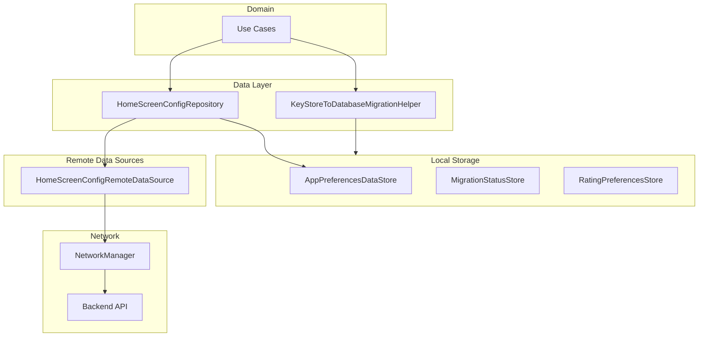
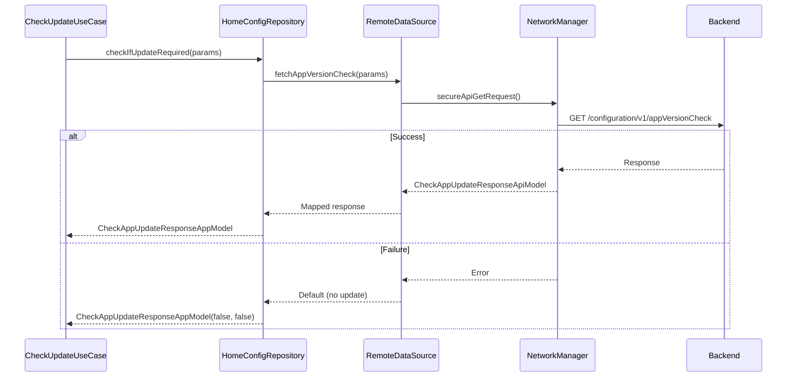
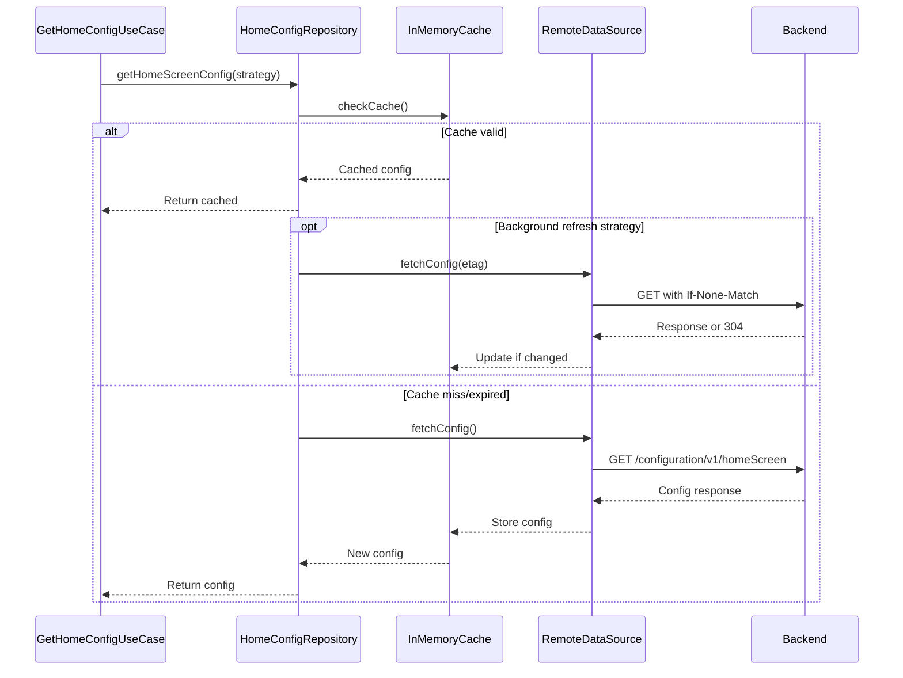
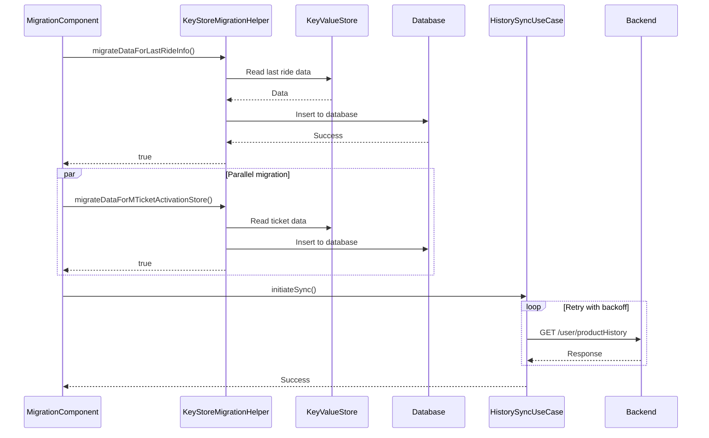
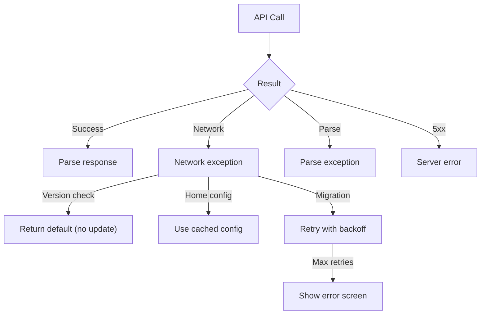

# App Lifecycle — Repository Documentation

## Data Layer Overview

The App Lifecycle data layer manages app configuration, version checking, and migration state persistence. The layer coordinates with remote data sources for version requirements and home screen configuration, while local data stores handle preferences, migration status, and rating state.

---

## Repository Interfaces

### IHomeScreenConfigRepository

| Method | Purpose | Returns |
|--------|---------|---------|
| **checkIfUpdateRequired** | Check app version status | CheckAppUpdateResponseAppModel |
| **getHomeScreenConfig** | Fetch home configuration | HomeScreenConfigAppModel |

### KeyStoreToDatabaseMigrationHelper

| Method | Purpose | Returns |
|--------|---------|---------|
| **migrateDataForLastRideInfo** | Migrate last ride data | Boolean |
| **migrateDataForMTicketActivationStore** | Migrate ticket data | Boolean |

---

## API Endpoints

### Check App Version

Validates current app version against requirements.

| Property | Value |
|----------|-------|
| **Endpoint** | GET /configuration/v1/appVersionCheck |
| **Auth** | Required |

**Query Parameters**

| Parameter | Type | Description |
|-----------|------|-------------|
| **appVersionCode** | Int | Current app version code |
| **userId** | String | User identifier |

**Response: CheckAppUpdateResponseApiModel**

| Field | Type | Description |
|-------|------|-------------|
| **forceUpdate** | Boolean | Mandatory update required |
| **recommendedUpdate** | Boolean | Optional update available |

---

### Get Home Screen Config

Fetches home screen configuration with ETag support.

| Property | Value |
|----------|-------|
| **Endpoint** | GET /configuration/v1/homeScreen |
| **Auth** | Required |

**Headers**

| Header | Description |
|--------|-------------|
| **If-None-Match** | Previous ETag for conditional request |

**Response: HomeScreenConfigApiModel**

| Field | Type | Description |
|-------|------|-------------|
| **tabs** | List<TabConfig> | Home tabs configuration |
| **cards** | List<CardConfig> | Home cards configuration |
| **features** | FeatureFlagsConfig | Feature flags |

---

### Product History Sync

Synchronizes product history during migration.

| Property | Value |
|----------|-------|
| **Endpoint** | GET /user/productHistory |
| **Auth** | Required |

**Response Sections**

| Section | Description |
|---------|-------------|
| **product_config** | Product configuration |
| **proof_documents** | Proof document data |
| **pass_applications** | Pass applications |
| **pending_super_passes** | Pending passes |
| **single_journey_tickets** | SJT data |
| **mobile_tickets** | M-Ticket data |
| **booked_rides** | Premium bus bookings |
| **reclaim_properties** | Reclaim data |

---

## Data Flow Diagrams

### Version Check Flow

### Home Config Flow

### Migration Flow

---

## Local Storage

### App Preferences DataStore

| Key | Type | Description |
|-----|------|-------------|
| **firstSeenTimestamp** | Long | First app launch time |
| **lastAppVersion** | Int | Previous app version |
| **appSessionCount** | Int | Session counter |
| **lastAppOpenTime** | Long | Last app open timestamp |
| **languageSelected** | Boolean | Language selection status |
| **selectedCityId** | String? | Current city ID |

### Migration Status Store

| Key | Type | Description |
|-----|------|-------------|
| **migrationCompleted** | Boolean | Migration done flag |
| **historyCallCompleted** | Boolean | History sync done |
| **lastMigrationAttempt** | Long | Last attempt timestamp |
| **migrationErrors** | String? | Error details JSON |

### Rating Preferences Store

| Key | Type | Description |
|-----|------|-------------|
| **lastRatingPromptTime** | Long | Last prompt timestamp |
| **hasRated** | Boolean | User has rated |
| **completedTripsCount** | Int | Trip counter for eligibility |
| **ratingDismissCount** | Int | Dismiss counter |

---

## Application Initialization Manager

The ApplicationInitManager coordinates service initialization at app startup.

### Initialization Steps

| Step | Service | Description |
|------|---------|-------------|
| 1 | **Crashlytics** | Initialize crash reporting |
| 2 | **Analytics** | Setup analytics tracking |
| 3 | **City recovery** | Recover incomplete city changes |
| 4 | **Plotline** | Initialize notification SDK |
| 5 | **GCM Receiver** | Setup push notifications |
| 6 | **Chalo Time** | Validate time cache |
| 7 | **Background workers** | Initialize background tasks |
| 8 | **FreshChat** | Setup support SDK |

---

## Data Models

### CheckAppUpdateResponseAppModel

| Field | Type | Default | Description |
|-------|------|---------|-------------|
| **forceUpdate** | Boolean | false | Mandatory update |
| **recommendedUpdate** | Boolean | false | Optional update |

### HomeScreenConfigAppModel

| Field | Type | Description |
|-------|------|-------------|
| **tabs** | List<TabConfigAppModel> | Tab configurations |
| **cards** | List<CardConfigAppModel> | Card configurations |
| **features** | FeatureFlagsAppModel | Feature flags |
| **etag** | String? | ETag for caching |

### MigrationState

| Field | Type | Description |
|-------|------|-------------|
| **isLoading** | Boolean | Loading indicator |
| **showError** | Boolean | Error state |
| **errorType** | ErrorType? | Error classification |
| **retryCount** | Int | Current retry count |

---

## Cache Configuration

### Home Screen Config Cache

| Property | Value |
|----------|-------|
| **Cache level** | In-memory (session) |
| **ETag support** | Yes |
| **Thread safety** | Mutex-protected |
| **Background refresh** | Supported |

### Cache Strategies

| Strategy | Behavior |
|----------|----------|
| **BYPASS_REFRESH_IF_CACHED** | Return cache, skip API |
| **RETURN_CACHED_REFRESH_BACKGROUND** | Return cache, refresh async |

---

## Error Handling

### Error Flow

### Error Fallbacks

| Operation | Error | Fallback |
|-----------|-------|----------|
| **Version check** | Network/API error | Default to no update required |
| **Home config** | Network/API error | Use cached configuration |
| **Migration sync** | Network/API error | Retry with exponential backoff |
| **Migration sync** | Max retries | Show error screen with manual retry |

---

## Dependency Injection

### Module Bindings

| Interface | Implementation |
|-----------|----------------|
| IHomeScreenConfigRepository | HomeScreenConfigRepository |
| IHomeScreenConfigRemoteDataSource | HomeScreenConfigRemoteDataSourceImpl |
| KeyStoreToDatabaseMigrationHelper | KeyStoreToDatabaseMigrationHelperImpl |
| MandatoryFirstHistoryCallGuard | MandatoryFirstHistoryCallGuardImpl |
| AppRatingProcessManager | AppRatingProcessManagerAndroid (Android) |
| DpdpaConsentManager | DpdpaConsentManagerImpl |

---

## Network Configuration

### Headers

| Header | Value |
|--------|-------|
| Authorization | Bearer {token} |
| Content-Type | application/json |
| X-Platform | android/ios |
| X-App-Version | {version} |
| If-None-Match | {etag} (for config) |

### Timeouts

| Operation | Timeout |
|-----------|---------|
| Version check | 15s |
| Home config | 30s |
| History sync | 60s |

### Retry Policy

| Operation | Retries | Backoff |
|-----------|---------|---------|
| Version check | 1 | None (use default) |
| Home config | 2 | Linear |
| Migration sync | 15 | Circular exponential (2s, 4s, 8s) |

---

## Platform-Specific Implementation

### Android App Rating

| Component | Description |
|-----------|-------------|
| **ReviewManager** | Google Play Core in-app review |
| **ReviewInfo** | Review flow info object |
| **Fallback** | Play Store direct link |

### Android Configuration

| Property | Source |
|----------|--------|
| **App version** | BuildConfig.VERSION_CODE |
| **Version name** | BuildConfig.VERSION_NAME |
| **Store URL** | Play Store deep link |

### iOS Configuration

| Property | Source |
|----------|--------|
| **App version** | Bundle.main.infoDictionary |
| **Store URL** | App Store link |
| **Rating** | SKStoreReviewController |

---

## Analytics Integration

### Tracked Events

| Event | Trigger | Properties |
|-------|---------|------------|
| **app_version_check** | Version API called | result, version |
| **home_config_fetch** | Config API called | cached, etag_match |
| **migration_started** | Migration begins | - |
| **migration_completed** | Migration success | duration |
| **migration_failed** | Migration error | error_type, retry_count |
| **in_app_rating_shown** | Rating dialog shown | source |
| **in_app_rating_failed** | Rating flow error | error |
| **play_store_opened** | Store redirect | source |
