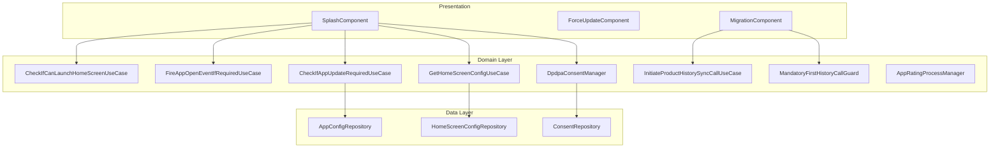
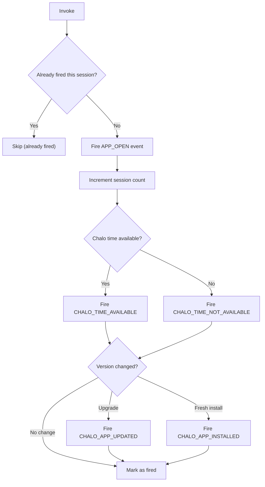
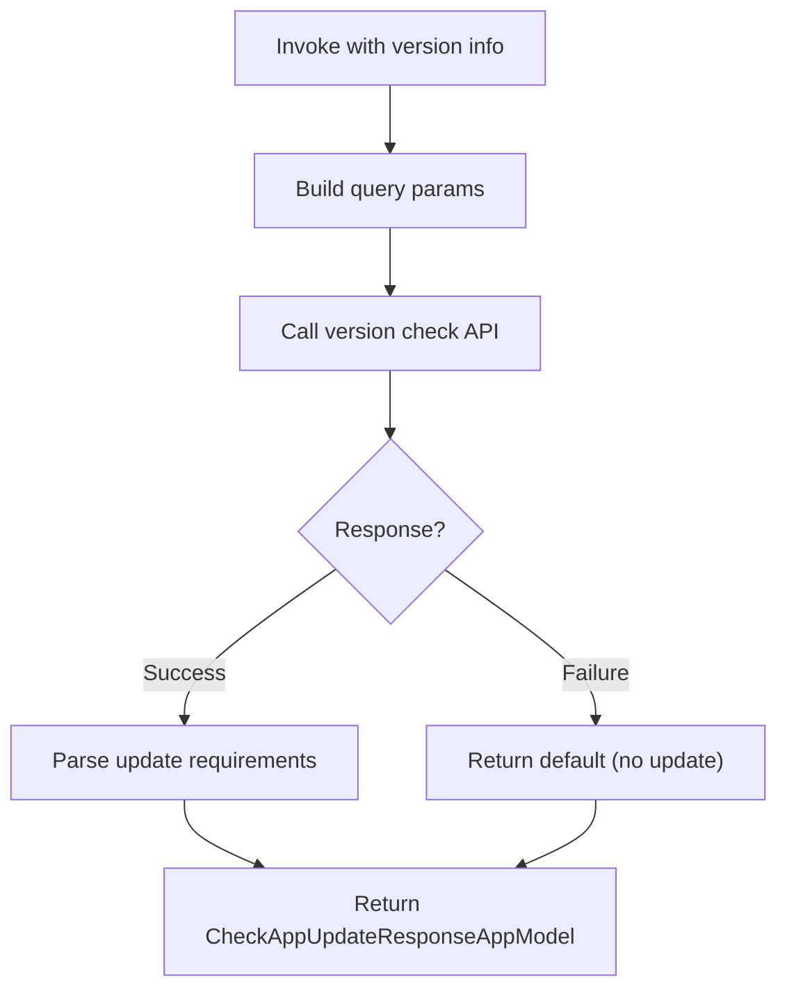
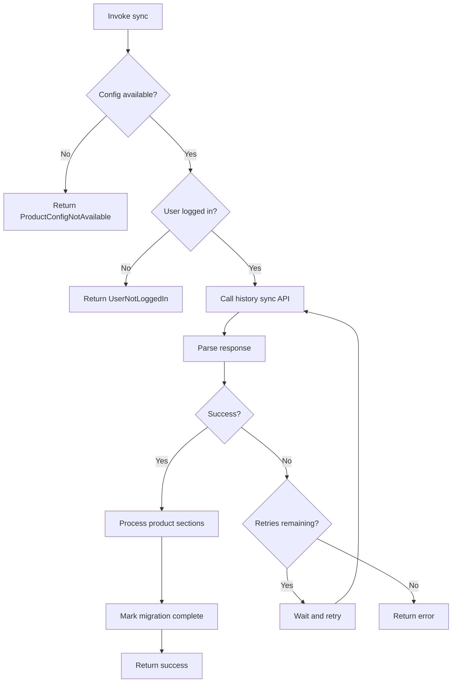
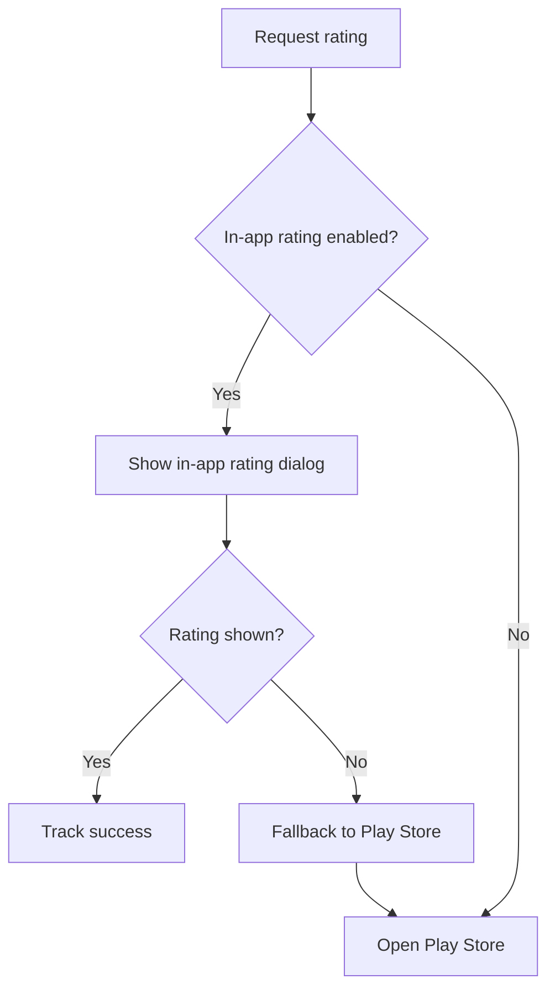
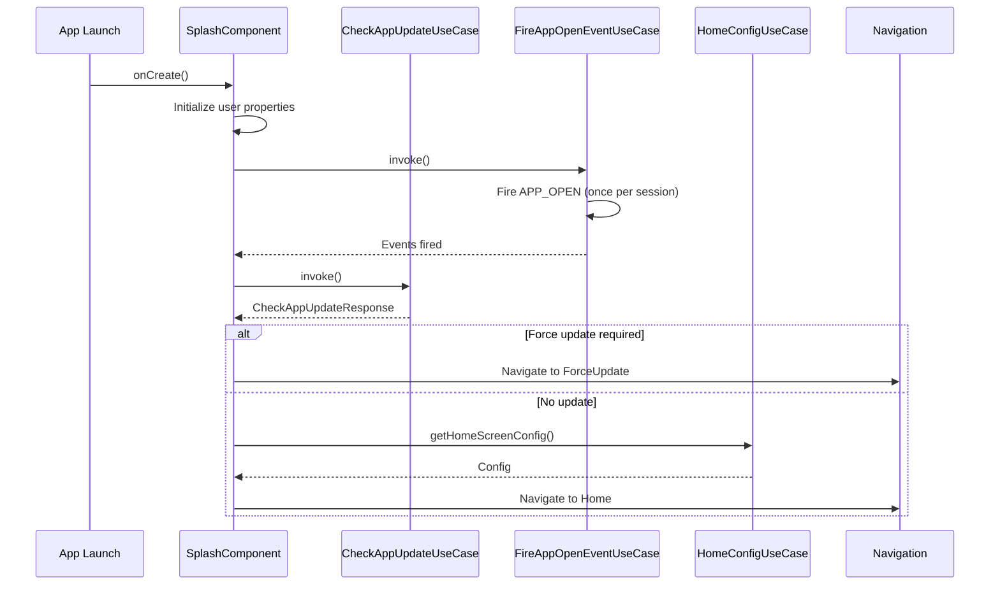
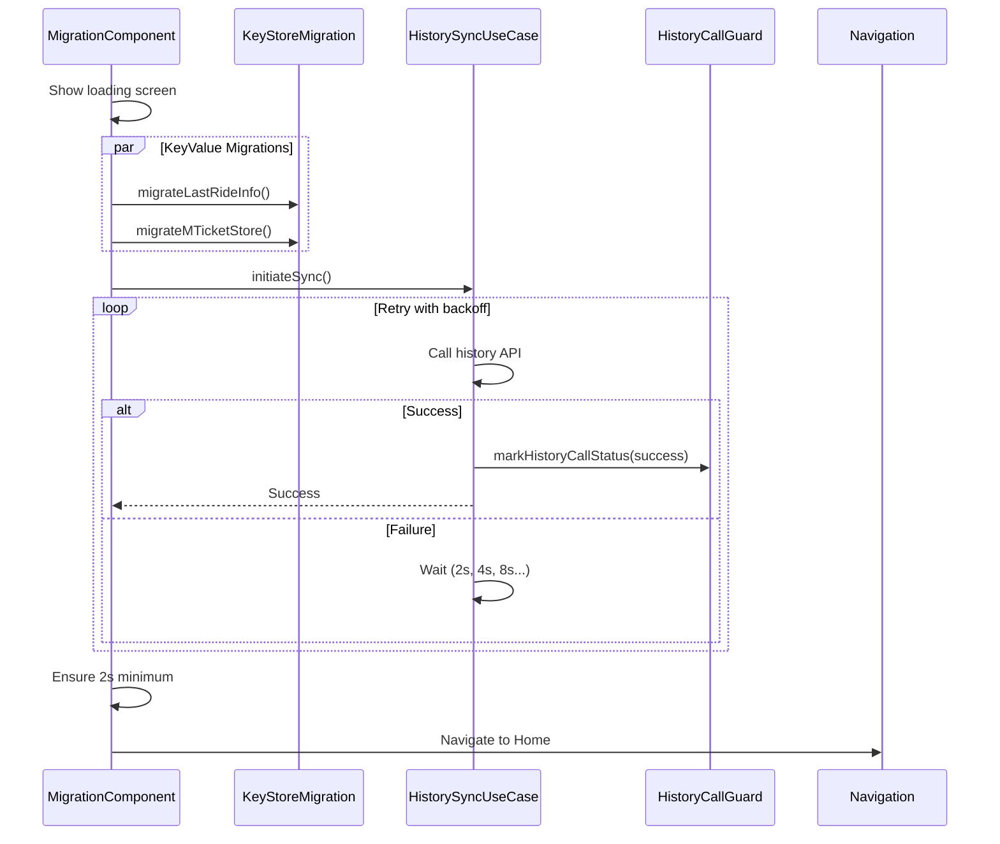

# App Lifecycle — UseCase Documentation

## Domain Layer Overview

The App Lifecycle domain layer orchestrates application initialization, version management, data migration, and user consent flows. Use cases coordinate between presentation components and data repositories to ensure proper app startup sequence, enforce update requirements, and manage migration preconditions.

---

## UseCase Inventory

| UseCase | Layer | Purpose |
|---------|-------|---------|
| **CheckIfCanLaunchHomeScreenUseCase** | Domain | Verify home screen preconditions |
| **FireAppOpenEventIfRequiredUseCase** | Domain | Fire session start analytics |
| **CheckIfAppUpdateRequiredUseCase** | Domain | Check app version status |
| **InitiateProductHistorySyncCallUseCase** | Domain | Run product history migration |
| **MandatoryFirstHistoryCallGuard** | Domain | Track migration status |
| **GetHomeScreenConfigUseCase** | Domain | Fetch home screen configuration |
| **DpdpaConsentManager** | Domain | Handle user consent flows |
| **AppRatingProcessManager** | Domain | Manage app rating prompts |

---

## CheckIfCanLaunchHomeScreenUseCase

Verifies that all preconditions are met before launching the home screen.

### Responsibility

Checks if required metadata is cached and home screen configuration is available. Returns boolean indicating readiness.

### Preconditions Checked

| Condition | Description |
|-----------|-------------|
| **Metadata cached** | Core app metadata available locally |
| **Home config available** | Home screen configuration loaded |

### Input

None

### Output

| Type | Description |
|------|-------------|
| **Boolean** | Can launch home screen |

---

## FireAppOpenEventIfRequiredUseCase

Fires app open analytics event and related session tracking once per app session.

### Responsibility

Manages session-level analytics including app open events, session counting, time availability checks, and app update/install detection. Ensures events fire only once per session.

### Flow Diagram

### Events Fired

| Event | Condition | Description |
|-------|-----------|-------------|
| **APP_OPEN** | Once per session | Session start marker |
| **APP_SESSION_COUNT** | Always | Incremented counter |
| **CHALO_TIME_AVAILABLE** | Time synced | Server time available |
| **CHALO_TIME_NOT_AVAILABLE** | Time not synced | Server time unavailable |
| **CHALO_APP_UPDATED** | Version increased | App was updated |
| **CHALO_APP_INSTALLED** | No previous version | Fresh installation |

---

## CheckIfAppUpdateRequiredUseCase

Checks if the installed app version meets minimum requirements.

### Responsibility

Calls the version check API with current app version and user ID. Returns update requirements including force update or recommended update flags.

### Flow Diagram

### Input Parameters

| Parameter | Type | Description |
|-----------|------|-------------|
| **appVersionCode** | Int | Current app version code |
| **userId** | String | User identifier |

### Output

| Type | Description |
|------|-------------|
| **CheckAppUpdateResponseAppModel** | Update requirements |

### Response Fields

| Field | Type | Description |
|-------|------|-------------|
| **forceUpdate** | Boolean | Mandatory update required |
| **recommendedUpdate** | Boolean | Optional update available |

---

## InitiateProductHistorySyncCallUseCase

Executes the mandatory product history synchronization during app migration.

### Responsibility

Synchronizes all product data sections from the server. Used during NonKMP to KMP migration. Implements retry logic with exponential backoff.

### Flow Diagram

### Product Sections Processed

| Section | Priority | Description |
|---------|----------|-------------|
| **product_config** | Required | Core product configuration |
| **proof_document** | Optional | Proof document properties |
| **pass_applications** | Optional | Pass application data |
| **pending_super_passes** | Optional | Pending pass data |
| **single_journey_tickets** | Optional | SJT data |
| **mobile_tickets** | Optional | M-Ticket data |
| **booked_rides** | Optional | Premium bus bookings |
| **reclaim_properties** | Optional | Reclaim data |

### Success Criteria

Sync succeeds if:
- `product_config` section succeeds
- At least one other core section succeeds

### Error Types

| Error | Cause |
|-------|-------|
| **ProductConfigNotAvailable** | Config fetch failed |
| **MTicketDetailsNotAvailable** | M-Ticket data unavailable |
| **ResponseParsing** | Parse error |
| **API** | API call failed |
| **UserNotLoggedIn** | No authenticated user |
| **Unknown** | Unexpected error |

---

## MandatoryFirstHistoryCallGuard

Tracks whether the mandatory history sync call has been completed.

### Responsibility

Interface for checking and marking the mandatory history call status. Used to determine if migration has completed.

### Methods

| Method | Purpose | Returns |
|--------|---------|---------|
| **requireMandatoryHistoryCall** | Check if call needed | Boolean |
| **markHistoryCallStatus** | Mark call complete | Unit |

---

## GetHomeScreenConfigUseCase

Fetches and caches home screen configuration with session-level caching.

### Responsibility

Manages home screen config retrieval with multiple cache strategies. Supports ETag-based updates and background refresh.

### Cache Strategies

| Strategy | Behavior |
|----------|----------|
| **BYPASS_REFRESH_IF_CACHED** | Return cached if available, skip refresh |
| **RETURN_CACHED_REFRESH_BACKGROUND** | Return cached, refresh in background for next session |

### Thread Safety

Uses Mutex for thread-safe cache access.

---

## DpdpaConsentManager

Handles DPDPA (Digital Personal Data Protection Act) user consent flows.

### Responsibility

Manages user consent status fetching, updating, and determining when to show consent screens.

### Methods

| Method | Purpose | Returns |
|--------|---------|---------|
| **fetchUserConsentStatus** | Get current consent status | ConsentInfo |
| **updateUserConsentStatus** | Save user consent | Unit |
| **shouldRequestConsentAfterSplashScreen** | Check if consent needed | Boolean |

### Cache Status

| Status | Description |
|--------|-------------|
| **NOT_CACHED_IN_MEMORY** | No cache available |
| **EXPIRED** | Cache expired |
| **VALID** | Cache still valid |

---

## AppRatingProcessManager

Manages in-app rating prompts and Play Store redirects.

### Responsibility

Determines when to show rating prompts, handles in-app rating flows, and falls back to Play Store when needed.

### Methods

| Method | Purpose |
|--------|---------|
| **requestAppRating** | Show in-app rating prompt |
| **launchPlayAppStore** | Open Play Store for rating |

### Flow Diagram

### Rating Criteria

| Criteria | Default | Description |
|----------|---------|-------------|
| **minCompletedTrips** | 3 | Minimum completed trips |
| **minDaysSinceInstall** | 7 | Days since installation |
| **minDaysSinceLastPrompt** | 30 | Days since last prompt |
| **hasNotRatedBefore** | true | First-time rating |
| **hasNoRecentNegativeExperience** | true | No recent issues |

### Rating States

| State | Description |
|-------|-------------|
| **NOT_ELIGIBLE** | Criteria not met |
| **ELIGIBLE** | Ready to prompt |
| **PROMPTED** | Dialog shown |
| **RATED** | User rated |
| **DISMISSED** | User dismissed |

---

## Domain Models

### AppVersionConfig

| Field | Type | Description |
|-------|------|-------------|
| **minimumVersion** | String | Minimum required version |
| **latestVersion** | String | Latest available version |
| **updateType** | UpdateType | NONE, FLEXIBLE, IMMEDIATE |
| **updateMessage** | String? | Custom update message |
| **storeUrl** | String | App store URL |

### UpdateType

| Type | Description |
|------|-------------|
| **NONE** | No update needed |
| **FLEXIBLE** | Optional update (recommended) |
| **IMMEDIATE** | Force update required |

### MigrationPrecondition

| Type | Description |
|------|-------------|
| **DatabaseMigration** | Database schema migration |
| **PreferencesMigration** | SharedPrefs migration |
| **TokenRefresh** | Auth token refresh |
| **CacheClear** | Clear old caches |
| **Custom** | Custom migration with ID |

### MigrationResult

| Type | Description |
|------|-------------|
| **Success** | All migrations completed |
| **PartialSuccess** | Some migrations failed |
| **Failed** | Migration failed with error |

### ProductHistorySyncErrorType

| Type | Description |
|------|-------------|
| **ProductConfigNotAvailable** | Config unavailable |
| **MTicketDetailsNotAvailable** | M-Ticket data missing |
| **ResponseParsing** | Parse error |
| **API** | API failure |
| **UserNotLoggedIn** | No authenticated user |
| **Unknown** | Unexpected error |

---

## Initialization Sequence

### Service Initialization Order

| Order | Service | Description |
|-------|---------|-------------|
| 1 | **crash_reporting** | First for error capture |
| 2 | **analytics** | Session tracking |
| 3 | **remote_config** | Feature flags |
| 4 | **authentication** | Session validation |
| 5 | **notifications** | FCM token |
| 6 | **location** | GPS services |
| 7 | **city_data** | Local data sync |

---

## Business Rules

| Rule | Description | Enforcement |
|------|-------------|-------------|
| **Single session event** | APP_OPEN fires once per session | FireAppOpenEventUseCase |
| **Migration minimum time** | 2-second minimum loader display | MigrationComponent |
| **Migration retry limit** | Max 15 retries or 120s timeout | HistorySyncUseCase |
| **Consent on fresh login** | Consent required for new logins | ConsentManager |
| **Rating eligibility** | Must meet all criteria | RatingManager |

---

## Sequence Diagrams

### App Launch Sequence

### Migration Flow

---

## Error Handling

| Error | Cause | Handling |
|-------|-------|----------|
| **Version check failed** | Network error | Use cached config |
| **Migration failed** | Sync error | Show retry button |
| **Store unavailable** | Play Store error | Show manual instructions |
| **Consent fetch failed** | Network error | Retry or skip |
| **Rating flow failed** | SDK error | Fallback to Play Store |
