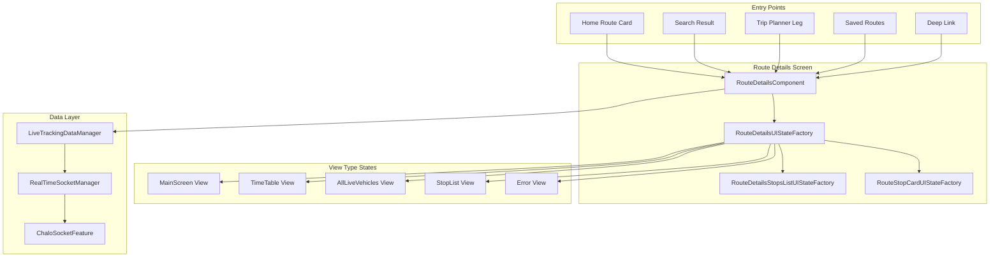
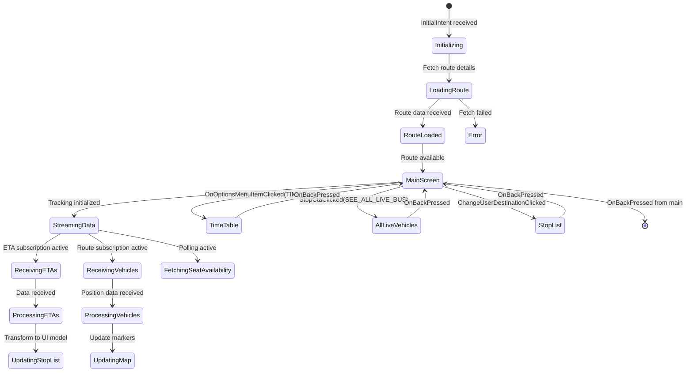
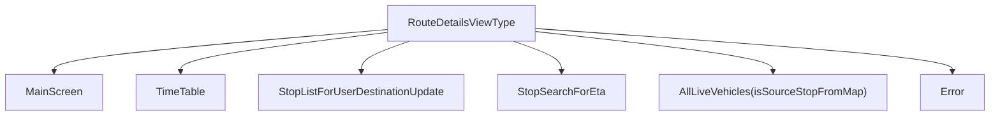
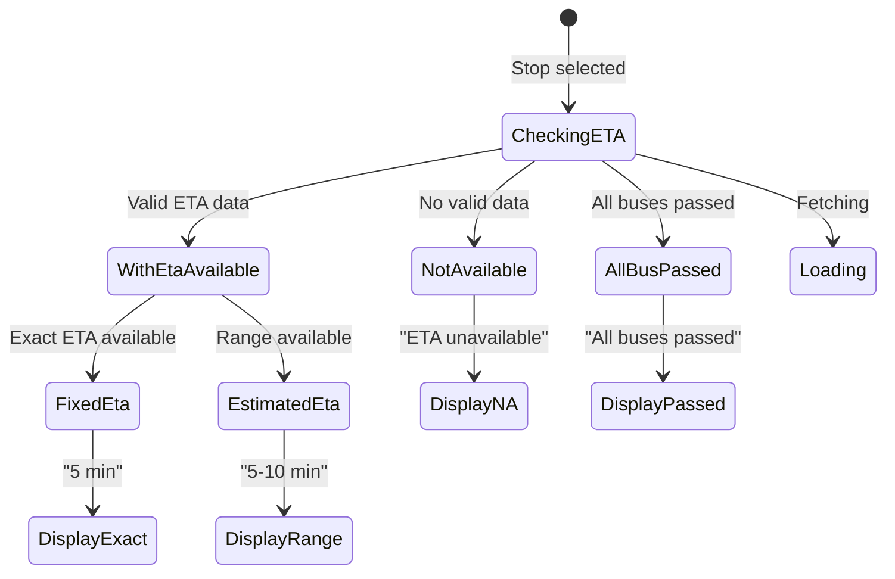
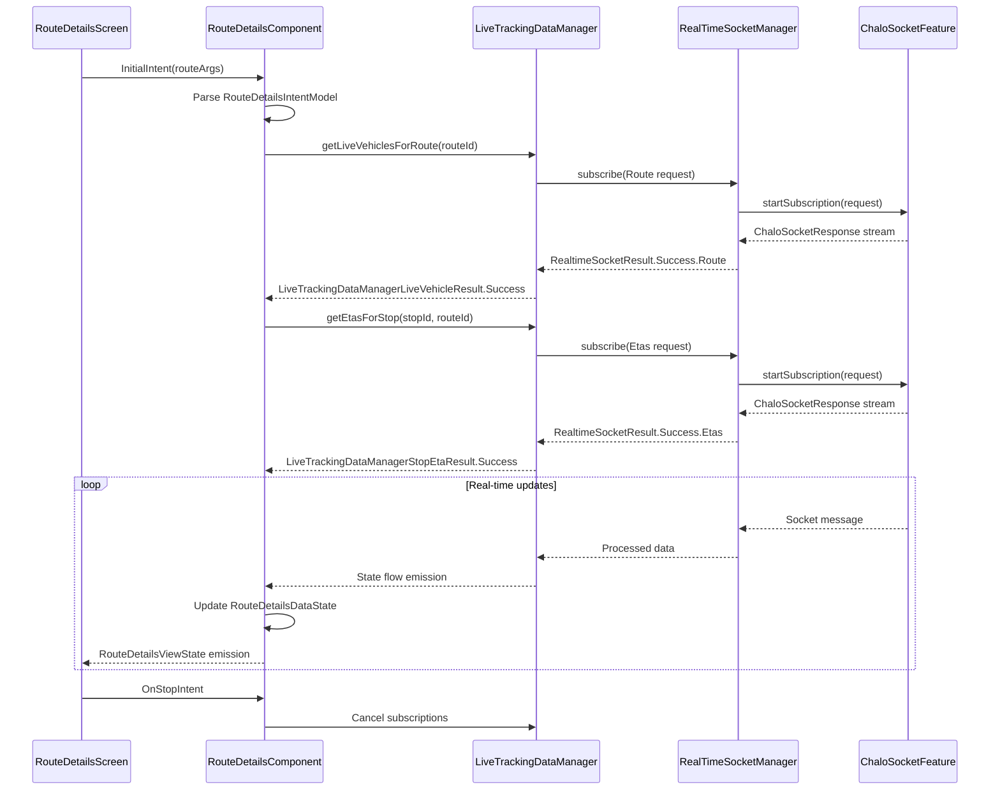
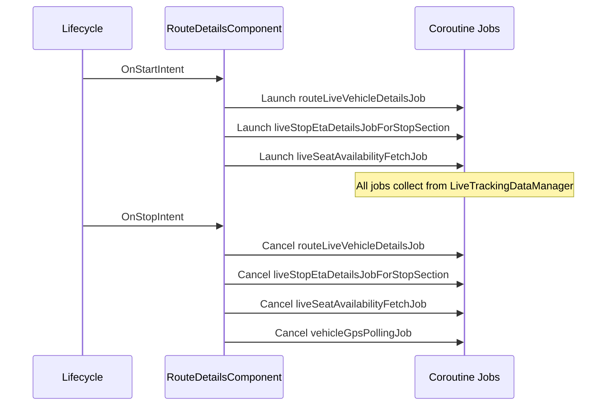
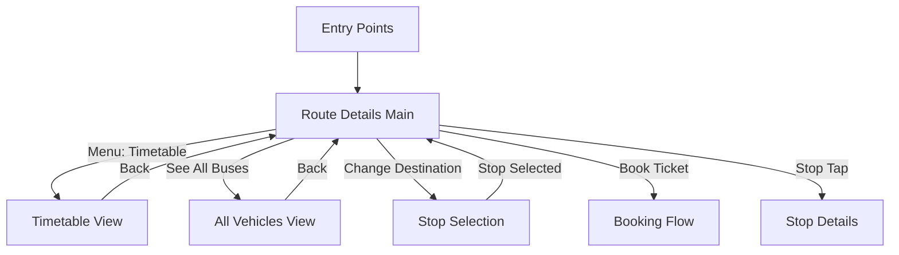
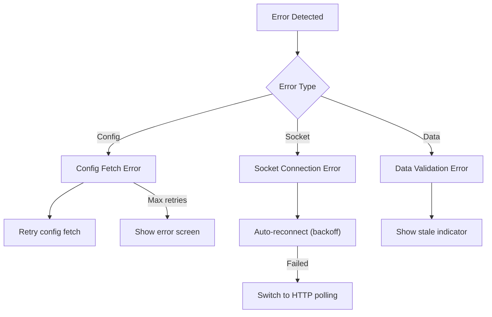

# Live Tracking - Component Documentation

## Architecture Overview

The Live Tracking presentation layer is built around the `RouteDetailsComponent`, a Decompose-based MVI component that orchestrates real-time bus tracking, ETA displays, route visualization, and user interactions. The component follows a unidirectional data flow pattern where user intents trigger state changes that flow through to the UI via Compose.

The architecture employs a layered provider pattern where `RouteDetailsComponent` delegates tracking responsibilities to `LiveTrackingDataManager`, which coordinates multiple concurrent data streams including WebSocket-based vehicle positions, stop ETAs, and HTTP-polled seat availability data.

---

## Screen Inventory

| Screen | Component | File Path | Purpose |
|--------|-----------|-----------|---------|
| **Route Details Main** | `RouteDetailsComponent` | `ui/routedetailsscreen/RouteDetailsComponent.kt` | Primary tracking screen with map and stop list |
| **Route Details Screen** | `RouteDetailsScreen` | `routedetails/ui/routedetailsscreen/compose/RouteDetailsScreen.kt` | Compose UI for main screen |
| **Stop List** | `RouteDetailsStopList` | `routedetails/ui/routedetailsscreen/compose/RouteDetailsStopList.kt` | Scrollable list of stops with ETAs |
| **Route Map** | `RouteDetailsMainScreen` | `routedetails/ui/routedetailsscreen/compose/routemap/RouteDetailsMainScreen.kt` | Map visualization with vehicle markers |
| **Timetable** | `RouteTimeTable` | `routedetails/ui/routedetailsscreen/compose/screentype/RouteTimeTable.kt` | Schedule viewing for route |
| **All Live Vehicles** | `AllLiveVehicle` | `routedetails/ui/routedetailsscreen/compose/screentype/AllLiveVehicle.kt` | Full list of vehicles with ETAs |
| **Stop List View** | `StopListView` | `routedetails/ui/routedetailsscreen/compose/screentype/StopListView.kt` | Stop search and selection |

---

## RouteDetailsComponent

The `RouteDetailsComponent` is the central orchestrator for the live tracking feature, extending `ChaloBaseStateMviComponent` to provide MVI architecture support. It manages the entire lifecycle of real-time tracking including socket connections, data transformations, and UI state production.

### Component Dependencies

| Dependency | Type | Purpose |
|------------|------|---------|
| `liveTrackingDataManager` | LiveTrackingDataManager | Real-time data coordination |
| `getCachedRouteUseCase` | GetCachedRouteUseCase | Retrieve cached route data |
| `fetchRouteDataFromRemoteUseCase` | FetchRouteDataFromRemoteUseCase | Fetch fresh route data |
| `getEtaUiModelForStopFromRtsData` | GetEtaUiModelForStopFromRtsData | Transform RTS data to UI models |
| `getEtaUiModelForStopFromTimeTable` | GetEtaUiModelForStopFromTimeTable | Fallback ETA from timetable |
| `getDelayedEtaThresholdForLiveTrackingUseCase` | GetDelayedEtaThresholdForLiveTrackingUseCase | Delayed threshold config |
| `routeDetailsUIStateFactory` | RouteDetailsUIStateFactory | UI state production |
| `chaloLocationManager` | ChaloLocationManager | User location services |
| `routeMapLiveVehicleIconHelper` | RouteMapLiveVehicleIconHelper | Vehicle marker icons |
| `routeTrackingDataProvider` | RouteTrackingDataProvider | Route data integration |

### State Management Architecture

### Job Management

The component manages multiple concurrent coroutine jobs for data streaming:

| Job Field | Type | Purpose |
|-----------|------|---------|
| `routeLiveVehicleDetailsJob` | Job? | Vehicle position subscription |
| `liveStopEtaDetailsJobForStopSection` | Job? | Stop section ETA subscription |
| `liveSeatAvailabilityFetchJob` | Job? | Seat availability polling |
| `vehicleGpsPollingJob` | Job? | Individual vehicle GPS polling |

Jobs are cancelled and recreated during lifecycle events and view transitions.

### RouteDetailsDataState

The `RouteDetailsDataState` class holds all mutable state for the route details screen.

| Field | Type | Description |
|-------|------|-------------|
| `showFullScreenLoader` | Boolean | Full screen loading indicator |
| `routeDetailsBookingType` | RouteBookingType? | TICKET, PASS, PREMIUM_BUS_TICKET, or AIRPORT_ROUTE_TICKET |
| `routeName` | String | Display name for route |
| `routeLastStopName` | String | Final destination stop name |
| `routeFirstStopName` | String | Origin stop name |
| `via` | String? | Via stops description |
| `routeNamingSchemeType` | RouteNamingSchemeType | Route naming convention |
| `routeDetailsViewType` | RouteDetailsViewType? | Current screen view type |
| `optionsMenuList` | List<RouteDetailsOptionsMenu> | Available menu options |
| `routeStopUiModelList` | List<RouteDetailsStopUiModel> | Stop list with ETAs |
| `userDestinationName` | String | User selected destination |
| `currSelectedStopEtaUiModelForMap` | RouteDetailsMapStopUiModel | Selected stop for map display |
| `mapUiModel` | RouteDetailsMapUiModel | Map polyline and camera state |
| `timeTableUiModel` | RouteTimeTableUiModel? | Timetable data |
| `isShortTripAvailable` | Boolean | Short trip filtering enabled |
| `livePassengerDetailsBottomSheetDetails` | LivePassengerIndicatorBottomSheetDetails? | Seat availability info |
| `routeAvailabilityBannerDetails` | RouteAvailabilityBannerDetails? | Route status banner |
| `stopMarkerList` | List<RouteDetailsMapStopMarkerInfo> | Map stop markers |
| `liveVehiclesMarkerList` | List<LiveVehiclesMarkerInfo> | Map vehicle markers |

### RouteDetailsViewType

The sealed class representing different screen views within route details.

### RouteDetailsIntent Catalog

| Intent | Trigger | Action |
|--------|---------|--------|
| `InitialIntent` | Screen created | Initialize with RouteDetailsIntentModel |
| `OnStartIntent` | Lifecycle start | Begin tracking subscriptions |
| `OnStopIntent` | Lifecycle stop | Pause tracking |
| `OnRetryClicked` | Error retry button | Retry route fetch |
| `UserDestinationStopSelectedIntent` | Destination stop tapped | Update user destination |
| `StopSelectedToViewEtasIntent` | Stop in list tapped | Focus stop and fetch ETAs |
| `SearchStopSelectedToViewEtasIntent` | Search result tapped | Navigate to stop in list |
| `MapMarkerInteraction` | Map marker tapped | Handle marker click/info window |
| `OnRouteBookingCtaClicked` | Booking CTA tapped | Navigate to booking flow |
| `OnOptionsMenuItemClickedIntent` | Menu item selected | Handle menu action (timetable, favorite, etc.) |
| `OnDropDownIconClick` | Header dropdown tapped | Toggle expanded state |
| `StopCtaClicked` | Stop action CTA | Handle stop-specific actions |
| `ChangeUserDestinationClickedIntent` | Change destination | Show stop selection |
| `OnBackPressed` | Back navigation | Handle back based on current view |
| `LiveSeatAvailabilityIndicatorInfoIconClicked` | Info icon tapped | Show seat availability details |
| `RouteBannerClickedIntent` | Banner tapped | Show banner dialog |
| `ReportProblemButtonClicked` | Report problem | Open report dialog |
| `OnMyLocationClicked` | My location button | Center map on user |
| `OnMapCameraUpdateLoaded` | Map camera ready | Handle camera update |
| `StopSearchQueryUpdate` | Search text changed | Filter stop list |

### RouteDetailsSideEffect Catalog

| Effect | When Triggered | Result |
|--------|----------------|--------|
| `StartCheckin` | Check-in initiated | Navigate to check-in flow with route and stops |
| `HandleLocationPermission` | Location needed | Request location permission |
| `ShowLiveSeatAvailabilityBottomSheet` | Info icon clicked | Display seat availability modal |
| `DismissLiveSeatAvailabilityBottomSheet` | Bottom sheet dismissed | Hide modal |
| `HideStopListBottomSheet` | Stop selected | Collapse bottom sheet |

---

## RouteDetailsViewState

The `RouteDetailsViewState` is the immutable UI state emitted to Compose.

| Field | Type | Description |
|-------|------|-------------|
| `livePassengerIndicatorBSContentUIState` | LivePassengerIndicatorBottomSheetContentUIState? | Seat availability bottom sheet |
| `loadingDialog` | LoadingDialogUIState? | Loading dialog state |
| `fullScreenLoader` | CircularProgressIndicatorUIState? | Full screen progress |
| `screenUIState` | RouteDetailsViewTypeUIState? | Current screen content |
| `routeAvailabilityDialog` | RouteAvailabilityDialogUIState? | Route status dialog |
| `reportProblemDialog` | ReportProblemDialogUIState? | Report problem modal |

### RouteDetailsViewTypeUIState

| Variant | Key Fields | Purpose |
|---------|------------|---------|
| `MainScreen` | bottomSheetContent, bookingCta, map, backButton | Primary route details view |
| `TimeTable` | toolbar, content, initialScrollToPosition | Schedule listing |
| `AllLiveVehicles` | toolbar, currentStopForEta, etaStatus | Full vehicle ETA list |
| `StopList` | toolbar, searchField, searchResult | Stop search and selection |
| `Error` | errorUIState | Error display with retry |

---

## UI State Factories

The presentation layer uses factory classes to transform data state into UI state, maintaining separation between business logic and UI construction.

### RouteDetailsUIStateFactory

Primary factory responsible for building view type UI states from data state.

| Method | Input | Output |
|--------|-------|--------|
| `screenViewTypeUIState` | RouteDetailsDataState, processIntent | RouteDetailsViewTypeUIState? |
| `livePassengerIndicatorBottomSheetContent` | LivePassengerIndicatorBottomSheetDetails | LivePassengerIndicatorBottomSheetContentUIState |
| `mapMarkersList` | stop markers, vehicle markers | List<ChaloMapMarkerUIState> |
| `stopMarkerInfoWindow` | RouteDetailsMapStopMarkerInfo | StopMarkerInfoWindowUIState |

### RouteDetailsStopsListUIStateFactory

Builds stop list UI components.

| Method | Purpose |
|--------|---------|
| `headerDetails` | Route header with name, destination, menu |
| `stopListForRouteDetails` | Full stop list with ETAs and actions |

### RouteStopCardUIStateFactory

Constructs individual stop card UI elements.

| Method | Purpose |
|--------|---------|
| `etaDetails` | ETA badge and information display |
| `stopCardCta` | Action button for stop (buy ticket, see all, etc.) |

### LivePassengerIndicatorUIStateFactory

Builds seat availability information displays.

---

## Stop ETA Display Components

### StopEtaUiModel States

The `StopEtaUiModel` sealed class represents all possible ETA display states.

| State | Condition | UI Display |
|-------|-----------|------------|
| `FixedEta` | Valid eta value, 0 < eta < 7200 seconds | Exact arrival time (e.g., "5 min") |
| `EstimatedEta` | Valid minEta > 0 and maxEta < 7200 | Time range (e.g., "5-10 min") |
| `NotAvailable` | No valid ETA data | "ETA unavailable" message |
| `AllBusPassed` | All vehicles have eta == -1 | "All buses passed" indicator |
| `Loading` | ETA fetch in progress | Loading spinner |

### FixedEtaUiModel Properties

| Property | Type | Description |
|----------|------|-------------|
| `etaInMins` | String | Formatted ETA string |
| `isBusHalted` | Boolean | Bus stopped indicator |
| `vehicleNumber` | String | Bus identifier |
| `minutesSinceLastUpdated` | Long? | Staleness indicator (null if fresh) |
| `vehicleSeatAvailabilityLevel` | SeatAvailabilityLevel | Occupancy level |

### EstimatedEtaUiModel Properties

| Property | Type | Description |
|----------|------|-------------|
| `minEtaInMins` | String | Minimum ETA formatted |
| `maxEtaInMins` | String | Maximum ETA formatted |
| `isBusHalted` | Boolean | Bus stopped indicator |
| `vehicleNumber` | String | Bus identifier |

---

## Map View Components

### RouteDetailsMapUiModel

| Field | Type | Description |
|-------|------|-------------|
| `mapStopsPolylineDetails` | List<ChaloMapPolylinePointDetails> | Route polyline segments |
| `isLocationEnabled` | Boolean | User location layer active |
| `mapCameraViewState` | MapCameraViewState | Current camera position |

### RouteDetailsMapStopMarkerInfo

| Field | Type | Description |
|-------|------|-------------|
| `stopId` | String | Stop identifier |
| `stopName` | String | Display name |
| `latLng` | LatLng | Marker position |
| `markerStopType` | MarkerStopType | Visual marker type |
| `isStopSelected` | Boolean | Currently selected |
| `etaStatus` | StopEtaStatus | ETA fetch status |
| `etaUiModel` | StopEtaUiModel | ETA display data |
| `isFirstStop` | Boolean | Origin stop flag |
| `showBusIconForEta` | Boolean | Show bus icon |
| `showBonnetNumber` | Boolean | Show vehicle number |
| `showEtaHeading` | Boolean | Show ETA header |

### MarkerStopType

| Type | Visual |
|------|--------|
| `FirstStop` | Origin marker icon |
| `LastStop` | Destination marker icon |
| `IntermediateStop` | Standard stop marker |
| `DisabledStop` | Grayed out marker |
| `CurrentSelectedStopInStopList` | Highlighted marker |
| `PremiumBusPickupStop` | Premium pickup icon |
| `PremiumBusDropStop` | Premium drop icon |

### LiveVehiclesMarkerInfo

| Field | Type | Description |
|-------|------|-------------|
| `vehicleNumber` | String | Bus identifier |
| `latLng` | LatLng | GPS position |
| `iconImage` | ChaloMapMarkerIconType | Marker icon based on state |
| `isHalted` | Boolean | Bus stopped |
| `isDelayed` | Boolean | Data stale |
| `isSelected` | Boolean | Currently focused |
| `busMapInfoWindowUiModel` | BusMapInfoWindowUiModel? | Info window content |

---

## Stop List Component

### RouteDetailsStopUiModel

| Field | Type | Description |
|-------|------|-------------|
| `stopId` | String | Unique identifier |
| `stopName` | String | Display name |
| `isSelected` | Boolean | Currently selected stop |
| `isUserDestinationStop` | Boolean | User's destination |
| `isStopAfterUserDestinationStop` | Boolean | Beyond destination |
| `etaStatus` | StopEtaStatus | ETA availability state |
| `etaModel` | StopEtaUiModel | ETA display model |
| `showLiveBusIconIfBussHasPassed` | Boolean | Bus passed indicator |
| `isBusDelayed` | Boolean | Stale data indicator |
| `vehicleNumber` | String? | Associated vehicle |
| `topHelpTagList` | List<RouteDetailsStopHelpTag> | Status tags |

### StopEtaStatus

| Status | Description |
|--------|-------------|
| `FETCHING_STARTED` | Initial ETA fetch in progress |
| `FETCHING_SUCCESS_AND_IN_PROGRESS` | Valid ETA, continuing updates |
| `ETA_NOT_AVAILABLE` | No ETA data available |

---

## Bottom Sheet Components

### RouteDetailsBottomSheetContentUIState

The bottom sheet contains the route header and stop list.

| Field | Type | Description |
|-------|------|-------------|
| `header` | RouteDetailsBottomSheetHeaderUIState | Route name, destination, menu |
| `stopsList` | RouteDetailsStopsListUIState | Stop list with ETAs |

### LivePassengerIndicatorBottomSheetContentUIState

Modal showing seat availability legend and information.

| Field | Type | Description |
|-------|------|-------------|
| `title` | ChaloTextUIState | Bottom sheet title |
| `availabilityLevels` | List<SeatAvailabilityLevelWithInfoUIState> | Level descriptions |
| `noticeText` | SeatAvlNoticeTextUIState? | Capacity notice |
| `ctaContainer` | LiveSeatAvailabilityBottomCtaContainer | Action buttons |

---

## Seat Availability Component

### SeatAvailabilityLevel

| Level | Indicator | Description |
|-------|-----------|-------------|
| `HIGH` | Green badge | Many seats available |
| `MEDIUM` | Yellow badge | Some seats available |
| `LOW` | Red badge | Few seats available |
| `UNKNOWN` | Gray badge | Data not available |

### Polling Configuration

| Parameter | Value |
|-----------|-------|
| Poll interval | 15 seconds |
| Source | HTTP polling (not WebSocket) |
| Scope | All live vehicles on route |
| Display | Combined with ETA badge |

---

## Timetable Component

### RouteTimeTableUiModel

| Field | Type | Description |
|-------|------|-------------|
| `stopSections` | List<TimeTableStopSection> | Sections by stop |
| `timingType` | TimeTableTimingType | Fixed or frequency-based |

### TimeTableSectionsUIState

| Field | Type | Description |
|-------|------|-------------|
| `header` | TimeTableSectionHeaderUIState | Section header with stop |
| `timings` | List<TimeTableTimingUIState> | Time slots |

### TimeTableTimingUIState

| Variant | Display |
|---------|---------|
| `FixedTiming` | Exact departure time |
| `FrequencyTiming` | Time range with frequency |

---

## RouteTrackingDataProvider

The `RouteTrackingDataProvider` interface provides tracking data integration between the live tracking module and other features.

### Interface Definition

| Method | Purpose | Returns |
|--------|---------|---------|
| `getStopLiveEtaData(stopId, routeId)` | Get live ETA for a stop | Flow<StopLiveEtaAppModel?> |
| `getRouteVehiclesData(routeId)` | Get all live vehicles on route | Flow<Map<String, RealtimeSocketRouteStreamResponseAppModel?>?> |
| `cancelStopEtaSubscription(stopId, routeId)` | Cancel ETA subscription | Unit |
| `cancelRouteSubscription(routeId)` | Cancel route subscription | Unit |

### Implementation

The `RouteTrackingDataProviderImpl` delegates to `LiveTrackingDataManager` and transforms results to the provider interface types.

---

## Component Lifecycle Integration

### Tracking Subscription Flow

### OnStart / OnStop Lifecycle

### Data Stream Types

| Stream | Socket Channel | Data Model | Update Rate |
|--------|----------------|------------|-------------|
| Route Vehicles | `routes:{routeId}` | RealtimeSocketRouteStreamResponseAppModel | ~20 seconds |
| Stop ETAs | `etas:{stopId}:{routeId}` | RealtimeSocketEtaResponseAppModel | On change |
| Multiple ETAs | `etasList` | Map<StopRouteId, List<...>> | On request |
| Seat Availability | HTTP polling | SeatAvailabilityAppModel | 15 seconds |

---

## Navigation

### Screen Navigation Flow

### Deep Link Handling

Deep links are processed through `DeepLinkNavigationMapper` to construct `RouteDetailsArgs`.

| Pattern | Parameters |
|---------|------------|
| Route details | routeId, sourceStopId?, destinationStopId?, vehicleNumber? |

---

## Error Handling

| Error Scenario | Detection | UI Response |
|----------------|-----------|-------------|
| Socket connection failed | ChaloSocketResult.ConnectionStatus.Error | Show retry, fallback to polling |
| Config fetch failed | ChaloConfigFetchErrorType | Display error with retry |
| No live vehicles | Empty vehicle list | Show timetable with disclaimer |
| ETA data stale | Timestamp > 2 minutes old | Show delayed badge |
| All buses passed | All etas == -1 | Display "All buses passed" |
| Seat data unavailable | HTTP error or empty | Show UNKNOWN level |
| Route not found | Null route response | Navigate back with error |

### Error Recovery Flow

---

## Analytics Events

| Event | Screen | Trigger |
|-------|--------|---------|
| `CRTS_CONFIG_SUCCESS` | Route Details | Socket config fetched |
| `CRTS_CONFIG_FAILED` | Route Details | Config fetch failed |
| `CRTS_RESPONSE` | Route Details | First RTS data received |
| `CRTS_CONNECTION_WITH_COOKIES` | Route Details | Cookie-based connection |
| `FAVOURITE_ADDED` | Route Details | Route favorited |
| `FAVOURITE_DELETED` | Route Details | Route unfavorited |
| `ROUTE_STOP_SELECTED` | Route Details | Stop tapped in list |
| `ROUTE_MAP_STOP_SELECTED` | Route Details | Stop marker tapped |
| `ROUTE_SEARCH_STOP_CLICKED` | Route Details | Search stop selected |
| `ROUTE_USER_DESTINATION_STOP_CHANGED` | Route Details | Destination changed |
| `ROUTE_DETAILS_CHANGE_DESTINATION_CLICK` | Route Details | Change destination tapped |
| `SEAT_OCCUPANCY_BOTTOMSHEET_RENDERED` | Route Details | Seat info shown |
| `SEAT_OCCUPANCY_BOTTOMSHEET_GOT_IT_CLICKED` | Route Details | Seat info dismissed |

---

## Testing Considerations

### Component Testing

| Scenario | Setup | Verification |
|----------|-------|--------------|
| Initial load | Mock route data | Stop list renders correctly |
| ETA update | Mock socket emission | Stop ETA badge updates |
| Vehicle position | Mock route stream | Map marker moves |
| Seat availability | Mock HTTP response | Badge color changes |
| Error handling | Mock error response | Error view displayed |
| Back navigation | Send OnBackPressed | View type changes |

### UI State Factory Testing

| Factory | Test Focus |
|---------|------------|
| `RouteDetailsUIStateFactory` | View type mapping, null handling |
| `RouteDetailsStopsListUIStateFactory` | Stop list ordering, ETA integration |
| `RouteStopCardUIStateFactory` | CTA visibility, badge styling |
| `LivePassengerIndicatorUIStateFactory` | Level descriptions, notice text |
