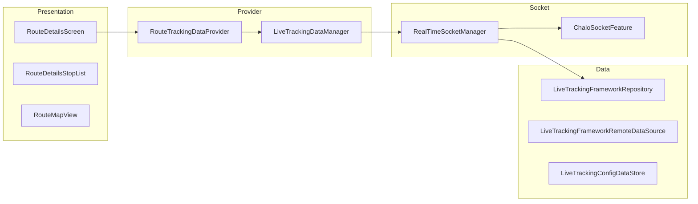

# Live Tracking — High-Level Design

## Overview

The Live Tracking feature provides real-time bus position tracking, ETAs, schedules, and seat availability within the Chalo app. It uses WebSocket connections for live vehicle data streaming and includes route details display, stop-wise ETAs, live bus markers on maps, favorites management, and timetable viewing.

## User Journey

1. **Entry Points**:
   - Home → Route card
   - Search → Route result
   - Trip planner → Bus leg
   - Favorites → Saved route

2. **Core Flow**:
   - View route details and stops
   - See live bus positions on map
   - Check ETAs for specific stops
   - View seat availability
   - Save route to favorites
   - Access timetable information

3. **Exit Points**:
   - Buy ticket → Booking flow
   - Bus arrived → Board bus
   - Route saved → Favorites

## Architecture Diagram



## Key Components

| Component | Platform | File Path | Responsibility |
|-----------|----------|-----------|----------------|
| `RouteDetailsComponent` | Shared | `shared/livetracking/.../ui/routedetailsscreen/RouteDetailsComponent.kt` | Route details screen |
| `RouteTrackingDataProviderImpl` | Shared | `shared/livetracking/.../provider/tracking/RouteTrackingDataProviderImpl.kt` | Tracking data facade |
| `LiveTrackingDataManagerImpl` | Shared | `shared/livetracking/.../frameworklivetracking/LiveTrackingDataManagerImpl.kt` | Data aggregation |
| `RealTimeSocketManagerImpl` | Shared | `shared/livetracking/.../frameworklivetracking/RealTimeSocketManagerImpl.kt` | Socket management |
| `ChaloSocketAndroidImpl` | Android | `shared/livetracking/.../frameworklivetracking/chalosocket/ChaloSocketAndroidImpl.kt` | Android socket |
| `ProcessLiveStopEtaDataUseCase` | Shared | `shared/livetracking/.../frameworklivetracking/domain/ProcessLiveStopEtaDataUseCase.kt` | ETA processing |

## Data Flow

### Real-Time Socket Connection
1. User opens route details
2. `RouteTrackingDataProvider.init(routeId)` initializes
3. `RealTimeSocketManager` fetches socket config
4. WebSocket connection established via `ChaloSocketFeature`
5. Subscribe to route vehicle positions
6. Subscribe to stop ETAs

### ETA Update Flow
1. Socket receives `RealtimeSocketEtaResponseAppModel`
2. `LiveTrackingDataManager` aggregates data
3. `ProcessLiveStopEtaDataUseCase` validates and transforms
4. Filter by valid ETA range (max 2 hours)
5. Detect delay state based on timestamps
6. Emit `StopLiveEtaAppModel` to UI

### Vehicle Position Flow
1. Socket receives `RealtimeSocketRouteStreamResponseAppModel`
2. Extract GPS coordinates and bearing
3. Update map markers
4. Calculate next/passed stops
5. Emit `LiveVehicleDetailsResult`

## Platform Differences

### Android-Specific
- Socket.IO client with OkHttpClient
- Google Maps for route visualization
- Background service for continuous tracking

### iOS-Specific
- Platform-specific socket implementation
- MapKit integration
- Background app refresh

## Integration Points

### Analytics Events
- See [Analytics: live-tracking](/analytics/flows/live-tracking) for event documentation
- Key events:
  - `route_details_screen_opened`
  - `live_tracking_started`
  - `eta_received`
  - `seat_availability_fetched`
  - `route_favorited`
  - `timetable_viewed`

### Shared Services
- **City Data**: Route and stop information
- **Seat Availability**: Vehicle occupancy
- **Favorites**: Route saving
- **Booking**: Ticket purchase flow

### Navigation
- **Navigates to**: Stop details, Booking flow, Timetable
- **Navigated from**: Home, Search, Trip planner

## Socket Configuration

### ChaloSocketConfigResponseAppModel
```kotlin
data class ChaloSocketConfigResponseAppModel(
    val socketConnectionData: ConnectionDataAppModel,
    val rtsServiceDetails: Map<RtsServiceType, ChaloRtsServiceConfigAppModel>
)

data class ConnectionDataAppModel(
    val baseUrl: String,
    val forceReconnection: Boolean,
    val socketPath: String,
    val socketReconnectionDelay: Long,
    val maxReconnectionDelay: Long,
    val connectionTimeout: Long,
    val transportValues: List<String>?,
    val enableCookie: Boolean
)
```

### RTS Service Types
```kotlin
enum class RtsServiceType {
    ETA("etas"),           // Single stop ETAs
    ROUTE("routes"),       // Live vehicle positions
    ETAS_LIST("etasList")  // Multiple stop ETAs
}
```

## Real-Time Data Models

### RealtimeSocketEtaResponseAppModel
```kotlin
data class RealtimeSocketEtaResponseAppModel(
    val etaId: String,
    val eta: Long,                 // ETA in seconds
    val vehicleNumber: String,
    val minEta: Long,              // Estimated min ETA
    val maxEta: Long,              // Estimated max ETA
    val timeStamp: Long,           // Server timestamp
    val lastStopId: String,        // Final stop for this bus
    val isBusHalted: Boolean,
    val distanceToReach: Int?
)
```

### RealtimeSocketRouteStreamResponseAppModel
```kotlin
data class RealtimeSocketRouteStreamResponseAppModel(
    val streamId: String,
    val vehicleNumber: String,
    val eta: Long,
    val timeStamp: Long,
    val latLng: LatLng,            // GPS coordinates
    val isBusHalted: Boolean,
    val nextStopId: String,
    val lastStopId: String,
    val passedStopId: String?,
    val passedStopTime: Long?,
    val vehicleBearing: Int?       // Direction indicator
)
```

## ETA Processing

### StopLiveEtaAppModel
```kotlin
sealed class StopLiveEtaAppModel {
    data class FixedEta(val etaList: List<FixedEtaAppModel>)
    data class EstimatedEta(val etaList: List<EstimatedEtaAppModel>)
    object NotAvailable
    object AllBusPassed
}
```

### Processing Logic
1. Filter fixed ETAs (eta != -1L and within valid range)
2. Filter estimated ETAs (minEta > 0, maxEta < 2 hours)
3. Mark as "AllBusPassed" if all buses have eta == -1L
4. Detect delay based on timestamp age (threshold: 2 minutes)

## Seat Availability

### SeatAvailabilityLevel
```kotlin
enum class SeatAvailabilityLevel {
    HIGH,     // Many seats available
    MEDIUM,   // Some seats available
    LOW,      // Few seats available
    UNKNOWN   // Data not available
}
```

### Polling Configuration
- Interval: 15 seconds
- Per-vehicle availability
- Combined with ETA data for display

## Edge Cases & Error Handling

| Scenario | Handling |
|----------|----------|
| Socket connection failed | Falls back to HTTP polling |
| No live vehicles | Shows scheduled times |
| Stale ETA data | Filters by timestamp |
| Bus passed stop | Shows "Bus departed" |
| Seat data unavailable | Shows "UNKNOWN" level |
| Network disconnected | Uses cached data |

## Performance Configuration

| Parameter | Value |
|-----------|-------|
| Vehicle GPS polling | 20 seconds |
| Seat availability fetch | 15 seconds |
| Max valid ETA | 2 hours (7200 seconds) |
| Delayed ETA threshold | 2 minutes |
| Socket reconnection delay | Configurable |
| Max reconnection delay | Configurable |

## Error Types

### RealTimeSocketResponseErrorType
```kotlin
sealed class RealTimeSocketResponseErrorType {
    object ConfigNotAvailable
    object InvalidRtsService
    object InvalidSocketResponse
    object AckNotReceivedForRequest
    data class SocketConnectionError(val errorMsg: String)
    data class Generic(val errorMsg: String)
    object InvalidRealTimeSocketRequest
}
```

## Dependencies

### Internal
- `shared:livetracking` — Core tracking module
- `shared:core` — City data and navigation
- `shared:chalo-base` — Base models

### External
- Socket.IO — WebSocket client (Android)
- Maps SDK — Route visualization
- SQLDelight — Route caching
- DataStore — Configuration storage
