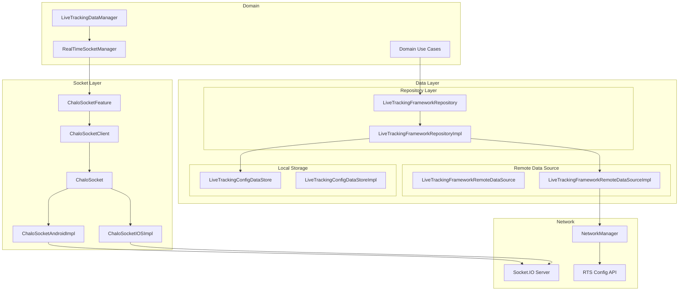
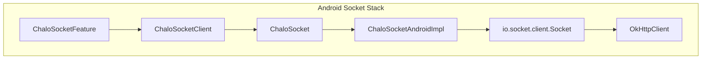
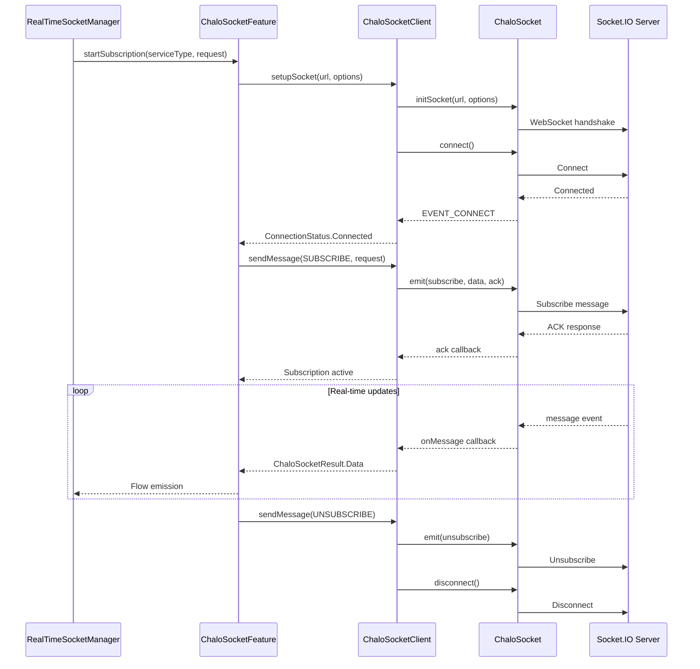
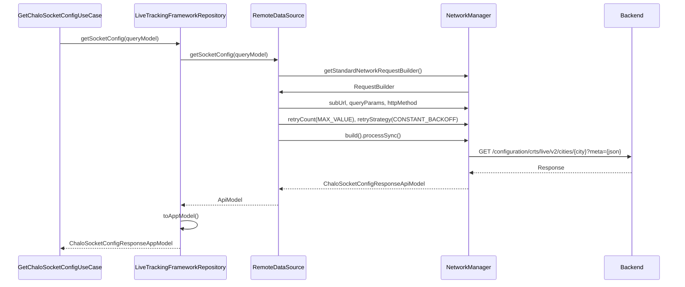
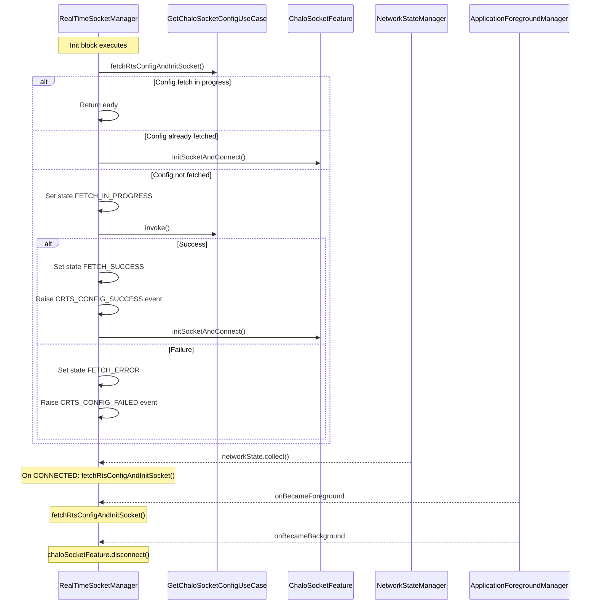
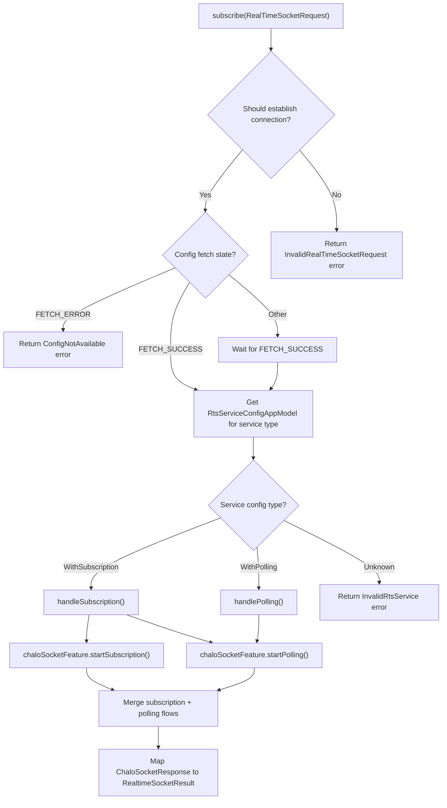
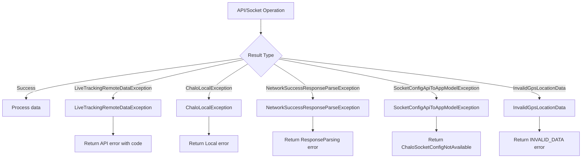

# Live Tracking - Repository Documentation

## Data Layer Overview

The Live Tracking data layer manages WebSocket connections, real-time data streaming, HTTP API interactions, and configuration persistence. The architecture centers on `LiveTrackingFrameworkRepository` for HTTP-based data access and `ChaloSocket` for platform-specific socket implementations. The layer uses a clean separation between remote data sources, local storage, and socket infrastructure.



---

## Repository Inventory

| Repository | Interface | Implementation | Purpose |
|------------|-----------|----------------|---------|
| **LiveTrackingFrameworkRepository** | `LiveTrackingFrameworkRepository.kt` | `LiveTrackingFrameworkRepositoryImpl.kt` | HTTP data access for config, seat availability, GPS |
| **LiveTrackingFrameworkRemoteDataSource** | `LiveTrackingFrameworkRemoteDataSource.kt` | `LiveTrackingFrameworkRemoteDataSourceImpl.kt` | Network request execution |
| **LiveTrackingConfigDataStore** | `LiveTrackingConfigDataStore.kt` | `LiveTrackingConfigDataStoreImpl.kt` | Local configuration storage |

---

## LiveTrackingFrameworkRepository

Central repository coordinating socket configuration retrieval, seat availability data, and vehicle GPS location access.

### Interface Definition

| Method | Purpose | Returns |
|--------|---------|---------|
| `getSocketConfig(configRequestQueryModel)` | Fetch WebSocket configuration for city | `ChaloSocketConfigResponseAppModel` |
| `getRouteSeatAvailabilityDetails(requestAppModel)` | Fetch vehicle seat occupancy | `SeatAvailabilityAppModel` |
| `getVehicleLiveGpsDetails(reqAppModel)` | Fetch live GPS position for vehicle | `VehicleLiveGpsLocationResponseAppModel` |

### Implementation Details

The `LiveTrackingFrameworkRepositoryImpl` delegates to `LiveTrackingFrameworkRemoteDataSource` for network calls and performs API-to-App model transformations. The implementation validates GPS location data and throws `InvalidGpsLocationData` if the response is invalid.

| Dependency | Type | Purpose |
|------------|------|---------|
| `liveTrackingFrameworkRemoteDataSource` | LiveTrackingFrameworkRemoteDataSource | HTTP requests |

---

## LiveTrackingFrameworkRemoteDataSource

Handles HTTP network requests for live tracking configuration and supplementary data.

### Interface Definition

| Method | Purpose | Returns |
|--------|---------|---------|
| `getSocketConfig(configRequestQueryModel)` | Fetch socket server configuration | `ChaloSocketConfigResponseApiModel` |
| `getRouteSeatAvailabilityDetails(requestApiModel)` | Fetch seat occupancy data | `GetSeatAvailabilityResponseApiModel` |
| `getVehicleLiveGpsDetails(cityName, vehicleNumber, agency)` | Fetch vehicle GPS position | `FetchVehicleLiveGpsLocationResponseApiModel` |

### Implementation Details

The `LiveTrackingFrameworkRemoteDataSourceImpl` uses `NetworkManager` for HTTP request construction and execution with proper error mapping.

| Dependency | Type | Purpose |
|------------|------|---------|
| `networkManager` | NetworkManager | HTTP request builder |
| `genericNetworkExceptionMapper` | GenericNetworkExceptionMapper | Error handling |

---

## API Endpoints

### Socket Configuration

Retrieves WebSocket server configuration for real-time tracking connections. The API uses v2 endpoint which supports cookie-based connections.

| Property | Value |
|----------|-------|
| **Endpoint** | `GET /configuration/crts/live/v2/cities/{cityName}` |
| **Auth** | Required |
| **Path Parameter** | `cityName` - Current city |
| **Query Parameter** | `meta` - JSON-encoded request metadata |
| **Retry Strategy** | `CONSTANT_BACKOFF` with `Int.MAX_VALUE` retries |

**Request Query Model: ChaloSocketConfigRequestQueryModel**

| Field | Type | Description |
|-------|------|-------------|
| `userId` | String? | User identifier |
| `city` | String | City name |
| `androidModel` | String | Device model |
| `osVersion` | String | OS version |
| `androidVersionCode` | Int | App version code |
| `language` | String | Current language |

**Response: ChaloSocketConfigResponseAppModel**

| Field | Type | Description |
|-------|------|-------------|
| `socketConnectionData` | ConnectionDataAppModel | Connection parameters |
| `rtsServiceDetails` | Map<RtsServiceType, ChaloRtsServiceConfigAppModel> | Per-service configurations |

**ConnectionDataAppModel Fields**

| Field | Type | Description |
|-------|------|-------------|
| `baseUrl` | String | WebSocket server URL |
| `forceReconnection` | Boolean | Enable auto-reconnect |
| `socketPath` | String | Socket.IO endpoint path |
| `socketReconnectionRandomizationFactor` | Double | Jitter factor for reconnection |
| `socketReconnectionDelay` | Long | Initial reconnect delay (ms) |
| `maxReconnectionDelay` | Long | Maximum backoff delay (ms) |
| `connectionTimeout` | Long | Connection timeout (ms, -1 for default) |
| `transportValues` | List<String>? | Allowed transports (websocket, polling) |
| `enableCookie` | Boolean | Cookie-based authentication flag |

**ChaloRtsServiceConfigAppModel Variants**

| Variant | Fields | Description |
|---------|--------|-------------|
| `WithPolling` | pollingFrequency, randomizationFactor | HTTP polling configuration |
| `WithSubscription` | resyncFrequency, randomizationFactor, retryPolicy | Socket subscription configuration |
| `Unknown` | (none) | Unknown service type |

**SubscriptionRetryPolicy**

| Field | Type | Description |
|-------|------|-------------|
| `retryBackoffMultiplier` | Int | Backoff multiplier |
| `retryMaxAttempts` | Int | Maximum retry count |
| `retryTimeout` | Int | Retry timeout (ms) |

---

### Seat Availability

Fetches current seat occupancy for specified vehicles.

| Property | Value |
|----------|-------|
| **Endpoint** | `POST /seat/availability` |
| **Auth** | Required |
| **Header** | `mode` - Request mode |

**Request: GetSeatAvailabilityRequestAppModel**

| Field | Type | Description |
|-------|------|-------------|
| `deviceId` | String | Device identifier |
| `cityName` | String | Current city |
| `maxDelay` | Int | Maximum data delay (seconds) |
| `seatAvailabilityId` | Int | Availability request ID |
| `seatOccupancyFactor` | Int | Occupancy calculation factor (default 100) |
| `vehicleDetails` | List<GetSeatAvailabilityRequestVehicleDetailsModel> | List of vehicles to query |

**Response: SeatAvailabilityAppModel**

| Field | Type | Description |
|-------|------|-------------|
| `availabilityList` | List<VehicleSeatAvailabilityDetailsAppModel> | Per-vehicle availability |

**VehicleSeatAvailabilityDetailsAppModel**

| Field | Type | Description |
|-------|------|-------------|
| `vehicleNumber` | String | Vehicle identifier |
| `seatAvailabilityLevel` | SeatAvailabilityLevel | HIGH, MEDIUM, LOW, UNKNOWN |

---

### Vehicle Live GPS Location

Fetches real-time GPS coordinates for a specific vehicle.

| Property | Value |
|----------|-------|
| **Endpoint** | `GET /vasudha/location/{cityName}/{agencyName}/bus/{busNo}` |
| **Auth** | Required |
| **Path Parameters** | `cityName`, `agencyName`, `busNo` |

**Request: FetchVehicleLiveGpsLocationRequestAppModel**

| Field | Type | Description |
|-------|------|-------------|
| `cityName` | String | City name (lowercase) |
| `vehicleNumber` | String | Bus identifier |
| `agency` | String | Transport agency (lowercase) |

**Response: VehicleLiveGpsLocationResponseAppModel**

| Field | Type | Description |
|-------|------|-------------|
| `currentLocation` | LatLng | GPS coordinates |
| `timeStamp` | Long | Data timestamp |
| `vehicleBearing` | Int? | Direction in degrees |

---

## WebSocket Infrastructure

### ChaloSocket Interface

Platform-abstracted interface for low-level socket operations.

| Method | Purpose |
|--------|---------|
| `initSocket(socketUrl, socketOptions)` | Initialize socket instance |
| `isSocketInitialised()` | Check if socket is initialized |
| `connect()` | Establish connection |
| `on(event, callback)` | Register single event listener |
| `on(eventList, callback)` | Register multiple event listeners |
| `emit(event, ack, args)` | Send message with optional acknowledgment |
| `disconnect()` | Close connection |
| `clear()` | Clear socket callbacks and reset state |

### KSocketOptions

| Field | Type | Description |
|-------|------|-------------|
| `reconnectionDelay` | Long | Initial reconnection delay (ms) |
| `reconnectionDelayMax` | Long | Maximum reconnection delay (ms) |
| `randomizationFactor` | Double | Jitter factor (0.0 - 1.0) |
| `path` | String | Socket.IO path |
| `query` | Map<String, Any> | Connection query parameters |
| `timeout` | Long? | Connection timeout (ms) |
| `transports` | List<String>? | Allowed transports |
| `platformConfig` | KPlatformSocketConfig? | Platform-specific config |

### KSocketData

| Variant | Field | Description |
|---------|-------|-------------|
| `StringData` | data: String | String message data |

### SocketEvent Types

| Event | Constant Name | Description |
|-------|---------------|-------------|
| `Connect` | EVENT_CONNECT | Connection established |
| `Disconnect` | EVENT_DISCONNECT | Connection closed |
| `Error` | EVENT_ERROR | Error occurred |
| `ConnectionError` | EVENT_CONNECT_ERROR | Connection failed |
| `ConnectionTimeout` | EVENT_CONNECT_TIMEOUT | Connection timed out |
| `Reconnect` | EVENT_RECONNECT | Reconnection succeeded |
| `ReconnectAttempt` | EVENT_RECONNECT_ATTEMPT | Reconnection attempt |
| `ReconnectError` | EVENT_RECONNECT_ERROR | Reconnection failed |
| `ReconnectFailed` | EVENT_RECONNECT_FAILED | All reconnections exhausted |
| `Message` | "message" | Data message received |
| `Subscribe` | "subscribe" | Subscription request |
| `Unsubscribe` | "unsubscribe" | Unsubscription request |

---

## Android Socket Implementation

The `ChaloSocketAndroidImpl` uses Socket.IO Java client with OkHttp for HTTP transport.

### Implementation Architecture



### Socket Initialization

The implementation converts `KSocketOptions` to Socket.IO `IO.Options`. Query parameters are serialized as URL-encoded strings. Platform configuration allows injecting custom OkHttpClient for cookie handling.

| Option | Source | Usage |
|--------|--------|-------|
| `reconnectionDelay` | KSocketOptions | Initial delay between reconnection attempts |
| `reconnectionDelayMax` | KSocketOptions | Maximum delay cap |
| `randomizationFactor` | KSocketOptions | Jitter for thundering herd prevention |
| `path` | KSocketOptions | Socket.IO server path |
| `query` | KSocketOptions | URL query parameters (city, deviceId, userId) |
| `timeout` | KSocketOptions | Connection timeout |
| `transports` | KSocketOptions | WebSocket and/or polling |
| `callFactory` / `webSocketFactory` | platformConfig.okHttpClient | Custom HTTP client for cookies |

### Thread Safety

The implementation uses `synchronized(_syncObj)` blocks for thread-safe socket operations including initialization, connection, emission, and cleanup.

### Query Parameters

The socket connection includes these query parameters set in `ConnectionDataAppModel.toSocketIoOption()`:

| Parameter | Value | Source |
|-----------|-------|--------|
| `city` | City name | CityProvider |
| `deviceId` | Device ID | Device contract |
| `userId` | User ID (optional) | UserProfileDetailsProvider |

---

## ChaloSocketClient

Wrapper class providing connection management, message handling, and state flow emissions.

### Connection Status Flow

The client exposes a `StateFlow<ChaloSocketResult.ConnectionStatus>` that merges socket events with client-produced statuses.

| Status | Description |
|--------|-------------|
| `ConnectionNotInitiated` | Socket not yet initialized |
| `ConnectionInProgress` | Connection attempt in progress |
| `Connected` | Successfully connected |
| `Disconnected` | Connection closed |
| `DisConnectionInProgress` | Disconnection in progress |
| `ConnectionTimeout` | Connection attempt timed out |
| `Reconnection(attemptCount)` | Reconnection succeeded |
| `ReconnectionAttempt(attemptCount)` | Reconnection attempt in progress |
| `Error.ConnectionError(msg)` | Connection failed |
| `Error.ReconnectionError(msg)` | Reconnection failed |
| `Error.ReconnectionFailed` | All attempts exhausted |
| `Error.GenericError(msg)` | Other error |

### Pending Message Queue

Messages sent while disconnected are queued and automatically dispatched upon successful connection via the `handlePendingMessageOnConnection()` flow operator.

### Message Flow

The client exposes a `SharedFlow<ChaloSocketResult.Data>` that emits parsed socket messages. Messages are deserialized using kotlinx.serialization JSON.

---

## WebSocket Protocol

### Connection Flow



### RealTimeSocketRequest Types

| Type | Reference Format | Purpose |
|------|------------------|---------|
| `Route(routeId)` | `"routes:{routeId}"` | Live vehicle positions |
| `Etas(stopId, routeId)` | `"etas:{stopId}:{routeId}"` | Single stop ETA |
| `EtasList(stopRouteIdList)` | `"etas:{stopId}:{routeId}"` (list) | Multiple stop ETAs |

### Socket Message Formats

**ChaloSocketRequest**

| Field | Type | Description |
|-------|------|-------------|
| `ref` | String | Reference identifier for the subscription |
| `etasList` | List<String>? | List of ETA references for ETAS_LIST |
| `requestId` | Int | Incrementing request counter |

**RealtimeSocketResult Variants**

| Variant | Content | Description |
|---------|---------|-------------|
| `Success.Etas` | etaMap, processResult | Single stop ETA data |
| `Success.Route` | routeVehicleMap, processResult | Vehicle positions |
| `Success.EtasList` | allStopRouteIdEtaMap, processResult | Multiple stop ETAs |
| `Error` | errorType | Error information |

---

## Data Flow Diagrams

### Socket Configuration Flow



### RealTimeSocketManager Initialization



### Subscription Handling Flow



---

## Local Storage

### LiveTrackingConfigDataStore

Provides access to city-specific tracking configuration values using DataStore Preferences.

| Method | Return Type | Description |
|--------|-------------|-------------|
| `getOccupancyFactor(cityName)` | String? | Seat occupancy calculation factor for city |
| `setOccupancyFactor(cityName, value)` | Unit | Store occupancy factor |
| `getSeatAvailabilityMaxDelay()` | String? | Maximum acceptable data delay |
| `setSeatAvailabilityMaxDelay(value)` | Unit | Store max delay |
| `getSeatAvailabilityModeKey(cityId)` | String? | Mode key for city |
| `setSeatAvailabilityModeKey(cityId, value)` | Unit | Store mode key |
| `getOccupancyDialogLearnMoreUrl(city)` | String? | Learn more URL for occupancy dialog |
| `setOccupancyDialogLearnMoreUrl(city, value)` | Unit | Store URL |
| `getOccupancyDialogNoticeText(city)` | String? | Notice text for occupancy dialog |
| `setOccupancyDialogNoticeText(city, value)` | Unit | Store notice text |
| `isSeatOccupancyDialogShown()` | Boolean? | Whether dialog has been shown |
| `setSeatOccupancyDialogShown(value)` | Unit | Store shown state |
| `getShouldShowSeatOccupancyDialog(city)` | Boolean? | Whether to show dialog for city |
| `setShouldShowSeatOccupancyDialog(city, value)` | Unit | Store show preference |

### DataStore Keys

| Key Pattern | Type | Description |
|-------------|------|-------------|
| `KEY_SEAT_AVAILABILITY_OCCUPANCY_FACTOR + cityName` | String | Occupancy factor per city |
| `KEY_SEAT_AVAILABILITY_DELAY_THRESHOLD` | String | Global delay threshold |
| `KEY_SEAT_OCCUPANCY_DIALOG_LEARN_MORE_URL + city` | String | Learn more URL per city |
| `SEAT_OCCUPANCY_DIALOG_NOTICE_TEXT + city` | String | Notice text per city |
| `KEY_SEAT_OCCUPANCY_DIALOG_SHOWN` | String | Global shown state |
| `KEY_SHOULD_SHOW_SEAT_OCCUPANCY_DIALOG_HOMESCREEN + city` | String | Show dialog per city |

---

## Data Mappers

### Socket Configuration Mapper

Transforms API response to domain model:

| From (API) | To (App) | Notes |
|------------|----------|-------|
| `connectionData` | `socketConnectionData` | Direct mapping |
| `rtsServices` | `rtsServiceDetails` | Map with RtsServiceType keys |

### RtsServiceType Mapping

| API String | RtsServiceType |
|------------|----------------|
| `"eta"` | `ETA` |
| `"route"` | `ROUTE` |
| `"etasList"` | `ETAS_LIST` |
| (unknown) | `UNKNOWN` (filtered out) |

### ETA Response Mapper

| From (Socket) | To (App) | Transformation |
|---------------|----------|----------------|
| `etaId` | `etaId` | Direct |
| `eta` | `eta` | Direct (Long) |
| `vehicleNumber` | `vehicleNumber` | Direct |
| `minEta` | `minEta` | Direct |
| `maxEta` | `maxEta` | Direct |
| `timeStamp` | `timeStamp` | Direct |
| `lastStopId` | `lastStopId` | Direct |
| `isBusHalted` | `isBusHalted` | Direct |
| `distanceToReach` | `distanceToReach` | Nullable Int |

### Route Stream Mapper

| From (Socket) | To (App) | Transformation |
|---------------|----------|----------------|
| `streamId` | `streamId` | Direct |
| `lat`, `lng` | `latLng` | Combined to LatLng |
| `vehicleNumber` | `vehicleNumber` | Direct |
| `eta` | `eta` | Direct |
| `timeStamp` | `timeStamp` | Direct |
| `isBusHalted` | `isBusHalted` | Direct |
| `nextStopId` | `nextStopId` | Direct |
| `lastStopId` | `lastStopId` | Direct |
| `passedStopId` | `passedStopId` | Nullable String |
| `passedStopTime` | `passedStopTime` | Nullable Long |
| `vehicleBearing` | `vehicleBearing` | Nullable Int |

---

## Error Handling

### Exception Types

| Exception | Source | Description |
|-----------|--------|-------------|
| `LiveTrackingRemoteDataException` | HTTP API errors | Contains errorResponse with errorCode |
| `RouteDetailsRemoteDataException` | Route-specific API errors | Contains errorResponse |
| `ChaloLocalException` | Local/network errors | Network unavailable, timeout |
| `NetworkSuccessResponseParseException` | Response parsing | Malformed JSON |
| `SocketConfigApiToAppModelException` | Config mapping | Invalid config structure |
| `InvalidGpsLocationData` | GPS validation | Invalid lat/lng data |

### Error Flow



### Socket Error Types (RealTimeSocketResponseErrorType)

| Error | Cause | Recovery |
|-------|-------|----------|
| `ConfigNotAvailable` | Config fetch failed | Retry or fallback to HTTP polling |
| `InvalidRtsService` | Unknown service type | Log warning, ignore |
| `InvalidSocketResponse` | Malformed message | Log error, skip message |
| `AckNotReceivedForRequest` | Server didn't ACK | Retry subscription |
| `SocketConnectionError(msg)` | Connection failed | Auto-reconnect with backoff |
| `InvalidRealTimeSocketRequest` | Bad request params | Log error, don't send |
| `Generic(msg)` | Unexpected error | Log and surface to UI |

---

## Network Configuration

### Retry Strategy

The socket configuration API uses aggressive retry:

| Parameter | Value |
|-----------|-------|
| Retry count | `Int.MAX_VALUE` |
| Retry strategy | `CONSTANT_BACKOFF` |

### Polling Intervals

| Operation | Interval | Constant |
|-----------|----------|----------|
| Seat availability | 15 seconds | `LIVE_SEAT_AVAILABILITY_FETCH_INTERVAL_IN_SECS` |
| Vehicle GPS | 20 seconds | `VEHICLE_GPS_FETCH_INTERVAL_IN_MILLIS` |
| Socket resync | Configurable | From server config `resyncFrequency` |

### Polling Delay Calculation

The `calculateDelayForPolling` function adds randomization to prevent thundering herd:

```
pollingFreqInSecInt = pollingFreq / 1000
randomFactor = pollingFreqInSecInt * factor
minDelay = pollingFreqInSecInt - randomFactor
maxDelay = pollingFreqInSecInt + randomFactor
actualFreq = random(minDelay..maxDelay) * 1000
```

---

## Dependency Injection

### Module Bindings

| Interface | Implementation | Scope |
|-----------|----------------|-------|
| `LiveTrackingFrameworkRepository` | `LiveTrackingFrameworkRepositoryImpl` | Singleton |
| `LiveTrackingFrameworkRemoteDataSource` | `LiveTrackingFrameworkRemoteDataSourceImpl` | Singleton |
| `LiveTrackingConfigDataStore` | `LiveTrackingConfigDataStoreImpl` | Singleton |
| `ChaloSocket` | `ChaloSocketAndroidImpl` (Android) | Per-feature |
| `ChaloSocketClient` | (class) | Per-socket |
| `ChaloSocketFeature` | `ChaloSocketFeatureImpl` | Per-service-type |
| `RealTimeSocketManager` | `RealTimeSocketManagerImpl` | Named singleton |
| `LiveTrackingDataManager` | `LiveTrackingDataManagerImpl` | Singleton |

### Named Socket Managers

| Constant | Description |
|----------|-------------|
| `SOCKET_MANAGER_WITH_REALTIME_SOCKET_FEATURE` | RealTimeSocketManager with RealTimeSocketFeature |
| `SOCKET_MANAGER_WITH_CHALO_SOCKET_FEATURE` | RealTimeSocketManager with ChaloSocketFeature |

---

## Performance Considerations

### Socket Optimization

| Strategy | Implementation |
|----------|----------------|
| Single connection | One socket shared across all subscriptions |
| Batched subscriptions | ETAS_LIST channel for multiple stops |
| Lazy initialization | Connect only when tracking screen opens |
| Eager cleanup | Disconnect when app goes to background |
| Pending message queue | Queue messages during reconnection |
| Mutex protection | Thread-safe socket operations |

### Data Efficiency

| Strategy | Benefit |
|----------|---------|
| Delta updates | Server sends only changed data |
| Selective subscription | Only subscribe to viewed route |
| Seat polling batching | Request multiple vehicles per call |
| GPS staleness filter | Reject data older than 15 minutes |
| Distinct until changed | Prevent duplicate emissions |

### Connection Resilience

| Feature | Configuration |
|---------|---------------|
| Auto-reconnect | `forceReconnection` from config |
| Exponential backoff | `socketReconnectionDelay` to `maxReconnectionDelay` |
| Jitter | `randomizationFactor` prevents thundering herd |
| Retry policy | Per-service `retryMaxAttempts` and `retryBackoffMultiplier` |
| Network awareness | Re-fetch config on network reconnection |
| Foreground/background | Disconnect on background, reconnect on foreground |

---

## Analytics Integration

### Tracked Events

| Event | Trigger | Key Properties |
|-------|---------|----------------|
| `CRTS_CONFIG_SUCCESS` | Config fetch success | networkType |
| `CRTS_CONFIG_FAILED` | Config fetch failed | reason, networkType |
| `CRTS_RESPONSE` | First RTS data received | time, referenceType |
| `CRTS_CONNECTION_WITH_COOKIES` | Cookie-based connection | url |

### Connection Event Properties

The `ChaloSocketClient` adds these properties to analytics events:

| Property | Key | Source |
|----------|-----|--------|
| Reason | `reason` | Error message |
| Exception cause | `cause` | Exception cause message |
| Network state | `network` | NetworkStateManager connected state |
| Network type | `networkType` | WiFi, Mobile, etc. |
| Timestamp | `time` | BasicInfoContract.getTrueTimeBlocking() |

---

## Testing Considerations

### Mock Strategies

| Component | Mock Approach |
|-----------|---------------|
| `LiveTrackingFrameworkRepository` | Interface mock with fake responses |
| `LiveTrackingFrameworkRemoteDataSource` | Network mock or fake |
| `ChaloSocket` | Interface mock for socket events |
| `NetworkManager` | MockWebServer or fake |
| `LiveTrackingConfigDataStore` | In-memory preferences |

### Test Scenarios

| Scenario | Setup | Verification |
|----------|-------|--------------|
| Config fetch success | Mock API success response | Config parsed correctly |
| Config fetch failure | Mock API error | Error type mapped correctly |
| Socket connection | Mock connect event | Status flow emits Connected |
| Socket message | Mock message event | Data parsed and emitted |
| Reconnection | Mock disconnect then connect | Pending messages sent |
| Stale GPS data | Mock old timestamp | STALE_DATA error returned |
| Invalid seat config | Mock missing occupancyFactor | SeatOccupancyFactorUnavailable error |
| City change | Trigger city update | Socket disconnected and reconnected |
| Background/foreground | Trigger lifecycle | Socket connected/disconnected appropriately |
