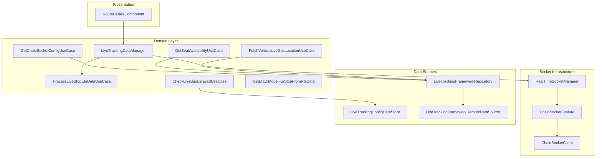
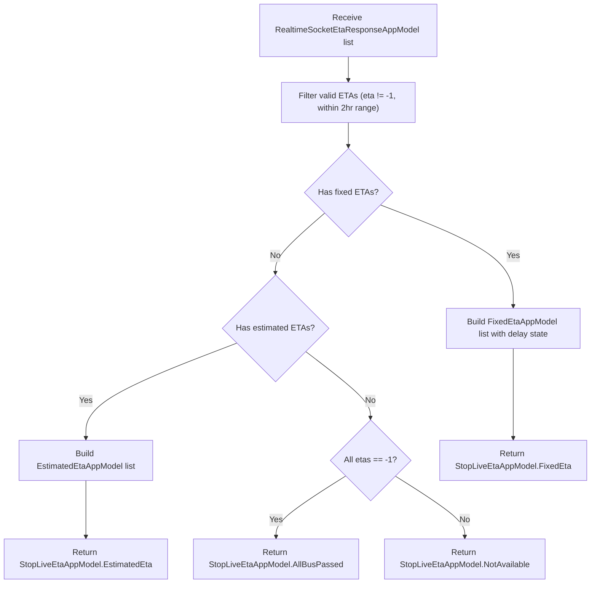
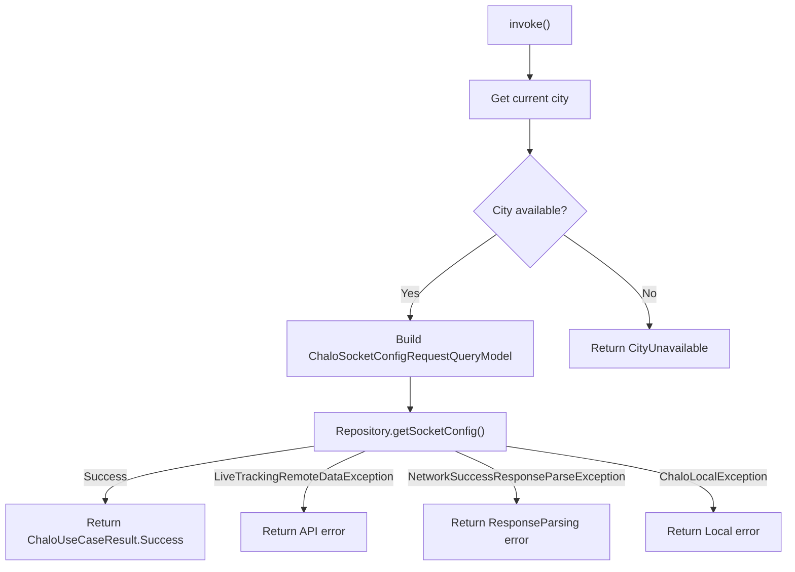
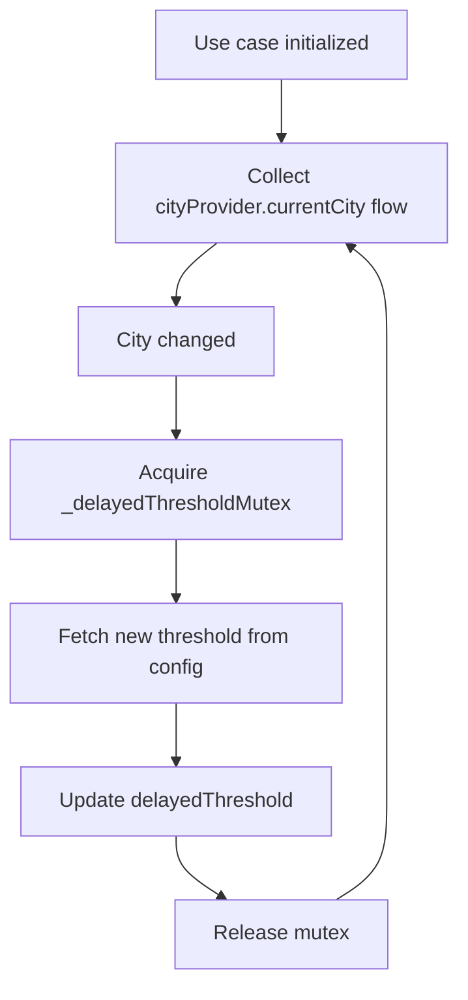
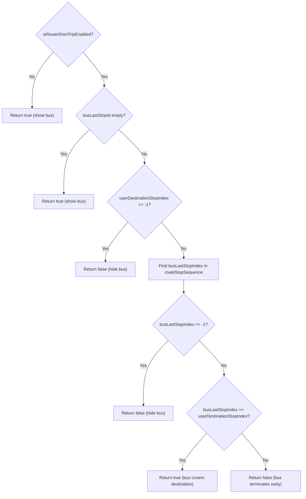
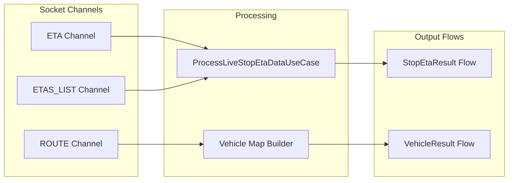
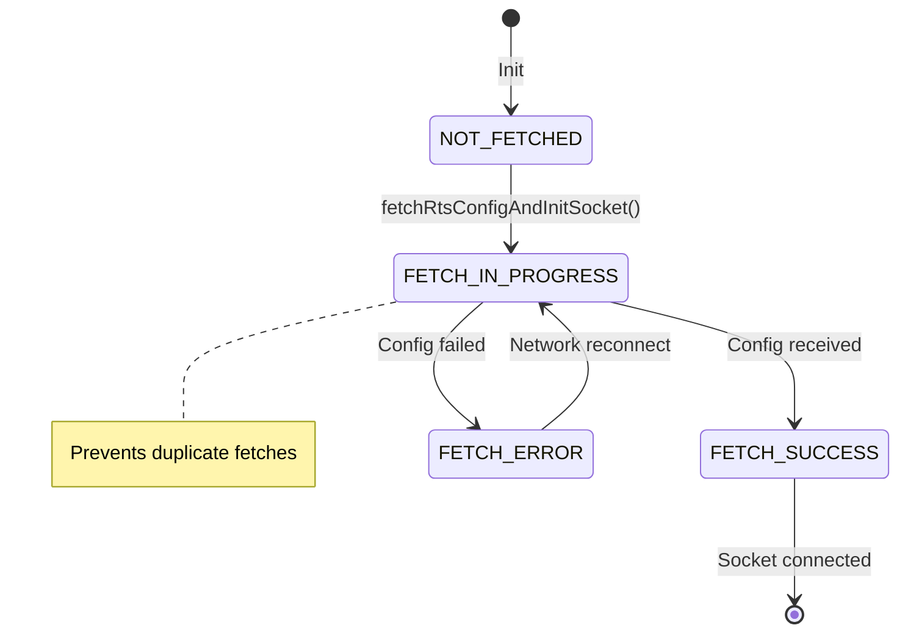
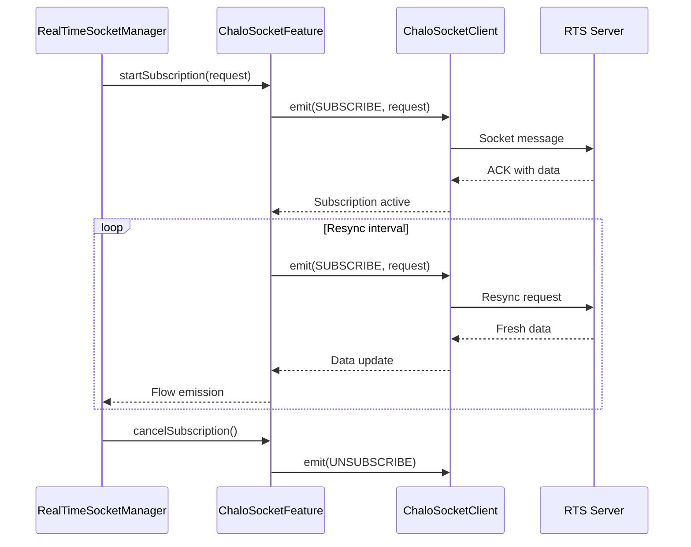
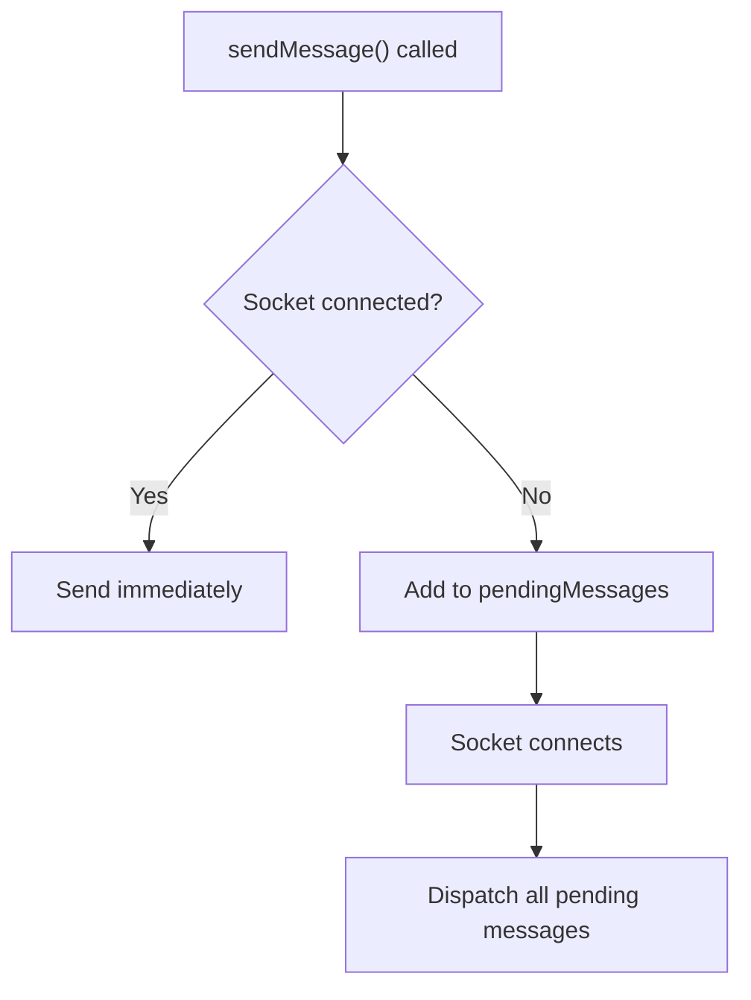
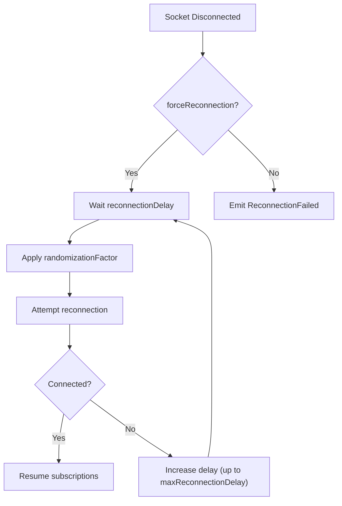

# Live Tracking - UseCase Documentation

## Domain Layer Overview

The Live Tracking domain layer orchestrates real-time bus tracking, ETA computation, and data transformation through a layered architecture. At its core, `LiveTrackingDataManager` coordinates between the socket infrastructure and presentation layer, while specialized use cases handle specific business logic like ETA processing, delay detection, and seat availability computation.

The socket infrastructure is built on three key abstractions: `ChaloSocketFeature` for subscription lifecycle management, `RealTimeSocketManager` for socket connection orchestration, and `ChaloSocketClient` for low-level socket operations.



---

## UseCase Inventory

| UseCase | File | Purpose |
|---------|------|---------|
| **ProcessLiveStopEtaDataUseCase** | `frameworklivetracking/domain/ProcessLiveStopEtaDataUseCase.kt` | Validate and transform raw ETA data to app models |
| **GetChaloSocketConfigUseCase** | `frameworklivetracking/domain/GetChaloSocketConfigUseCase.kt` | Fetch socket configuration for current city |
| **GetSeatAvailabilityUseCase** | `frameworklivetracking/domain/GetSeatAvailabilityUseCase.kt` | Retrieve seat occupancy for vehicles |
| **FetchVehicleLiveGpsLocationUseCase** | `frameworklivetracking/domain/FetchVehicleLiveGpsLocationUseCase.kt` | Fetch live GPS position for specific vehicle |
| **CheckLiveBusDelayedUseCase** | `frameworklivetracking/domain/GetLiveBusDelayedStateUseCase.kt` | Determine if ETA data is stale |
| **GetDelayedEtaThresholdForLiveTrackingUseCase** | `frameworklivetracking/domain/GetDelayedEtaThresholdForLiveTrackingUseCase.kt` | Get configurable delay threshold |
| **GetEtaUiModelForStopFromRtsData** | `routedetails/domain/GetEtaUiModelForStopFromRtsData.kt` | Transform RTS data to presentation models |

---

## ProcessLiveStopEtaDataUseCase

Processes raw WebSocket ETA responses into validated, typed `StopLiveEtaAppModel` instances suitable for UI consumption. This is the primary business logic handler for ETA data transformation.

### Responsibility

Validates incoming ETA data against business rules, filters invalid entries, applies delay detection, integrates seat availability, and produces the appropriate `StopLiveEtaAppModel` variant.

### Dependencies

| Dependency | Type | Purpose |
|------------|------|---------|
| `checkLiveBusDelayedUseCase` | CheckLiveBusDelayedUseCase | Detect stale data |
| `basicInfoContract` | BasicInfoContract | Get synchronized server time |

### Flow Diagram



### Input Parameters

| Parameter | Type | Description |
|-----------|------|-------------|
| `etaResponses` | List<RealtimeSocketEtaResponseAppModel> | Raw ETA data from socket |
| `seatAvailabilityMap` | Map<String, SeatAvailabilityLevel> | Vehicle seat availability |

### Output

| Type | Description |
|------|-------------|
| `StopLiveEtaAppModel` | Sealed class: FixedEta, EstimatedEta, NotAvailable, or AllBusPassed |

### Business Logic

**Step 1: ETA Classification**

The use case uses extension functions to classify ETA data:

- `isFixedEtaAvailable()`: Returns true if any eta >= 0
- `isEstimatedEtaAvailable()`: Returns true if eta == -1 but minEta != -1
- `hasAllBusPassed()`: Returns true if list is non-empty and all etas == -1

**Step 2: Fixed ETA Processing**

For fixed ETAs:
1. Filter ETAs where eta != -1 and eta in range [0, 7200) seconds
2. Sort by eta ascending
3. Check delay state via `checkLiveBusDelayedUseCase`
4. Build `FixedEtaAppModel` with delay and seat availability

**Step 3: Estimated ETA Processing**

For estimated ETAs:
1. Filter where minEta > 0 and maxEta < 7200
2. Sort by eta ascending
3. Build `EstimatedEtaAppModel`

### Validation Rules

| Rule | Threshold | Constant |
|------|-----------|----------|
| Maximum valid ETA | 7200 seconds (2 hours) | `MAX_VALID_VISIBLE_ETA` |
| Passed bus indicator | eta == -1 | Sentinel value |
| Default delay threshold | 2 minutes | `DEFAULT_DELAYED_ETA_THRESHOLD_IN_MINS` |

---

## GetChaloSocketConfigUseCase

Fetches the WebSocket configuration for establishing real-time connections. The configuration includes server URLs, reconnection parameters, and service-specific settings.

### Responsibility

Retrieves socket configuration from the backend, handles error mapping, and returns typed configuration for socket initialization.

### Dependencies

| Dependency | Type | Purpose |
|------------|------|---------|
| `cityProvider` | CityProvider | Get current city name |
| `userProfileDetailsProvider` | UserProfileDetailsProvider | Get user ID |
| `buildConfig` | ChaloBuildConfig | Get device and version info |
| `languageFeature` | LanguageFeature | Get current language |
| `liveTrackingFrameworkRepository` | LiveTrackingFrameworkRepository | Make API call |

### Flow Diagram



### Input Parameters

None - uses injected providers for context.

### Output

| Type | Description |
|------|-------------|
| `ChaloUseCaseResult<ChaloSocketConfigResponseAppModel, ChaloConfigFetchErrorType>` | Success with config or typed failure |

### Error Types (ChaloConfigFetchErrorType)

| Error | Description |
|-------|-------------|
| `CityUnavailable` | No city selected in app |
| `API(msg, errorCode)` | Backend returned error |
| `ResponseParsing` | Failed to parse response |
| `Local(msg)` | Network/local error |
| `ChaloSocketConfigNotAvailable` | Config mapping failed |
| `Unknown(msg)` | Unexpected error |

### Request Model

The `ChaloSocketConfigRequestQueryModel` includes:

| Field | Source |
|-------|--------|
| `userId` | userProfileDetailsProvider |
| `city` | cityProvider |
| `androidModel` | buildConfig.deviceModel |
| `osVersion` | buildConfig.osVersion |
| `androidVersionCode` | buildConfig.versionCode |
| `language` | languageFeature.currentLanguage |

---

## GetSeatAvailabilityUseCase

Retrieves seat availability information for a list of vehicles on a route. Uses HTTP polling (not WebSocket) with a configurable poll interval.

### Responsibility

Fetches seat occupancy data from the backend, validates configuration availability, and returns processed availability levels.

### Dependencies

| Dependency | Type | Purpose |
|------------|------|---------|
| `cityProvider` | CityProvider | Get current city |
| `liveTrackingConfigDataStore` | LiveTrackingConfigDataStore | Get occupancy factor and delay config |
| `device` | Device | Get device ID |
| `liveTrackingFrameworkRepository` | LiveTrackingFrameworkRepository | Make API call |

### Input Parameters

| Parameter | Type | Description |
|-----------|------|-------------|
| `seatAvailabilityId` | Int | Availability request identifier |
| `vehicleNumberList` | List<String> | List of vehicle numbers to query |

### Output

| Type | Description |
|------|-------------|
| `ChaloUseCaseResult<SeatAvailabilityAppModel, LiveTrackingRemoteErrorType>` | Success with availability or error |

### Configuration Requirements

Before making the API call, the use case validates:

1. **Occupancy Factor**: Retrieved from `liveTrackingConfigDataStore.getOccupancyFactor(cityName)`
   - Returns `SeatOccupancyFactorUnavailable` error if missing
   - Default to 100 if factor is 0

2. **Max Delay**: Retrieved from `liveTrackingConfigDataStore.getSeatAvailabilityMaxDelay()`
   - Returns `MaxDelayUnavailable` error if missing

### Polling Configuration

| Parameter | Value | Source |
|-----------|-------|--------|
| Poll interval | 15 seconds | `LIVE_SEAT_AVAILABILITY_FETCH_INTERVAL_IN_SECS` |
| Mode | HTTP polling | Application layer |

---

## FetchVehicleLiveGpsLocationUseCase

Fetches real-time GPS coordinates for a specific vehicle. Used for vehicle tracking and map marker positioning.

### Responsibility

Retrieves vehicle GPS position from the backend, validates data freshness, and returns location if not stale.

### Dependencies

| Dependency | Type | Purpose |
|------------|------|---------|
| `cityProvider` | CityProvider | Get current city |
| `liveTrackingFrameworkRepository` | LiveTrackingFrameworkRepository | Make API call |
| `basicInfoContract` | BasicInfoContract | Get true time for staleness check |

### Input Parameters

| Parameter | Type | Description |
|-----------|------|-------------|
| `vehicleNumber` | String | Bus identifier |
| `agency` | String | Transport agency identifier |

### Output

| Type | Description |
|------|-------------|
| `ChaloUseCaseResult<VehicleLiveGpsLocationResponseAppModel, FetchLiveGpsErrorType>` | Success with location or error |

### Staleness Detection

The use case checks if GPS data is stale by comparing the data timestamp with current time:

| Check | Threshold | Result |
|-------|-----------|--------|
| Data age | >= 900 seconds (15 minutes) | `STALE_DATA` error |

The staleness formula:
```
elapsedSeconds = (currentTime - vehicleLatestTimeStamp) / 1000
isStale = elapsedSeconds >= MAX_ELAPSED_TIME_ALLOWED
```

Where `MAX_ELAPSED_TIME_ALLOWED = 900` seconds (15 minutes).

### Error Types (FetchLiveGpsErrorType)

| Error | Cause |
|-------|-------|
| `LOCAL` | Network/local exception |
| `API` | Backend returned error |
| `INVALID_DATA` | GPS location data invalid |
| `STALE_DATA` | Position data too old |
| `CITY_NOT_AVAILABLE` | No city selected |
| `UNKNOWN` | Unexpected error |

### Polling Configuration

| Parameter | Value | Source |
|-----------|-------|--------|
| Poll interval | 20 seconds | `VEHICLE_GPS_FETCH_INTERVAL_IN_MILLIS` |

---

## CheckLiveBusDelayedUseCase

Determines if ETA data is stale based on the difference between current time and the ETA timestamp.

### Responsibility

Compares timestamps against a configurable threshold to determine if vehicle data should be marked as delayed.

### Dependencies

| Dependency | Type | Purpose |
|------------|------|---------|
| `getDelayedEtaThresholdForLiveTrackingUseCase` | GetDelayedEtaThresholdForLiveTrackingUseCase | Get delay threshold |
| `coroutineContextProvider` | CoroutineContextProvider | Coroutine context |
| `cityProvider` | CityProvider | Observe city changes to refresh threshold |
| `basicInfoContract` | BasicInfoContract | Get synchronized time |

### Input Parameters

| Parameter | Type | Description |
|-----------|------|-------------|
| `timestampToCheck` | Long | ETA timestamp to validate |

### Output

| Type | Description |
|------|-------------|
| `LiveBusDelayedState` | Either `NotDelayed` or `Delayed(delayedByMins)` |

### Delay Calculation

The delay calculation compares the data timestamp against current time:

```
timeSinceLastUpdatedForEtaInMins = ((currentTimeStamp - lastUpdatedTimeStamp) / 1000) / 60

return when {
    timeSinceLastUpdatedForEtaInMins >= delayedThreshold -> LiveBusDelayedState.Delayed(delayedByMins)
    else -> LiveBusDelayedState.NotDelayed
}
```

### Threshold Management

- Threshold is lazily initialized and cached as `delayedThreshold`
- Refreshes when city changes (via `cityProvider.currentCity` flow collection)
- Uses mutex (`_delayedThresholdMutex`) for thread-safe initialization
- Default fallback: `DEFAULT_DELAYED_ETA_THRESHOLD_IN_MINS` (2 minutes)

### City Change Handling

The use case listens to city changes and resets the cached threshold:



---

## GetEtaUiModelForStopFromRtsData

Transforms raw RTS (Real-Time Service) ETA data into presentation-layer UI models. Handles short-trip filtering and debug event generation.

### Responsibility

Processes ETA data with consideration for user destination, filters buses that don't cover the destination, and produces `StopEtaUiModel` for UI rendering.

### Dependencies

| Dependency | Type | Purpose |
|------------|------|---------|
| `basicInfoContract` | BasicInfoContract | Get synchronized time |
| `getDelayedEtaThresholdForLiveTrackingUseCase` | GetDelayedEtaThresholdForLiveTrackingUseCase | Get delay threshold |
| `chaloBuildConfig` | ChaloBuildConfig | Check if debug mode |
| `routeDetailsAnalyticsHelper` | RouteDetailsAnalyticsHelper | Raise debug events |
| `timeUtilsContract` | TimeUtilsContract | Format time strings |

### Input Parameters

| Parameter | Type | Description |
|-----------|------|-------------|
| `isRouteShortTripEnabled` | Boolean | Enable short trip filtering |
| `userDestinationStopIndex` | Int | User's destination stop position |
| `routeStopsList` | List<StopAppModel> | Route stop sequence |
| `etaList` | List<RealtimeSocketEtaResponseAppModel> | Raw ETA data |
| `currentSeatAvailabilityMap` | Map<String, SeatAvailabilityLevel> | Vehicle seat availability |

### Output

| Type | Description |
|------|-------------|
| `ChaloUseCaseResult<StopEtaUiModel.WithEtaAvailable, EtaAvailabilityError>` | UI model or error |

### Short Trip Filtering Logic

When `isRouteShortTripEnabled` is true, buses that terminate before the user's destination are filtered out:



### Error Types (EtaAvailabilityError)

| Error | Condition |
|-------|-----------|
| `NO_ETA_AVAILABLE` | No valid ETAs after filtering |
| `ALL_BUS_PASSED` | All buses have passed the stop |

### UI Model Structures

**FixedEtaUiModel**:

| Field | Type | Description |
|-------|------|-------------|
| `etaInMins` | String | Formatted ETA string |
| `isBusHalted` | Boolean | Bus stopped indicator |
| `vehicleNumber` | String | Bus identifier |
| `minutesSinceLastUpdated` | Long? | Staleness indicator (null if fresh) |
| `vehicleSeatAvailabilityLevel` | SeatAvailabilityLevel | Occupancy level |

**EstimatedEtaUiModel**:

| Field | Type | Description |
|-------|------|-------------|
| `minEtaInMins` | String | Minimum ETA formatted |
| `maxEtaInMins` | String | Maximum ETA formatted |
| `isBusHalted` | Boolean | Bus stopped indicator |
| `vehicleNumber` | String | Bus identifier |

---

## LiveTrackingDataManager

The central coordinator for all live tracking data, managing socket connections, subscriptions, and data aggregation.

### Responsibility

Orchestrates the lifecycle of real-time data streams, coordinates between socket infrastructure and presentation layer, and provides unified data access through StateFlows.

### Dependencies

| Dependency | Type | Purpose |
|------------|------|---------|
| `realTimeSocketManager` | RealTimeSocketManager | Socket management |
| `processLiveStopEtaDataUseCase` | ProcessLiveStopEtaDataUseCase | ETA processing |
| `coroutineContextProvider` | CoroutineContextProvider | Coroutine scopes |

### Operations

| Operation | Return Type | Description |
|-----------|-------------|-------------|
| `getLiveVehiclesForRoute(routeId)` | Flow<LiveTrackingDataManagerLiveVehicleResult> | Subscribe to vehicle positions |
| `getEtasForStop(stopId, routeId)` | Flow<LiveTrackingDataManagerStopEtaResult> | Subscribe to stop ETAs |
| `getEtasForMultipleStops(stopRouteIds)` | Flow<LiveTrackingDataManagerMultipleStopsEtaResult> | Subscribe to multiple stops |
| `cancelEtaSubscription(stopId, routeId)` | Unit | Unsubscribe from ETA channel |
| `cancelRouteSubscription(routeId)` | Unit | Unsubscribe from route channel |
| `cancelEtaListSubscription()` | Unit | Unsubscribe from batch ETA channel |

### Result Types

**LiveTrackingDataManagerLiveVehicleResult**:

| Variant | Content |
|---------|---------|
| `Success` | Map<String, RealtimeSocketRouteStreamResponseAppModel?> |
| `Error` | RealTimeSocketResponseErrorType |

**LiveTrackingDataManagerStopEtaResult**:

| Variant | Content |
|---------|---------|
| `Success` | StopLiveEtaAppModel |
| `Error` | RealTimeSocketResponseErrorType |

### Data Aggregation Flow



---

## RealTimeSocketManager

Manages WebSocket connection lifecycle and subscription orchestration for all RTS channels.

### Responsibility

Coordinates socket configuration, connection establishment, subscription management, and message routing through `ChaloSocketFeature`.

### Dependencies

| Dependency | Type | Purpose |
|------------|------|---------|
| `chaloSocketFeature` | ChaloSocketFeature | Subscription lifecycle |
| `getChaloSocketConfigUseCase` | GetChaloSocketConfigUseCase | Fetch socket config |
| `coroutineContextProvider` | CoroutineContextProvider | Coroutine context |
| `analyticsContract` | AnalyticsContract | Track events |
| `networkStateManager` | NetworkStateManager | Network state monitoring |
| `applicationForegroundManager` | ApplicationForegroundManager | App lifecycle |

### Config Fetch State Machine



### Operations

| Operation | Return Type | Description |
|-----------|-------------|-------------|
| `subscribe(request)` | Flow<RealtimeSocketResult> | Subscribe to RTS channel |
| `cancelSubscription(request)` | Unit | Unsubscribe from channel |
| `cancelAllSocketSubscriptions()` | Unit | Cleanup all subscriptions |

### Lifecycle Integration

The manager listens to:

1. **Network State**: Re-fetches config when network becomes `CONNECTED`
2. **Foreground State**: Disconnects socket on `onBecameBackground`, reconnects on `onBecameForeground`

### RTS Service Types (RtsServiceType)

| Type | Channel | Purpose |
|------|---------|---------|
| `ETA` | "etas" | Single stop ETA updates |
| `ROUTE` | "routes" | Live vehicle positions |
| `ETAS_LIST` | "etasList" | Batch ETA updates |

### Socket Configuration Model

**ChaloSocketConfigResponseAppModel**:

| Field | Type | Description |
|-------|------|-------------|
| `socketConnectionData` | ConnectionDataAppModel | Connection parameters |
| `rtsServiceDetails` | Map<RtsServiceType, ChaloRtsServiceConfigAppModel> | Per-service config |

**ConnectionDataAppModel**:

| Field | Type | Description |
|-------|------|-------------|
| `baseUrl` | String | WebSocket server URL |
| `socketPath` | String | Socket.IO endpoint path |
| `forceReconnection` | Boolean | Enable auto-reconnect |
| `socketReconnectionDelay` | Long | Initial reconnect delay (ms) |
| `maxReconnectionDelay` | Long | Maximum backoff delay (ms) |
| `connectionTimeout` | Long | Connection timeout (ms) |
| `transportValues` | List<String>? | Allowed transports |
| `enableCookie` | Boolean | Cookie-based auth |

---

## ChaloSocketFeature

Manages individual socket subscriptions with resync and retry capabilities.

### Responsibility

Handles subscription lifecycle for a specific RTS service type, manages resync polling, and provides retry logic for failed subscriptions.

### Dependencies

| Dependency | Type | Purpose |
|------------|------|---------|
| `chaloSocketClient` | ChaloSocketClient | Low-level socket ops |
| `rtsServiceConfig` | ChaloRtsServiceConfigAppModel | Service configuration |
| `analyticsContract` | AnalyticsContract | Track events |

### Subscription Modes

**ChaloRtsServiceConfigAppModel.WithSubscription**:

| Field | Type | Description |
|-------|------|-------------|
| `resyncFrequency` | Long | Resync poll interval (ms) |
| `randomizationFactor` | Double | Jitter factor |
| `retryPolicy` | SubscriptionRetryPolicy? | Retry configuration |

**SubscriptionRetryPolicy**:

| Field | Type | Description |
|-------|------|-------------|
| `retryBackoffMultiplier` | Int | Backoff multiplier |
| `retryMaxAttempts` | Int | Max retry count |
| `retryTimeout` | Int | Retry timeout (ms) |

### Subscription Flow



### Polling Delay Calculation

For subscription modes with polling/resync, the delay includes randomization:

```
pollingFreqInSecInt = pollingFreq / 1000
randomFactor = pollingFreqInSecInt * factor
minDelay = pollingFreqInSecInt - randomFactor
maxDelay = pollingFreqInSecInt + randomFactor
actualFreq = random(minDelay..maxDelay) * 1000
```

---

## ChaloSocketClient

Low-level WebSocket client wrapper providing connection management and message handling.

### Responsibility

Wraps the platform-specific socket implementation (Socket.IO), manages connection state, handles message serialization, and provides connection status flows.

### Dependencies

| Dependency | Type | Purpose |
|------------|------|---------|
| `chaloSocket` | ChaloSocket | Platform socket implementation |
| `crashlyticsLogger` | CrashlyticsLogger | Error reporting |
| `analyticsContract` | AnalyticsContract | Event tracking |
| `networkStateManager` | NetworkStateManager | Network monitoring |

### Connection Status States (ChaloSocketResult.ConnectionStatus)

| Status | Description |
|--------|-------------|
| `ConnectionNotInitiated` | Socket not yet initialized |
| `ConnectionInProgress` | Connection attempt in progress |
| `Connected` | Successfully connected |
| `Disconnected` | Connection closed |
| `DisConnectionInProgress` | Disconnection in progress |
| `ConnectionTimeout` | Connection attempt timed out |
| `Reconnection(attemptCount)` | Reconnection succeeded |
| `ReconnectionAttempt(attemptCount)` | Reconnection attempt in progress |
| `Error.ConnectionError(msg)` | Connection failed |
| `Error.ReconnectionError(msg)` | Reconnection failed |
| `Error.ReconnectionFailed` | All reconnection attempts exhausted |
| `Error.GenericError(msg)` | Other error |

### Operations

| Operation | Description |
|-----------|-------------|
| `setupSocket(url, options)` | Initialize socket with configuration |
| `connect()` | Establish connection |
| `disconnect()` | Close connection |
| `sendMessage(event, message, ack)` | Emit message with optional acknowledgment |
| `clearSocket()` | Cleanup socket resources |

### Message Handling

Messages are serialized as JSON and decoded using kotlinx.serialization. The client handles both `Success` and `Error` response types from the server.

### Pending Message Queue

When socket is not connected, messages are queued via `handlePendingMessageOnConnection()` flow operator and sent upon connection:



---

## Domain Models

### RealtimeSocketEtaResponseAppModel

| Field | Type | Description |
|-------|------|-------------|
| `etaId` | String | ETA identifier |
| `eta` | Long | Seconds until arrival (-1 = passed) |
| `vehicleNumber` | String | Bus identifier |
| `minEta` | Long | Minimum estimated ETA |
| `maxEta` | Long | Maximum estimated ETA |
| `timeStamp` | Long | Data timestamp |
| `lastStopId` | String | Vehicle's final destination |
| `isBusHalted` | Boolean | Bus is stopped |
| `distanceToReach` | Int? | Distance in meters |

### RealtimeSocketRouteStreamResponseAppModel

| Field | Type | Description |
|-------|------|-------------|
| `streamId` | String | Stream identifier |
| `vehicleNumber` | String | Bus identifier |
| `eta` | Long | ETA to next stop |
| `timeStamp` | Long | Position timestamp |
| `latLng` | LatLng | GPS coordinates |
| `isBusHalted` | Boolean | Bus is stopped |
| `nextStopId` | String | Upcoming stop |
| `lastStopId` | String | Final destination |
| `passedStopId` | String? | Most recent passed stop |
| `passedStopTime` | Long? | Time of last stop passage |
| `vehicleBearing` | Int? | Direction in degrees |

### StopLiveEtaAppModel

| Variant | Fields |
|---------|--------|
| `FixedEta` | etaList: List<FixedEtaAppModel> |
| `EstimatedEta` | etaList: List<EstimatedEtaAppModel> |
| `NotAvailable` | (object) |
| `AllBusPassed` | (object) |

### FixedEtaAppModel

| Field | Type | Description |
|-------|------|-------------|
| `eta` | Long | Seconds until arrival |
| `isBusHalted` | Boolean | Bus is stopped |
| `vehicleNumber` | String | Bus identifier |
| `delayedState` | LiveBusDelayedState | Staleness indicator |
| `seatAvailabilityLevel` | SeatAvailabilityLevel | Occupancy level |

### LiveBusDelayedState

| Variant | Field | Description |
|---------|-------|-------------|
| `NotDelayed` | (object) | Data is fresh |
| `Delayed` | delayedByMins: Long | Minutes since last update |

### RealtimeSocketResult

| Variant | Content |
|---------|---------|
| `Success.Etas` | etaMap, processResult |
| `Success.Route` | routeVehicleMap, processResult |
| `Success.EtasList` | allStopRouteIdEtaMap, processResult |
| `Error` | RealTimeSocketResponseErrorType |

---

## Business Rules

| Rule | Value | Constant/Source |
|------|-------|-----------------|
| Maximum valid ETA | 7200 seconds (2 hours) | `MAX_VALID_VISIBLE_ETA` |
| Stale GPS threshold | 900 seconds (15 minutes) | `MAX_ELAPSED_TIME_ALLOWED` |
| Seat availability poll | 15 seconds | `LIVE_SEAT_AVAILABILITY_FETCH_INTERVAL_IN_SECS` |
| Vehicle GPS poll | 20 seconds | `VEHICLE_GPS_FETCH_INTERVAL_IN_MILLIS` |
| Default delay threshold | 2 minutes | `DEFAULT_DELAYED_ETA_THRESHOLD_IN_MINS` |
| Max buses to show | 2 | `MAX_BUSES_TO_SHOW` |
| Passed bus indicator | eta == -1 | Sentinel value |

---

## Error Handling

### RealTimeSocketResponseErrorType

| Error | Cause | Recovery |
|-------|-------|----------|
| `ConfigNotAvailable` | Failed to fetch socket config | Retry or fallback to HTTP |
| `InvalidRtsService` | Unknown service type | Log and ignore |
| `InvalidSocketResponse` | Malformed message | Parse fallback |
| `AckNotReceivedForRequest` | Server didn't acknowledge | Retry subscription |
| `SocketConnectionError(msg)` | Connection failed | Auto-reconnect |
| `InvalidRealTimeSocketRequest` | Bad request format | Log error |
| `Generic(msg)` | Other error | Log and surface |

### Reconnection Strategy



---

## Analytics Integration

### Tracked Events

| Event | Trigger | Key Properties |
|-------|---------|----------------|
| `CRTS_CONFIG_SUCCESS` | Config fetch success | networkType |
| `CRTS_CONFIG_FAILED` | Config fetch failed | reason, networkType |
| `CRTS_RESPONSE` | First RTS data received | time, referenceType |
| `CRTS_CONNECTION_WITH_COOKIES` | Cookie-based connection | url |

### Connection Event Properties

| Property | Key | Source |
|----------|-----|--------|
| Reason | `reason` | Error message |
| Exception cause | `cause` | Exception cause message |
| Network state | `network` | NetworkStateManager connected state |
| Network type | `networkType` | WiFi, Mobile, etc. |
| Timestamp | `time` | BasicInfoContract.getTrueTimeBlocking() |
