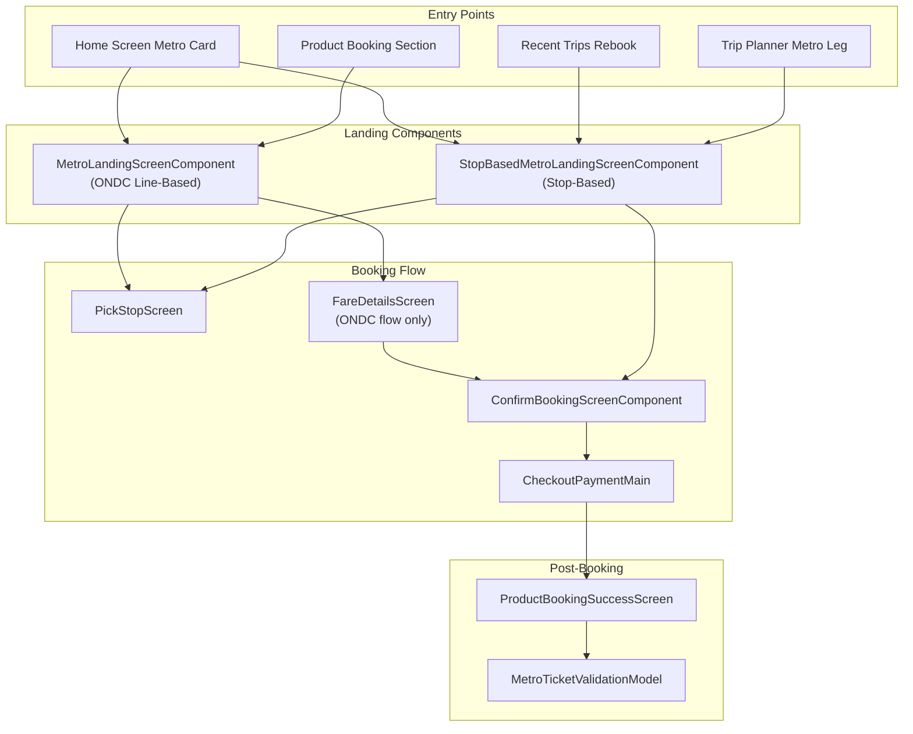
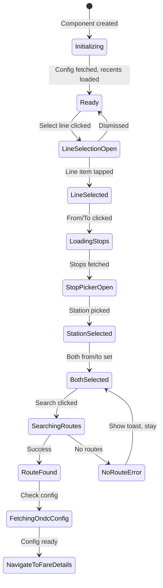
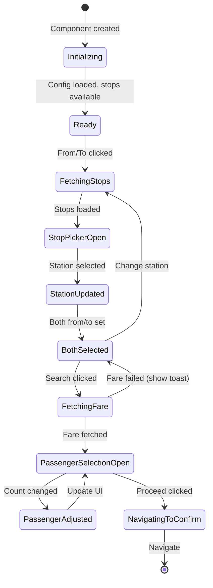
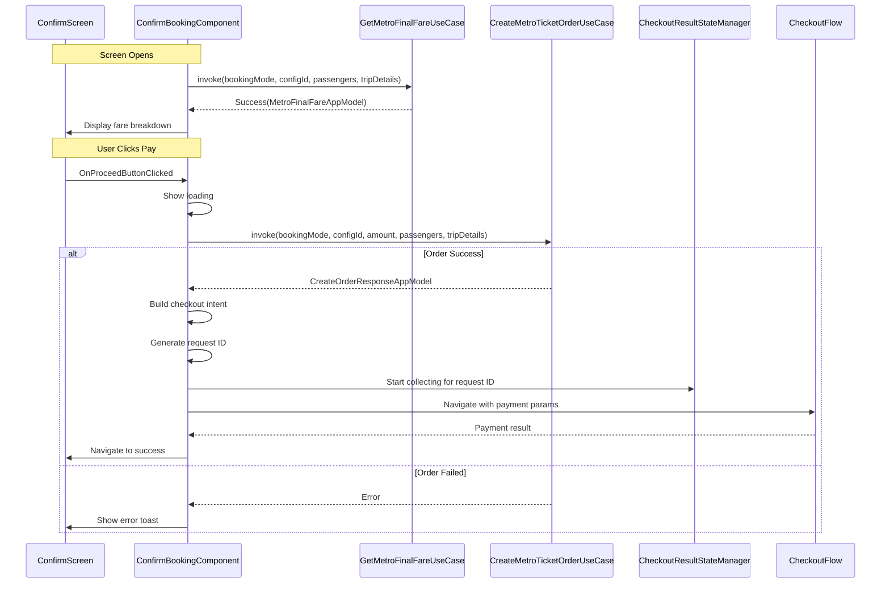
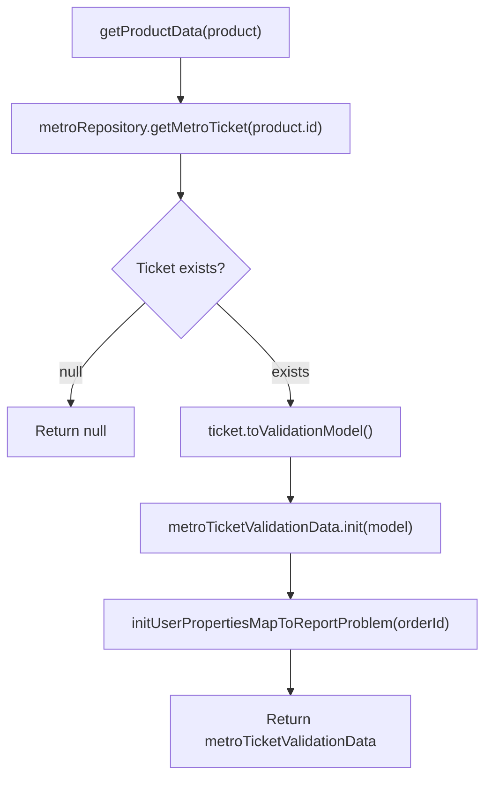
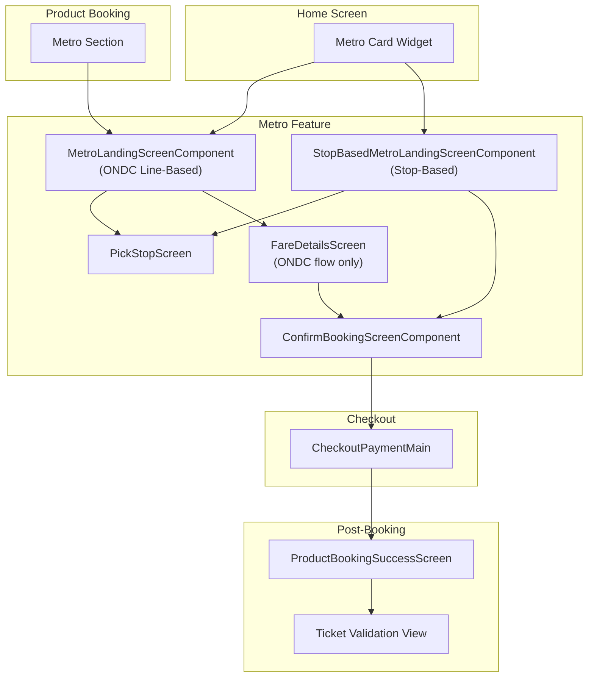

# Metro — Component Documentation

## Architecture Overview

The Metro presentation layer implements metro ticket booking through Decompose-based MVI components. The architecture supports two distinct booking journeys: line-based (ONDC flow) and stop-based (regular metro flow). Each screen component extends `ChaloBaseStateMviComponent` and manages its own data state, view state, and side effects. Components integrate with ONDC protocol for line-based booking and direct metro APIs for stop-based booking.



---

## Screen Inventory

| Screen | Component | File Location | Purpose |
|--------|-----------|---------------|---------|
| **Line-Based Landing** | MetroLandingScreenComponent | `shared/productbooking/.../metro/ui/landing/` | ONDC metro line selection and booking |
| **Stop-Based Landing** | StopBasedMetroLandingScreenComponent | `shared/productbooking/.../metro/ui/regular/` | Direct origin/destination selection |
| **Confirm Booking** | ConfirmBookingScreenComponent | `shared/productbooking/.../metro/ui/confirmbooking/` | Order review and payment initiation |
| **Ticket Validation** | MetroTicketValidationModel | `shared/home/.../metro/validation/` | QR display and gate validation |

---

## MetroLandingScreenComponent (Line-Based ONDC Flow)

The line-based landing component manages ONDC metro booking where users first select a metro line, then choose stations within that line. This component integrates with ONDC use cases for fetching metro lines and stops via the ONDC protocol.

### Component Dependencies

The component receives these dependencies via constructor injection:

| Dependency | Purpose |
|------------|---------|
| **ComponentContext** | Decompose lifecycle management |
| **CityProvider** | Current city information for API calls |
| **StringProvider** | Localized string resources |
| **BasicInfoContract** | True time for timestamp handling |
| **RecentRepositoryProvider** | Recent trip storage and retrieval |
| **RouteSearchResultStateManager** | Cross-screen result passing for pick stop |
| **FetchOndcMetroLinesUseCase** | Fetches available ONDC metro lines |
| **FetchOndcMetroLineStopsUseCase** | Fetches stops for a selected line |
| **FetchRoutesForGivenStopsUseCase** | Route search between selected stops |
| **FetchOndcConfigUseCase** | ONDC configuration retrieval |
| **ChaloNavigationManager** | Navigation request handling |
| **MetroLandingUiStateFactory** | Data-to-view state conversion |
| **KotlinToastManager** | Toast message display |
| **AnalyticsContract** | Analytics event tracking |

### Data State Structure

The `MetroLandingScreenDataState` holds all mutable state for this screen:

| Field | Type | Description |
|-------|------|-------------|
| **showLoadingDialog** | Boolean | Full-screen loading indicator visibility |
| **ondcConfigId** | String? | ONDC configuration identifier |
| **ondcAgencyName** | String? | Metro agency name from ONDC config |
| **pickStopRequestType** | PickStopRequestType | Current pick mode: FROM, TO, or NONE |
| **linesToStopListMap** | Map<String, List<StopAppModel>> | Cached stops per metro line ID |
| **metroLineItemStateList** | List<MetroLineListItemState>? | Available metro lines with selection state |
| **recentSearchedItems** | List<RecentStopAndRouteBasedAppModel> | User's recent metro trips |
| **selectedLine** | MetroLineListItemState? | Currently selected metro line |
| **selectedFromStation** | StopAppModel? | Selected origin station |
| **selectedToStation** | StopAppModel? | Selected destination station |
| **bottomSheetState** | MetroLandingScreenBottomSheetType | Current bottom sheet type |

### View Intents

| Intent | Trigger | Handler Behavior |
|--------|---------|-----------------|
| **InitialisationIntent** | Component created | Fetches ONDC config and loads recent trips |
| **OnSelectLineClicked** | Line selection button | Opens line selection bottom sheet, fetches lines if not cached |
| **OnLineSelectedClick(index)** | Line item tapped | Selects line, clears station selection, closes sheet |
| **OnFromStationClick** | From field tapped | Fetches stops for selected line, navigates to pick stop |
| **OnToStationClick** | To field tapped | Fetches stops for selected line, navigates to pick stop |
| **OnSwapButtonClick** | Swap icon tapped | Exchanges from and to stations |
| **OnSearchButtonClick** | Search button tapped | Validates selection, searches routes via ONDC |
| **OnStationPickedIntent(station)** | Station selected in picker | Updates from or to station based on request type |
| **OnRecentStationPairClicked(trip)** | Recent item tapped | Pre-fills line, from, and to from history |
| **BottomSheetDismissIntent** | Bottom sheet dismissed | Hides active bottom sheet |
| **OnCloseButtonClicked** | Close button tapped | Hides line selection sheet |

### State Flow Diagram



### Navigation Flow

When the user completes station selection and clicks search, the component performs these steps:

1. Validates both stations are selected and a line is chosen
2. Shows loading dialog
3. Calls `FetchRoutesForGivenStopsUseCase` with `RouteForStopPairRequestType.ONDC` and `ChaloTransitMode.METRO`
4. On success, stores the ONDC transaction ID from the response
5. Checks if selected OD pair exists in route results
6. Verifies ONDC config is available; fetches if missing
7. Navigates to `FareDetailsScreen` with `FareDetailsArgs` containing ONDC ticket parameters
8. Saves trip to recent history via `RecentRepositoryProvider`

### Bottom Sheet Types

| Type | Purpose |
|------|---------|
| **LineSelectionBottomSheet** | Displays available metro lines for user selection |
| **None** | No bottom sheet displayed |

### Metro Line Identification

The `MetroLine` enum maps line IDs to types:

| Line ID | Line Type | Color Association |
|---------|-----------|-------------------|
| **P1** | RED | Red line metro |
| **P2** | BLUE | Blue line metro |
| **P3** | GREEN | Green line metro |
| **""** | UNKNOWN | Fallback for unrecognized lines |

---

## StopBasedMetroLandingScreenComponent (Regular Metro Flow)

The stop-based landing component provides direct origin and destination selection without requiring line selection first. This is the primary flow for users who know their journey endpoints, and it uses the regular metro APIs rather than ONDC.

### Component Dependencies

| Dependency | Purpose |
|------------|---------|
| **ComponentContext** | Decompose lifecycle management |
| **StopBasedMetroLandingArgs** | Pre-filled from/to stops as JSON |
| **CityProvider** | Current city for stop filtering |
| **StringProvider** | Localized string resources |
| **BasicInfoContract** | True time access |
| **RecentRepositoryProvider** | Recent trip persistence |
| **RouteSearchResultStateManager** | Pick stop result handling |
| **FetchProductConfigsForUiUseCase** | Metro product configuration |
| **FetchAllMetroStopsUseCase** | All city metro stops |
| **FetchTicketBookingsFareUseCase** | Fare calculation for selected journey |
| **StopBasedMetroLandingUiStateFactory** | Data-to-view state mapping |
| **AnalyticsContract** | Event tracking |
| **GetProductCapabilitiesUseCase** | Operational hours check |
| **KotlinToastManager** | Toast display |
| **ChaloNavigationManager** | Navigation handling |

### Initialization Arguments

The component accepts `StopBasedMetroLandingArgs`:

| Parameter | Type | Description |
|-----------|------|-------------|
| **fromStop** | String? | JSON-encoded origin stop for pre-fill |
| **toStop** | String? | JSON-encoded destination stop for pre-fill |

When both stops are pre-filled, the component automatically triggers fare fetch on initialization.

### Data State Structure

| Field | Type | Description |
|-------|------|-------------|
| **bookingFareAppModel** | TicketBookingFareAppModel? | Fetched fare details for journey |
| **showLoadingDialog** | Boolean | Loading indicator state |
| **configId** | String? | Metro product config ID |
| **agencyName** | String? | Metro agency name |
| **productTnc** | List<String>? | Terms and conditions from config |
| **pickStopRequestType** | PickStopRequestType | Current pick mode |
| **applicableStopList** | List<StopAppModel> | All metro stops in city |
| **recentStopBasedTripAppModel** | List<RecentStopBasedTripAppModel> | Recent trips |
| **selectedFromStation** | StopAppModel? | Selected origin |
| **selectedToStation** | StopAppModel? | Selected destination |
| **bottomSheetState** | StopBasedMetroLandingScreenBottomSheetType | Active bottom sheet |
| **passengerSelectionMap** | Map<String, MetroPassengerTypeDataModel>? | Passenger type counts |
| **operationHours** | OperationalHoursAppModel? | Service operational hours |

### View Intents

| Intent | Trigger | Handler Behavior |
|--------|---------|-----------------|
| **InitialisationIntent(startStop?, endStop?)** | Component init | Loads config, recents, sets pre-filled stops, auto-searches if both set |
| **OnFromStationClick** | From field tapped | Fetches all metro stops, navigates to picker |
| **OnToStationClick** | To field tapped | Fetches all metro stops, navigates to picker |
| **OnSwapButtonClick** | Swap button | Exchanges from/to, clears fare cache |
| **OnSearchButtonClick** | Search button | Fetches fare, shows passenger selection on success |
| **OnStationPickedIntent(station)** | Station selected | Updates from/to, clears fare cache |
| **OnRecentStopBasedTripPairClicked(appModel)** | Recent item | Pre-fills stations from history, clears fare |
| **OnPassengerIncreaseCountClick(id)** | Plus button | Increments passenger count for type |
| **OnPassengerDecreaseCountClick(id)** | Minus button | Decrements passenger count for type |
| **OnProceedButtonClicked** | Proceed button | Builds screen data, navigates to confirm screen |
| **OnCloseButtonClicked** | Close button | Dismisses passenger selection sheet |
| **BottomSheetDismissIntent** | Sheet dismissed | Hides bottom sheet |

### Passenger Type Data Model

| Field | Type | Description |
|-------|------|-------------|
| **id** | String | Passenger type identifier from fare API |
| **name** | String | Display name (Adult, Child, Senior, etc.) |
| **selectedCount** | Int | Current selected count |
| **maxCount** | Int | Maximum allowed (from seat limits) |
| **minCount** | Int | Minimum required (from seat limits) |

### State Flow Diagram



### Bottom Sheet Types

| Type | Purpose |
|------|---------|
| **PassengerSelection** | Shows passenger count selection with fare summary |
| **None** | No bottom sheet displayed |

### Fare Caching Behavior

The component caches fare results to avoid redundant API calls. The cache is cleared when:
- User selects a different origin station
- User selects a different destination station
- User swaps from/to stations

If fare is already cached, tapping search immediately shows the passenger selection bottom sheet.

### Navigation to Confirm Screen

When proceeding, the component builds `ConfirmationBookingScreenData`:

| Field | Value Source |
|-------|-------------|
| **transitMode** | ChaloTransitMode.METRO |
| **bookingMode** | SingleJourney if 1 passenger, Group if >1 |
| **configId** | From product config fetch |
| **agencyName** | From product config fetch |
| **tripDetails** | From/to stop models |
| **passengerDetailsList** | Mapped from passenger selection map |
| **tncList** | From product config terms |

---

## ConfirmBookingScreenComponent

The confirmation screen displays the final booking summary, fetches detailed fare breakdown, and handles order creation and payment initiation.

### Component Dependencies

| Dependency | Purpose |
|------------|---------|
| **ComponentContext** | Decompose lifecycle management |
| **ConfirmBookingScreenArgs** | Screen data as JSON string |
| **StringProvider** | Localized strings |
| **AnalyticsContract** | Event tracking |
| **ConfirmBookingUIStateFactory** | View state conversion |
| **GetMetroFinalFareUseCase** | Final fare breakdown calculation |
| **CreateMetroTicketOrderUseCase** | Order creation |
| **UserProfileDetailsProvider** | User details for checkout intent |
| **TimeUtilsContract** | Date formatting for checkout |
| **CheckoutResultStateManager** | Payment result handling |
| **KotlinToastManager** | Toast notifications |
| **ChaloNavigationManager** | Navigation handling |

### Screen Arguments

The component receives `ConfirmBookingScreenArgs`:

| Parameter | Type | Description |
|-----------|------|-------------|
| **screenData** | String | JSON-encoded ConfirmationBookingScreenData |

### Initialization Flow

On component creation:
1. Deserializes screen data from JSON
2. Processes InitialisationIntent with screen data
3. Recovers any pending checkout result state from state keeper
4. Sets up checkout result collector if recovering from process death

### Data State Structure

| Field | Type | Description |
|-------|------|-------------|
| **transitMode** | ChaloTransitMode | Always METRO for this flow |
| **bookingMode** | ChaloTicketBookingMode | SingleJourney or Group |
| **showLoadingDialog** | Boolean | Order creation processing indicator |
| **configId** | String? | Metro configuration ID |
| **agencyName** | String? | Metro agency name |
| **tripDetails** | ConfirmationScreenTripDetails? | From/to stop details |
| **passengerDetailsList** | List<ConfirmBookingPassengerDetails>? | Passenger type breakdown |
| **finalAmount** | Long? | Confirmed total fare from API |
| **fareBreakup** | List<FareBreakupAppModel>? | Itemized fare components |
| **tncList** | List<String>? | Terms and conditions |
| **showFareLoadingShimmer** | Boolean | Fare loading skeleton state |
| **showFareFailedSnackbar** | Boolean | Fare fetch error indicator |
| **showTncDialog** | Boolean | T&C dialog visibility |

### View Intents

| Intent | Trigger | Handler Behavior |
|--------|---------|-----------------|
| **InitialisationIntent(screenData)** | Screen opened | Sets data state, initiates final fare fetch |
| **OnRetryFareFetchClicked** | Retry button | Re-fetches final fare breakdown |
| **OnProceedButtonClicked** | Pay button | Creates order, initiates checkout flow |
| **OnPaymentCompletedIntent(bookingId)** | Checkout success | Navigates to success screen |
| **OnTermsAndConditionsClicked** | T&C text tapped | Shows T&C dialog |
| **TnCAcceptClickIntent** | T&C dialog accepted | Dismisses T&C dialog |

### Order Creation Sequence



### Checkout Intent Building

The component builds a metro ticket checkout intent using `getMetroTicketCheckoutIntentModel`:

| Field | Source |
|-------|--------|
| **orderData** | CreateOrderResponseAppModel from order creation |
| **agencyName** | From screen data |
| **userId** | From UserProfileDetailsProvider |
| **phoneNumber** | From UserProfileDetailsProvider |
| **bookingDate** | Formatted from order response booking time |
| **source** | Source.CONFIRM_BOOKING_SCREEN.name |

### Payment Result Handling

The component uses `CheckoutResultStateManager` to handle payment outcomes:

| Result Type | Action |
|-------------|--------|
| **Success** | Extracts booking ID, processes OnPaymentCompletedIntent |
| **Failed** | Returns to confirm screen silently |
| **Cancelled** | No action, stays on confirm screen |

---

## MetroTicketValidationModel

The validation model represents metro ticket data for QR display and gate validation. This class implements the `ProductValidationModel` interface from the validation SDK.

### Model Structure

| Field | Type | Description |
|-------|------|-------------|
| **status** | MetroTicketStatus | Current ticket status |
| **transactionId** | String | Transaction identifier (empty for metro) |
| **paymentMode** | String | Payment method used (empty for metro) |
| **qrCode** | String? | QR code data for gate scanning |
| **soundStaticTone** | String? | Validation sound identifier |
| **expiryTime** | Long | Ticket activation expiry timestamp |
| **activationDuration** | Long? | Validity period in milliseconds |
| **amount** | Int | Fare amount in paise |
| **orderId** | String | Booking ID reference |
| **punchTime** | Long? | Gate punch timestamp |
| **productName** | String | Fixed: MetroTicketConstants.PRODUCT_NAME |
| **bookingTime** | Long? | Booking creation timestamp |
| **passengerDetails** | Map<String, Int>? | Passenger counts by type |
| **routeName** | String? | Metro line name |
| **startStopName** | String? | Origin station display name |
| **startStopId** | String? | Origin station ID |
| **endStopName** | String? | Destination station display name |
| **endStopId** | String? | Destination station ID |
| **validationInfoList** | List<TicketValidationInfo>? | Historical validation records |

### Product Type Overrides

| Property | Value |
|----------|-------|
| **productType** | MetroTicketConstants.PRODUCT_TYPE |
| **productSubType** | MetroTicketConstants.PRODUCT_SUB_TYPE |

### Conversion Extension

The `MetroTicketAppModel.toValidationModel()` extension converts app model to validation model:

| App Model Field | Validation Model Field | Transformation |
|-----------------|----------------------|----------------|
| **status** | status | Direct mapping |
| **qrCode** | qrCode | Direct mapping |
| **validationInfoList** | validationInfoList | Direct mapping |
| **tone** | soundStaticTone | Direct mapping |
| **activationExpiryTime** | expiryTime | Uses -1L if null |
| **activationExpiryTime - bookingTime** | activationDuration | Calculated duration |
| **amount** | amount | Cast to Int |
| **bookingId** | orderId | Direct mapping |
| **punchTime** | punchTime | Direct mapping |
| **bookingTime** | bookingTime | Direct mapping |
| **passengerDetails** | passengerDetails | Direct mapping |
| **routeName** | routeName | Direct mapping |
| **startStopDetails?.name** | startStopName | Extracted from nested |
| **startStopDetails?.id** | startStopId | Extracted from nested |
| **endStopDetails?.name** | endStopName | Extracted from nested |
| **endStopDetails?.id** | endStopId | Extracted from nested |
| **""** | transactionId | Empty string |
| **""** | paymentMode | Empty string |
| **MetroTicketConstants.PRODUCT_NAME** | productName | Constant |

### Activation Time Helper

The `getActivationTimestampMS()` extension calculates the activation start time:

```
activationDuration != null: expiryTime - activationDuration
activationDuration == null: 0L
```

---

## MetroTicketProductValidationConfig

Configures the validation behavior for metro tickets in the product validation SDK.

### Dependencies

| Dependency | Purpose |
|------------|---------|
| **MetroRepository** | Fetches ticket data for validation |
| **MetroTicketValidationData** | Wraps validation model with state |
| **MetroTicketProductValidationUIManager** | UI customization |
| **GetNumDigitsOfHashValueForEasyVerificationUseCase** | Hash digit count |
| **GenerateHashCodeForEasyVerificationUseCase** | Hash generation |
| **MetroTicketValidationAnalyticManager** | Analytics tracking |
| **MetroTicketValidationNavigationManager** | Navigation handling |
| **MetroTicketValidationReportProblemManager** | Problem reporting |

### Configuration Methods

| Method | Return Type | Purpose |
|--------|-------------|---------|
| **getProductData(product)** | ProductValidationData? | Fetches ticket from repository, converts to validation model |
| **getProductValidationAnalyticsManager()** | ProductValidationAnalyticManager | Returns analytics manager |
| **getProductValidationNavigationManager()** | ProductValidationNavigationManager | Returns navigation manager |
| **getProductValidationUIManager()** | ProductValidationUIManager | Returns UI manager |
| **getValidationReportProblemDataManager()** | ProductValidationReportProblemManager | Returns problem manager |
| **numDigitsOfHashValue()** | Int | Hash digits for easy verification |
| **hash(strToHash, digits)** | String | Generates hash code |
| **onProductReceiptDataReceived(...)** | Boolean | Validates product ID match |

### getProductData Implementation



### Metro-Specific Behaviors

Several validation config methods return empty or false for metro tickets:

| Method | Return | Reason |
|--------|--------|--------|
| **onPunchEvent** | false | Metro uses QR gates, not conductor punch |
| **getProductReceiptDataFromBleDataReceived** | null | BLE validation not used |
| **getProductReceiptDataFromProductPunchDataFromPolling** | null | Polling punch not used |
| **onPunchDataReceivedOverBle** | false | BLE not applicable |
| **getReceiptDataFromPunchEvent** | null | No punch-based receipts |

---

## View State Structures

### MetroLandingScreenViewState (Line-Based)

| Field | Type | Description |
|-------|------|-------------|
| **uiSpec** | MetroLandingScreenUISpec | Layout specifications |
| **toolbarUIState** | ToolbarUIState | Toolbar configuration |
| **loadingDialogUIState** | LoadingDialogUIState? | Loading dialog state |
| **metroFromToSelectionContainerUIState** | MetroFromToSelectionContainerUIState? | Stop selection UI config |
| **recentStopSearchedUiState** | RecentlySearchedContainerUiState? | Recent trips section |
| **bottomSheetUIStateType** | MetroLandingScreenBottomSheetUiStateType | Bottom sheet view state |
| **benefitsContainerUiState** | MetroTicketBenefitsContainerUiState? | Benefits section UI |
| **sectionDividerUiState** | DividerUIState | Section divider styling |

### StopBasedMetroLandingScreenViewState

| Field | Type | Description |
|-------|------|-------------|
| **uiSpec** | StopBasedMetroLandingScreenUISpec | Layout specifications |
| **toolbarUIState** | ToolbarUIState | Toolbar configuration |
| **loadingDialogUIState** | LoadingDialogUIState? | Loading dialog state |
| **fromToSelectionContainerUIState** | StopBasedMetroFromToSelectionContainerUIState? | Stop selection UI |
| **recentStopSearchedUiState** | RecentlySearchedContainerUiState? | Recent trips section |
| **bottomSheetUIStateType** | StopBasedMetroLandingScreenBottomSheetUiStateType | Bottom sheet state |
| **operationalHoursUiState** | OperationalHoursUiState? | Service hours display |

### ConfirmBookingScreenViewState

| Field | Type | Description |
|-------|------|-------------|
| **uiSpec** | ConfirmBookingScreenUISpec | Layout specifications |
| **toolbarUIState** | ToolbarUIState | Toolbar configuration |
| **loadingDialogUIState** | LoadingDialogUIState? | Loading dialog state |
| **tripSummaryUiState** | TripSummaryUiState | Journey summary display |
| **passengerListUiState** | PassengerListUiState? | Passenger breakdown |
| **fareBreakupUiState** | FareBreakupUiState? | Itemized fare display |
| **tncButtonUiState** | TncButtonUiState? | T&C link button |
| **proceedButtonUiState** | ProceedButtonUiState | Pay button state |
| **fareShimmerUiState** | ShimmerUiState? | Loading skeleton for fare |
| **fareErrorSnackbarUiState** | SnackbarUiState? | Error snackbar |
| **tncDialogUiState** | TncDialogUiState? | T&C dialog content |

---

## Navigation Graph



### Navigation Arguments

| Screen | Args Class | Key Parameters |
|--------|------------|----------------|
| **StopBasedMetroLanding** | StopBasedMetroLandingArgs | fromStop (JSON), toStop (JSON) |
| **PickStop** | PickStopArgs | requestId, mode, productBookingStopList, source |
| **FareDetails** | FareDetailsArgs | fareDetailsData, productBookingFlowType, screenType |
| **ConfirmBooking** | ConfirmBookingScreenArgs | screenData (JSON-encoded ConfirmationBookingScreenData) |
| **Checkout** | CheckoutPaymentMainArgs | requestId, intentModelJson |
| **Success** | ProductBookingSuccessScreenArgs | bookingId, productBookingSuccessScreenType |

---

## Analytics Events

### Stop-Based Landing Analytics

| Event Constant | Trigger |
|----------------|---------|
| **STOP_BASED_METRO_LANDING_SCREEN_OPENED** | Screen displayed |
| **FROM_STATION_CLICKED** | From field tapped |
| **TO_STATION_CLICKED** | To field tapped |
| **STOP_SELECTED** | Station picked (includes stop_type: FROM/TO) |
| **SWAP_BUTTON_CLICKED** | Swap tapped (includes from/to names) |
| **SEARCH_BUTTON_CLICKED** | Search tapped |
| **METRO_FARE_FETCH_SUCCESS** | Fare loaded (includes count) |
| **METRO_FARE_FETCH_FAILED** | Fare fetch error (includes error) |
| **METRO_CONFIG_FETCH_SUCCESS** | Config loaded (includes isActive, configId) |
| **METRO_CONFIG_FETCH_FAILED** | Config error |
| **METRO_ALL_STATIONS_FETCH_SUCCESS** | Stops loaded (includes count) |
| **METRO_ALL_STATIONS_FETCH_FAILED** | Stops error |
| **RECENT_STOP_BASED_TRIP_CLICKED** | Recent item tapped (includes stop IDs/names) |
| **PROCEED_BUTTON_CLICKED** | Proceed tapped |

### Line-Based Landing Analytics

| Event Constant | Trigger |
|----------------|---------|
| **STOP_BASED_ROUTE_SELECTION_ROUTE_RESULT_SUCCESS** | Route search success (includes total_results) |
| **STOP_BASED_ROUTE_SELECTION_ROUTE_RESULT_FAILURE** | Route search failed |

### Confirm Screen Analytics

| Event Constant | Trigger |
|----------------|---------|
| **CONFIRM_SCREEN_OPENED** | Screen displayed (includes bookingMode, passengers, trip) |
| **PAY_BUTTON_CLICKED** | Pay tapped (includes fare) |
| **RETRY_BUTTON_CLICKED** | Retry tapped |
| **CONFIRM_FINAL_FARE_FETCH_SUCCESS** | Final fare loaded (includes fare) |
| **CONFIRM_FINAL_FARE_FETCH_FAILED** | Final fare error (includes error) |
| **CONFIRM_ORDER_API_SUCCESS** | Order created (includes orderId, transactionId) |
| **CONFIRM_ORDER_API_FAILURE** | Order error (includes error) |

---

## Error Handling

| Error Scenario | Component | UI Response |
|----------------|-----------|-------------|
| **ONDC config fetch failed** | LineLanding | Silent retry on next action |
| **Metro lines fetch failed** | LineLanding | Toast, no bottom sheet opens |
| **Stops fetch failed** | Both Landing | Toast with error description |
| **No routes available** | LineLanding | Toast: "No route available for given stops" |
| **Route not in results** | LineLanding | Toast: "Route not available" |
| **Same from/to selected** | Both | Filtered out during stop list preparation |
| **Fare fetch failed** | StopLanding | Toast with error, no bottom sheet |
| **Config fetch failed** | StopLanding | Toast, returns from fetch flow |
| **Final fare fetch failed** | Confirm | Snackbar with retry button |
| **Order creation failed** | Confirm | Toast with error message |
| **Payment failed** | Confirm | Silent return to confirm screen |
| **Network offline** | All | Toast: "Something went wrong" |
| **City not available** | All | Returns UnavailableCityDetails error |

---

## Platform Considerations

### Shared (Compose Multiplatform)

All metro components use Compose Multiplatform with SKIE annotations for iOS interop:

| File | Purpose |
|------|---------|
| **MetroLandingScreen.kt** | Composable entry point for line-based |
| **MetroLandingScreenUI.kt** | UI implementation for line-based |
| **StopBasedMetroLandingScreen.kt** | Composable entry point for stop-based |
| **StopBasedMetroLandingScreenUI.kt** | UI implementation for stop-based |
| **ConfirmBookingScreen.kt** | Composable entry point for confirmation |
| **ConfirmBookingScreenUI.kt** | UI implementation for confirmation |

### Component Context Features

All components extend `ChaloBaseStateMviComponent` and receive `ComponentContext` for:

| Feature | Usage |
|---------|-------|
| **Lifecycle** | Coroutine scope tied to component lifecycle |
| **StateKeeper** | State restoration for process death (checkout recovery) |
| **componentScope** | CoroutineScope for async operations |
| **stateKeeper** | Serializable state persistence |
| **doWhenLifecycleStarted** | Deferred navigation requests |

### SKIE Annotations

| Annotation | Usage |
|------------|-------|
| **@SealedInterop.Enabled** | View intent sealed classes for iOS |
| **@EnumInterop.Enabled** | Enum classes exposed to iOS |
