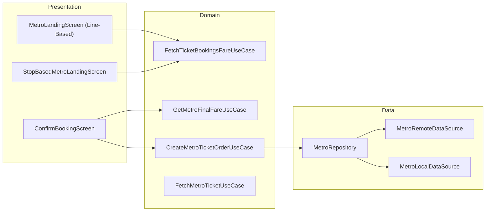

# Metro — High-Level Design

## Overview

The Metro feature enables users to book metro tickets within the Chalo app. It supports two booking journeys: line-based (select metro line first, then stops) and stop-based (select origin/destination directly). The feature includes ONDC integration for metro services, passenger selection, fare calculation, and ticket validation via QR codes.

## User Journey

1. **Entry Points**:
   - Home screen → Metro card
   - Product booking → Metro section
   - Recent trips → Rebook metro

2. **Core Flow**:
   - Select booking mode (line-based or stop-based)
   - Choose from/to metro stations
   - Fetch fare details
   - Select passenger count and types
   - Confirm booking and pay
   - Receive ticket with QR code

3. **Exit Points**:
   - Ticket activated → QR display
   - Payment failed → Retry
   - Ticket used/expired → History

## Architecture Diagram



## Key Components

| Component | Platform | File Path | Responsibility |
|-----------|----------|-----------|----------------|
| `MetroLandingScreenComponent` | Shared | `shared/productbooking/.../metro/ui/landing/MetroLandingScreenComponent.kt` | Line-based booking |
| `StopBasedMetroLandingScreenComponent` | Shared | `shared/productbooking/.../metro/ui/regular/StopBasedMetroLandingScreenComponent.kt` | Stop-based booking |
| `ConfirmBookingScreenComponent` | Shared | `shared/productbooking/.../metro/ui/confirmbooking/ConfirmBookingScreenComponent.kt` | Order confirmation |
| `CreateMetroTicketOrderUseCase` | Shared | `shared/productbooking/.../metro/domain/CreateMetroTicketOrderUseCase.kt` | Order creation |
| `MetroRepository` | Shared | `shared/productbooking/.../metro/repository/MetroRepository.kt` | Data management |
| `MetroTicketValidationModel` | Shared | `shared/home/.../metro/validation/MetroTicketValidationModel.kt` | Ticket validation |

## Data Flow

### Line-Based Booking
1. `MetroLandingScreenComponent` initializes with ONDC config
2. User selects metro line from available lines
3. `FetchOndcMetroLineStopsUseCase` fetches stops for selected line
4. User selects from/to stations
5. Search routes and navigate to fare details
6. Navigate to confirmation screen

### Stop-Based Booking
1. `StopBasedMetroLandingScreenComponent` shows all metro stops
2. User selects origin and destination directly
3. `FetchTicketBookingsFareUseCase` calculates fare
4. User adjusts passenger count
5. `ConfirmBookingScreenComponent` shows final fare
6. `CreateMetroTicketOrderUseCase` creates order
7. Payment processed, ticket activated

### Ticket Validation
1. User opens ticket from bookings
2. QR code displayed for scanning
3. Metro gate validates QR
4. Ticket status updated (TAPPED_IN, USED)
5. Receipt stored locally

## Platform Differences

### Android-Specific
- Native Compose UI for metro screens
- QR code rendering via Android canvas
- Native date picker for journey date

### iOS-Specific
- Compose Multiplatform UI
- iOS-specific validation UI
- SwiftUI integration via SKIE annotations

## Integration Points

### Analytics Events
- See [Analytics: metro](/analytics/flows/metro) for event documentation
- Key events:
  - `metro_landing_screen_opened`
  - `metro_line_selected`
  - `metro_from_to_stations_selected`
  - `metro_fare_fetched`
  - `metro_booking_confirmed`
  - `metro_ticket_validated`

### Shared Services
- **Payment**: Checkout for ticket payment
- **ONDC**: Metro services via ONDC protocol
- **Validation**: QR-based metro gate validation

### Navigation
- **Navigates to**: Stop picker, Fare details, Checkout, Ticket display
- **Navigated from**: Home, Product booking, Recent trips

## Booking Modes

### Line-Based Flow
- User selects metro line first
- Shows stops specific to that line
- Good for users familiar with metro network

### Stop-Based Flow
- Direct origin/destination selection
- Shows all metro stops citywide
- Faster for known journeys

## Ticket Status Lifecycle

```
PAYMENT_PROCESSING
  ↓ (Payment success)
ACTIVE
  ↓ (User enters metro)
TAPPED_IN
  ↓ (User exits metro)
USED
  OR
  ↓ (Time passes)
EXPIRED
  OR
  ↓ (User cancels)
CANCELLED
```

## Edge Cases & Error Handling

| Scenario | Handling |
|----------|----------|
| Line not available | Shows empty state with message |
| Fare fetch failed | Shows retry with error message |
| Payment failed | Shows failure with retry option |
| Ticket validation failed | Shows manual validation option |
| ONDC service unavailable | Falls back to direct metro booking |
| Same from/to selected | Disables proceed button |

## Data Models

### MetroTicketAppModel
```kotlin
data class MetroTicketAppModel(
    val bookingId: String,
    val status: MetroTicketStatus,
    val qrCode: String?,
    val fromStation: MetroStopDetails,
    val toStation: MetroStopDetails,
    val fare: Long,
    val validUntil: Long,
    val passengers: List<PassengerDetails>
) {
    fun isExpired(chaloTime: Long): Boolean
    fun isActive(chaloTime: Long): Boolean
}
```

### MetroTicketStatus
```kotlin
enum class MetroTicketStatus {
    ACTIVE,
    PAYMENT_PROCESSING,
    USED,
    TAPPED_IN,
    EXPIRED,
    CANCELLED,
    FAILED
}
```

### MetroFinalFareAppModel
```kotlin
data class MetroFinalFareAppModel(
    val totalFare: Long,
    val fareBreakdown: List<FareComponent>,
    val termsAndConditions: List<String>,
    val passengers: List<PassengerDetailAppModel>
)
```

## ONDC Integration

### ONDC Metro Flow
1. Fetch ONDC config for metro providers
2. Query available lines via ONDC protocol
3. Fetch stops and fares through ONDC
4. Create booking via ONDC
5. Separate validation flow for ONDC tickets

### OndcMetroLinesUseCase
- Fetches metro lines from ONDC network
- Returns provider and line information
- City-specific configuration

## Dependencies

### Internal
- `shared:productbooking` — Metro booking module
- `shared:home` — Metro validation module
- `shared:checkout` — Payment processing
- `shared:chalo-base` — Base models

### External
- SQLDelight — Local ticket storage
- ONDC Protocol — Metro service integration
- QR Code Library — Ticket QR generation
