# Metro — Repository Documentation

## Data Layer Overview

The Metro data layer manages metro ticket booking data through a clean architecture pattern with repository interfaces, implementations, remote data sources, local data sources, and DAO classes. The layer handles fare calculations, order creation, ticket persistence, and status synchronization. All network operations route through the remote data source, while local operations use SQLDelight-based persistence.

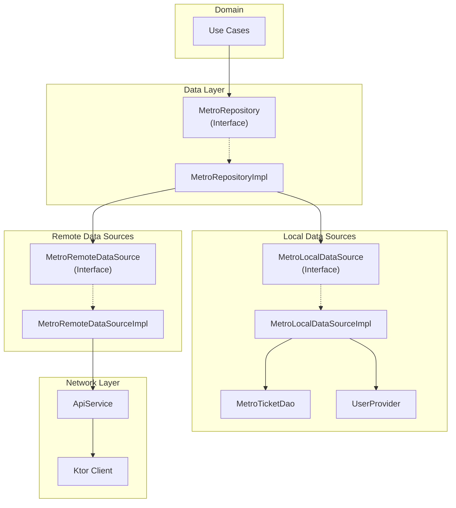
```mermaid
flowchart TB
    subgraph Domain
        UseCases["Use Cases"]
    end

    subgraph Data["Data Layer"]
        RepoInterface["MetroRepository<br/>(Interface)"]
        RepoImpl["MetroRepositoryImpl"]
    end

    subgraph Remote["Remote Data Sources"]
        RemoteInterface["MetroRemoteDataSource<br/>(Interface)"]
        RemoteImpl["MetroRemoteDataSourceImpl"]
    end

    subgraph Local["Local Data Sources"]
        LocalInterface["MetroLocalDataSource<br/>(Interface)"]
        LocalImpl["MetroLocalDataSourceImpl"]
        DAO["MetroTicketDao"]
        UserProvider["UserProvider"]
    end

    subgraph Network["Network Layer"]
        ApiService["ApiService"]
        Ktor["Ktor Client"]
    end

    UseCases --> RepoInterface
    RepoInterface -.-> RepoImpl
    RepoImpl --> RemoteInterface
    RepoImpl --> LocalInterface
    RemoteInterface -.-> RemoteImpl
    LocalInterface -.-> LocalImpl
    RemoteImpl --> ApiService
    ApiService --> Ktor
    LocalImpl --> DAO
    LocalImpl --> UserProvider
```

---

## Repository Interfaces

### MetroRepository

The primary repository interface for all metro operations. Combines remote API calls with local storage management.

| Method | Returns | Description |
|--------|---------|-------------|
| **getTicketBookingFareDetails** | List<TicketBookingFareAppModel> | Calculate fare for journey |
| **getMetroFinalFare** | MetroFinalFareAppModel | Get final fare with breakdown |
| **createMetroTicketOrder** | CreateOrderResponseAppModel | Create ticket order |
| **fetchMetroTicketProductById** | MetroTicketApiModel | Fetch ticket from API |
| **updateBooking** | Unit | Update booking status |
| **getMetroLiveBookingStatus** | List<MetroLiveBookingStatusAppModel> | Bulk status check |
| **insertMetroTicket** | Unit | Store ticket locally |
| **insertMetroLiveBookingStatus** | Unit | Batch update statuses |
| **getMetroTicket** | MetroTicketAppModel? | Get ticket from local storage |
| **getMetroTicketAsFlow** | Flow<MetroTicketAppModel?> | Observe ticket changes |

---

## MetroRepositoryImpl

The repository implementation coordinates between remote and local data sources, handling data transformation and error propagation.

### Dependencies

| Dependency | Purpose |
|------------|---------|
| **MetroRemoteDataSource** | API operations |
| **MetroLocalDataSource** | Local persistence |

### Method Implementations

#### getTicketBookingFareDetails

Delegates to remote data source for fare calculation.

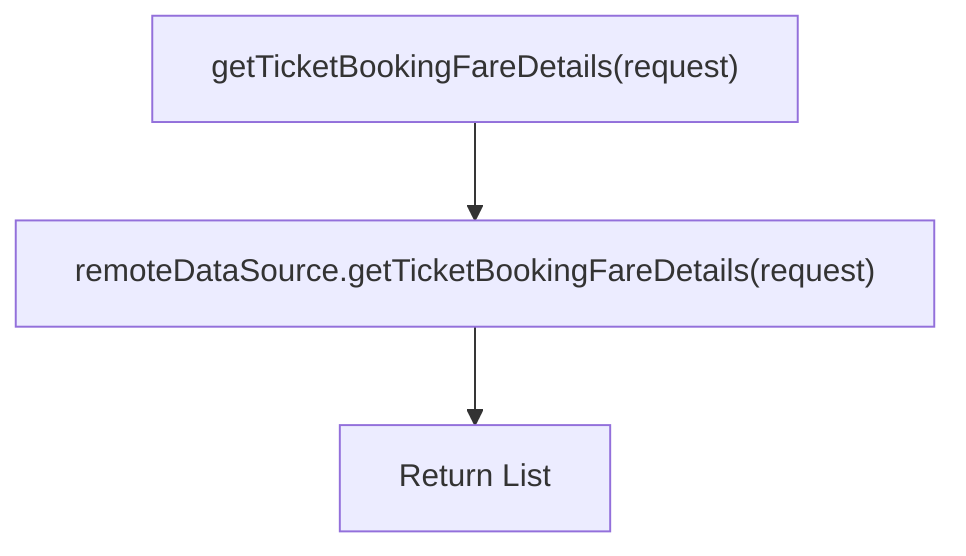
```mermaid
flowchart TD
    Start["getTicketBookingFareDetails(request)"]
    CallRemote["remoteDataSource.getTicketBookingFareDetails(request)"]
    ReturnResult["Return List<TicketBookingFareAppModel>"]

    Start --> CallRemote
    CallRemote --> ReturnResult
```

**Input:** `TicketBookingFareRequestAppModel`
- configId: String
- city: String
- tripDetails: TicketBookingTripData
- transitMode: ChaloTransitMode

**Output:** `List<TicketBookingFareAppModel>`

#### getMetroFinalFare

Fetches final fare breakdown from remote.

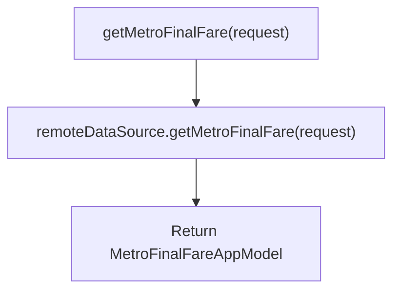
```mermaid
flowchart TD
    Start["getMetroFinalFare(request)"]
    CallRemote["remoteDataSource.getMetroFinalFare(request)"]
    ReturnResult["Return MetroFinalFareAppModel"]

    Start --> CallRemote
    CallRemote --> ReturnResult
```

**Input:** `TicketFinalFareRequestAppModel`
- configId: String
- cityName: String
- bookingMode: ChaloTicketBookingMode
- passengerDetails: List<PassengerDetailData>
- tripDetails: MetroTicketTripDetails?
- transitMode: ChaloTransitMode

**Output:** `MetroFinalFareAppModel`

#### createMetroTicketOrder

Creates order via remote data source.

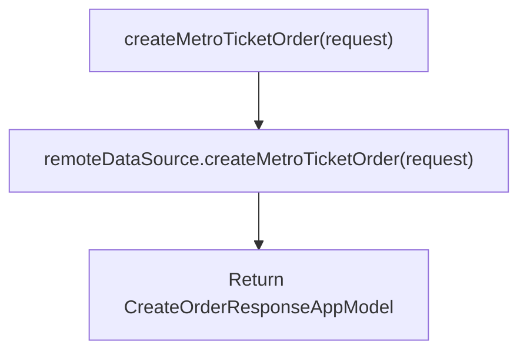
```mermaid
flowchart TD
    Start["createMetroTicketOrder(request)"]
    CallRemote["remoteDataSource.createMetroTicketOrder(request)"]
    ReturnResult["Return CreateOrderResponseAppModel"]

    Start --> CallRemote
    CallRemote --> ReturnResult
```

**Input:** `MetroTicketOrderRequestAppModel`
- configId: String
- city: String
- bookingMode: ChaloTicketBookingMode
- amount: Long
- passengerDetails: List<MetroTicketOrderFarePassengerDetail>
- tripDetails: MetroTicketTripDetails?

**Output:** `CreateOrderResponseAppModel`

#### fetchMetroTicketProductById

Fetches ticket from API by booking ID and product type.

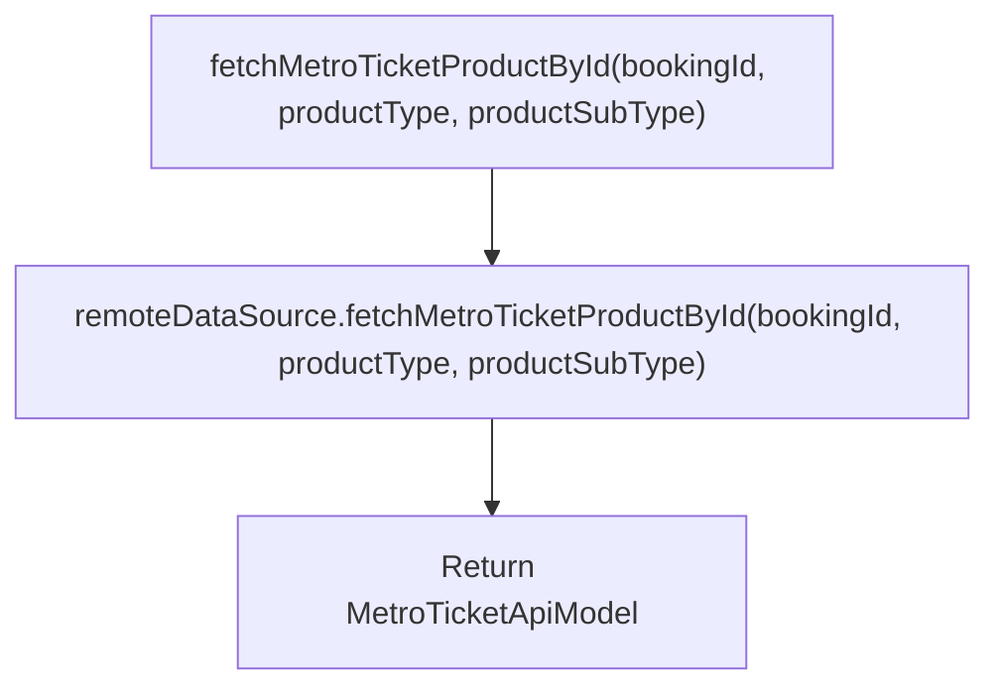
```mermaid
flowchart TD
    Start["fetchMetroTicketProductById(bookingId, productType, productSubType)"]
    CallRemote["remoteDataSource.fetchMetroTicketProductById(bookingId, productType, productSubType)"]
    ReturnResult["Return MetroTicketApiModel"]

    Start --> CallRemote
    CallRemote --> ReturnResult
```

**Input:**
- bookingId: String
- productType: String
- productSubType: String

**Output:** `MetroTicketApiModel`

#### getMetroTicket

Retrieves ticket from local storage.

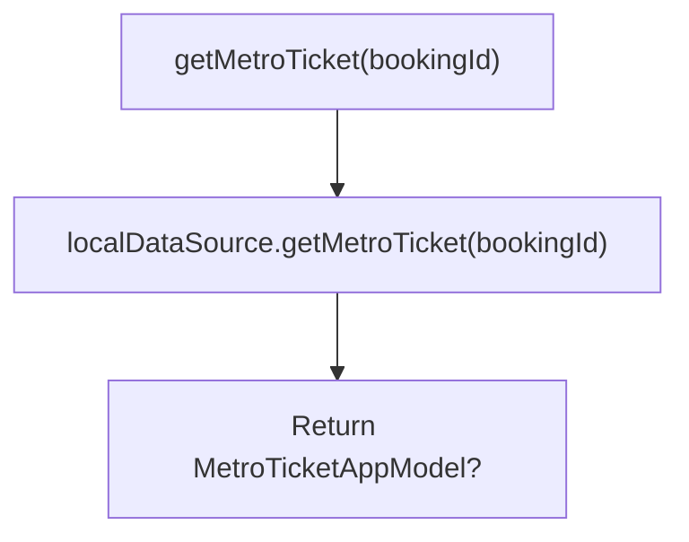
```mermaid
flowchart TD
    Start["getMetroTicket(bookingId)"]
    CallLocal["localDataSource.getMetroTicket(bookingId)"]
    ReturnResult["Return MetroTicketAppModel?"]

    Start --> CallLocal
    CallLocal --> ReturnResult
```

#### getMetroTicketAsFlow

Returns reactive Flow from local storage.

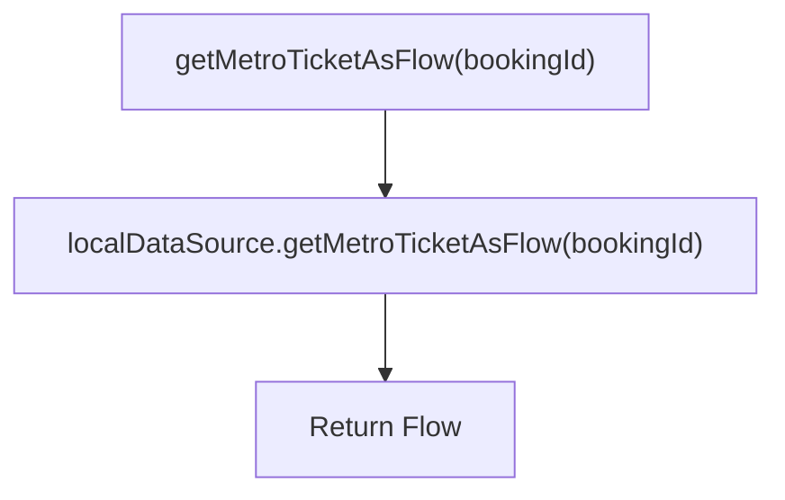
```mermaid
flowchart TD
    Start["getMetroTicketAsFlow(bookingId)"]
    CallLocal["localDataSource.getMetroTicketAsFlow(bookingId)"]
    ReturnFlow["Return Flow<MetroTicketAppModel?>"]

    Start --> CallLocal
    CallLocal --> ReturnFlow
```

#### insertMetroTicket

Persists ticket to local storage.

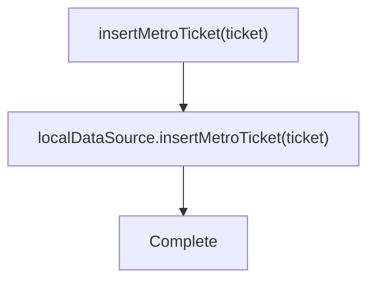
```mermaid
flowchart TD
    Start["insertMetroTicket(ticket)"]
    CallLocal["localDataSource.insertMetroTicket(ticket)"]
    Complete["Complete"]

    Start --> CallLocal
    CallLocal --> Complete
```

#### getMetroLiveBookingStatus

Fetches bulk booking statuses from remote.

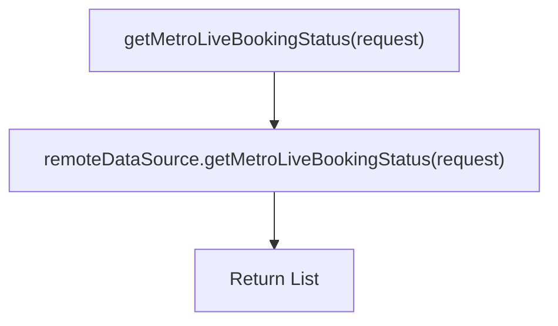
```mermaid
flowchart TD
    Start["getMetroLiveBookingStatus(request)"]
    CallRemote["remoteDataSource.getMetroLiveBookingStatus(request)"]
    ReturnResult["Return List<MetroLiveBookingStatusAppModel>"]

    Start --> CallRemote
    CallRemote --> ReturnResult
```

#### insertMetroLiveBookingStatus

Batch updates ticket statuses in local storage.

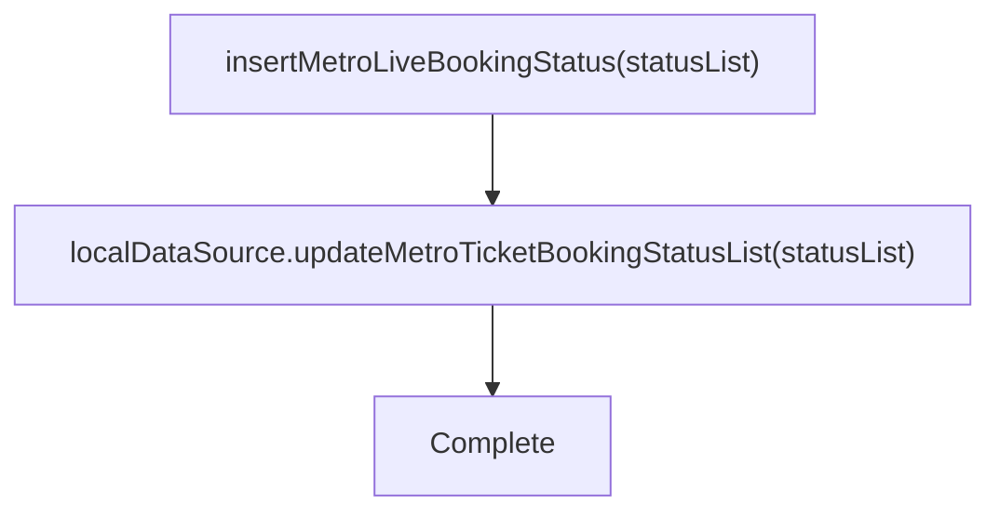
```mermaid
flowchart TD
    Start["insertMetroLiveBookingStatus(statusList)"]
    CallLocal["localDataSource.updateMetroTicketBookingStatusList(statusList)"]
    Complete["Complete"]

    Start --> CallLocal
    CallLocal --> Complete
```

---

## MetroRemoteDataSource

Interface defining all remote API operations for metro functionality.

### Interface Methods

| Method | Returns | Description |
|--------|---------|-------------|
| **getTicketBookingFareDetails** | List<TicketBookingFareAppModel> | Fetch fare options |
| **getMetroFinalFare** | MetroFinalFareAppModel | Get confirmed fare |
| **createMetroTicketOrder** | CreateOrderResponseAppModel | Create booking order |
| **fetchMetroTicketProductById** | MetroTicketApiModel | Fetch ticket details |
| **getMetroLiveBookingStatus** | List<MetroLiveBookingStatusAppModel> | Bulk status fetch |
| **updateBooking** | Unit | Update payment status |

---

## MetroRemoteDataSourceImpl

Implementation of the remote data source using Ktor-based API service.

### Dependencies

| Dependency | Purpose |
|------------|---------|
| **ApiService** | HTTP client wrapper with authentication |

### API Endpoints

#### Fare Calculation API

| Property | Value |
|----------|-------|
| **Endpoint** | POST /mticketing/v2/multimodal/fare |
| **Request Type** | TicketBookingFareRequestApiModel |
| **Response Type** | List<TicketBookingFareResponseApiModel> |

**Request Mapping:**

The implementation maps `TicketBookingFareRequestAppModel` to API model:

| App Model Field | API Model Field |
|-----------------|-----------------|
| **configId** | configId |
| **city** | city |
| **tripDetails.startStop** | fromStop |
| **tripDetails.endStop** | toStop |
| **tripDetails.routeId** | routeId |
| **transitMode** | transitMode |

**Response Structure:**

| Field | Type | Description |
|-------|------|-------------|
| **id** | String | Passenger type ID |
| **name** | String | Passenger type name |
| **fare** | Int | Fare amount |
| **seatLimitRestrictions** | SeatLimitApiModel? | Min/max seats |

#### Final Fare API

| Property | Value |
|----------|-------|
| **Endpoint** | POST /mticketing/v2/multimodal/fareBreakup |
| **Request Type** | TicketFinalFareRequestApiModel |
| **Response Type** | MetroFinalFareResponseApiModel |

**Request Structure:**

| Field | Type | Description |
|-------|------|-------------|
| **configId** | String | Metro configuration ID |
| **cityName** | String | City name |
| **bookingMode** | ChaloTicketBookingMode | SingleJourney/Group |
| **passengerDetails** | List<PassengerDetailApiModel> | Passenger breakdown |
| **tripDetails** | TripDetailsApiModel? | From/to stops |
| **transitMode** | ChaloTransitMode | METRO |

**Response Structure:**

| Field | Type | Description |
|-------|------|-------------|
| **fareBreakup** | List<FareBreakupApiModel>? | Itemized components |
| **finalFare** | Int | Total fare amount |
| **termsAndConditions** | List<String> | T&C items |

#### Create Order API

| Property | Value |
|----------|-------|
| **Endpoint** | POST /mticketing/v2/multimodal/order |
| **Request Type** | MetroTicketOrderRequestApiModel |
| **Response Type** | CreateOrderResponseApiModel |

**Request Structure:**

| Field | Type | Description |
|-------|------|-------------|
| **configId** | String | Metro configuration ID |
| **city** | String | City name (lowercase) |
| **bookingMode** | ChaloTicketBookingMode | Booking mode |
| **amount** | Long | Total fare amount |
| **passengerDetails** | List<MetroTicketOrderFarePassengerDetail> | Passengers |
| **tripDetails** | MetroTicketTripDetails? | Journey details |

**Response Structure:**

| Field | Type | Description |
|-------|------|-------------|
| **orderId** | String | Created order ID |
| **transactionId** | String | Payment transaction ID |
| **bookingInfo** | BookingInfo? | Additional metadata (includes bookingTime) |

#### Fetch Ticket API

| Property | Value |
|----------|-------|
| **Endpoint** | GET /mticketing/v2/multimodal/ticket |
| **Query Params** | bookingId, productType, productSubType |
| **Response Type** | MetroTicketApiModel |

**Response Structure (MetroTicketApiModel):**

| Field | Type | Description |
|-------|------|-------------|
| **bookingId** | String | Ticket booking ID |
| **status** | String | Ticket status string |
| **qrCode** | String? | QR code data |
| **amount** | Long | Fare amount |
| **bookingTime** | Long | Booking timestamp |
| **activationExpiryTime** | Long? | Expiry time |
| **passengerDetails** | Map<String, Int>? | Passenger counts |
| **startStopDetails** | StopDetailsApiModel? | Origin |
| **endStopDetails** | StopDetailsApiModel? | Destination |
| **validationInfoList** | List<ValidationInfoApiModel>? | Validation records |
| **refundInfo** | RefundInfoApiModel? | Refund details |
| **tone** | String? | Validation sound identifier |

#### Live Booking Status API

| Property | Value |
|----------|-------|
| **Endpoint** | POST /mticketing/v2/multimodal/status/bulk |
| **Request Type** | MetroLiveBookingStatusRequestApiModel |
| **Response Type** | List<MetroLiveBookingStatusApiModel> |

**Request Structure:**

| Field | Type | Description |
|-------|------|-------------|
| **bookingIds** | List<String> | Booking IDs to check |

**Response Structure:**

| Field | Type | Description |
|-------|------|-------------|
| **bookingId** | String | Ticket booking ID |
| **status** | MetroTicketStatus | Current status |

#### Update Booking API

| Property | Value |
|----------|-------|
| **Endpoint** | POST /mticketing/v2/multimodal/booking/update |
| **Request Type** | MetroTicketUpdateRequestApiModel |
| **Response Type** | Unit |

**Request Structure:**

| Field | Type | Description |
|-------|------|-------------|
| **bookingId** | String | Booking to update |
| **paymentStatus** | MetroTicketPaymentStatus | New status |

---

## MetroLocalDataSource

Interface for local storage operations.

### Interface Methods

| Method | Returns | Description |
|--------|---------|-------------|
| **getMetroTicket** | MetroTicketAppModel? | Get ticket by booking ID |
| **getMetroTicketAsFlow** | Flow<MetroTicketAppModel?> | Observe ticket |
| **insertMetroTicket** | Unit | Store ticket |
| **updateMetroTicketBookingStatusList** | Unit | Batch update statuses |

---

## MetroLocalDataSourceImpl

Implementation using SQLDelight DAO and user provider for multi-user support.

### Dependencies

| Dependency | Purpose |
|------------|---------|
| **MetroTicketDao** | Database operations |
| **UserProvider** | Current user ID for scoping |

### User Scoping

All local operations are scoped by user ID from `UserProvider`. This ensures ticket isolation between different users on the same device. If user ID is null (not logged in), operations return empty results or no-op.

### Method Implementations

#### getMetroTicket

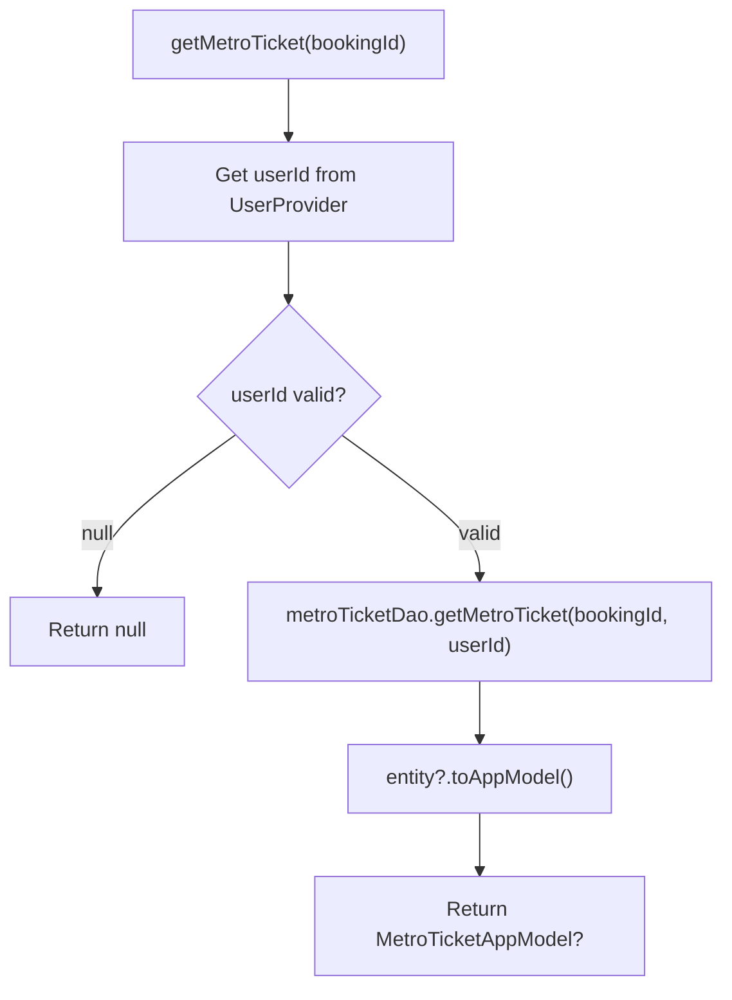
```mermaid
flowchart TD
    Start["getMetroTicket(bookingId)"]
    GetUser["Get userId from UserProvider"]
    CheckUser{userId valid?}
    ReturnNull["Return null"]
    CallDao["metroTicketDao.getMetroTicket(bookingId, userId)"]
    MapResult["entity?.toAppModel()"]
    ReturnResult["Return MetroTicketAppModel?"]

    Start --> GetUser
    GetUser --> CheckUser
    CheckUser -->|null| ReturnNull
    CheckUser -->|valid| CallDao
    CallDao --> MapResult
    MapResult --> ReturnResult
```

#### getMetroTicketAsFlow

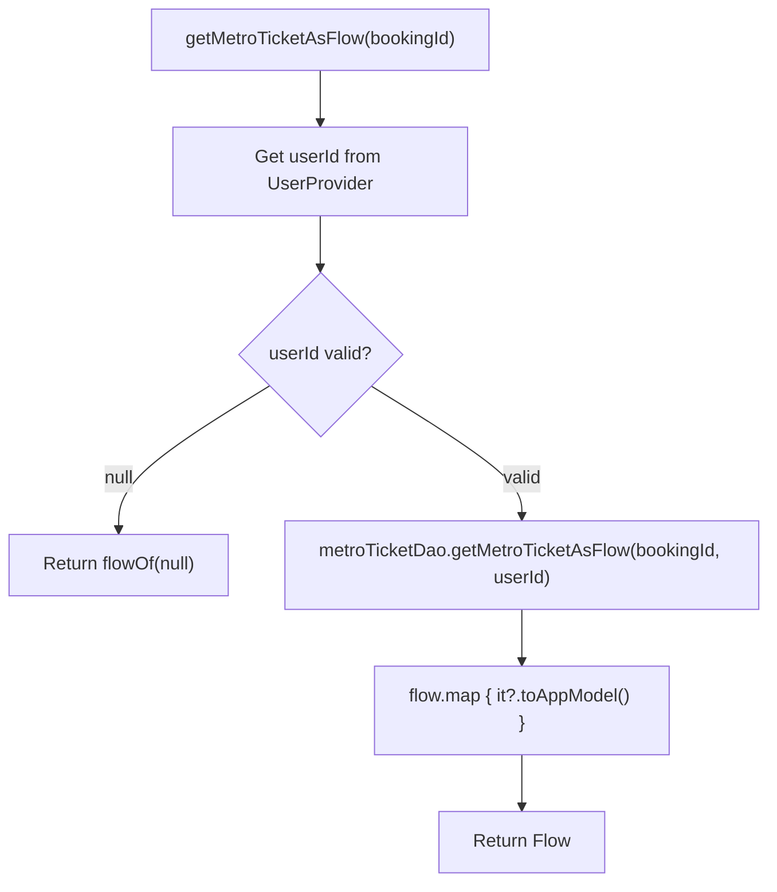
```mermaid
flowchart TD
    Start["getMetroTicketAsFlow(bookingId)"]
    GetUser["Get userId from UserProvider"]
    CheckUser{userId valid?}
    ReturnEmptyFlow["Return flowOf(null)"]
    CallDao["metroTicketDao.getMetroTicketAsFlow(bookingId, userId)"]
    MapFlow["flow.map { it?.toAppModel() }"]
    ReturnFlow["Return Flow<MetroTicketAppModel?>"]

    Start --> GetUser
    GetUser --> CheckUser
    CheckUser -->|null| ReturnEmptyFlow
    CheckUser -->|valid| CallDao
    CallDao --> MapFlow
    MapFlow --> ReturnFlow
```

#### insertMetroTicket

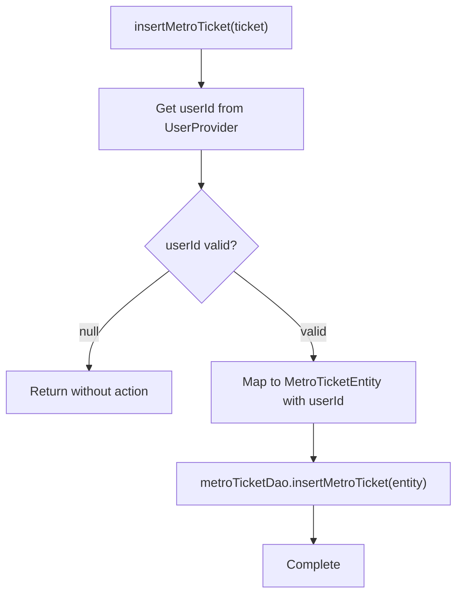
```mermaid
flowchart TD
    Start["insertMetroTicket(ticket)"]
    GetUser["Get userId from UserProvider"]
    CheckUser{userId valid?}
    Return["Return without action"]
    MapEntity["Map to MetroTicketEntity with userId"]
    CallDao["metroTicketDao.insertMetroTicket(entity)"]
    Complete["Complete"]

    Start --> GetUser
    GetUser --> CheckUser
    CheckUser -->|null| Return
    CheckUser -->|valid| MapEntity
    MapEntity --> CallDao
    CallDao --> Complete
```

#### updateMetroTicketBookingStatusList

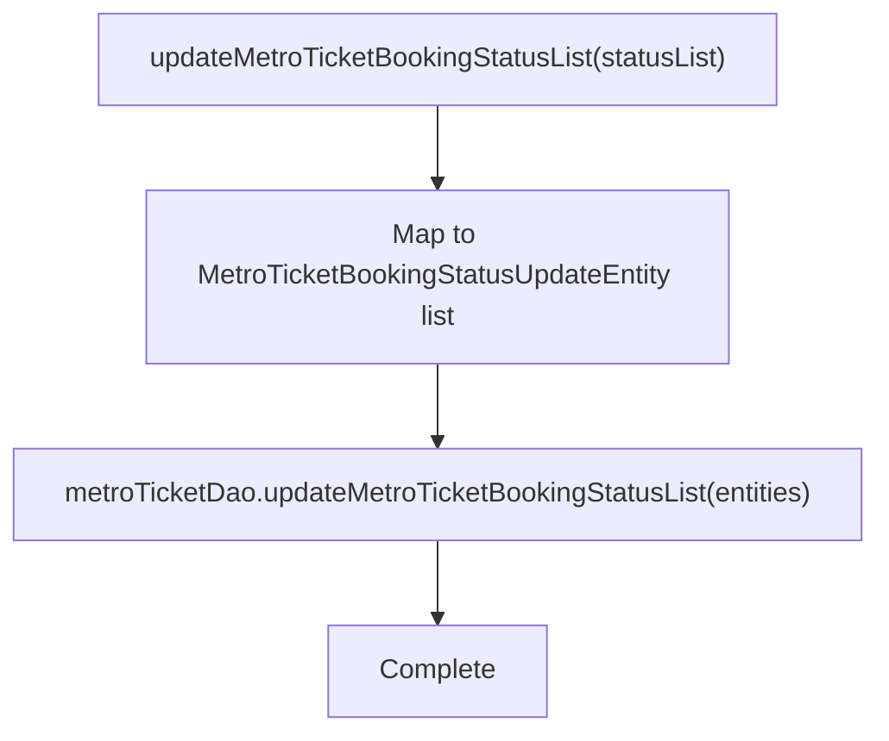
```mermaid
flowchart TD
    Start["updateMetroTicketBookingStatusList(statusList)"]
    MapEntities["Map to MetroTicketBookingStatusUpdateEntity list"]
    CallDao["metroTicketDao.updateMetroTicketBookingStatusList(entities)"]
    Complete["Complete"]

    Start --> MapEntities
    MapEntities --> CallDao
    CallDao --> Complete
```

---

## MetroTicketDao

Interface for SQLDelight database operations on metro tickets.

### DAO Methods

| Method | Returns | Description |
|--------|---------|-------------|
| **getMetroTicket** | MetroTicketEntity? | Get single ticket by bookingId and userId |
| **getMetroTicketAsFlow** | Flow<MetroTicketEntity?> | Observe ticket changes |
| **getAllMetroTickets** | List<MetroTicketEntity> | Get all tickets for city/user |
| **getAllMetroTicketsAsFlow** | Flow<List<MetroTicketEntity>> | Observe all tickets |
| **getMetroTicketsForMultipleStatusesAsFlow** | Flow<List<MetroTicketEntity>> | Filter by statuses |
| **insertMetroTicket** | Unit | Insert single ticket (upsert) |
| **insertMetroTickets** | Unit | Batch insert |
| **deleteMetroTickets** | Unit | Clear all tickets for user |
| **updateMetroTicketExpiryTime** | Unit | Update expiry timestamp |
| **updateMetroTicketBookingStatus** | Unit | Update single status |
| **updateMetroTicketBookingStatusList** | Unit | Batch update statuses |
| **clearExistingDataAndInsertMetroTickets** | Unit | Replace all tickets |

### Primary Key

Tickets are uniquely identified by `bookingId + userId` compound key.

---

## Data Entities

### MetroTicketEntity

Database entity for metro ticket storage.

| Column | Type | Description |
|--------|------|-------------|
| **bookingId** | String | Primary key part 1 |
| **userId** | String | Primary key part 2, user scoping |
| **bookingTime** | Long | Booking timestamp |
| **amount** | Long | Fare amount in paise |
| **status** | MetroTicketStatus | Current ticket status |
| **punchTime** | Long? | Validation timestamp |
| **city** | String | City name |
| **qrCode** | String? | QR code data for gates |
| **validationInfoEntityList** | List<TicketValidationInfoEntity>? | Validation records |
| **tone** | String? | Sound for validation |
| **activationExpiryTime** | Long? | Expiry timestamp |
| **passengerDetails** | Map<String, Int>? | Passenger counts by type |
| **routeName** | String? | Metro line name |
| **startStopDetails** | MetroTicketStopDetailsEntity? | Origin station |
| **endStopDetails** | MetroTicketStopDetailsEntity? | Destination station |
| **refundInfo** | RefundInfoAppModel? | Refund details |

### MetroTicketStopDetailsEntity

Nested entity for stop information stored as JSON.

| Field | Type | Description |
|-------|------|-------------|
| **name** | String | Station name |
| **id** | String | Station ID |

### MetroTicketBookingStatusUpdateEntity

Entity for batch status updates.

| Field | Type | Description |
|-------|------|-------------|
| **bookingId** | String | Ticket booking ID |
| **status** | MetroTicketStatus | New status |

### TicketValidationInfoEntity

Nested entity for validation records stored as JSON list.

| Field | Type | Description |
|-------|------|-------------|
| **validationTime** | Long | Timestamp of validation |
| **validationType** | String | Entry/Exit indicator |
| **stopId** | String? | Station where validated |
| **stopName** | String? | Station name |

---

## App Models

### MetroTicketAppModel

Application-level ticket model used in domain and presentation layers.

| Field | Type | Description |
|-------|------|-------------|
| **bookingId** | String | Unique booking identifier |
| **userId** | String | User ID |
| **bookingTime** | Long | Booking timestamp |
| **amount** | Long | Fare amount |
| **status** | MetroTicketStatus | Current status |
| **punchTime** | Long? | Validation timestamp |
| **city** | String | City name |
| **qrCode** | String? | QR code data |
| **validationInfoList** | List<TicketValidationInfoAppModel>? | Validation records |
| **tone** | String? | Validation sound |
| **activationExpiryTime** | Long | Expiry timestamp (default -1) |
| **passengerDetails** | Map<String, Int>? | Passenger counts |
| **routeName** | String? | Metro line name |
| **startStopDetails** | MetroTicketStopDetails? | Origin station |
| **endStopDetails** | MetroTicketStopDetails? | Destination station |
| **refundInfo** | RefundInfoAppModel? | Refund info |

### MetroTicketStopDetails

| Field | Type | Description |
|-------|------|-------------|
| **name** | String | Station name |
| **id** | String | Station identifier |

### MetroFinalFareAppModel

| Field | Type | Description |
|-------|------|-------------|
| **fareBreakup** | List<FareBreakupAppModel>? | Itemized components |
| **finalFare** | Int | Total fare amount |
| **termsAndConditions** | List<String> | T&C items |

### FareBreakupAppModel

| Field | Type | Description |
|-------|------|-------------|
| **passengerType** | String | Passenger category name |
| **count** | Int | Number of this type |
| **unitFare** | Int | Fare per passenger |
| **totalFare** | Int | count * unitFare |

### TicketBookingFareAppModel

| Field | Type | Description |
|-------|------|-------------|
| **id** | String | Passenger type identifier |
| **name** | String | Passenger type display name |
| **fare** | Int | Fare amount |
| **seatLimitRestrictions** | SeatLimitAppModel? | Min/max seat limits |

### SeatLimitAppModel

| Field | Type | Description |
|-------|------|-------------|
| **minSeatLimit** | Int | Minimum passengers allowed |
| **maxSeatLimit** | Int | Maximum passengers allowed |

---

## Data Mappers

### Entity to App Model

The `MetroTicketEntity.toAppModel()` extension function converts database entities:

| Entity Field | App Model Field | Transformation |
|--------------|-----------------|----------------|
| **bookingId** | bookingId | Direct |
| **userId** | userId | Direct |
| **bookingTime** | bookingTime | Direct |
| **amount** | amount | Direct |
| **status** | status | Direct |
| **punchTime** | punchTime | Direct |
| **city** | city | Direct |
| **qrCode** | qrCode | Direct |
| **validationInfoEntityList** | validationInfoList | Map each to app model |
| **tone** | tone | Direct |
| **activationExpiryTime** | activationExpiryTime | Default to -1L if null |
| **passengerDetails** | passengerDetails | Direct |
| **routeName** | routeName | Direct |
| **startStopDetails** | startStopDetails | toAppModel() |
| **endStopDetails** | endStopDetails | toAppModel() |
| **refundInfo** | refundInfo | Direct |

### App Model to Entity

The `MetroTicketAppModel.toEntity()` converts for storage:

| App Model Field | Entity Field | Transformation |
|-----------------|--------------|----------------|
| **bookingId** | bookingId | Direct |
| **userId** | userId | From UserProvider |
| **bookingTime** | bookingTime | Direct |
| **amount** | amount | Direct |
| **status** | status | Direct |
| **punchTime** | punchTime | Direct |
| **city** | city | Direct |
| **qrCode** | qrCode | Direct |
| **validationInfoList** | validationInfoEntityList | Map each to entity |
| **tone** | tone | Direct |
| **activationExpiryTime** | activationExpiryTime | Direct (Long?) |
| **passengerDetails** | passengerDetails | Direct |
| **routeName** | routeName | Direct |
| **startStopDetails** | startStopDetails | toEntity() |
| **endStopDetails** | endStopDetails | toEntity() |
| **refundInfo** | refundInfo | Direct |

### Stop Details Mapping

| Entity Field | App Model Field |
|--------------|-----------------|
| **name** | name |
| **id** | id |

---

## Data Flow Diagrams

### Fare Calculation Flow

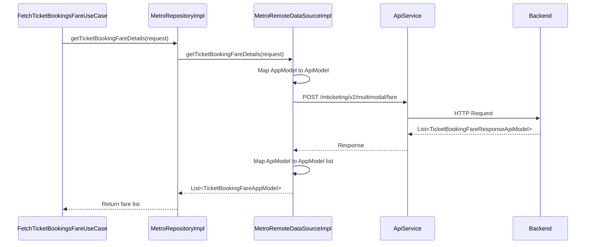
```mermaid
sequenceDiagram
    participant UC as FetchTicketBookingsFareUseCase
    participant Repo as MetroRepositoryImpl
    participant Remote as MetroRemoteDataSourceImpl
    participant API as ApiService
    participant Server as Backend

    UC->>Repo: getTicketBookingFareDetails(request)
    Repo->>Remote: getTicketBookingFareDetails(request)
    Remote->>Remote: Map AppModel to ApiModel
    Remote->>API: POST /mticketing/v2/multimodal/fare
    API->>Server: HTTP Request
    Server-->>API: List<TicketBookingFareResponseApiModel>
    API-->>Remote: Response
    Remote->>Remote: Map ApiModel to AppModel list
    Remote-->>Repo: List<TicketBookingFareAppModel>
    Repo-->>UC: Return fare list
```

### Order Creation Flow

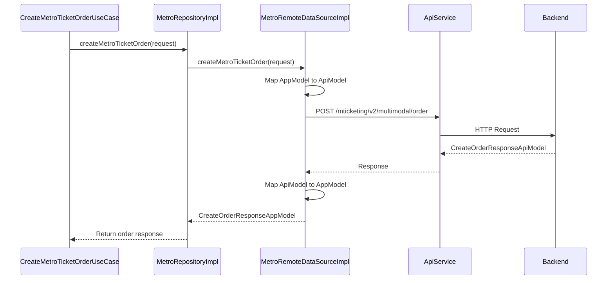
```mermaid
sequenceDiagram
    participant UC as CreateMetroTicketOrderUseCase
    participant Repo as MetroRepositoryImpl
    participant Remote as MetroRemoteDataSourceImpl
    participant API as ApiService
    participant Server as Backend

    UC->>Repo: createMetroTicketOrder(request)
    Repo->>Remote: createMetroTicketOrder(request)
    Remote->>Remote: Map AppModel to ApiModel
    Remote->>API: POST /mticketing/v2/multimodal/order
    API->>Server: HTTP Request
    Server-->>API: CreateOrderResponseApiModel
    API-->>Remote: Response
    Remote->>Remote: Map ApiModel to AppModel
    Remote-->>Repo: CreateOrderResponseAppModel
    Repo-->>UC: Return order response
```

### Ticket Storage Flow

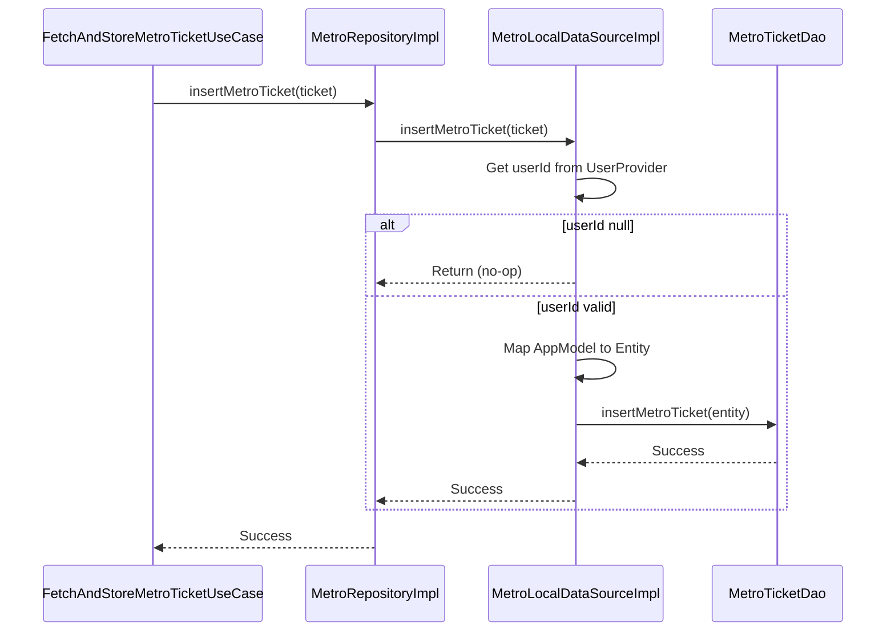
```mermaid
sequenceDiagram
    participant UC as FetchAndStoreMetroTicketUseCase
    participant Repo as MetroRepositoryImpl
    participant Local as MetroLocalDataSourceImpl
    participant DAO as MetroTicketDao

    UC->>Repo: insertMetroTicket(ticket)
    Repo->>Local: insertMetroTicket(ticket)
    Local->>Local: Get userId from UserProvider
    alt userId null
        Local-->>Repo: Return (no-op)
    else userId valid
        Local->>Local: Map AppModel to Entity
        Local->>DAO: insertMetroTicket(entity)
        DAO-->>Local: Success
        Local-->>Repo: Success
    end
    Repo-->>UC: Success
```

### Ticket Retrieval Flow (Reactive)

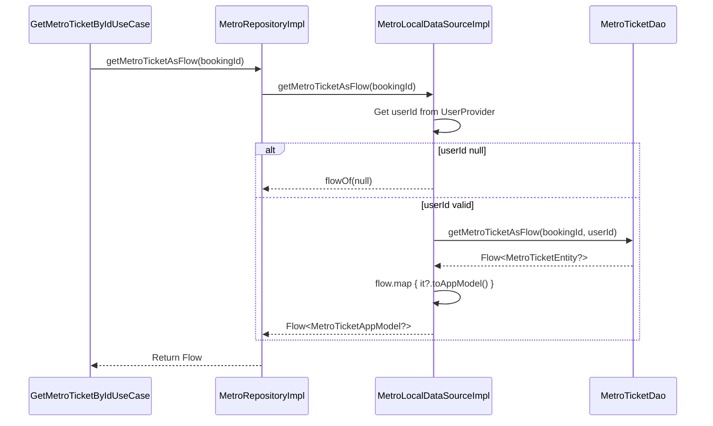
```mermaid
sequenceDiagram
    participant UC as GetMetroTicketByIdUseCase
    participant Repo as MetroRepositoryImpl
    participant Local as MetroLocalDataSourceImpl
    participant DAO as MetroTicketDao

    UC->>Repo: getMetroTicketAsFlow(bookingId)
    Repo->>Local: getMetroTicketAsFlow(bookingId)
    Local->>Local: Get userId from UserProvider
    alt userId null
        Local-->>Repo: flowOf(null)
    else userId valid
        Local->>DAO: getMetroTicketAsFlow(bookingId, userId)
        DAO-->>Local: Flow<MetroTicketEntity?>
        Local->>Local: flow.map { it?.toAppModel() }
        Local-->>Repo: Flow<MetroTicketAppModel?>
    end
    Repo-->>UC: Return Flow
```

### Bulk Status Update Flow

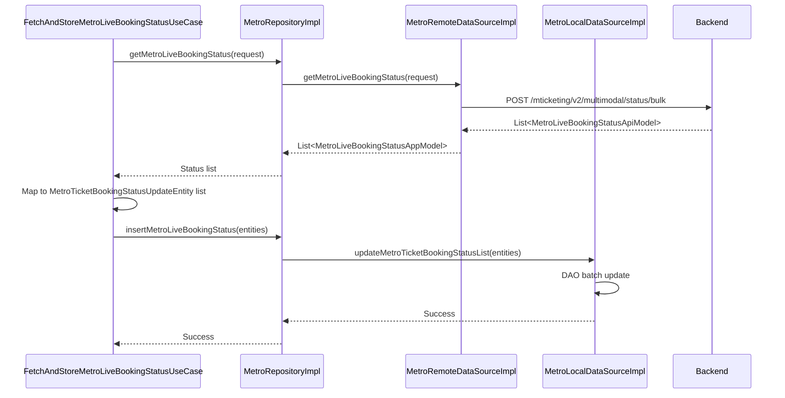
```mermaid
sequenceDiagram
    participant UC as FetchAndStoreMetroLiveBookingStatusUseCase
    participant Repo as MetroRepositoryImpl
    participant Remote as MetroRemoteDataSourceImpl
    participant Local as MetroLocalDataSourceImpl
    participant API as Backend

    UC->>Repo: getMetroLiveBookingStatus(request)
    Repo->>Remote: getMetroLiveBookingStatus(request)
    Remote->>API: POST /mticketing/v2/multimodal/status/bulk
    API-->>Remote: List<MetroLiveBookingStatusApiModel>
    Remote-->>Repo: List<MetroLiveBookingStatusAppModel>
    Repo-->>UC: Status list

    UC->>UC: Map to MetroTicketBookingStatusUpdateEntity list
    UC->>Repo: insertMetroLiveBookingStatus(entities)
    Repo->>Local: updateMetroTicketBookingStatusList(entities)
    Local->>Local: DAO batch update
    Local-->>Repo: Success
    Repo-->>UC: Success
```

---

## Error Handling

### Exception Types

| Exception | Source | Description |
|-----------|--------|-------------|
| **ChaloLocalException** | Local operations | Database/storage errors |
| **ProductBookingRemoteDataException** | API calls | Server errors with code |
| **MobileTicketProductFetchFailedException** | Ticket fetch | Specific fetch failure with errorCode |
| **NetworkSuccessResponseParseException** | Response parsing | Malformed response |
| **InvalidFareResponseDataException** | Fare API | Invalid fare data structure |

### Error Flow

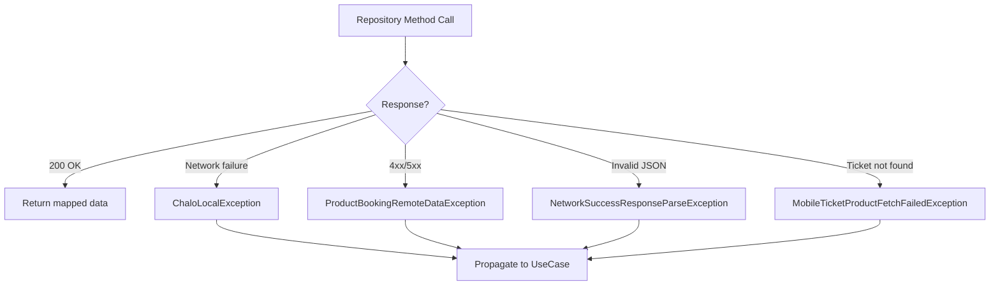
```mermaid
flowchart TD
    APICall["Repository Method Call"]
    Result{Response?}
    Success["Return mapped data"]
    NetworkError["ChaloLocalException"]
    APIError["ProductBookingRemoteDataException"]
    ParseError["NetworkSuccessResponseParseException"]
    FetchError["MobileTicketProductFetchFailedException"]

    APICall --> Result
    Result -->|200 OK| Success
    Result -->|Network failure| NetworkError
    Result -->|4xx/5xx| APIError
    Result -->|Invalid JSON| ParseError
    Result -->|Ticket not found| FetchError

    NetworkError --> PropagateUp["Propagate to UseCase"]
    APIError --> PropagateUp
    ParseError --> PropagateUp
    FetchError --> PropagateUp
```

### Error Code Handling

Special handling for known error codes:

| Error Code | Meaning | Handling |
|------------|---------|----------|
| **5002** | Product not found | Map to NO_PRODUCT_RECEIVED in use case |
| **Other 5xxx** | Server error | Map to SERVER_ERROR |

---

## Dependency Injection

### Module Bindings (Koin)

| Interface | Implementation | Scope |
|-----------|----------------|-------|
| MetroRepository | MetroRepositoryImpl | Singleton |
| MetroRemoteDataSource | MetroRemoteDataSourceImpl | Singleton |
| MetroLocalDataSource | MetroLocalDataSourceImpl | Singleton |
| MetroTicketDao | SQLDelight generated | Singleton |

---

## Network Configuration

### API Service Configuration

The `ApiService` wrapper provides:

| Feature | Description |
|---------|-------------|
| **Base URL** | Configured per environment (dev/staging/prod) |
| **Authentication** | Bearer token from auth provider |
| **Headers** | Platform, app version, device ID |
| **Serialization** | Kotlinx.serialization JSON |
| **Logging** | Debug builds only |

### Request Headers

| Header | Value | Description |
|--------|-------|-------------|
| **Authorization** | Bearer {token} | User auth token |
| **Content-Type** | application/json | Request format |
| **X-Platform** | android/ios | Platform identifier |
| **X-App-Version** | {version} | App version string |
| **X-Device-Id** | {uuid} | Unique device ID |

---

## Caching Strategy

### Local Storage

Metro tickets are persisted locally for:
- Offline ticket display (QR code available without network)
- Quick access without network latency
- Reactive UI updates via Flow
- Background status synchronization

### Cache Behavior

| Scenario | Action |
|----------|--------|
| **New ticket booked** | Insert to local DB after payment success |
| **Status updated** | Update entity status via bulk API |
| **User logout** | No automatic clear (tickets retained) |
| **Ticket expired** | Keep for history, status updated via polling |
| **Process death** | Data persists, restored on relaunch |

### Flow Reactivity

Local storage changes automatically emit to Flow collectors:
- DAO uses SQLDelight's asFlow() for reactive queries
- LocalDataSource maps entity flows to app model flows
- UI collectors receive updates without manual refresh

---

## Testing Considerations

### Repository Testing

Mock dependencies:
- **MetroRemoteDataSource** for API isolation
- **MetroLocalDataSource** for storage isolation

Test scenarios:
- Successful data flow through repository
- Error propagation from data sources
- Correct delegation to appropriate data source

### Data Source Testing

For remote data source:
- Mock **ApiService** to test request/response mapping
- Verify correct endpoint calls
- Test error response handling
- Verify request model transformations

For local data source:
- Mock **MetroTicketDao** and **UserProvider**
- Test entity-to-app-model mapping
- Verify user scoping logic (null user handling)
- Test Flow emissions

### DAO Testing

Use in-memory SQLDelight database:
- Test CRUD operations
- Verify Flow emissions on changes
- Test batch operations
- Test compound key (bookingId + userId) uniqueness
