# Metro — UseCase Documentation

## Domain Layer Overview

The Metro domain layer orchestrates metro ticket booking operations through specialized use cases. Each use case encapsulates a specific business operation, from fare calculation to ticket management. The use cases interact with `MetroRepository` for data operations and return strongly-typed `ChaloUseCaseResult` outcomes that distinguish between success and various failure modes.


```mermaid
flowchart TB
    subgraph Presentation
        LineLanding["MetroLandingScreenComponent"]
        StopLanding["StopBasedMetroLandingScreenComponent"]
        Confirm["ConfirmBookingScreenComponent"]
        Validation["MetroTicketValidationConfig"]
    end

    subgraph Domain["Domain Layer - Metro"]
        FetchFare["FetchTicketBookingsFareUseCase"]
        FinalFare["GetMetroFinalFareUseCase"]
        CreateOrder["CreateMetroTicketOrderUseCase"]
        FetchTicket["FetchMetroTicketUseCase"]
        FetchStore["FetchAndStoreMetroTicketUseCase"]
        LiveStatus["FetchAndStoreMetroLiveBookingStatusUseCase"]
        UpdateBooking["UpdateMetroBookingUseCase"]
        GetTicketById["GetMetroTicketByIdUseCase"]
        TicketFromApi["GetMetroTicketAppModelFromApiUseCase"]
    end

    subgraph Domain_ONDC["Domain Layer - ONDC"]
        FetchOndcLines["FetchOndcMetroLinesUseCase"]
        FetchOndcStops["FetchOndcMetroLineStopsUseCase"]
        FetchOndcTicket["FetchOndcMetroTicketUseCase"]
        FetchStoreOndc["FetchAndStoreOndcMetroTicketUseCase"]
    end

    subgraph Data["Data Layer"]
        MetroRepo["MetroRepository"]
        OndcRepo["OndcRepository"]
    end

    StopLanding --> FetchFare
    LineLanding --> FetchOndcLines
    LineLanding --> FetchOndcStops
    Confirm --> FinalFare
    Confirm --> CreateOrder
    Validation --> FetchTicket
    Validation --> FetchStore
    Validation --> GetTicketById

    FetchFare --> MetroRepo
    FinalFare --> MetroRepo
    CreateOrder --> MetroRepo
    FetchTicket --> MetroRepo
    FetchStore --> MetroRepo
    LiveStatus --> MetroRepo
    UpdateBooking --> MetroRepo
    GetTicketById --> MetroRepo

    FetchOndcLines --> OndcRepo
    FetchOndcStops --> OndcRepo
    FetchStoreOndc --> OndcRepo
```

---

## UseCase Inventory

### Metro Use Cases

| UseCase | File Location | Purpose |
|---------|---------------|---------|
| **FetchTicketBookingsFareUseCase** | `metro/domain/` | Calculate fare for selected journey |
| **GetMetroFinalFareUseCase** | `metro/domain/` | Compute final fare with breakdown |
| **CreateMetroTicketOrderUseCase** | `metro/domain/` | Create metro ticket order |
| **FetchMetroTicketUseCase** | `metro/domain/` | Retrieve ticket by booking ID from API |
| **FetchAndStoreMetroTicketUseCase** | `metro/domain/` | Fetch ticket and persist locally |
| **FetchAndStoreMetroLiveBookingStatusUseCase** | `metro/domain/` | Bulk status check and update |
| **UpdateMetroBookingUseCase** | `metro/domain/` | Update booking payment status |
| **GetMetroTicketByIdUseCase** | `metro/domain/` | Get ticket as Flow from local storage |
| **GetMetroTicketAppModelFromApiUseCase** | `metro/domain/` | Convert API model to app model |

### ONDC Use Cases

| UseCase | File Location | Purpose |
|---------|---------------|---------|
| **FetchOndcMetroLinesUseCase** | `ondc/domain/` | Fetch metro lines from ONDC network |
| **FetchOndcMetroLineStopsUseCase** | `ondc/domain/` | Fetch stops for a specific line |
| **FetchOndcMetroTicketUseCase** | `ondc/domain/` | Retrieve ONDC metro ticket from API |
| **FetchAndStoreOndcMetroTicketUseCase** | `ondc/domain/` | Fetch and persist ONDC ticket |
| **GetOndcMetroTicketAppModelFromApiUseCase** | `ondc/domain/` | Convert ONDC API model to app model |
| **GetOndcMetroTicketByIdUseCase** | `ondc/domain/` | Get ONDC ticket from local storage |

---

## FetchTicketBookingsFareUseCase

Calculates the fare for a metro journey based on origin, destination, and configuration. This is the primary fare calculation use case used by the stop-based booking flow.

### Responsibility

Queries the backend for fare details using the trip data and metro configuration. Handles city-specific fare retrieval and maps various failure scenarios to appropriate error types. Also tracks fare fetch failures via analytics.

### Dependencies

| Dependency | Purpose |
|------------|---------|
| **CityProvider** | Retrieves current city name for API request |
| **MetroRepository** | Calls fare calculation API via `getTicketBookingFareDetails` |
| **AnalyticsContract** | Tracks fare fetch failure events |

### Flow Diagram

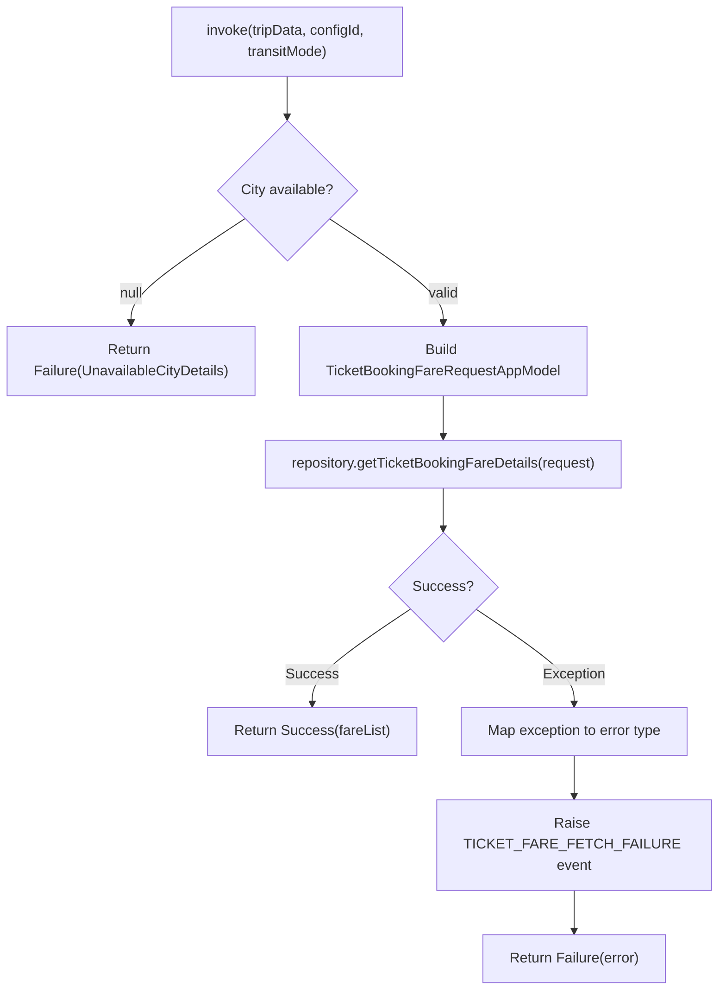
```mermaid
flowchart TD
    Start["invoke(tripData, configId, transitMode)"]
    GetCity{City available?}
    NoCityError["Return Failure(UnavailableCityDetails)"]
    BuildRequest["Build TicketBookingFareRequestAppModel"]
    CallRepo["repository.getTicketBookingFareDetails(request)"]
    CheckResponse{Success?}
    ReturnFare["Return Success(fareList)"]
    HandleException["Map exception to error type"]
    RaiseAnalytics["Raise TICKET_FARE_FETCH_FAILURE event"]
    ReturnError["Return Failure(error)"]

    Start --> GetCity
    GetCity -->|null| NoCityError
    GetCity -->|valid| BuildRequest
    BuildRequest --> CallRepo
    CallRepo --> CheckResponse
    CheckResponse -->|Success| ReturnFare
    CheckResponse -->|Exception| HandleException
    HandleException --> RaiseAnalytics
    RaiseAnalytics --> ReturnError
```

### Input Parameters

| Parameter | Type | Description |
|-----------|------|-------------|
| **tripData** | TicketBookingTripData | Journey origin, destination, optional route |
| **configId** | String | Metro product configuration ID |
| **transitMode** | ChaloTransitMode | Transit mode (default: BUS, should pass METRO) |

### TicketBookingTripData Structure

| Field | Type | Description |
|-------|------|-------------|
| **routeId** | String? | Optional route identifier (null for stop-based) |
| **startStop** | StopAppModel | Origin station details |
| **endStop** | StopAppModel | Destination station details |

### Output

| Type | Description |
|------|-------------|
| **ChaloUseCaseResult<List<TicketBookingFareAppModel>, ProductBookingDataSourceError>** | List of fare options or error |

### Error Mapping

| Exception Type | Error Result |
|----------------|--------------|
| **ChaloLocalException** | ProductBookingDataSourceError.Local |
| **ProductBookingRemoteDataException** | ProductBookingDataSourceError.API |
| **NetworkSuccessResponseParseException** | ProductBookingDataSourceError.ResponseParsing |
| **InvalidFareResponseDataException** | ProductBookingDataSourceError.InvalidData |
| **Other exceptions** | ProductBookingDataSourceError.Unknown |

### Analytics Event

On failure, raises `TICKET_FARE_FETCH_FAILURE` with attributes:

| Attribute | Value |
|-----------|-------|
| **type** | Exception class simple name |
| **reason** | Exception message string |
| **INVALID_RESPONSE** | Boolean indicating InvalidFareResponseDataException |

---

## GetMetroFinalFareUseCase

Computes the final fare breakdown before order creation. This use case is called from the confirmation screen to get the detailed fare components and terms.

### Responsibility

Requests the final fare calculation from the server, including fare breakdown by passenger type and applicable terms and conditions. The transit mode is hardcoded to METRO internally.

### Dependencies

| Dependency | Purpose |
|------------|---------|
| **MetroRepository** | Calls final fare API via `getMetroFinalFare` |
| **CityProvider** | Retrieves current city name |

### Flow Diagram

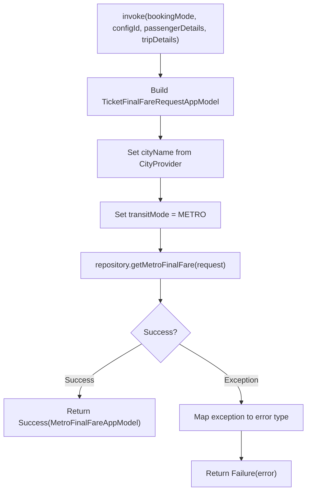
```mermaid
flowchart TD
    Start["invoke(bookingMode, configId, passengerDetails, tripDetails)"]
    BuildRequest["Build TicketFinalFareRequestAppModel"]
    SetCity["Set cityName from CityProvider"]
    SetMode["Set transitMode = METRO"]
    CallRepo["repository.getMetroFinalFare(request)"]
    CheckResponse{Success?}
    ReturnFare["Return Success(MetroFinalFareAppModel)"]
    HandleException["Map exception to error type"]
    ReturnError["Return Failure(error)"]

    Start --> BuildRequest
    BuildRequest --> SetCity
    SetCity --> SetMode
    SetMode --> CallRepo
    CallRepo --> CheckResponse
    CheckResponse -->|Success| ReturnFare
    CheckResponse -->|Exception| HandleException
    HandleException --> ReturnError
```

### Input Parameters

| Parameter | Type | Description |
|-----------|------|-------------|
| **bookingMode** | ChaloTicketBookingMode | SingleJourney or Group |
| **configId** | String | Metro configuration ID |
| **passengerDetails** | List<PassengerDetailData> | Passenger counts by type |
| **tripDetails** | MetroTicketTripDetails | From/to stop details |

### PassengerDetailData Structure

| Field | Type | Description |
|-------|------|-------------|
| **passengerId** | String | Passenger type identifier |
| **name** | String | Passenger type name |
| **passengerCount** | Int | Number of this passenger type |

### MetroTicketTripDetails Structure

| Field | Type | Description |
|-------|------|-------------|
| **routeId** | String? | Optional route ID (null for stop-based) |
| **startStop** | StopAppModel | Origin station |
| **endStop** | StopAppModel | Destination station |

### Output

| Type | Description |
|------|-------------|
| **ChaloUseCaseResult<MetroFinalFareAppModel, ProductBookingDataSourceError>** | Final fare details or error |

### MetroFinalFareAppModel Structure

| Field | Type | Description |
|-------|------|-------------|
| **fareBreakup** | List<FareBreakupAppModel>? | Itemized fare components |
| **finalFare** | Int | Total fare amount in paise |
| **termsAndConditions** | List<String> | T&C items from backend |

---

## CreateMetroTicketOrderUseCase

Creates a metro ticket order after fare confirmation. This use case initiates the booking process and returns order details required for payment.

### Responsibility

Builds the order request with booking mode, passenger details, and trip information. Calls the repository to create the order and returns the response containing order ID and transaction details for checkout.

### Dependencies

| Dependency | Purpose |
|------------|---------|
| **MetroRepository** | Creates order via `createMetroTicketOrder` |
| **CityProvider** | Retrieves current city name (sent lowercase) |

### Flow Diagram

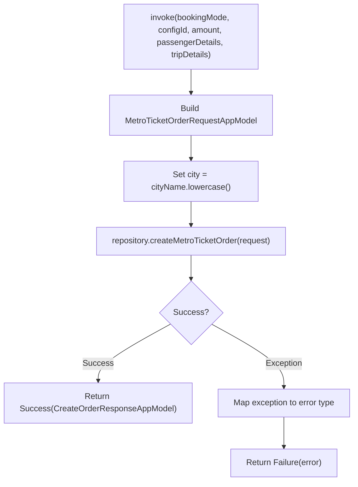
```mermaid
flowchart TD
    Start["invoke(bookingMode, configId, amount, passengerDetails, tripDetails)"]
    BuildRequest["Build MetroTicketOrderRequestAppModel"]
    SetCity["Set city = cityName.lowercase()"]
    CallRepo["repository.createMetroTicketOrder(request)"]
    CheckResponse{Success?}
    ReturnOrder["Return Success(CreateOrderResponseAppModel)"]
    HandleException["Map exception to error type"]
    ReturnError["Return Failure(error)"]

    Start --> BuildRequest
    BuildRequest --> SetCity
    SetCity --> CallRepo
    CallRepo --> CheckResponse
    CheckResponse -->|Success| ReturnOrder
    CheckResponse -->|Exception| HandleException
    HandleException --> ReturnError
```

### Input Parameters

| Parameter | Type | Description |
|-----------|------|-------------|
| **bookingMode** | ChaloTicketBookingMode | SingleJourney or Group |
| **configId** | String | Metro product configuration ID |
| **amount** | Long | Total fare amount in paise |
| **passengerDetails** | List<MetroTicketOrderFarePassengerDetail> | Passenger breakdown |
| **tripDetails** | MetroTicketTripDetails? | Journey details (nullable) |

### MetroTicketOrderFarePassengerDetail Structure

| Field | Type | Description |
|-------|------|-------------|
| **passengerId** | String | Passenger type identifier |
| **passengerCount** | Int | Count of this passenger type |

### Output

| Type | Description |
|------|-------------|
| **ChaloUseCaseResult<CreateOrderResponseAppModel, ProductBookingDataSourceError>** | Order details or error |

### CreateOrderResponseAppModel Key Fields

| Field | Type | Description |
|-------|------|-------------|
| **orderId** | String | Created order identifier |
| **transactionId** | String | Payment transaction ID |
| **bookingInfo** | BookingInfo? | Booking metadata including bookingTime |

---

## FetchMetroTicketUseCase

Retrieves metro ticket details from the API by booking ID. This use case is used to fetch fresh ticket data from the server.

### Responsibility

Calls the repository to fetch ticket details and validates that the returned ticket matches the requested booking ID. Handles various API failure scenarios with specific error codes.

### Dependencies

| Dependency | Purpose |
|------------|---------|
| **MetroRepository** | Fetches ticket via `fetchMetroTicketProductById` |

### Flow Diagram

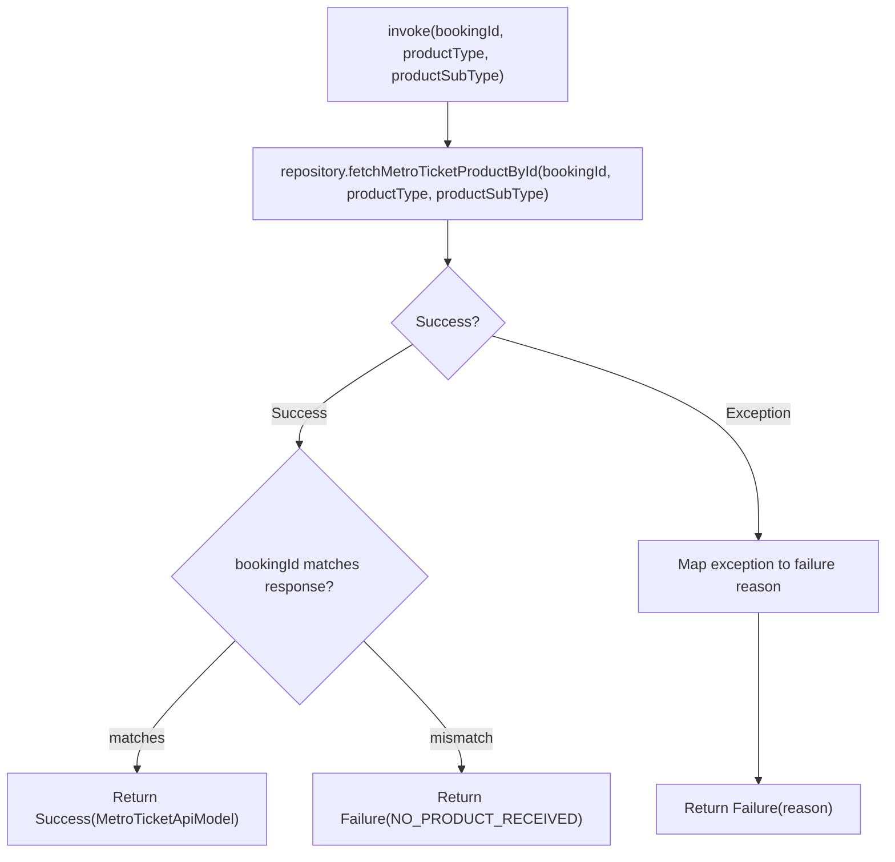
```mermaid
flowchart TD
    Start["invoke(bookingId, productType, productSubType)"]
    CallRepo["repository.fetchMetroTicketProductById(bookingId, productType, productSubType)"]
    CheckResponse{Success?}
    ValidateId{bookingId matches response?}
    ReturnTicket["Return Success(MetroTicketApiModel)"]
    NoProductError["Return Failure(NO_PRODUCT_RECEIVED)"]
    HandleException["Map exception to failure reason"]
    ReturnError["Return Failure(reason)"]

    Start --> CallRepo
    CallRepo --> CheckResponse
    CheckResponse -->|Success| ValidateId
    CheckResponse -->|Exception| HandleException
    ValidateId -->|matches| ReturnTicket
    ValidateId -->|mismatch| NoProductError
    HandleException --> ReturnError
```

### Input Parameters

| Parameter | Type | Description |
|-----------|------|-------------|
| **bookingId** | String | Ticket booking identifier |
| **productType** | String | Product type constant |
| **productSubType** | String | Product sub-type constant |

### Output

| Type | Description |
|------|-------------|
| **ChaloUseCaseResult<MetroTicketApiModel, MobileTicketByIdFetchFailedReason>** | API ticket model or failure reason |

### Failure Reasons

| Reason | Cause |
|--------|-------|
| **NO_PRODUCT_RECEIVED** | Ticket not found (error code 5002) or ID mismatch |
| **SERVER_ERROR** | API error (non-5002 code) |
| **LOCAL_ERROR** | ChaloLocalException |
| **PARSE_ERROR** | NetworkSuccessResponseParseException |
| **UNKNOWN_ERROR** | Unhandled exception |

### Error Code Handling

The use case defines `PRODUCT_NOT_FOUND_ERROR_CODE = 5002` and specifically checks for this code to distinguish "product not found" from general server errors:

```
MobileTicketProductFetchFailedException with errorCode == 5002 -> NO_PRODUCT_RECEIVED
MobileTicketProductFetchFailedException with other code -> SERVER_ERROR
```

---

## FetchAndStoreMetroTicketUseCase

Fetches a metro ticket from the API and persists it to local storage. This composite use case combines fetch and storage operations.

### Responsibility

Orchestrates ticket fetching via `FetchMetroTicketUseCase`, converts the API model to app model using `GetMetroTicketAppModelFromApiUseCase`, and stores the result in the repository. Uses product type constants from `MetroTicketConstants`.

### Dependencies

| Dependency | Purpose |
|------------|---------|
| **MetroRepository** | Stores ticket via `insertMetroTicket` |
| **FetchMetroTicketUseCase** | Fetches ticket from API |
| **GetMetroTicketAppModelFromApiUseCase** | Converts API to app model |

### Flow Diagram

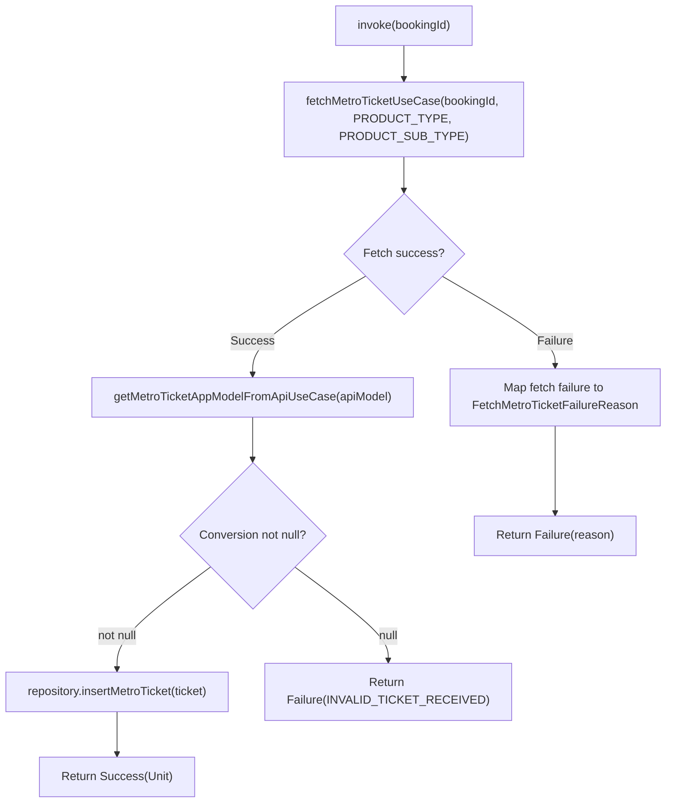
```mermaid
flowchart TD
    Start["invoke(bookingId)"]
    FetchTicket["fetchMetroTicketUseCase(bookingId, PRODUCT_TYPE, PRODUCT_SUB_TYPE)"]
    CheckFetch{Fetch success?}
    ConvertModel["getMetroTicketAppModelFromApiUseCase(apiModel)"]
    CheckConvert{Conversion not null?}
    StoreTicket["repository.insertMetroTicket(ticket)"]
    ReturnSuccess["Return Success(Unit)"]
    MapFetchError["Map fetch failure to FetchMetroTicketFailureReason"]
    InvalidTicketError["Return Failure(INVALID_TICKET_RECEIVED)"]
    ReturnError["Return Failure(reason)"]

    Start --> FetchTicket
    FetchTicket --> CheckFetch
    CheckFetch -->|Success| ConvertModel
    CheckFetch -->|Failure| MapFetchError
    ConvertModel --> CheckConvert
    CheckConvert -->|not null| StoreTicket
    CheckConvert -->|null| InvalidTicketError
    StoreTicket --> ReturnSuccess
    MapFetchError --> ReturnError
```

### Input Parameters

| Parameter | Type | Description |
|-----------|------|-------------|
| **bookingId** | String | Ticket booking identifier |

### Output

| Type | Description |
|------|-------------|
| **ChaloUseCaseResult<Unit, FetchMetroTicketFailureReason>** | Success or failure reason |

### FetchMetroTicketFailureReason Enum

| Value | Cause |
|-------|-------|
| **NO_TICKET_RECEIVED** | API returned no ticket |
| **INVALID_TICKET_RECEIVED** | Conversion to app model returned null |
| **SERVER_ERROR** | API server error |
| **LOCAL_ERROR** | Local/network exception |
| **PARSE_ERROR** | Response parsing failed |
| **UNKNOWN_ERROR** | Unhandled exception |

---

## FetchAndStoreMetroLiveBookingStatusUseCase

Performs bulk status check for multiple metro tickets and updates local storage. Used for refreshing ticket statuses efficiently.

### Responsibility

Takes a list of booking IDs, queries the server for their current statuses, and batch-updates the local database with the results. This is useful for polling ticket status changes.

### Dependencies

| Dependency | Purpose |
|------------|---------|
| **MetroRepository** | Fetches statuses and updates local storage |

### Flow Diagram

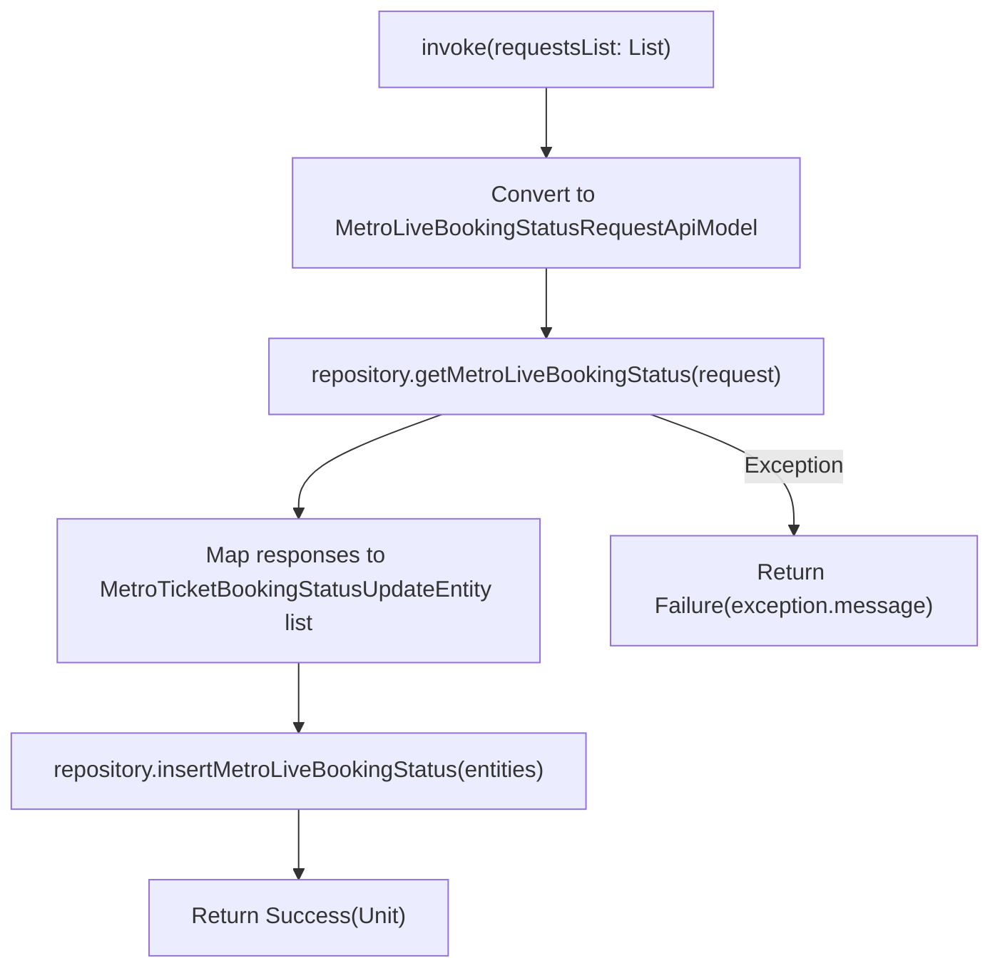
```mermaid
flowchart TD
    Start["invoke(requestsList: List<String>)"]
    BuildRequest["Convert to MetroLiveBookingStatusRequestApiModel"]
    CallRepo["repository.getMetroLiveBookingStatus(request)"]
    MapResponse["Map responses to MetroTicketBookingStatusUpdateEntity list"]
    StoreStatus["repository.insertMetroLiveBookingStatus(entities)"]
    ReturnSuccess["Return Success(Unit)"]
    HandleException["Return Failure(exception.message)"]

    Start --> BuildRequest
    BuildRequest --> CallRepo
    CallRepo --> MapResponse
    MapResponse --> StoreStatus
    StoreStatus --> ReturnSuccess
    CallRepo -->|Exception| HandleException
```

### Input Parameters

| Parameter | Type | Description |
|-----------|------|-------------|
| **requestsList** | List<String> | List of booking IDs to check |

### Output

| Type | Description |
|------|-------------|
| **ChaloUseCaseResult<Unit, String>** | Success or error message string |

### Internal Conversion

The use case provides an extension function to convert the booking ID list:

```kotlin
List<String>.toBookingStatusRequestApiModel() -> MetroLiveBookingStatusRequestApiModel(bookingIds = this)
```

---

## UpdateMetroBookingUseCase

Updates the payment status of a metro booking. Called after payment completion to sync the booking state with the backend.

### Responsibility

Sends a booking update request to the server with the new payment status. Used to transition bookings from PAYMENT_PROCESSING to ACTIVE or FAILED states.

### Dependencies

| Dependency | Purpose |
|------------|---------|
| **MetroRepository** | Sends update via `updateBooking` |

### Flow Diagram

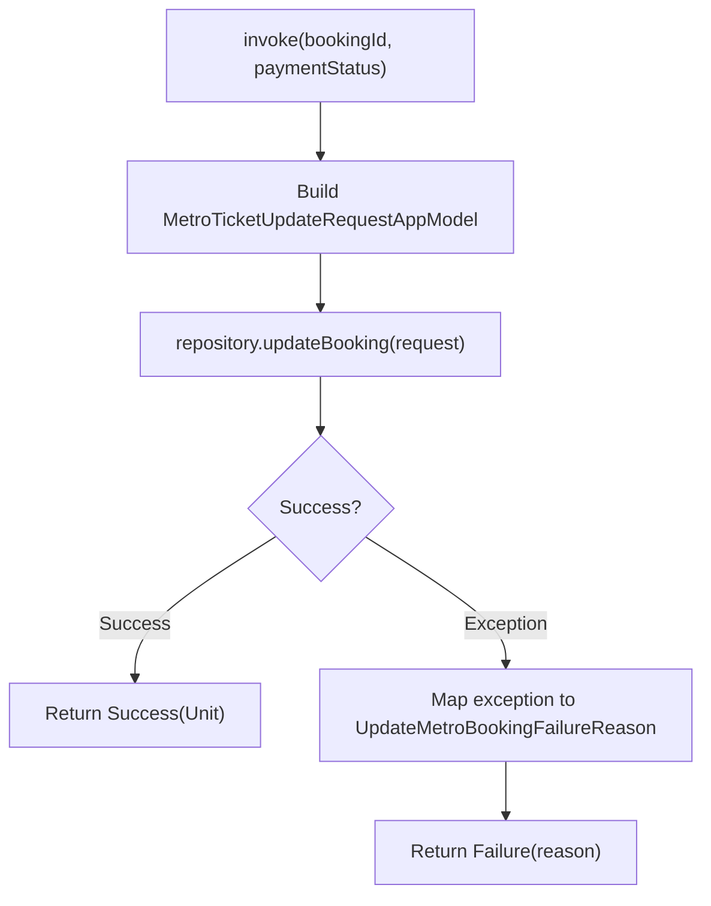
```mermaid
flowchart TD
    Start["invoke(bookingId, paymentStatus)"]
    BuildRequest["Build MetroTicketUpdateRequestAppModel"]
    CallRepo["repository.updateBooking(request)"]
    CheckResponse{Success?}
    ReturnSuccess["Return Success(Unit)"]
    HandleException["Map exception to UpdateMetroBookingFailureReason"]
    ReturnError["Return Failure(reason)"]

    Start --> BuildRequest
    BuildRequest --> CallRepo
    CallRepo --> CheckResponse
    CheckResponse -->|Success| ReturnSuccess
    CheckResponse -->|Exception| HandleException
    HandleException --> ReturnError
```

### Input Parameters

| Parameter | Type | Description |
|-----------|------|-------------|
| **bookingId** | String | Booking identifier to update |
| **paymentStatus** | MetroTicketPaymentStatus | New payment status |

### Output

| Type | Description |
|------|-------------|
| **ChaloUseCaseResult<Unit, UpdateMetroBookingFailureReason>** | Success or failure |

### UpdateMetroBookingFailureReason Sealed Class

| Type | Fields | Description |
|------|--------|-------------|
| **Local** | message: String? | Local exception occurred |
| **API** | message: String?, errorCode: Int? | API error with code |
| **ResponseParsing** | - | Parse failure |
| **Unknown** | message: String? | Unhandled error |

---

## GetMetroTicketByIdUseCase

Retrieves a metro ticket as a reactive Flow from local storage. Used for observing ticket state changes in the UI.

### Responsibility

Provides a Flow that emits ticket updates whenever the local database changes. This enables reactive UI updates when ticket status changes from background operations.

### Dependencies

| Dependency | Purpose |
|------------|---------|
| **MetroRepository** | Provides ticket Flow via `getMetroTicketAsFlow` |

### Flow Diagram

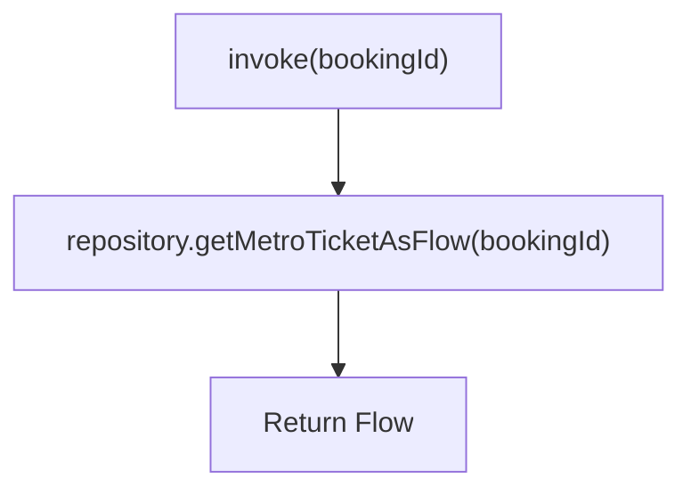
```mermaid
flowchart TD
    Start["invoke(bookingId)"]
    CallRepo["repository.getMetroTicketAsFlow(bookingId)"]
    ReturnFlow["Return Flow<MetroTicketAppModel?>"]

    Start --> CallRepo
    CallRepo --> ReturnFlow
```

### Input Parameters

| Parameter | Type | Description |
|-----------|------|-------------|
| **bookingId** | String | Ticket booking identifier |

### Output

| Type | Description |
|------|-------------|
| **Flow<MetroTicketAppModel?>** | Reactive stream of ticket or null |

### Usage Pattern

This use case returns a Flow rather than a one-shot result, making it ideal for:
- Validation screens that need live ticket state updates
- Status polling scenarios with UI reactivity
- Background status update reflection in UI

---

## GetMetroTicketAppModelFromApiUseCase

Converts the API ticket model to the application model. This is a transformation use case that handles the mapping logic.

### Responsibility

Takes a generic mobile ticket API model and converts it to the Metro-specific app model. Handles null-safety and ensures proper field mapping including nested stop details and validation info.

### Input/Output

| Input | Output |
|-------|--------|
| **MetroTicketApiModel** | MetroTicketAppModel? |

The use case returns null if the API model cannot be properly converted, allowing callers to handle invalid responses gracefully.

---

## FetchOndcMetroLinesUseCase

Fetches available metro lines from the ONDC network. Used by the line-based booking flow to display metro lines for selection.

### Responsibility

Queries the ONDC repository for metro lines in the current city. Returns a list of metro line options for user selection.

### Dependencies

| Dependency | Purpose |
|------------|---------|
| **CityProvider** | Retrieves current city for API request |
| **OndcRepository** | Fetches lines via `fetchMetroLines` |
| **StringProvider** | Provides error messages |

### Flow Diagram

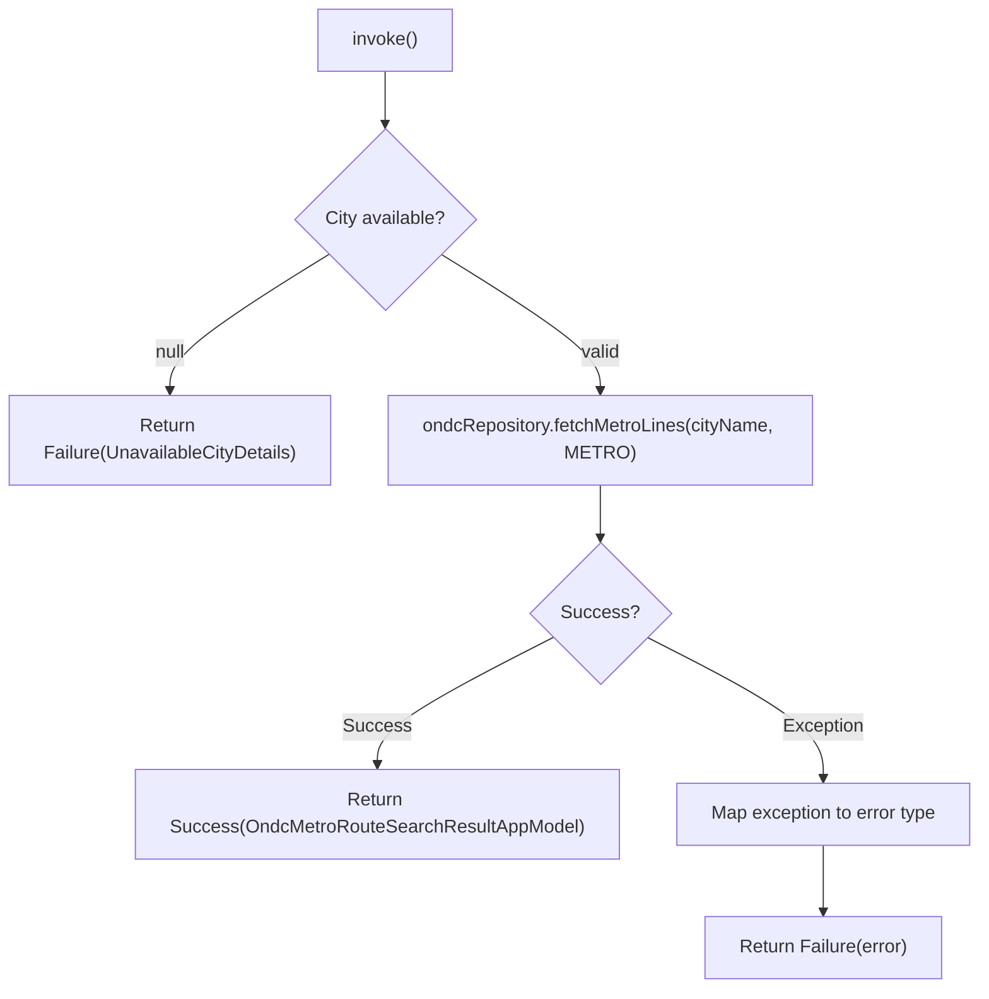
```mermaid
flowchart TD
    Start["invoke()"]
    GetCity{City available?}
    NoCityError["Return Failure(UnavailableCityDetails)"]
    CallRepo["ondcRepository.fetchMetroLines(cityName, METRO)"]
    CheckResponse{Success?}
    ReturnLines["Return Success(OndcMetroRouteSearchResultAppModel)"]
    HandleException["Map exception to error type"]
    ReturnError["Return Failure(error)"]

    Start --> GetCity
    GetCity -->|null| NoCityError
    GetCity -->|valid| CallRepo
    CallRepo --> CheckResponse
    CheckResponse -->|Success| ReturnLines
    CheckResponse -->|Exception| HandleException
    HandleException --> ReturnError
```

### Output

| Type | Description |
|------|-------------|
| **ChaloUseCaseResult<OndcMetroRouteSearchResultAppModel, ProductBookingDataSourceError>** | Metro lines or error |

### Special Exception Handling

| Exception | Error Mapping |
|-----------|--------------|
| **MetroLineStopListFetchFailedException** | ProductBookingDataSourceError.API with message |

---

## FetchOndcMetroLineStopsUseCase

Fetches stops for a specific metro line from the ONDC network. Called after user selects a metro line.

### Responsibility

Queries the ONDC repository for stops on a specific metro line route. Returns a list of stops for the user to select origin and destination.

### Dependencies

| Dependency | Purpose |
|------------|---------|
| **CityProvider** | Retrieves current city for API request |
| **OndcRepository** | Fetches stops via `fetchMetroLineStops` |

### Flow Diagram

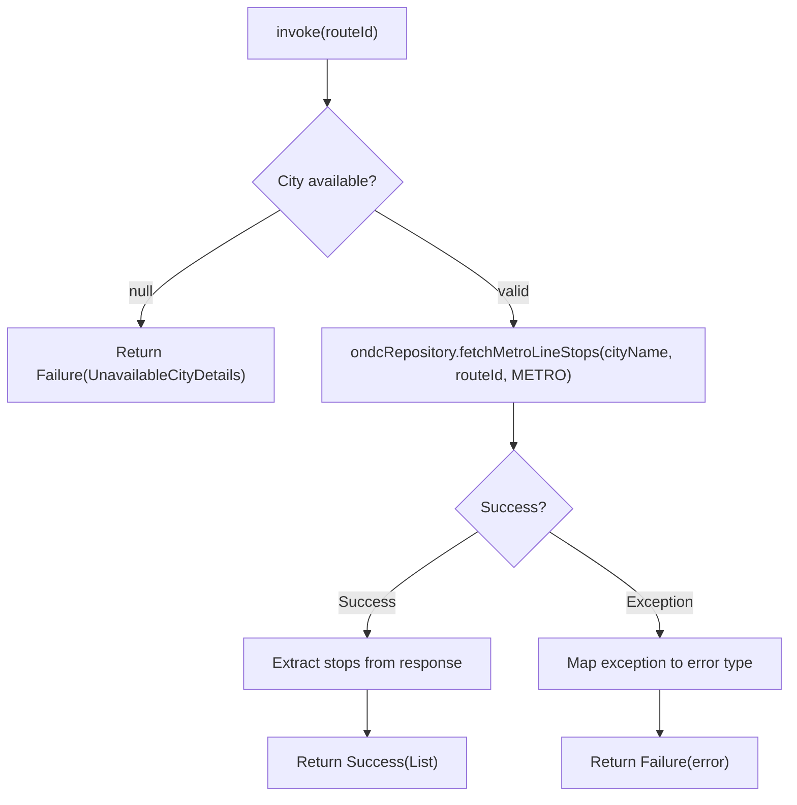
```mermaid
flowchart TD
    Start["invoke(routeId)"]
    GetCity{City available?}
    NoCityError["Return Failure(UnavailableCityDetails)"]
    CallRepo["ondcRepository.fetchMetroLineStops(cityName, routeId, METRO)"]
    CheckResponse{Success?}
    ExtractStops["Extract stops from response"]
    ReturnStops["Return Success(List<StopAppModel>)"]
    HandleException["Map exception to error type"]
    ReturnError["Return Failure(error)"]

    Start --> GetCity
    GetCity -->|null| NoCityError
    GetCity -->|valid| CallRepo
    CallRepo --> CheckResponse
    CheckResponse -->|Success| ExtractStops
    ExtractStops --> ReturnStops
    CheckResponse -->|Exception| HandleException
    HandleException --> ReturnError
```

### Input Parameters

| Parameter | Type | Description |
|-----------|------|-------------|
| **routeId** | String | Metro line/route identifier |

### Output

| Type | Description |
|------|-------------|
| **ChaloUseCaseResult<List<StopAppModel>, ProductBookingDataSourceError>** | Stop list or error |

### Special Exception Handling

| Exception | Error Mapping |
|-----------|--------------|
| **InvalidMetroLineStopListDataException** | ProductBookingDataSourceError.InvalidData |

---

## FetchAndStoreOndcMetroTicketUseCase

Fetches an ONDC metro ticket from the API and persists it to local storage. Similar to the regular metro version but for ONDC tickets.

### Responsibility

Orchestrates ONDC ticket fetching via `FetchOndcMetroTicketUseCase`, converts the API model to app model using `GetOndcMetroTicketAppModelFromApiUseCase`, and stores the result in the ONDC repository.

### Dependencies

| Dependency | Purpose |
|------------|---------|
| **OndcRepository** | Stores ticket via `insertOndcMetroTicket` |
| **FetchOndcMetroTicketUseCase** | Fetches ticket from API |
| **GetOndcMetroTicketAppModelFromApiUseCase** | Converts API to app model |

### Flow Diagram

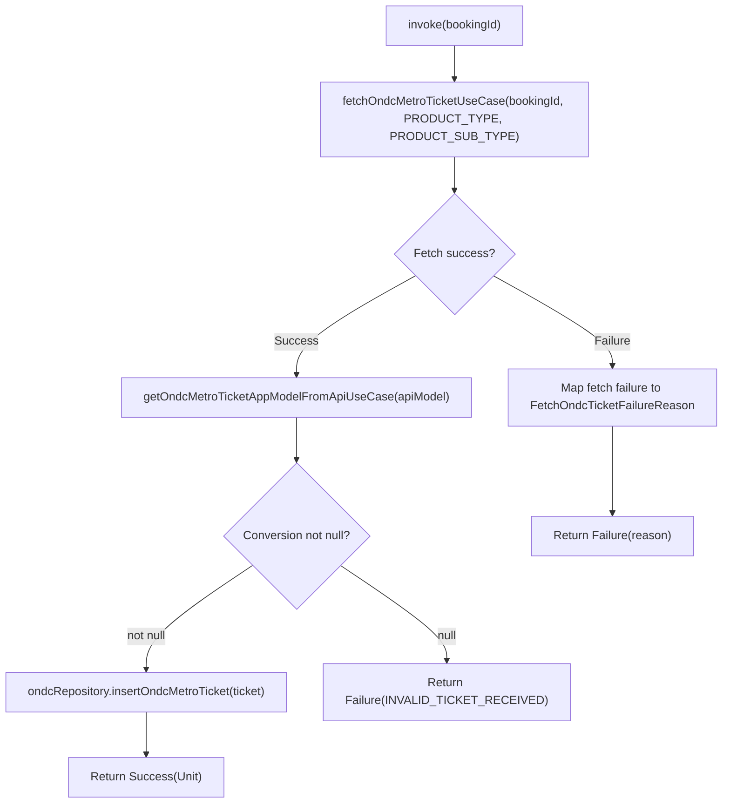
```mermaid
flowchart TD
    Start["invoke(bookingId)"]
    FetchTicket["fetchOndcMetroTicketUseCase(bookingId, PRODUCT_TYPE, PRODUCT_SUB_TYPE)"]
    CheckFetch{Fetch success?}
    ConvertModel["getOndcMetroTicketAppModelFromApiUseCase(apiModel)"]
    CheckConvert{Conversion not null?}
    StoreTicket["ondcRepository.insertOndcMetroTicket(ticket)"]
    ReturnSuccess["Return Success(Unit)"]
    MapFetchError["Map fetch failure to FetchOndcTicketFailureReason"]
    InvalidTicketError["Return Failure(INVALID_TICKET_RECEIVED)"]
    ReturnError["Return Failure(reason)"]

    Start --> FetchTicket
    FetchTicket --> CheckFetch
    CheckFetch -->|Success| ConvertModel
    CheckFetch -->|Failure| MapFetchError
    ConvertModel --> CheckConvert
    CheckConvert -->|not null| StoreTicket
    CheckConvert -->|null| InvalidTicketError
    StoreTicket --> ReturnSuccess
    MapFetchError --> ReturnError
```

### Output

| Type | Description |
|------|-------------|
| **ChaloUseCaseResult<Unit, FetchOndcTicketFailureReason>** | Success or failure reason |

---

## Domain Models

### MetroTicketStatus Enum

| Status | Description |
|--------|-------------|
| **ACTIVE** | Ticket ready for use, payment completed |
| **PAYMENT_PROCESSING** | Payment in progress |
| **PAYMENT_FAILED** | Payment failed |
| **USED** | Journey completed (exit validated) |
| **PUNCHED** | Ticket was punched |
| **EXPIRED** | Validity time passed |
| **FAILED** | Order creation failed |
| **CANCELLED** | User cancelled ticket |
| **TAPPED_IN** | Entry gate validated, journey in progress |

### ChaloTicketBookingMode

| Mode | Description |
|------|-------------|
| **SingleJourney** | Single passenger ticket (count = 1) |
| **Group** | Multiple passengers (count > 1) |
| **Unknown** | Unset or invalid mode |

### ProductBookingDataSourceError Sealed Class

| Type | Description |
|------|-------------|
| **Local** | Local/network exception with message |
| **API** | API error with message and optional code |
| **ResponseParsing** | JSON parse failure |
| **InvalidData** | Invalid response structure |
| **UnavailableCityDetails** | City not available from provider |
| **Unknown** | Unhandled error with message |

---

## Business Rules

| Rule | Description | Enforced By |
|------|-------------|-------------|
| **City required** | Fare/line/stop operations require valid city | FetchTicketBookingsFareUseCase, FetchOndcMetroLinesUseCase |
| **Booking ID validation** | Fetched ticket must match requested booking ID | FetchMetroTicketUseCase |
| **Valid conversion** | API model must convert successfully to app model | FetchAndStoreMetroTicketUseCase |
| **Lowercase city** | City name sent lowercase to API | CreateMetroTicketOrderUseCase |
| **Transit mode** | Metro operations use ChaloTransitMode.METRO | GetMetroFinalFareUseCase |

---

## Sequence Diagrams

### Stop-Based Booking Flow

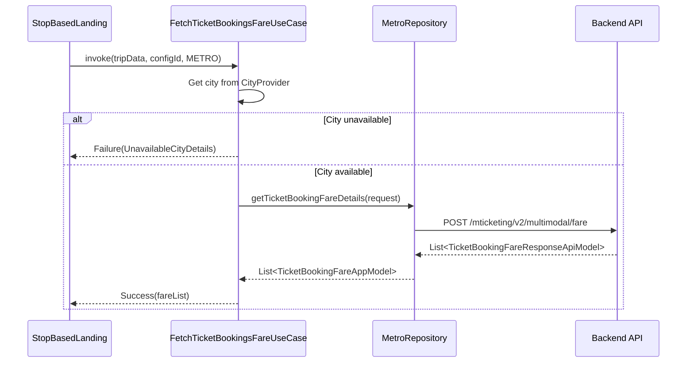
```mermaid
sequenceDiagram
    participant UI as StopBasedLanding
    participant FareUC as FetchTicketBookingsFareUseCase
    participant Repo as MetroRepository
    participant API as Backend API

    UI->>FareUC: invoke(tripData, configId, METRO)
    FareUC->>FareUC: Get city from CityProvider
    alt City unavailable
        FareUC-->>UI: Failure(UnavailableCityDetails)
    else City available
        FareUC->>Repo: getTicketBookingFareDetails(request)
        Repo->>API: POST /mticketing/v2/multimodal/fare
        API-->>Repo: List<TicketBookingFareResponseApiModel>
        Repo-->>FareUC: List<TicketBookingFareAppModel>
        FareUC-->>UI: Success(fareList)
    end
```

### Order Creation Flow

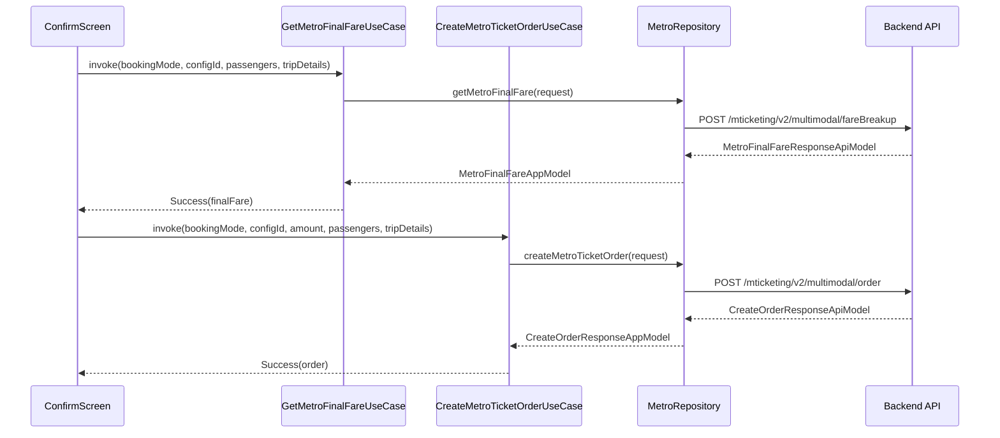
```mermaid
sequenceDiagram
    participant UI as ConfirmScreen
    participant FinalFareUC as GetMetroFinalFareUseCase
    participant OrderUC as CreateMetroTicketOrderUseCase
    participant Repo as MetroRepository
    participant API as Backend API

    UI->>FinalFareUC: invoke(bookingMode, configId, passengers, tripDetails)
    FinalFareUC->>Repo: getMetroFinalFare(request)
    Repo->>API: POST /mticketing/v2/multimodal/fareBreakup
    API-->>Repo: MetroFinalFareResponseApiModel
    Repo-->>FinalFareUC: MetroFinalFareAppModel
    FinalFareUC-->>UI: Success(finalFare)

    UI->>OrderUC: invoke(bookingMode, configId, amount, passengers, tripDetails)
    OrderUC->>Repo: createMetroTicketOrder(request)
    Repo->>API: POST /mticketing/v2/multimodal/order
    API-->>Repo: CreateOrderResponseApiModel
    Repo-->>OrderUC: CreateOrderResponseAppModel
    OrderUC-->>UI: Success(order)
```

### Ticket Fetch and Store Flow

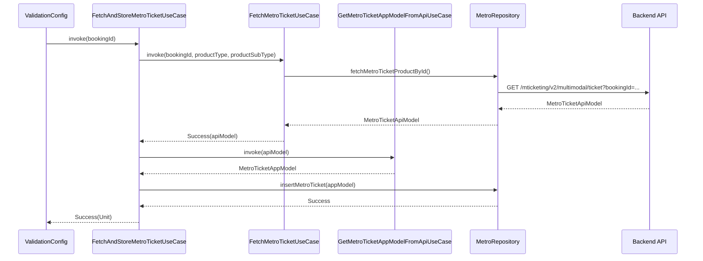
```mermaid
sequenceDiagram
    participant Caller as ValidationConfig
    participant FetchStoreUC as FetchAndStoreMetroTicketUseCase
    participant FetchUC as FetchMetroTicketUseCase
    participant ConvertUC as GetMetroTicketAppModelFromApiUseCase
    participant Repo as MetroRepository
    participant API as Backend API

    Caller->>FetchStoreUC: invoke(bookingId)
    FetchStoreUC->>FetchUC: invoke(bookingId, productType, productSubType)
    FetchUC->>Repo: fetchMetroTicketProductById()
    Repo->>API: GET /mticketing/v2/multimodal/ticket?bookingId=...
    API-->>Repo: MetroTicketApiModel
    Repo-->>FetchUC: MetroTicketApiModel
    FetchUC-->>FetchStoreUC: Success(apiModel)

    FetchStoreUC->>ConvertUC: invoke(apiModel)
    ConvertUC-->>FetchStoreUC: MetroTicketAppModel

    FetchStoreUC->>Repo: insertMetroTicket(appModel)
    Repo-->>FetchStoreUC: Success
    FetchStoreUC-->>Caller: Success(Unit)
```

### ONDC Line Selection Flow

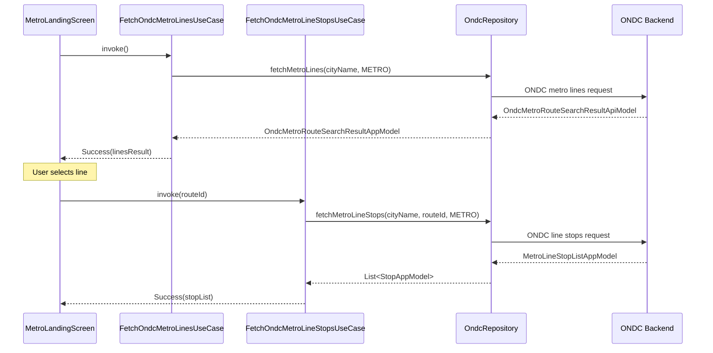
```mermaid
sequenceDiagram
    participant UI as MetroLandingScreen
    participant LinesUC as FetchOndcMetroLinesUseCase
    participant StopsUC as FetchOndcMetroLineStopsUseCase
    participant Repo as OndcRepository
    participant API as ONDC Backend

    UI->>LinesUC: invoke()
    LinesUC->>Repo: fetchMetroLines(cityName, METRO)
    Repo->>API: ONDC metro lines request
    API-->>Repo: OndcMetroRouteSearchResultApiModel
    Repo-->>LinesUC: OndcMetroRouteSearchResultAppModel
    LinesUC-->>UI: Success(linesResult)

    Note over UI: User selects line

    UI->>StopsUC: invoke(routeId)
    StopsUC->>Repo: fetchMetroLineStops(cityName, routeId, METRO)
    Repo->>API: ONDC line stops request
    API-->>Repo: MetroLineStopListAppModel
    Repo-->>StopsUC: List<StopAppModel>
    StopsUC-->>UI: Success(stopList)
```

---

## Error Handling Patterns

### Standard Exception to Error Mapping

All metro use cases follow a consistent pattern for mapping exceptions:

```
try {
    // Repository call
    return ChaloUseCaseResult.Success(data)
} catch (exception: Exception) {
    return when (exception) {
        is ChaloLocalException -> Failure(Local(message))
        is ProductBookingRemoteDataException -> Failure(API(message, code))
        is NetworkSuccessResponseParseException -> Failure(ResponseParsing)
        else -> Failure(Unknown(message))
    }
}
```

### Analytics on Failure

Use cases that track analytics on failure include event properties:

| Property | Value |
|----------|-------|
| **type** | Exception class simple name |
| **reason** | Exception message |
| **Additional flags** | Use-case specific indicators (e.g., INVALID_RESPONSE) |

---

## Testing Considerations

Each use case can be tested in isolation by mocking:

1. **Repository** - Primary data dependency (MetroRepository or OndcRepository)
2. **CityProvider** - City information (test null city scenarios)
3. **AnalyticsContract** - Event tracking (verify failure events)
4. **Dependent UseCases** - For composite use cases (FetchAndStore patterns)

### Test Scenarios

| Scenario Type | Examples |
|---------------|----------|
| **Success paths** | Valid data, successful API responses |
| **City failures** | Null city from provider |
| **API failures** | Server errors, specific error codes (5002) |
| **Parse failures** | Malformed responses |
| **Composite failures** | Fetch succeeds but conversion fails |
| **Edge cases** | Empty lists, null optional fields |
