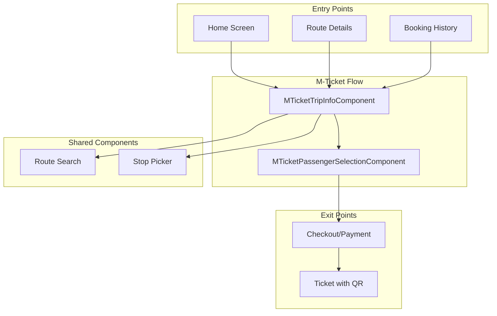
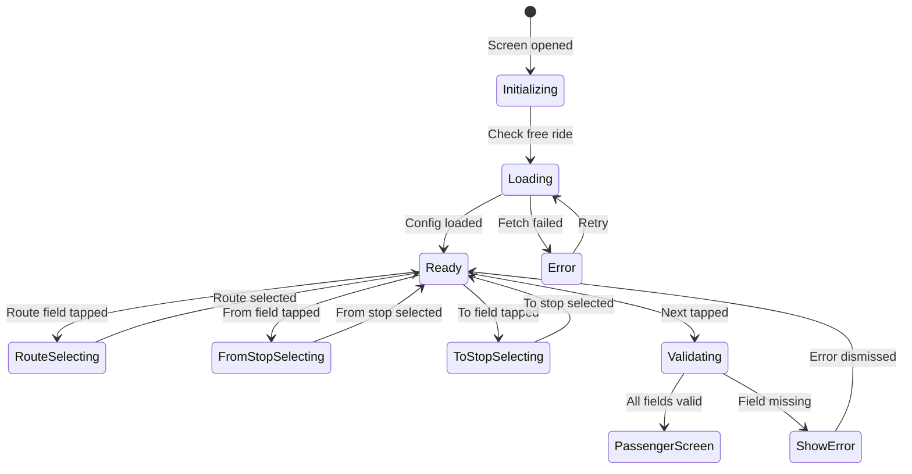
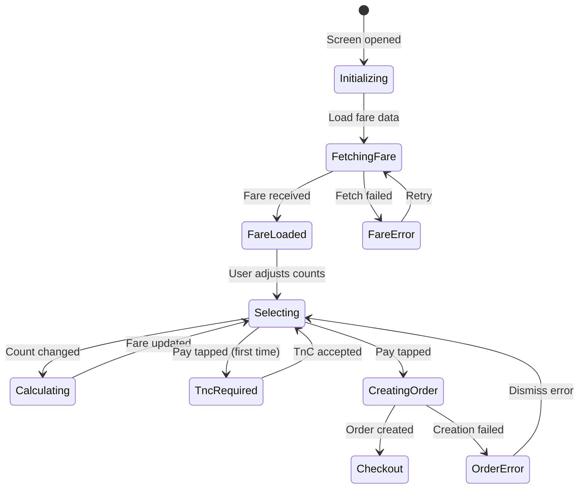
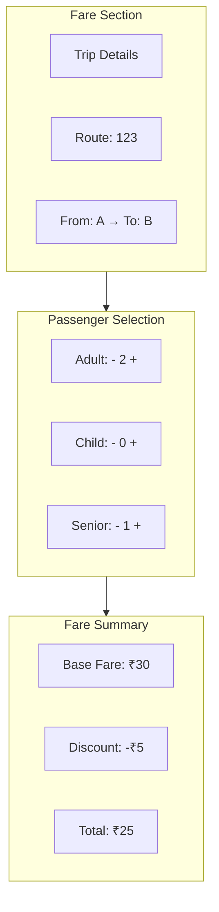
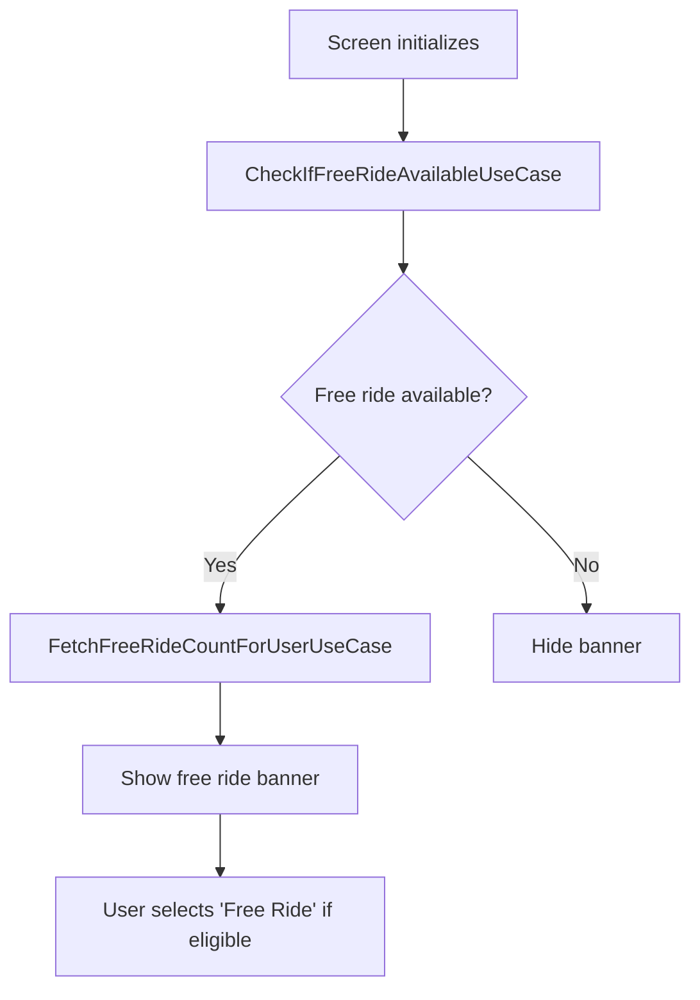
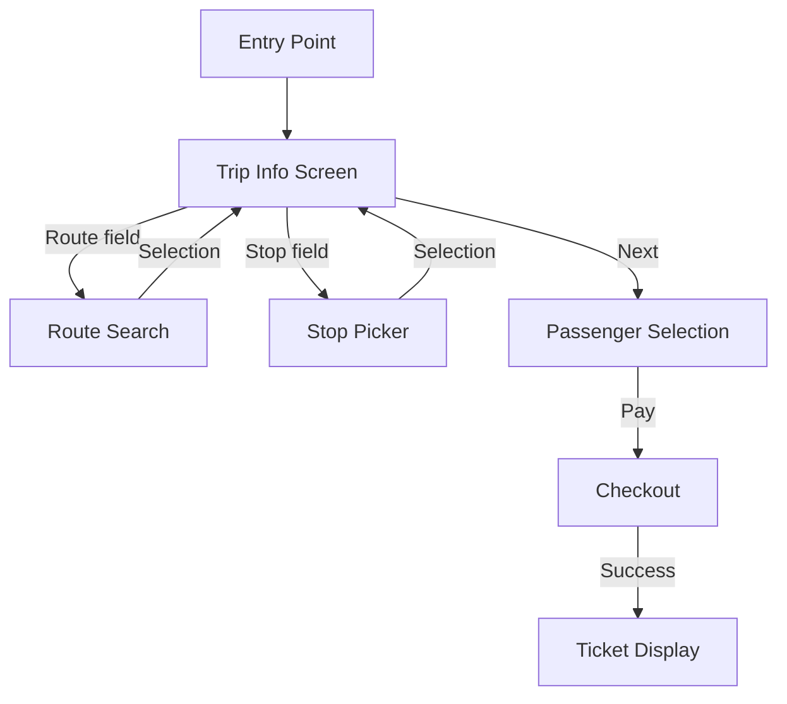

# M-Ticket — Component Documentation

## Architecture Overview

The M-Ticket presentation layer implements a two-screen booking flow using Decompose components. The first screen handles route and stop selection, while the second manages passenger counts and fare confirmation. Both components follow MVI patterns with well-defined state contracts and support process death recovery.

---

## Screen Inventory

| Screen | Component | Purpose |
|--------|-----------|---------|
| **Trip Info** | MTicketTripInfoComponent | Route and stop selection |
| **Passenger Selection** | MTicketPassengerSelectionComponent | Passenger counts and fare confirmation |

---

## Trip Info Screen

The trip info screen is the entry point for M-Ticket booking. Users select their route and from/to stops before proceeding to passenger selection.

### User Journey

1. User enters from home, route details, or history
2. Screen checks free ride availability
3. User taps route field to search routes
4. User selects route from search results
5. User taps from-stop field and selects stop
6. User taps to-stop field and selects destination
7. User taps "Next" to proceed
8. System validates selections and navigates to passenger selection

### State Flow

### View State Structure

The data state captures all screen information:

| Field | Type | Description |
|-------|------|-------------|
| **source** | Source? | Entry point (home, route, history) |
| **selectedRoute** | ProductBookingRouteDetails? | Selected route info |
| **fromStop** | ProductBookingStopDetails? | Origin stop |
| **toStop** | ProductBookingStopDetails? | Destination stop |
| **isLoading** | Boolean | Loading indicator |
| **snackBarType** | MTicketTripInfoSnackBarType? | Transient messages |
| **freeRideInfoBanner** | String? | Free ride banner text |
| **brandingAgency** | String? | Agency branding |
| **isFreeRideAvailableForUser** | Boolean? | Free ride eligibility |
| **missingFieldError** | MTicketTripInfoMissingFieldError? | Validation error |

### Intents

| Intent | Trigger | Action |
|--------|---------|--------|
| **InitialisationIntent** | Screen mount | Initialize with source, route, productId |
| **RetryFetchFreeRideValidityIntent** | Retry button | Re-check free ride availability |
| **RetryFetchProductConfigurationIntent** | Retry button | Re-fetch product config |
| **RouteOptionClickedIntent** | Route field tap | Navigate to route search |
| **RouteDataReceivedIntent** | Route selected | Update selected route |
| **StopOptionClickedIntent** | Stop field tap | Navigate to stop picker (from/to) |
| **StopDataReceivedIntent** | Stop selected | Update from or to stop |
| **NextClickedIntent** | Next button | Validate and navigate forward |
| **FreeRideBannerClickedIntent** | Banner tap | Show free ride info |

### Missing Field Errors

| Error | Meaning | Display |
|-------|---------|---------|
| **ROUTE** | No route selected | "Please select a route" |
| **FROM_STOP** | No from stop selected | "Please select boarding stop" |
| **TO_STOP** | No to stop selected | "Please select destination stop" |

### Side Effects

| Effect | When Triggered | Result |
|--------|----------------|--------|
| **NavigateToRouteSearch** | Route field tapped | Open route picker |
| **NavigateToStopPicker** | Stop field tapped | Open stop picker for route |
| **NavigateToPassengerSelection** | Next with valid data | Pass route/stops to next screen |
| **ShowFreeRideInfo** | Banner tapped | Open free ride help URL |

---

## Passenger Selection Screen

The passenger selection screen displays fare breakdown and allows users to select passenger counts before payment.

### User Journey

1. Screen receives route and stops from trip info
2. System fetches fare from API
3. Fare breakdown displayed by passenger type
4. User adjusts passenger counts using +/- buttons
5. System recalculates total fare on each change
6. User reviews fare and taps "Pay"
7. System creates order and navigates to checkout

### State Flow

### View State Structure

| Field | Type | Description |
|-------|------|-------------|
| **routeDetails** | ProductBookingRouteDetails? | Selected route |
| **fromStopDetails** | ProductBookingStopDetails? | Origin stop |
| **toStopDetails** | ProductBookingStopDetails? | Destination stop |
| **showPayBtn** | Boolean | Enable pay button |
| **brandingAgency** | String? | Agency branding |
| **productConfig** | SingleJourneyTicketAppModel? | Product configuration |
| **source** | Source? | Entry source for analytics |
| **isLoading** | Boolean | Loading indicator |
| **showError** | Boolean | Error state |
| **snackBarType** | MTicketTripInfoSnackBarType? | Transient messages |
| **fareDetails** | MTicketFareResponseAppModel? | Fare API response |
| **showFaresChangedDialog** | Boolean | Fare change alert |
| **passengerSelectionContainer** | MTicketPassengerSelectionContainer? | Passenger counts manager |
| **fareContainer** | MTicketFareContainer? | Calculated fare wrapper |
| **showTncDialog** | ShowTncDialogData? | Terms dialog state |
| **expandTripDetailsSection** | Boolean | Trip details expanded |

### Intents

| Intent | Trigger | Action |
|--------|---------|--------|
| **InitialisationIntent** | Screen mount | Initialize with route/stops/config |
| **RestoreFromProcessDeathIntent** | App restored | Restore saved state |
| **RetryProductFetchIntent** | Retry button | Re-fetch product config |
| **RetryFareFetchIntent** | Retry button | Re-fetch fare |
| **IncrementPassengerCount** | + button | Increase passenger type count |
| **DecrementPassengerCount** | - button | Decrease passenger type count |
| **PayClickedIntent** | Pay button | Create order and checkout |
| **TncClickedIntent** | TnC link | Show terms dialog |
| **TncActionClicked** | Dialog button | Accept or reject TnC |
| **ToggleTripDetailsVisibility** | Section header | Expand/collapse trip info |
| **DismissFareChangedDialog** | Dialog dismiss | Close fare alert |

### Passenger Selection Container

The container manages passenger type sections:

| Property | Description |
|----------|-------------|
| **passengerItems** | List of passenger type items |
| **minTotal** | Minimum total passengers |
| **maxTotal** | Maximum total passengers |

Each passenger item contains:

| Field | Type | Description |
|-------|------|-------------|
| **passengerType** | String | Type identifier (adult, child, etc.) |
| **count** | Int | Selected count |
| **maxSelectionsAllowed** | Int | Maximum per type |
| **minSelectionsAllowed** | Int | Minimum per type |
| **isEnabled** | Boolean | Can be modified |

### Side Effects

| Effect | When Triggered | Result |
|--------|----------------|--------|
| **ShowTncDialog** | Pay tapped first time | Display terms dialog |
| **NavigateToCheckout** | Order created | Pass order to payment |
| **ShowFareChangedAlert** | Fare different from last | Alert user of change |
| **ShowSnackbar** | Transient messages | Brief notification |

---

## Fare Display

### Fare Breakdown Structure

### Fare Container

The fare container wraps MTicket for calculation:

| Method | Returns | Description |
|--------|---------|-------------|
| **isFreeRide()** | Boolean | Is this a free ride |
| **getTotalFare()** | Double | Calculated total |
| **passengerDetailsMap()** | Map | Fare by passenger type |
| **isAnyPassengerCategorySelected()** | Boolean | At least one selected |
| **getTotalDiscountAmount()** | Double | Total discount applied |

---

## Passenger Types

Passenger categories come from product configuration:

| Type | Description | Typical Discount |
|------|-------------|------------------|
| **Adult** | Standard fare | 0% |
| **Child** | Below age threshold | 50% |
| **Senior** | Above age threshold | 50% |
| **Student** | With valid ID | 25% |

Each agency may define different categories and discounts.

---

## Free Ride Integration

### Free Ride Banner

When free rides are available:

| State | Banner Display |
|-------|----------------|
| **Available** | "You have X free rides available!" |
| **Not eligible** | Hidden |
| **Error checking** | Hidden |

### Free Ride Flow

---

## Fare Changed Dialog

When fare differs from user's last booking:

| Element | Content |
|---------|---------|
| **Title** | "Fare Updated" |
| **Message** | "Fare has changed since your last booking" |
| **Primary Action** | "Continue" |
| **Secondary Action** | "Cancel" |

---

## Terms and Conditions

### TnC Dialog States

| State | Action |
|-------|--------|
| **Not shown** | User hasn't tapped pay |
| **Showing** | Dialog visible |
| **Accepted** | Proceed to payment |
| **Rejected** | Return to selection |

### Dialog Content

| Field | Description |
|-------|-------------|
| **title** | "Terms & Conditions" |
| **content** | TnC text from config |
| **acceptButton** | "Accept & Continue" |
| **rejectButton** | "Cancel" |

---

## State Preservation

### Process Death Recovery

Both screens support state restoration via Decompose's StateKeeper.

**Trip Info Restored State:**

| Field | Description |
|-------|-------------|
| source | Entry point |
| selectedRoute | Route selection |
| fromStop | From stop |
| toStop | To stop |

**Passenger Selection Restored State:**

| Field | Description |
|-------|-------------|
| productConfigId | Product config reference |
| routeDetails | Selected route |
| fromStopDetails | From stop |
| toStopDetails | To stop |
| source | Entry source |
| passengerSelectionContainer | Selected counts |

---

## Navigation Flow

---

## Analytics Events

| Event | Screen | Trigger |
|-------|--------|---------|
| **mticket_trip_info_screen_opened** | Trip Info | Screen mount |
| **mticket_route_selected** | Trip Info | Route chosen |
| **mticket_from_stop_selected** | Trip Info | From stop chosen |
| **mticket_to_stop_selected** | Trip Info | To stop chosen |
| **mticket_passenger_selection_opened** | Passenger Selection | Screen mount |
| **mticket_passenger_count_changed** | Passenger Selection | Count adjusted |
| **mticket_pay_clicked** | Passenger Selection | Pay tapped |
| **mticket_order_created** | Passenger Selection | Order success |
| **mticket_booking_success** | Success | Ticket generated |

---

## Error Handling

| Error Scenario | Screen | UI Response |
|----------------|--------|-------------|
| **Free ride check failed** | Trip Info | Hide banner, log error |
| **Product config failed** | Both | Error state with retry |
| **Fare fetch failed** | Passenger Selection | Error snackbar with retry |
| **Order creation failed** | Passenger Selection | Error dialog with retry |
| **Network error** | Both | Snackbar with retry |
| **Invalid route/stops** | Trip Info | Missing field error |
