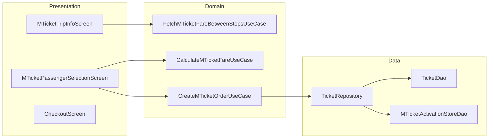
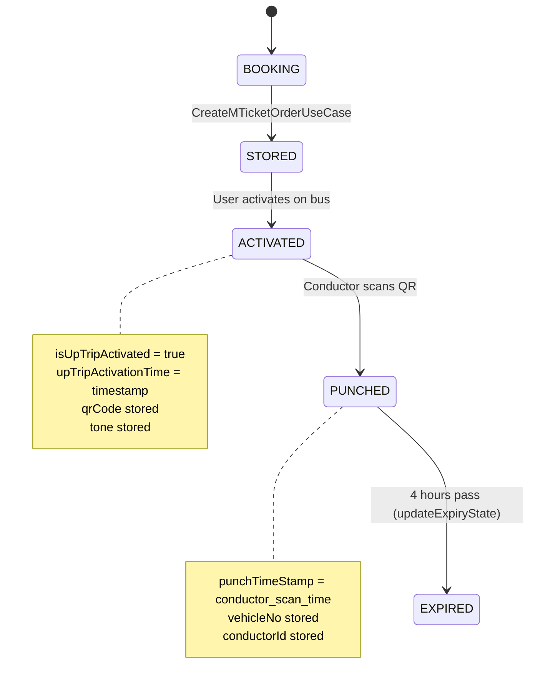

# M-Ticket — High-Level Design

## Overview

The M-Ticket (Mobile Ticket) feature enables users to book city bus tickets within the Chalo app. Users select routes and stops, choose passenger types, view fares, and pay to receive a digital ticket with QR code for conductor validation. Tickets have a configurable validity period (default 4 hours) and store punch/validation data after use.

## User Journey

1. **Entry Points**:
   - Home screen → M-Ticket card
   - Route details → Book ticket button
   - History → Book again

2. **Core Flow**:
   - Select route
   - Choose from/to stops
   - Select passenger count by type
   - View fare breakdown
   - Pay for ticket
   - Receive QR code and tone

3. **Exit Points**:
   - Successful booking → Ticket display with QR
   - Payment failure → Retry or cancel
   - Ticket expired → History

## Architecture Diagram



## Key Components

| Component | Platform | File Path | Responsibility |
|-----------|----------|-----------|----------------|
| `MTicketTripInfoComponent` | Shared | `shared/home/.../mticket/ui/tripinfo/MTicketTripInfoComponent.kt` | Route and stop selection |
| `MTicketPassengerSelectionComponent` | Shared | `shared/home/.../mticket/ui/passengerselection/MTicketPassengerSelectionComponent.kt` | Passenger count and fare |
| `FetchMTicketFareBetweenStopsUseCase` | Shared | `shared/home/.../mticket/domain/FetchMTicketFareBetweenStopsUseCase.kt` | Fetch fare from API |
| `CalculateMTicketFareUseCase` | Shared | `shared/home/.../mticket/domain/CalculateMTicketFareUseCase.kt` | Calculate total fare |
| `CreateMTicketOrderUseCase` | Shared | `shared/home/.../mticket/domain/CreateMTicketOrderUseCase.kt` | Create booking order |
| `TicketRepository` | Shared | `shared/home/.../data/repository/TicketRepository.kt` | Ticket data management |
| `MTicketUtilsHelper` | Shared | `shared/home/.../models/mticketing/MTicketUtilsHelper.kt` | Ticket utilities |

## Data Flow

### Route and Stop Selection
1. `MTicketTripInfoComponent` initializes
2. User selects route from search
3. User selects from/to stops on route
4. `FetchMTicketFareBetweenStopsUseCase` fetches fare details
5. Navigate to passenger selection

### Passenger Selection and Payment
1. `MTicketPassengerSelectionComponent` displays fare breakdown
2. User adjusts passenger counts per type
3. `CalculateMTicketFareUseCase` recalculates totals
4. User confirms and proceeds to pay
5. `CreateMTicketOrderUseCase` creates order with payment gateway
6. On success, ticket stored via `TicketRepository`

### Ticket Activation and Validation
1. Ticket stored with QR code and tone
2. `saveActivationInfoToOfflineStore()` records activation
3. Conductor scans QR → `MTicketTripReceipt` generated
4. Receipt stored via `addMticketReceiptToMTicket()`
5. After validity period, ticket marked expired

## Platform Differences

### Android-Specific
- Native date/time formatting
- QR code generation via ZXing
- Audio playback for tone

### iOS-Specific
- Core Image for QR generation
- AVFoundation for audio
- SwiftUI integration via SKIE

## Integration Points

### Analytics Events
- See [Analytics: mticket](/analytics/flows/mticket) for event documentation
- Key events:
  - `mticket_trip_info_screen_opened`
  - `mticket_route_selected`
  - `mticket_stops_selected`
  - `mticket_passenger_selection_opened`
  - `mticket_payment_initiated`
  - `mticket_booking_success`

### Shared Services
- **Payment**: Checkout module for payment processing
- **Product Config**: `ProductPurchaseRepository` for fare data
- **Location**: Route and stop information

### Navigation
- **Navigates to**: Checkout, Ticket display
- **Navigated from**: Home, Route details, History

## Ticket Lifecycle



## Edge Cases & Error Handling

| Scenario | Handling |
|----------|----------|
| Fare fetch failed | Shows retry snackbar |
| Route not available | Shows empty state |
| Payment failed | Returns to passenger selection |
| Ticket already expired | Shows in expired history |
| No network at validation | Offline validation supported |
| Fare changed during booking | Shows fare change dialog |

## Data Models

### MTicket
```kotlin
data class MTicket(
    val mTicketId: String,
    val userId: String,
    val deviceId: String,
    val cityName: String,
    val agency: String,
    val upTripRouteStopsInfo: RouteStopsInfo,
    val passengerDetails: Map<String, MTicketPassengerInfo>,
    val bookingTime: Long,
    val expirationTime: Long,
    val isUpTripActivated: Boolean,
    val upTripActivationTime: Long,
    val upTripPunchingTime: Long,
    val qrCode: String,
    val tone: String,
    val isFreeRide: Boolean,
    val mticketTripReceipt: MTicketTripReceipt?,
    val orderId: String,
    val status: String
)
```

### MTicketPassengerInfo
```kotlin
data class MTicketPassengerInfo(
    val fare: Double,
    val totalFare: Double,
    val discountPercentage: Double,
    val passengerCount: Int,
    val addMap: Map<String, Double>,
    val subMap: Map<String, Double>,
    val roundingLogic: Int
)
```

### MTicketActivationInfoAppModel
```kotlin
data class MTicketActivationInfoAppModel(
    val city: String,
    val mticketId: String,
    val activatedAt: Long,
    val isActivated: Boolean
)
```

## Dependencies

### Internal
- `shared:home` — M-Ticket components
- `shared:checkout` — Payment processing
- `shared:chalo-base` — Base models, utilities

### External
- SQLDelight — Local ticket storage
- DataStore — Activation persistence
