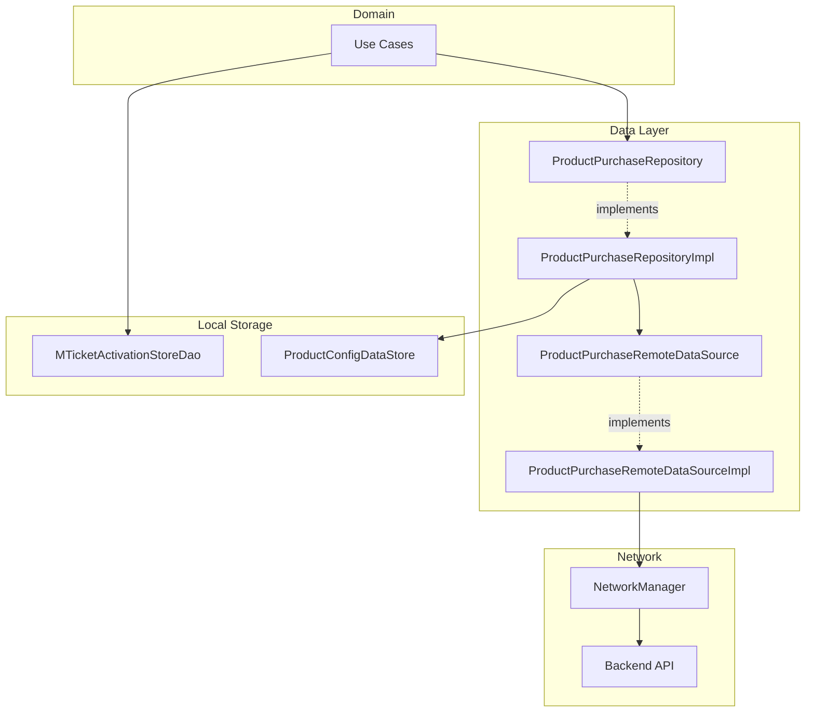
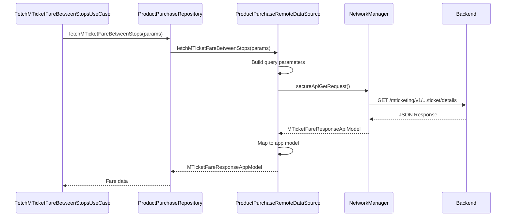
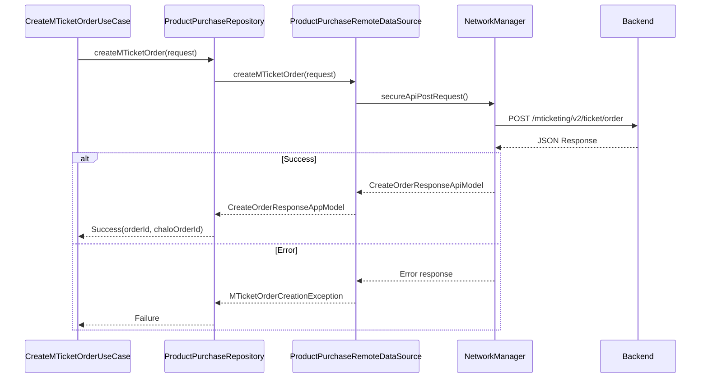
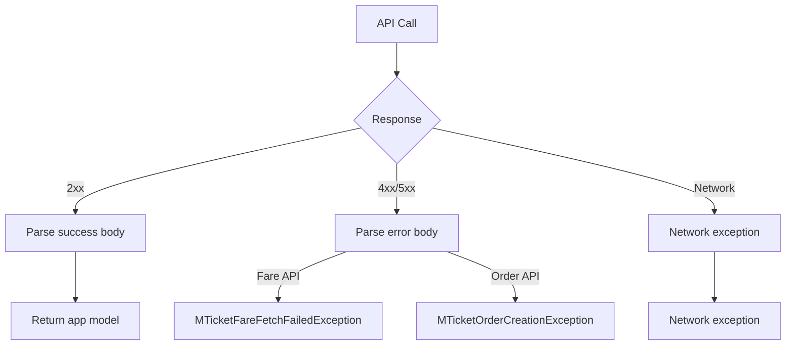
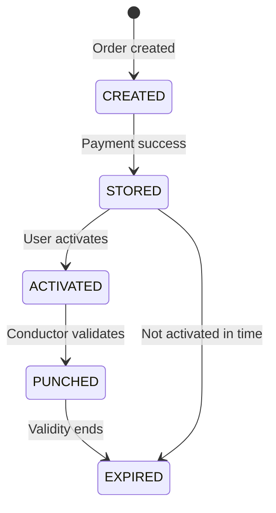

# M-Ticket — Repository Documentation

## Data Layer Overview

The M-Ticket data layer handles API communication for fare fetching, order creation, and free ride management. The layer uses the ProductPurchaseRepository for shared product operations and dedicated DAOs for ticket persistence.

---

## Repository Interface

The `ProductPurchaseRepository` interface includes M-Ticket specific operations.

### M-Ticket Operations

| Method | Purpose | Returns |
|--------|---------|---------|
| **fetchMTicketFareBetweenStops** | Get fare for route/stops | MTicketFareResponseAppModel |
| **createMTicketOrder** | Create booking order | CreateOrderResponseAppModel |
| **fetchFreeRideCount** | Get user's free ride count | Int |

---

## API Endpoints

### Fetch Fare Between Stops

Retrieves fare details for a specific route and stop combination.

| Property | Value |
|----------|-------|
| **Endpoint** | GET /mticketing/v1/cities/{city}/agencies/{agency}/ticket/details |
| **Auth** | Required (Bearer token) |

**Query Parameters:**

| Parameter | Type | Description |
|-----------|------|-------------|
| **routeId** | String | Route identifier |
| **routeName** | String | Route display name |
| **startStopId** | String | Boarding stop ID |
| **startStopName** | String | Boarding stop name |
| **endStopId** | String | Destination stop ID |
| **endStopName** | String | Destination stop name |
| **specialFeature** | List<String> | Route special features |

**Response: MTicketFareResponseApiModel**

| Field | Type | Description |
|-------|------|-------------|
| **fares** | MTicketFareDataResponseApiModel | Fare breakdown |
| **routeDetails** | MTicketFareRouteStageResponseApiModel? | Stage pricing |
| **stagePricingLogic** | Int? | Stage calculation rule |

---

### Create M-Ticket Order

Creates a booking order for payment processing.

| Property | Value |
|----------|-------|
| **Endpoint** | POST /mticketing/v2/ticket/order |
| **Auth** | Required |

**Request Body: MTicketOrderCreationRequestApiModel**

| Field | Type | Description |
|-------|------|-------------|
| **bookingData** | MTicketOrderCreationBookingDataRequestApiModel | Trip details |
| **configurationId** | String | Product config ID |
| **isFreeRide** | Boolean | Free ride flag |
| **clientTransactionId** | String | Unique transaction ID |
| **city** | String | City name |

**Booking Data Fields:**

| Field | Type | Description |
|-------|------|-------------|
| **routeId** | String | Route identifier |
| **routeName** | String | Route name |
| **startStopId** | String | Boarding stop ID |
| **startStopName** | String | Boarding stop name |
| **endStopId** | String | Destination ID |
| **endStopName** | String | Destination name |
| **specialFeatureList** | List<String> | Route features |
| **validDuration** | Long | Ticket validity (ms) |
| **passengerDetails** | String | JSON passenger data |
| **routeStageDetails** | RouteStageDetails? | Stage info |

**Response: CreateOrderResponseAppModel**

| Field | Type | Description |
|-------|------|-------------|
| **orderId** | String | Backend order ID |
| **chaloOrderId** | String | Payment reference |

---

### Fetch Free Ride Count

Gets the number of free rides available for the user.

| Property | Value |
|----------|-------|
| **Endpoint** | GET /mticketing/v1/cities/{city}/agencies/{agency}/user/{userId}/available-freeride |
| **Auth** | Required |

**Path Parameters:**

| Parameter | Type | Description |
|-----------|------|-------------|
| **city** | String | City name |
| **agency** | String | Transit agency |
| **userId** | String | User identifier |

**Response:**

| Field | Type | Description |
|-------|------|-------------|
| **count** | Int | Available free rides |

---

### Fetch Product Configs

Retrieves all product configurations for the city.

| Property | Value |
|----------|-------|
| **Endpoint** | GET /configuration/v3/cities/{city}/products |
| **Auth** | Required |

**Response: ProductConfigResponseAppModel**

Contains array of product configurations including M-Ticket configs.

---

## Data Flow Diagrams

### Fare Fetch Flow

### Order Creation Flow

---

## Data Transformation

### API to App Model Mapping

**Fare Response Mapping:**

| API Field | App Field | Transform |
|-----------|-----------|-----------|
| fares | fares | Nested mapping |
| routeDetails | routeDetails | Direct |
| stagePricingLogic | stagePricingLogic | Direct |

**Fare Data Mapping:**

| API Field | App Field | Transform |
|-----------|-----------|-----------|
| discountPercentage | discountPercentage | Direct |
| roundingLogic | roundingLogic | Direct |
| passengerDetails | passengerDetails | Map with type key |

**Passenger Fare Mapping (Compressed API):**

| API Field | App Field | Description |
|-----------|-----------|-------------|
| f | fare | Base fare |
| ff | totalFare | Calculated total |
| d | discountPercentage | Discount |
| f_br | fareBreakdown | Breakdown object |

---

## Exception Handling

### Exception Flow

### Exception Types

| Exception | When Thrown | Contains |
|-----------|-------------|----------|
| **MTicketFareFetchFailedException** | Fare fetch failed | Error message |
| **MTicketOrderCreationException** | Order creation failed | Error response |
| **AllProductsConfigFetchFailedException** | Config fetch failed | Error message |

---

## Local Storage

### Ticket Activation Store

The `MTicketActivationStoreDao` persists activation information for offline validation.

**Interface Methods:**

| Method | Parameters | Returns |
|--------|------------|---------|
| **setMTicketActivationInfo** | MTicketActivationInfoAppModel | Unit |
| **getMTicketActivationInfo** | city: String, ticketId: String | MTicketActivationInfoAppModel? |

**Activation Info Model:**

| Field | Type | Description |
|-------|------|-------------|
| **city** | String | City name |
| **mticketId** | String | Ticket identifier |
| **activatedAt** | Long | Activation timestamp |
| **isActivated** | Boolean | Activation status |

**Implementation:**

| Property | Value |
|----------|-------|
| Storage | SQLDelight database |
| Table | mticket_activation_store_table |

### Product Config Store

Product configurations are cached locally for offline access.

| Property | Value |
|----------|-------|
| Storage | DataStore |
| Key | product_configs_{city} |
| Format | Serialized JSON |

---

## Dependency Injection

### Module Bindings

| Interface | Implementation |
|-----------|----------------|
| ProductPurchaseRepository | ProductPurchaseRepositoryImpl |
| ProductPurchaseRemoteDataSource | ProductPurchaseRemoteDataSourceImpl |
| MTicketActivationStoreDao | MTicketActivationStoreDaoImpl |

### Repository Dependencies

**ProductPurchaseRepositoryImpl:**

| Dependency | Purpose |
|------------|---------|
| ProductPurchaseRemoteDataSource | API calls |
| ProductConfigDataStore | Local config cache |

**ProductPurchaseRemoteDataSourceImpl:**

| Dependency | Purpose |
|------------|---------|
| NetworkManager | HTTP client |

---

## Request/Response Models

### Request Models

**MTicketOrderCreationRequestApiModel:**

| Field | Type | Required |
|-------|------|----------|
| bookingData | BookingData | Yes |
| configurationId | String | Yes |
| isFreeRide | Boolean | Yes |
| clientTransactionId | String | Yes |
| city | String | Yes |

**MTicketOrderCreationBookingDataRequestApiModel:**

| Field | Type | Required |
|-------|------|----------|
| routeId | String | Yes |
| routeName | String | Yes |
| startStopId | String | Yes |
| startStopName | String | Yes |
| endStopId | String | Yes |
| endStopName | String | Yes |
| specialFeatureList | List<String> | No |
| validDuration | Long | Yes |
| passengerDetails | String | Yes |
| routeStageDetails | RouteStageDetails? | No |

### Response Models

**MTicketFareResponseApiModel:**

| Field | Type |
|-------|------|
| fares | MTicketFareDataResponseApiModel? |
| routeDetails | MTicketFareRouteStageResponseApiModel? |
| stagePricingLogic | Int? |

**MTicketFareDataResponseApiModel:**

| Field | Type |
|-------|------|
| discountPercentage | Double? |
| roundingLogic | Int? |
| passengerDetails | Map<String?, PassengerFare?> |

**MTicketPassengerFareResponseApiModel:**

| Field (SerialName) | Type | Description |
|--------------------|------|-------------|
| f (fare) | Double | Base fare |
| ff (totalFare) | Double? | Total fare |
| d (discount) | Double? | Discount |
| f_br (fareBreakdown) | FareBreakdown? | Breakdown |

**CreateOrderResponseAppModel:**

| Field | Type |
|-------|------|
| orderId | String |
| chaloOrderId | String |

---

## Mappers

### MTicketApiToAppMappers

**Functions:**

| Function | Input | Output |
|----------|-------|--------|
| **toAppModel()** | MTicketFareResponseApiModel | MTicketFareResponseAppModel |
| **toAppModel()** | MTicketFareDataResponseApiModel | MTicketFareDataResponseAppModel |
| **toAppModel()** | MTicketPassengerFareResponseApiModel | MTicketPassengerFareResponseAppModel |

**Mapping Rules:**

| Rule | Description |
|------|-------------|
| Null safety | Default values for nullable fields |
| Compressed names | Expand short API names |
| Type conversion | Map string keys to enums |

---

## Network Configuration

### Headers

All M-Ticket API calls include:

| Header | Value |
|--------|-------|
| Authorization | Bearer {token} |
| Content-Type | application/json |
| X-Platform | android/ios |
| X-App-Version | {version} |

### Timeouts

| Operation | Timeout |
|-----------|---------|
| Fare fetch | 15s |
| Order creation | 30s |
| Free ride count | 10s |
| Product configs | 15s |

### Retry Policy

| Scenario | Retry |
|----------|-------|
| Network timeout | 1 retry |
| 5xx errors | 1 retry |
| 4xx errors | No retry |

---

## Ticket Lifecycle Data

### Ticket States

### State Data

| State | Key Fields |
|-------|------------|
| **CREATED** | orderId, chaloOrderId |
| **STORED** | mTicketId, qrCode, tone |
| **ACTIVATED** | isUpTripActivated, upTripActivationTime |
| **PUNCHED** | upTripPunchingTime, vehicleNo, conductorId |
| **EXPIRED** | isExpired, expirationTime |

---

## Offline Support

### Cached Data

| Data | Storage | TTL |
|------|---------|-----|
| Product configs | DataStore | Until city change |
| Activation info | SQLDelight | Indefinite |
| Ticket data | SQLDelight | Until expired |

### Offline Validation

When offline, the app can:

1. Display previously activated tickets
2. Show QR code for conductor scanning
3. Store activation info locally
4. Sync when back online
