# M-Ticket — UseCase Documentation

## Domain Layer Overview

The M-Ticket domain layer handles fare calculation, order creation, and free ride management. Use cases coordinate between the presentation layer and repositories, applying business rules for ticket booking.

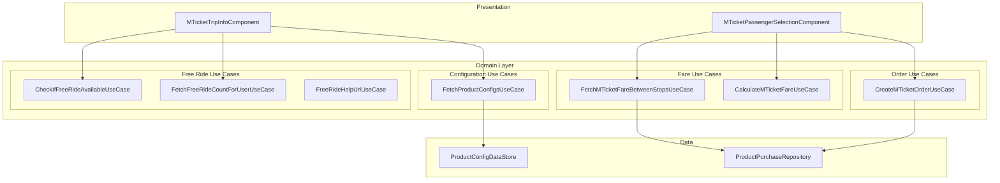

---

## Use Case Inventory

| Use Case | Purpose | Called From |
|----------|---------|-------------|
| **FetchMTicketFareBetweenStopsUseCase** | Get fare from API | PassengerSelectionComponent |
| **CalculateMTicketFareUseCase** | Calculate total fare | PassengerSelectionComponent |
| **CreateMTicketOrderUseCase** | Create booking order | PassengerSelectionComponent |
| **CheckIfFreeRideAvailableUseCase** | Check free ride eligibility | TripInfoComponent |
| **FetchFreeRideCountForUserUseCase** | Get user's free ride count | TripInfoComponent |
| **FreeRideHelpUrlUseCase** | Generate help URL | TripInfoComponent |
| **FetchProductConfigsUseCase** | Fetch product configs | Both screens |

---

## Fetch M-Ticket Fare Between Stops

**Responsibility:** Fetches fare details from the API for a specific route and stop combination.

### Flow

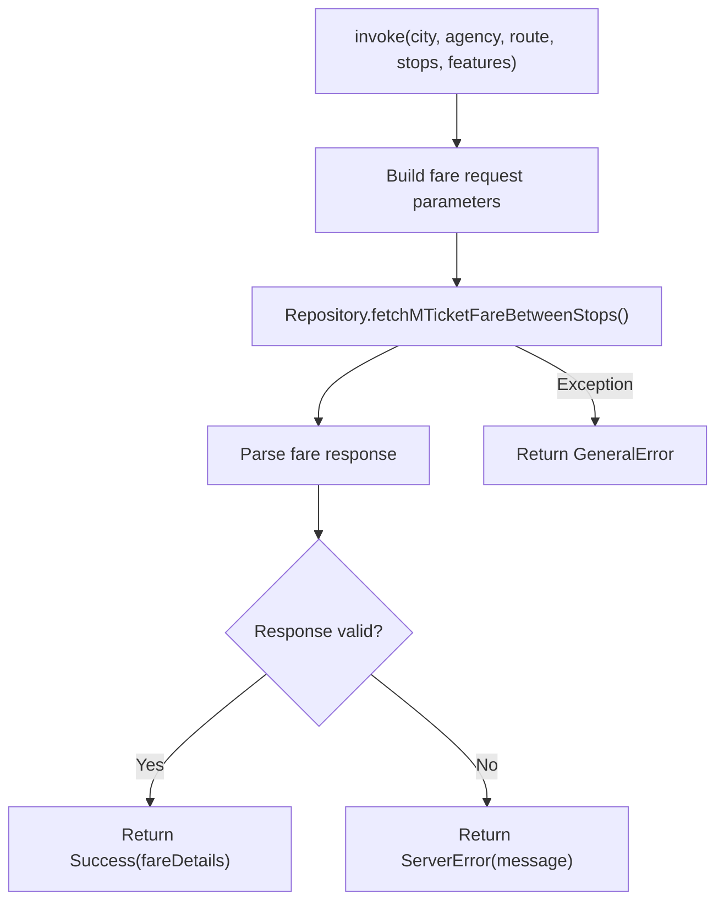

### Input Parameters

| Parameter | Type | Description |
|-----------|------|-------------|
| **city** | String | City name |
| **agency** | String | Transit agency |
| **routeId** | String | Route identifier |
| **routeName** | String | Route display name |
| **startStopId** | String | Boarding stop ID |
| **startStopName** | String | Boarding stop name |
| **endStopId** | String | Destination stop ID |
| **endStopName** | String | Destination stop name |
| **specialFeature** | List<String> | Route special features |

### Output: MTicketFareFetchResult

| Variant | Content | Meaning |
|---------|---------|---------|
| **Success** | MTicketFareResponseAppModel | Fare data retrieved |
| **ServerError** | String message | API returned error |
| **GeneralError** | — | Network or parse failure |

### Fare Response Structure

| Field | Type | Description |
|-------|------|-------------|
| **fares** | MTicketFareDataResponseAppModel | Fare breakdown |
| **routeDetails** | MTicketFareRouteStageResponseAppModel? | Stage-based pricing info |

### Fare Data Fields

| Field | Type | Description |
|-------|------|-------------|
| **discountPercentage** | Double? | Default discount |
| **roundingLogic** | Int? | Rounding rule |
| **passengerDetails** | Map<String, PassengerFare> | Fare by passenger type |

### Passenger Fare Fields

| Field | Type | Description |
|-------|------|-------------|
| **fare** | Double | Base fare |
| **totalFare** | Double? | Calculated total |
| **discountPercentage** | Double | Discount applied |
| **fareBreakdown** | FareBreakdown? | Add/subtract breakdown |

---

## Calculate M-Ticket Fare

**Responsibility:** Calculates total fare based on passenger selections and fare data.

### Flow

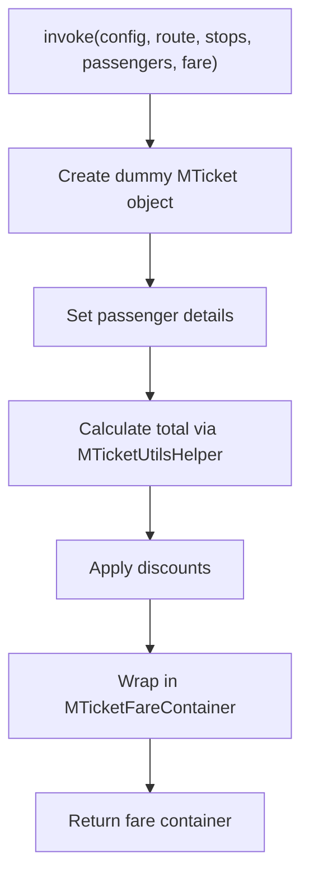

### Input Parameters

| Parameter | Type | Description |
|-----------|------|-------------|
| **productConfig** | SingleJourneyTicketAppModel | Product configuration |
| **routeDetails** | ProductBookingRouteDetails | Selected route |
| **fromStop** | ProductBookingStopDetails | Origin stop |
| **toStop** | ProductBookingStopDetails | Destination stop |
| **passengerContainer** | MTicketPassengerSelectionContainer | Selected counts |
| **fare** | MTicketFareResponseAppModel | API fare response |

### Output: MTicketFareContainer

| Method | Returns | Description |
|--------|---------|-------------|
| **isFreeRide()** | Boolean | Is free ride selected |
| **getTotalFare(helper)** | Double | Total fare amount |
| **passengerDetailsMap()** | Map | Fare by passenger type |
| **isAnyPassengerCategorySelected()** | Boolean | Has selections |
| **getTotalDiscountAmount(helper)** | Double | Total discount |

### Calculation Logic

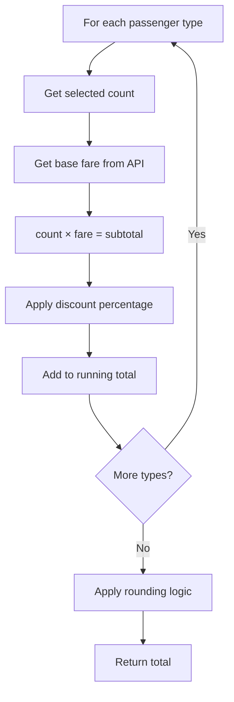

### Passenger Detail Calculation

| Field | Calculation |
|-------|-------------|
| **fare** | Base fare from API |
| **passengerCount** | User selection |
| **discountPercentage** | From fare response |
| **totalFare** | (fare × count) - discount |
| **addMap** | Breakdown additions |
| **subMap** | Breakdown subtractions |

---

## Create M-Ticket Order

**Responsibility:** Creates a booking order with the backend for payment processing.

### Flow

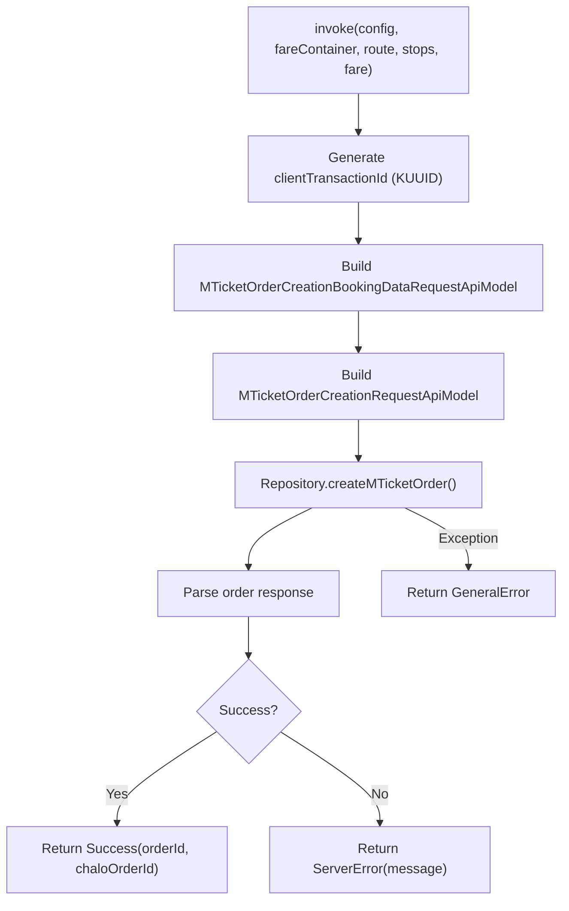

### Input Parameters

| Parameter | Type | Description |
|-----------|------|-------------|
| **productConfig** | SingleJourneyTicketAppModel | Product config |
| **fareContainer** | MTicketFareContainer | Calculated fare |
| **routeDetails** | ProductBookingRouteDetails | Route info |
| **fromStop** | ProductBookingStopDetails | Origin |
| **toStop** | ProductBookingStopDetails | Destination |
| **fare** | MTicketFareResponseAppModel | Fare data |

### Request Building

**Booking Data Fields:**

| Field | Source | Description |
|-------|--------|-------------|
| **routeId** | routeDetails | Route identifier |
| **routeName** | routeDetails | Route display name |
| **startStopId** | fromStop | Boarding stop ID |
| **startStopName** | fromStop | Boarding stop name |
| **endStopId** | toStop | Destination ID |
| **endStopName** | toStop | Destination name |
| **specialFeatures** | routeDetails | Route features list |
| **validDuration** | productConfig | Ticket validity (ms) |
| **passengerDetails** | fareContainer | JSON passenger data |
| **routeStageDetails** | fare | Stage pricing info |

**Order Request Fields:**

| Field | Source | Description |
|-------|--------|-------------|
| **bookingData** | Built above | Booking details |
| **configurationId** | productConfig | Product config ID |
| **isFreeRide** | fareContainer | Free ride flag |
| **clientTransactionId** | Generated | Unique transaction ID |
| **city** | CityProvider | Current city |

### Output: MTicketOrderCreationResult

| Variant | Content | Meaning |
|---------|---------|---------|
| **Success** | orderId, chaloOrderId | Order created |
| **ServerError** | String message | API error |
| **GeneralError** | — | Network failure |

### Order Response

| Field | Type | Description |
|-------|------|-------------|
| **orderId** | String | Backend order ID |
| **chaloOrderId** | String | Payment reference ID |

---

## Check If Free Ride Available

**Responsibility:** Checks if free ride program is available in the user's city.

### Flow

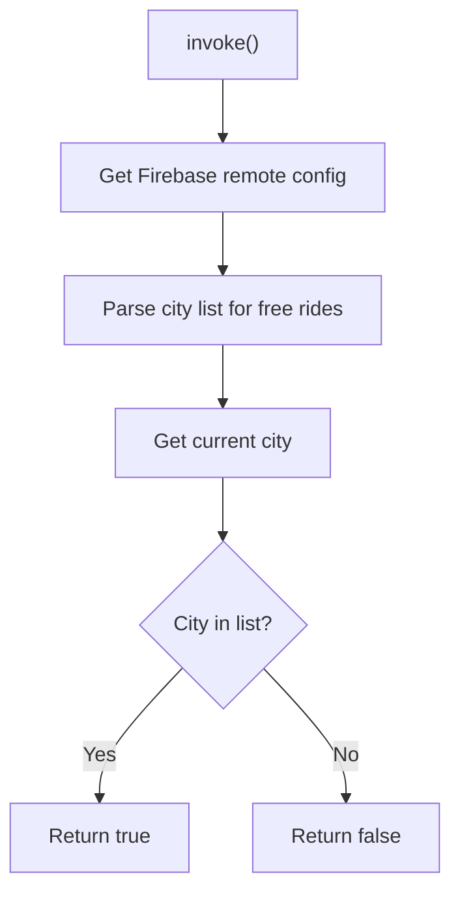

### Config Key

| Environment | Key |
|-------------|-----|
| **Production** | FirebaseConstants.KEY_CITY_LIST_FOR_FREE_RIDES |
| **Debug** | FirebaseConstants.KEY_CITY_LIST_FOR_FREE_RIDES_DEBUG |

### Output

| Returns | Meaning |
|---------|---------|
| **true** | Free ride available in city |
| **false** | Free ride not available |

---

## Fetch Free Ride Count For User

**Responsibility:** Gets the number of free rides available for the current user.

### Flow

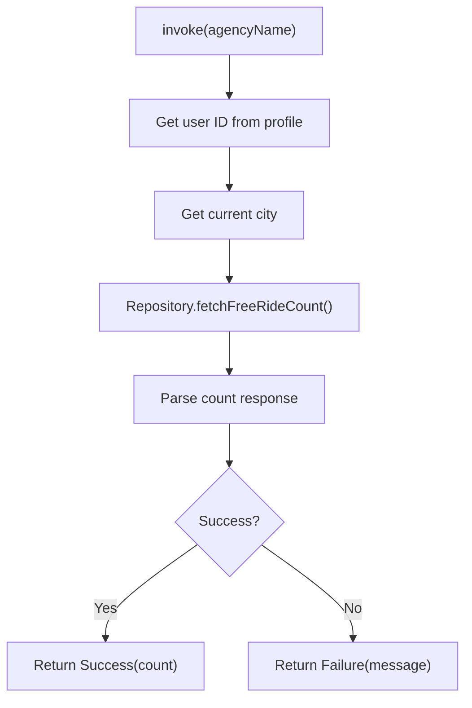

### Input Parameters

| Parameter | Type | Description |
|-----------|------|-------------|
| **agencyName** | String | Transit agency |

### Output

| Result | Content | Meaning |
|--------|---------|---------|
| **Success** | Int | Available free rides |
| **Failure** | String | Error message |

---

## Free Ride Help URL

**Responsibility:** Generates the help URL for free ride information.

### Flow

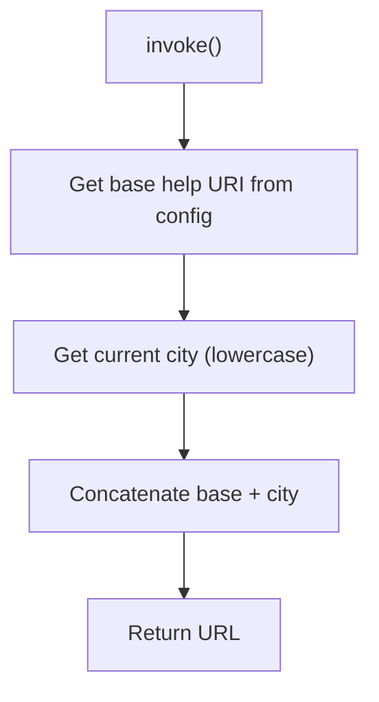

### URL Format

| Component | Example |
|-----------|---------|
| Base URL | https://chalo.com/help/free-ride/ |
| City | mumbai |
| Full URL | https://chalo.com/help/free-ride/mumbai |

---

## Fetch Product Configs

**Responsibility:** Fetches all product configurations for the current city.

### Flow

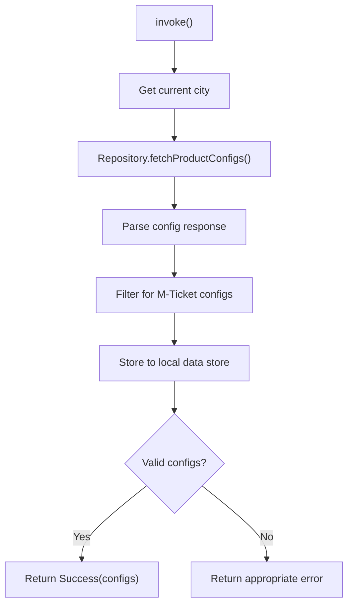

### M-Ticket Config Filter

| Condition | Value |
|-----------|-------|
| productType | "SINGLE_JOURNEY_TICKET" |
| productSubType | "SINGLE_JOURNEY_TICKET" |

### Output: ProductFetchResult

| Variant | Meaning |
|---------|---------|
| **Success** | Configs fetched |
| **InvalidCity** | City not supported |
| **FetchFailed** | API error |
| **InvalidResponse** | Parse error |
| **UnknownError** | Unexpected failure |

---

## Domain Models

### MTicket

| Field | Type | Description |
|-------|------|-------------|
| **mTicketId** | String | Unique ticket ID |
| **userId** | String? | User identifier |
| **deviceId** | String? | Device identifier |
| **cityName** | String | City name |
| **agency** | String | Transit agency |
| **upTripRouteStopsInfo** | RouteStopsInfo | Route/stop details |
| **passengerDetails** | Map | Passenger fare breakdown |
| **bookingTime** | Long | Booking timestamp |
| **expirationTime** | Long | Expiry timestamp |
| **isExpired** | Boolean | Expiry status |
| **isUpTripActivated** | Boolean | Activation status |
| **upTripActivationTime** | Long | Activation timestamp |
| **qrCode** | String? | Validation QR |
| **tone** | String? | Validation tone |
| **isFreeRide** | Boolean? | Free ride flag |
| **orderId** | String? | Order reference |
| **status** | String? | Ticket status |

### MTicketPassengerInfo

| Field | Type | Description |
|-------|------|-------------|
| **fare** | Double | Base fare |
| **totalFare** | Double? | Calculated total |
| **discountPercentage** | Double | Discount applied |
| **passengerCount** | Int | Number of passengers |
| **addMap** | Map? | Fare additions |
| **subMap** | Map? | Fare subtractions |
| **roundingLogic** | Int | Rounding rule |

### RouteStopsInfo

| Field | Type | Description |
|-------|------|-------------|
| **routeId** | String | Route identifier |
| **routeName** | String | Route name |
| **startStopId** | String | Origin stop ID |
| **startStopName** | String | Origin name |
| **endStopId** | String | Destination ID |
| **endStopName** | String | Destination name |
| **specialFeatures** | List | Route features |

---

## Business Rules

| Rule | Description | Enforced By |
|------|-------------|-------------|
| **Minimum passengers** | At least 1 passenger required | CalculateMTicketFareUseCase |
| **Maximum passengers** | Per-type limits from config | MTicketPassengerSelectionContainer |
| **Valid route/stops** | Must select route and stops | MTicketTripInfoComponent |
| **Unique transaction ID** | Each order gets unique ID | CreateMTicketOrderUseCase |
| **Free ride eligibility** | City and user must qualify | CheckIfFreeRideAvailableUseCase |

---

## Sequence Diagrams

### Fare Fetch Sequence

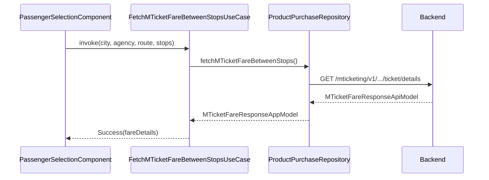

### Order Creation Sequence

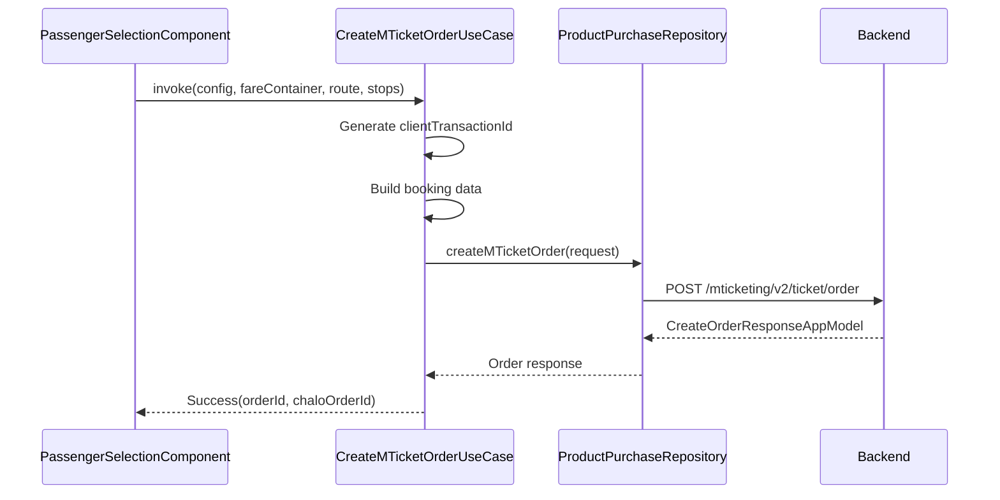

---

## Error Handling

### Error Types

| Error | Source | User Message |
|-------|--------|--------------|
| **MTicketFareFetchFailedException** | Fare API | "Could not fetch fare" |
| **MTicketOrderCreationException** | Order API | "Could not create order" |
| **AllProductsConfigFetchFailedException** | Config API | "Could not load products" |
| **Network timeout** | Any API | "Connection timed out" |

### Recovery Strategies

| Error | Strategy |
|-------|----------|
| **Fare fetch failed** | Show retry button |
| **Order creation failed** | Show error dialog with retry |
| **Config fetch failed** | Show error state with retry |
| **Free ride check failed** | Hide free ride banner |
