# Network — Component Documentation

## Architecture Overview

The Chalo Network infrastructure provides a robust, multiplatform HTTP layer built on Ktor. Unlike traditional features with screens, this layer exposes reusable infrastructure components that all feature modules consume. The architecture centers on three key systems: a priority-based HTTP client system with ChaloRestClient, a network state management system through NetworkStateManager, and platform-specific implementations for Android (OkHttp) and iOS (Darwin).

The design follows a clear separation between shared business logic in commonMain and platform-specific implementations in androidMain and iosMain, using Kotlin Multiplatform's expect/actual pattern. The network module at `shared/network/` provides the HTTP client infrastructure, while network state monitoring lives in `shared/chalo-base/` under the features/network package.

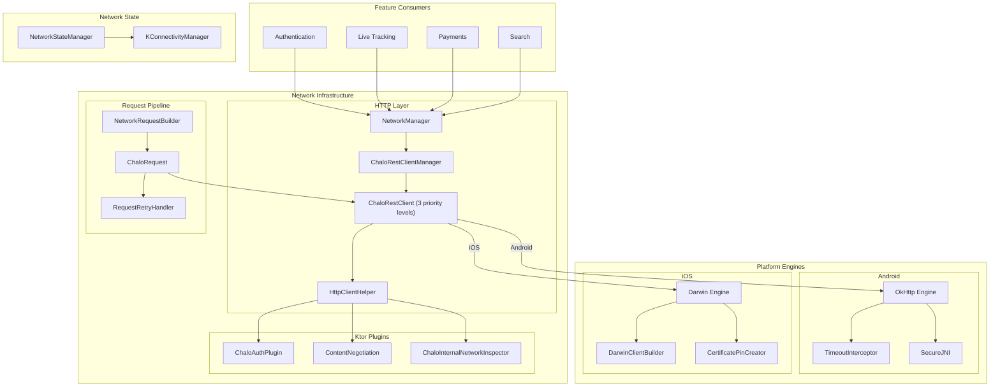
```mermaid
flowchart TB
    subgraph Consumers["Feature Consumers"]
        Auth["Authentication"]
        LiveTracking["Live Tracking"]
        Payments["Payments"]
        Search["Search"]
    end

    subgraph Network["Network Infrastructure"]
        subgraph HTTP["HTTP Layer"]
            NetworkManager["NetworkManager"]
            RestClientManager["ChaloRestClientManager"]
            RestClient["ChaloRestClient (3 priority levels)"]
            HttpClientHelper["HttpClientHelper"]
        end

        subgraph Request["Request Pipeline"]
            RequestBuilder["NetworkRequestBuilder"]
            ChaloRequest["ChaloRequest"]
            RetryHandler["RequestRetryHandler"]
        end

        subgraph Plugins["Ktor Plugins"]
            AuthPlugin["ChaloAuthPlugin"]
            ContentNeg["ContentNegotiation"]
            Inspector["ChaloInternalNetworkInspector"]
        end
    end

    subgraph Platform["Platform Engines"]
        subgraph Android["Android"]
            OkHttp["OkHttp Engine"]
            TimeoutInterceptor["TimeoutInterceptor"]
            SecureJNI["SecureJNI"]
        end

        subgraph iOS["iOS"]
            Darwin["Darwin Engine"]
            DarwinBuilder["DarwinClientBuilder"]
            CertCreator["CertificatePinCreator"]
        end
    end

    subgraph StateManagement["Network State"]
        NetworkStateManager["NetworkStateManager"]
        KConnectivityManager["KConnectivityManager"]
    end

    Auth --> NetworkManager
    LiveTracking --> NetworkManager
    Payments --> NetworkManager
    Search --> NetworkManager

    NetworkManager --> RestClientManager
    RestClientManager --> RestClient
    RestClient --> HttpClientHelper
    HttpClientHelper --> AuthPlugin
    HttpClientHelper --> ContentNeg
    HttpClientHelper --> Inspector

    RequestBuilder --> ChaloRequest
    ChaloRequest --> RestClient
    ChaloRequest --> RetryHandler

    RestClient -->|"Android"| OkHttp
    OkHttp --> TimeoutInterceptor
    OkHttp --> SecureJNI

    RestClient -->|"iOS"| Darwin
    Darwin --> DarwinBuilder
    Darwin --> CertCreator

    NetworkStateManager --> KConnectivityManager
```

---

## Component Inventory

| Component | Layer | File Path | Purpose |
|-----------|-------|-----------|---------|
| **NetworkManager** | Shared | `shared/network/src/commonMain/.../NetworkManager.kt` | Factory for request builders |
| **NetworkManagerImpl** | Shared | `shared/network/src/commonMain/.../NetworkManagerImpl.kt` | Implementation with URL provider |
| **NetworkRequestBuilder** | Shared | `shared/network/src/commonMain/.../rest/request/NetworkRequestBuilder.kt` | Fluent API for request construction |
| **ChaloRequest** | Shared | `shared/network/src/commonMain/.../rest/request/ChaloRequest.kt` | Request executor with retry support |
| **ChaloRestClient** | Shared | `shared/network/src/commonMain/.../rest/ChaloRestClient.kt` | Ktor HTTP client wrapper |
| **ChaloRestClientManager** | Shared | `shared/network/src/commonMain/.../rest/ChaloRestClientManager.kt` | Priority-based client provider |
| **HttpClientHelper** | Shared | `shared/network/src/commonMain/.../HttpClientHelper.kt` | Ktor client configuration factory |
| **ChaloAuthPlugin** | Shared | `shared/network/src/commonMain/.../rest/generic/ChaloAuthPlugin.kt` | Authentication header injection |
| **RequestRetryHandler** | Shared | `shared/network/src/commonMain/.../rest/request/RequestRetryHandler.kt` | Retry logic with backoff strategies |
| **NetworkStateManager** | Shared | `shared/chalo-base/src/commonMain/.../features/network/NetworkStateManager.kt` | Connectivity state monitoring |
| **TimeoutInterceptor** | Android | `shared/network/src/androidMain/.../interceptor/TimeoutInterceptor.kt` | Dynamic timeout configuration |
| **OkHttpClientBuilder** | Android | `shared/network/src/androidMain/.../okhttp/OkHttpClientBuilder.kt` | OkHttp configuration |
| **DarwinClientBuilder** | iOS | `shared/network/src/iosMain/.../darwin/DarwinClientBuilder.kt` | Darwin engine configuration |
| **CertificatePinCreator** | iOS | `shared/network/src/iosMain/.../darwin/CertificatePinCreator.kt` | Certificate pin obfuscation |

---

## NetworkManager

The NetworkManager interface serves as the primary factory for creating network request builders. It abstracts the complexity of configuring HTTP clients and provides pre-configured builders for different use cases. The implementation, NetworkManagerImpl, injects the ChaloUrlProvider for base URL resolution and NetworkCrashlyticsLogger for error reporting.

### Interface Definition

The interface exposes factory methods that return pre-configured NetworkRequestBuilder instances. Each method configures appropriate priority levels, timeouts, and request types for specific use cases.

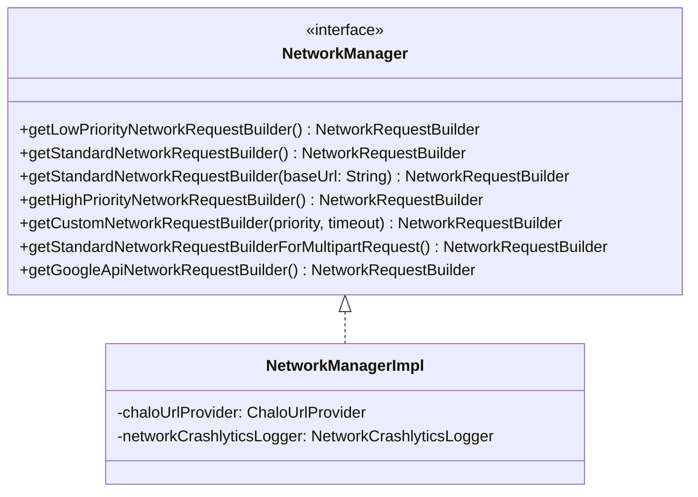
```mermaid
classDiagram
    class NetworkManager {
        <<interface>>
        +getLowPriorityNetworkRequestBuilder() NetworkRequestBuilder
        +getStandardNetworkRequestBuilder() NetworkRequestBuilder
        +getStandardNetworkRequestBuilder(baseUrl: String) NetworkRequestBuilder
        +getHighPriorityNetworkRequestBuilder() NetworkRequestBuilder
        +getCustomNetworkRequestBuilder(priority, timeout) NetworkRequestBuilder
        +getStandardNetworkRequestBuilderForMultipartRequest() NetworkRequestBuilder
        +getGoogleApiNetworkRequestBuilder() NetworkRequestBuilder
    }

    class NetworkManagerImpl {
        -chaloUrlProvider: ChaloUrlProvider
        -networkCrashlyticsLogger: NetworkCrashlyticsLogger
    }

    NetworkManager <|.. NetworkManagerImpl
```

### Builder Factory Methods

| Method | Priority | Default Timeout | Use Case |
|--------|----------|-----------------|----------|
| `getLowPriorityNetworkRequestBuilder()` | LOW (1) | 20,000ms | Analytics, background sync |
| `getStandardNetworkRequestBuilder()` | NORMAL (2) | 20,000ms | Regular API calls |
| `getStandardNetworkRequestBuilder(baseUrl)` | NORMAL (2) | 20,000ms | Custom base URL |
| `getHighPriorityNetworkRequestBuilder()` | HIGH (3) | 20,000ms | Authentication, critical ops |
| `getStandardNetworkRequestBuilderForMultipartRequest()` | NORMAL (2) | 30,000ms | File uploads |
| `getGoogleApiNetworkRequestBuilder()` | NORMAL (2) | 30,000ms | Google Maps API calls |
| `getCustomNetworkRequestBuilder(priority, timeout)` | Custom | Custom | Special requirements |

### Request Builder Flow

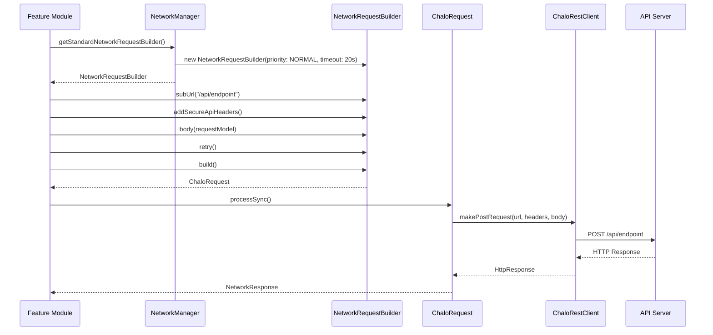
```mermaid
sequenceDiagram
    participant Feature as Feature Module
    participant NM as NetworkManager
    participant Builder as NetworkRequestBuilder
    participant Request as ChaloRequest
    participant Client as ChaloRestClient
    participant Server as API Server

    Feature->>NM: getStandardNetworkRequestBuilder()
    NM->>Builder: new NetworkRequestBuilder(priority: NORMAL, timeout: 20s)
    NM-->>Feature: NetworkRequestBuilder

    Feature->>Builder: subUrl("/api/endpoint")
    Feature->>Builder: addSecureApiHeaders()
    Feature->>Builder: body(requestModel)
    Feature->>Builder: retry()
    Feature->>Builder: build()
    Builder-->>Feature: ChaloRequest

    Feature->>Request: processSync()
    Request->>Client: makePostRequest(url, headers, body)
    Client->>Server: POST /api/endpoint
    Server-->>Client: HTTP Response
    Client-->>Request: HttpResponse
    Request-->>Feature: NetworkResponse
```

---

## NetworkRequestBuilder

The NetworkRequestBuilder implements a fluent builder pattern for constructing network requests. It encapsulates request configuration including URL construction, headers, query parameters, body serialization, timeouts, and retry policies. The builder validates inputs and throws IllegalArgumentException for invalid configurations.

### Builder Pattern Structure

The builder wraps a GenericRequestData object that accumulates configuration. Two constructors are available: one accepting just the crashlytics logger (creates fresh GenericRequestData), and one accepting both GenericRequestData and logger (for multipart requests using MultipartRequestData).

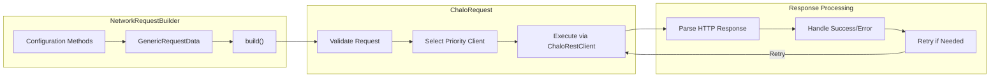
```mermaid
flowchart LR
    subgraph Builder["NetworkRequestBuilder"]
        Config["Configuration Methods"]
        GenericData["GenericRequestData"]
        Build["build()"]
    end

    subgraph Request["ChaloRequest"]
        Validate["Validate Request"]
        SelectClient["Select Priority Client"]
        Execute["Execute via ChaloRestClient"]
    end

    subgraph Response["Response Processing"]
        Parse["Parse HTTP Response"]
        Handle["Handle Success/Error"]
        Retry["Retry if Needed"]
    end

    Config --> GenericData
    GenericData --> Build
    Build --> Validate
    Validate --> SelectClient
    SelectClient --> Execute
    Execute --> Parse
    Parse --> Handle
    Handle --> Retry
    Retry -->|"Retry"| Execute
```

### Configuration Methods

| Method | Purpose | Notes |
|--------|---------|-------|
| `baseUrl(url)` | Set base URL | Usually handled by NetworkManager |
| `subUrl(path)` | Set endpoint path | Required for all requests |
| `addPathParam(key, value)` | Add path parameter | For URL template substitution like `{routeId}` |
| `pathParams(map)` | Set all path parameters | Bulk alternative to addPathParam |
| `addQueryParam(key, value)` | Add query parameter | Appended to URL as `?key=value` |
| `queryParams(map)` | Set all query parameters | Cannot be empty if called |
| `addHeader(key, value)` | Add custom header | For request-specific headers |
| `headers(map)` | Set all headers | Bulk alternative |
| `addSecureApiHeaders()` | Mark for auth headers | Triggers ChaloAuthPlugin |
| `addXTypeHeader()` | Add x-type header | Platform identification |
| `body<T>(requestBody)` | Set JSON body | Serialized via kotlinx.serialization |
| `rawBody(jsonString)` | Set raw JSON body | For pre-serialized data, sets POST |
| `httpMethod(type)` | Override HTTP method | GET, POST, PUT, DELETE |
| `timeout(ms)` | Set all timeouts | Connect, read, write |
| `connectTimeout(ms)` | Set connect timeout | Overrides default |
| `readTimeout(ms)` | Set read timeout | Overrides default |
| `writeTimeout(ms)` | Set write timeout | Overrides default |
| `retry()` | Enable retry with defaults | 3 retries, linear backoff |
| `retryCount(n)` | Set retry count | Capped by strategy maximum |
| `retryStrategy(type)` | Set backoff strategy | See RetryStrategyType |
| `priority(level)` | Override priority | LOW, NORMAL, HIGH |
| `mediaType(type)` | Set media type | Default: application/json |
| `contentType(type)` | Set content type | For custom content types |
| `fileData(data)` | Set file for multipart | Requires multipart builder |
| `additionalInfoPart(data)` | Set additional multipart info | Requires multipart builder |

### Validation Rules

The builder performs validation on several operations to catch configuration errors early. These validations throw IllegalArgumentException with descriptive messages.

| Validation | When Triggered | Error Message |
|------------|----------------|---------------|
| Empty base URL | `baseUrl("")` | "Base-Url cannot be empty" |
| Empty sub URL | `subUrl("")` | "Sub-Url cannot be empty" |
| Null param value | `addQueryParam("key", null)` | "Param value is null for key: key, url: ..." |
| Empty query params | `queryParams(emptyMap())` | "Query params cannot be empty..." |
| Body with GET | `body(x)` then `httpMethod(GET)` | "Request body can not be set with GET method..." |
| Non-multipart file | `fileData(x)` on standard builder | "Please use NetworkManager.getStandardNetworkRequestBuilderForMultipartRequest()" |

---

## ChaloRequest

The ChaloRequest class executes network requests with built-in retry handling. It receives a GenericRequestData configuration and coordinates with the ChaloRestClientManager to obtain the appropriate priority-based client. The execution loop continues until success, exhausted retries, or a non-retryable error.

### Execution Lifecycle

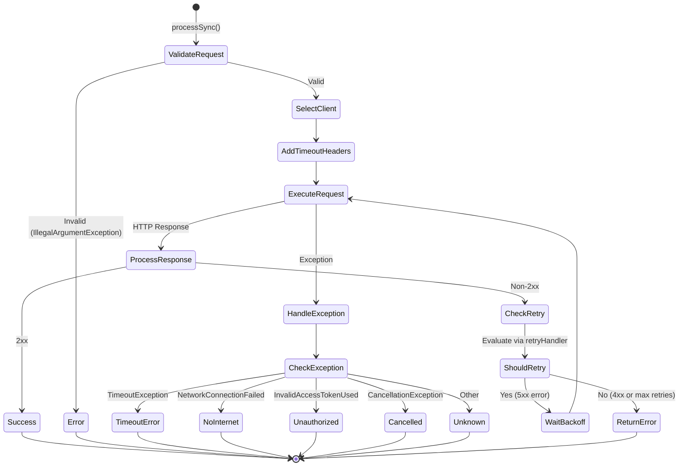
```mermaid
stateDiagram-v2
    [*] --> ValidateRequest: processSync()

    ValidateRequest --> SelectClient: Valid
    ValidateRequest --> Error: Invalid (IllegalArgumentException)

    SelectClient --> AddTimeoutHeaders
    AddTimeoutHeaders --> ExecuteRequest

    ExecuteRequest --> ProcessResponse: HTTP Response
    ExecuteRequest --> HandleException: Exception

    ProcessResponse --> Success: 2xx
    ProcessResponse --> CheckRetry: Non-2xx

    HandleException --> CheckException
    CheckException --> TimeoutError: TimeoutException
    CheckException --> NoInternet: NetworkConnectionFailed
    CheckException --> Unauthorized: InvalidAccessTokenUsed
    CheckException --> Cancelled: CancellationException
    CheckException --> Unknown: Other

    CheckRetry --> ShouldRetry: Evaluate via retryHandler
    ShouldRetry --> WaitBackoff: Yes (5xx error)
    ShouldRetry --> ReturnError: No (4xx or max retries)
    WaitBackoff --> ExecuteRequest

    Success --> [*]
    Error --> [*]
    TimeoutError --> [*]
    NoInternet --> [*]
    Unauthorized --> [*]
    Cancelled --> [*]
    Unknown --> [*]
    ReturnError --> [*]
```

### Request Method Routing

The ChaloRequest determines which ChaloRestClient method to call based on the HTTP method and request data type.

| HTTP Method | Request Type | Client Method |
|-------------|--------------|---------------|
| GET | Any | `makeGetRequest(url, headers, queryParams)` |
| POST | GenericRequestData | `makePostRequest(url, headers, queryParams, body)` |
| POST | MultipartRequestData | `makeMultipartPostRequest(url, headers, fileItem, additionalInfo)` |
| PUT | Any | `makePutRequest(url, headers, queryParams, body)` |
| DELETE | Any | `makeDeleteRequest(url, headers, queryParams)` |

### Response Processing

The processResponse method handles HTTP responses based on status code and content type.

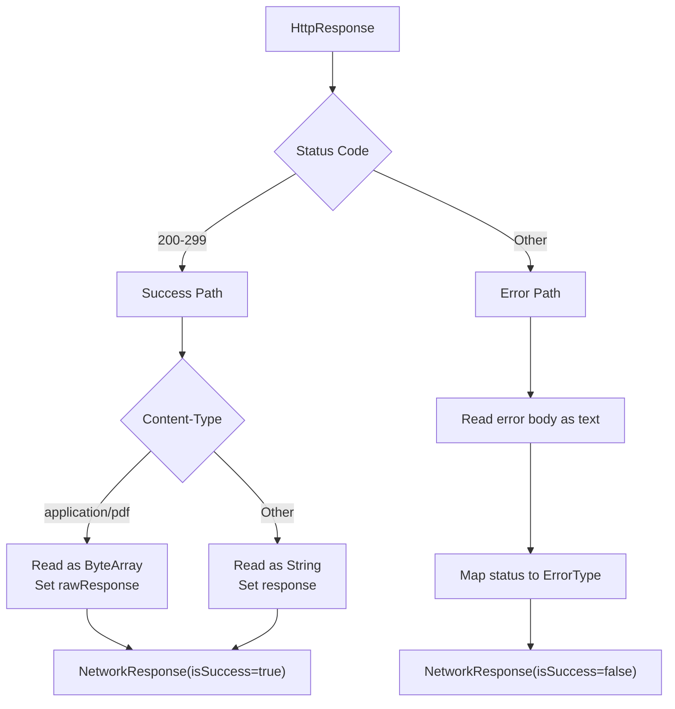
```mermaid
flowchart TB
    Response["HttpResponse"] --> CheckStatus{"Status Code"}

    CheckStatus -->|"200-299"| SuccessPath["Success Path"]
    CheckStatus -->|"Other"| ErrorPath["Error Path"]

    SuccessPath --> CheckContentType{"Content-Type"}
    CheckContentType -->|"application/pdf"| PDFResponse["Read as ByteArray<br/>Set rawResponse"]
    CheckContentType -->|"Other"| JSONResponse["Read as String<br/>Set response"]

    PDFResponse --> BuildSuccess["NetworkResponse(isSuccess=true)"]
    JSONResponse --> BuildSuccess

    ErrorPath --> ReadErrorBody["Read error body as text"]
    ReadErrorBody --> MapErrorType["Map status to ErrorType"]
    MapErrorType --> BuildError["NetworkResponse(isSuccess=false)"]
```

### Error Classification

| Exception Type | ErrorType | HTTP Code | Recovery |
|----------------|-----------|-----------|----------|
| `BaseNetworkException.TimeoutException` | TYPE_TIMEOUT | 0 | Retry eligible |
| `BaseNetworkException.NetworkConnectionFailedException` | TYPE_NO_INTERNET | 0 | Check connectivity |
| `BaseNetworkException.InvalidAccessTokenUsedException` | TYPE_UNAUTHORIZED | 0 | Auth already failed |
| `CancellationException` | TYPE_REQUEST_CANCELLED | 0 | No recovery needed |
| HTTP 304 | TYPE_NO_UPDATE_IN_DATA | 304 | Use cached data |
| HTTP 401 | TYPE_UNAUTHORIZED | 401 | Handled by ChaloAuthPlugin |
| HTTP 4xx | TYPE_CLIENT_ERROR | 400-499 | Check request |
| HTTP 5xx | TYPE_SERVER_ERROR | 500-599 | Retry eligible |

---

## ChaloRestClientManager

The ChaloRestClientManager is a singleton object that provides pre-configured ChaloRestClient instances based on request priority. It uses Koin for dependency injection with named qualifiers to distinguish between the three priority levels.

### Priority-Based Client Architecture

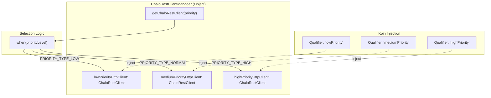
```mermaid
flowchart TB
    subgraph Manager["ChaloRestClientManager (Object)"]
        GetClient["getChaloRestClient(priority)"]
        LowField["lowPriorityHttpClient: ChaloRestClient"]
        MedField["mediumPriorityHttpClient: ChaloRestClient"]
        HighField["highPriorityHttpClient: ChaloRestClient"]
    end

    subgraph Koin["Koin Injection"]
        LowQual["Qualifier: 'lowPriority'"]
        MedQual["Qualifier: 'mediumPriority'"]
        HighQual["Qualifier: 'highPriority'"]
    end

    subgraph Selection["Selection Logic"]
        Switch["when(priorityLevel)"]
    end

    GetClient --> Switch
    Switch -->|"PRIORITY_TYPE_LOW"| LowField
    Switch -->|"PRIORITY_TYPE_NORMAL"| MedField
    Switch -->|"PRIORITY_TYPE_HIGH"| HighField

    LowQual -.->|"inject"| LowField
    MedQual -.->|"inject"| MedField
    HighQual -.->|"inject"| HighField
```

### Qualifier Constants

| Constant | Value | Description |
|----------|-------|-------------|
| `CLIENT_PRIORITY_LOW` | "lowPriority" | Koin qualifier for low priority |
| `CLIENT_PRIORITY_MEDIUM` | "mediumPriority" | Koin qualifier for normal priority |
| `CLIENT_PRIORITY_HIGH` | "highPriority" | Koin qualifier for high priority |

### Connection Pool Configuration

| Priority Level | Enum Value | Max Idle Connections | Rationale |
|----------------|------------|---------------------|-----------|
| HIGH | 3 | 1 | Minimal connections, immediate execution for critical ops |
| NORMAL | 2 | 2 | Balanced throughput for standard API calls |
| LOW | 1 | 1 | Background operations, minimal resources |

---

## ChaloRestClient

The ChaloRestClient wraps a Ktor HttpClient to execute HTTP requests. It provides methods for GET, POST, PUT, DELETE, and multipart POST operations. Each method constructs the request using Ktor's DSL and returns an HttpResponse.

### HTTP Methods

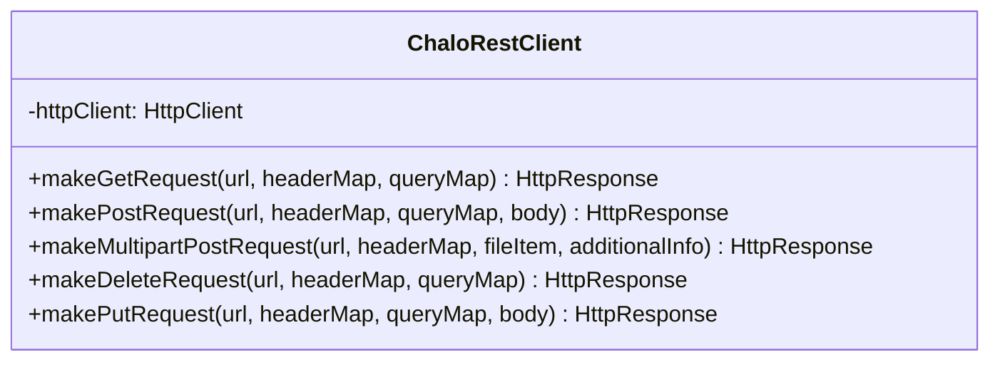
```mermaid
classDiagram
    class ChaloRestClient {
        -httpClient: HttpClient
        +makeGetRequest(url, headerMap, queryMap) HttpResponse
        +makePostRequest(url, headerMap, queryMap, body) HttpResponse
        +makeMultipartPostRequest(url, headerMap, fileItem, additionalInfo) HttpResponse
        +makeDeleteRequest(url, headerMap, queryMap) HttpResponse
        +makePutRequest(url, headerMap, queryMap, body) HttpResponse
    }
```

### Request Construction

Each method applies headers and query parameters using extension functions on HttpRequestBuilder. For POST and PUT, the body is set with JSON content type.

| Method | Headers | Query Params | Body | Content-Type |
|--------|---------|--------------|------|--------------|
| `makeGetRequest` | Yes | Yes | No | N/A |
| `makePostRequest` | Yes | Yes | Yes (Any?) | application/json |
| `makePutRequest` | Yes | Yes | Yes (Any?) | application/json |
| `makeDeleteRequest` | Yes | Yes | No | N/A |
| `makeMultipartPostRequest` | Yes | No | FormData | multipart/form-data |

### Internal Extensions

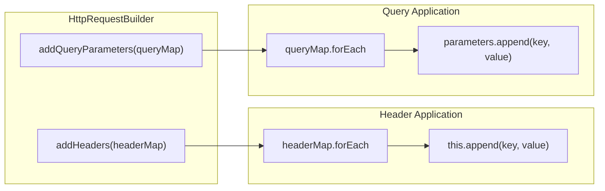
```mermaid
flowchart LR
    subgraph Builder["HttpRequestBuilder"]
        AddHeaders["addHeaders(headerMap)"]
        AddQuery["addQueryParameters(queryMap)"]
    end

    subgraph Headers["Header Application"]
        ForEach1["headerMap.forEach"]
        Append1["this.append(key, value)"]
    end

    subgraph Query["Query Application"]
        ForEach2["queryMap.forEach"]
        Append2["parameters.append(key, value)"]
    end

    AddHeaders --> ForEach1
    ForEach1 --> Append1
    AddQuery --> ForEach2
    ForEach2 --> Append2
```

---

## HttpClientHelper

HttpClientHelper is an object that creates configured Ktor HttpClient instances. It installs plugins for content negotiation, authentication, default request headers, and network inspection. The method `getHttpClientDefinitionForPriority` is the main entry point.

### Plugin Installation

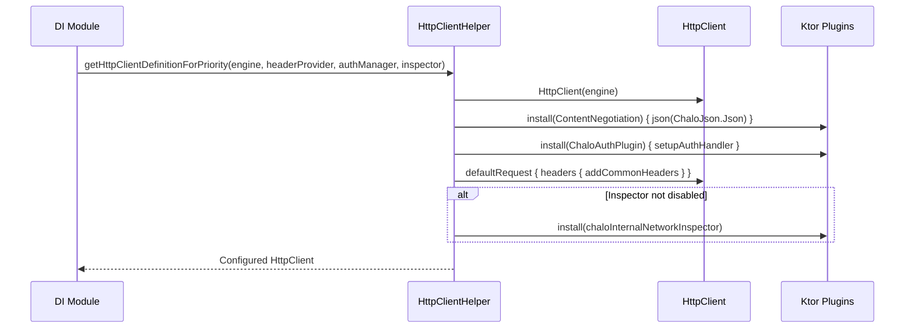
```mermaid
sequenceDiagram
    participant DI as DI Module
    participant Helper as HttpClientHelper
    participant Client as HttpClient
    participant Plugin as Ktor Plugins

    DI->>Helper: getHttpClientDefinitionForPriority(engine, headerProvider, authManager, inspector)
    Helper->>Client: HttpClient(engine)

    Helper->>Plugin: install(ContentNegotiation) { json(ChaloJson.Json) }
    Helper->>Plugin: install(ChaloAuthPlugin) { setupAuthHandler }
    Helper->>Client: defaultRequest { headers { addCommonHeaders } }

    alt Inspector not disabled
        Helper->>Plugin: install(chaloInternalNetworkInspector)
    end

    Helper-->>DI: Configured HttpClient
```

### Common Headers

The `addCommonHeaders` extension function adds standard headers to every request.

| Header | Source | Value |
|--------|--------|-------|
| `Content-Type` | Constant | "application/json" |
| `accept` | Constant | "application/json" |
| `source` | CommonHeaderProvider | Platform identifier (e.g., "0") |
| `deviceId` | CommonHeaderProvider | Unique device identifier |
| `appVer` | CommonHeaderProvider | App version code |
| `x-type` | CommonHeaderProvider | "pass" (if X_TYPE_HEADER marker present) |

### CommonHeaderProvider Implementation

The CommonHeaderProviderImpl uses Device and ChaloBuildConfig to provide header values.

| Method | Source | Returns |
|--------|--------|---------|
| `getAppVersion()` | `chaloBuildConfig.versionCode.toString()` | Version code string |
| `getDeviceId()` | `device.getDeviceId()` | Unique device ID |
| `getXType()` | Hardcoded | "pass" |
| `getSource()` | Hardcoded | "0" |

---

## ChaloAuthPlugin

The ChaloAuthPlugin is a custom Ktor plugin that handles authentication header injection and automatic token refresh. It intercepts requests marked with `SECURE_API_HEADERS` and adds authentication credentials. When a 401 Unauthorized response is received, it automatically refreshes the token and retries the request.

### Authentication Flow

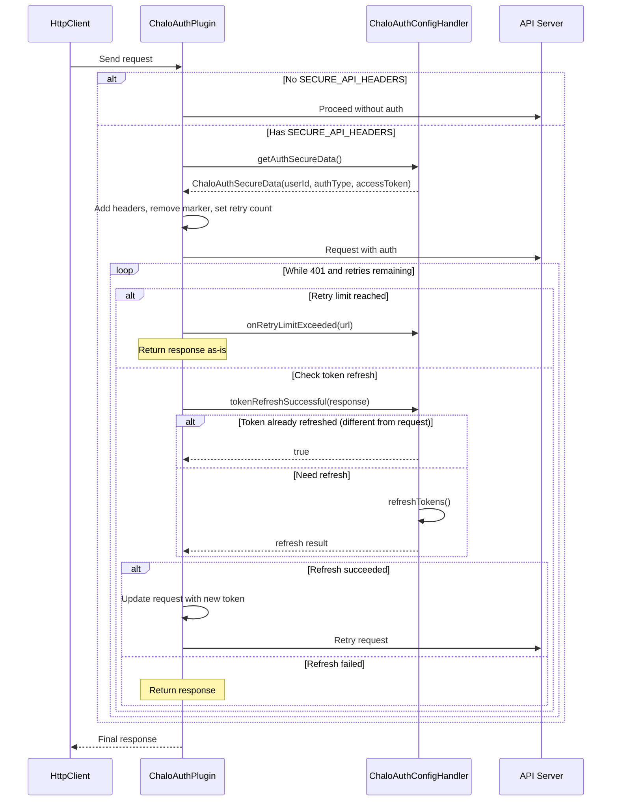
```mermaid
sequenceDiagram
    participant Client as HttpClient
    participant Plugin as ChaloAuthPlugin
    participant Handler as ChaloAuthConfigHandler
    participant Server as API Server

    Client->>Plugin: Send request

    alt No SECURE_API_HEADERS
        Plugin->>Server: Proceed without auth
    else Has SECURE_API_HEADERS
        Plugin->>Handler: getAuthSecureData()
        Handler-->>Plugin: ChaloAuthSecureData(userId, authType, accessToken)
        Plugin->>Plugin: Add headers, remove marker, set retry count

        Plugin->>Server: Request with auth

        loop While 401 and retries remaining
            alt Retry limit reached
                Plugin->>Handler: onRetryLimitExceeded(url)
                Note over Plugin: Return response as-is
            else Check token refresh
                Plugin->>Handler: tokenRefreshSuccessful(response)

                alt Token already refreshed (different from request)
                    Handler-->>Plugin: true
                else Need refresh
                    Handler->>Handler: refreshTokens()
                    Handler-->>Plugin: refresh result
                end

                alt Refresh succeeded
                    Plugin->>Plugin: Update request with new token
                    Plugin->>Server: Retry request
                else Refresh failed
                    Note over Plugin: Return response
                end
            end
        end
    end

    Plugin-->>Client: Final response
```

### Authentication Headers

| Header | Source | Purpose |
|--------|--------|---------|
| `userId` | ChaloAuthSecureData | User identification |
| `authType` | ChaloAuthSecureData | Authentication method (ACCESS_TOKEN) |
| `accessToken` | ChaloAuthSecureData | Bearer token for authorization |

### ChaloAuthConfigHandler

The handler manages authentication state and token refresh with mutex protection for thread safety.

| Configuration | Default | Description |
|---------------|---------|-------------|
| `retryLimitCount` | 4 (AUTHENTICATION_RETRY_LIMIT) | Maximum 401 retries per request |
| `provideAuthSecureData` | Required | Suspend callback to get credentials |
| `refreshTokens` | Required | Suspend callback to refresh token |
| `onRetryLimitExceeded` | Optional | Callback when limit reached |

### Concurrency Protection

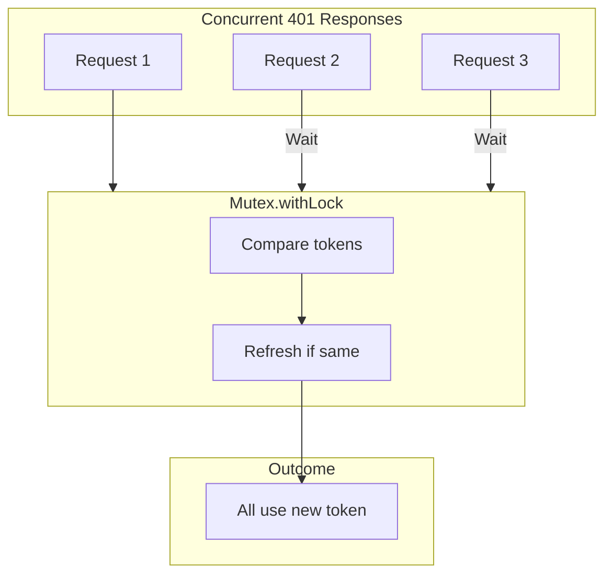
```mermaid
flowchart TB
    subgraph Requests["Concurrent 401 Responses"]
        R1["Request 1"]
        R2["Request 2"]
        R3["Request 3"]
    end

    subgraph Mutex["Mutex.withLock"]
        Check["Compare tokens"]
        Refresh["Refresh if same"]
    end

    subgraph Result["Outcome"]
        UseNew["All use new token"]
    end

    R1 --> Mutex
    R2 -->|"Wait"| Mutex
    R3 -->|"Wait"| Mutex
    Check --> Refresh
    Refresh --> UseNew
```

---

## RequestRetryHandler

The RequestRetryHandler implements multiple backoff strategies for failed requests. It tracks retry attempts and calculates appropriate delays based on the configured strategy. The handler only retries on 5xx server errors.

### Retry Strategies

| Strategy | Max Retries | Delay Formula | Example Delays |
|----------|-------------|---------------|----------------|
| `NO_BACKOFF` | 5 | 0 | 0, 0, 0, 0, 0 |
| `CONSTANT_BACKOFF` | 5 | 1000ms | 1s, 1s, 1s, 1s, 1s |
| `LINEAR_BACKOFF` | 5 | retryCount * 1000 | 0s, 1s, 2s, 3s, 4s |
| `EXPONENTIAL_BACKOFF` | 5 | 2^retryCount * 1000 | 1s, 2s, 4s, 8s, 16s |
| `POLYNOMIAL_BACKOFF` | 4 | retryCount^2 * 1000 | 0s, 1s, 4s, 9s |
| `UNKNOWN` | 0 | N/A | No retry |

### Retry Decision Flow

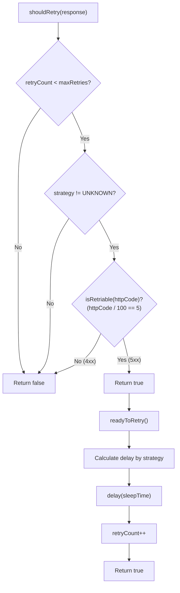
```mermaid
flowchart TB
    Response["shouldRetry(response)"] --> CheckCount{"retryCount < maxRetries?"}
    CheckCount -->|"No"| NoRetry["Return false"]
    CheckCount -->|"Yes"| CheckStrategy{"strategy != UNKNOWN?"}

    CheckStrategy -->|"No"| NoRetry
    CheckStrategy -->|"Yes"| CheckStatus{"isRetriable(httpCode)?<br/>(httpCode / 100 == 5)"}

    CheckStatus -->|"No (4xx)"| NoRetry
    CheckStatus -->|"Yes (5xx)"| YesRetry["Return true"]

    YesRetry --> ReadyToRetry["readyToRetry()"]
    ReadyToRetry --> CalcDelay["Calculate delay by strategy"]
    CalcDelay --> Wait["delay(sleepTime)"]
    Wait --> IncCount["retryCount++"]
    IncCount --> ReturnTrue["Return true"]
```

---

## TimeoutInterceptor (Android)

The TimeoutInterceptor is an OkHttp interceptor that applies dynamic timeout configuration per request. It reads timeout values from request headers (set by NetworkRequestBuilder) and configures the OkHttp chain accordingly. It also tracks call latency for analytics.

### Timeout Application Flow

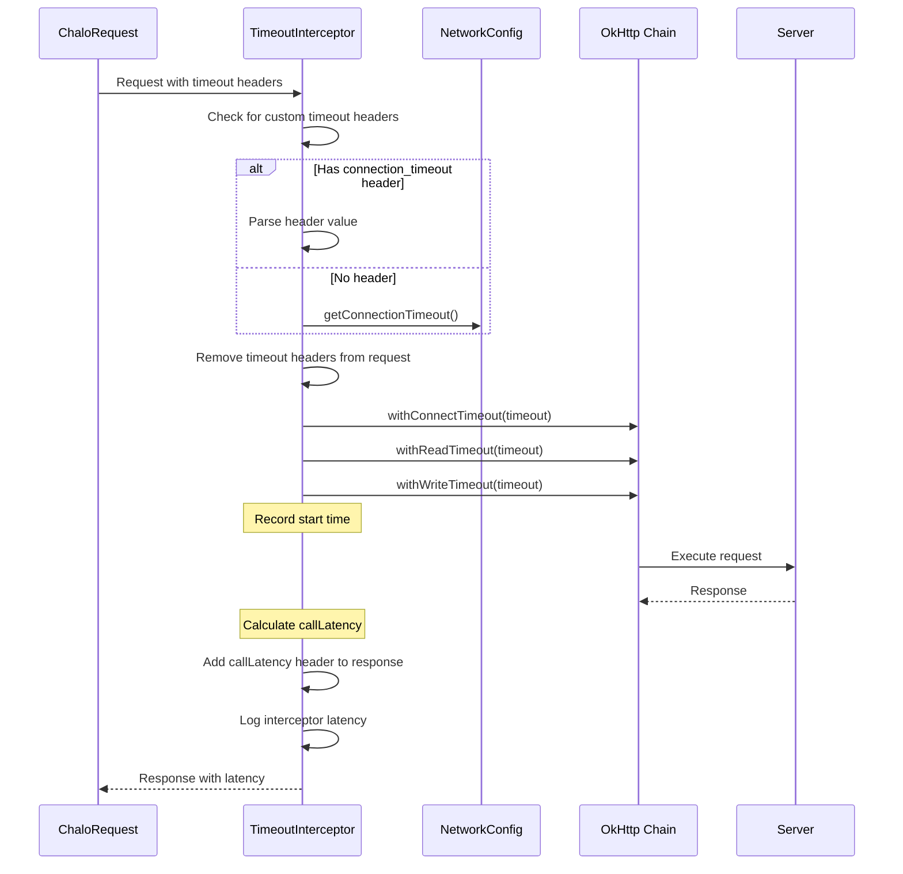
```mermaid
sequenceDiagram
    participant Request as ChaloRequest
    participant Interceptor as TimeoutInterceptor
    participant Config as NetworkConfig
    participant Chain as OkHttp Chain
    participant Server as Server

    Request->>Interceptor: Request with timeout headers

    Interceptor->>Interceptor: Check for custom timeout headers

    alt Has connection_timeout header
        Interceptor->>Interceptor: Parse header value
    else No header
        Interceptor->>Config: getConnectionTimeout()
    end

    Interceptor->>Interceptor: Remove timeout headers from request
    Interceptor->>Chain: withConnectTimeout(timeout)
    Interceptor->>Chain: withReadTimeout(timeout)
    Interceptor->>Chain: withWriteTimeout(timeout)

    Note over Interceptor: Record start time

    Chain->>Server: Execute request
    Server-->>Chain: Response

    Note over Interceptor: Calculate callLatency

    Interceptor->>Interceptor: Add callLatency header to response
    Interceptor->>Interceptor: Log interceptor latency

    Interceptor-->>Request: Response with latency
```

### Default Timeout Values

| Timeout Type | Constant | Default Value |
|--------------|----------|---------------|
| Connection | `CONNECTION_TIMEOUT_IN_MILLIS` | 15,000ms |
| Read | `OK_HTTP_READ_TIMEOUT_IN_MILLIS` | 15,000ms |
| Write | `OK_HTTP_WRITE_TIMEOUT_IN_MILLIS` | 15,000ms |
| Keep-Alive | `MAX_KEEP_ALIVE` | 60 seconds |

### Exception Handling

The interceptor catches exceptions and wraps them in BaseNetworkException types for consistent error handling.

| Exception | Wrapped As |
|-----------|------------|
| Network-related (not interceptor) | `BaseNetworkException.NetworkConnectionFailedException` |
| Interceptor exception | Re-thrown as-is |

---

## OkHttpClientBuilder (Android)

The OkHttpClientBuilder is an object that configures OkHttpClient instances with TLS settings, certificate pinning, interceptors, and connection pools.

### Configuration Flow

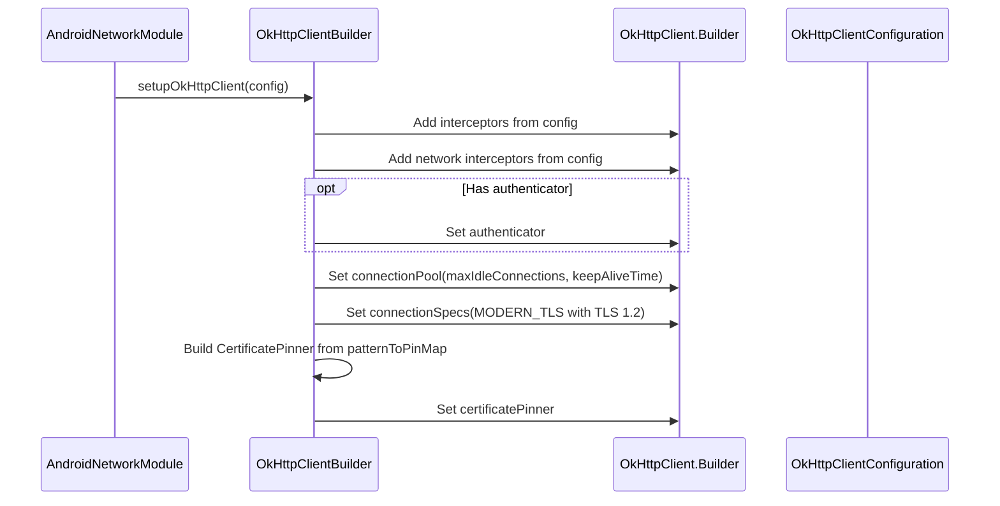
```mermaid
sequenceDiagram
    participant Module as AndroidNetworkModule
    participant Builder as OkHttpClientBuilder
    participant OkHttp as OkHttpClient.Builder
    participant Config as OkHttpClientConfiguration

    Module->>Builder: setupOkHttpClient(config)

    Builder->>OkHttp: Add interceptors from config
    Builder->>OkHttp: Add network interceptors from config

    opt Has authenticator
        Builder->>OkHttp: Set authenticator
    end

    Builder->>OkHttp: Set connectionPool(maxIdleConnections, keepAliveTime)

    Builder->>OkHttp: Set connectionSpecs(MODERN_TLS with TLS 1.2)

    Builder->>Builder: Build CertificatePinner from patternToPinMap
    Builder->>OkHttp: Set certificatePinner
```

### TLS Configuration

| Setting | Value | Purpose |
|---------|-------|---------|
| ConnectionSpec | MODERN_TLS | Modern cipher suites |
| TLS Version | TLS_1_2 | Minimum TLS version |

### Certificate Pinning

The builder creates a CertificatePinner from the pattern-to-pin map provided in configuration.

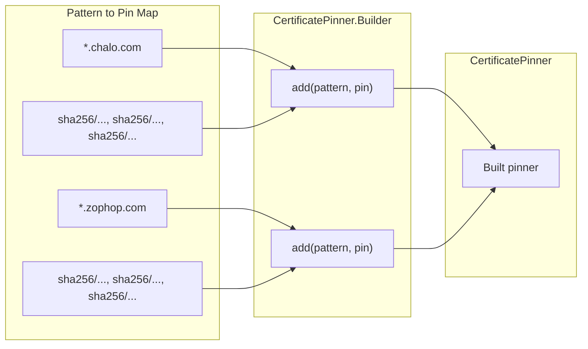
```mermaid
flowchart LR
    subgraph Input["Pattern to Pin Map"]
        Pattern1["*.chalo.com"]
        Pattern2["*.zophop.com"]
        Pins1["sha256/..., sha256/..., sha256/..."]
        Pins2["sha256/..., sha256/..., sha256/..."]
    end

    subgraph Builder["CertificatePinner.Builder"]
        Add1["add(pattern, pin)"]
        Add2["add(pattern, pin)"]
    end

    subgraph Output["CertificatePinner"]
        Pinner["Built pinner"]
    end

    Pattern1 --> Add1
    Pins1 --> Add1
    Pattern2 --> Add2
    Pins2 --> Add2
    Add1 --> Pinner
    Add2 --> Pinner
```

---

## DarwinClientBuilder (iOS)

The DarwinClientBuilder is an object that configures Ktor's Darwin engine for iOS. It sets up certificate pinning through challenge handlers and configures session timeouts.

### Configuration

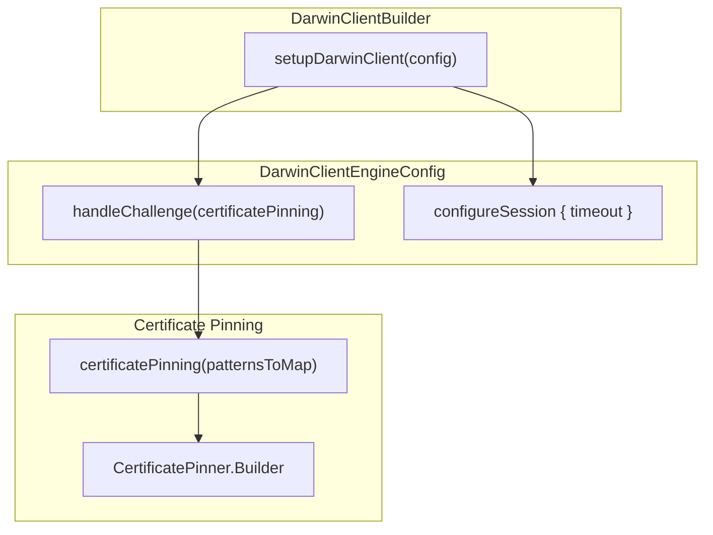
```mermaid
flowchart TB
    subgraph Builder["DarwinClientBuilder"]
        Setup["setupDarwinClient(config)"]
    end

    subgraph Engine["DarwinClientEngineConfig"]
        HandleChallenge["handleChallenge(certificatePinning)"]
        ConfigSession["configureSession { timeout }"]
    end

    subgraph Pinning["Certificate Pinning"]
        CreatePinner["certificatePinning(patternsToMap)"]
        BuildPinner["CertificatePinner.Builder"]
    end

    Setup --> HandleChallenge
    Setup --> ConfigSession
    HandleChallenge --> CreatePinner
    CreatePinner --> BuildPinner
```

### DarwinClientConfiguration

| Field | Type | Purpose |
|-------|------|---------|
| `patternsToPinMap` | Map<String, Array<String>> | Hostname to pins mapping |
| `timeoutIntervalInSeconds` | Double | Request timeout |

---

## CertificatePinCreator (iOS)

The CertificatePinCreator provides certificate pins for iOS using pure Kotlin obfuscation. Since iOS doesn't support JNI, the pins are constructed by combining string fragments to resist simple string extraction.

### Pin Construction

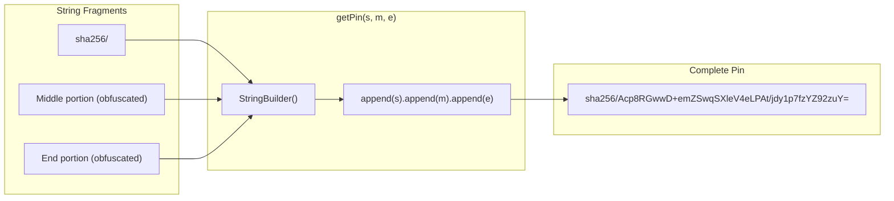
```mermaid
flowchart LR
    subgraph Fragments["String Fragments"]
        S["sha256/"]
        M["Middle portion (obfuscated)"]
        E["End portion (obfuscated)"]
    end

    subgraph Assembly["getPin(s, m, e)"]
        Builder["StringBuilder()"]
        Append["append(s).append(m).append(e)"]
    end

    subgraph Output["Complete Pin"]
        Pin["sha256/Acp8RGwwD+emZSwqSXleV4eLPAt/jdy1p7fzYZ92zuY="]
    end

    S --> Builder
    M --> Builder
    E --> Builder
    Builder --> Append
    Append --> Pin
```

### Available Methods

| Method | Returns | Purpose |
|--------|---------|---------|
| `getPKP1c()` | String | Primary pin for chalo.com |
| `getPKP2c()` | String | Secondary pin for chalo.com |
| `getPKP3c()` | String | Tertiary pin for chalo.com |
| `getPKP1z()` | String | Primary pin for zophop.com |
| `getC()` | String | Pattern "*.chalo.com" |
| `getZ()` | String | Pattern "*.zophop.com" |

---

## NetworkStateManager

The NetworkStateManager provides connectivity state monitoring through a StateFlow. Features can observe network state changes to update UI or pause operations when offline.

### Interface Definition

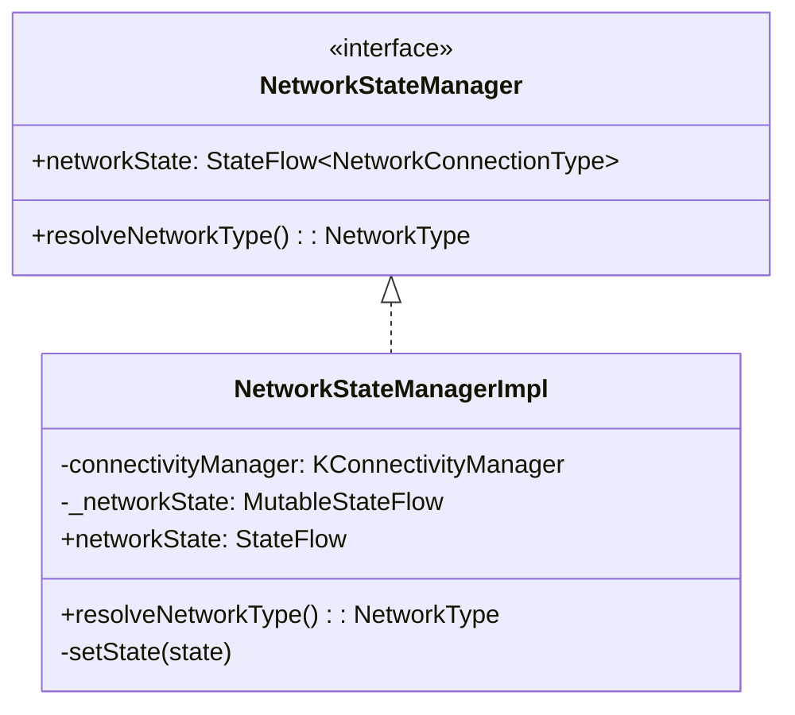
```mermaid
classDiagram
    class NetworkStateManager {
        <<interface>>
        +networkState: StateFlow~NetworkConnectionType~
        +resolveNetworkType(): NetworkType
    }

    class NetworkStateManagerImpl {
        -connectivityManager: KConnectivityManager
        -_networkState: MutableStateFlow
        +networkState: StateFlow
        +resolveNetworkType(): NetworkType
        -setState(state)
    }

    NetworkStateManager <|.. NetworkStateManagerImpl
```

### Connection Types

| Enum | Description |
|------|-------------|
| `NetworkConnectionType.UNKNOWN` | Initial state before detection |
| `NetworkConnectionType.DISCONNECTED` | No network connectivity |
| `NetworkConnectionType.CONNECTED` | Network available |

### Network Types

| Enum | Description |
|------|-------------|
| `NetworkType.WIFI` | WiFi connection |
| `NetworkType.CELLULAR_2G` | 2G cellular |
| `NetworkType.CELLULAR_3G` | 3G cellular |
| `NetworkType.CELLULAR_4G` | LTE cellular |
| `NetworkType.CELLULAR` | Generic cellular (Android Q+) |
| `NetworkType.UNKNOWN` | Unknown network type |

### Extension Function

```kotlin
fun NetworkStateManager.isConnected(): Boolean =
    networkState.value == NetworkConnectionType.CONNECTED
```

---

## KConnectivityManager (Android)

The KConnectivityManagerAndroid implements the KConnectivityManager interface using Android's ConnectivityManager with NetworkCallback for real-time state changes.

### Callback Registration

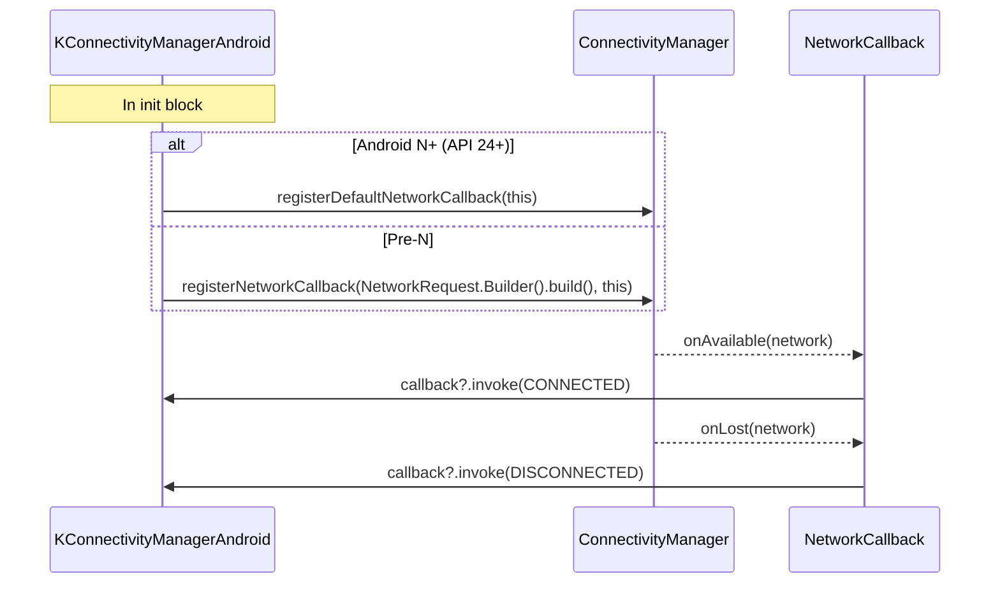
```mermaid
sequenceDiagram
    participant Manager as KConnectivityManagerAndroid
    participant CM as ConnectivityManager
    participant Callback as NetworkCallback

    Note over Manager: In init block

    alt Android N+ (API 24+)
        Manager->>CM: registerDefaultNetworkCallback(this)
    else Pre-N
        Manager->>CM: registerNetworkCallback(NetworkRequest.Builder().build(), this)
    end

    CM-->>Callback: onAvailable(network)
    Callback->>Manager: callback?.invoke(CONNECTED)

    CM-->>Callback: onLost(network)
    Callback->>Manager: callback?.invoke(DISCONNECTED)
```

### Network Type Resolution

The `resolveNetworkType()` method determines the specific network type using NetworkInfo and TelephonyManager.

| Check | Result |
|-------|--------|
| WiFi connected | `NetworkType.WIFI` |
| TelephonyManager GPRS/EDGE/CDMA/1xRTT/IDEN/GSM | `NetworkType.CELLULAR_2G` |
| TelephonyManager UMTS/EVDO/HSDPA/HSUPA/HSPA/etc | `NetworkType.CELLULAR_3G` |
| TelephonyManager LTE | `NetworkType.CELLULAR_4G` |
| Android Q+ cellular | `NetworkType.CELLULAR` |
| Other | `NetworkType.UNKNOWN` |

---

## ChaloInternalNetworkInspector

The ChaloInternalNetworkInspector is a Ktor plugin interface for debugging and monitoring network traffic. It logs request and response details with unique request IDs.

### Plugin Flow

```mermaid
sequenceDiagram
    participant Client as HttpClient
    participant Plugin as ChaloInternalNetworkInspector
    participant Request as Request
    participant Response as Response Pipeline

    Plugin->>Plugin: Generate UUID requestId
    Plugin->>Plugin: Record requestedAt timestamp
    Plugin->>Plugin: onRequest(request, requestId, requestedAt)

    Plugin->>Request: proceed(request)
    Request-->>Plugin: HttpClientCall

    Plugin->>Plugin: Store requestId and requestedAt in call attributes

    Note over Response: Response Pipeline Transform phase

    Response->>Plugin: logAndProceed(body, config)
    Plugin->>Plugin: Retrieve requestId, requestedAt from attributes
    Plugin->>Plugin: Parse response body based on type
    Plugin->>Plugin: onResponse(request, interceptedResponse, requestId, requestedAt)
```

### HttpInterceptedResponse

| Field | Type | Description |
|-------|------|-------------|
| `code` | Int | HTTP status code |
| `headers` | Map<String, List<String>> | Response headers |
| `parsedResponse` | String | Response body as string |

### DisabledInspector

A companion object provides a no-op implementation for production builds where inspection should be disabled.

---

## Analytics Events

The network layer emits analytics events through NetworkConstants.Analytics for monitoring request performance.

| Constant | Value | Purpose |
|----------|-------|---------|
| `CATEGORY_NETWORK_CALL` | "NETWORK_CALL" | Analytics category |
| `INTERCEPTOR` | "interceptor" | Interceptor category |
| `ACTION_NETWORK_INTERCEPTOR_TIME` | "NETWORK_INTERCEPTOR_TIME" | Interceptor timing event |
| `CALL_LATENCY` | "callLatency" | Latency attribute key |
| `URL` | "url" | URL attribute key |
| `INTERCEPTOR_LATENCY` | "interceptorLatency" | Interceptor overhead key |

---

## Performance Configuration

### HTTP Client Settings

| Parameter | Constant | Default Value |
|-----------|----------|---------------|
| Connection timeout | `CONNECTION_TIMEOUT_IN_MILLIS` | 15,000ms |
| Read timeout | `OK_HTTP_READ_TIMEOUT_IN_MILLIS` | 15,000ms |
| Write timeout | `OK_HTTP_WRITE_TIMEOUT_IN_MILLIS` | 15,000ms |
| Keep-alive | `MAX_KEEP_ALIVE` | 60 seconds |
| Auth retry limit | `AUTHENTICATION_RETRY_LIMIT` | 4 |

### Connection Pooling

| Priority | Constant | Max Idle Connections |
|----------|----------|---------------------|
| HIGH | `MAX_IDLE_CONNECTIONS_FOR_HIGH_PRIORITY_CALLS` | 1 |
| NORMAL | `MAX_IDLE_CONNECTIONS_FOR_NORMAL_PRIORITY_CALL` | 2 |
| LOW | `MAX_IDLE_CONNECTIONS_FOR_LOW_PRIORITY_CALLS` | 1 |
