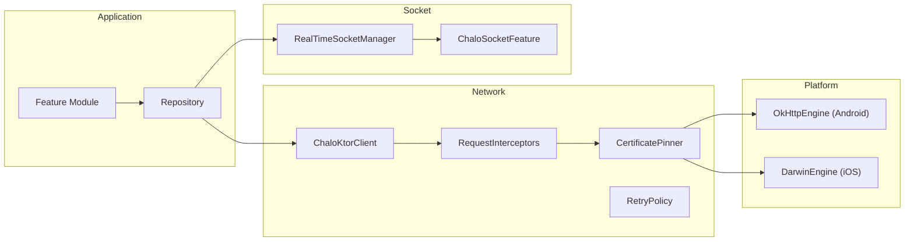

# Network — High-Level Design

## Overview

The Network feature provides the HTTP and WebSocket infrastructure for all network communication in the Chalo app. It includes Ktor-based HTTP clients, Socket.IO for real-time connections, certificate pinning for security, retry strategies, connection state monitoring, and request/response interceptors. The architecture supports both Android (OkHttp) and iOS (Darwin) engines.

## User Journey

1. **Entry Points**:
   - Any feature requiring network calls
   - Real-time tracking connections
   - Background sync operations

2. **Core Flow**:
   - Application makes network request
   - Request interceptors add headers/auth
   - Certificate pinning validates server
   - Request sent via platform engine
   - Response intercepted and parsed
   - Result delivered to caller

3. **Exit Points**:
   - Success → Data returned
   - Failure → Error handling/retry
   - Network unavailable → Offline mode

## Architecture Diagram



## Key Components

| Component | Platform | File Path | Responsibility |
|-----------|----------|-----------|----------------|
| `ChaloKtorClient` | Shared | `shared/network/.../ChaloKtorClient.kt` | HTTP client wrapper |
| `CertificatePinnerImpl` | Shared | `shared/security/.../CertificatePinnerImpl.kt` | SSL pinning |
| `SecureJNI` | Android | `shared/security/.../jni/SecureJNI.kt` | JNI security |
| `RealTimeSocketManagerImpl` | Shared | `shared/livetracking/.../RealTimeSocketManagerImpl.kt` | WebSocket management |
| `NetworkStateMonitor` | Shared | `shared/core/.../NetworkStateMonitor.kt` | Connectivity tracking |

## Data Flow

### HTTP Request Flow
1. Repository calls `ChaloKtorClient.request()`
2. `AuthInterceptor` adds authentication headers
3. `LoggingInterceptor` logs request details
4. `CertificatePinner` validates server certificate
5. Platform engine (OkHttp/Darwin) executes request
6. Response interceptors process response
7. JSON deserialization via Kotlinx.serialization
8. Result returned to repository

### WebSocket Connection Flow
1. `RealTimeSocketManager` initiates connection
2. Fetch socket configuration from server
3. Connect via Socket.IO client
4. Subscribe to channels/topics
5. Receive real-time updates
6. Parse and emit to collectors
7. Handle reconnection on disconnect

### Error Flow
1. Request fails (network/server error)
2. `RetryPolicy` evaluates retry eligibility
3. Exponential backoff applied
4. Retry or propagate error
5. Circuit breaker for repeated failures

## Platform Differences

### Android-Specific
- OkHttp engine for HTTP
- OkHttp WebSocket client
- JNI-based certificate pinning
- ConnectivityManager for network state
- WorkManager for background requests

### iOS-Specific
- Darwin (URLSession) engine for HTTP
- Starscream or native WebSocket
- Security framework for cert validation
- NWPathMonitor for network state
- Background URL sessions

## Integration Points

### Analytics Events
- See [Analytics: network](/analytics/flows/network) for event documentation
- Key events:
  - `network_request_started`
  - `network_request_completed`
  - `network_request_failed`
  - `socket_connected`
  - `socket_disconnected`
  - `certificate_pinning_failed`

### Shared Services
- **Authentication**: Token refresh and injection
- **Logging**: Request/response logging
- **Crash Reporting**: Network error tracking

### Navigation
- Network errors may trigger global error dialogs
- Authentication failures redirect to login

## HTTP Client Configuration

### ChaloKtorClientConfig
```kotlin
data class ChaloKtorClientConfig(
    val baseUrl: String,
    val connectTimeout: Long = 30_000,
    val readTimeout: Long = 30_000,
    val writeTimeout: Long = 30_000,
    val maxRetries: Int = 3,
    val retryDelayMs: Long = 1_000,
    val enableLogging: Boolean = true,
    val enableCertPinning: Boolean = true
)
```

### Request Configuration
```kotlin
suspend inline fun <reified T> request(
    method: HttpMethod,
    path: String,
    queryParams: Map<String, String> = emptyMap(),
    body: Any? = null,
    headers: Map<String, String> = emptyMap(),
    timeout: Long? = null
): Result<T>
```

## Certificate Pinning

### Pinning Configuration
```kotlin
data class CertificatePinConfig(
    val hostname: String,
    val pins: List<String>,  // SHA-256 hashes
    val includeSubdomains: Boolean = true
)

val pinnedHosts = listOf(
    CertificatePinConfig(
        hostname = "api.chalo.com",
        pins = listOf(
            "sha256/AAAA...",
            "sha256/BBBB..."  // Backup pin
        )
    )
)
```

### SecureJNI (Android)
- Pins stored in native code
- JNI interface for retrieval
- Obfuscation for security
- Runtime validation

## WebSocket Configuration

### ChaloSocketConfig
```kotlin
data class ChaloSocketConfig(
    val baseUrl: String,
    val socketPath: String,
    val reconnectionDelay: Long = 1_000,
    val maxReconnectionDelay: Long = 30_000,
    val connectionTimeout: Long = 20_000,
    val enableCookie: Boolean = true,
    val transports: List<String> = listOf("websocket", "polling")
)
```

### Socket Events
```kotlin
sealed class SocketEvent {
    object Connected : SocketEvent()
    object Disconnected : SocketEvent()
    data class Message(val topic: String, val data: String) : SocketEvent()
    data class Error(val error: Throwable) : SocketEvent()
    object Reconnecting : SocketEvent()
}
```

## Retry Strategy

### RetryPolicy
```kotlin
data class RetryPolicy(
    val maxRetries: Int = 3,
    val initialDelayMs: Long = 1_000,
    val maxDelayMs: Long = 30_000,
    val multiplier: Double = 2.0,
    val retryableStatusCodes: Set<Int> = setOf(408, 429, 500, 502, 503, 504),
    val retryOnConnectionFailure: Boolean = true
)

fun shouldRetry(
    attempt: Int,
    statusCode: Int?,
    exception: Throwable?
): Boolean {
    if (attempt >= maxRetries) return false
    if (statusCode != null && statusCode in retryableStatusCodes) return true
    if (exception is IOException && retryOnConnectionFailure) return true
    return false
}
```

### Exponential Backoff
```kotlin
fun calculateDelay(attempt: Int): Long {
    val delay = initialDelayMs * multiplier.pow(attempt)
    return minOf(delay.toLong(), maxDelayMs)
}
```

## Network State

### NetworkState
```kotlin
sealed class NetworkState {
    object Available : NetworkState()
    object Unavailable : NetworkState()
    object Losing : NetworkState()
    data class CapabilitiesChanged(
        val hasInternet: Boolean,
        val isMetered: Boolean,
        val transportType: TransportType
    ) : NetworkState()
}

enum class TransportType {
    WIFI,
    CELLULAR,
    ETHERNET,
    VPN,
    UNKNOWN
}
```

### Connectivity Monitoring
```kotlin
class NetworkStateMonitor {
    val networkState: StateFlow<NetworkState>

    fun isNetworkAvailable(): Boolean
    fun observeNetworkState(): Flow<NetworkState>
}
```

## Interceptors

### Request Interceptors
```kotlin
interface RequestInterceptor {
    suspend fun intercept(request: HttpRequestBuilder): HttpRequestBuilder
}

class AuthInterceptor : RequestInterceptor {
    override suspend fun intercept(request: HttpRequestBuilder): HttpRequestBuilder {
        val token = authRepository.getAccessToken()
        request.header("Authorization", "Bearer $token")
        return request
    }
}

class DeviceInfoInterceptor : RequestInterceptor {
    override suspend fun intercept(request: HttpRequestBuilder): HttpRequestBuilder {
        request.header("X-Device-Id", deviceId)
        request.header("X-App-Version", appVersion)
        request.header("X-Platform", platform)
        return request
    }
}
```

### Response Interceptors
```kotlin
interface ResponseInterceptor {
    suspend fun intercept(response: HttpResponse): HttpResponse
}

class TokenRefreshInterceptor : ResponseInterceptor {
    override suspend fun intercept(response: HttpResponse): HttpResponse {
        if (response.status == HttpStatusCode.Unauthorized) {
            authRepository.refreshToken()
            // Retry original request
        }
        return response
    }
}
```

## Edge Cases & Error Handling

| Scenario | Handling |
|----------|----------|
| Certificate pinning failed | Block request, log security event |
| Network unavailable | Queue request or return cached |
| Request timeout | Retry with backoff |
| 401 Unauthorized | Refresh token and retry |
| 429 Rate Limited | Respect Retry-After header |
| Socket disconnected | Auto-reconnect with backoff |
| SSL handshake failed | Check date/time, report error |

## Error Types

### NetworkError
```kotlin
sealed class NetworkError : Throwable() {
    object NoConnection : NetworkError()
    object Timeout : NetworkError()
    data class HttpError(val code: Int, val message: String) : NetworkError()
    object CertificatePinningFailed : NetworkError()
    data class ParseError(val cause: Throwable) : NetworkError()
    data class SocketError(val cause: Throwable) : NetworkError()
    object Unknown : NetworkError()
}
```

## Performance Configuration

| Parameter | Value |
|-----------|-------|
| Connection timeout | 30 seconds |
| Read timeout | 30 seconds |
| Write timeout | 30 seconds |
| Max retries | 3 |
| Initial retry delay | 1 second |
| Max retry delay | 30 seconds |
| Socket reconnect delay | 1-30 seconds |
| Keep-alive interval | 25 seconds |

## Dependencies

### Internal
- `shared:network` — HTTP client module
- `shared:security` — Certificate pinning
- `shared:core` — Base utilities
- `shared:livetracking` — Socket management

### External
- Ktor Client — HTTP framework
- OkHttp (Android) — HTTP engine
- Darwin (iOS) — HTTP engine
- Socket.IO — WebSocket client
- Kotlinx.serialization — JSON parsing
