# Network — Repository Documentation

## Architecture Overview

The Network data layer in the Chalo KMP codebase operates differently from typical feature repositories. Rather than abstracting data sources behind repository interfaces, the network infrastructure exposes directly usable components. ChaloRestClient serves as the HTTP client, platform-specific modules (AndroidNetworkModule, SharedNetworkModule) configure these with security and performance settings, and NetworkConfig provides runtime-configurable timeout values.

This documentation covers the data-layer components: HTTP client configuration, platform-specific setups, error response models, and the dependency injection structure that wires everything together.


---

## Repository/Data Source Inventory

| Component | Layer | File Location | Purpose |
|-----------|-------|---------------|---------|
| **ChaloRestClient** | Shared | `shared/network/src/commonMain/.../rest/ChaloRestClient.kt` | Ktor HTTP client wrapper |
| **ChaloRestClientManager** | Shared | `shared/network/src/commonMain/.../rest/ChaloRestClientManager.kt` | Priority client provider |
| **HttpClientHelper** | Shared | `shared/network/src/commonMain/.../HttpClientHelper.kt` | Ktor client configuration |
| **NetworkConfig** | Shared | `shared/network/src/commonMain/.../config/NetworkConfig.kt` | Runtime timeout configuration |
| **ChaloUrlProvider** | Shared | `shared/network/src/commonMain/.../ChaloUrlProvider.kt` | Base URL provider interface |
| **ChaloAuthSecureManager** | Shared | `shared/network/src/commonMain/.../ChaloAuthSecureManager.kt` | Auth token management interface |
| **NetworkResponse** | Shared | `shared/network/src/commonMain/.../rest/response/NetworkResponse.kt` | Response wrapper with parsing |
| **GenericNetworkExceptionMapper** | Shared | `shared/network/src/commonMain/.../mapper/GenericNetworkExceptionMapper.kt` | Error classification |
| **OkHttpClientBuilder** | Android | `shared/network/src/androidMain/.../okhttp/OkHttpClientBuilder.kt` | OkHttp configuration |
| **DarwinClientBuilder** | iOS | `shared/network/src/iosMain/.../darwin/DarwinClientBuilder.kt` | Darwin engine configuration |
| **SharedNetworkModule** | Shared | `shared/network/src/commonMain/.../di/SharedNetworkModule.kt` | Koin DI module |
| **AndroidNetworkModule** | Android | `shared/network/src/androidMain/.../di/AndroidNetworkModule.kt` | Android Koin module |

---

## ChaloRestClient

ChaloRestClient wraps a Ktor HttpClient to execute HTTP requests. It provides typed methods for each HTTP verb and handles request construction, header application, and response capture.

### Class Structure


### Request Execution Flow


### Content Types

| Request Type | Content-Type | Body Handling |
|--------------|--------------|---------------|
| GET | N/A | No body |
| POST | application/json | JSON string or Any body with setBody() |
| PUT | application/json | JSON string or Any body with setBody() |
| DELETE | N/A | No body |
| Multipart POST | multipart/form-data | FormData with file + additional info |

### Internal Extensions

The client uses private extension functions on HttpRequestBuilder to apply headers and query parameters.


---

## ChaloRestClientManager

The ChaloRestClientManager is a singleton object implementing KoinComponent that provides ChaloRestClient instances configured for different priority levels. It retrieves pre-configured clients from Koin using named qualifiers.

### Priority-Based Client Selection


### Qualifier Constants

| Constant | Value | Description |
|----------|-------|-------------|
| `CLIENT_PRIORITY_LOW` | "lowPriority" | Koin qualifier for low priority |
| `CLIENT_PRIORITY_MEDIUM` | "mediumPriority" | Koin qualifier for normal priority |
| `CLIENT_PRIORITY_HIGH` | "highPriority" | Koin qualifier for high priority |

### Client Configuration Differences

Each priority level has different connection pool configuration to balance resource usage.

| Priority | Qualifier | Connection Pool | Use Case |
|----------|-----------|-----------------|----------|
| LOW (1) | lowPriority | 1 max idle | Analytics, background sync |
| NORMAL (2) | mediumPriority | 2 max idle | Standard API calls |
| HIGH (3) | highPriority | 1 max idle | Authentication, critical paths |

---

## HttpClientHelper

HttpClientHelper is an object that creates configured Ktor HttpClient instances. It installs plugins for content negotiation, logging, authentication, and network inspection.

### Plugin Installation


### JSON Serialization (ChaloJson.Json)

The ContentNegotiation plugin uses a pre-configured Json instance.

| Setting | Value | Purpose |
|---------|-------|---------|
| `ignoreUnknownKeys` | true | Ignore extra fields in response |
| `isLenient` | true | Accept malformed JSON |
| `encodeDefaults` | true | Include default values in requests |

### Default Request Headers

The setupDefaultRequest function configures headers added to every request via addCommonHeaders extension.

| Header | Source | Value |
|--------|--------|-------|
| `Content-Type` | Constant | "application/json" |
| `accept` | Constant | "application/json" |
| `source` | CommonHeaderProvider.getSource() | Platform identifier |
| `deviceId` | CommonHeaderProvider.getDeviceId() | Unique device ID |
| `appVer` | CommonHeaderProvider.getAppVersion() | App version code |
| `x-type` | CommonHeaderProvider.getXType() | "pass" (if X_TYPE_HEADER marker) |

---

## ChaloUrlProvider

ChaloUrlProvider is an interface that provides environment-specific base URLs for various API endpoints. Features inject this to get the appropriate URL for their requests.

### Interface Methods

| Method | Returns | Purpose |
|--------|---------|---------|
| `updateChaloBaseUrl()` | Unit | Refresh base URL from config |
| `getBaseUrl()` | String | Main API base URL |
| `getMetaPropsUrl()` | String | Meta properties endpoint |
| `getLiveApiBaseUrl()` | String | Live tracking API base |
| `getGeoSpatialBaseUrl()` | String | Geospatial services base |
| `getCashPassBaseUrl()` | String | Cash pass services base |
| `getSchedulerBaseUrl(version)` | String | Scheduler API base (versioned) |
| `getMticketingBaseUrl()` | String | M-ticketing base (deprecated) |
| `getConfigurationBaseUrl(shouldUseDevForPreprod)` | String | Configuration endpoint (deprecated) |
| `getLiveFeedBaseUrl()` | String | Live feed services |
| `getLogoutBaseUrl()` | String | Logout endpoint (deprecated) |
| `getRefreshTokenBaseUrl()` | String | Token refresh endpoint (deprecated) |
| `getFirebasePollingBaseUrl()` | String | Firebase polling services |

### Environment Configuration

| Environment | Typical Base URL Pattern |
|-------------|--------------------------|
| Production | `https://api.chalo.com` |
| Staging | `https://staging-api.chalo.com` |
| Development | `https://dev-api.chalo.com` |

---

## ChaloAuthSecureManager

ChaloAuthSecureManager is an interface that manages authentication credentials. It provides token access and refresh capabilities used by ChaloAuthPlugin.

### Interface Definition


### Methods and Properties

| Member | Type | Default | Purpose |
|--------|------|---------|---------|
| `getUserId()` | suspend fun | Required | Get current user ID |
| `getAccessToken()` | suspend fun | Required | Get current access token |
| `refreshToken()` | suspend fun | Required | Refresh token, return success |
| `onRetryLimitExceeded(url)` | suspend fun | Required | Handle max retry exceeded |
| `authType` | property | "ACCESS_TOKEN" | Authentication type header value |
| `retryLimitCount` | property | 4 | Max 401 retries before callback |

### Integration with ChaloAuthPlugin


---

## NetworkConfig

NetworkConfig provides runtime-configurable timeout values using DataStore for persistence. It supports migration from legacy SharedPreferences.

### Configuration Values

| Key | Type | Default | Description |
|-----|------|---------|-------------|
| `connect_timeout` | Int | 15000ms | Connection timeout |
| `read_timeout` | Int | 15000ms | Read timeout |
| `write_timeout` | Int | 15000ms | Write timeout |
| `keep_alive` | Long | 60s | Keep-alive duration |

### DataStore Keys

| Key Constant | PreferenceKey | Type |
|--------------|---------------|------|
| `KEY_CONNECT_TIMEOUT` | "connect_timeout" | intPreferencesKey |
| `KEY_READ_TIMEOUT` | "read_timeout" | intPreferencesKey |
| `KEY_WRITE_TIMEOUT` | "write_timeout" | intPreferencesKey |
| `KEY_KEEP_ALIVE_TIME` | "keep_alive" | longPreferencesKey |

### Access Pattern


### File Locations

| Constant | Value | Purpose |
|----------|-------|---------|
| `NETWORK_CONFIG_FILE` | "network_config.preferences_pb" | DataStore file name |
| `NETWORK_CONFIG_PREFS_NAME` | "network_config" | Legacy SharedPreferences name |

---

## NetworkResponse

NetworkResponse is a data class that wraps HTTP response data with convenience methods for parsing success and error responses.

### Data Structure

| Field | Type | Description |
|-------|------|-------------|
| `isSuccess` | Boolean | True for 2xx responses |
| `errorType` | ErrorType | Classified error category |
| `response` | String? | Response body as string |
| `rawResponse` | ByteArray? | Binary response (for PDFs) |
| `headers` | Map<String, List<String>>? | Response headers |
| `httpResponseCode` | Int | HTTP status code |
| `networkCrashlyticsLogger` | NetworkCrashlyticsLogger | Logger for errors |

### Parse Methods


### Usage Pattern

| Method | Returns | On Parse Failure |
|--------|---------|------------------|
| `getSuccessResponseOrThrowParseException<T>(json)` | T | Throws NetworkSuccessResponseParseException |
| `getErrorResponse<T>()` | T? | Returns null, logs to Crashlytics |
| `getResponseHeaders(header)` | List<String>? | Returns header values or null |

---

## GenericNetworkExceptionMapper

The GenericNetworkExceptionMapper transforms NetworkResponse errors into structured ChaloLocalException types for consistent feature-level error handling.

### Mapping Logic


### ChaloLocalException Hierarchy

| Exception | ErrorType | Contains | Purpose |
|-----------|-----------|----------|---------|
| `NoInternetException` | TYPE_NO_INTERNET | msg | No connectivity |
| `NoUpdateInFetchedDataBasedOnEtagVersion` | TYPE_NO_UPDATE_IN_DATA | genericError, msg | 304 response |
| `RequestCancelledException` | TYPE_REQUEST_CANCELLED | msg | Request cancelled |
| `ServerErrorException` | TYPE_SERVER_ERROR | genericError, msg | 5xx errors |
| `SecureCallUnauthorizedAndRefreshTokenServerUnreachableException` | TYPE_UNAUTHORIZED | genericError, msg | Auth failed |
| `UnexpectedException` | TYPE_UNKNOWN | genericError, msg | Unknown errors |

### Error Response Models


---

## BaseNetworkException

The BaseNetworkException sealed class hierarchy provides structured exception types for network failures caught during request execution.

### Exception Hierarchy


### Exception Properties

| Exception | Constructor | When Thrown |
|-----------|-------------|-------------|
| `TimeoutException` | `(msg: String?)` | Request timeout |
| `NetworkConnectionFailedException` | `(cause: Throwable?)` | No network connectivity |
| `InvalidAccessTokenUsedException` | `(msg: String?)` | Token refresh exhausted (internal) |

---

## OkHttpClientBuilder (Android)

The OkHttpClientBuilder is an object that configures OkHttpClient instances via an extension function on OkHttpClient.Builder.

### Builder Configuration


### OkHttpClientConfiguration

| Field | Type | Description |
|-------|------|-------------|
| `patternToPinMap` | Map<String, Array<String>> | Hostname to pins mapping |
| `interceptors` | List<Interceptor> | Application interceptors |
| `networkInterceptors` | List<Interceptor> | Network interceptors |
| `keepAliveTime` | Long | Connection keep-alive seconds |
| `maxIdleConnections` | Int | Max idle connections in pool |
| `authenticator` | Authenticator? | Optional authenticator |

### TLS Configuration

| Setting | Value | Purpose |
|---------|-------|---------|
| ConnectionSpec | MODERN_TLS | Modern cipher suites |
| TLS Version | TLS_1_2 | Minimum TLS version |

---

## DarwinClientBuilder (iOS)

The DarwinClientBuilder is an object that configures Ktor's Darwin engine for iOS via an extension function.

### Configuration Flow


### DarwinClientConfiguration

| Field | Type | Description |
|-------|------|-------------|
| `patternsToPinMap` | Map<String, Array<String>> | Hostname to pins mapping |
| `timeoutIntervalInSeconds` | Double | Request timeout interval |

---

## AndroidNetworkModule

The AndroidNetworkModule is the Android-specific Koin module that configures platform implementations.

### Module Dependencies


### Dependency Definitions

| Definition | Qualifier | Scope | Dependencies |
|------------|-----------|-------|--------------|
| `DataStore<Preferences>` | NETWORK_CONFIG_FILE | single | Context, migrations |
| `HttpClientEngine` | lowPriority | factory | Context, NetworkConfig, TimeoutInterceptor |
| `HttpClientEngine` | mediumPriority | factory | Context, NetworkConfig, TimeoutInterceptor |
| `HttpClientEngine` | highPriority | factory | Context, NetworkConfig, TimeoutInterceptor |
| `KPlatformSocketConfig` | - | single | OkHttpClient with CookieJar |

### Pin Map Construction

The module retrieves certificate pins from SecureJNI at initialization.


### Interceptor Configuration

| Priority | Interceptors | Network Interceptors |
|----------|--------------|---------------------|
| All | ChuckerInterceptor, TimeoutInterceptor | None |

---

## SharedNetworkModule

The SharedNetworkModule provides platform-agnostic network dependencies available to all platforms. It uses expect/actual for platform-specific wiring.

### Module Structure

```mermaid
flowchart TB
    subgraph SharedModule["getSharedNetworkModule()"]
        Includes["includes(commonModule(), getSharedNetworkPlatformModule())"]
    end

    subgraph Common["commonModule()"]
        NetworkConfig["factory { NetworkConfig }"]
        NetworkManagerImpl["singleOf { NetworkManagerImpl }"]
        LowClient["single(lowPriority) { ChaloRestClient }"]
        MedClient["single(mediumPriority) { ChaloRestClient }"]
        HighClient["single(highPriority) { ChaloRestClient }"]
        Mapper["factoryOf { GenericNetworkExceptionMapper }"]
    end

    subgraph Platform["getSharedNetworkPlatformModule() (expect/actual)"]
        Android["Android implementation"]
        iOS["iOS implementation"]
    end

    SharedModule --> Includes
    Includes --> Common
    Includes --> Platform
```



### ChaloRestClient Construction

Each priority level creates a ChaloRestClient with a configured HttpClient.


### Dependency Definitions

| Definition | Scope | Dependencies | Description |
|------------|-------|--------------|-------------|
| `NetworkConfig` | factory | DataStore | Runtime config |
| `NetworkManager` | singleton (bind) | UrlProvider, Logger | Request builder factory |
| `ChaloRestClient` (3x) | singleton | HttpClient per priority | HTTP client wrappers |
| `GenericNetworkExceptionMapper` | factory | None | Error mapping |

---

## ErrorType

The ErrorType enum classifies network errors into categories for consistent handling.

### Enum Values

| ErrorType | Code | HTTP Status | Description |
|-----------|------|-------------|-------------|
| TYPE_UNAUTHORIZED | 1000 | 401 | Authentication required |
| TYPE_CLIENT_ERROR | 2000 | 400-499 | Client-side error |
| TYPE_NETWORK_ERROR | 3000 | - | Generic network error |
| TYPE_SERVER_ERROR | 4000 | 500-599 | Server-side error |
| TYPE_NO_INTERNET | 5000 | - | No connectivity |
| TYPE_REQUEST_CANCELLED | 6000 | - | Request cancelled |
| TYPE_COMMON_HEADER | 7000 | - | Header validation error |
| TYPE_TIMEOUT | 8000 | - | Request timed out |
| TYPE_UNKNOWN | 9000 | - | Unknown error |
| TYPE_NO_UPDATE_IN_DATA | 10000 | 304 | Not Modified |
| TYPE_NONE | 0 | - | No error (success) |

### Mapping from HTTP Status

```kotlin
fun getErrorTypeFromHttpStatusCode(statusCode: Int): ErrorType {
    return when (statusCode) {
        304 -> TYPE_NO_UPDATE_IN_DATA
        401 -> TYPE_UNAUTHORIZED
        in 400 until 500 -> TYPE_CLIENT_ERROR
        in 500 until 600 -> TYPE_SERVER_ERROR
        else -> TYPE_UNKNOWN
    }
}
```

---

## Thread Safety

Network components implement appropriate synchronization for thread safety.

### Synchronization Points

| Component | Mechanism | Protected Operation |
|-----------|-----------|---------------------|
| ChaloRestClientManager | Singleton object | Client instance access |
| ChaloAuthConfigHandler | Mutex.withLock | Token refresh synchronization |
| NetworkConfig | DataStore | Concurrent read/write |

### Coroutine Context

| Operation | Dispatcher | Reason |
|-----------|------------|--------|
| HTTP requests | Ktor default (IO) | Network I/O |
| Token refresh | Mutex-protected | Prevents concurrent refresh |
| Config access | DataStore internal | Safe concurrent access |

---

## Caching Strategy

The network layer does not implement HTTP caching by default. Caching is handled at the repository level by individual features.

### Cache Control Headers

| Header | Behavior |
|--------|----------|
| No Cache-Control | No caching |
| Feature-specific | Feature manages cache |

### Recommended Feature Patterns

| Data Type | Strategy | Implementation |
|-----------|----------|----------------|
| User profiles | In-memory cache | ViewModel/StateFlow |
| Route data | Database cache | Room/SQLDelight |
| Static resources | HTTP cache | OkHttp Cache (if enabled) |
