# Network — UseCase Documentation

## Architecture Overview

The Network domain layer differs fundamentally from typical feature domains. Rather than orchestrating user-facing workflows, it provides infrastructure services that other features consume. The primary "use case" equivalents are the request execution pipeline (NetworkRequestBuilder to ChaloRequest), the retry handling system (RequestRetryHandler), and supporting operations like token refresh (ChaloAuthPlugin) and network state monitoring (NetworkStateManager).

This documentation focuses on the actual domain-level operations found in the KMP codebase that encapsulate network business logic.

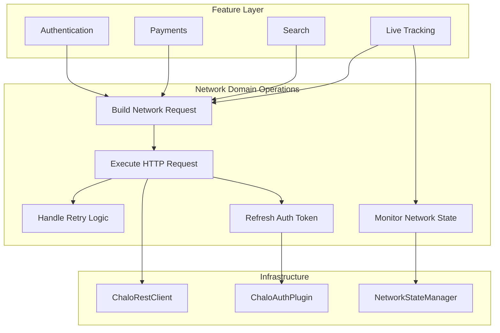

---

## Operation Inventory

| Operation | Entry Point | Input | Output |
|-----------|-------------|-------|--------|
| **Build Network Request** | `NetworkRequestBuilder` | Configuration via fluent API | `ChaloRequest` |
| **Execute HTTP Request** | `ChaloRequest.processSync()` | `ChaloRequest` | `NetworkResponse` |
| **Handle Retry** | `RequestRetryHandler` | Failed response, strategy | Boolean + delay |
| **Refresh Auth Token** | `ChaloAuthPlugin` (internal) | Current tokens | New tokens or logout |
| **Monitor Network State** | `NetworkStateManager` | Connectivity callback | `Flow<NetworkConnectionType>` |
| **Classify Network Error** | `GenericNetworkExceptionMapper` | NetworkResponse | ChaloLocalException |

---

## Build Network Request

The request building operation uses the NetworkRequestBuilder to construct a fully configured ChaloRequest. This fluent API pattern allows features to specify exactly what they need while the builder handles validation, serialization, and configuration assembly.

### Purpose

Features need a simple, type-safe way to construct HTTP requests without dealing with HTTP client details. The builder pattern encapsulates URL construction, header management, body serialization, and retry configuration into a chainable API that produces a ready-to-execute ChaloRequest.

### Building Flow

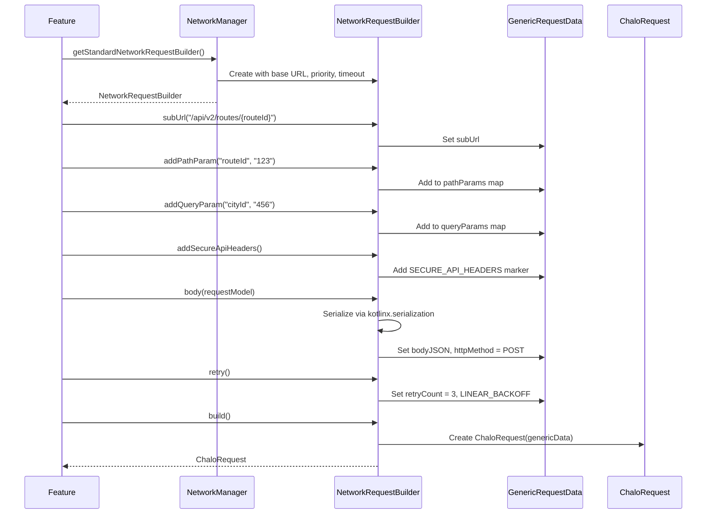

### Input Configuration

| Method | Validation | Side Effects |
|--------|------------|--------------|
| `baseUrl(url)` | Not blank | Sets base URL |
| `subUrl(path)` | Not blank | Sets endpoint path |
| `addPathParam(key, value)` | Value not null | Adds to pathParams |
| `addQueryParam(key, value)` | Value not null | Adds to queryParams |
| `addHeader(key, value)` | Value not null | Adds to headers |
| `body<T>(obj)` | Type serializable | Sets JSON body, POST method |
| `rawBody(json)` | Not null | Sets body, POST method |
| `timeout(ms)` | None | Sets connect/read/write |
| `retry()` | None | Sets retryCount = 3, LINEAR_BACKOFF |
| `retryCount(n)` | None | Sets specific retry count |
| `retryStrategy(type)` | Valid enum | Sets backoff strategy |

### Output: ChaloRequest

The built ChaloRequest contains all configuration needed to execute the request. It encapsulates the GenericRequestData and a RequestRetryHandler initialized from the retry configuration.

| Field | Type | Source |
|-------|------|--------|
| `genericRequestData` | GenericRequestData | Builder configuration |
| `networkCrashlyticsLogger` | NetworkCrashlyticsLogger | Injected for error reporting |
| `retryHandler` | RequestRetryHandler | Created from retry config |

### Business Rules

| Rule | Description | Enforced In |
|------|-------------|-------------|
| **URL required** | Request must have base URL and sub URL | `build()` validation |
| **Body implies POST** | Setting body changes method to POST | `body()` method |
| **Null values forbidden** | Path/query params cannot be null | `addMapValue()` |
| **Retry count capped** | Cannot exceed strategy maximum | RetryStrategyType max |
| **Empty params forbidden** | `queryParams(emptyMap())` throws | `queryParams()` validation |

---

## Execute HTTP Request

The request execution operation is the core network workflow. ChaloRequest.processSync() coordinates client selection, request dispatch, response processing, error handling, and retry logic.

### Purpose

Features need to send HTTP requests and receive structured responses or errors. This operation handles the complexity of timeout management, authentication header injection, response parsing, error classification, and retry logic, presenting a simple synchronous interface.

### Execution Flow

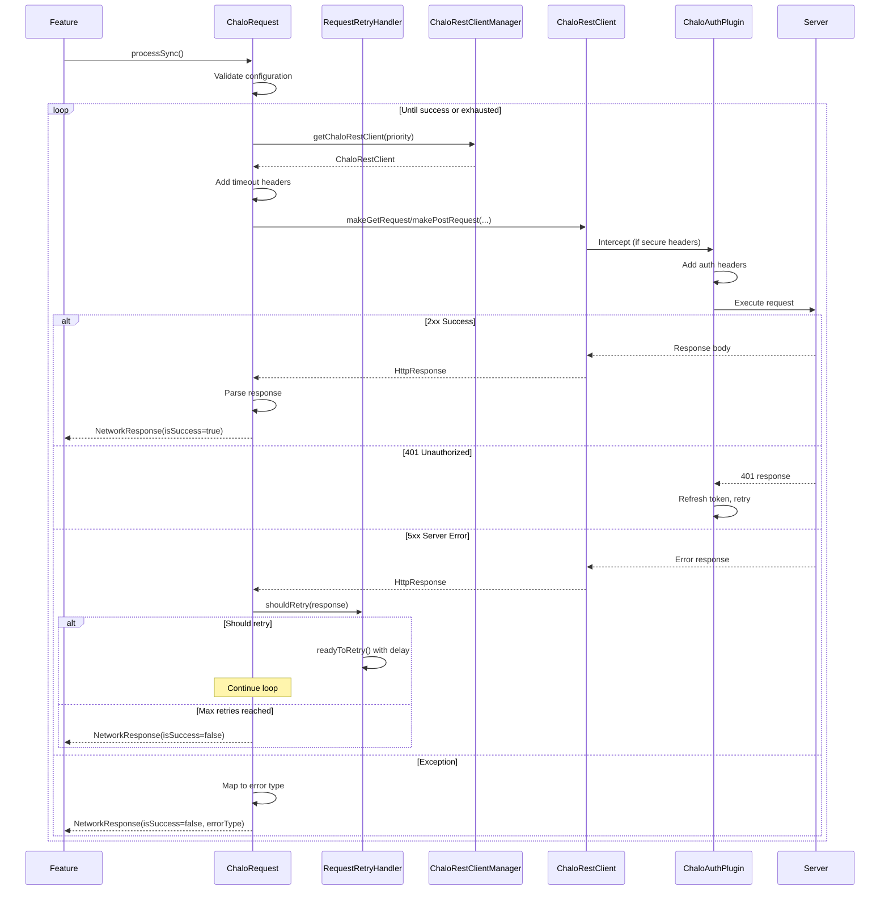

### Input

The processSync() method takes no parameters; all configuration comes from the ChaloRequest's internal GenericRequestData.

| Data | Used For |
|------|----------|
| `baseUrl` + `subUrl` | Full URL construction |
| `pathParams` | URL template substitution |
| `queryParams` | Query string building |
| `headers` | Request headers |
| `bodyJSON` | POST/PUT body |
| `httpMethod` | HTTP verb selection |
| `priority` | Client pool selection |
| `timeouts` | Timeout header injection |
| `retryCount/Strategy` | Retry configuration |

### Output: NetworkResponse

| Field | Type | Description |
|-------|------|-------------|
| `isSuccess` | Boolean | True for 2xx responses |
| `errorType` | ErrorType | Classified error category |
| `response` | String? | Response body as string |
| `rawResponse` | ByteArray? | Binary response (for PDFs) |
| `headers` | Map? | Response headers |
| `httpResponseCode` | Int | HTTP status code |

### Error Classification

The execution maps exceptions and HTTP codes to ErrorType values for consistent handling.

```mermaid
flowchart TB
    subgraph Exceptions["Exception Handling"]
        Timeout["BaseNetworkException.TimeoutException"]
        Network["BaseNetworkException.NetworkConnectionFailed"]
        Token["BaseNetworkException.InvalidAccessTokenUsed"]
        Cancel["CancellationException"]
        Other["Other Exception"]
    end

    subgraph HTTPCodes["HTTP Status Codes"]
        Code304["304 Not Modified"]
        Code401["401 Unauthorized"]
        Code4xx["400-499 Client Error"]
        Code5xx["500-599 Server Error"]
    end

    subgraph ErrorTypes["ErrorType"]
        TYPE_TIMEOUT
        TYPE_NO_INTERNET
        TYPE_UNAUTHORIZED
        TYPE_REQUEST_CANCELLED
        TYPE_UNKNOWN
        TYPE_NO_UPDATE_IN_DATA
        TYPE_CLIENT_ERROR
        TYPE_SERVER_ERROR
    end

    Timeout --> TYPE_TIMEOUT
    Network --> TYPE_NO_INTERNET
    Token --> TYPE_UNAUTHORIZED
    Cancel --> TYPE_REQUEST_CANCELLED
    Other --> TYPE_UNKNOWN

    Code304 --> TYPE_NO_UPDATE_IN_DATA
    Code401 --> TYPE_UNAUTHORIZED
    Code4xx --> TYPE_CLIENT_ERROR
    Code5xx --> TYPE_SERVER_ERROR
```

### Business Rules

| Rule | Description |
|------|-------------|
| **Priority routing** | Requests use client matching their priority level |
| **Timeout via headers** | Custom timeouts passed as headers for interceptor |
| **PDF handling** | application/pdf content type returns rawResponse bytes |
| **Only 5xx retried** | Client errors (4xx) are not retried |
| **Cancellation respected** | CancellationException returns immediately |

---

## Handle Retry Logic

The retry handling operation determines whether failed requests should be retried and calculates appropriate delays using configurable backoff strategies.

### Purpose

Transient server errors (5xx) often succeed on retry. This operation encapsulates retry decision logic and delay calculation, protecting servers from retry storms while maximizing successful request rates.

### Retry Decision Flow

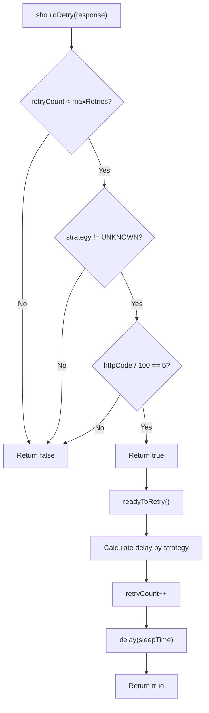

### Input

| Parameter | Type | Description |
|-----------|------|-------------|
| `maxRetries` | Int | Maximum retry attempts |
| `retryStrategyType` | RetryStrategyType | Backoff algorithm |
| `networkResponse` | NetworkResponse | Failed response to evaluate |

### Backoff Calculations

Each strategy produces delays based on the current retry count.

| Strategy | Formula | Max Retries | Retry 1 | Retry 2 | Retry 3 | Retry 4 |
|----------|---------|-------------|---------|---------|---------|---------|
| `NO_BACKOFF` | 0 | 5 | 0ms | 0ms | 0ms | 0ms |
| `CONSTANT_BACKOFF` | 1000 | 5 | 1000ms | 1000ms | 1000ms | 1000ms |
| `LINEAR_BACKOFF` | n * 1000 | 5 | 0ms | 1000ms | 2000ms | 3000ms |
| `EXPONENTIAL_BACKOFF` | 2^n * 1000 | 5 | 2000ms | 4000ms | 8000ms | 16000ms |
| `POLYNOMIAL_BACKOFF` | n^2 * 1000 | 4 | 0ms | 1000ms | 4000ms | 9000ms |

### Strategy Selection Guidelines

| Strategy | Use Case |
|----------|----------|
| `NO_BACKOFF` | Idempotent operations with urgent need |
| `CONSTANT_BACKOFF` | Simple retry without overwhelming |
| `LINEAR_BACKOFF` | Default, gradual increase |
| `EXPONENTIAL_BACKOFF` | Unknown recovery time |
| `POLYNOMIAL_BACKOFF` | Moderate increase, less aggressive than exponential |

### Business Rules

| Rule | Description |
|------|-------------|
| **5xx only** | Only server errors trigger retries |
| **Max capped** | Retry count cannot exceed strategy.maxRetryCount |
| **Delay before retry** | readyToRetry() applies calculated delay |
| **Count increment** | Retry count incremented after delay |

---

## Refresh Auth Token

The token refresh operation is handled internally by ChaloAuthPlugin. When a request receives a 401 response, the plugin automatically refreshes the access token and retries the request.

### Purpose

Access tokens expire for security. Rather than forcing features to handle token expiration, the network layer automatically refreshes tokens and retries requests transparently.

### Refresh Flow

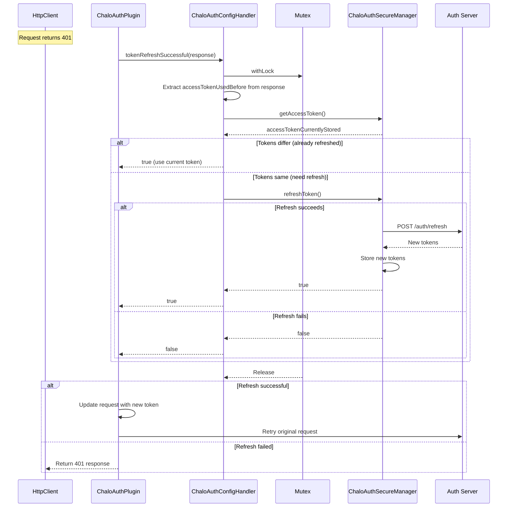

### Concurrency Protection

Multiple concurrent requests may receive 401 simultaneously. The Mutex ensures only one refresh operation executes while others wait and reuse the result.

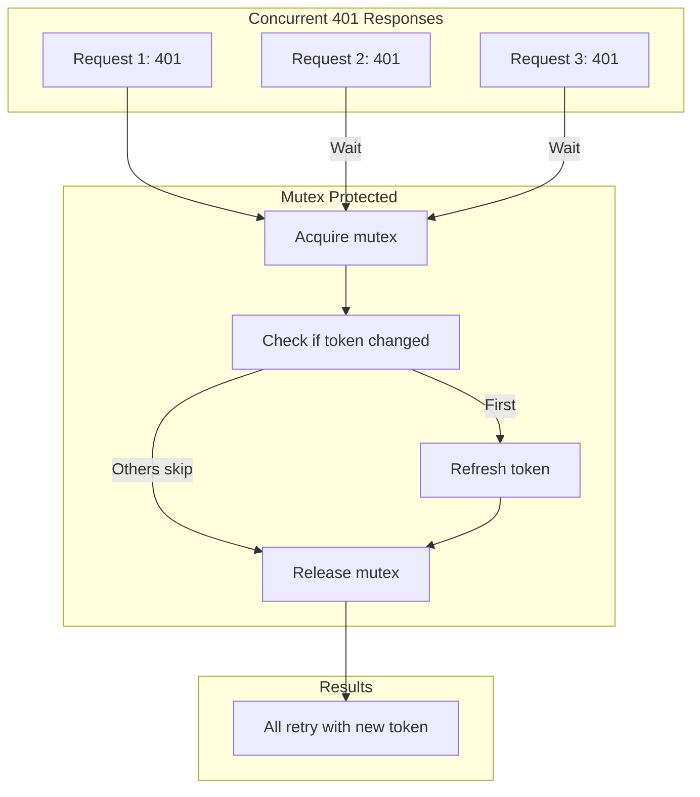

### Retry Limit

The plugin tracks retry attempts per request to prevent infinite refresh loops.

| Parameter | Value | Description |
|-----------|-------|-------------|
| `AUTHENTICATION_RETRY_LIMIT` | 4 | Maximum 401 retries |
| `retryAttemptCountAttributeKey` | Attribute | Tracks attempts per request |

### Business Rules

| Rule | Description |
|------|-------------|
| **Automatic refresh** | No feature code needed |
| **Single refresh** | Concurrent 401s share one refresh |
| **Limit enforced** | Exceeding limit triggers onRetryLimitExceeded |
| **Logout on repeated failure** | Callback notifies for user logout |

---

## Monitor Network State

The NetworkStateManager provides real-time connectivity monitoring through a StateFlow that emits connection state changes.

### Purpose

Features need to know when the device is online or offline to provide appropriate UX (disable actions, show messages) and optimize operations (queue requests, skip polling).

### Monitoring Flow

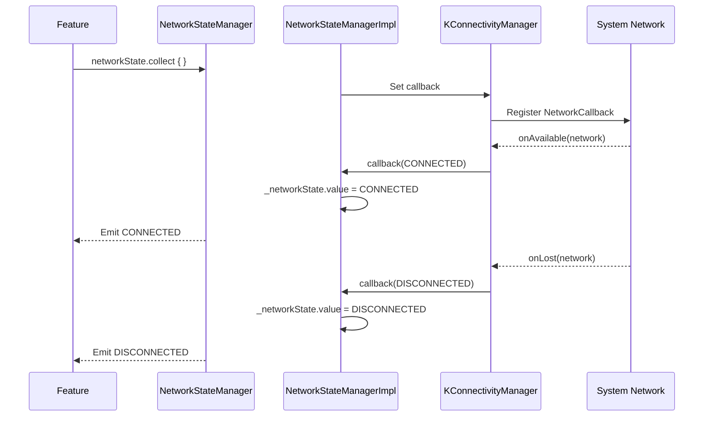

### Interface

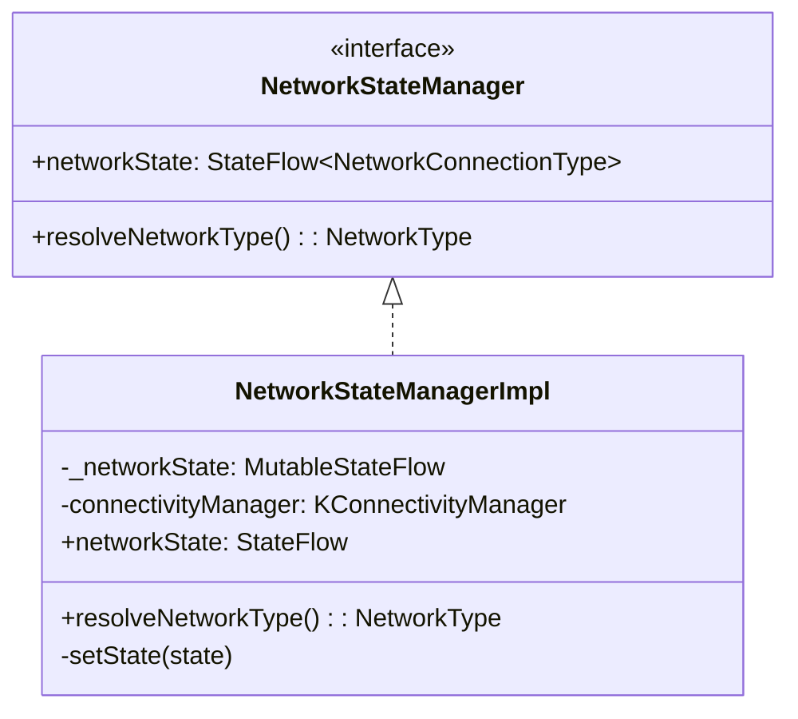

### Connection Types

| Enum | Description |
|------|-------------|
| `NetworkConnectionType.UNKNOWN` | Initial state before detection |
| `NetworkConnectionType.DISCONNECTED` | No network connectivity |
| `NetworkConnectionType.CONNECTED` | Network available |

### Network Type Resolution

| NetworkType | Condition |
|-------------|-----------|
| `WIFI` | WiFi connected |
| `CELLULAR_2G` | GPRS, EDGE, CDMA, 1xRTT, IDEN, GSM |
| `CELLULAR_3G` | UMTS, EVDO variants, HSDPA, HSUPA, HSPA variants |
| `CELLULAR_4G` | LTE |
| `CELLULAR` | Android Q+ cellular (non-specific) |
| `UNKNOWN` | Other or undetectable |

### Extension Function

```kotlin
fun NetworkStateManager.isConnected(): Boolean =
    networkState.value == NetworkConnectionType.CONNECTED
```

### Business Rules

| Rule | Description |
|------|-------------|
| **Immediate state** | StateFlow provides current state immediately |
| **Distinct emissions** | Only emits when state actually changes |
| **Platform-specific** | Uses Android ConnectivityManager or iOS APIs |

---

## Classify Network Error

The GenericNetworkExceptionMapper transforms raw exceptions and NetworkResponse errors into structured ChaloLocalException types that features can handle uniformly.

### Purpose

Network failures manifest as diverse exception types across platforms. This operation normalizes exceptions into a consistent error hierarchy, enabling features to implement generic error handling without platform-specific code.

### Classification Flow

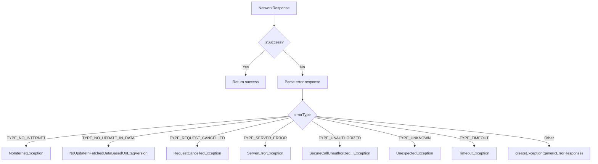

### Error Type Codes

The ErrorType enum provides numeric codes for logging and analytics.

| ErrorType | Code | HTTP Trigger | Description |
|-----------|------|--------------|-------------|
| TYPE_NONE | 0 | - | No error |
| TYPE_UNAUTHORIZED | 1000 | 401 | Authentication required |
| TYPE_CLIENT_ERROR | 2000 | 400-499 | Client-side error |
| TYPE_NETWORK_ERROR | 3000 | - | Generic network error |
| TYPE_SERVER_ERROR | 4000 | 500-599 | Server-side error |
| TYPE_NO_INTERNET | 5000 | - | No connectivity |
| TYPE_REQUEST_CANCELLED | 6000 | - | Request cancelled |
| TYPE_COMMON_HEADER | 7000 | - | Header validation error |
| TYPE_TIMEOUT | 8000 | - | Request timed out |
| TYPE_UNKNOWN | 9000 | - | Unknown error |
| TYPE_NO_UPDATE_IN_DATA | 10000 | 304 | Not Modified |

### ChaloLocalException Hierarchy

| Exception | ErrorType Source | Purpose |
|-----------|------------------|---------|
| `NoInternetException` | TYPE_NO_INTERNET | No connectivity |
| `NoUpdateInFetchedDataBasedOnEtagVersion` | TYPE_NO_UPDATE_IN_DATA | 304 response |
| `RequestCancelledException` | TYPE_REQUEST_CANCELLED | Request cancelled |
| `ServerErrorException` | TYPE_SERVER_ERROR | 5xx errors |
| `SecureCallUnauthorized...Exception` | TYPE_UNAUTHORIZED | Auth failure |
| `UnexpectedException` | TYPE_UNKNOWN | Unknown errors |

### Response Parsing Methods

NetworkResponse provides type-safe parsing methods.

| Method | Returns | On Failure |
|--------|---------|------------|
| `getSuccessResponseOrThrowParseException<T>()` | T | NetworkSuccessResponseParseException |
| `getErrorResponse<T>()` | T? | null (logged to Crashlytics) |

---

## Domain Models

### GenericRequestData

| Field | Type | Default | Description |
|-------|------|---------|-------------|
| `baseUrl` | String? | null | API base URL |
| `subUrl` | String? | null | Endpoint path |
| `pathParams` | MutableMap | {} | Path template parameters |
| `queryParams` | MutableMap | {} | Query string parameters |
| `headers` | MutableMap | {} | Request headers |
| `bodyJSON` | String? | null | Serialized request body |
| `httpMethod` | String | "GET" | HTTP method |
| `priority` | Int | 2 | Request priority (1-3) |
| `connectTimeout` | Int? | null | Connection timeout |
| `readTimeout` | Int? | null | Read timeout |
| `writeTimeout` | Int? | null | Write timeout |
| `retryCount` | Int | 0 | Number of retries |
| `retryStrategy` | String? | null | Backoff strategy name |
| `mediaType` | String | "application/json" | Content type |

### PriorityLevel

| Level | Value | Purpose |
|-------|-------|---------|
| PRIORITY_TYPE_LOW | 1 | Background, analytics |
| PRIORITY_TYPE_NORMAL | 2 | Standard API calls |
| PRIORITY_TYPE_HIGH | 3 | Critical operations |

### RetryStrategyType

| Strategy | Max Retries | Delay Formula |
|----------|-------------|---------------|
| UNKNOWN | 0 | N/A |
| NO_BACKOFF | 5 | 0 |
| CONSTANT_BACKOFF | 5 | 1000ms |
| LINEAR_BACKOFF | 5 | count * 1000 |
| EXPONENTIAL_BACKOFF | 5 | 2^count * 1000 |
| POLYNOMIAL_BACKOFF | 4 | count^2 * 1000 |

### GenericChaloErrorResponse

| Field | Type | Description |
|-------|------|-------------|
| `errorCode` | Int | Application error code |
| `message` | String? | Human-readable message |
| `status` | String? | Error status string |
| `errorDetails` | List<ErrorDetails>? | Detailed error info |
| `errorInfo` | JsonObject? | Additional error data |

### ErrorDetails

| Field | Type | Description |
|-------|------|-------------|
| `type` | String? | Error type identifier |
| `reason` | String? | Error reason |
| `metaData` | Map<String, String>? | Additional metadata |

---

## Business Rules Summary

| Rule | Operation | Enforcement |
|------|-----------|-------------|
| **URL required** | Build Request | Builder validation |
| **Null params forbidden** | Build Request | addMapValue() throws |
| **Body implies POST** | Build Request | body() sets method |
| **5xx only retried** | Execute Request | isRetriable() check |
| **Retry count capped** | Handle Retry | min(count, strategy.max) |
| **Single token refresh** | Refresh Token | Mutex protection |
| **Retry limit enforced** | Refresh Token | Counter per request |
| **Distinct state emissions** | Monitor State | StateFlow distinctUntilChanged |

---

## Integration Patterns

### Feature Request Pattern

Features typically follow this pattern when making network requests:

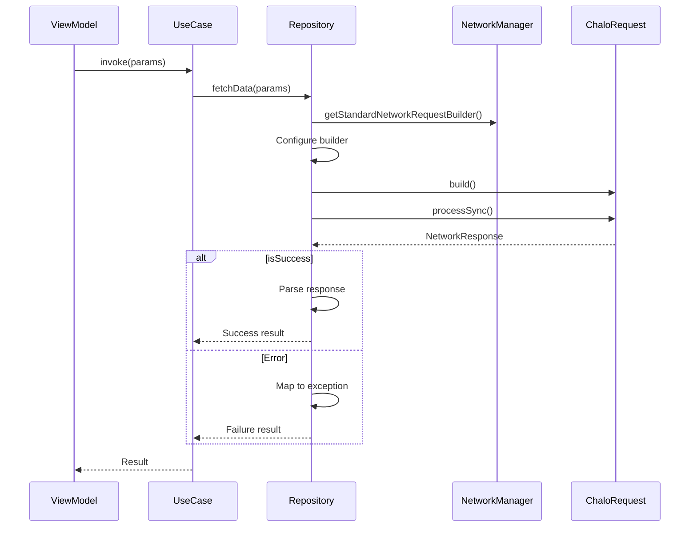

### Error Handling Pattern

Features typically handle network errors as follows:

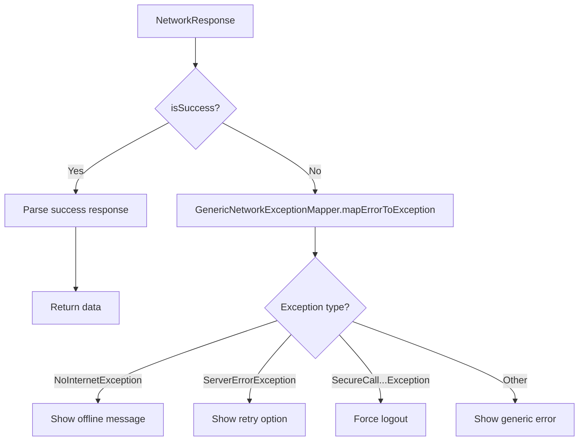

### Connectivity-Aware Pattern

Features that need to respond to connectivity changes:

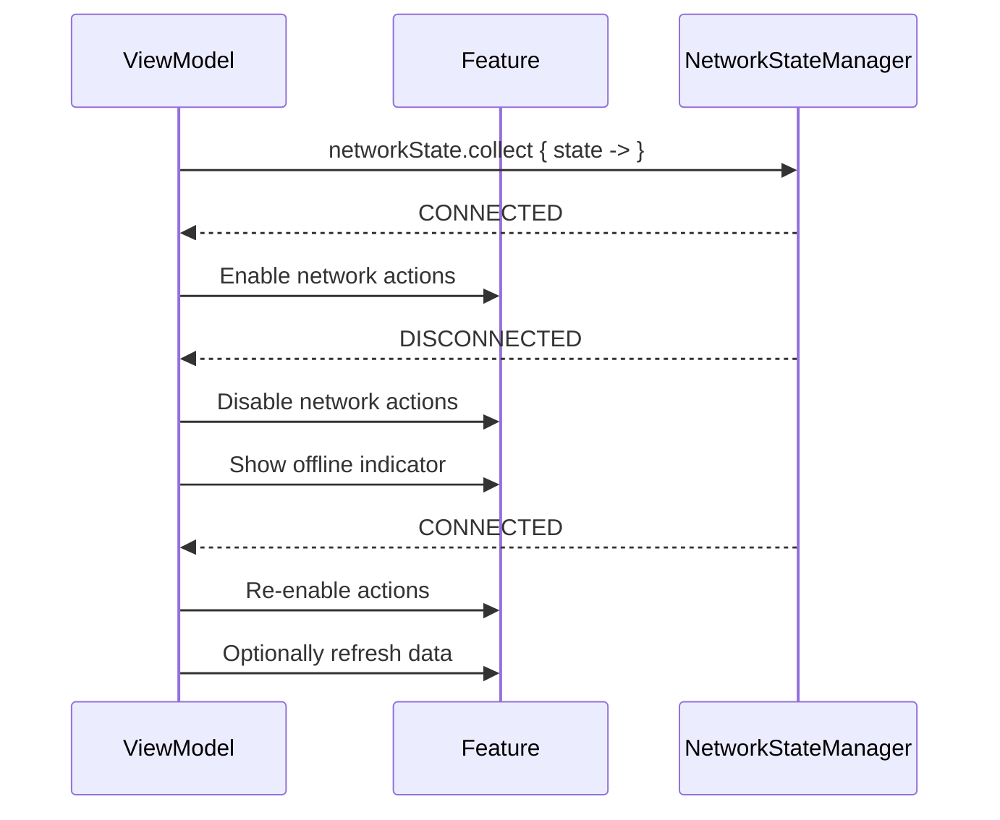
