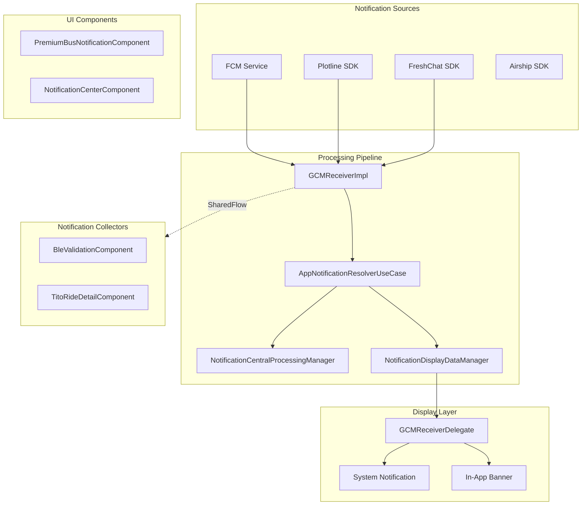
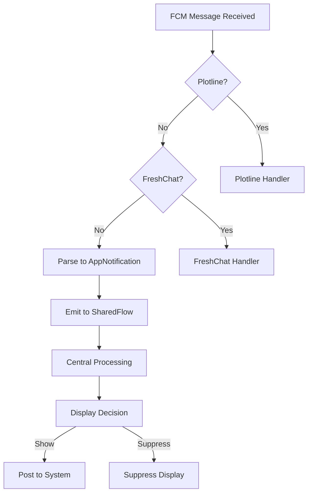
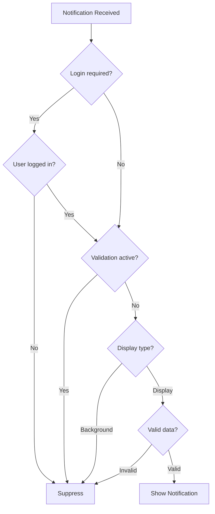

# Notifications — Component Documentation

## Architecture Overview

The Notifications presentation layer handles display of push notifications, in-app banners, and notification center screens. The architecture uses a three-stage processing pipeline: notification stream emission for type-safe collection, central background processing, and display management. Platform-specific delegates handle system notification posting while shared components manage the UI.

---

## Screen Inventory

| Screen | Component | Purpose |
|--------|-----------|---------|
| **Premium Bus Notifications** | PremiumBusNotificationComponent | Plotline widget notifications |
| **Notification Center** | NotificationCenterComponent | Notification history list |
| **System Notification** | GCMReceiverDelegate | Platform system tray notification |
| **In-App Banner** | Banner UI | Transient notification display |

---

## Premium Bus Notification Screen

The Premium Bus notification component displays notifications using Plotline widgets dynamically based on city context.

### User Journey

1. User opens notifications from Premium Bus section
2. Component loads city-specific Plotline widgets
3. Dynamic height detection shows/hides empty state
4. User scrolls through notification cards
5. User taps notification for action

### View State Structure

| Field | Type | Description |
|-------|------|-------------|
| **cityName** | String? | Current city context |
| **isLoading** | Boolean | Loading indicator |

### Plotline Widget Configuration

| Property | Value |
|----------|-------|
| **Widget ID Pattern** | PB_NOTIFICATION_CARD_{cityName}_{0..14} |
| **Widgets Per City** | 15 |
| **Height Detection** | Dynamic based on content |
| **Empty State** | Hidden when no widgets |

### Intents

| Intent | Trigger | Action |
|--------|---------|--------|
| **InitializationIntent** | Screen mount | Load city, fetch widgets |
| **RefreshIntent** | Pull refresh | Reload widgets |
| **NotificationClickedIntent** | Widget tap | Handle deep link |

---

## Notification Center Screen

The notification center displays a list of past notifications with read/unread status and action support.

### User Journey

1. User opens notification center
2. Fetch notification history from repository
3. Display with unread count badge
4. User views and interacts with items
5. Mark as read on view/action

### View State Structure

| Field | Type | Description |
|-------|------|-------------|
| **notifications** | List<NotificationItemUiModel> | Notification list |
| **unreadCount** | Int | Unread badge count |
| **isLoading** | Boolean | Loading state |
| **hasMore** | Boolean | Pagination available |
| **error** | String? | Error message |

### Notification Item Model

| Field | Type | Description |
|-------|------|-------------|
| **id** | String | Notification identifier |
| **title** | String | Display title |
| **body** | String | Notification body |
| **imageUrl** | String? | Optional image |
| **timestamp** | String | Formatted time |
| **isRead** | Boolean | Read status |
| **type** | NotificationType | Notification category |
| **actionLabel** | String? | Action button text |

### Intents

| Intent | Trigger | Action |
|--------|---------|--------|
| **LoadNotifications** | Screen mount | Fetch history |
| **LoadMore** | Scroll to end | Pagination fetch |
| **NotificationClicked** | Item tap | Navigate to target |
| **MarkAsRead** | Item viewed | Update read status |
| **ClearAll** | Clear button | Remove all notifications |

---

## Notification Processing Pipeline

The processing pipeline handles notifications from multiple sources through a unified flow.

### Processing Flow

### Processing Stages

| Stage | Purpose | Component |
|-------|---------|-----------|
| **Stream Emission** | Make notification available to collectors | MutableSharedFlow |
| **Central Processing** | Background work (sync, analytics, persistence) | NotificationCentralProcessingManager |
| **Display Management** | Decide if/how to show notification | NotificationDisplayDataManager |

---

## Type-Safe Notification Collection

Components can subscribe to specific notification types using the type-safe collection API.

### Collection Pattern

The GCMReceiver provides type-safe access to notification streams:

| Method | Purpose |
|--------|---------|
| **receiveNotificationFor<T>()** | Get Flow of specific notification type |

### Example Collectors

| Collector | Notification Type | Purpose |
|-----------|-------------------|---------|
| **BleValidationComponent** | PunchNotification | Real-time punch updates |
| **TitoRideDetailComponent** | TITOTapInNotification | Tap-in confirmations |

---

## Notification Display Suppression

The display manager applies rules to determine if a notification should be shown.

### Suppression Rules

| Rule | Condition | Result |
|------|-----------|--------|
| **Logged Out** | User not authenticated | Suppress login-required types |
| **Active Validation** | QR or BLE validation screen | Suppress punch notifications |
| **TITO Taps** | Tap-in/tap-out events | Background only |
| **Instant Receipts** | Receipt-only events | Background only |
| **Invalid Data** | Missing required fields | Suppress |

### Display Decision Flow

---

## Platform-Specific Display

### Android Implementation

| Component | Purpose |
|-----------|---------|
| **GCMReceiverDelegateAndroid** | System notification posting |
| **NotificationManager** | Android notification API |
| **PendingIntent** | Navigation on tap |

### Android Notification Posting

1. Check notification permission
2. Verify mandatory history call completion
3. Create PendingIntent with navigation metadata
4. Post to NotificationManager with channel ID

### Notification Channel Configuration

| Property | Value |
|----------|-------|
| **Channel ID** | myChannel |
| **Importance** | IMPORTANCE_HIGH |
| **Auto-cancel** | Enabled |

### iOS Implementation

| Component | Purpose |
|-----------|---------|
| **GCMReceiverDelegateIos** | UNNotification posting |
| **UNMutableNotificationContent** | iOS notification content |
| **UserInfo** | Navigation metadata |

---

## Navigation from Notifications

Notifications navigate to target screens via deep links or task stack navigation.

### Navigation Data

| Field | Type | Description |
|-------|------|-------------|
| **deepLink** | String? | Deep link URL |
| **taskStack** | TaskStackNavigation? | Stack-based navigation |

### Navigation Routes by Type

| Notification Type | Destination |
|-------------------|-------------|
| **PASS_UPDATE** | HomeArgs (default) |
| **PAYMENT_DONE** | MyTickets screen |
| **BOOKING_SUCCESSFUL** | PremiumBusActivation |
| **PB_TRIP_STARTED** | Trip activation |
| **QUICK_PAY_RECEIPT** | Receipt screen |
| **M_TICKET_PUNCH** | Receipt screen |
| **CHALO_CARD_TRANSACTION** | Card transaction history |
| **PB_REFUND_PROCESSED** | Ticket summary |

---

## Analytics Events

| Event | Trigger | Properties |
|-------|---------|------------|
| **notification_received** | FCM message received | type, source |
| **notification_displayed** | Shown in system | type, channel |
| **notification_clicked** | User tapped | type, action |
| **notification_dismissed** | User dismissed | type |
| **notification_processed** | Background processing | type, duration |

---

## Third-Party Integration UI

### Plotline Notifications

| Feature | Description |
|---------|-------------|
| **Widget Display** | Dynamic Plotline widgets |
| **Click Tracking** | Custom notification ID tracking |
| **Icon Override** | Custom notification icon |

### FreshChat Messages

| Feature | Description |
|---------|-------------|
| **FAQ Interception** | Route FAQ messages to support |
| **Agent Messages** | Display support responses |

### Airship Messages

| Feature | Description |
|---------|-------------|
| **Message Center** | Rich notification history |
| **Preference Center** | User notification preferences |

---

## Error Handling

| Error Scenario | Handling |
|----------------|----------|
| **Permission denied** | Show settings redirect |
| **Invalid deep link** | Navigate to home |
| **Notification expired** | Don't display |
| **Duplicate notification** | Dedupe by ID |
| **Parse failure** | Log error, suppress display |
| **Network offline** | Queue for later (if applicable) |
