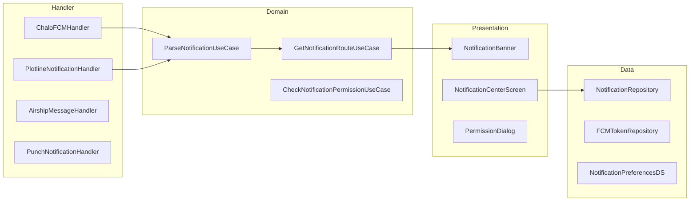

# Notifications — High-Level Design

## Overview

The Notifications feature manages push notifications, in-app notifications, and notification permissions across the Chalo app. It integrates with Firebase Cloud Messaging (FCM), Plotline for marketing campaigns, Airship for advanced messaging, and FreshChat for support notifications. The feature handles 34+ notification types including ticket punches, booking updates, promotions, and system alerts.

## User Journey

1. **Entry Points**:
   - System notification tap → Deep link
   - In-app notification banner → Action
   - Notification center → History

2. **Core Flow**:
   - Receive push notification
   - Parse notification payload
   - Display appropriate UI (banner/dialog)
   - Handle user interaction
   - Navigate to relevant screen

3. **Exit Points**:
   - Action completed → Target screen
   - Notification dismissed → App state unchanged
   - Permission denied → Settings prompt

## Architecture Diagram



## Key Components

| Component | Platform | File Path | Responsibility |
|-----------|----------|-----------|----------------|
| `ChaloFCMHandler` | Shared | `shared/home/.../notification/ChaloFCMHandler.kt` | FCM message handling |
| `PunchNotificationHandler` | Shared | `shared/home/.../notification/punch/PunchNotificationHandler.kt` | Punch notifications |
| `NotificationCenterComponent` | Shared | `shared/home/.../notification/ui/NotificationCenterComponent.kt` | Notification list |
| `PlotlineNotificationHandler` | Shared | `shared/home/.../notification/plotline/PlotlineNotificationHandler.kt` | Marketing notifications |
| `NotificationRepository` | Shared | `shared/home/.../notification/data/NotificationRepository.kt` | Notification storage |

## Data Flow

### Push Notification Flow
1. FCM delivers message to device
2. `ChaloFCMHandler.onMessageReceived()` triggered
3. `ParseNotificationUseCase` extracts payload
4. Route to appropriate handler by type
5. Display system notification or in-app banner
6. On tap → `GetNotificationRouteUseCase` → Navigate

### In-App Notification Flow
1. App receives real-time event (WebSocket/polling)
2. Create in-app notification model
3. Show banner with action
4. User interacts or auto-dismiss
5. Store in notification history

### Permission Flow
1. Check current permission state
2. If not determined → Show explanation dialog
3. Request system permission
4. Handle grant/deny response
5. Update notification preferences

## Platform Differences

### Android-Specific
- `FirebaseMessagingService` for FCM
- Notification channels (Android 8+)
- Foreground service notifications
- POST_NOTIFICATIONS permission (Android 13+)
- Custom notification layouts

### iOS-Specific
- `UNUserNotificationCenter` delegate
- APNs token registration
- Notification categories and actions
- Provisional authorization
- Background fetch for silent notifications

## Integration Points

### Analytics Events
- See [Analytics: notifications](/analytics/flows/notifications) for event documentation
- Key events:
  - `notification_received`
  - `notification_displayed`
  - `notification_clicked`
  - `notification_dismissed`
  - `notification_permission_granted`
  - `notification_permission_denied`

### Shared Services
- **Deep Linking**: Navigation from notifications
- **Authentication**: User-targeted notifications
- **Booking**: Ticket/pass update notifications

### Navigation
- **Navigates to**: Any deep-linkable screen
- **Navigated from**: System tray, In-app banner

## Notification Types

### NotificationType (34+ types)
```kotlin
enum class NotificationType {
    // Booking & Tickets
    TICKET_BOOKED,
    TICKET_CANCELLED,
    TICKET_PUNCHED,
    PASS_ACTIVATED,
    PASS_EXPIRING,

    // Premium Bus
    PB_BOOKING_CONFIRMED,
    PB_TRIP_REMINDER,
    PB_BUS_ARRIVING,
    PB_TRIP_CANCELLED,
    PB_RESCHEDULED,

    // Payments
    PAYMENT_SUCCESS,
    PAYMENT_FAILED,
    REFUND_PROCESSED,

    // Wallet
    WALLET_CREDITED,
    WALLET_DEBITED,
    KYC_REQUIRED,

    // Marketing
    PROMO_OFFER,
    FEATURE_ANNOUNCEMENT,

    // System
    APP_UPDATE,
    MAINTENANCE,

    // Support
    CHAT_MESSAGE,
    TICKET_RESOLVED
}
```

## Notification Payload

### NotificationPayload
```kotlin
data class NotificationPayload(
    val id: String,
    val type: NotificationType,
    val title: String,
    val body: String,
    val imageUrl: String?,
    val deepLink: String?,
    val data: Map<String, String>,
    val priority: NotificationPriority,
    val timestamp: Long,
    val ttl: Long?
)

enum class NotificationPriority {
    LOW,
    NORMAL,
    HIGH,
    CRITICAL
}
```

## FCM Token Management

### Token Lifecycle
```kotlin
class FCMTokenRepository {
    suspend fun getToken(): String
    suspend fun refreshToken()
    suspend fun registerToken(userId: String)
    suspend fun unregisterToken()
    suspend fun onTokenRefresh(newToken: String)
}
```

### Token Sync
1. App launch → Check token validity
2. If expired or missing → Refresh token
3. Register with backend
4. Store locally for reference

## Notification Channels (Android)

### Channel Configuration
```kotlin
val notificationChannels = listOf(
    NotificationChannel(
        id = "bookings",
        name = "Booking Updates",
        importance = IMPORTANCE_HIGH,
        sound = true,
        vibration = true
    ),
    NotificationChannel(
        id = "promotions",
        name = "Offers & Promotions",
        importance = IMPORTANCE_DEFAULT,
        sound = true,
        vibration = false
    ),
    NotificationChannel(
        id = "alerts",
        name = "System Alerts",
        importance = IMPORTANCE_HIGH,
        sound = true,
        vibration = true
    )
)
```

## View State

### NotificationCenterState
```kotlin
data class NotificationCenterState(
    val notifications: List<NotificationItemUiModel>,
    val unreadCount: Int,
    val isLoading: Boolean,
    val hasMore: Boolean,
    val error: String?
)

data class NotificationItemUiModel(
    val id: String,
    val title: String,
    val body: String,
    val imageUrl: String?,
    val timestamp: String,
    val isRead: Boolean,
    val type: NotificationType,
    val actionLabel: String?
)
```

## Third-Party Integrations

### Plotline
- Marketing campaign notifications
- In-app messages and tooltips
- User segmentation
- A/B testing for messages

### Airship
- Advanced message targeting
- Message center
- Preference center
- Rich notifications

### FreshChat
- Support chat notifications
- Agent messages
- Resolution updates

## Edge Cases & Error Handling

| Scenario | Handling |
|----------|----------|
| FCM token expired | Auto-refresh and re-register |
| Permission denied | Show settings redirect |
| Invalid deep link | Navigate to home |
| Notification expired | Don't display |
| Duplicate notification | Dedupe by ID |
| Network offline | Queue for later display |
| App killed | System notification only |

## Permission Handling

### Permission State
```kotlin
enum class NotificationPermissionState {
    NOT_DETERMINED,
    AUTHORIZED,
    DENIED,
    PROVISIONAL,  // iOS only
    EPHEMERAL     // iOS only
}
```

### Permission Request Flow
```kotlin
suspend fun requestNotificationPermission(): PermissionResult {
    val currentState = checkPermissionState()

    return when (currentState) {
        NOT_DETERMINED -> requestSystemPermission()
        DENIED -> showSettingsRedirect()
        AUTHORIZED -> PermissionResult.Granted
        else -> handlePlatformSpecific()
    }
}
```

## Dependencies

### Internal
- `shared:home` — Notification UI and handlers
- `shared:core` — Deep linking and navigation
- `shared:chalo-base` — Base notification models

### External
- Firebase Messaging — FCM integration
- Plotline SDK — Marketing notifications
- Airship SDK — Advanced messaging
- FreshChat SDK — Support notifications
- DataStore — Notification preferences
