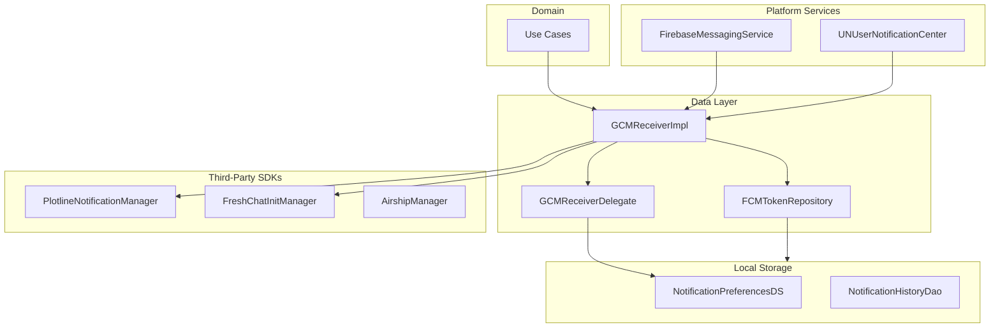
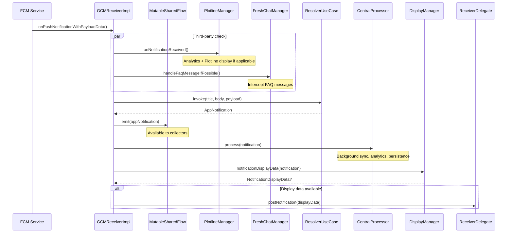
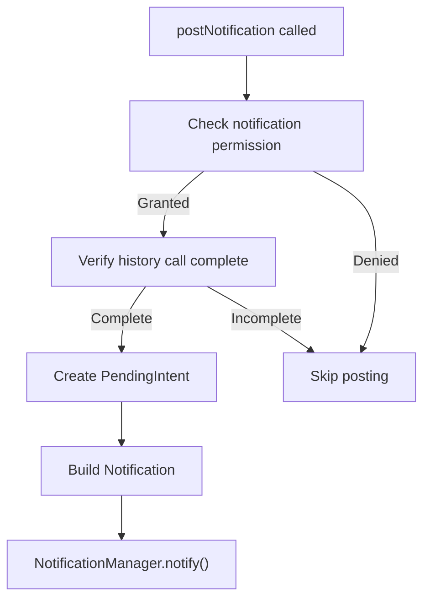
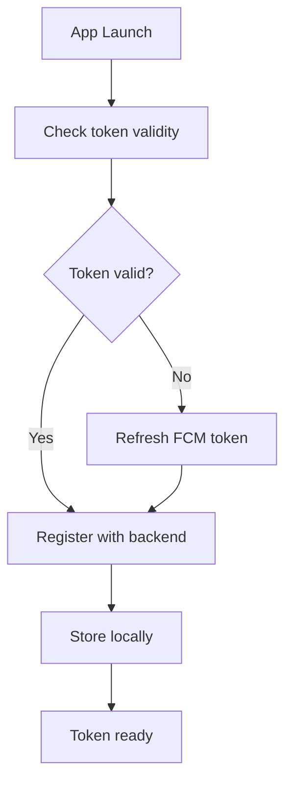
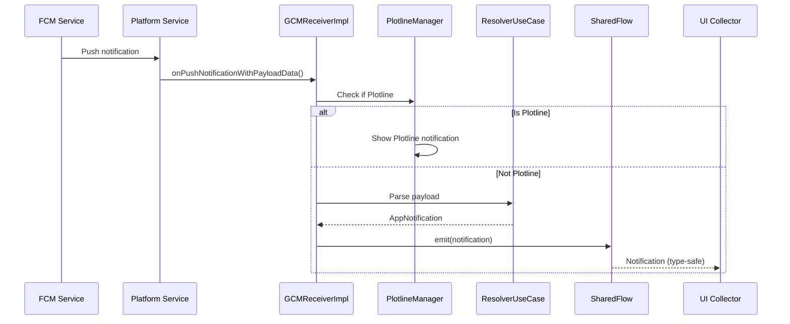
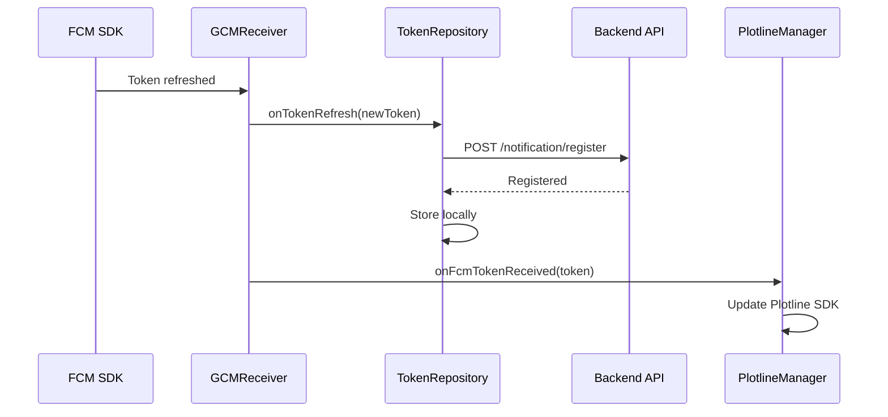

# Notifications — Repository Documentation

## Data Layer Overview

The Notifications data layer manages FCM token lifecycle, notification persistence, and third-party SDK integration. The core component is GCMReceiver which coordinates notification reception, parsing, and distribution. Platform-specific delegates handle system notification posting while Plotline, Airship, and FreshChat integrations extend notification capabilities.

---

## GCMReceiver Interface

The core notification receiver interface defining the notification system API.

### Properties

| Property | Type | Description |
|----------|------|-------------|
| **fcmToken** | StateFlow<String?> | Current FCM token |

### Methods

| Method | Purpose | Returns |
|--------|---------|---------|
| **initialise** | Setup notification system | Unit |
| **receiveNotificationFor<T>** | Get type-safe notification Flow | Flow<T> |
| **onPushNotificationWithPayloadData** | Process incoming notification | Unit |

---

## GCMReceiverImpl

Implementation of the notification receiver with three-stage processing pipeline.

### Dependencies

| Dependency | Purpose |
|------------|---------|
| **GCMReceiverDelegate** | Platform-specific UI posting |
| **AppNotificationResolverUseCase** | Payload parsing |
| **NotificationCentralProcessingManager** | Background operations |
| **NotificationDisplayDataManager** | Display decisions |
| **PlotlineNotificationManager** | Plotline push handling |
| **FreshChatInitManager** | FAQ message interception |
| **AnalyticsContract** | Event tracking |

### Processing Pipeline

---

## Platform-Specific Delegates

### Android Delegate (GCMReceiverDelegateAndroid)

| Method | Purpose |
|--------|---------|
| **initialise** | Configure kmpnotifier with NotificationPlatformConfiguration |
| **postNotification** | Create and post Android system notification |

### Android Notification Posting Flow

### Android Notification Configuration

| Property | Value |
|----------|-------|
| **Channel ID** | myChannel |
| **Importance** | IMPORTANCE_HIGH |
| **Auto-cancel** | true |
| **PendingIntent flags** | FLAG_UPDATE_CURRENT, FLAG_IMMUTABLE |

### iOS Delegate (GCMReceiverDelegateIos)

| Method | Purpose |
|--------|---------|
| **initialise** | Setup UNUserNotificationCenter |
| **postNotification** | Create UNNotificationRequest |

### iOS Notification Configuration

| Property | Value |
|----------|-------|
| **Sound** | UNNotificationSound.default |
| **UserInfo** | Navigation metadata |

---

## FCM Token Management

### Token Repository Interface

| Method | Purpose | Returns |
|--------|---------|---------|
| **getToken** | Get current FCM token | String |
| **refreshToken** | Request new token | Unit |
| **registerToken** | Register with backend | Unit |
| **unregisterToken** | Remove from backend | Unit |
| **onTokenRefresh** | Handle token refresh callback | Unit |

### Token Lifecycle Flow

---

## Plotline Integration

### PlotlineNotificationManager (Abstract Base)

| Method | Purpose |
|--------|---------|
| **setupPlotlineNotificationManager** | Platform-specific initialization |
| **onNotificationReceived** | Intercept all FCM notifications |
| **onFcmTokenReceived** | Update Plotline SDK with token |

### Plotline Detection

Notifications are identified as Plotline using:
- `PlotlinePush.isPushPlotline(payload)` check
- Separate analytics events for FCM vs Plotline notifications

### Android Plotline Implementation

| Feature | Implementation |
|---------|----------------|
| **Notification Icon** | `PlotlinePush.setPlotlineNotificationMetadata()` |
| **Click Listener** | Register click callback |
| **Display** | `PlotlinePush.showNotification()` |
| **Tracking** | Custom notification ID (notifId) |

### Plotline Widget Configuration

| Property | Value |
|----------|-------|
| **Widget ID Pattern** | PB_NOTIFICATION_CARD_{cityName}_{0..14} |
| **Widgets Per City** | 15 |

---

## FreshChat Integration

### FreshChatInitManager

| Method | Purpose |
|--------|---------|
| **handleFaqMessageIfPossible** | Intercept FAQ/support messages |
| **routeToFreshChat** | Open FreshChat UI |

FAQ messages are intercepted before standard notification processing.

---

## Airship Integration

### Airship Features

| Feature | Description |
|---------|-------------|
| **Message Center** | Rich notification history |
| **Preference Center** | User notification preferences |
| **Rich Notifications** | Media-rich notifications |

---

## Local Storage

### Notification Preferences DataStore

| Key | Type | Description |
|-----|------|-------------|
| **fcmToken** | String | Cached FCM token |
| **lastTokenSync** | Long | Last backend sync time |
| **permissionRequested** | Boolean | Permission request status |
| **channelConfigs** | JSON | Channel configurations |

### Notification History DAO

| Method | Purpose |
|--------|---------|
| **insert** | Store notification |
| **getAll** | Retrieve all notifications |
| **getUnread** | Get unread notifications |
| **markAsRead** | Update read status |
| **delete** | Remove notification |
| **deleteExpired** | Clean expired notifications |

### Notification Entity

| Field | Type | Description |
|-------|------|-------------|
| **id** | String (PK) | Notification identifier |
| **type** | String | NotificationType value |
| **title** | String | Display title |
| **body** | String | Notification body |
| **imageUrl** | String? | Optional image |
| **deepLink** | String? | Navigation link |
| **timestamp** | Long | Received time |
| **isRead** | Boolean | Read status |
| **expiryTime** | Long? | Expiration time |

---

## Notification Channels (Android)

### Channel Configuration

| Channel ID | Name | Importance | Sound | Vibration |
|------------|------|------------|-------|-----------|
| **bookings** | Booking Updates | HIGH | Yes | Yes |
| **promotions** | Offers & Promotions | DEFAULT | Yes | No |
| **alerts** | System Alerts | HIGH | Yes | Yes |
| **support** | Support Messages | DEFAULT | Yes | Yes |

### Channel Creation Flow

Channels are created during app initialization:

1. Check if channels exist
2. Create missing channels with configuration
3. Update existing channels if needed

---

## Data Flow Diagrams

### Notification Reception Flow

### Token Registration Flow

---

## API Endpoints

### Register FCM Token

| Property | Value |
|----------|-------|
| **Endpoint** | POST /notification/register |
| **Auth** | Required |

**Request Body**

| Field | Type | Description |
|-------|------|-------------|
| **token** | String | FCM token |
| **platform** | String | android/ios |
| **userId** | String | User identifier |

**Response**

| Field | Type | Description |
|-------|------|-------------|
| **success** | Boolean | Registration status |

### Unregister FCM Token

| Property | Value |
|----------|-------|
| **Endpoint** | DELETE /notification/unregister |
| **Auth** | Required |

**Request Body**

| Field | Type | Description |
|-------|------|-------------|
| **token** | String | FCM token to remove |

---

## Dependency Injection

### Module Bindings

**Common Module**

| Interface | Implementation |
|-----------|----------------|
| GCMReceiver | GCMReceiverImpl |
| AppNotificationResolverUseCase | (Factory) |

**Android Module**

| Interface | Implementation |
|-----------|----------------|
| GCMReceiverDelegate | GCMReceiverDelegateAndroid |
| PlotlineNotificationManager | PlotlineNotificationManagerAndroid |

**iOS Module**

| Interface | Implementation |
|-----------|----------------|
| GCMReceiverDelegate | GCMReceiverDelegateIos |

**Home Module**

| Interface | Implementation |
|-----------|----------------|
| NotificationCentralProcessingManager | NotificationCentralProcessingManagerImpl |
| NotificationDisplayDataManager | NotificationDisplayDataManagerImpl |

---

## Error Handling

### Error Scenarios

| Error | Cause | Handling |
|-------|-------|----------|
| **Token refresh failed** | FCM SDK error | Retry with backoff |
| **Backend registration failed** | Network error | Queue for retry |
| **Parse failure** | Invalid payload | Log error, skip notification |
| **Permission denied** | User denied | Show settings redirect |
| **Channel creation failed** | Android API error | Log error, use default |
| **Plotline SDK error** | SDK initialization | Fallback to standard display |

### Retry Policy

| Operation | Retries | Backoff |
|-----------|---------|---------|
| Token registration | 3 | Exponential |
| Notification posting | 1 | None |
| History sync | 2 | Linear |

---

## Platform Configuration

### Android Configuration

| Property | Value |
|----------|-------|
| **FCM Project** | Configured via google-services.json |
| **Default Channel** | myChannel |
| **Small Icon** | App notification icon |
| **Large Icon** | Optional per notification |

### iOS Configuration

| Property | Value |
|----------|-------|
| **APNs Environment** | Development/Production |
| **Entitlements** | Push notifications enabled |
| **Background Modes** | Remote notifications |
| **Provisional Auth** | Supported |

---

## Analytics Integration

### Tracked Events

| Event | Trigger | Properties |
|-------|---------|------------|
| **notification_fcm_received** | FCM notification received | type, source |
| **notification_plotline_received** | Plotline notification received | campaign_id |
| **notification_displayed** | Shown in system | type, channel |
| **notification_clicked** | User tapped | type, action |
| **notification_dismissed** | User dismissed | type |
| **token_registered** | Token sent to backend | platform |
| **token_refresh** | Token refreshed | reason |
