# Notifications — UseCase Documentation

## Domain Layer Overview

The Notifications domain layer orchestrates notification parsing, processing, display decisions, and navigation routing. The layer uses a resolver use case to convert FCM payloads into typed notification objects, a central processing manager for background operations, and a display data manager for UI decisions. The architecture supports 34+ notification types with type-safe handling.

---

## UseCase Inventory

| UseCase | Layer | Purpose |
|---------|-------|---------|
| **AppNotificationResolverUseCase** | Domain | Parse FCM payload to typed notification |
| **NotificationCentralProcessingManager** | Domain | Background processing (sync, analytics, persistence) |
| **NotificationDisplayDataManager** | Domain | Display decision and navigation routing |
| **NotificationDisplayPolicyManager** | Domain | Display suppression rules |
| **IsNotificationPermissionGrantedUseCase** | Domain | Check notification permission status |

---

## AppNotificationResolverUseCase

Parses FCM payload data into typed AppNotification objects.

### Responsibility

Converts raw notification payload (title, body, data map) into strongly-typed AppNotification objects. Handles 34+ notification types with specific payload extraction for each type.

### Flow Diagram

### Input Parameters

| Parameter | Type | Description |
|-----------|------|-------------|
| **title** | String | Notification title |
| **body** | String | Notification body |
| **payload** | Map<String, String> | FCM data payload |

### Output

| Type | Description |
|------|-------------|
| **AppNotification?** | Typed notification or null |

### Supported Notification Types

| Type | Model | Key Payload Fields |
|------|-------|-------------------|
| **PASS_UPDATE** | PassUpdate | title, body |
| **PAYMENT_DONE** | PaymentDone | userProfile, passInfo |
| **BOOKING_SUCCESSFUL** | BookingSuccessfulEvent | bookingId, productType, productSubType |
| **PB_TRIP_STARTED** | PremiumBusTripStartedEvent | bookingId, productType, productSubType |
| **PB_TRIP_CANCELLED** | PremiumBusTripCancelledOrRescheduledEvent | bookingId, reason |
| **PB_TRIP_RESCHEDULED** | PremiumBusTripCancelledOrRescheduledEvent | bookingId, newTime |
| **PB_TRIP_START_DELAYED** | PremiumBusTripStartDelayedEvent | bookingId, delay |
| **PB_VEHICLE_CHANGED** | PremiumBusTripVehicleChangedEvent | bookingId, newVehicle |
| **PB_REFUND_PROCESSED** | PremiumBusRefundProcessedEvent | bookingId, amount |
| **QUICK_PAY_DIGITAL_RECEIPT** | QuickPayNotificationEvent | walletId, receiptInfo |
| **M_TICKET_PUNCH** | MTicketPunchedEvent | lastRideInfo (JSON) |
| **PREMIUM_RESERVE_TICKET_PUNCH** | PremiumReserveTicketPunchEvent | bookingId, punchData |
| **ONDC_TICKET_PUNCH** | OndcTicketPunchEvent | ticketId, punchData |
| **SP_PUNCH** | SuperPassPunchEvent | passId, payload |
| **TITO_TAP_IN** | TITOTapInNotificationEvent | groupNo, tripNo, routeId, stopId, walletId, expiryTime |
| **TITO_TAP_OUT** | TITOTapOutNotificationEvent | groupNo, tripNo, routeId, stopId |
| **CHALO_CARD_TRANSACTION** | ChaloCardTransactionNotificationEvent | cardInfo (JSON: cardNumber, cardType) |

---

## NotificationCentralProcessingManager

Handles background processing for notifications regardless of display decisions.

### Responsibility

Performs background operations when notifications are received: wallet sync, product history updates, receipt extraction, and analytics tracking. Operations run independently of whether the notification is displayed.

### Flow Diagram

### Processing Operations by Type

| Notification Type | Processing Operation |
|-------------------|----------------------|
| **QuickPayNotificationEvent** | Trigger wallet sync |
| **PassApplicationUpdate** | Update product history |
| **SuperPassPunchEvent** | Extract and store receipt data |
| **MTicketPunchedEvent** | Extract and store receipt data |
| **All types** | Raise analytics events |

### Input

| Parameter | Type | Description |
|-----------|------|-------------|
| **notification** | AppNotification | Typed notification to process |

### Output

| Type | Description |
|------|-------------|
| **Unit** | No return value, side effects only |

---

## NotificationDisplayDataManager

Determines if and how to display notifications, and provides navigation data.

### Responsibility

Applies display policies to determine if a notification should be shown. Provides navigation routing data for notifications that should be displayed.

### Flow Diagram

### Display Data Structure

| Field | Type | Description |
|-------|------|-------------|
| **notificationId** | String | Unique notification ID |
| **appNotification** | AppNotification | Typed notification |
| **navigationData** | NotificationNavigationData | Navigation target |

### Navigation Routing by Type

| Notification Type | Destination | Navigation Data |
|-------------------|-------------|-----------------|
| **PassUpdate** | HomeArgs | Default home |
| **PaymentDone** | MyTickets | Tab navigation |
| **BookingSuccessful** | PremiumBusActivation | Booking ID |
| **PB_TRIP_STARTED** | Trip activation | Booking ID |
| **QuickPayReceipt** | Receipt screen | Receipt data |
| **MTicketPunch** | Receipt screen | Ride info |
| **CardTransaction** | Card history | Card number |
| **PBRefundProcessed** | Ticket summary | Booking ID |

---

## NotificationDisplayPolicyManager

Applies suppression rules to determine if notifications should be displayed.

### Responsibility

Evaluates various conditions to decide if a notification should be shown to the user. Considers login state, current screen, notification type, and data validity.

### Suppression Rules

| Rule | Condition | Action |
|------|-----------|--------|
| **Login Required** | User not authenticated | Suppress login-required types |
| **Active Validation** | QR or BLE validation active | Suppress punch notifications |
| **Background Only** | TITO taps, instant receipts | Always suppress display |
| **Invalid Data** | Missing required fields | Suppress |

### Rule Evaluation Flow

### Background-Only Types

| Type | Reason |
|------|--------|
| **TITO_TAP_IN** | Processed in active ride screen |
| **TITO_TAP_OUT** | Processed in active ride screen |
| **INSTANT_TICKET_RECEIPT** | Receipt stored, no display |

---

## IsNotificationPermissionGrantedUseCase

Checks the current notification permission status.

### Responsibility

Queries the system to determine if notification permission has been granted. Platform-specific implementation.

### Input

None

### Output

| Type | Description |
|------|-------------|
| **Boolean** | Permission granted status |

---

## Domain Models

### AppNotification Hierarchy

```mermaid
classDiagram
    class AppNotification {
        <<interface>>
    }
    class PassUpdate
    class PaymentDone
    class PassApplicationUpdate
    class ChaloCardTransactionNotificationEvent
    class PremiumBusTripStartedEvent
    class PremiumBusTripCancelledOrRescheduledEvent
    class BookingSuccessfulEvent
    class PremiumBusTripStartDelayedEvent
    class PremiumBusTripVehicleChangedEvent
    class PremiumBusRefundProcessedEvent
    class PunchNotification {
        <<interface>>
    }
    class QuickPayNotificationEvent
    class PremiumReserveTicketPunchEvent
    class OndcTicketPunchEvent
    class MTicketPunchedEvent

    AppNotification <|-- PassUpdate
    AppNotification <|-- PaymentDone
    AppNotification <|-- PassApplicationUpdate
    AppNotification <|-- ChaloCardTransactionNotificationEvent
    AppNotification <|-- PremiumBusTripStartedEvent
    AppNotification <|-- PremiumBusTripCancelledOrRescheduledEvent
    AppNotification <|-- BookingSuccessfulEvent
    AppNotification <|-- PremiumBusTripStartDelayedEvent
    AppNotification <|-- PremiumBusTripVehicleChangedEvent
    AppNotification <|-- PremiumBusRefundProcessedEvent
    AppNotification <|-- PunchNotification
    PunchNotification <|-- QuickPayNotificationEvent
    PunchNotification <|-- PremiumReserveTicketPunchEvent
    PunchNotification <|-- OndcTicketPunchEvent
    PunchNotification <|-- MTicketPunchedEvent
```

### NotificationType Enum

34+ notification types organized by category:

| Category | Types |
|----------|-------|
| **Booking & Tickets** | TICKET_BOOKED, TICKET_CANCELLED, TICKET_PUNCHED, PASS_ACTIVATED, PASS_EXPIRING |
| **Premium Bus** | PB_BOOKING_CONFIRMED, PB_TRIP_REMINDER, PB_BUS_ARRIVING, PB_TRIP_CANCELLED, PB_RESCHEDULED, PB_TRIP_STARTED, PB_TRIP_START_DELAYED, PB_VEHICLE_CHANGED, PB_REFUND_PROCESSED |
| **Payments** | PAYMENT_SUCCESS, PAYMENT_FAILED, REFUND_PROCESSED |
| **Wallet** | WALLET_CREDITED, WALLET_DEBITED, KYC_REQUIRED |
| **Punch** | M_TICKET_PUNCH, MTICKET_PUNCH, SP_PUNCH, SUP_PASS_PUNCH, PREMIUM_RESERVE_TICKET_PUNCH, PB_RESERVE_TICKET_PUNCH, QUICK_PAY_DIGITAL_RECEIPT, ONDC_TICKET_PUNCH, INSTANTTICKETSCANNED, TICKET_PUNCH |
| **TITO** | TITO_TAP_IN, TITO_TAP_OUT |
| **Marketing** | PROMO_OFFER, FEATURE_ANNOUNCEMENT |
| **System** | APP_UPDATE, MAINTENANCE, ALERT |
| **Support** | CHAT_MESSAGE, TICKET_RESOLVED |
| **Other** | REFERRAL, UPDATE_TRANSACTION, CHALO_CARD_TRANSACTION_RECEIPT, SP_APPLICATION_UPDATE, SUP_PASS_APPLICATION_UPDATE, BOOKING_SUCCESSFUL |

### NotificationPayload

| Field | Type | Description |
|-------|------|-------------|
| **id** | String | Notification identifier |
| **type** | NotificationType | Notification category |
| **title** | String | Display title |
| **body** | String | Notification body |
| **imageUrl** | String? | Optional image |
| **deepLink** | String? | Deep link URL |
| **data** | Map<String, String> | Additional payload data |
| **priority** | NotificationPriority | LOW, NORMAL, HIGH, CRITICAL |
| **timestamp** | Long | Notification time |
| **ttl** | Long? | Time to live |

### NotificationNavigationData

| Variant | Description |
|---------|-------------|
| **DeepLink** | URL-based navigation |
| **TaskStack** | Stack-based screen navigation |

---

## Payload Constants

Key payload fields used in notification parsing:

| Constant | Description |
|----------|-------------|
| **notification_type** | Type identifier |
| **notification_id** | Unique ID |
| **image_url** | Image URL |
| **title** | Display title |
| **positive_button_copy** | Positive action text |
| **negative_button_copy** | Negative action text |
| **expiry_time** | Expiration timestamp |
| **expiry_type** | Expiration type |
| **timestamp** | Creation timestamp |
| **meta** | Location data |
| **lastRideInfo** | Ride info JSON |
| **quickPayReceiptInfo** | Receipt info JSON |
| **bookingId** | Booking identifier |
| **receiptInfo** | Receipt data |
| **walletId** | Wallet identifier |
| **expiryTime** | Expiry timestamp |
| **cardInfo** | Card info JSON |

---

## Business Rules

| Rule | Description | Enforcement |
|------|-------------|-------------|
| **Type Safety** | Notifications parsed to specific types | ResolverUseCase |
| **Background Processing** | Always runs regardless of display | CentralProcessingManager |
| **Display Suppression** | Rules applied before display | DisplayPolicyManager |
| **Login Requirement** | Some types require authentication | PolicyManager |
| **Validation Context** | Punch notifications suppressed during validation | PolicyManager |
| **Data Validation** | Required fields must be present | PolicyManager |

---

## Sequence Diagrams

### Notification Processing Flow

### QuickPay Punch Processing

---

## Error Handling

| Error | Cause | Handling |
|-------|-------|----------|
| **Unknown type** | Unrecognized notification_type | Return null, log warning |
| **Parse failure** | Invalid payload data | Return null, log error |
| **Missing required field** | Incomplete payload | Suppress display |
| **Processing failure** | Background op failed | Log error, continue display |
