# Onboarding — Component Documentation

## Architecture Overview

The Onboarding feature follows the **Decompose + MVI** pattern across five main screens: Splash (orchestration), Language Selection, City Location Selection (GPS-based), City Selection (manual list), and City Discontinued. The feature spans `shared/onboarding` and `shared/home` modules.

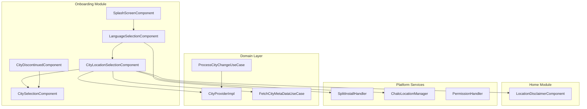

---

## Screen Inventory

| Screen | Component | Purpose | Entry From |
|--------|-----------|---------|------------|
| **Splash** | SplashScreenComponent | App initialization and routing | App launch |
| **Language Selection** | LanguageSelectionComponent | Language picker with download | Splash, Settings |
| **City Location Selection** | CityLocationSelectionComponent | GPS-based city detection | Splash, Login, Home |
| **City Selection** | CitySelectionComponent | Manual city search/selection | City Location, City Discontinued |
| **City Discontinued** | CityDiscontinuedComponent | Discontinued city notification | Splash |
| **Location Disclaimer** | LocationDisclaimerComponent | Permission education | City Location |

---

## Splash Screen

**Purpose:** Entry point for the app; orchestrates initialization and determines the appropriate navigation path based on user state.

### User Journey

1. App launches and splash screen displays
2. Background initialization tasks execute
3. System checks user state (language, login, consent, city)
4. Navigates to appropriate screen based on state

### Initialization Tasks

| Task | Description | Order |
|------|-------------|-------|
| **Config cache check** | Verify Chalo config availability | 1 |
| **User properties init** | Device ID, notification status, migration flags | 2 |
| **Analytics setup** | Initialize analytics with user properties | 3 |
| **App open event** | Fire analytics event | 4 |
| **Activation sync** | Send unsynced activation timestamps | 5 |
| **Update app open time** | Record last app open | 6 |

### Navigation Decision Flow

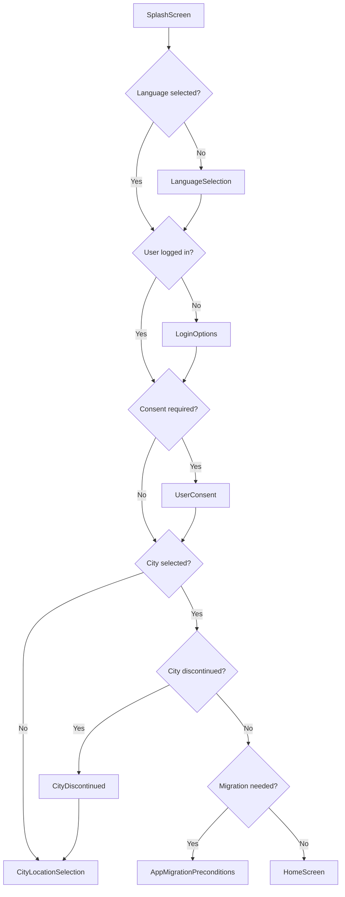

### State Flow

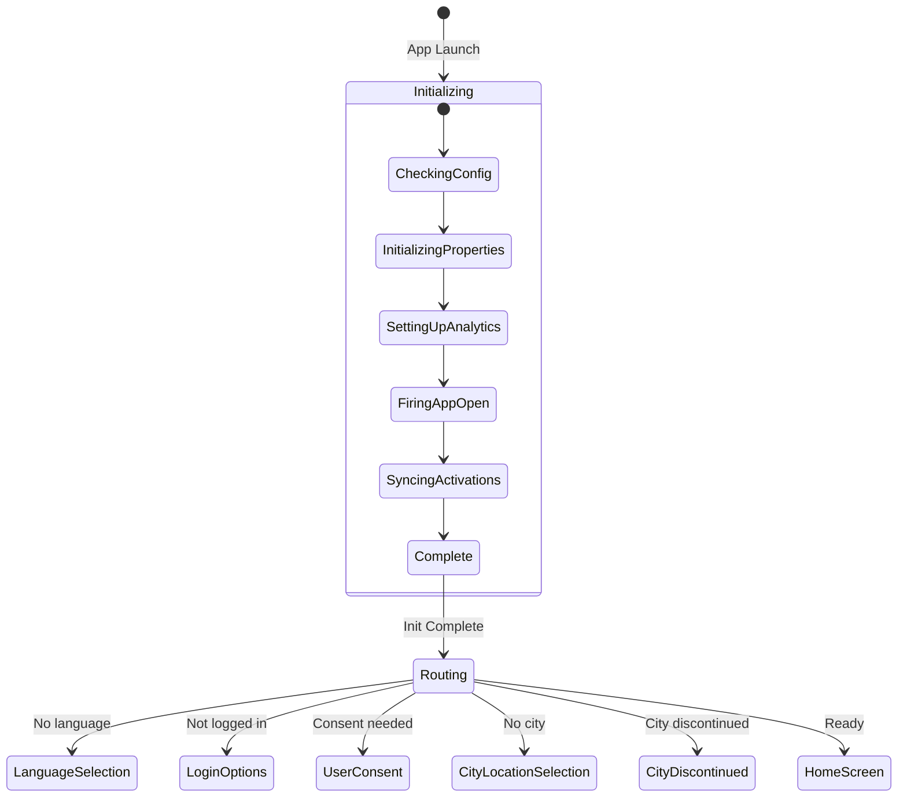

---

## Language Selection Screen

**Purpose:** Displays available languages in a grid layout with support for dynamic language pack download on Android.

### User Journey

1. User sees language grid with available options
2. Currently selected language is highlighted
3. User taps a language to preview selection
4. Continue button triggers language installation (Android) or locale update
5. On success, navigates to next onboarding step or home

### Screen Layout

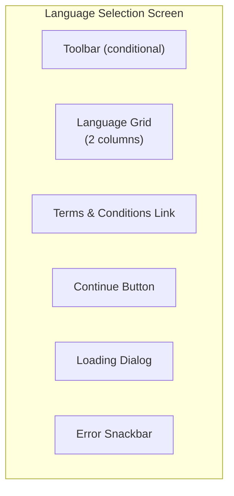

### Language Grid

| Item | Content | Interaction |
|------|---------|-------------|
| **Language Card** | Language name + native script | Tap to select |
| **Selection Indicator** | Checkmark on selected | Visual only |
| **Grid Layout** | 2-column responsive grid | Scrollable |

### State Flow

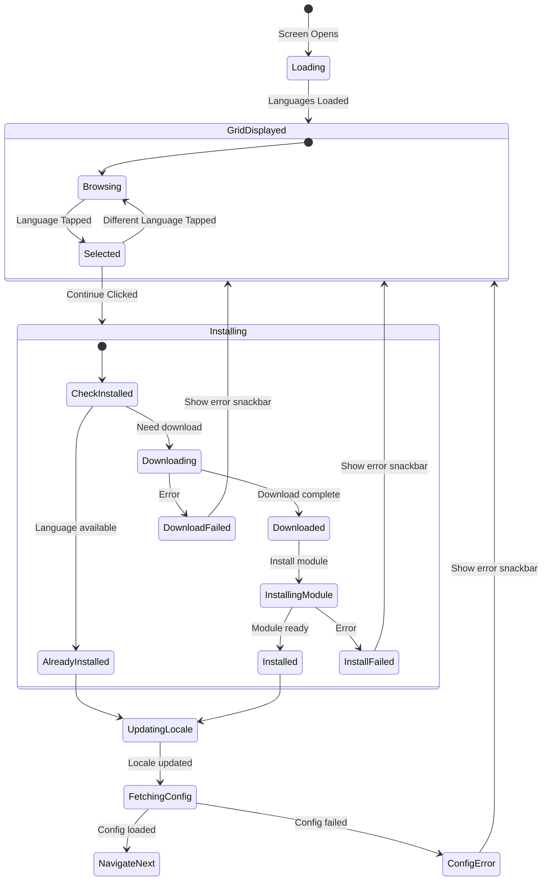

### Split Install States (Android)

| State | UI Response |
|-------|-------------|
| **Pending** | Show loading dialog |
| **Downloading** | Show loading dialog with progress |
| **Downloaded** | Continue installation |
| **Installing** | Show loading dialog |
| **Installed** | Proceed to locale update |
| **Failed** | Show error snackbar, keep current language |
| **Canceled** | Return to grid |
| **RequiresUserConfirmation** | Show confirmation dialog |

### Snackbar Types

| Type | Message | Action |
|------|---------|--------|
| **LanguageDownloadFailed** | "Language download failed" | Retry |
| **ChaloConfigFetchFailed** | "Configuration update failed" | Retry |

---

## City Location Selection Screen

**Purpose:** Primary city selection screen that uses GPS to detect user's city or allows manual selection via universal search.

### User Journey

1. Screen checks if city is pre-saved (from previous session)
2. If no saved city, requests location permission
3. On permission granted, activates GPS and fetches location
4. Location matched to city via geolocation service
5. City metadata fetched and cached
6. Welcome screen displayed (minimum 2 seconds)
7. Navigate to home

### Screen Layout Types

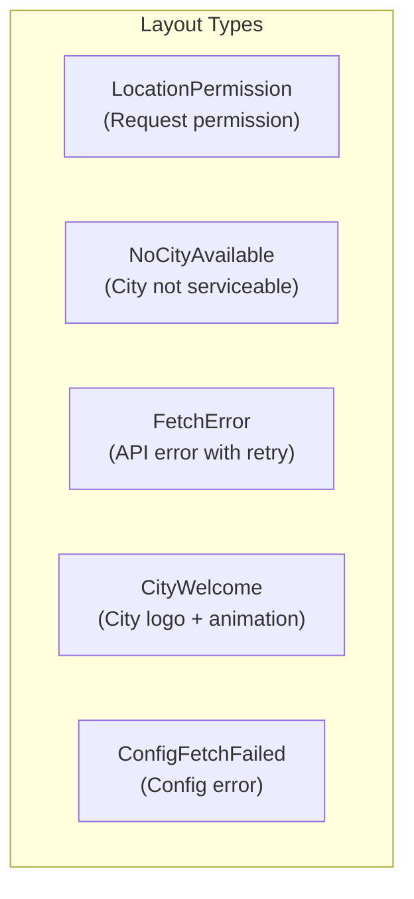

### State Flow

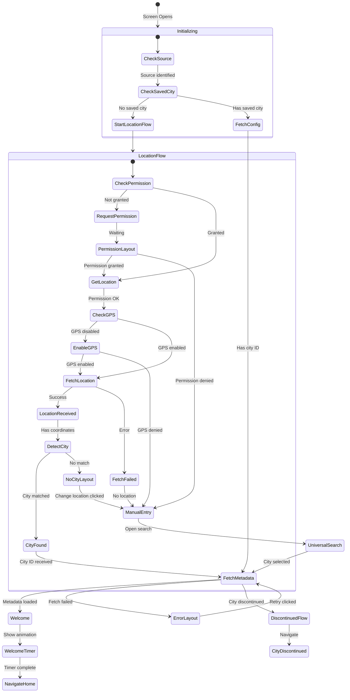

### Source Types

| Source | Context | Behavior |
|--------|---------|----------|
| **SplashScreen** | First launch flow | Full location flow |
| **LoginScreen** | Post-login city selection | Full location flow |
| **HomeScreen** | City change from home | Skip permission if granted |
| **RegularBusScreen** | City change from booking | Skip permission if granted |
| **CityDiscontinuedScreen** | City no longer available | Full location flow |
| **OldCitySelectionScreen** | Legacy migration | Full location flow |

### GPS Request Flow

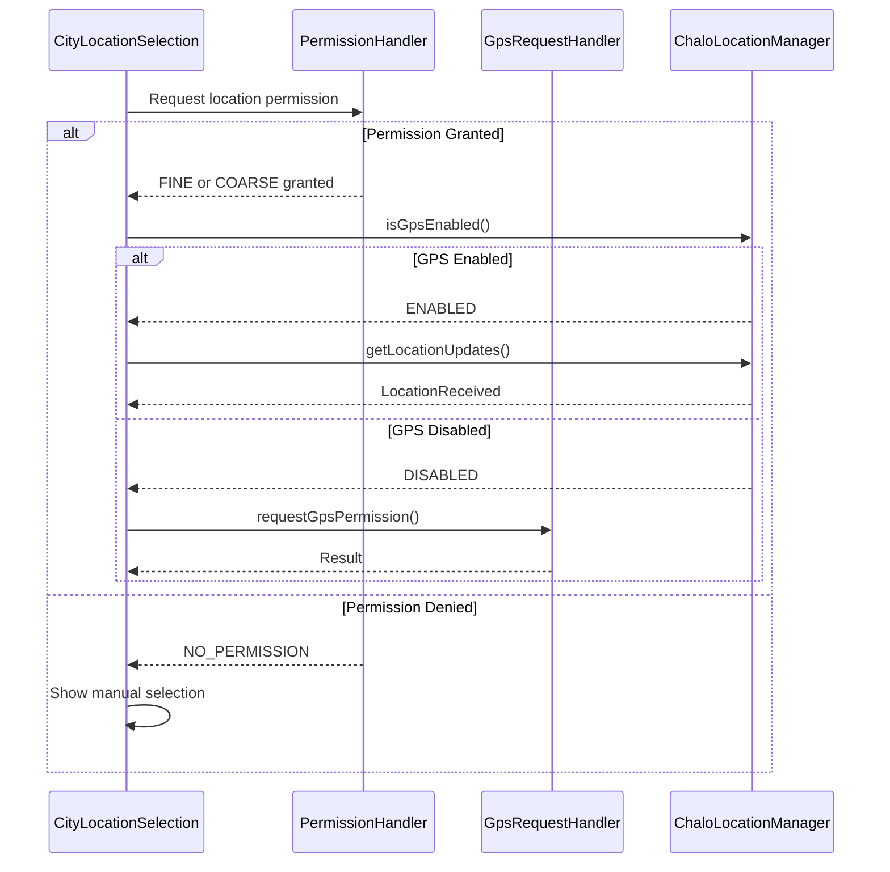

### Welcome Screen Configuration

| Element | Content |
|---------|---------|
| **City Logo** | City-specific logo image |
| **Animation** | Lottie animation (city theme) |
| **Display Duration** | Minimum 2 seconds |
| **City Name** | Large display text |
| **Description** | City tagline or info |

---

## City Selection Screen (Manual)

**Purpose:** Displays searchable list of all available cities when GPS detection fails or user chooses manual selection.

### User Journey

1. Screen loads list of available cities
2. User can tap search to filter by city name
3. Cities sorted: Live cities first, then Beta, Discontinued excluded
4. User taps a city to select it
5. City metadata fetched and selection confirmed
6. Navigate back to city location flow or home

### Screen Layout

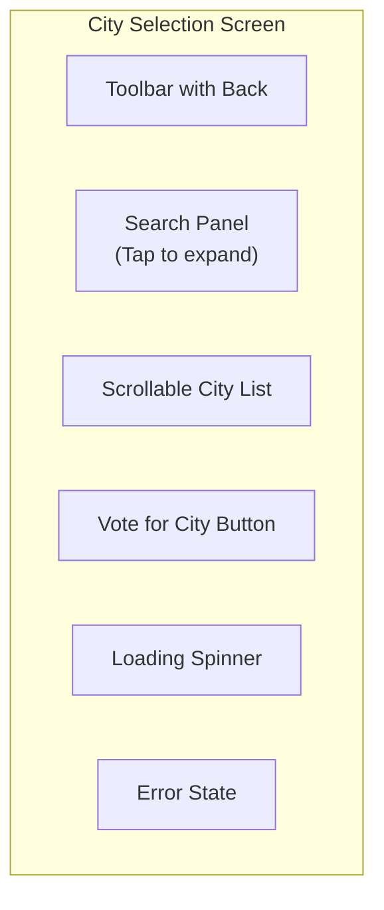

### State Flow

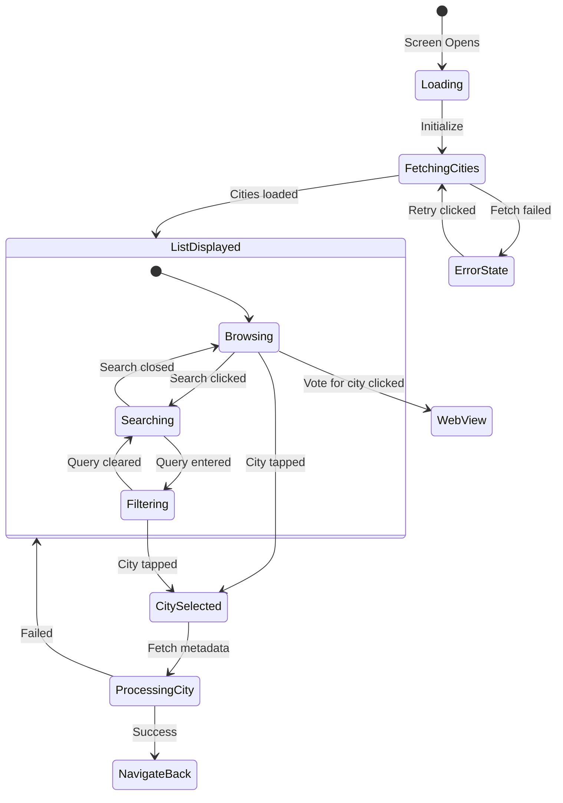

### City Sorting Order

| Priority | City Type | Display |
|----------|-----------|---------|
| 1 | **Live Cities** | Normal display |
| 2 | **Beta Cities** | Beta badge |
| Hidden | **Coming Soon** | Not shown |
| Hidden | **Discontinued** | Not shown |

### Search Behavior

| Feature | Implementation |
|---------|----------------|
| **Debounce** | 300ms delay before filtering |
| **State Retention** | Query preserved on configuration change |
| **Empty State** | "No cities found" message |
| **Clear** | X button to clear query |

---

## City Discontinued Screen

**Purpose:** Informs user that their previously selected city is no longer serviceable and prompts them to select a new city.

### User Journey

1. User had a city selected previously
2. City configuration indicates discontinued
3. Screen shows explanation message
4. User can view supported cities list
5. Navigate to city selection

### Screen Layout

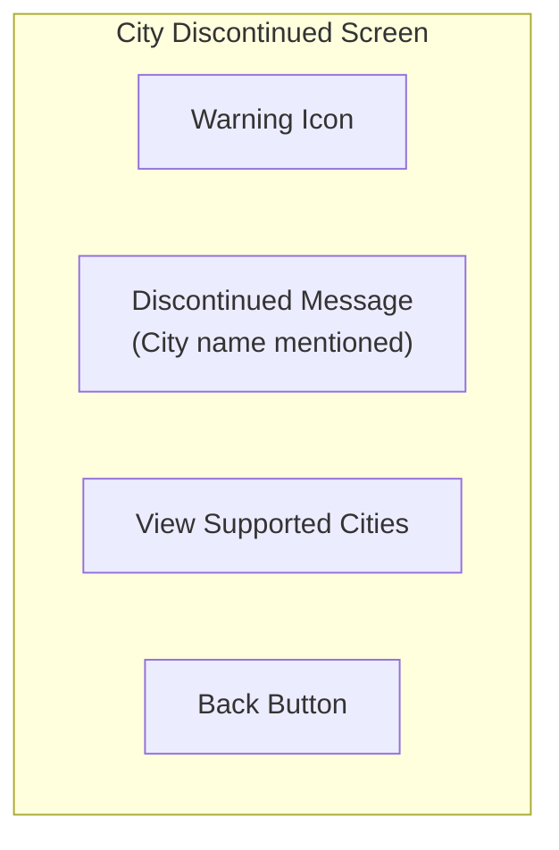

### State

| State Field | Description |
|-------------|-------------|
| **selectedCity** | Name of discontinued city |

### Navigation

| Action | Destination |
|--------|-------------|
| **View Supported Cities** | CitySelectionScreen |
| **Back Pressed** | CitySelectionScreen |

---

## Location Disclaimer Screen

**Purpose:** Educational screen showing step-by-step instructions for enabling location permission and GPS.

### User Journey

1. User denied location permission or GPS is disabled
2. Screen shows animated instructions
3. Steps explain how to enable location in settings
4. User can tap to open settings
5. On return, permission/GPS status checked
6. If enabled, proceed with location flow

### Screen Layout

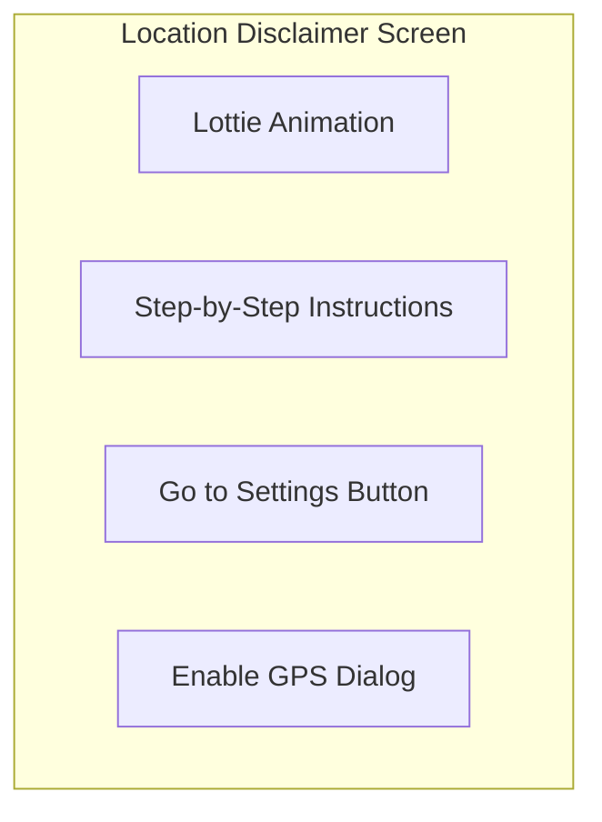

### State Flow

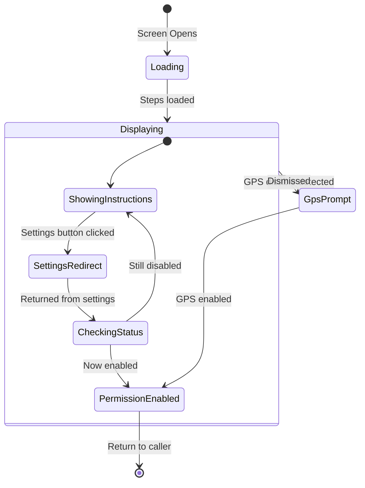

### Instruction Steps

| Step | Android | iOS |
|------|---------|-----|
| 1 | Open Settings | Open Settings |
| 2 | Tap Permissions | Tap Location |
| 3 | Select Location | Choose "While Using" |
| 4 | Allow "While using app" | — |

---

## State Management

All screens follow the MVI pattern with DataState to ViewState transformation.

### Language Selection State

| State Field | Description |
|-------------|-------------|
| **showLoadingDialogue** | Installation in progress |
| **snackBarType** | Current error snackbar type |
| **showTncText** | Show terms link |
| **showToolbar** | Show navigation toolbar |
| **sourceType** | Splash or Home |
| **localeList** | Available languages |
| **currentLanguageSelected** | Preview selection |

### City Location Selection State

| State Field | Description |
|-------------|-------------|
| **showLoadingDialog** | Operation in progress |
| **source** | Entry source type |
| **layoutType** | Current layout variant |
| **selectedCityId** | Selected city ID |
| **selectedCityName** | City display name |
| **selectedCityDescription** | City description |
| **welcomeScreenConfig** | Welcome screen customization |
| **showLocationSettingsDialog** | GPS settings dialog visible |

### City Selection State

| State Field | Description |
|-------------|-------------|
| **cities** | Full city list |
| **filteredCities** | Search-filtered list |
| **searchQuery** | Current search text |
| **showLoadingSpinner** | Loading indicator |
| **shouldShowSearchPanel** | Search panel expanded |
| **shouldShowError** | Error state |
| **currentlySelectedCityId** | Previously selected city |

### Intent Types

| Screen | Key Intents |
|--------|-------------|
| **Splash** | Initialization, ProceedToApp |
| **Language** | InitializationIntent, LanguageSelected, ContinueClicked, SnackbarRetryClicked |
| **City Location** | InitializationIntent, OnLocationPermissionGranted, OnEnterManuallyClicked, RetryCityFetch, UniversalSearchResultReceived |
| **City Selection** | InitialisationIntent, SearchQueryEnteredIntent, CityClickedIntent, VoteForCityClickedIntent |
| **City Discontinued** | InitializationIntent, OnSupportedCitiesButtonClicked |

---

## Navigation

### Entry Points

| Source | Destination | Args |
|--------|-------------|------|
| App Launch | Splash | — |
| Settings | Language Selection | LanguageSelectionSourceType.HOME_SCREEN |
| Home Header | City Location Selection | CityLocationSelectionSource.HomeScreen |

### Screen Transitions

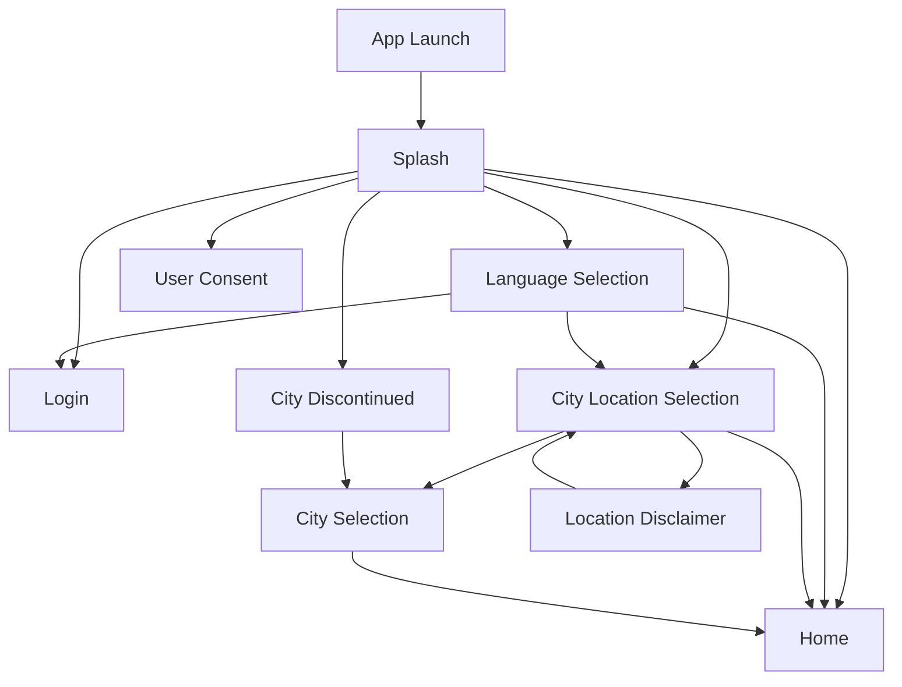

---

## Analytics Events

### Splash Events

| Event | Trigger |
|-------|---------|
| `splash_screen_shown` | Screen displayed |
| `app_open` | App launch recorded |

### Language Selection Events

| Event | Properties | Trigger |
|-------|------------|---------|
| `language_selection_screen_shown` | source | Screen displayed |
| `language_selected` | locale, previous_locale | Language tapped |
| `language_continue_clicked` | locale | Continue button tapped |
| `language_download_started` | locale | Download begins |
| `language_download_completed` | locale | Download succeeds |
| `language_download_failed` | locale, error | Download fails |

### City Selection Events

| Event | Properties | Trigger |
|-------|------------|---------|
| `city_location_selection_screen_shown` | source | Screen displayed |
| `location_permission_requested` | — | Permission dialog shown |
| `location_permission_granted` | permission_type | Permission granted |
| `location_permission_denied` | — | Permission denied |
| `city_detected_from_gps` | city_id, city_name | GPS detection success |
| `city_selected_manually` | city_id, city_name | Manual selection |
| `city_not_serviceable` | latitude, longitude | Location outside service area |

---

## Platform Differences

### Android-Specific

| Feature | Implementation |
|---------|----------------|
| **Split Install** | Google Play Core for language modules |
| **Location Permission** | ACCESS_FINE_LOCATION, ACCESS_COARSE_LOCATION |
| **GPS Settings** | LocationSettingsRequest with resolution |
| **Language Packs** | Dynamic download via SplitInstallManager |

### iOS-Specific

| Feature | Implementation |
|---------|----------------|
| **Language Packs** | All languages bundled in app |
| **Location Permission** | NSLocationWhenInUseUsageDescription |
| **GPS Settings** | Direct to Settings app |
| **Locale** | NSLocale for configuration |

---

## Error Handling

| Scenario | UI Response |
|----------|-------------|
| **Language download failed** | Snackbar with retry action |
| **Config fetch failed** | Snackbar with retry action |
| **Location permission denied** | Show manual selection option |
| **GPS disabled** | Show enable GPS dialog |
| **City not serviceable** | Show "not available" layout |
| **City metadata fetch failed** | Error layout with retry |
| **City discontinued** | Navigate to discontinued screen |
| **Network failure** | Error layout with retry |
