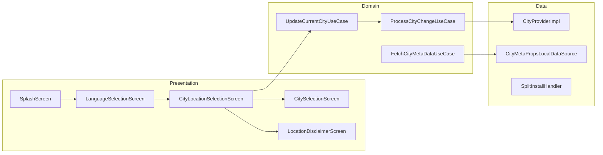

# Onboarding — High-Level Design

## Overview

The Onboarding feature manages the initial app setup flow for new users. It guides users through language selection, city/location selection, and location permission setup. The feature uses GPS-based city detection with fallback to manual selection, and handles dynamic language pack installation on Android.

## User Journey

1. **Entry Points**:
   - First app launch (fresh install)
   - App launch after data clear
   - Forced city re-selection (city discontinued)

2. **Core Flow**:
   - Splash screen with initialization
   - Language selection (grid of available languages)
   - City selection via GPS or manual search
   - Location permission education (if needed)
   - Navigate to home screen

3. **Exit Points**:
   - Successful city selection → Home screen
   - Login required → Login screen (then back to onboarding)
   - City not serviceable → Manual city selection

## Architecture Diagram



## Key Components

| Component | Platform | File Path | Responsibility |
|-----------|----------|-----------|----------------|
| `SplashScreenComponent` | Shared | `shared/onboarding/.../splash/SplashScreenComponent.kt` | App initialization orchestration |
| `LanguageSelectionComponent` | Shared | `shared/onboarding/.../languageselection/LanguageSelectionComponent.kt` | Language picker with download |
| `CityLocationSelectionComponent` | Shared | `shared/onboarding/.../citylocationselection/ui/CityLocationSelectionComponent.kt` | GPS-based city detection |
| `CitySelectionComponent` | Shared | `shared/onboarding/.../cityselection/ui/CitySelectionComponent.kt` | Manual city search/selection |
| `LocationDisclaimerComponent` | Shared | `shared/home/.../locationdisclaimer/LocationDisclaimerComponent.kt` | Permission education screen |
| `UpdateCurrentCityUseCase` | Shared | `shared/onboarding/.../cityprovider/UpdateCurrentCityUseCase.kt` | City update orchestration |
| `CityProviderImpl` | Shared | `shared/onboarding/.../cityprovider/CityProviderImpl.kt` | City state management |

## Data Flow

### Splash Screen Initialization
1. `SplashScreenComponent` initializes
2. Checks language selection state
3. Checks authentication state
4. Checks city selection state
5. Routes to appropriate screen

### Language Selection
1. `LanguageSelectionComponent` displays language grid
2. User selects language
3. Android: `SplitInstallHandler` downloads language pack
4. Locale updated on device
5. Configuration refreshed with new language
6. Navigate to city selection or login

### GPS-Based City Selection
1. Request location permission
2. If denied → Show manual selection
3. If granted → Activate GPS
4. Fetch user coordinates
5. `FetchCityMetaDataUseCase` matches location to city
6. If city found → Show city welcome screen
7. If not found → Show "city not serviceable" state
8. `ProcessCityChangeUseCase` updates city state

### Manual City Selection
1. User opens universal search
2. Search for city by name
3. Select city from results
4. `FetchCityMetaDataUseCase` fetches city metadata
5. Show city welcome screen
6. Proceed to home

## Platform Differences

### Android-Specific
- **Split Install**: Dynamic language pack download via Google Play's `SplitInstallManager`
- **Language Installation**: `AndroidSplitInstallHandler` manages download states
- **Permissions**: `ACCESS_FINE_LOCATION` and `ACCESS_COARSE_LOCATION`

### iOS-Specific
- **No Split Install**: All languages bundled in app
- **Locale**: Uses `NSLocale` for language configuration
- **Permissions**: `NSLocationWhenInUseUsageDescription`

## Integration Points

### Analytics Events
- `splash_screen_shown`
- `language_selection_screen_shown`
- `language_selected`
- `city_location_selection_screen_shown`
- `location_permission_requested` / `granted` / `denied`
- `city_detected_from_gps`
- `city_selected_manually`
- `city_not_serviceable`

### Shared Services
- **Location**: `ChaloLocationManager` for GPS coordinates
- **Remote Config**: City configuration from Firebase
- **DataStore**: City metadata caching

### Navigation
- **Navigates to**: Login screen, Home screen, Location settings
- **Navigated from**: App launch

## Edge Cases & Error Handling

| Scenario | Handling |
|----------|----------|
| Language download failed | Shows retry snackbar |
| GPS disabled | Prompts to enable GPS or select manually |
| Location permission denied | Shows manual city selection |
| City not serviceable | Shows "not available" screen with manual option |
| City metadata fetch failed | Shows retry option |
| Configuration fetch failed | Uses cached data or shows error |
| City discontinued | Redirects to city selection |

## City Change Operations

When a city is changed, `ProcessCityChangeUseCase` executes:

1. **BASE_URL_UPDATE** — Updates API base URL for city
2. **CLEAR_PRODUCTS_DATA** — Clears local product cache
3. **SETUP_ANALYTICS** — Refreshes analytics with city context
4. **SETUP_CRASHLYTICS_PROPERTIES** — Updates crash reporting

## Data Models

### CityLocationSelectionLayoutType
```kotlin
sealed class CityLocationSelectionLayoutType {
    object LocationPermission
    object NoCityAvailable
    object FetchError
    data class CityWelcome(val city: CityAppModel)
    object ConfigFetchFailed
}
```

### CityLocationSelectionSource
```kotlin
enum class CityLocationSelectionSource {
    LoginScreen,
    HomeScreen,
    SplashScreen,
    RegularBusScreen,
    CityDiscontinuedScreen,
    OldCitySelectionScreen
}
```

### LanguageSelectionSnackbarType
```kotlin
sealed class LanguageSelectionSnackbarType {
    object None
    object LanguageDownloadFailed
    object ChaloConfigFetchFailed
}
```

## Navigation Decision Tree

```
SplashScreen
├── Language Not Selected → LanguageSelection
│   └── After Selection
│       ├── Not Logged In → LoginOptions
│       ├── No City → CityLocationSelection
│       └── Ready → HomeScreen
├── Not Logged In → LoginOptions
├── No City → CityLocationSelection
│   ├── GPS Success → CityWelcome → HomeScreen
│   ├── GPS Failed → ManualSelection
│   └── Manual → CitySelection → HomeScreen
├── City Discontinued → CityDiscontinued → CityLocationSelection
└── Ready → HomeScreen
```

## Dependencies

### Internal
- `shared:chalo-base` — Location manager, DataStore
- `shared:home` — Location disclaimer component
- `shared:network` — City API calls

### External
- Google Play Core (Android) — Split APK delivery
- DataStore — Local preferences
- Location Services — GPS coordinates
