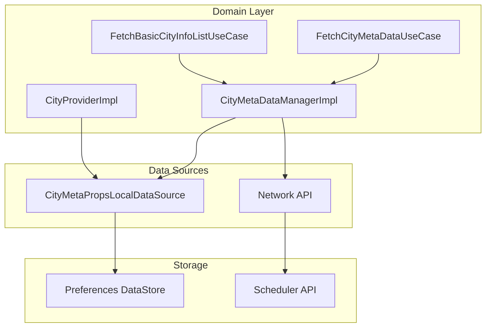
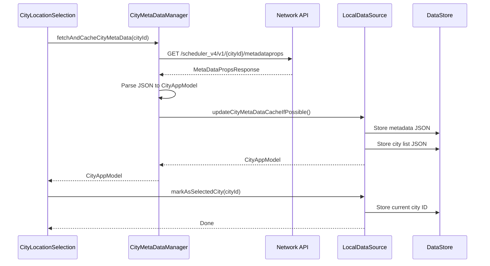
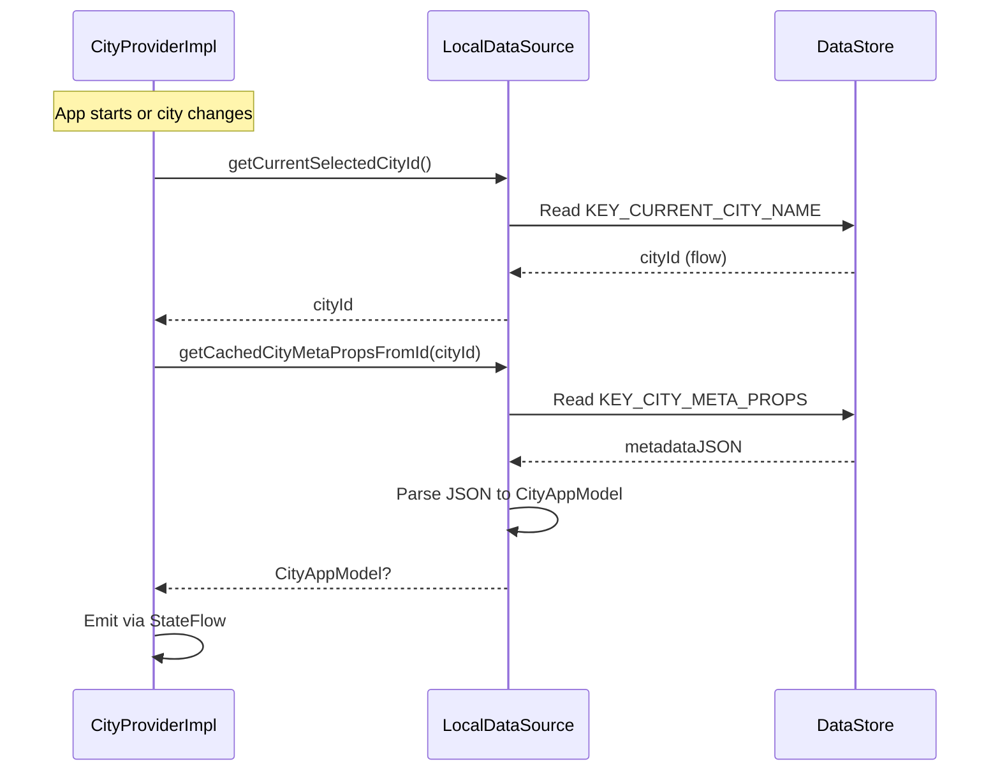
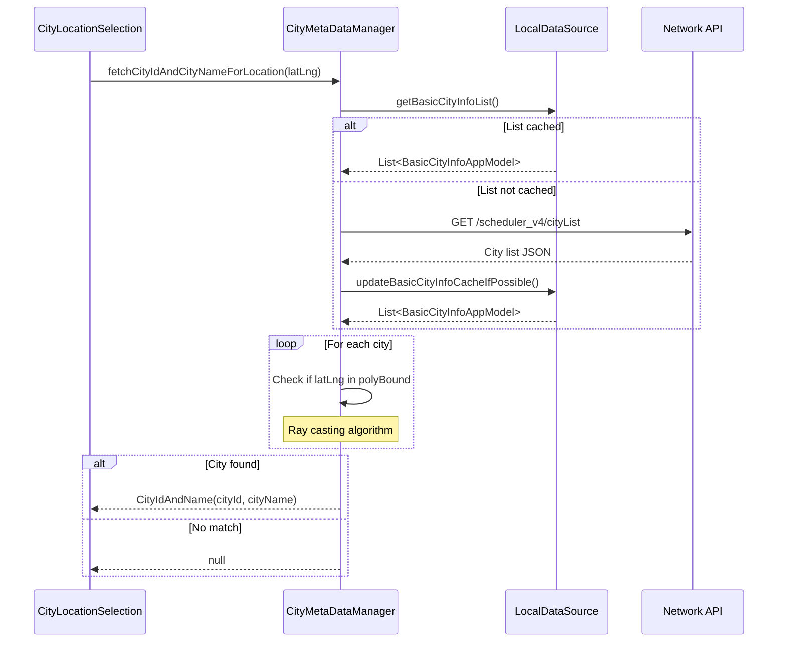
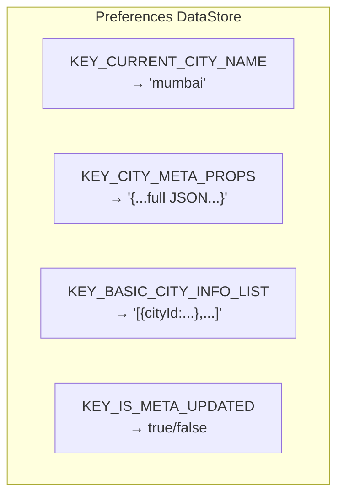
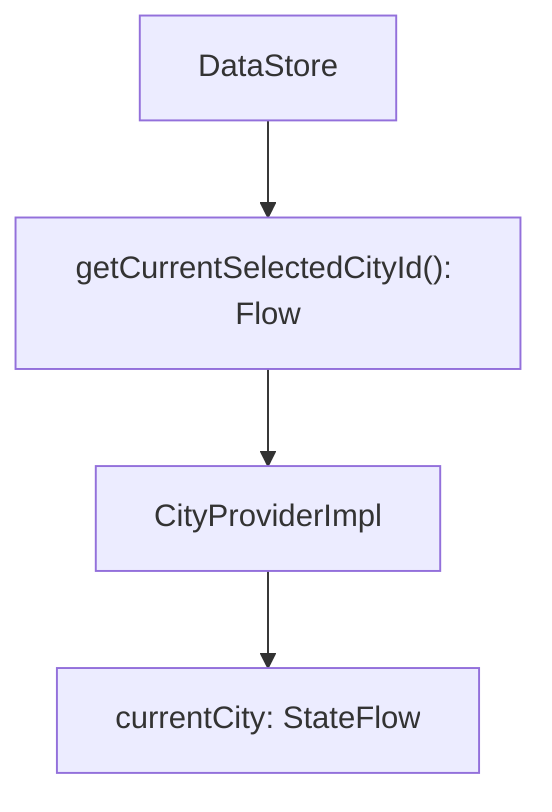
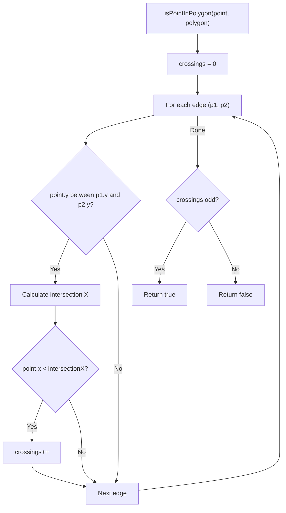
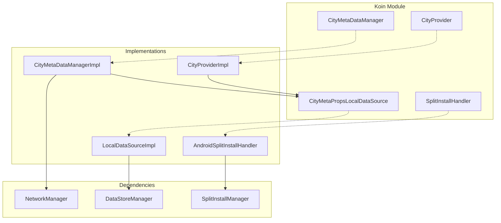

# Onboarding — Repository Documentation

## Data Layer Overview

The data layer handles city metadata storage, language preferences, and location-based city detection. It follows the **Repository Pattern** with DataStore for local persistence and HTTP endpoints for city data.



---

## Repository Operations

| Operation | Description | Data Flow |
|-----------|-------------|-----------|
| **getCurrentSelectedCityId** | Get stored city ID | Local → Return |
| **markAsSelectedCity** | Save city as current | Transform → Local |
| **updateCityMetaDataCacheIfPossible** | Parse and cache city metadata | Transform → Local |
| **updateBasicCityInfoCacheIfPossible** | Parse and cache city list | Transform → Local |
| **getCachedCityMetaPropsFromId** | Retrieve cached city | Local → Transform → Return |
| **getBasicCityInfoList** | Retrieve cached city list | Local → Transform → Return |
| **markCityMetaPropsUpdated** | Set metadata updated flag | Local |
| **isMetaUpdated** | Check if metadata current | Local → Return |

---

## API Endpoints

### Fetch City Metadata

Retrieves complete metadata for a specific city.

| Property | Value |
|----------|-------|
| **Endpoint** | `scheduler_v4/v1/{cityId}/metadataprops` |
| **Method** | GET |
| **Auth** | Not required |
| **Base URL** | MetaPropsUrl from ChaloUrlProvider |

**Query Parameters:**

| Param | Type | Required | Description |
|-------|------|----------|-------------|
| **appVer** | Int | Yes | App version code |
| **meta** | String (JSON) | Yes | User properties JSON |

**Meta Properties JSON:**

| Field | Type | Description |
|-------|------|-------------|
| **userId** | String | User identifier (or empty) |
| **city** | String | Current city ID |
| **model** | String | Device model |
| **osVersion** | String | OS version |
| **language** | String | Current language code |
| **platform** | String | "android" or "ios" |

**Response:**

| Field | Type | Description |
|-------|------|-------------|
| **cityName** | String | City identifier |
| **cityDisplayName** | String | User-facing name |
| **bound** | Object | Geographic bounds |
| **cityCentre** | Object | Center coordinates |
| **stationType** | List<String> | Transit modes |
| **lineMaps** | List<Object> | Map resources |
| **busMapsUrl** | String? | Bus map URL |
| **isBetaCity** | Boolean | Beta flag |
| **isComingSoonCity** | Boolean | Coming soon flag |
| **isCityDiscontinued** | Boolean | Discontinued flag |
| **timezoneId** | String | Timezone identifier |
| **countryId** | String | Country ID |
| **countryName** | String | Country name |
| **countryCallingCode** | String | Phone code |
| **phoneNumberPossibleLengths** | List<Int> | Valid phone lengths |
| **currency** | String | Currency code |
| **currencySymbol** | String | Currency symbol |
| **currencyFactor** | Long | Currency multiplier |
| **chaloBaseDomain** | String | City-specific API domain |
| **modesMap** | List<Object> | Agencies per mode |
| **polyBound** | List<List<Double>> | Service area polygon |
| **minAppVersionForLogin** | Int | Required app version |

**Bound Object:**

| Field | Type | Description |
|-------|------|-------------|
| **southWestLat** | Double | SW latitude |
| **southWestLng** | Double | SW longitude |
| **northEastLat** | Double | NE latitude |
| **northEastLng** | Double | NE longitude |

**City Centre Object:**

| Field | Type | Description |
|-------|------|-------------|
| **lat** | Double | Center latitude |
| **lng** | Double | Center longitude |

**Line Map Object:**

| Field | Type | Description |
|-------|------|-------------|
| **name** | String | Map name |
| **url** | String | Map URL |

**Mode Map Object:**

| Field | Type | Description |
|-------|------|-------------|
| **mode** | String | Transit mode |
| **agencies** | List<Object> | Agencies for mode |

---

### Fetch City List

Retrieves lightweight list of all cities.

| Property | Value |
|----------|-------|
| **Endpoint** | `scheduler_v4/cityList` |
| **Method** | GET |
| **Auth** | Not required |
| **Base URL** | MetaPropsUrl from ChaloUrlProvider |

**Response:**

| Field | Type | Description |
|-------|------|-------------|
| **data** | List<Object> | City list |

**City Object:**

| Field | Type | Description |
|-------|------|-------------|
| **cityId** | String | City identifier |
| **cityDisplayName** | String | User-facing name |
| **isBetaMode** | Boolean? | Beta flag |
| **isComingSoon** | Boolean? | Coming soon flag |
| **isDisabled** | Boolean? | Disabled flag |
| **polyBound** | List<List<Double>>? | Service area polygon |

---

## Data Flow

### City Selection Flow



### City Resolution Flow



### Location-Based Detection Flow



---

## Data Transformations

### API Response to App Model

**City Metadata:**

| API Field | App Field | Transformation |
|-----------|-----------|----------------|
| cityName | name | Direct |
| cityDisplayName | displayName | Direct |
| bound.* | bounds | Convert to LatLngBounds |
| cityCentre.* | cityCenter | Convert to LatLng |
| stationType | modes | Map via ChaloTransitMode.fromString() |
| lineMaps | lineMaps | Map to LineMap objects |
| busMapsUrl | busMapUrl | Direct |
| modesMap | modeAndAgencyList | Complex mapping with agencies |
| isBetaCity | isBetaCity | Direct |
| isComingSoonCity | isComingSoonCity | Direct |
| isCityDiscontinued | isCityDiscontinued | Direct |
| timezoneId | timezoneId | Direct |
| countryId, countryName, countryCallingCode | countryInfo | Group into CountryInfo |
| currency, currencySymbol, currencyFactor | currencyInfo | Group into CurrencyInfo |
| polyBound | polyBounds | Convert to List<LatLng> |
| minAppVersionForLogin | minAppVersionForLogin | Direct |

**LatLngBounds Conversion:**

| API Fields | App Field | Formula |
|------------|-----------|---------|
| southWestLat, southWestLng | southwest | LatLng(lat, lng) |
| northEastLat, northEastLng | northeast | LatLng(lat, lng) |

**PolyBound Conversion:**

| API Format | App Format | Notes |
|------------|------------|-------|
| List<List<Double>> | List<LatLng> | [lat, lng] pairs |

### Basic City Info Mapping

| API Field | App Field | Transformation |
|-----------|-----------|----------------|
| cityId | cityId | Direct |
| cityDisplayName | cityName | Direct |
| isBetaMode | isBetaCity | Null coalesce to false |
| isComingSoon | isComingSoonCity | Null coalesce to false |
| isDisabled | isCityDiscontinued | Null coalesce to false |

---

## Local Storage

### Storage Mechanism

City data stored using Android DataStore (Preferences) wrapped by `CityMetaPropsLocalDataSource`.

### DataStore Keys

| Key | Type | Description |
|-----|------|-------------|
| **KEY_CURRENT_CITY_NAME** | String | Currently selected city ID |
| **KEY_CITY_META_PROPS** | String | Full metadata JSON |
| **KEY_BASIC_CITY_INFO_LIST** | String | City list JSON |
| **KEY_IS_META_UPDATED** | Boolean | Metadata freshness flag |

### Storage Schema



### Reactive Access

City ID is exposed as a Flow for reactive updates:



### Cache Strategy

| Data | Cache Duration | Invalidation |
|------|----------------|--------------|
| **City Metadata** | Until city change | New city selected |
| **City List** | App session | App restart or force refresh |
| **Selected City** | Persistent | User changes city |

---

## Language Storage

### Storage Keys

| Key | Type | Description |
|-----|------|-------------|
| **KEY_SELECTED_LANGUAGE** | String | Current language code |
| **KEY_IS_LANGUAGE_SELECTED** | Boolean | Selection completed flag |

### Split Install State (Android)

The `SplitInstallHandler` tracks installed language modules via Play Core API:

| Property | Type | Description |
|----------|------|-------------|
| **installedLanguages** | Set<String> | Currently installed module codes |

---

## Exception Handling

### Error Types

| Error | Cause | Response |
|-------|-------|----------|
| **CityNotServiceable** | City discontinued in response | Show discontinued screen |
| **CityIdNotAvailable** | Invalid city ID | Show error with search |
| **CityMetaDataFetchError** | Network or parse failure | Show retry option |
| **FetchBasicCityInfoListError** | City list fetch failed | Show retry option |

### Error Mapping Flow

```mermaid
flowchart TD
    Response["API Response"]
    Check1{HTTP 200?}
    Check2{Valid JSON?}
    Check3{Required fields?}
    Check4{City active?}
    Success["Return CityAppModel"]
    NetworkError["CityMetaDataFetchError"]
    ParseError["CityMetaDataFetchError"]
    ValidationError["CityIdNotAvailable"]
    DiscontinuedError["CityNotServiceable"]

    Response --> Check1
    Check1 -->|No| NetworkError
    Check1 -->|Yes| Check2
    Check2 -->|No| ParseError
    Check2 -->|Yes| Check3
    Check3 -->|No| ValidationError
    Check3 -->|Yes| Check4
    Check4 -->|No (discontinued)| DiscontinuedError
    Check4 -->|Yes| Success
```

---

## Polygon Bounds Check

### Ray Casting Algorithm

To determine if a GPS location is within a city's service area:



### Implementation Notes

| Aspect | Detail |
|--------|--------|
| **Algorithm** | Ray casting (point-in-polygon) |
| **Edge handling** | Horizontal rays from point |
| **Boundary points** | Considered inside |
| **Complex polygons** | Handles concave shapes |

---

## Dependency Injection

### Koin Bindings

| Interface/Class | Implementation | Scope |
|-----------------|----------------|-------|
| CityMetaPropsLocalDataSource | CityMetaPropsLocalDataSourceImpl | Factory |
| CityMetaDataManager | CityMetaDataManagerImpl | Singleton |
| CityProvider | CityProviderImpl | Singleton (createdAtStart) |
| SplitInstallHandler | AndroidSplitInstallHandler | Factory |
| LanguageFeature | LanguageFeatureImpl | Singleton |

### Dependency Graph



---

## Platform Implementations

### Android

| Component | Implementation |
|-----------|----------------|
| **DataStore** | Jetpack DataStore Preferences |
| **Split Install** | Google Play Core SplitInstallManager |
| **Network** | Ktor with OkHttp engine |

### iOS

| Component | Implementation |
|-----------|----------------|
| **DataStore** | NSUserDefaults |
| **Split Install** | No-op (all languages bundled) |
| **Network** | Ktor with Darwin engine |

### Split Install States (Android)

| State | Description | UI Response |
|-------|-------------|-------------|
| **PENDING** | Request queued | Show loading |
| **DOWNLOADING** | Download in progress | Show progress |
| **DOWNLOADED** | Download complete | Continue install |
| **INSTALLING** | Installing module | Show loading |
| **INSTALLED** | Module ready | Update locale |
| **FAILED** | Installation failed | Show error |
| **CANCELED** | User cancelled | Return to selection |
| **REQUIRES_USER_CONFIRMATION** | Large download needs approval | Show dialog |

---

## Security

### Data Protection

| Data | Protection |
|------|------------|
| **City Metadata** | Plain text (non-sensitive) |
| **City List** | Plain text (non-sensitive) |
| **Selected City** | Plain text (non-sensitive) |
| **Language Preference** | Plain text (non-sensitive) |

### API Security

| Aspect | Implementation |
|--------|----------------|
| **Transport** | HTTPS only |
| **Authentication** | Not required for city data |
| **Rate Limiting** | Server-side |

---

## Error Handling Summary

| Scenario | Exception | User Impact |
|----------|-----------|-------------|
| Network failure | CityMetaDataFetchError | Show retry option |
| Invalid JSON | CityMetaDataFetchError | Show retry option |
| City discontinued | CityNotServiceable | Show discontinued screen |
| Invalid city ID | CityIdNotAvailable | Show search option |
| Split install failure | SplitInstallException | Show error, keep current |
| DataStore error | IOException | Retry or default |
