# Onboarding — UseCase Documentation

## Domain Layer Overview

The domain layer orchestrates city selection, language configuration, and location-based city detection. Use cases coordinate repository operations, manage city state transitions, and handle post-city-change side effects.

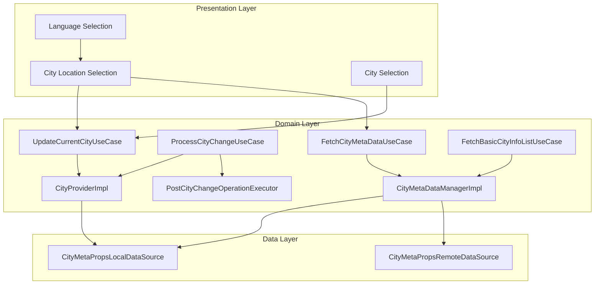

---

## Use Case Inventory

| Use Case | Purpose | Called From |
|----------|---------|-------------|
| **UpdateCurrentCity** | Mark city as selected in local storage | City Location, City Selection |
| **ProcessCityChange** | Execute post-city-change operations | After city selection |
| **FetchCityMetaData** | Fetch full city metadata from server | City Location, City Selection |
| **FetchBasicCityInfoList** | Fetch lightweight city list | City Selection |
| **GetLocationDisclaimerStepsAndLottieType** | Get location education content | Location Disclaimer |

---

## Update Current City

**Responsibility:** Marks a city as the currently selected city in local storage, triggering the city provider to emit the new city.

### Update Flow

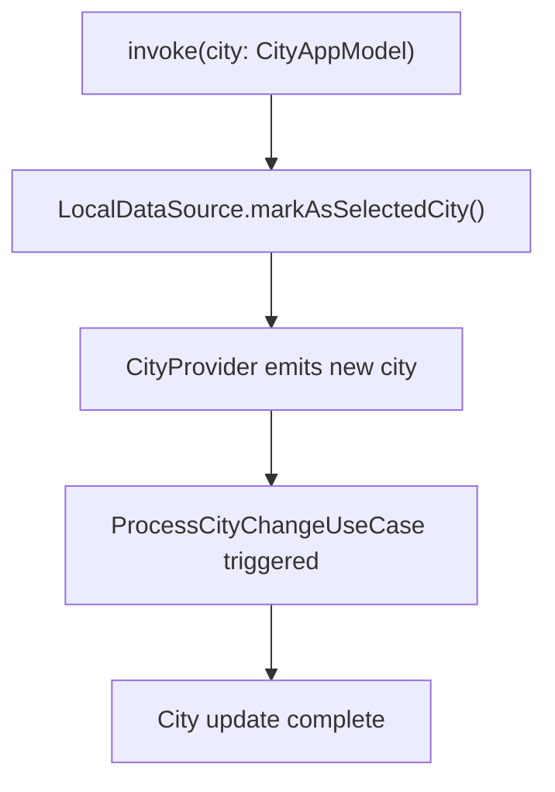

### Input Parameters

| Parameter | Type | Required | Description |
|-----------|------|----------|-------------|
| **city** | CityAppModel | Yes | City to set as current |

### City Provider Reaction

When a city is marked as selected, the CityProvider:
1. Reads the new city ID from DataStore flow
2. Retrieves cached CityAppModel for that ID
3. Emits the new city via StateFlow
4. ProcessCityChangeUseCase observes the change

---

## Process City Change

**Responsibility:** Orchestrates all side effects that must occur when the user's city changes, including API base URL updates, cache clearing, and analytics setup.

### Process Flow

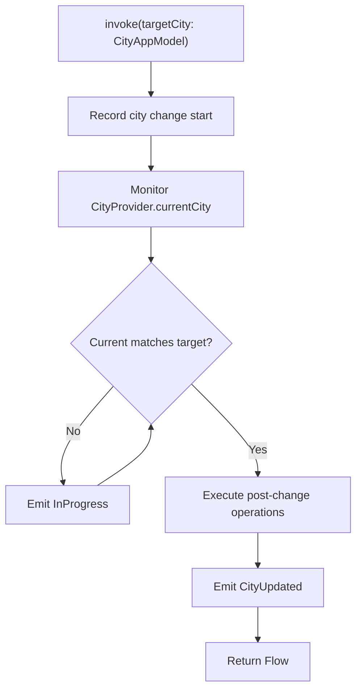

### Output Types

| Result | Meaning | Contains |
|--------|---------|----------|
| **InProgress** | City change in progress | — |
| **CityUpdated** | City successfully changed | CityAppModel |

### Post-Change Operations

The `PostCityChangeOperationExecutor` runs these operations in sequence:

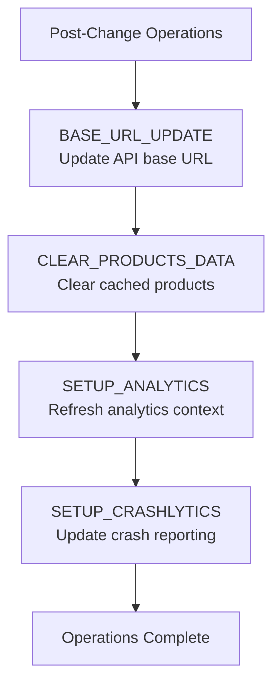

### Operation Details

| Operation | Purpose | Impact |
|-----------|---------|--------|
| **BASE_URL_UPDATE** | Switch API endpoints to city-specific domain | All future API calls use new domain |
| **CLEAR_PRODUCTS_DATA** | Remove cached tickets, passes, wallet data | User sees fresh product data |
| **SETUP_ANALYTICS** | Update analytics with city context | Events tagged with new city |
| **SETUP_CRASHLYTICS_PROPERTIES** | Update crash reporting metadata | Crashes include city info |

### City Change Tracking

The `CityChangeOperationTracker` records:

| Field | Description |
|-------|-------------|
| **startTime** | When city change initiated |
| **targetCityId** | City being changed to |
| **operationsCompleted** | List of completed operations |
| **endTime** | When all operations finished |

---

## Fetch City Meta Data

**Responsibility:** Fetches complete city metadata from server and caches it locally.

### Fetch Flow

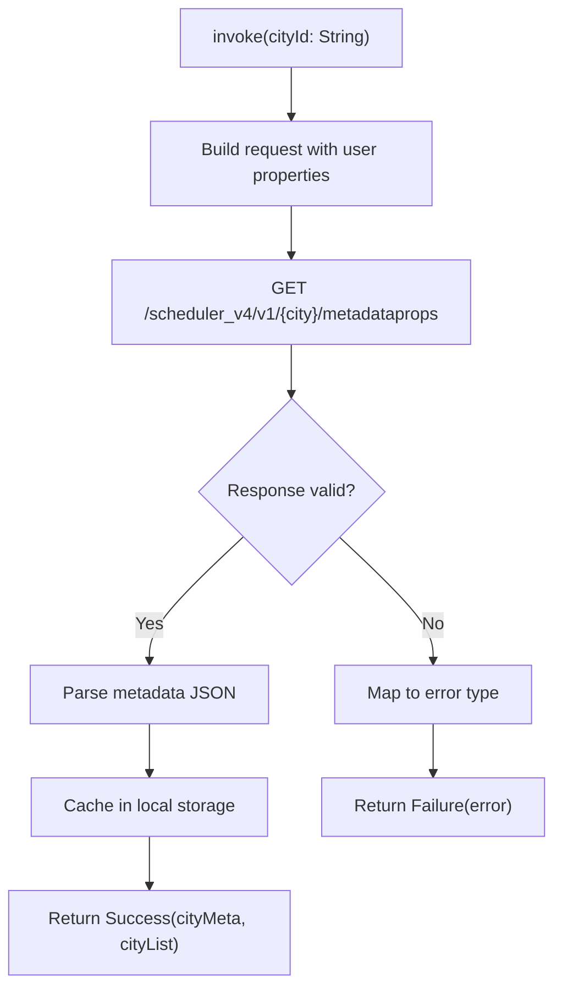

### Input Parameters

| Parameter | Type | Required | Description |
|-----------|------|----------|-------------|
| **cityId** | String | Yes | City identifier |

### Request Properties

The request includes user metadata:

| Property | Source | Purpose |
|----------|--------|---------|
| **appVer** | Build config | Version compatibility |
| **userId** | Session | User-specific config |
| **city** | Previous city | Migration context |
| **model** | Device info | Device-specific config |
| **osVersion** | System | OS compatibility |
| **language** | Settings | Localized content |
| **platform** | System | Android/iOS |

### Output Types

| Result | Meaning | Contains |
|--------|---------|----------|
| **Success** | Metadata fetched | (cityMetaJSON, cityListJSON) |
| **CityNotServiceable** | City no longer available | — |
| **CityIdNotAvailable** | Invalid city ID | — |
| **CityMetaDataFetchError** | Network or parse error | Error message |

### Error Mapping

```mermaid
flowchart TD
    Response["API Response"]
    Check1{Status 200?}
    Check2{Valid JSON?}
    Check3{City active?}
    Success["Return Success"]
    NotServiceable["CityNotServiceable"]
    ParseError["CityMetaDataFetchError"]
    NetworkError["CityMetaDataFetchError"]

    Response --> Check1
    Check1 -->|No| NetworkError
    Check1 -->|Yes| Check2
    Check2 -->|No| ParseError
    Check2 -->|Yes| Check3
    Check3 -->|Yes| Success
    Check3 -->|No (discontinued)| NotServiceable
```

---

## Fetch Basic City Info List

**Responsibility:** Fetches lightweight city list for city selection screen.

### Fetch Flow

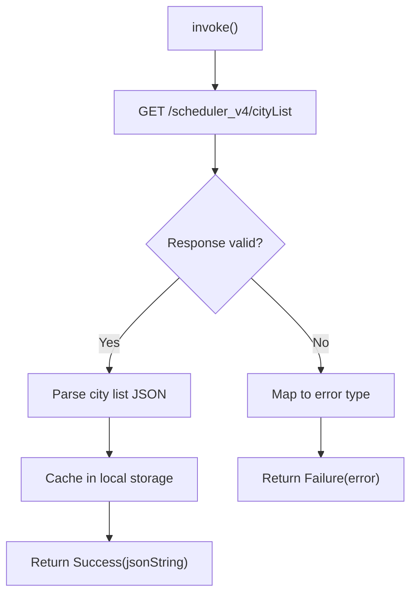

### Output Types

| Result | Meaning | Contains |
|--------|---------|----------|
| **Success** | List fetched | JSON string |
| **FetchBasicCityInfoListError** | Fetch failed | Error message |

---

## City Meta Data Manager

**Responsibility:** Coordinates fetching, caching, and location-based city detection. Acts as the primary interface for city data operations.

### Manager Operations

| Method | Purpose | Returns |
|--------|---------|---------|
| **fetchCityIdAndCityNameForLocation** | Find city from GPS coordinates | CityIdAndName or null |
| **fetchAndCacheCityMetaData** | Fetch and store city metadata | CityAppModel or error |
| **fetchAndCacheBasicCityInfoList** | Fetch and store city list | List or error |

### Location-Based City Detection

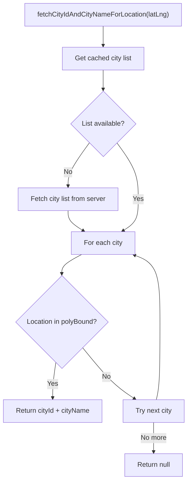

### Polygon Bounds Check

Cities have `polyBound` - a list of coordinates defining the city's service area:

| Check | Method |
|-------|--------|
| **Point in polygon** | Ray casting algorithm |
| **Boundary check** | Coordinate comparison |
| **Multiple polygons** | Check each until match |

---

## City Provider

**Responsibility:** Manages current city state as a reactive StateFlow, providing the single source of truth for the app's current city.

### Provider Interface

| Property/Method | Type | Description |
|-----------------|------|-------------|
| **currentCity** | StateFlow<CityAppModel?> | Current city stream |
| **getCityId()** | String? | Synchronous city ID access |
| **setCityChangePromptCurrentSession()** | Unit | Mark city change shown |

### State Flow

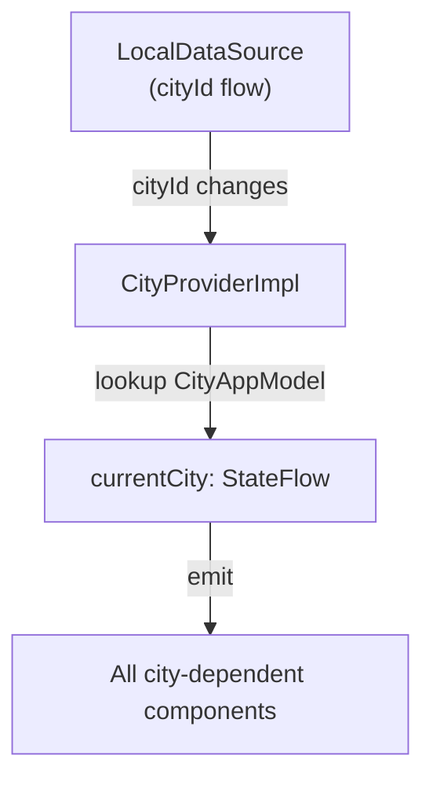

### City Resolution

When city ID changes in storage:
1. Provider observes the DataStore flow
2. Retrieves cached CityAppModel for ID
3. If found, emits the model
4. If not found, emits null (triggers re-fetch)

---

## Language Feature

**Responsibility:** Manages language selection state, available languages, and locale updates.

### Feature Interface

| Property/Method | Type | Description |
|-----------------|------|-------------|
| **currentLanguage** | StateFlow<Language> | Current language |
| **availableLanguages** | List<Language> | All languages |
| **getLanguageName(language)** | String | Display name |
| **updateCurrentLanguage(language)** | Unit | Change language |
| **setLanguageSelected(selected)** | Unit | Mark selection done |
| **isLanguageSelected()** | Flow<Boolean> | Selection state |

### Language Update Flow

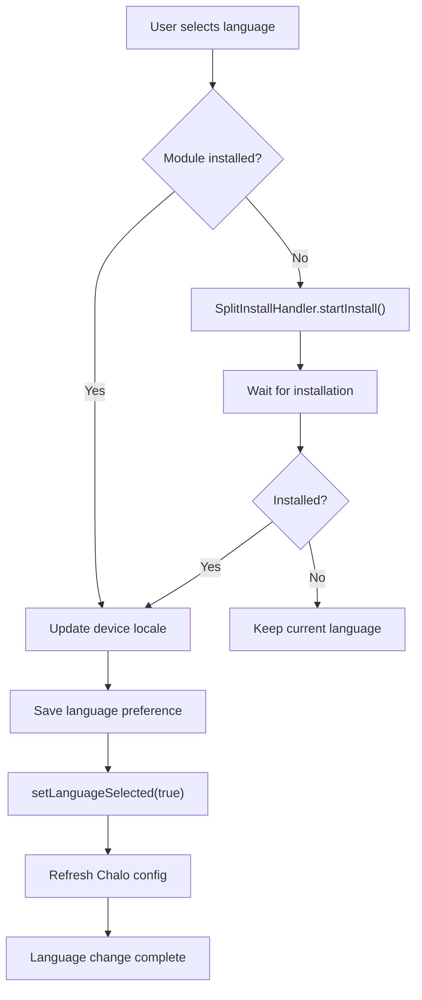

---

## Get Location Disclaimer Steps

**Responsibility:** Provides step-by-step instructions and Lottie animation for location permission education.

### Output Structure

| Field | Type | Description |
|-------|------|-------------|
| **steps** | List<StepUIState> | Instruction steps |
| **lottieResource** | LottieResource | Animation resource |

### Step UI State

| Field | Type | Description |
|-------|------|-------------|
| **stepNumber** | Int | Step order |
| **title** | String | Step title |
| **description** | String | Step instructions |
| **icon** | IconResource | Step icon |

---

## Domain Models

### City App Model

| Field | Type | Description |
|-------|------|-------------|
| **name** | String | City identifier |
| **displayName** | String | User-facing name |
| **bounds** | LatLngBounds | Geographic boundaries |
| **cityCenter** | LatLng | Center coordinates |
| **modes** | List<ChaloTransitMode> | Available transit types |
| **lineMaps** | List<LineMap> | Map resources |
| **busMapUrl** | String? | Bus network map |
| **modeAndAgencyList** | List<ModeMapInfoAppModel> | Agencies per mode |
| **isBetaCity** | Boolean | Beta status |
| **isComingSoonCity** | Boolean | Coming soon flag |
| **isCityDiscontinued** | Boolean | Discontinued flag |
| **timezoneId** | String | City timezone |
| **countryInfo** | CountryInfo | Country details |
| **currencyInfo** | CurrencyInfo | Currency details |
| **polyBounds** | List<LatLng> | Service area polygon |
| **minAppVersionForLogin** | Int | Required app version |

### City App Model Helpers

| Method | Returns | Purpose |
|--------|---------|---------|
| **agencyListWithActiveProducts** | List<Agency> | Agencies with products |
| **agencyListForMode(mode)** | List<Agency> | Agencies for transit mode |
| **containsLocation(latLng)** | Boolean | Check if in service area |
| **isOndcProductAvailableForTransitMode(mode)** | Boolean | ONDC availability |

### Basic City Info App Model

| Field | Type | Description |
|-------|------|-------------|
| **cityId** | String | City identifier |
| **cityName** | String | Display name |
| **isBetaCity** | Boolean | Beta status |
| **isComingSoonCity** | Boolean | Coming soon flag |
| **isCityDiscontinued** | Boolean | Discontinued flag |

### Language Details

| Field | Type | Description |
|-------|------|-------------|
| **code** | String | Language code (en, hi, etc.) |
| **name** | String | English name |
| **nativeName** | String | Name in native script |
| **isInstalled** | Boolean | Module installed (Android) |

---

## Business Rules

| Rule | Description | Enforced By |
|------|-------------|-------------|
| **City must be active** | Discontinued cities cannot be selected | FetchCityMetaData |
| **Language selection required** | Must select before city selection | Splash routing |
| **Post-change operations required** | Must execute all operations on city change | ProcessCityChange |
| **Polygon bounds check** | GPS location must be in city polygon | CityMetaDataManager |
| **Welcome screen duration** | Minimum 2 seconds display | CityLocationSelection |
| **Search debounce** | 300ms delay on city search | CitySelection |

---

## Sequence Diagrams

### GPS-Based City Selection

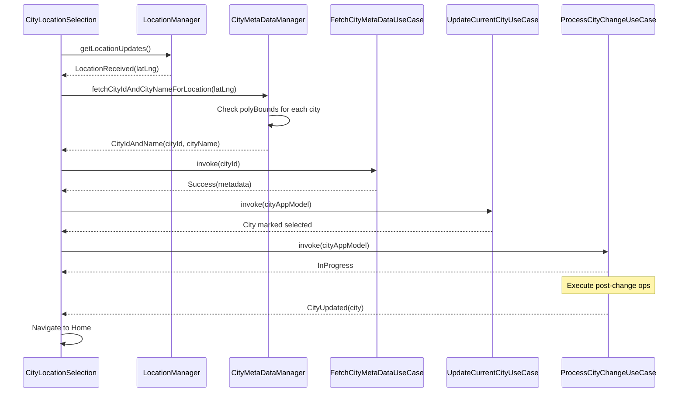

### Language Installation (Android)

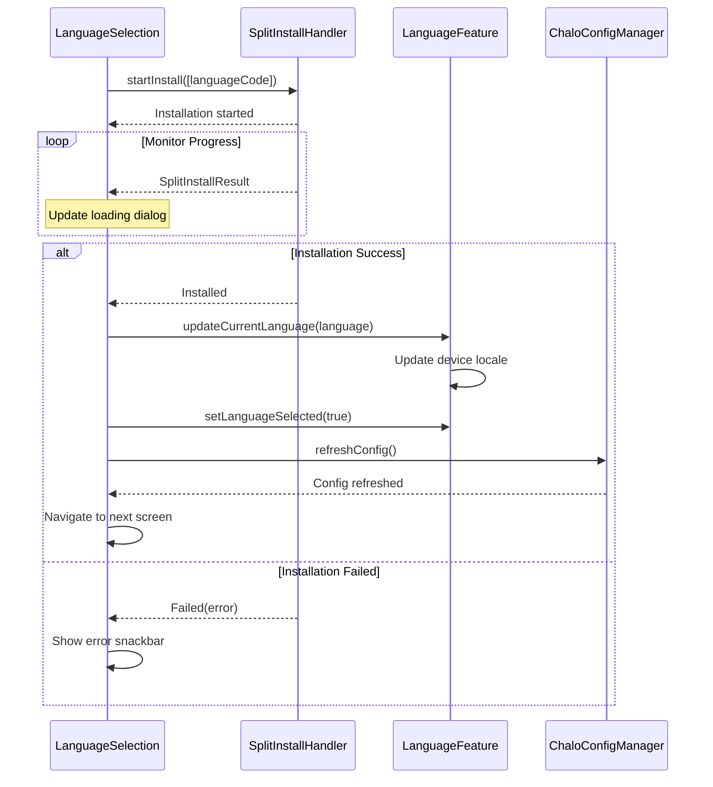

---

## Error Handling

### City Fetch Errors

| Error | Cause | User Impact |
|-------|-------|-------------|
| **CityNotServiceable** | City discontinued | Show discontinued screen |
| **CityIdNotAvailable** | Invalid city ID | Show error, suggest search |
| **CityMetaDataFetchError** | Network/parse error | Show retry option |

### Language Errors

| Error | Cause | User Impact |
|-------|-------|-------------|
| **LanguageDownloadFailed** | Split install failure | Snackbar, keep current |
| **ChaloConfigFetchFailed** | Config refresh failure | Snackbar, allow retry |

### Location Errors

| Error | Cause | User Impact |
|-------|-------|-------------|
| **Permission denied** | User rejected | Show manual selection |
| **GPS disabled** | Device GPS off | Show enable GPS dialog |
| **Location timeout** | GPS couldn't get fix | Show manual selection |
| **No city match** | Outside service area | Show "not available" screen |
