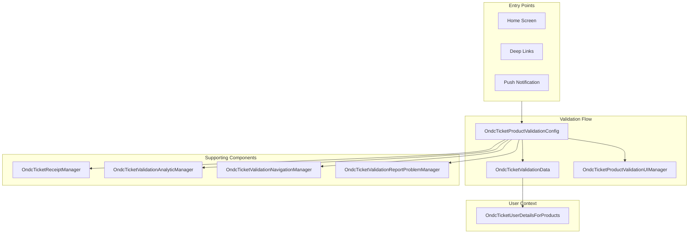
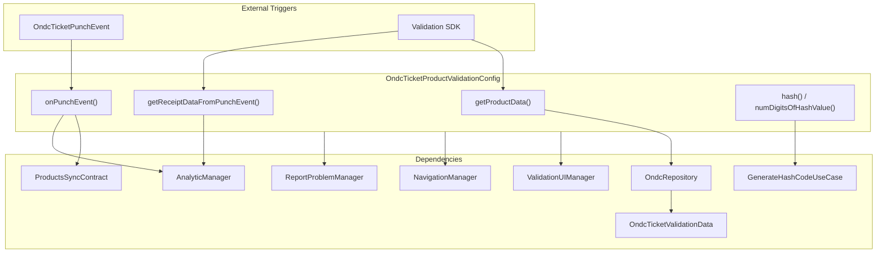
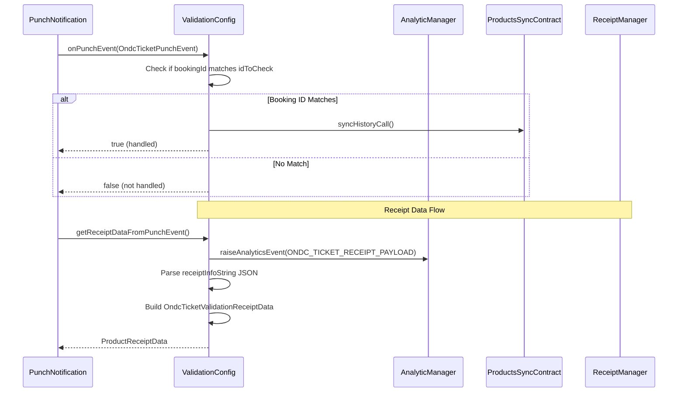
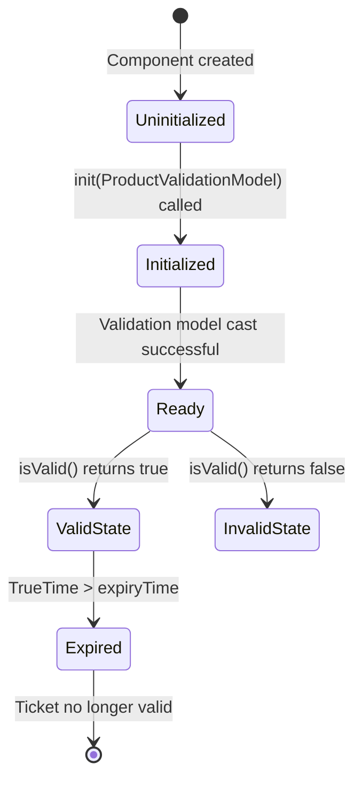
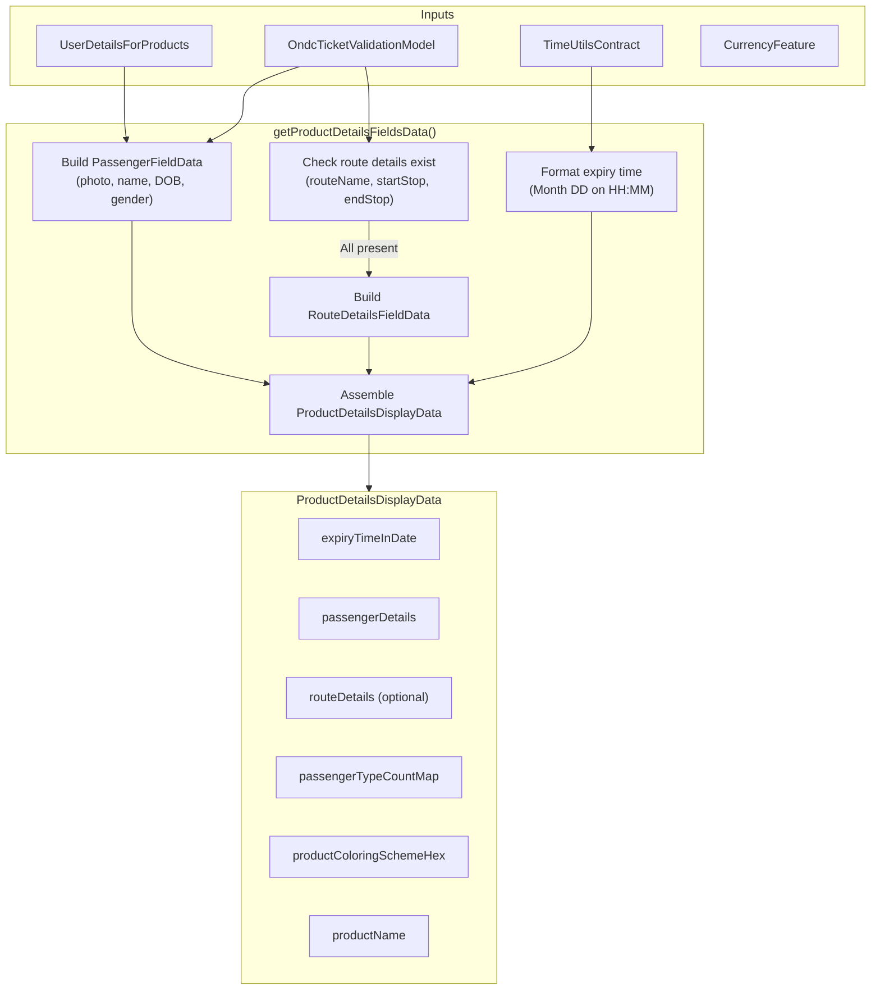
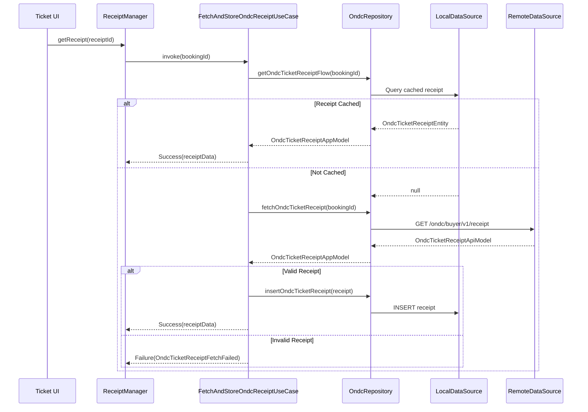
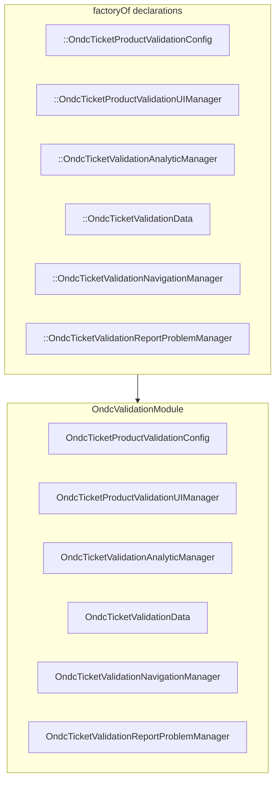

# ONDC Bus -- Component Documentation

## Architecture Overview

The ONDC Bus presentation layer is built around a validation-centric architecture that manages the lifecycle of ONDC tickets from purchase through validation and expiry. Unlike the HLD's conceptual booking orchestration, the actual implementation focuses on three core concerns: product configuration retrieval, ticket validation with QR/audio display, and receipt management. The components integrate deeply with Chalo's unified validation SDK, sharing infrastructure with other ticket types like M-Ticket and Metro.



---

## Component Inventory

| Component | Module | File Path | Responsibility |
|-----------|--------|-----------|----------------|
| `OndcTicketProductValidationConfig` | home | `shared/home/.../ondc/validation/OndcTicketProductValidationConfig.kt` | Orchestrates validation lifecycle |
| `OndcTicketValidationData` | home | `shared/home/.../ondc/validation/OndcTicketValidationData.kt` | Provides ticket data for validation display |
| `OndcTicketValidationModel` | home | `shared/home/.../ondc/validation/OndcTicketValidationModel.kt` | Domain model for validation state |
| `OndcTicketProductValidationUIManager` | home | `shared/home/.../ondc/validation/OndcTicketProductValidationUIManager.kt` | UI rendering decisions |
| `OndcTicketReceiptManager` | home | `shared/home/.../ondc/validation/OndcTicketReceiptManager.kt` | Receipt fetching and caching |
| `OndcTicketValidationAnalyticManager` | home | `shared/home/.../ondc/validation/OndcTicketValidationAnalyticManager.kt` | Analytics event tracking |
| `OndcTicketValidationNavigationManager` | home | `shared/home/.../ondc/validation/OndcTicketValidationNavigationManager.kt` | Navigation routing |
| `OndcTicketValidationReportProblemManager` | home | `shared/home/.../ondc/validation/OndcTicketValidationReportProblemManager.kt` | Issue reporting integration |
| `OndcTicketUserDetailsForProducts` | home | `shared/home/.../ondc/validation/OndcTicketUserDetailsForProducts.kt` | User profile for ticket display |

---

## OndcTicketProductValidationConfig

The validation config serves as the primary entry point for ONDC ticket validation. It implements the `ProductValidationConfig` interface from Chalo's validation SDK, providing product-specific behavior for ONDC tickets while leveraging shared validation infrastructure.

### Responsibilities

The config orchestrates the validation lifecycle by fetching ticket data from the repository, initializing validation models, handling punch events from conductors, and managing receipt generation. It bridges the gap between the ONDC-specific domain models and the generic validation SDK.

### Constructor Dependencies

| Dependency | Type | Purpose |
|------------|------|---------|
| `ondcRepository` | `OndcRepository` | Data access for ticket retrieval |
| `ondcTicketValidationData` | `OndcTicketValidationData` | Manages validation state |
| `ondcTicketTicketProductValidationUIManager` | `OndcTicketProductValidationUIManager` | UI configuration |
| `getNumDigitsOfHashValueForEasyVerificationUseCase` | Use Case | Hash digit count for easy verification |
| `generateHashCodeForEasyVerificationUseCase` | Use Case | Hash generation for verification codes |
| `ondcTicketValidationAnalyticManager` | `OndcTicketValidationAnalyticManager` | Analytics tracking |
| `ondcTicketValidationNavigationManager` | `OndcTicketValidationNavigationManager` | Navigation handling |
| `ondcTicketValidationReportProblemManager` | `OndcTicketValidationReportProblemManager` | Problem reporting |
| `productSyncContract` | `ProductsSyncContract` | Product synchronization callbacks |

### Component Interactions



### Key Methods

| Method | Trigger | Purpose |
|--------|---------|---------|
| `getProductData(product)` | Validation SDK initialization | Fetches ONDC ticket from repository, initializes validation model with user properties for report problem |
| `onPunchEvent(punchEvent, data, idToCheck)` | Punch notification received | Validates punch event matches booking ID, triggers history sync if matched |
| `getReceiptDataFromPunchEvent(punchEvent, data)` | Post-punch receipt needed | Extracts receipt data from punch notification payload JSON |
| `onProductReceiptDataReceived(receiptData, data, idToCheck)` | Receipt data available | Triggers sync if product IDs match |
| `numDigitsOfHashValue()` | Hash display needed | Returns digit count for easy verification code |
| `hash(strToHash, digits)` | Hash generation | Creates verification hash code |
| `getProductValidationAnalyticsManager()` | SDK query | Returns the analytics manager |
| `getProductValidationNavigationManager()` | SDK query | Returns the navigation manager |
| `getProductValidationUIManager()` | SDK query | Returns the UI manager |
| `getValidationReportProblemDataManager()` | SDK query | Returns the report problem manager |

### Punch Event Processing



### Receipt Data Extraction

When a punch event is received, the config extracts receipt information from the notification payload JSON. The receipt JSON is parsed using `ChaloJson.Json.parseToJsonElement()` and fields are extracted with fallbacks to the validation model.

| Receipt Field | Primary Source | Fallback Source | Description |
|---------------|----------------|-----------------|-------------|
| `bookingId` | punchEvent.bookingId | - | Booking identifier |
| `productType` | punchEvent.productType | - | Product type constant |
| `productSubType` | punchEvent.productSubType | - | Product subtype constant |
| `punchTime` | punchEvent.punchTime | - | Validation timestamp |
| `amount` | validationModel.amount | - | Ticket amount |
| `startStopName` | validationModel.startStopName | JSON `startStop` | Origin stop |
| `endStopName` | validationModel.endStopName | JSON `endStop` | Destination stop |
| `routeName` | validationModel.routeName | JSON `routeName` | Route name |
| `conductorId` | JSON `conductorId` | - | Conductor identifier |
| `vehicleNo` | JSON `vehicleNo` | - | Vehicle number |
| `passengerDetails` | validationModel.passengerDetails | - | Passenger type counts |

---

## OndcTicketValidationData

The validation data component implements `ProductValidationData` interface, providing all ticket information needed for the validation UI. It handles QR code retrieval, tone data for audio validation, expiry checking, and user details display.

### Constructor Dependencies

| Dependency | Type | Purpose |
|------------|------|---------|
| `basicInfoContract` | `BasicInfoContract` | TrueTime provider for expiry checks |
| `ondcTicketValidationUserDetails` | `OndcTicketUserDetailsForProducts` | User profile information |
| `currencyFeature` | `CurrencyFeature` | Amount formatting with currency |
| `resourcesHelper` | `StringProvider` | Localized strings |
| `timeUtilsContract` | `TimeUtilsContract` | Date/time formatting |

### State Management



### Data Retrieval Methods

| Method | Returns | Description |
|--------|---------|-------------|
| `init(productValidationModel)` | Unit | Stores validation model reference, casts to `OndcTicketValidationModel` |
| `initUserPropertiesMapToReportProblem(map)` | Unit | Stores user properties map for issue reporting |
| `getValidationProduct()` | ProductValidationModel? | Returns the stored validation model |
| `getUserPropertiesMapToReportProblem()` | MutableMap | Returns stored user properties |
| `getProductValidationBrandingLogoType()` | ProductBookingBranding | Returns `ProductBookingBranding.Ondc()` |
| `isValid()` | Boolean | Checks if `TrueTime < expiryTime` |
| `getToneByteArray()` | ByteArray? | Decodes Base64 tone for audio validation (deprecated) |
| `getToneString()` | String? | Returns raw tone string for platform-specific handling |
| `getValidationStaticPayload()` | String? | Returns static validation payload (same as tone) |
| `getStaticQRCode()` | String | Returns QR code data, empty string if null |
| `getId()` | String | Returns orderId/bookingId |
| `getProductType()` | String | Returns product type from model |
| `getProductSubType()` | String | Returns product subtype from model |
| `getProductName()` | String | Returns product display name |
| `activationExpiryCheckDelayInMS()` | Long | Returns 2000ms for periodic expiry checks |
| `getQRCodeRefreshDelayInMS()` | Long | Returns 1000ms for QR refresh |
| `getActivationTimestampMS()` | Long | Calculates activation start time |
| `getActivationId()` | String | Returns activation timestamp in seconds |
| `isProductActivationValid()` | Boolean | Checks expiry against TrueTime |
| `getUserDetails()` | UserDetailsForProducts | Returns user details provider |
| `getUserDetailsIfAvailable()` | UserDetailsForProducts? | Returns user details or null |
| `getExpiryTimestamp()` | Long | Returns activation expiry time |
| `getStringIdForHash()` | String | Returns orderId for hash generation |
| `getStringForReferenceID()` | String | Returns uppercase orderId for display |
| `getProductAmountAsString()` | String | Formats amount with currency |
| `getProductDetailsFieldsData()` | ProductDetailsDisplayData | Builds complete display data for UI |
| `getBookingTime()` | Long? | Returns original booking time |
| `getValidationEntityInfoIfAvailable()` | List | Returns validation entity list |

### Display Data Construction



### Configuration Constants

| Constant | Value | Purpose |
|----------|-------|---------|
| `EXPIRY_DELAY_PERIODIC_CHECK_MILLIS` | 2000L | Frequency for expiry status checks |
| `QR_CODE_REFRESH_DELAY_IN_MILLIS` | 1000L | QR code refresh interval |

---

## OndcTicketValidationModel

The validation model is the domain representation of an ONDC ticket in validation context. It implements `ProductValidationModel` interface and carries all ticket state needed for display and validation.

### Model Fields

| Field | Type | Description |
|-------|------|-------------|
| `status` | OndcTicketStatus | Current ticket status |
| `transactionId` | String | Payment transaction ID |
| `paymentMode` | String | Payment method used |
| `qrCode` | String? | QR code data for validation |
| `soundStaticTone` | String? | Base64 encoded audio tone |
| `expiryTime` | Long | Ticket validity end timestamp |
| `activationDuration` | Long? | Duration from booking to expiry |
| `amount` | Int | Ticket amount in subcurrency |
| `orderId` | String | Booking/order identifier |
| `punchTime` | Long? | When ticket was punched |
| `productName` | String | Display name (e.g., "Single Journey Ticket") |
| `bookingTime` | Long? | Original booking timestamp |
| `passengerDetails` | Map<String, Int>? | Passenger type to count mapping |
| `routeName` | String? | Route name/number |
| `startStopName` | String? | Origin stop name |
| `endStopName` | String? | Destination stop name |
| `validationInfoList` | List<TicketValidationInfo>? | Validation entity details |
| `colorSchemeHex` | String? | Ticket color for branding |

### Computed Properties

The model implements `ProductValidationModel` interface computed properties:

| Property | Value | Source |
|----------|-------|--------|
| `productType` | `"mobileTicket"` | `OndcTicketConstants.PRODUCT_TYPE` |
| `productSubType` | `"ondcTicket"` | `OndcTicketConstants.PRODUCT_SUB_TYPE` |

### Status Mapping

| OndcTicketStatus | Display | Validation Allowed |
|------------------|---------|-------------------|
| `ACTIVE` | Green badge | Yes |
| `PAYMENT_PROCESSING` | Yellow badge | No |
| `PAYMENT_FAILED` | Red badge | No |
| `USED` | Grey badge | No |
| `PUNCHED` | Grey badge | No |
| `EXPIRED` | Red badge | No |
| `FAILED` | Red badge | No |

### Model Transformation

```mermaid
flowchart LR
    subgraph Source["OndcTicketAppModel"]
        S_BookingId["bookingId"]
        S_Status["status"]
        S_QrCode["qrCode"]
        S_Tone["tone"]
        S_ExpiryTime["activationExpiryTime"]
        S_Amount["amount"]
        S_BookingTime["bookingTime"]
        S_Passengers["passengerDetails"]
        S_Route["routeName"]
        S_Stops["startStopName, endStopName"]
        S_Validation["validationInfoList"]
        S_Color["ticketColorHex"]
    end

    subgraph Transform["toValidationModel()"]
        Extension["Extension function"]
    end

    subgraph Target["OndcTicketValidationModel"]
        T_OrderId["orderId = bookingId"]
        T_Status["status"]
        T_QrCode["qrCode"]
        T_Tone["soundStaticTone = tone"]
        T_Expiry["expiryTime = activationExpiryTime"]
        T_Duration["activationDuration = expiryTime - bookingTime"]
        T_Amount["amount = amount.toInt()"]
        T_BookingTime["bookingTime"]
        T_Passengers["passengerDetails"]
        T_Route["routeName"]
        T_Stops["startStopName, endStopName"]
        T_Validation["validationInfoList"]
        T_Color["colorSchemeHex = ticketColorHex"]
        T_ProductName["productName = 'Single Journey Ticket'"]
    end

    Source --> Transform --> Target
```



### Activation Time Calculation

The `getActivationTimestampMS()` extension function calculates when the ticket became active:

```
activationTimestamp = expiryTime - activationDuration
```

If `activationDuration` is null, returns 0L.

---

## OndcTicketProductValidationUIManager

Configures UI strings and behaviors for the ONDC ticket validation screen by implementing `ProductValidationUIManager` and delegating common functionality to `ProductValidationCommonUIManager`.

### UI Configuration Methods

| Method | Return Value | Purpose |
|--------|--------------|---------|
| `getProductExpiryMessageResId()` | `StringEnum.ACTIVATION_EXPIRED_MTICKET_COPY` | Expiry message body text |
| `getProductExpiryTitleResId()` | `StringEnum.ACTIVATION_EXPIRED_MTICKET_TITLE` | Expiry dialog title |
| `getProductVerificationMessageResId()` | `StringEnum.VIEW_RECEIPT_BOTTOMSHEET_COPY_TICKET` | Verification guidance text |
| `getProductBackPressConfirmationMessageResId()` | `StringEnum.EXIT_QUICK_PAY_MESSAGE` | Back press confirmation dialog |
| `shouldShowViewReceiptMenu()` | `false` | Hides receipt menu in toolbar |
| `shouldShowUserDetails()` | `false` | Hides user details section on ticket |

---

## OndcTicketReceiptManager

The receipt manager handles fetching and caching ticket receipts after validation. It implements `ProductReceiptManager` interface and coordinates between the use case and UI.

### Receipt Retrieval Flow



### Interface Methods

| Method | Returns | Description |
|--------|---------|-------------|
| `getReceipt(receiptId)` | `ChaloUseCaseResult<ProductReceiptData, ReceiptFetchError>` | Fetches receipt by booking ID |
| `getUserDetails()` | `UserDetailsForProducts?` | Returns user details for receipt display |

---

## Supporting Components

### OndcTicketValidationAnalyticManager

Manages analytics event tracking during the validation lifecycle. Raises events for validation start, completion, receipt viewing, and error scenarios.

| Event | Trigger | Properties |
|-------|---------|------------|
| `ONDC_TICKET_RECEIPT_PAYLOAD` | Receipt data extracted | `payload` (JSON string) |
| `ONDC_TICKET_VALIDATION_START` | Validation flow entered | `bookingId`, `productType` |
| `ONDC_TICKET_VALIDATION_SUCCESS` | Punch successful | `bookingId`, `punchTime` |
| `ONDC_TICKET_VALIDATION_ERROR` | Validation failed | `bookingId`, `errorType` |

### OndcTicketValidationNavigationManager

Handles navigation routing during and after validation. Routes to receipt screen, home, or error screens based on validation outcome.

| Action | Destination | Condition |
|--------|-------------|-----------|
| Post-validation | Receipt Screen | Successful punch |
| Timeout | Home Screen | No response within timeout |
| Error | Error Screen | Validation failure |

### OndcTicketValidationReportProblemManager

Integrates with Chalo's issue reporting system. Prepares user properties and ticket context for support tickets.

| Property | Source | Description |
|----------|--------|-------------|
| `ORDER_ID` | bookingId | Ticket identifier for support reference |
| `PRODUCT_TYPE` | constant | "ondcTicket" |
| `USER_ID` | UserProfile | Current user identifier |

---

## Dependency Injection

### Koin Module Configuration

The ONDC validation components are registered via the `ondcValidationDependencies()` extension function in the home module.



All components are registered as factories using `factoryOf`, creating new instances for each injection request to ensure isolation between validation sessions.

### Dependency Graph

| Component | Dependencies |
|-----------|--------------|
| `OndcTicketProductValidationConfig` | OndcRepository, OndcTicketValidationData, OndcTicketProductValidationUIManager, GetNumDigitsOfHashValueForEasyVerificationUseCase, GenerateHashCodeForEasyVerificationUseCase, OndcTicketValidationAnalyticManager, OndcTicketValidationNavigationManager, OndcTicketValidationReportProblemManager, ProductsSyncContract |
| `OndcTicketValidationData` | BasicInfoContract, OndcTicketUserDetailsForProducts, CurrencyFeature, StringProvider, TimeUtilsContract |
| `OndcTicketReceiptManager` | FetchAndStoreOndcReceiptUseCase, OndcTicketUserDetailsForProducts |

---

## Metro Ticket Validation

The ONDC module also supports Metro ticket validation with a parallel set of components under `validation/metro/`.

### Metro Components

| Component | File | Purpose |
|-----------|------|---------|
| `OndcMetroTicketValidationModel` | `metro/OndcMetroTicketValidationModel.kt` | Metro ticket validation model |
| `OndcMetroTicketValidationData` | `metro/OndcMetroTicketValidationData.kt` | Metro ticket data provider |
| `OndcMetroTicketProductValidationConfig` | `metro/OndcMetroTicketProductValidationConfig.kt` | Metro validation orchestration |
| `OndcMetroTicketProductValidationUIManager` | `metro/OndcMetroTicketProductValidationUIManager.kt` | Metro UI management |
| `OndcMetroTicketReceiptManager` | `metro/OndcMetroTicketReceiptManager.kt` | Metro receipt handling |
| `OndcMetroTicketValidationAnalyticManager` | `metro/OndcMetroTicketValidationAnalyticManager.kt` | Metro analytics |
| `OndcMetroTicketValidationNavigationManager` | `metro/OndcMetroTicketValidationNavigationManager.kt` | Metro navigation |
| `OndcMetroTicketValidationReportProblemManager` | `metro/OndcMetroTicketValidationReportProblemManager.kt` | Metro issue reporting |
| `OndcMetroTicketUserDetailsForProducts` | `metro/OndcMetroTicketUserDetailsForProducts.kt` | Metro user details |

### Product Type Constants

| Constant | Bus Value | Metro Value |
|----------|-----------|-------------|
| `PRODUCT_TYPE` | `"mobileTicket"` | `"mobileTicket"` |
| `PRODUCT_SUB_TYPE` | `"ondcTicket"` | `"ondcMetroTicket"` |
| `PRODUCT_NAME` | - | `"Single Journey Ticket"` |

---

## Error Handling

| Error Scenario | Component | Handling |
|----------------|-----------|----------|
| Ticket not found | ValidationConfig | Return null from `getProductData()` |
| Invalid punch event type | ValidationConfig | Return false from `onPunchEvent()` |
| TrueTime unavailable | ValidationData | Use system time fallback |
| QR code null | ValidationData | Return empty string |
| Tone decode failure | ValidationData | Return null, skip audio validation |
| Receipt fetch failed | ReceiptManager | Return `ChaloUseCaseResult.Failure` with `OndcTicketReceiptFetchFailed` |
| Punch event ID mismatch | ValidationConfig | Return false, no action taken |
| JSON parse error | ValidationConfig | Return `ChaloJson.emptyJsonObject`, extract available fields |

---

## Platform Considerations

### Shared (Kotlin Multiplatform)

All validation components are implemented in the shared module using Kotlin Multiplatform. They use:
- `kotlinx.serialization` for JSON parsing
- `kotlinx.coroutines` for async operations
- Koin for dependency injection
- SQLDelight for local storage

### Audio Tone Handling

The `getToneByteArray()` method uses `kotlin.io.encoding.Base64` for decoding, which is marked as `@ExperimentalEncodingApi`. The newer `getToneString()` method returns the raw string, allowing platform-specific decoding in Android and iOS layers.

### Compose Multiplatform

The validation UI is built with Compose Multiplatform, sharing the same UI code across Android and iOS platforms. Platform-specific behaviors are abstracted through interfaces implemented in platform modules.
