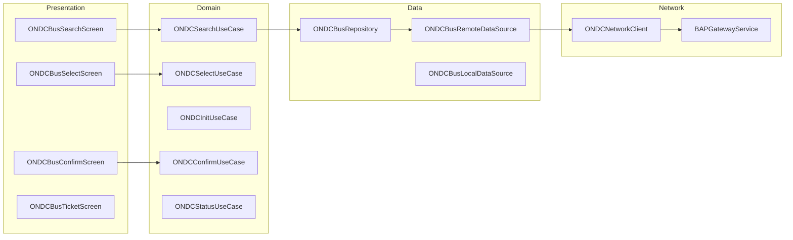

# ONDC Bus — High-Level Design

## Overview

The ONDC Bus feature enables bus ticket booking through the Open Network for Digital Commerce (ONDC) protocol. This is separate from the native M-Ticket flow and integrates with ONDC's BAP (Buyer App Platform) and BPP (Buyer-side Protocol Processor) architecture. The feature handles search, select, init, confirm, and status operations per the ONDC specification.

## User Journey

1. **Entry Points**:
   - Home → ONDC bus booking
   - Search → ONDC routes
   - Deep link → ONDC booking

2. **Core Flow**:
   - Search for ONDC bus routes
   - Select route and schedule
   - Choose seats (if applicable)
   - Init order with passenger details
   - Confirm and pay
   - Receive ticket with QR

3. **Exit Points**:
   - Booking confirmed → Ticket screen
   - Payment failed → Retry or cancel
   - Route unavailable → Search again

## Architecture Diagram



## Key Components

| Component | Platform | File Path | Responsibility |
|-----------|----------|-----------|----------------|
| `ONDCBusBookingComponent` | Shared | `shared/productbooking/.../ondc/ui/ONDCBusBookingComponent.kt` | Booking orchestration |
| `ONDCBusRepository` | Shared | `shared/productbooking/.../ondc/data/repository/ONDCBusRepository.kt` | Data access layer |
| `ONDCSearchUseCase` | Shared | `shared/productbooking/.../ondc/domain/ONDCSearchUseCase.kt` | Route search |
| `ONDCConfirmUseCase` | Shared | `shared/productbooking/.../ondc/domain/ONDCConfirmUseCase.kt` | Order confirmation |
| `ONDCBusLocalDataSource` | Shared | `shared/productbooking/.../ondc/data/local/ONDCBusLocalDataSource.kt` | SQLDelight storage |

## Data Flow

### ONDC Search Flow
1. User enters origin and destination
2. `ONDCSearchUseCase` constructs ONDC search request
3. Request sent to BAP gateway
4. Gateway broadcasts to BPPs
5. Aggregated results returned
6. Display available routes and schedules

### ONDC Booking Flow
1. User selects route → `on_select` callback
2. Init order with passenger details → `on_init` callback
3. User confirms and pays → `on_confirm` callback
4. Ticket generated with transaction ID
5. Status polling for updates

### Order Lifecycle
```
search → on_search → select → on_select → init → on_init → confirm → on_confirm → status
```

## Platform Differences

### Android-Specific
- Native Compose UI for booking screens
- Android-specific deep link handling
- Platform payment integration

### iOS-Specific
- Compose Multiplatform UI
- iOS deep link handling via Universal Links
- iOS payment sheet integration

## Integration Points

### Analytics Events
- See [Analytics: ondc-bus](/analytics/flows/ondc-bus) for event documentation
- Key events:
  - `ondc_search_initiated`
  - `ondc_route_selected`
  - `ondc_order_initiated`
  - `ondc_payment_started`
  - `ondc_booking_confirmed`
  - `ondc_ticket_viewed`

### Shared Services
- **Payment**: Checkout flow integration
- **Location**: GPS for nearby stops
- **Notifications**: Booking confirmations

### Navigation
- **Navigates to**: Payment, Ticket activation, Receipt
- **Navigated from**: Home, Search, Deep links

## ONDC Protocol Models

### ONDCSearchRequest
```kotlin
data class ONDCSearchRequest(
    val context: ONDCContext,
    val message: ONDCSearchMessage
)

data class ONDCSearchMessage(
    val intent: ONDCIntent
)

data class ONDCIntent(
    val fulfillment: ONDCFulfillment,
    val payment: ONDCPaymentIntent?
)
```

### ONDCOrder
```kotlin
data class ONDCOrder(
    val id: String,
    val state: ONDCOrderState,
    val provider: ONDCProvider,
    val items: List<ONDCItem>,
    val fulfillments: List<ONDCFulfillment>,
    val quote: ONDCQuote,
    val payment: ONDCPayment,
    val createdAt: Long,
    val updatedAt: Long
)
```

### ONDCOrderState
```kotlin
enum class ONDCOrderState {
    CREATED,
    ACCEPTED,
    IN_PROGRESS,
    COMPLETED,
    CANCELLED
}
```

## View State

### ONDCBusBookingState
```kotlin
data class ONDCBusBookingState(
    val searchState: ONDCSearchState,
    val selectedRoute: ONDCRouteAppModel?,
    val selectedSchedule: ONDCScheduleAppModel?,
    val passengerDetails: List<PassengerDetail>,
    val quote: ONDCQuoteAppModel?,
    val orderState: ONDCOrderState?,
    val ticketInfo: ONDCTicketAppModel?
)

sealed class ONDCSearchState {
    object Idle : ONDCSearchState()
    object Loading : ONDCSearchState()
    data class Results(val routes: List<ONDCRouteAppModel>) : ONDCSearchState()
    data class Error(val message: String) : ONDCSearchState()
}
```

## Local Storage

### SQLDelight Tables
```kotlin
// ONDC order cache
CREATE TABLE ondc_order (
    order_id TEXT PRIMARY KEY,
    transaction_id TEXT NOT NULL,
    state TEXT NOT NULL,
    provider_id TEXT NOT NULL,
    quote_json TEXT NOT NULL,
    created_at INTEGER NOT NULL,
    updated_at INTEGER NOT NULL
);

// ONDC ticket cache
CREATE TABLE ondc_ticket (
    ticket_id TEXT PRIMARY KEY,
    order_id TEXT NOT NULL,
    qr_data TEXT NOT NULL,
    valid_from INTEGER NOT NULL,
    valid_until INTEGER NOT NULL,
    status TEXT NOT NULL
);
```

## Edge Cases & Error Handling

| Scenario | Handling |
|----------|----------|
| No routes found | Shows empty state |
| BPP timeout | Shows partial results |
| Init failed | Shows retry option |
| Payment failed | Allows retry or cancel |
| Ticket not generated | Polls status endpoint |
| Network offline | Shows cached tickets |
| Order cancelled by BPP | Shows cancellation reason |

## ONDC Context

### Required Fields
```kotlin
data class ONDCContext(
    val domain: String = "nic2004:60221",  // Bus transport
    val country: String = "IND",
    val city: String,
    val action: String,                     // search, select, init, confirm
    val coreVersion: String = "1.0.0",
    val bapId: String,
    val bapUri: String,
    val transactionId: String,
    val messageId: String,
    val timestamp: String
)
```

## Error Types

### ONDCErrorType
```kotlin
sealed class ONDCErrorType {
    object NetworkError : ONDCErrorType()
    object SearchTimeout : ONDCErrorType()
    object NoRoutesFound : ONDCErrorType()
    data class SelectFailed(val reason: String) : ONDCErrorType()
    data class InitFailed(val reason: String) : ONDCErrorType()
    data class ConfirmFailed(val reason: String) : ONDCErrorType()
    data class BPPError(val code: String, val message: String) : ONDCErrorType()
}
```

## Dependencies

### Internal
- `shared:productbooking` — ONDC booking module
- `shared:home` — ONDC entry points
- `shared:checkout` — Payment integration
- `shared:core` — Base utilities

### External
- ONDC BAP Gateway — Protocol communication
- SQLDelight — Order/ticket caching
- Ktor — Network requests
- Kotlinx.serialization — JSON parsing
