# ONDC Bus -- Repository Documentation

## Data Layer Overview

The ONDC Bus data layer implements a clean repository pattern with distinct local and remote data sources. The repository serves as the single source of truth for ONDC ticket operations, coordinating between SQLDelight-based local storage and Ktor-based remote API calls. Unlike the conceptual ONDC protocol callbacks described in the HLD, the actual implementation uses a simpler request-response pattern with Chalo's backend acting as the BAP gateway.

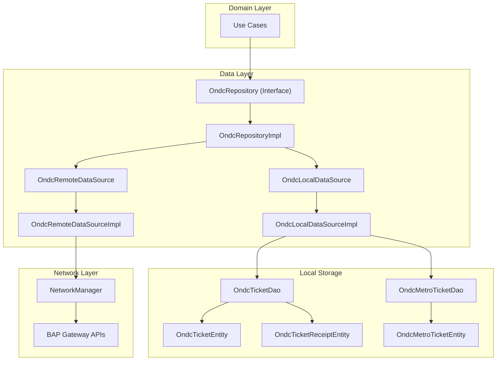

---

## Repository Interfaces

### OndcRepository

The main repository interface defines all operations available for ONDC ticket management. Located at `shared/productbooking/src/commonMain/kotlin/app/chalo/ondc/repository/OndcRepository.kt`.

| Method | Return Type | Description |
|--------|-------------|-------------|
| `fetchRoutesForSelectedStops(fromStopId, toStopId, routeId?, cityName, transitMode)` | `OndcRouteSearchResultAppModel` | Search routes between stops |
| `getMobileTicketFare(requestAppModel)` | `FetchMobileTicketFareResponseAppModel` | Fetch fare for route |
| `createBooking(requestAppModel)` | `OndcBookingAppModel` | Create ONDC booking with passenger details |
| `createOrder(requestAppModel)` | `CreateOrderResponseAppModel` | Create payment order for booking |
| `completeOndcPurchase(bookingId)` | `GenericMobileTicketProductApiResponseModel` | Complete purchase and get ticket |
| `fetchOndcTicketProductById(bookingId, productType, productSubType)` | `OndcMobileTicketProductDataApiResponseModel` | Fetch ticket from API by ID |
| `fetchOndcMetroTicketProductById(bookingId, productType, productSubType)` | `OndcMetroTicketProductDataApiResponseModel` | Fetch metro ticket from API by ID |
| `insertOndcTicket(ondcTicketAppModel)` | `Unit` | Cache ticket locally |
| `insertOndcMetroTicket(ondcMetroTicketAppModel)` | `Unit` | Cache metro ticket locally |
| `insertOndcTickets(ondcTicketAppModelList)` | `Unit` | Bulk insert tickets |
| `clearExistingTicketsAndInsertNew(ticketsList)` | `Unit` | Replace all tickets |
| `clearExistingMetroTicketsAndInsertNew(ticketsList)` | `Unit` | Replace all metro tickets |
| `getOndcTicket(bookingId)` | `OndcTicketAppModel?` | Get cached ticket by ID |
| `getOndcTicketAsFlow(bookingId)` | `Flow<OndcTicketAppModel?>` | Observe ticket changes |
| `getOndcMetroTicket(bookingId)` | `OndcMetroTicketAppModel?` | Get cached metro ticket |
| `getOndcMetroTicketAsFlow(bookingId)` | `Flow<OndcMetroTicketAppModel?>` | Observe metro ticket |
| `getAllOndcTickets()` | `List<OndcTicketAppModel>` | Get all cached tickets |
| `getAllOndcTicketsAsFlow(statusTypeToInclude)` | `Flow<List<OndcTicketAppModel>>` | Observe all tickets with filter |
| `getAllOndcMetroTicketsAsFlow(statusTypeToInclude)` | `Flow<List<OndcMetroTicketAppModel>>` | Observe all metro tickets |
| `getActiveOrPaymentProcessingOndcTicketsAsFlow()` | `Flow<List<OndcTicketAppModel>>` | Active/processing tickets |
| `deleteAllLocalOndcTickets()` | `Unit` | Clear ticket cache |
| `getOndcTicketReceiptFlow(bookingId)` | `Flow<OndcTicketReceiptAppModel?>` | Observe receipt changes |
| `insertOndcTicketReceipt(ondcTicketReceipt)` | `Unit` | Cache receipt locally |
| `markOndcTicketAsExpiredByUpdatingExpiryTime(bookingId, updatedExpiryTime)` | `Unit` | Force expire ticket |
| `fetchOndcTicketReceipt(bookingId)` | `OndcTicketReceiptAppModel` | Fetch receipt from API |
| `fetchMetroLines(cityName, transitMode)` | `OndcMetroRouteSearchResultAppModel` | Get metro lines for city |
| `fetchMetroLineStops(cityName, routeId, mode)` | `MetroLineStopListAppModel` | Get stops for metro line |

### OndcRemoteDataSource

The remote data source interface handles all network operations. Located at `shared/productbooking/src/commonMain/kotlin/app/chalo/ondc/remote/OndcRemoteDataSource.kt`.

| Method | Return Type | Description |
|--------|-------------|-------------|
| `fetchRoutesForSelectedStops(queryParamMap, cityName)` | `OndcRouteSearchResultApiModel` | Search routes between stops |
| `getMobileTicketFare(fetchFareRequestApiModel)` | `FetchMobileTicketFareResponseApiModel` | Fetch fare details |
| `createOndcBooking(requestApiModel)` | `OndcBookingResponseApiModel` | POST booking to BAP |
| `createOndcTicketOrder(requestApiModel)` | `CreateOrderResponseApiModel` | POST order creation |
| `fetchOndcTicketProductById(bookingId, productType, productSubType)` | `OndcMobileTicketProductDataApiResponseModel` | GET ticket by booking ID |
| `fetchOndcTicketReceipt(bookingId, productType, productSubType)` | `OndcTicketReceiptApiModel` | GET receipt by booking ID |
| `fetchOndcMetroTicketProductById(bookingId, productType, productSubType)` | `OndcMetroTicketProductDataApiResponseModel` | GET metro ticket |
| `fetchMetroLines(cityName, mode)` | `OndcMetroRouteSearchResponseApiModel` | GET metro lines |
| `fetchMetroLineStopList(cityName, routeId, mode)` | `MetroLineStopListApiModel` | GET metro line stops |
| `completeOndcPurchase(requestModel)` | `GenericMobileTicketProductApiResponseModel` | Confirm purchase |

### OndcLocalDataSource

The local data source interface handles SQLDelight operations. Located at `shared/productbooking/src/commonMain/kotlin/app/chalo/ondc/local/OndcLocalDataSource.kt`.

| Method | Return Type | Description |
|--------|-------------|-------------|
| `getOndcTicket(bookingId, userId)` | `OndcTicketEntity?` | Query ticket by ID and user |
| `getOndcTicketAsFlow(bookingId, userId)` | `Flow<OndcTicketEntity?>` | Observe ticket |
| `getAllOndcTickets(cityName, userId)` | `List<OndcTicketEntity>` | Query all tickets |
| `getAllOndcTicketsAsFlow(cityName, userId)` | `Flow<List<OndcTicketEntity>>` | Observe all tickets |
| `getActiveOrPaymentProcessingOndcTicketsAsFlow(cityName, userId)` | `Flow<List<OndcTicketEntity>>` | Observe active/processing |
| `insertOndcTicket(ondcTicketEntity)` | `Unit` | Insert/update ticket |
| `insertOndcTickets(ondcTicketEntities)` | `Unit` | Bulk insert tickets |
| `deleteOndcTickets()` | `Unit` | Delete all tickets |
| `getOndcTicketReceiptFlow(bookingId)` | `Flow<OndcTicketReceiptEntity?>` | Observe receipt |
| `insertOndcTicketReceipt(ondcTicketReceiptEntity)` | `Unit` | Insert/update receipt |
| `updateOndcTicketExpiryTime(bookingId, updatedExpiryTime)` | `Unit` | Update expiry timestamp |
| `getOndcMetroTicket(bookingId, userId)` | `OndcMetroTicketEntity?` | Query metro ticket |
| `getOndcMetroTicketAsFlow(bookingId, userId)` | `Flow<OndcMetroTicketEntity?>` | Observe metro ticket |
| `getAllOndcMetroTickets(cityName, userId)` | `List<OndcMetroTicketEntity>` | Query all metro tickets |
| `getAllOndcMetroTicketsAsFlow(cityName, userId)` | `Flow<List<OndcMetroTicketEntity>>` | Observe all metro tickets |
| `getActiveOrPaymentProcessingOndcMetroTicketsAsFlow(cityName, userId)` | `Flow<List<OndcMetroTicketEntity>>` | Active metro tickets |
| `insertOndcMetroTicket(ondcMetroTicketEntity)` | `Unit` | Insert metro ticket |
| `insertOndcMetroTickets(ondcMetroTicketEntities)` | `Unit` | Bulk insert metro tickets |
| `deleteOndcMetroTickets()` | `Unit` | Delete all metro tickets |
| `updateOndcMetroTicketExpiryTime(bookingId, updatedExpiryTime)` | `Unit` | Update metro expiry |
| `deleteExistingAndInsertNewMetroTickets(ondcTicketEntities)` | `Unit` | Replace metro tickets |

---

## Repository Implementation

### OndcRepositoryImpl

The repository implementation coordinates between remote and local data sources, handles model mapping, and provides error isolation. Located at `shared/productbooking/src/commonMain/kotlin/app/chalo/ondc/repository/OndcRepositoryImpl.kt`.

#### Constructor Dependencies

| Dependency | Type | Purpose |
|------------|------|---------|
| `ondcRemoteDataSource` | `OndcRemoteDataSource` | Network operations |
| `ondcLocalDataSource` | `OndcLocalDataSource` | Database operations |
| `basicUserProfileDetailsProvider` | `UserProfileDetailsProvider` | User ID retrieval |
| `cityProvider` | `CityProvider` | City context |
| `basicInfoContract` | `BasicInfoContract` | TrueTime provider |
| `coroutineContextProvider` | `CoroutineContextProvider` | Coroutine dispatchers |

#### Internal Properties

| Property | Derivation | Purpose |
|----------|------------|---------|
| `coroutineScope` | `CoroutineScope(coroutineContextProvider.io)` | Background operations |
| `cityName` | `cityProvider.getCurrentCityName()?.lowercase()` | Current city |
| `userId` | `basicUserProfileDetailsProvider.getUserId()` | Current user |

### Data Flow Architecture

```mermaid
flowchart TB
    subgraph WriteOps["Write Operations"]
        CreateBooking["createBooking()"]
        CreateOrder["createOrder()"]
        CompletePurchase["completeOndcPurchase()"]
        InsertTicket["insertOndcTicket()"]
        InsertReceipt["insertOndcTicketReceipt()"]
        ClearAndInsert["clearExistingTicketsAndInsertNew()"]
    end

    subgraph ReadOps["Read Operations"]
        FetchRoutes["fetchRoutesForSelectedStops()"]
        FetchFare["getMobileTicketFare()"]
        FetchTicket["fetchOndcTicketProductById()"]
        GetTicket["getOndcTicket()"]
        GetTicketFlow["getOndcTicketAsFlow()"]
        FetchReceipt["fetchOndcTicketReceipt()"]
        GetReceiptFlow["getOndcTicketReceiptFlow()"]
    end

    subgraph Remote["Remote Data Source"]
        RemoteSearch["GET /search/:city/routes"]
        RemoteFare["POST /fare"]
        RemoteCreate["POST /booking"]
        RemoteOrder["POST /mobile-ticket/order"]
        RemotePurchase["GET /confirm-purchase"]
        RemoteFetch["GET /ticket"]
        RemoteReceipt["GET /receipt"]
    end

    subgraph Local["Local Data Source"]
        LocalInsertT["insertOndcTicket()"]
        LocalGetT["getOndcTicket()"]
        LocalFlowT["getOndcTicketAsFlow()"]
        LocalInsertR["insertOndcTicketReceipt()"]
        LocalFlowR["getOndcTicketReceiptFlow()"]
    end

    FetchRoutes --> RemoteSearch
    FetchFare --> RemoteFare
    CreateBooking --> RemoteCreate
    CreateOrder --> RemoteOrder
    CompletePurchase --> RemotePurchase
    FetchTicket --> RemoteFetch
    FetchReceipt --> RemoteReceipt

    InsertTicket --> LocalInsertT
    GetTicket --> LocalGetT
    GetTicketFlow --> LocalFlowT
    InsertReceipt --> LocalInsertR
    GetReceiptFlow --> LocalFlowR
```

### Model Mapping

The repository handles transformation between API models and app models.

```mermaid
flowchart LR
    subgraph API["API Models"]
        BookingApi["OndcBookingResponseApiModel"]
        TicketApi["GenericMobileTicketProductApiResponseModel"]
        ReceiptApi["OndcTicketReceiptApiModel"]
        RouteApi["OndcRouteSearchResultApiModel"]
    end

    subgraph App["App Models"]
        BookingApp["OndcBookingAppModel"]
        TicketApp["OndcTicketAppModel"]
        ReceiptApp["OndcTicketReceiptAppModel"]
        RouteApp["OndcRouteSearchResultAppModel"]
    end

    subgraph Entity["Entity Models"]
        TicketEntity["OndcTicketEntity"]
        ReceiptEntity["OndcTicketReceiptEntity"]
    end

    BookingApi -->|toAppModel()| BookingApp
    TicketApi -->|toOndcTicketAppModelOrNullIfInvalid()| TicketApp
    ReceiptApi -->|toAppModel()| ReceiptApp
    RouteApi -->|toAppModel()| RouteApp

    TicketApp -->|toEntity()| TicketEntity
    ReceiptApp -->|toEntity()| ReceiptEntity

    TicketEntity -->|toAppModel()| TicketApp
    ReceiptEntity -->|toAppModel()| ReceiptApp
```

---

## API Endpoints

### Route Search Endpoint

Searches for ONDC routes between two stops.

| Property | Value |
|----------|-------|
| **Endpoint** | GET `/ondc/buyer/v1/search/{cityId}/routes` |
| **Auth** | Not required for search |
| **Content-Type** | application/json |

**Query Parameters:**

| Parameter | Type | Required | Description |
|-----------|------|----------|-------------|
| `fromStopId` | String | Yes | Origin stop ID |
| `toStopId` | String | Yes | Destination stop ID |
| `transitMode` | String | Yes | Mode (e.g., "bus") |
| `routeId` | String | No | Filter by specific route |

**Response: OndcRouteSearchResultApiModel**

| Field | Type | Description |
|-------|------|-------------|
| `routes` | `List<OriginDestinationApiModel>` | Available routes |
| `transactionId` | `String` | ONDC transaction ID for session |

---

### Fare Endpoint

Fetches fare details for a selected route.

| Property | Value |
|----------|-------|
| **Endpoint** | POST `/ondc/buyer/v1/fare` |
| **Auth** | Not required |

**Request: ONDCFetchFareRequestApiModel**

Contains route and passenger information for fare calculation.

**Response: FetchMobileTicketFareResponseApiModel**

Contains fare breakup and total amount.

---

### Booking Endpoint

Creates an ONDC booking with passenger and trip details.

| Property | Value |
|----------|-------|
| **Endpoint** | POST `/ondc/buyer/v1/booking` |
| **Auth** | Required (Secure API headers) |
| **Content-Type** | application/json |

**Request: OndcBookingRequestApiModel**

| Field | Type | Required | Description |
|-------|------|----------|-------------|
| `configurationId` | String | Yes | ONDC product configuration ID |
| `city` | String | Yes | City name |
| `providerId` | String | Yes | BPP provider identifier |
| `transactionId` | String | Yes | ONDC transaction ID from search |
| `passengerDetails` | `List<OndcFarePassengerDetailApiModel>` | Yes | Passenger types and counts |
| `tripDetail` | `OndcTicketTripDetails` | Yes | Route and stop information |
| `customerInfo` | `OndcCustomerInfoApiModel` | Yes | Customer contact details |

**Passenger Detail Structure (OndcFarePassengerDetailApiModel):**

| Field | Type | Description |
|-------|------|-------------|
| `id` | String | Passenger type ID |
| `count` | Int | Number of passengers |
| `name` | String? | Passenger type name |

**Trip Detail Structure (OndcTicketTripDetails):**

| Field | Type | Description |
|-------|------|-------------|
| `startStopId` | String | Origin stop ID |
| `endStopId` | String | Destination stop ID |
| `routeId` | String? | Route identifier |
| `routeName` | String? | Route display name |
| `startStopName` | String? | Origin stop name |
| `endStopName` | String? | Destination stop name |
| `tripFulfillmentId` | String | ONDC fulfillment ID |

**Customer Info Structure (OndcCustomerInfoApiModel):**

| Field | Type | Description |
|-------|------|-------------|
| `name` | String | Customer full name |
| `mobileNumber` | String | Phone number |
| `email` | String? | Email address (optional) |

**Response: OndcBookingResponseApiModel**

| Field | Type | Description |
|-------|------|-------------|
| `bookingId` | String? | Created booking identifier |
| `fareBreakup` | `List<FareBreakupApiModel>?` | Fare components |
| `finalFare` | Int? | Total fare amount |
| `terms` | `List<String>?` | Terms and conditions |

---

### Order Endpoint

Creates a payment order for an existing booking.

| Property | Value |
|----------|-------|
| **Endpoint** | POST `/ondc/buyer/v1/mobile-ticket/order` |
| **Auth** | Required (Secure API headers) |

**Request: OndcOrderRequestApiModel**

| Field | Type | Description |
|-------|------|-------------|
| `ondcBookingId` | String | Booking ID from create booking |
| `totalFare` | Long | Amount in subcurrency |

**Response: CreateOrderResponseApiModel**

Standard order creation response with payment details.

---

### Purchase Completion Endpoint

Confirms purchase after payment and retrieves ticket.

| Property | Value |
|----------|-------|
| **Endpoint** | GET `/ondc/buyer/v1/confirm-purchase` |
| **Auth** | Required (Secure API headers) |
| **Body** | `OndcConfirmBookingApiModel` |

**Request: OndcConfirmBookingApiModel**

| Field | Type | Description |
|-------|------|-------------|
| `bookingId` | String | Booking identifier |

**Response: GenericMobileTicketProductApiResponseModel**

Contains the full ticket details including QR code, tone, and expiry information.

---

### Ticket Fetch Endpoint

Retrieves ticket by booking ID.

| Property | Value |
|----------|-------|
| **Endpoint** | GET `/ondc/buyer/v1/ticket` |
| **Auth** | Required (Secure API headers) |
| **Query Param** | `bookingId` |

**Response: OndcMobileTicketProductDataApiResponseModel**

| Field | Type | Description |
|-------|------|-------------|
| `mobileTicket` | `GenericMobileTicketProductApiResponseModel?` | Ticket data |

---

### Receipt Endpoint

Retrieves validation receipt for a booking.

| Property | Value |
|----------|-------|
| **Endpoint** | GET `/ondc/buyer/v1/receipt` |
| **Auth** | Required (Secure API headers) |
| **Query Param** | `bookingId` |

**Response: OndcTicketReceiptApiModel**

| Field | Type | Description |
|-------|------|-------------|
| `bookingId` | String? | Booking identifier |
| `productType` | String? | Product type |
| `productSubType` | String? | Product subtype |
| `punchTime` | Long? | Validation timestamp |
| `amount` | Long? | Ticket amount |
| `conductorId` | String? | Conductor identifier |
| `vehicleNo` | String? | Vehicle number |
| `routeName` | String? | Route name |
| `startStopName` | String? | Origin stop |
| `endStopName` | String? | Destination stop |
| `endStopId` | String? | Destination stop ID |
| `userId` | String? | User identifier |
| `passengerDetails` | `Map<String, Int>?` | Passenger info |

---

### Metro Lines Endpoint

Retrieves metro lines for a city.

| Property | Value |
|----------|-------|
| **Endpoint** | GET `/ondc/buyer/v1/suggest/{cityId}/routes` |
| **Auth** | Not required |
| **Query Param** | `transitMode` (uppercase, e.g., "METRO") |

**Response: OndcMetroRouteSearchResponseApiModel**

| Field | Type | Description |
|-------|------|-------------|
| `routes` | `List<OndcMetroRouteSearchApiModel>` | Metro line list |

---

### Metro Stops Endpoint

Retrieves stops for a specific metro line.

| Property | Value |
|----------|-------|
| **Endpoint** | GET `/ondc/buyer/v1/route/{cityId}/stops` |
| **Auth** | Not required |
| **Query Params** | `routeId`, `transitMode` |

**Response: MetroLineStopListApiModel**

| Field | Type | Description |
|-------|------|-------------|
| `stops` | `List<StopApiModel>?` | Stop list for line |

---

## Local Storage

### SQLDelight Schema

#### ondc_ticket_table

Stores ONDC bus tickets locally for offline access. Defined in `shared/core/src/commonMain/sqldelight/app/chalo/core/ondc_ticket_table.sq`.

| Column | Type | Nullable | Description |
|--------|------|----------|-------------|
| `bookingId` | TEXT | No | Primary key |
| `userId` | TEXT | No | User identifier |
| `bookingTime` | INTEGER | No | Booking timestamp |
| `amount` | INTEGER | No | Amount in subcurrency |
| `status` | TEXT (OndcTicketStatus) | No | Ticket status enum |
| `punchTime` | INTEGER | Yes | Validation timestamp |
| `city` | TEXT | No | City name |
| `qrCode` | TEXT | Yes | QR code data |
| `tone` | TEXT | Yes | Audio tone (Base64) |
| `activationExpiryTime` | INTEGER | Yes | Expiry timestamp |
| `passengerDetails` | TEXT (Map<String, Int>) | Yes | JSON passenger map |
| `routeName` | TEXT | Yes | Route name |
| `startStopName` | TEXT | Yes | Origin stop |
| `endStopName` | TEXT | Yes | Destination stop |
| `refundInfo` | TEXT (RefundInfoAppModel) | Yes | JSON refund data |
| `fareBreakup` | TEXT (List<FareBreakupEntityModel>) | Yes | JSON fare components |
| `validationInfoEntityList` | TEXT (List<TicketValidationInfoEntity>) | Yes | JSON validation entities |
| `ticketColorHex` | TEXT | Yes | Branding color |

**SQLDelight Queries:**

| Query | SQL | Description |
|-------|-----|-------------|
| `getOndcTicket` | `SELECT * FROM ondc_ticket_table WHERE bookingId = ? AND userId = ?` | Get single ticket |
| `getOndcTicketAsFlow` | `SELECT * FROM ondc_ticket_table WHERE bookingId = ? AND userId = ?` | Observe ticket |
| `getAllOndcTickets` | `SELECT * FROM ondc_ticket_table WHERE city = ? AND userId = ?` | Get all for city/user |
| `getAllOndcTicketsAsFlow` | `SELECT * FROM ondc_ticket_table WHERE city = ? AND userId = ?` | Observe all |
| `getActiveOrPaymentProcessingOndcTicketsAsFlow` | `SELECT * ... WHERE (status = 'ACTIVE' OR status = 'PAYMENT_PROCESSING') AND city = ? AND userId = ?` | Active/processing |
| `insertOndcTicket` | `INSERT OR REPLACE INTO ondc_ticket_table VALUES ?` | Upsert ticket |
| `deleteOndcTickets` | `DELETE FROM ondc_ticket_table` | Delete all |
| `updateOndcTicketExpiryTime` | `UPDATE ondc_ticket_table SET activationExpiryTime = ? WHERE bookingId = ?` | Update expiry |

#### ondc_ticket_receipt_table

Stores validation receipts locally. Defined in `shared/core/src/commonMain/sqldelight/app/chalo/core/ondc_ticket_receipt_table.sq`.

| Column | Type | Nullable | Description |
|--------|------|----------|-------------|
| `bookingId` | TEXT | No | Primary key |
| `punchTime` | INTEGER | No | Validation timestamp |
| `amount` | INTEGER | No | Ticket amount |
| `vehicleNo` | TEXT | No | Vehicle number |
| `conductorId` | TEXT | No | Conductor ID |
| `startStopName` | TEXT | No | Origin stop |
| `endStopName` | TEXT | No | Destination stop |
| `endStopId` | TEXT | No | Destination stop ID |
| `routeName` | TEXT | No | Route name |
| `productType` | TEXT | No | Product type |
| `productSubType` | TEXT | No | Product subtype |
| `userId` | TEXT | No | User identifier |
| `passengerDetails` | TEXT (Map<String, Int>) | Yes | JSON passenger map |

**SQLDelight Queries:**

| Query | SQL | Description |
|-------|-----|-------------|
| `insertOndcTicketReceipt` | `INSERT OR REPLACE INTO ondc_ticket_receipt_table VALUES ?` | Upsert receipt |
| `getOndcTicketReceiptFlow` | `SELECT * FROM ondc_ticket_receipt_table WHERE bookingId = ?` | Observe receipt |

---

### OndcTicketDao

The DAO interface defines database operations for bus tickets. Located at `shared/productbooking/src/commonMain/kotlin/app/chalo/ondc/dao/OndcTicketDao.kt`.

| Method | Return Type | Description |
|--------|-------------|-------------|
| `getOndcTicket(bookingId, userId)` | `OndcTicketEntity?` | Query single ticket |
| `getOndcTicketAsFlow(bookingId, userId)` | `Flow<OndcTicketEntity?>` | Observe ticket |
| `getAllOndcTickets(cityName, userId)` | `List<OndcTicketEntity>` | Query all tickets |
| `getAllOndcTicketsAsFlow(cityName, userId)` | `Flow<List<OndcTicketEntity>>` | Observe all |
| `getActiveOrPaymentProcessingOndcTicketsAsFlow(cityName, userId)` | `Flow<List<OndcTicketEntity>>` | Active/processing |
| `insertOndcTicket(ondcTicketEntity)` | `Unit` | Insert/update ticket |
| `insertOndcTickets(ondcTicketEntities)` | `Unit` | Bulk insert |
| `deleteOndcTickets()` | `Unit` | Delete all |
| `insertOndcTicketReceipt(ondcTicketReceiptEntity)` | `Unit` | Insert receipt |
| `getOndcTicketReceiptFlow(bookingId)` | `Flow<OndcTicketReceiptEntity?>` | Observe receipt |
| `updateOndcTicketExpiryTime(bookingId, updatedExpiryTime)` | `Unit` | Update expiry |

---

## Data Flow Diagrams

### Booking Creation Flow

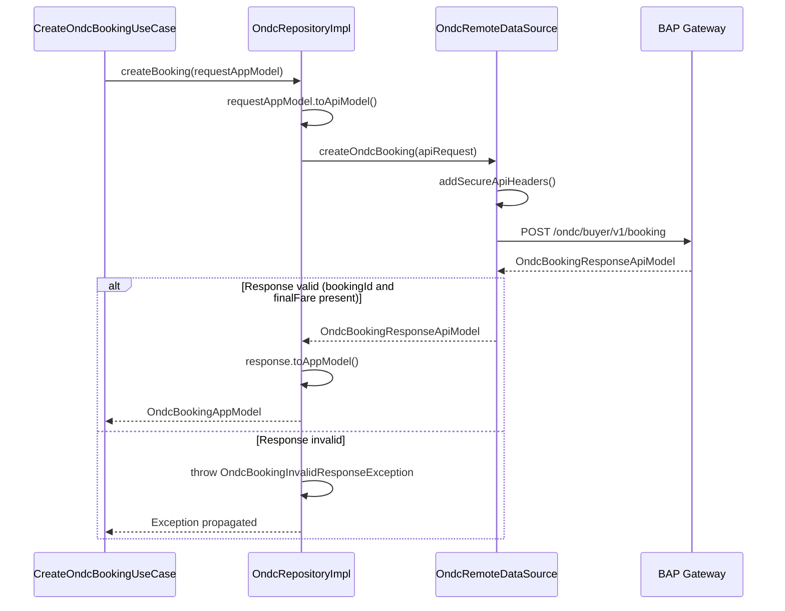

### Ticket Storage Flow

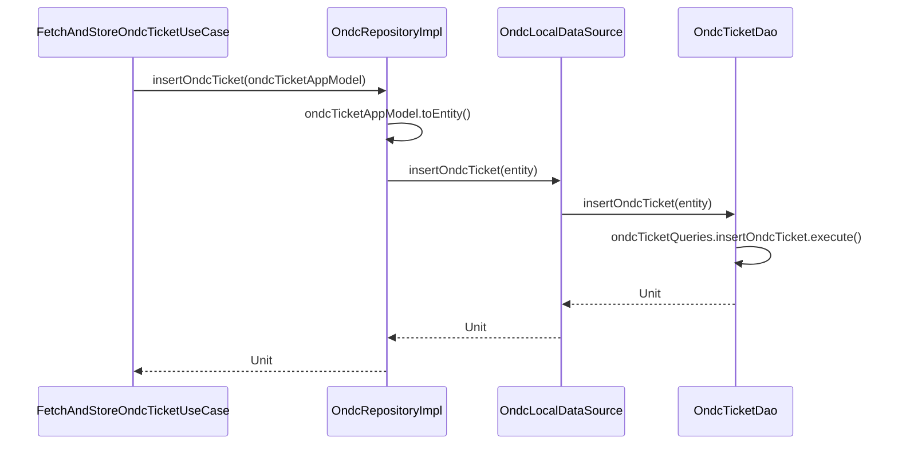

### Ticket Retrieval Flow

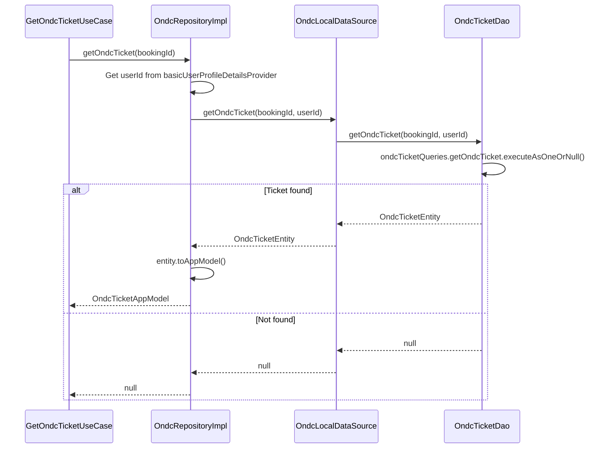

### All Tickets with Status Filter Flow

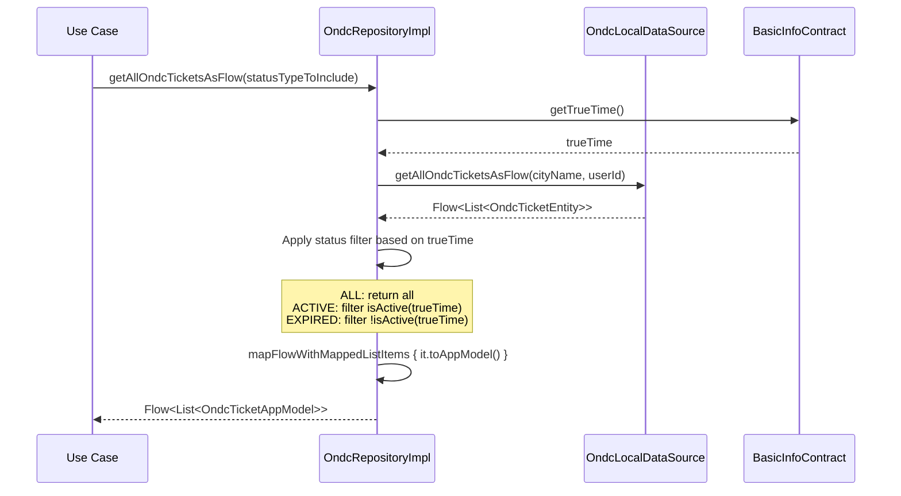

### Receipt Cache-First Flow

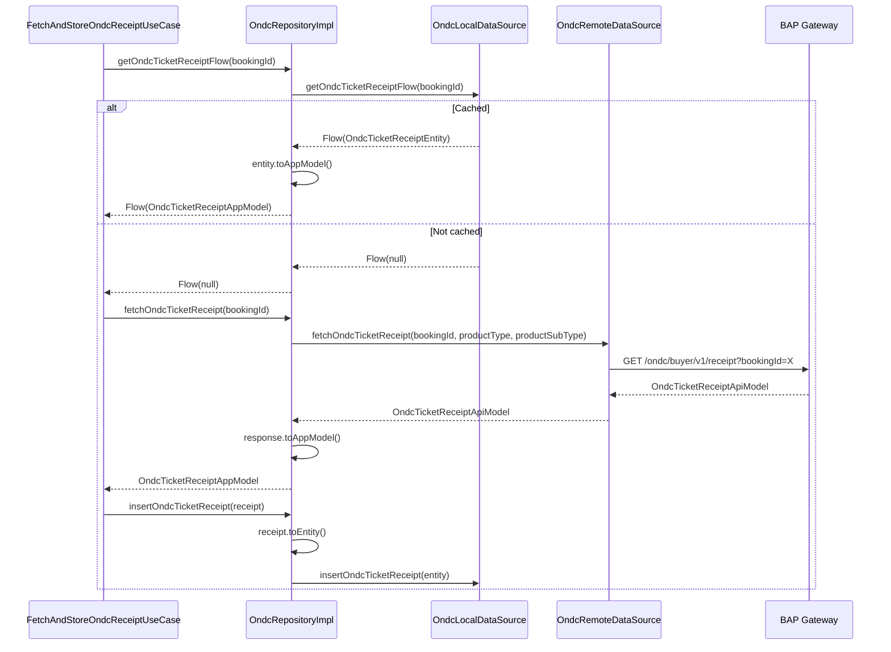

---

## Error Handling

### Exception Types

| Exception | Source | Description |
|-----------|--------|-------------|
| `OndcBookingInvalidResponseException` | Repository | Booking API returned invalid data (null bookingId or finalFare) |
| `OndcBookingReceiptInvalidResponseException` | Repository | Receipt API returned invalid data |
| `InvalidMetroLineStopListDataException` | Repository | Metro stops API returned invalid data |
| `MetroLineStopListFetchFailedException` | Remote | Metro stops API call failed |
| `InvalidFareResponseDataException` | Repository | Fare response validation failed |
| `ProductBookingRemoteDataException` | Remote | Remote API error with error code |
| `AvailableRoutesFetchFailedException` | Remote | Route search API call failed |
| `MobileTicketProductFetchFailedException` | Remote | Ticket fetch API call failed |

### Error Flow

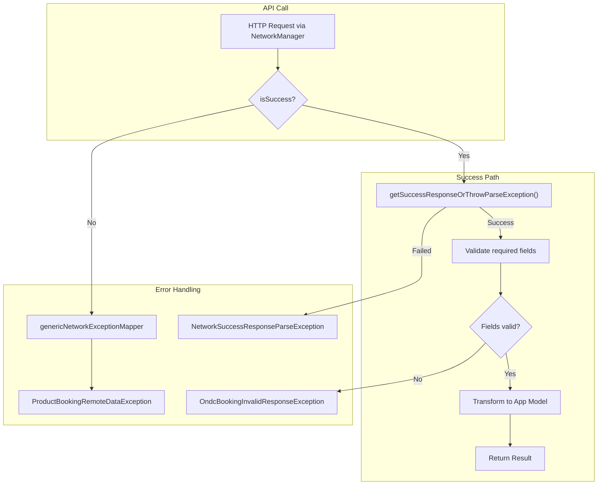

### API Model Validation

The `toAppModel()` functions validate required fields and return null for invalid data:

| Model | Validation | On Invalid |
|-------|------------|------------|
| `OndcBookingResponseApiModel.toAppModel()` | `bookingId`, `finalFare` must not be null | Returns null |
| `OndcTicketReceiptApiModel.toAppModel()` | `bookingId` must not be null | Returns null |
| `GenericMobileTicketProductApiResponseModel.toOndcTicketAppModelOrNullIfInvalid()` | `bookingId`, `userId`, `bookingTime`, `amount`, `status`, `city`, `expiryTime` must not be null | Returns null |

---

## Model Transformations

### OndcBookingResponseApiModel to AppModel

| API Field | App Field | Nullable | Default/Behavior |
|-----------|-----------|----------|------------------|
| `bookingId` | `bookingId` | No | Returns null if missing |
| `fareBreakup` | `fareBreakup` | Yes | Mapped to `FareBreakupAppModel` |
| `finalFare` | `finalFare` | No | Returns null if missing |
| `terms` | `termsAndConditions` | Yes | `emptyList()` |

### OndcTicketEntity to AppModel

| Entity Field | App Field | Transformation |
|--------------|-----------|----------------|
| `bookingId` | `bookingId` | Direct |
| `userId` | `userId` | Direct |
| `bookingTime` | `bookingTime` | Direct |
| `amount` | `amount` | Direct |
| `status` | `status` | Direct (already OndcTicketStatus) |
| `punchTime` | `punchTime` | Direct |
| `city` | `city` | Direct |
| `qrCode` | `qrCode` | Direct |
| `tone` | `tone` | Direct |
| `activationExpiryTime` | `activationExpiryTime` | `?: -1L` for null handling |
| `passengerDetails` | `passengerDetails` | Direct (Map) |
| `routeName` | `routeName` | Direct |
| `startStopName` | `startStopName` | Direct |
| `endStopName` | `endStopName` | Direct |
| `refundInfo` | `refundInfo` | Direct |
| `validationInfoEntityList` | `validationInfoList` | `map { it.toAppModel() }` |
| `fareBreakup` | `fareBreakup` | `map { it.toAppModel() } ?: emptyList()` |
| `ticketColorHex` | `ticketColorHex` | Direct |

### OndcTicketAppModel to Entity

| App Field | Entity Field | Transformation |
|-----------|--------------|----------------|
| All fields | Corresponding entity fields | Direct mapping, validation info uses `toEntity()` |

---

## Network Configuration

### Request Builder Pattern

The `OndcRemoteDataSourceImpl` uses `NetworkManager.getStandardNetworkRequestBuilder()` to construct requests:

```mermaid
flowchart LR
    Builder["getStandardNetworkRequestBuilder()"]
    SubUrl["subUrl(endpoint)"]
    Method["httpMethod(GET/POST)"]
    Body["body(requestModel)"]
    Query["queryParams(map)"]
    Headers["addSecureApiHeaders()"]
    Build["build()"]
    Process["processSync()"]

    Builder --> SubUrl --> Method --> Body --> Query --> Headers --> Build --> Process
```

### Endpoint Constants

Located in `OndcRemoteDataSourceImpl.Companion`:

| Constant | Value |
|----------|-------|
| `ROUTE_BETWEEN_STOPS_ENDPOINT` | `"ondc/buyer/v1/search/$PARAM_CITY_ID/routes"` |
| `FIND_FARE_SUB_URL` | `"ondc/buyer/v1/fare"` |
| `CREATE_BOOKING_SUB_URL` | `"ondc/buyer/v1/booking"` |
| `CREATE_ORDER_SUB_URL` | `"ondc/buyer/v1/mobile-ticket/order"` |
| `ONDC_TICKETS_BOOKING_SUB_URL` | `"ondc/buyer/v1/ticket"` |
| `ONDC_TICKETS_RECEIPT_SUB_URL` | `"ondc/buyer/v1/receipt"` |
| `ONDC_TICKETS_COMPLETE_PURCHASE_SUB_URL` | `"ondc/buyer/v1/confirm-purchase"` |
| `METRO_LINES_INFO` | `"ondc/buyer/v1/suggest/${PARAM_CITY_ID}/routes"` |
| `METRO_LINE_STOPS` | `"ondc/buyer/v1/route/${PARAM_CITY_ID}/stops"` |

---

## Product Type Constants

### OndcTicketConstants

Located in `shared/chalo-base/src/commonMain/kotlin/app/chalo/constants/OndcConstants.kt`

| Constant | Value | Description |
|----------|-------|-------------|
| `PRODUCT_TYPE` | `"mobileTicket"` | Mobile ticket category |
| `PRODUCT_SUB_TYPE` | `"ondcTicket"` | ONDC bus ticket subtype |

### OndcMetroTicketConstants

| Constant | Value | Description |
|----------|-------|-------------|
| `PRODUCT_NAME` | `"Single Journey Ticket"` | Display name |
| `PRODUCT_TYPE` | `"mobileTicket"` | Mobile ticket category |
| `PRODUCT_SUB_TYPE` | `"ondcMetroTicket"` | ONDC metro ticket subtype |

---

## Metro Support

The repository includes dedicated support for ONDC Metro tickets with separate entity types and API endpoints.

### Metro-Specific Local Data Source Methods

The `OndcLocalDataSourceImpl` delegates metro operations to `OndcMetroTicketDao`:

| Method | Delegation |
|--------|------------|
| `getOndcMetroTicket()` | `ondcMetroTicketDao.getMetroTicket()` |
| `getOndcMetroTicketAsFlow()` | `ondcMetroTicketDao.getMetroTicketAsFlow()` |
| `insertOndcMetroTicket()` | `ondcMetroTicketDao.insertMetroTicket()` |
| `deleteOndcMetroTickets()` | `ondcMetroTicketDao.deleteMetroTickets()` |
| `deleteExistingAndInsertNewMetroTickets()` | `ondcMetroTicketDao.deleteAllAndInsertNewTickets()` |

### Metro Data Flow

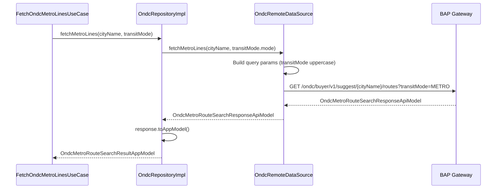

---

## Cache Lifecycle

### Ticket Cache

Tickets are cached with user and city scope.

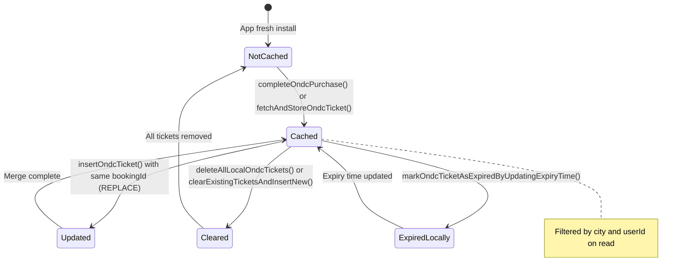

### Background Operations

The `clearExistingTicketsAndInsertNew()` method uses the repository's coroutine scope to perform deletion and insertion asynchronously:

```kotlin
coroutineScope.launch {
    deleteAllLocalOndcTickets()
    insertOndcTickets(ticketsList)
}
```

This prevents blocking the calling thread during bulk operations.
