# ONDC Bus -- UseCase Documentation

## Domain Layer Overview

The ONDC Bus domain layer implements a streamlined booking and ticket lifecycle through focused use cases. Unlike the HLD's conceptual ONDC protocol phases (search, select, init, confirm, status), the actual implementation consolidates these into practical operations: configuration fetching, booking creation, order creation, ticket fetching, and purchase completion. The use cases coordinate between the repository layer and presentation layer, handling error mapping and data transformation.

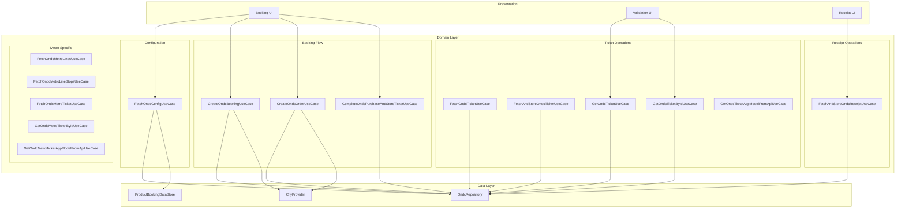

---

## UseCase Inventory

| UseCase | Module | File Path | Purpose |
|---------|--------|-----------|---------|
| `FetchOndcConfigUseCase` | productbooking | `domain/FetchOndcConfigUseCase.kt` | Retrieve ONDC product configuration |
| `CreateOndcBookingUseCase` | productbooking | `domain/CreateOndcBookingUseCase.kt` | Create ONDC booking with passenger details |
| `CreateOndcOrderUseCase` | productbooking | `domain/CreateOndcOrderUseCase.kt` | Create payment order for booking |
| `FetchOndcTicketUseCase` | productbooking | `domain/FetchOndcTicketUseCase.kt` | Fetch ticket by booking ID from API |
| `FetchAndStoreOndcTicketUseCase` | productbooking | `domain/FetchAndStoreOndcTicketUseCase.kt` | Fetch and cache ticket locally |
| `GetOndcTicketUseCase` | productbooking | `domain/GetOndcTicketUseCase.kt` | Get ticket from local storage |
| `GetOndcTicketByIdUseCase` | productbooking | `domain/GetOndcTicketByIdUseCase.kt` | Get ticket as Flow for reactive updates |
| `GetOndcTicketAppModelFromApiUseCase` | productbooking | `domain/GetOndcTicketAppModelFromApiUseCase.kt` | Transform API response to app model |
| `CompleteOndcPurchaseAndStoreTicketUseCase` | productbooking | `domain/CompleteOndcPurchaseAndStoreTicketUseCase.kt` | Finalize purchase and store ticket |
| `FetchAndStoreOndcReceiptUseCase` | productbooking | `domain/FetchAndStoreOndcReceiptUseCase.kt` | Fetch and cache ticket receipt |

---

## FetchOndcConfigUseCase

Retrieves the ONDC ticket product configuration from the product configs API and caches it locally for subsequent use. Located at `shared/productbooking/src/commonMain/kotlin/app/chalo/ondc/domain/FetchOndcConfigUseCase.kt`.

### Responsibility

Fetches product configurations filtered by ONDC ticket product subtype, validates that the configuration is active and visible, transforms it to the ONDC-specific configuration model, and persists it to the product booking datastore.

### Constructor Dependencies

| Dependency | Type | Purpose |
|------------|------|---------|
| `fetchProductConfigsForUiUseCase` | `FetchProductConfigsForUiUseCase` | Fetches raw product configs |
| `productBookingDataStore` | `ProductBookingDataStore` | Local config persistence |

### Flow Diagram

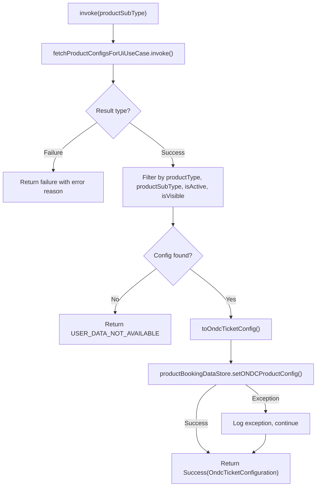

### Input Parameters

| Parameter | Type | Default | Description |
|-----------|------|---------|-------------|
| `productSubType` | String | `OndcTicketConstants.PRODUCT_SUB_TYPE` | Product subtype filter ("ondcTicket") |

### Output

| Type | Description |
|------|-------------|
| `ChaloUseCaseResult<OndcTicketConfiguration, FetchProductConfigForUiErrorReason>` | Configuration or error |

### Configuration Model

| Field | Type | Description |
|-------|------|-------------|
| `id` | String | Configuration identifier |
| `city` | String | City name |
| `name` | String | Product display name |
| `agency` | String | Transit agency name |
| `isActive` | Boolean | Whether product is active |
| `isVisible` | Boolean? | Whether product is visible in UI |
| `minAppVer` | Int? | Minimum app version required |
| `productType` | String | "mobileTicket" |
| `productSubType` | String | "ondcTicket" |
| `branding` | BrandingDetails | Branding configuration |
| `productValidationType` | ProductValidationType | Validation method type |

### Filter Criteria

The use case filters configurations with these conditions:
- `productType == "mobileTicket"`
- `productSubType == "ondcTicket"` (or specified)
- `isActive == true`
- `isVisible == true`

---

## CreateOndcBookingUseCase

Creates an ONDC booking by submitting passenger details, trip information, and customer contact to the booking API. Located at `shared/productbooking/src/commonMain/kotlin/app/chalo/ondc/domain/CreateOndcBookingUseCase.kt`.

### Responsibility

Constructs the booking request from app models, retrieves the current city context, submits to the repository, and handles error mapping for various exception types.

### Constructor Dependencies

| Dependency | Type | Purpose |
|------------|------|---------|
| `ondcRepository` | `OndcRepository` | Remote booking API access |
| `cityProvider` | `CityProvider` | Current city retrieval |

### Flow Diagram

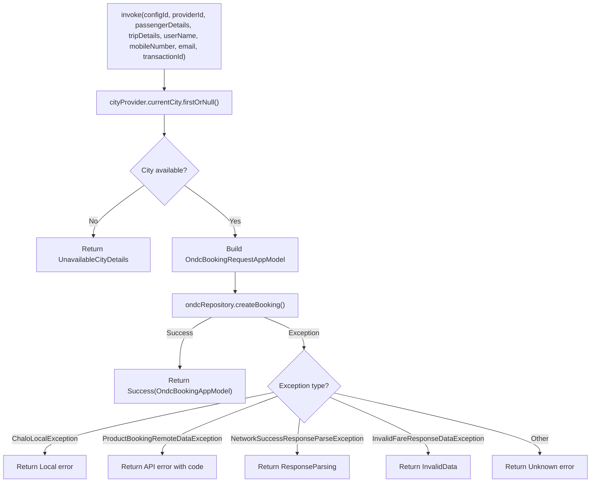

### Input Parameters

| Parameter | Type | Description |
|-----------|------|-------------|
| `configId` | String | ONDC product configuration ID |
| `providerId` | String | BPP provider identifier |
| `passengerDetails` | `List<PassengerDetailData>` | Passenger information list |
| `tripDetails` | `OndcTicketTripDetails` | Trip route and stop details |
| `userName` | String | Customer full name |
| `mobileNumber` | String | Customer phone number |
| `email` | String? | Optional customer email |
| `transactionId` | String | ONDC transaction identifier from route search |

### Trip Details Structure

| Field | Type | Description |
|-------|------|-------------|
| `startStopId` | String | Origin stop identifier |
| `endStopId` | String | Destination stop identifier |
| `routeId` | String? | Route identifier (optional) |
| `routeName` | String? | Route display name |
| `startStopName` | String? | Origin stop name |
| `endStopName` | String? | Destination stop name |
| `tripFulfillmentId` | String | ONDC fulfillment identifier |

### Output

| Type | Description |
|------|-------------|
| `ChaloUseCaseResult<OndcBookingAppModel, ProductBookingDataSourceError>` | Booking response or error |

### Booking Response

| Field | Type | Description |
|-------|------|-------------|
| `bookingId` | String | Created booking identifier |
| `fareBreakup` | `List<FareBreakupAppModel>?` | Fare breakdown components |
| `finalFare` | Int | Total fare amount |
| `termsAndConditions` | `List<String>` | T&C text list |

---

## CreateOndcOrderUseCase

Creates a payment order for an existing ONDC booking, enabling the checkout flow to proceed with payment processing. Located at `shared/productbooking/src/commonMain/kotlin/app/chalo/ondc/domain/CreateOndcOrderUseCase.kt`.

### Responsibility

Builds the order request with booking ID and total fare, submits to the repository, and returns the order creation response with payment details.

### Constructor Dependencies

| Dependency | Type | Purpose |
|------------|------|---------|
| `ondcRepository` | `OndcRepository` | Remote order API access |
| `cityProvider` | `CityProvider` | Current city retrieval |

### Flow Diagram

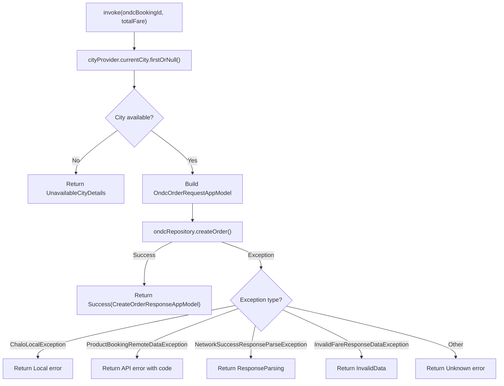

### Input Parameters

| Parameter | Type | Description |
|-----------|------|-------------|
| `ondcBookingId` | String | Booking ID from CreateOndcBookingUseCase |
| `totalFare` | Long | Total amount in subcurrency (paise) |

### Output

| Type | Description |
|------|-------------|
| `ChaloUseCaseResult<CreateOrderResponseAppModel, ProductBookingDataSourceError>` | Order response or error |

---

## CompleteOndcPurchaseAndStoreTicketUseCase

Finalizes an ONDC purchase after payment confirmation, fetches the generated ticket, and stores it locally for offline access. Located at `shared/productbooking/src/commonMain/kotlin/app/chalo/ondc/domain/CompleteOndcPurchaseAndStoreTicketUseCase.kt`.

### Responsibility

Calls the purchase completion endpoint, transforms the generic ticket response to ONDC-specific model, validates the ticket data, and persists to local storage.

### Constructor Dependencies

| Dependency | Type | Purpose |
|------------|------|---------|
| `ondcRepository` | `OndcRepository` | Remote and local data operations |
| `getOndcTicketAppModelFromApiUseCase` | `GetOndcTicketAppModelFromApiUseCase` | API response transformation |

### Flow Diagram

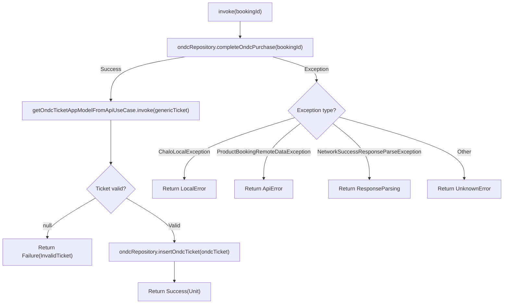

### Input Parameters

| Parameter | Type | Description |
|-----------|------|-------------|
| `bookingId` | String | Booking ID to complete purchase |

### Output

| Type | Description |
|------|-------------|
| `ChaloUseCaseResult<Unit, CompleteOndcPurchaseFailureReason>` | Success or failure reason |

### Failure Reasons

| Reason | Description |
|--------|-------------|
| `InvalidTicket` | Ticket transformation returned null |
| `ResponseParsing` | Failed to parse API response |
| `LocalError(msg)` | Local storage or network failure |
| `ApiError(msg)` | Remote API returned error |
| `UnknownError(msg)` | Unexpected exception |

---

## FetchOndcTicketUseCase

Fetches an ONDC ticket by booking ID from the remote API, validating the product type and subtype. Located at `shared/productbooking/src/commonMain/kotlin/app/chalo/ondc/domain/FetchOndcTicketUseCase.kt`.

### Responsibility

Calls the repository to fetch ticket data, validates that the returned ticket matches the requested booking ID, and returns the generic mobile ticket model for further processing.

### Constructor Dependencies

| Dependency | Type | Purpose |
|------------|------|---------|
| `ondcRepository` | `OndcRepository` | Remote ticket fetch |

### Flow Diagram

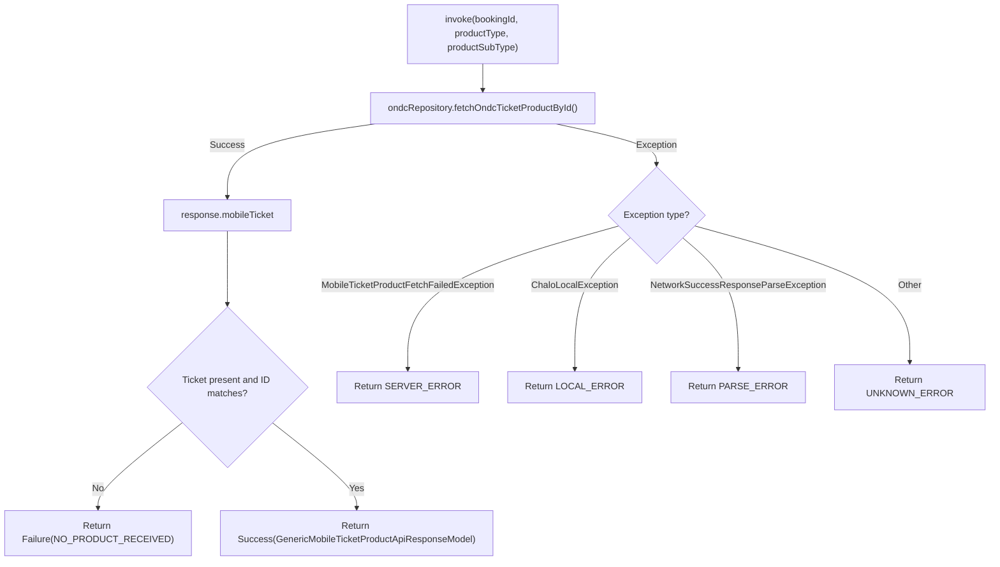

### Input Parameters

| Parameter | Type | Description |
|-----------|------|-------------|
| `bookingId` | String | Booking ID to fetch |
| `productType` | String | Expected product type ("mobileTicket") |
| `productSubType` | String | Expected product subtype ("ondcTicket") |

### Output

| Type | Description |
|------|-------------|
| `ChaloUseCaseResult<GenericMobileTicketProductApiResponseModel, MobileTicketByIdFetchFailedReason>` | Ticket or failure |

---

## FetchAndStoreOndcTicketUseCase

Orchestrates ticket fetching and local storage by combining FetchOndcTicketUseCase with ticket transformation and persistence. Located at `shared/productbooking/src/commonMain/kotlin/app/chalo/ondc/domain/FetchAndStoreOndcTicketUseCase.kt`.

### Responsibility

Fetches ticket using the fetch use case, transforms to app model using the transformation use case, inserts into local storage via repository, and maps fetch errors to storage-specific error types.

### Constructor Dependencies

| Dependency | Type | Purpose |
|------------|------|---------|
| `fetchOndcTicketUseCase` | `FetchOndcTicketUseCase` | Remote ticket fetch |
| `ondcRepository` | `OndcRepository` | Local ticket storage |
| `getOndcTicketAppModelFromApiUseCase` | `GetOndcTicketAppModelFromApiUseCase` | API to app model transformation |

### Flow Diagram

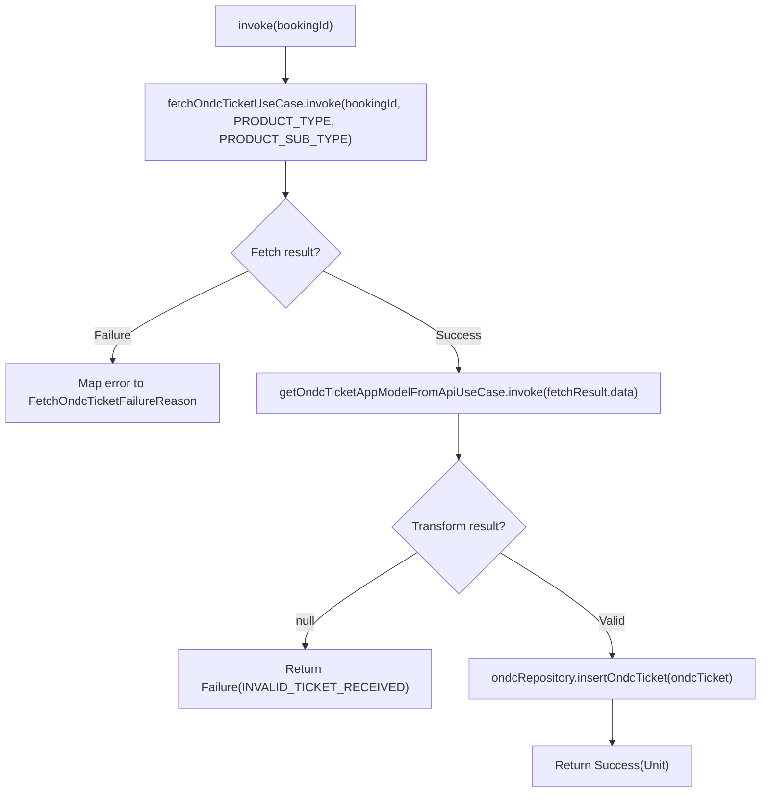

### Error Mapping

| Fetch Error | Storage Error |
|-------------|---------------|
| `NO_PRODUCT_RECEIVED` | `NO_TICKET_RECEIVED` |
| `SERVER_ERROR` | `SERVER_ERROR` |
| `LOCAL_ERROR` | `LOCAL_ERROR` |
| `UNKNOWN_ERROR` | `UNKNOWN_ERROR` |
| `PARSE_ERROR` | `PARSE_ERROR` |

---

## GetOndcTicketUseCase

Retrieves an ONDC ticket from local storage by booking ID, used for validation and display when offline. Located at `shared/productbooking/src/commonMain/kotlin/app/chalo/ondc/domain/GetOndcTicketUseCase.kt`.

### Responsibility

Queries the repository for locally cached ticket data and returns it wrapped in a result type.

### Constructor Dependencies

| Dependency | Type | Purpose |
|------------|------|---------|
| `ondcRepository` | `OndcRepository` | Local ticket query |

### Flow Diagram

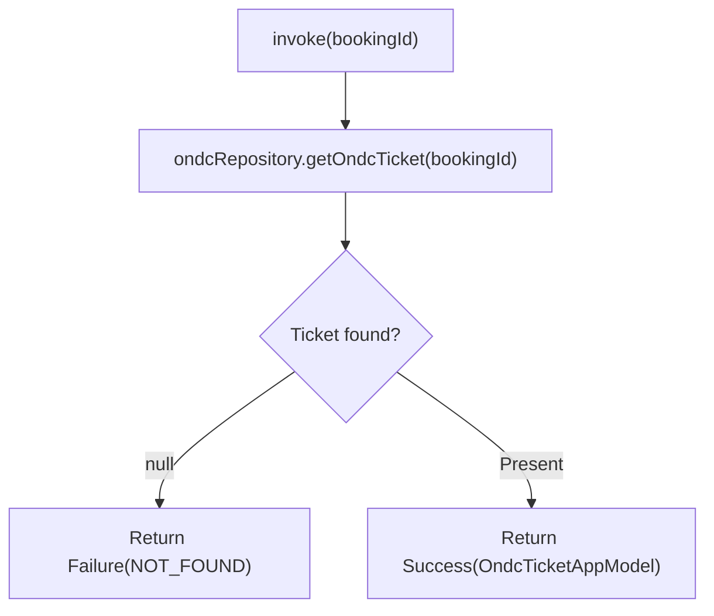

### Output

| Type | Description |
|------|-------------|
| `ChaloUseCaseResult<OndcTicketAppModel, OndcTicketStatus>` | Ticket or NOT_FOUND |

---

## GetOndcTicketByIdUseCase

Provides a reactive Flow of ticket data for a specific booking ID, enabling UI to observe ticket changes. Located at `shared/productbooking/src/commonMain/kotlin/app/chalo/ondc/domain/GetOndcTicketByIdUseCase.kt`.

### Responsibility

Returns a Flow from the repository that emits ticket updates, useful for real-time UI updates during validation when ticket state changes (e.g., from ACTIVE to PUNCHED).

### Constructor Dependencies

| Dependency | Type | Purpose |
|------------|------|---------|
| `ondcRepository` | `OndcRepository` | Reactive ticket query |

### Implementation

The use case is minimal, delegating directly to the repository:

```kotlin
class GetOndcTicketByIdUseCase(private val ondcRepository: OndcRepository) {
    operator fun invoke(bookingId: String): Flow<OndcTicketAppModel?> {
        return ondcRepository.getOndcTicketAsFlow(bookingId)
    }
}
```

### Output

| Type | Description |
|------|-------------|
| `Flow<OndcTicketAppModel?>` | Reactive ticket stream, emits null if not found |

---

## GetOndcTicketAppModelFromApiUseCase

Transforms generic mobile ticket API responses to ONDC-specific app models with validation. Located at `shared/productbooking/src/commonMain/kotlin/app/chalo/ondc/domain/GetOndcTicketAppModelFromApiUseCase.kt`.

### Responsibility

Validates that the API response matches ONDC ticket product type and subtype, then transforms to the typed app model or returns null if invalid.

### Transformation Flow

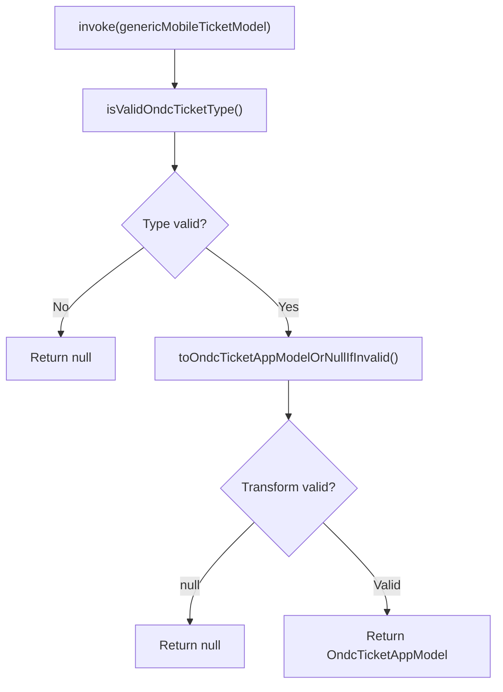

### Type Validation

| Field | Expected Value |
|-------|----------------|
| `productType` | `"mobileTicket"` (OndcTicketConstants.PRODUCT_TYPE) |
| `productSubType` | `"ondcTicket"` (OndcTicketConstants.PRODUCT_SUB_TYPE) |

### Transformation Mapping

| API Field | App Model Field | Required |
|-----------|-----------------|----------|
| `bookingId` | `bookingId` | Yes |
| `userId` | `userId` | Yes |
| `bookingTime` | `bookingTime` | Yes |
| `amount` | `amount` | Yes |
| `status` | `status` (enum conversion) | Yes |
| `punchTime` | `punchTime` | No |
| `city` | `city` (lowercased) | Yes |
| `qrCode` | `qrCode` | No |
| `tone` | `tone` | No |
| `expiryTime` | `activationExpiryTime` | Yes |
| `passengerDetails` | `passengerDetails` (map) | No |
| `routeName` | `routeName` | No |
| `fromStopDetails.name` | `startStopName` | No |
| `toStopDetails.name` | `endStopName` | No |
| `refundInfo` | `refundInfo` | No |
| `validationEntities` | `validationInfoList` | No |
| `fareBreakup` | `fareBreakup` | No |
| `ticketColorSchemeHex` | `ticketColorHex` | No |

---

## FetchAndStoreOndcReceiptUseCase

Retrieves ticket receipt data, checking local cache first then fetching from API if needed. Located at `shared/productbooking/src/commonMain/kotlin/app/chalo/ondc/domain/FetchAndStoreOndcReceiptUseCase.kt`.

### Responsibility

Queries local cache for receipt, fetches from remote if not cached, validates receipt matches booking ID, caches fetched receipt, and returns receipt data for display.

### Constructor Dependencies

| Dependency | Type | Purpose |
|------------|------|---------|
| `ondcRepository` | `OndcRepository` | Local and remote receipt access |

### Flow Diagram

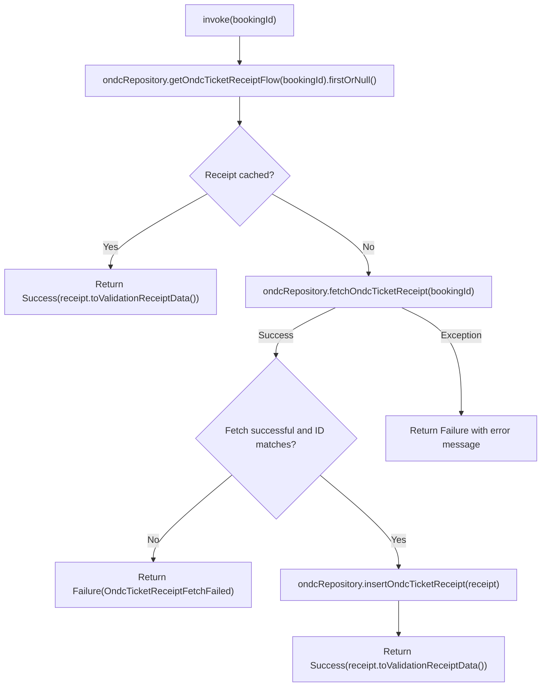

### Exception Handling

| Exception Type | Handling |
|----------------|----------|
| `OndcBookingReceiptInvalidResponseException` | Return failure with message |
| `ChaloLocalException` | Return failure with message |
| `NetworkSuccessResponseParseException` | Return failure with message |
| `Exception` (generic) | Return failure with message |

### Receipt Validation

The use case includes a private helper method `isRelevantReceipt()` that validates:
- `bookingId` matches the requested booking
- `productType` equals `OndcTicketConstants.PRODUCT_TYPE`
- `productSubType` equals `OndcTicketConstants.PRODUCT_SUB_TYPE`

### Output

| Type | Description |
|------|-------------|
| `ChaloUseCaseResult<ProductReceiptData, ReceiptFetchError>` | Receipt or error |

### Error Class

```kotlin
class OndcTicketReceiptFetchFailed(val msg: String) : ReceiptFetchError
```

---

## Metro-Specific Use Cases

The ONDC module includes dedicated use cases for metro ticket operations with similar patterns but metro-specific constants.

### FetchOndcMetroLinesUseCase

Fetches available metro lines for the current city.

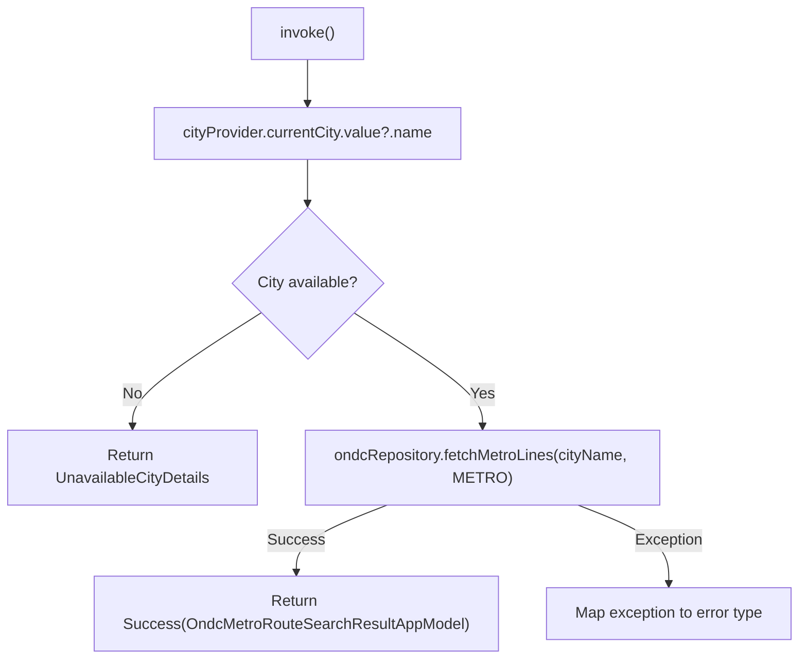

### FetchOndcMetroLineStopsUseCase

Fetches stops for a specific metro line.

| Parameter | Type | Description |
|-----------|------|-------------|
| `routeId` | String | Metro line route identifier |

| Output | Description |
|--------|-------------|
| `ChaloUseCaseResult<List<StopAppModel>, ProductBookingDataSourceError>` | Stop list or error |

### GetOndcMetroTicketByIdUseCase

Similar to `GetOndcTicketByIdUseCase` but for metro tickets.

| Output | Description |
|--------|-------------|
| `Flow<OndcMetroTicketAppModel?>` | Reactive metro ticket stream |

### GetOndcMetroTicketAppModelFromApiUseCase

Transforms generic API response to metro-specific app model with metro product type validation.

| Type Validation | Value |
|-----------------|-------|
| `productType` | `"mobileTicket"` |
| `productSubType` | `"ondcMetroTicket"` |

---

## Error Handling Strategy

### Exception to Error Mapping

All use cases follow a consistent error mapping pattern.

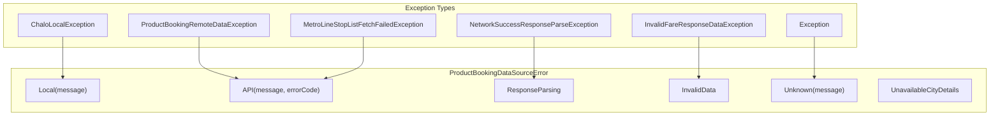

### Error Categories

| Category | Cause | Recovery |
|----------|-------|----------|
| `UnavailableCityDetails` | No city in context | Prompt user to select city |
| `Local` | Device storage/network issue | Retry or go offline |
| `API` | Server returned error | Show error message, retry |
| `ResponseParsing` | Malformed server response | Retry or report issue |
| `InvalidData` | Data validation failed | Retry with different parameters |
| `Unknown` | Unexpected error | Log and show generic message |

---

## Sequence Diagrams

### Complete Booking Flow

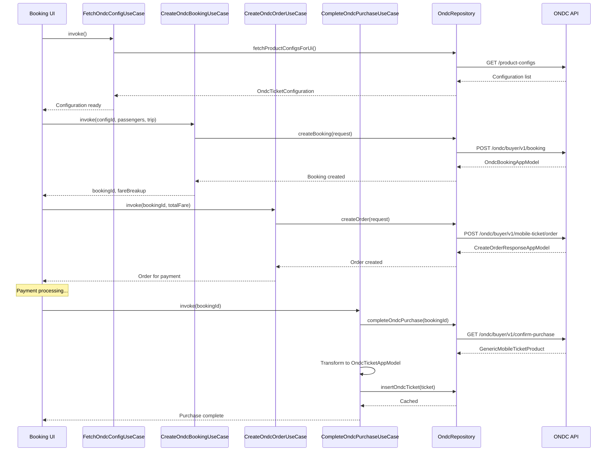

### Ticket Retrieval Flow

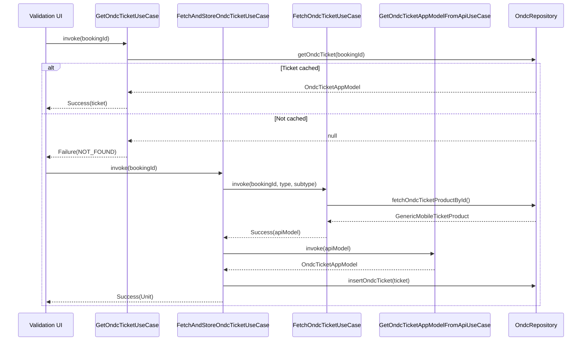

### Receipt Fetch Flow

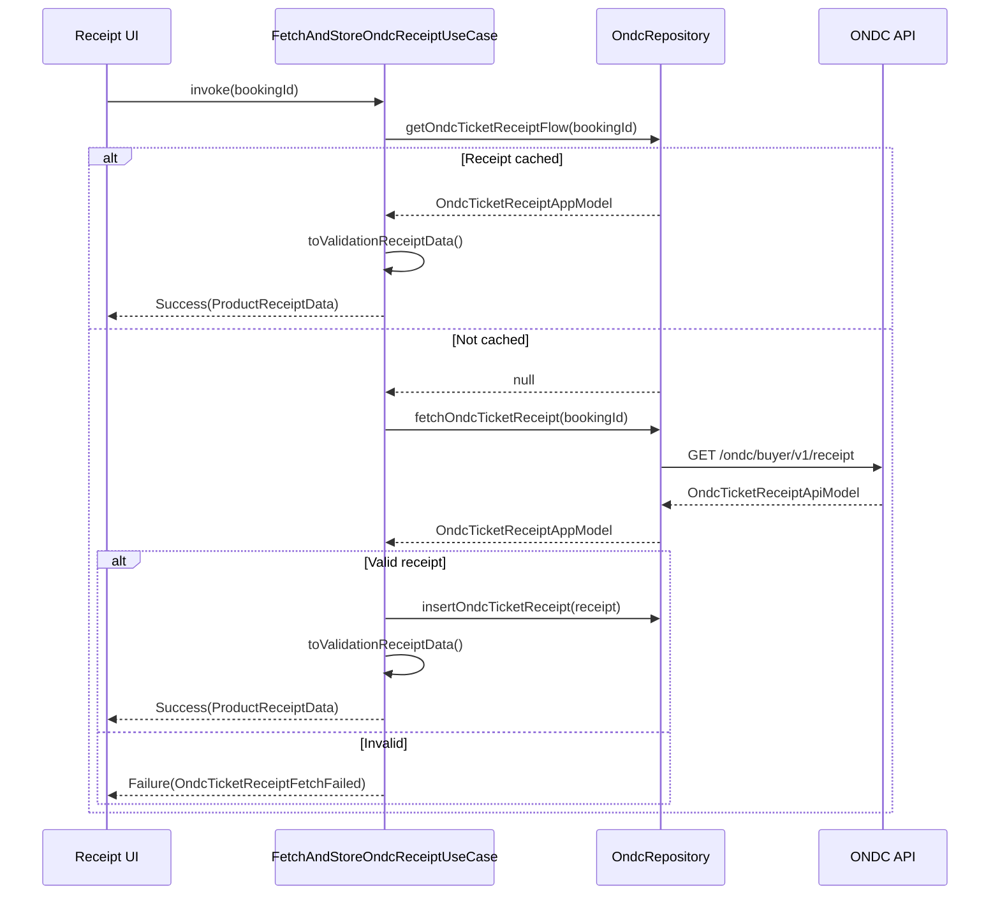

---

## Business Rules

| Rule | Use Case | Enforcement |
|------|----------|-------------|
| **City required** | CreateOndcBookingUseCase, CreateOndcOrderUseCase | Check city provider before API call |
| **Config active and visible** | FetchOndcConfigUseCase | Filter inactive/hidden configs |
| **Product type validation** | GetOndcTicketAppModelFromApiUseCase | Reject mismatched product types |
| **Booking ID match** | FetchOndcTicketUseCase, FetchAndStoreOndcReceiptUseCase | Validate response ID matches request |
| **Cache-first receipts** | FetchAndStoreOndcReceiptUseCase | Query cache before network |
| **Transit mode filter** | FetchOndcMetroLinesUseCase | Always use METRO mode for metro calls |
| **Transform validation** | CompleteOndcPurchaseAndStoreTicketUseCase | Fail if transformation returns null |

---

## Dependencies

### Common Dependencies

| Dependency | Purpose |
|------------|---------|
| `OndcRepository` | Data access abstraction |
| `CityProvider` | Current city context via `currentCity` Flow |
| `ChaloUseCaseResult` | Standardized result wrapper with Success/Failure |

### Use Case Specific

| Use Case | Additional Dependencies |
|----------|------------------------|
| `FetchOndcConfigUseCase` | `FetchProductConfigsForUiUseCase`, `ProductBookingDataStore` |
| `FetchAndStoreOndcTicketUseCase` | `FetchOndcTicketUseCase`, `GetOndcTicketAppModelFromApiUseCase` |
| `CompleteOndcPurchaseAndStoreTicketUseCase` | `GetOndcTicketAppModelFromApiUseCase` |

---

## ChaloUseCaseResult Pattern

All use cases return `ChaloUseCaseResult<T, E>` which is a sealed class with two variants:

| Variant | Description |
|---------|-------------|
| `Success<T>` | Contains the successful result data |
| `Failure<E>` | Contains the error reason |

This pattern enables exhaustive handling in calling code via when expressions and ensures errors are always explicitly handled rather than thrown as exceptions.
